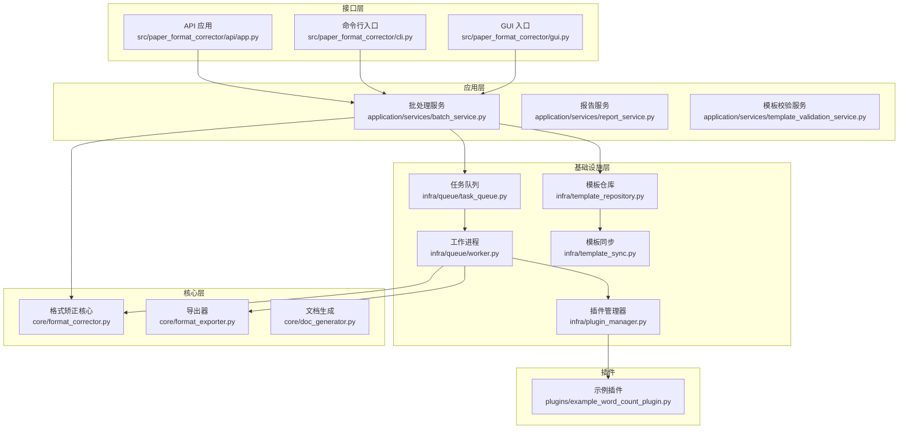
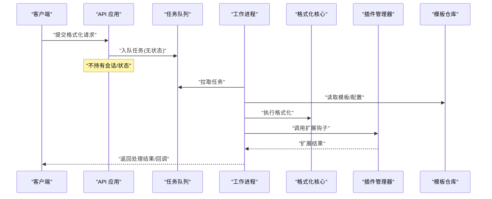
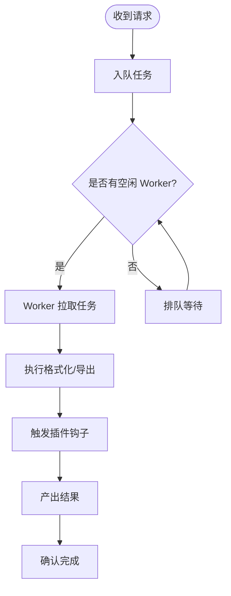
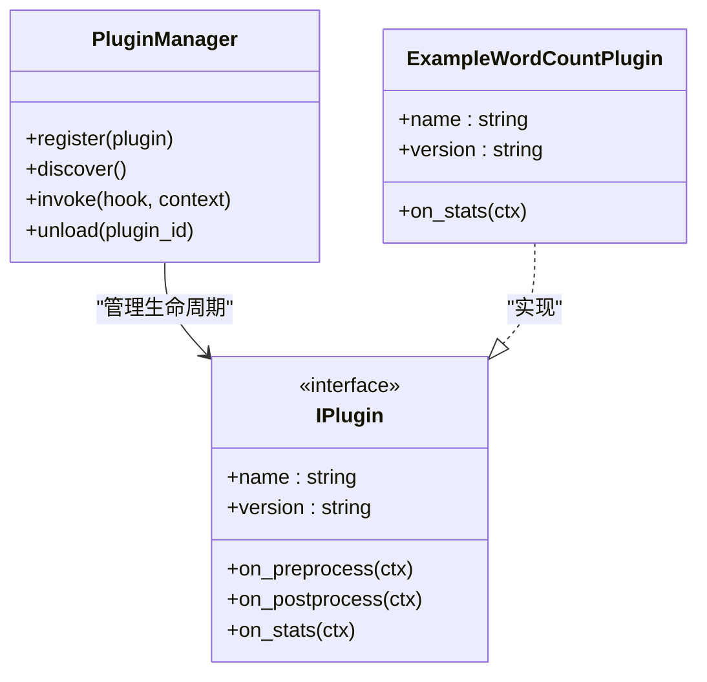
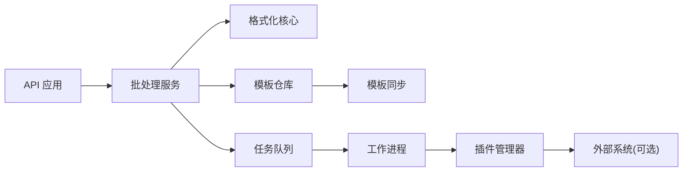

# 扩展性设计

<cite>
**本文引用的文件**   
- [src/paper_format_corrector/app.py](file://src/paper_format_corrector/app.py)
- [src/paper_format_corrector/api/app.py](file://src/paper_format_corrector/api/app.py)
- [src/paper_format_corrector/infra/queue/task_queue.py](file://src/paper_format_corrector/infra/queue/task_queue.py)
- [src/paper_format_corrector/infra/queue/worker.py](file://src/paper_format_corrector/infra/queue/worker.py)
- [src/paper_format_corrector/infra/plugin_manager.py](file://src/paper_format_corrector/infra/plugin_manager.py)
- [plugins/example_word_count_plugin.py](file://plugins/example_word_count_plugin.py)
- [src/paper_format_corrector/application/services/batch_service.py](file://src/paper_format_corrector/application/services/batch_service.py)
- [src/paper_format_corrector/core/format_corrector.py](file://src/paper_format_corrector/core/format_corrector.py)
- [src/paper_format_corrector/infra/template_repository.py](file://src/paper_format_corrector/infra/template_repository.py)
- [src/paper_format_corrector/infra/template_sync.py](file://src/paper_format_corrector/infra/template_sync.py)
- [config/config.yaml](file://config/config.yaml)
- [pyproject.toml](file://pyproject.toml)
- [.github/workflows/ci.yml](file://.github/workflows/ci.yml)
</cite>

## 目录
1. [引言](#引言)
2. [项目结构](#项目结构)
3. [核心组件](#核心组件)
4. [架构总览](#架构总览)
5. [详细组件分析](#详细组件分析)
6. [依赖分析](#依赖分析)
7. [性能与容量规划](#性能与容量规划)
8. [故障排查指南](#故障排查指南)
9. [结论](#结论)
10. [附录](#附录)

## 引言
本文件面向“论文格式矫正工具”的扩展性设计，围绕水平扩展、垂直扩展、无状态服务、会话管理、数据分片、插件架构（钩子机制、接口抽象、依赖注入）、微服务化改造、容器化与云原生适配、扩缩容自动化等主题进行系统化阐述。文档以现有代码为基础，给出可落地的演进路径与实施建议，帮助读者在不破坏既有能力的前提下，逐步构建高可扩展的系统。

## 项目结构
从扩展性视角，当前仓库采用分层与领域驱动相结合的组织方式：
- 应用层：业务编排与服务入口（批处理、报告生成、模板校验等）
- 核心层：格式化、导出、转换等通用能力
- 基础设施层：队列、插件、模板仓库、同步、外部工具集成
- 接口层：API、CLI、桌面端、Web 前端
- 插件目录：独立的可插拔扩展点
- 配置与制品：配置文件、CI、打包脚本

图表来源
- [src/paper_format_corrector/api/app.py](file://src/paper_format_corrector/api/app.py)
- [src/paper_format_corrector/application/services/batch_service.py](file://src/paper_format_corrector/application/services/batch_service.py)
- [src/paper_format_corrector/core/format_corrector.py](file://src/paper_format_corrector/core/format_corrector.py)
- [src/paper_format_corrector/infra/queue/task_queue.py](file://src/paper_format_corrector/infra/queue/task_queue.py)
- [src/paper_format_corrector/infra/queue/worker.py](file://src/paper_format_corrector/infra/queue/worker.py)
- [src/paper_format_corrector/infra/plugin_manager.py](file://src/paper_format_corrector/infra/plugin_manager.py)
- [plugins/example_word_count_plugin.py](file://plugins/example_word_count_plugin.py)
- [src/paper_format_corrector/infra/template_repository.py](file://src/paper_format_corrector/infra/template_repository.py)
- [src/paper_format_corrector/infra/template_sync.py](file://src/paper_format_corrector/infra/template_sync.py)

章节来源
- [src/paper_format_corrector/app.py](file://src/paper_format_corrector/app.py)
- [src/paper_format_corrector/api/app.py](file://src/paper_format_corrector/api/app.py)
- [src/paper_format_corrector/application/services/batch_service.py](file://src/paper_format_corrector/application/services/batch_service.py)
- [src/paper_format_corrector/core/format_corrector.py](file://src/paper_format_corrector/core/format_corrector.py)
- [src/paper_format_corrector/infra/queue/task_queue.py](file://src/paper_format_corrector/infra/queue/task_queue.py)
- [src/paper_format_corrector/infra/queue/worker.py](file://src/paper_format_corrector/infra/queue/worker.py)
- [src/paper_format_corrector/infra/plugin_manager.py](file://src/paper_format_corrector/infra/plugin_manager.py)
- [plugins/example_word_count_plugin.py](file://plugins/example_word_count_plugin.py)
- [src/paper_format_corrector/infra/template_repository.py](file://src/paper_format_corrector/infra/template_repository.py)
- [src/paper_format_corrector/infra/template_sync.py](file://src/paper_format_corrector/infra/template_sync.py)

## 核心组件
- 任务队列与工作进程：通过异步队列将请求解耦为任务，由多进程/多线程 Worker 消费，天然支持水平扩展。
- 插件管理器：提供统一的插件发现、加载与生命周期管理，便于横向扩展功能面。
- 批处理服务：聚合格式化、导出、报告生成等流程，作为应用层编排中心。
- 模板仓库与同步：集中化管理模板资源，支持远程拉取与本地缓存，利于多实例共享。
- API 应用：对外暴露 HTTP 接口，作为无状态网关或服务入口。

章节来源
- [src/paper_format_corrector/infra/queue/task_queue.py](file://src/paper_format_corrector/infra/queue/task_queue.py)
- [src/paper_format_corrector/infra/queue/worker.py](file://src/paper_format_corrector/infra/queue/worker.py)
- [src/paper_format_corrector/infra/plugin_manager.py](file://src/paper_format_corrector/infra/plugin_manager.py)
- [src/paper_format_corrector/application/services/batch_service.py](file://src/paper_format_corrector/application/services/batch_service.py)
- [src/paper_format_corrector/infra/template_repository.py](file://src/paper_format_corrector/infra/template_repository.py)
- [src/paper_format_corrector/infra/template_sync.py](file://src/paper_format_corrector/infra/template_sync.py)
- [src/paper_format_corrector/api/app.py](file://src/paper_format_corrector/api/app.py)

## 架构总览
下图展示从请求到处理的端到端流程，体现无状态服务、队列削峰、Worker 并行、插件扩展与模板共享等关键特性。

图表来源
- [src/paper_format_corrector/api/app.py](file://src/paper_format_corrector/api/app.py)
- [src/paper_format_corrector/infra/queue/task_queue.py](file://src/paper_format_corrector/infra/queue/task_queue.py)
- [src/paper_format_corrector/infra/queue/worker.py](file://src/paper_format_corrector/infra/queue/worker.py)
- [src/paper_format_corrector/core/format_corrector.py](file://src/paper_format_corrector/core/format_corrector.py)
- [src/paper_format_corrector/infra/plugin_manager.py](file://src/paper_format_corrector/infra/plugin_manager.py)
- [src/paper_format_corrector/infra/template_repository.py](file://src/paper_format_corrector/infra/template_repository.py)

## 详细组件分析

### 任务队列与工作进程（水平扩展基础）
- 职责分离：API 仅负责接收请求并投递任务；Worker 专注执行，实现无状态服务。
- 并发模型：多 Worker 实例并行消费，按队列长度动态伸缩。
- 幂等与重试：任务应包含唯一 ID，失败可重试，避免重复处理。
- 背压与限流：结合队列深度与 Worker 资源设置阈值，防止雪崩。

图表来源
- [src/paper_format_corrector/infra/queue/task_queue.py](file://src/paper_format_corrector/infra/queue/task_queue.py)
- [src/paper_format_corrector/infra/queue/worker.py](file://src/paper_format_corrector/infra/queue/worker.py)

章节来源
- [src/paper_format_corrector/infra/queue/task_queue.py](file://src/paper_format_corrector/infra/queue/task_queue.py)
- [src/paper_format_corrector/infra/queue/worker.py](file://src/paper_format_corrector/infra/queue/worker.py)

### 插件架构（钩子、接口抽象、依赖注入）
- 钩子机制：在关键处理阶段（如预处理、后处理、统计上报）暴露扩展点，插件按需注册。
- 接口抽象：定义统一插件接口（名称、版本、能力描述、生命周期方法），保证可替换与可组合。
- 依赖注入：通过插件管理器注入上下文（配置、日志、模板仓库、队列客户端），降低耦合。
- 热插拔：支持运行时加载/卸载，配合配置中心实现灰度发布。

图表来源
- [src/paper_format_corrector/infra/plugin_manager.py](file://src/paper_format_corrector/infra/plugin_manager.py)
- [plugins/example_word_count_plugin.py](file://plugins/example_word_count_plugin.py)

章节来源
- [src/paper_format_corrector/infra/plugin_manager.py](file://src/paper_format_corrector/infra/plugin_manager.py)
- [plugins/example_word_count_plugin.py](file://plugins/example_word_count_plugin.py)

### 批处理服务（应用编排）
- 职责：协调模板加载、规则解析、格式化、导出与报告生成。
- 扩展点：通过插件钩子接入自定义规则或输出适配器。
- 可观测性：埋点指标（耗时、成功率、错误码）便于监控与告警。

章节来源
- [src/paper_format_corrector/application/services/batch_service.py](file://src/paper_format_corrector/application/services/batch_service.py)
- [src/paper_format_corrector/core/format_corrector.py](file://src/paper_format_corrector/core/format_corrector.py)

### 模板仓库与同步（共享状态）
- 模板仓库：集中存储与版本管理模板，供所有实例共享。
- 同步策略：增量同步、冲突解决、缓存失效策略。
- 一致性：最终一致即可满足大多数场景，必要时引入强一致读路径。

章节来源
- [src/paper_format_corrector/infra/template_repository.py](file://src/paper_format_corrector/infra/template_repository.py)
- [src/paper_format_corrector/infra/template_sync.py](file://src/paper_format_corrector/infra/template_sync.py)

### API 应用（无状态服务）
- 无状态：不保存会话与用户态数据，所有状态外置（队列、对象存储、数据库）。
- 会话管理：使用外部会话存储（如 Redis）或基于 Token 的无状态鉴权。
- 安全与限流：网关层做鉴权、速率限制与熔断。

章节来源
- [src/paper_format_corrector/api/app.py](file://src/paper_format_corrector/api/app.py)

## 依赖分析
- 内部依赖：API -> 批处理服务 -> 核心格式化/导出 -> 插件管理器 -> 模板仓库/同步 -> 队列/工作进程。
- 外部依赖：对象存储（模板/产物）、消息队列（任务分发）、缓存与会话存储（可选）、数据库（元数据/审计）。
- 潜在循环：确保插件与核心之间通过接口隔离，避免直接双向引用。

图表来源
- [src/paper_format_corrector/api/app.py](file://src/paper_format_corrector/api/app.py)
- [src/paper_format_corrector/application/services/batch_service.py](file://src/paper_format_corrector/application/services/batch_service.py)
- [src/paper_format_corrector/core/format_corrector.py](file://src/paper_format_corrector/core/format_corrector.py)
- [src/paper_format_corrector/infra/template_repository.py](file://src/paper_format_corrector/infra/template_repository.py)
- [src/paper_format_corrector/infra/template_sync.py](file://src/paper_format_corrector/infra/template_sync.py)
- [src/paper_format_corrector/infra/queue/task_queue.py](file://src/paper_format_corrector/infra/queue/task_queue.py)
- [src/paper_format_corrector/infra/queue/worker.py](file://src/paper_format_corrector/infra/queue/worker.py)
- [src/paper_format_corrector/infra/plugin_manager.py](file://src/paper_format_corrector/infra/plugin_manager.py)

章节来源
- [src/paper_format_corrector/api/app.py](file://src/paper_format_corrector/api/app.py)
- [src/paper_format_corrector/application/services/batch_service.py](file://src/paper_format_corrector/application/services/batch_service.py)
- [src/paper_format_corrector/core/format_corrector.py](file://src/paper_format_corrector/core/format_corrector.py)
- [src/paper_format_corrector/infra/template_repository.py](file://src/paper_format_corrector/infra/template_repository.py)
- [src/paper_format_corrector/infra/template_sync.py](file://src/paper_format_corrector/infra/template_sync.py)
- [src/paper_format_corrector/infra/queue/task_queue.py](file://src/paper_format_corrector/infra/queue/task_queue.py)
- [src/paper_format_corrector/infra/queue/worker.py](file://src/paper_format_corrector/infra/queue/worker.py)
- [src/paper_format_corrector/infra/plugin_manager.py](file://src/paper_format_corrector/infra/plugin_manager.py)

## 性能与容量规划
- 水平扩展
  - 目标：通过增加 Worker 实例线性提升吞吐。
  - 指标：队列积压长度、Worker CPU/内存利用率、P95/P99 延迟、错误率。
  - 扩容策略：基于队列深度与 CPU 阈值的自动扩缩容（HPA/VPA）。
- 垂直扩展
  - 目标：提升单实例处理能力（更多 CPU/内存、更快的磁盘 IO）。
  - 适用：CPU 密集型格式化任务、大文档处理。
- 数据分片
  - 文档级分片：按文档 ID 哈希路由至不同分区/节点，避免跨节点锁竞争。
  - 模板/配置分片：按机构/学院维度划分，减少热点。
- 容量规划
  - 基线测试：在典型文档规模下测量单实例吞吐与资源占用。
  - 峰值预估：考虑活动用户数、平均文档大小、批量作业比例。
  - 弹性预留：保留 20%-30% 冗余应对突发流量。
- 扩缩容自动化
  - 指标采集：Prometheus/Grafana 收集队列深度、延迟、错误率。
  - 策略：队列深度 > 阈值且持续 N 分钟则扩容；低于低水位则缩容。
  - 滚动更新：蓝绿/金丝雀发布，零停机升级。

[本节为通用指导，无需具体文件来源]

## 故障排查指南
- 常见问题
  - 队列堆积：检查 Worker 数量、任务复杂度、下游依赖可用性。
  - 插件异常：查看插件日志与钩子返回值，确认依赖注入是否完整。
  - 模板不一致：核对模板仓库版本与同步状态，清理本地缓存。
- 定位手段
  - 链路追踪：为每个任务分配 TraceID，贯穿 API -> 队列 -> Worker -> 插件。
  - 指标看板：关注 P95/P99 延迟、错误码分布、GC 停顿、IO 等待。
  - 日志规范：结构化日志，包含任务 ID、模板版本、插件名、耗时。
- 恢复策略
  - 重试与退避：对瞬时错误采用指数退避重试。
  - 死信队列：失败多次的任务进入死信队列，人工介入。
  - 降级：关闭非核心插件或跳过可选步骤保障主流程。

章节来源
- [src/paper_format_corrector/infra/queue/task_queue.py](file://src/paper_format_corrector/infra/queue/task_queue.py)
- [src/paper_format_corrector/infra/queue/worker.py](file://src/paper_format_corrector/infra/queue/worker.py)
- [src/paper_format_corrector/infra/plugin_manager.py](file://src/paper_format_corrector/infra/plugin_manager.py)
- [src/paper_format_corrector/infra/template_repository.py](file://src/paper_format_corrector/infra/template_repository.py)

## 结论
通过将 API 设计为无状态、引入队列与工作进程、建立插件体系与共享模板仓库，系统已具备良好的水平扩展基础。下一步建议完善可观测性与自动化扩缩容，逐步推进微服务化拆分，并以数据分片与缓存策略优化热点与延迟，最终达成高可用、高扩展的云原生架构。

[本节为总结性内容，无需具体文件来源]

## 附录

### 微服务化改造建议
- 服务边界
  - 格式化服务：核心算法与规则引擎
  - 模板服务：模板管理与同步
  - 插件市场：插件注册、发现与版本管理
  - 任务编排服务：队列与调度
  - 网关服务：鉴权、限流、路由
- 通信协议
  - 内部：gRPC/HTTP+JSON，统一错误码与超时控制
  - 外部：REST/GraphQL，OpenAPI 契约
- 数据同步
  - 模板：CDC 或事件总线驱动增量同步
  - 配置：配置中心推送，客户端本地缓存

[本节为概念性内容，无需具体文件来源]

### 容器化与云原生适配
- 容器镜像
  - 最小化基础镜像，多阶段构建，固定依赖版本
  - 健康检查端点与就绪探针
- 编排部署
  - Kubernetes Deployment/StatefulSet，HPA 基于队列深度/CPU 扩缩容
  - ConfigMap/Secret 管理配置与密钥
- CI/CD
  - 自动化测试、静态检查、镜像扫描、灰度发布

章节来源
- [pyproject.toml](file://pyproject.toml)
- [.github/workflows/ci.yml](file://.github/workflows/ci.yml)
- [config/config.yaml](file://config/config.yaml)