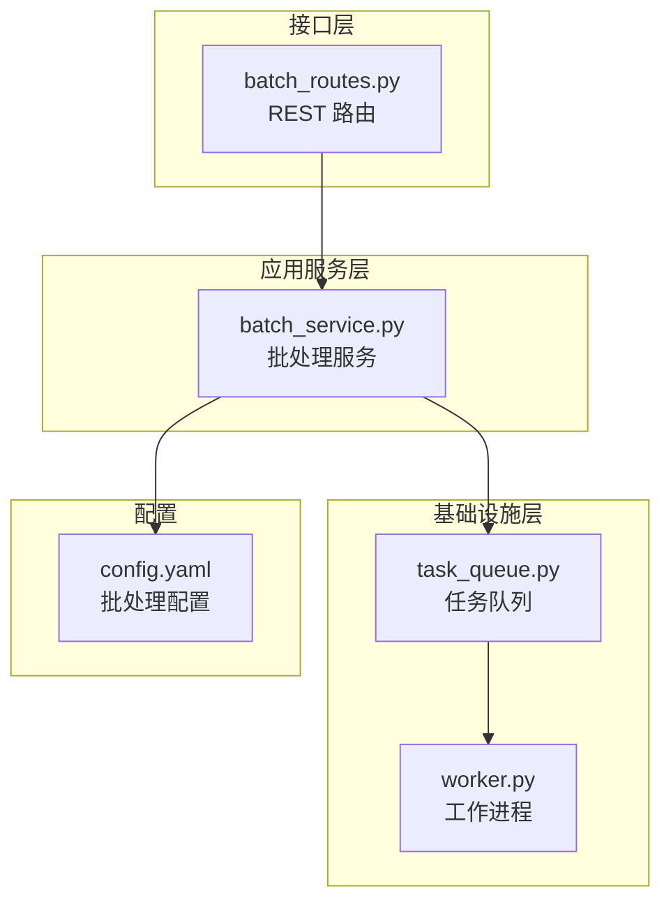
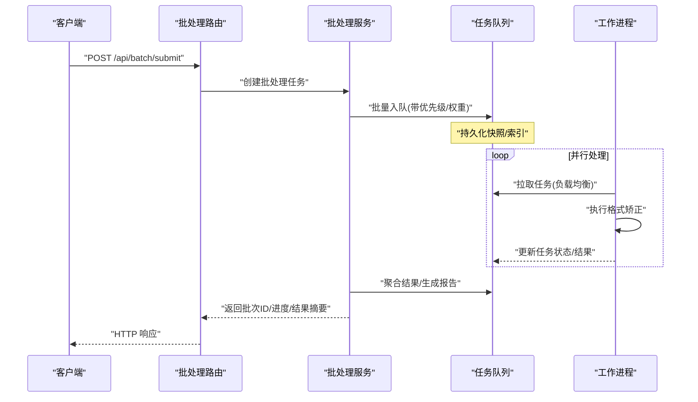
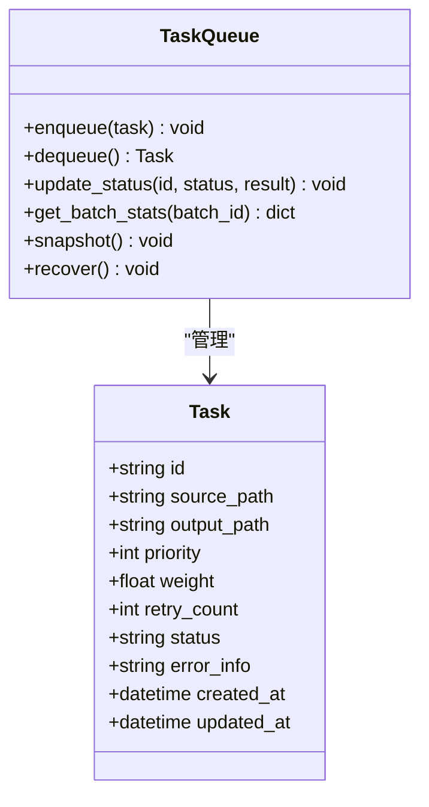
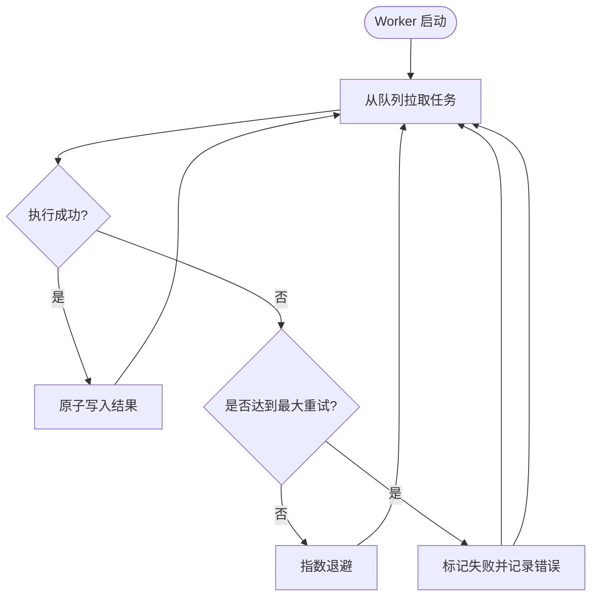
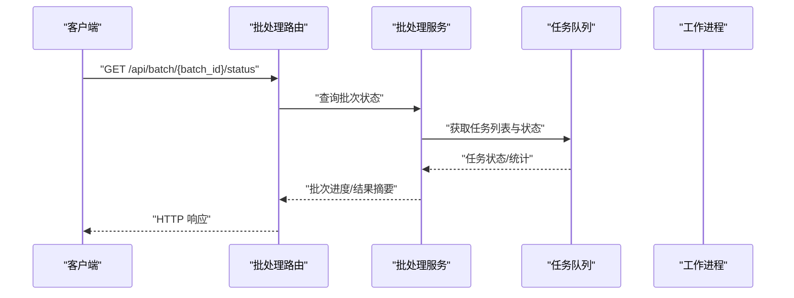
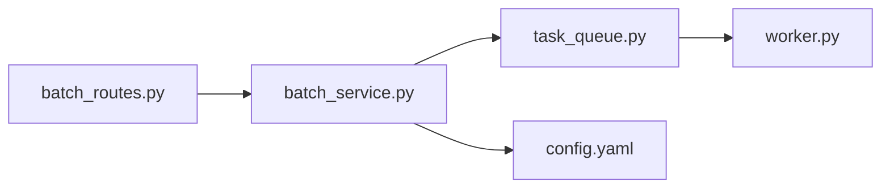

# 批处理机制

<cite>
**本文引用的文件**   
- [src/paper_format_corrector/application/services/batch_service.py](file://src/paper_format_corrector/application/services/batch_service.py)
- [src/paper_format_corrector/infrastructure/queue/task_queue.py](file://src/paper_format_corrector/infrastructure/queue/task_queue.py)
- [src/paper_format_corrector/infrastructure/queue/worker.py](file://src/paper_format_corrector/infrastructure/queue/worker.py)
- [src/paper_format_corrector/interfaces/api/routes/batch_routes.py](file://src/paper_format_corrector/interfaces/api/routes/batch_routes.py)
- [config/config.yaml](file://config/config.yaml)
- [tests/test_task_queue.py](file://tests/test_task_queue.py)
</cite>

## 目录
1. [简介](#简介)
2. [项目结构](#项目结构)
3. [核心组件](#核心组件)
4. [架构总览](#架构总览)
5. [详细组件分析](#详细组件分析)
6. [依赖关系分析](#依赖关系分析)
7. [性能考虑](#性能考虑)
8. [故障排查指南](#故障排查指南)
9. [结论](#结论)
10. [附录](#附录)

## 简介
本文件面向“论文格式矫正工具”的批处理子系统，系统性阐述其设计与实现。重点覆盖：
- 任务队列的工作原理与数据结构
- 并行处理策略与负载均衡算法
- 任务调度器对大量文档格式矫正任务的分配与执行
- 工作进程管理（进程池、任务分发、结果聚合）
- 错误处理与重试机制，以及部分失败的处理策略
- 批处理配置参数、性能调优选项与监控指标
- 批处理任务的创建、监控与管理示例（以路径引用形式提供）

## 项目结构
批处理相关代码主要分布在应用服务层、基础设施队列层与接口路由层：
- 应用服务层：编排批处理流程、协调任务生命周期与结果汇总
- 基础设施层：提供任务队列与工作进程抽象，支撑并发与持久化
- 接口层：暴露 REST API 用于提交、查询与控制批处理任务

图表来源
- [src/paper_format_corrector/interfaces/api/routes/batch_routes.py](file://src/paper_format_corrector/interfaces/api/routes/batch_routes.py)
- [src/paper_format_corrector/application/services/batch_service.py](file://src/paper_format_corrector/application/services/batch_service.py)
- [src/paper_format_corrector/infrastructure/queue/task_queue.py](file://src/paper_format_corrector/infrastructure/queue/task_queue.py)
- [src/paper_format_corrector/infrastructure/queue/worker.py](file://src/paper_format_corrector/infrastructure/queue/worker.py)
- [config/config.yaml](file://config/config.yaml)

章节来源
- [src/paper_format_corrector/application/services/batch_service.py](file://src/paper_format_corrector/application/services/batch_service.py)
- [src/paper_format_corrector/infrastructure/queue/task_queue.py](file://src/paper_format_corrector/infrastructure/queue/task_queue.py)
- [src/paper_format_corrector/infrastructure/queue/worker.py](file://src/paper_format_corrector/infrastructure/queue/worker.py)
- [src/paper_format_corrector/interfaces/api/routes/batch_routes.py](file://src/paper_format_corrector/interfaces/api/routes/batch_routes.py)
- [config/config.yaml](file://config/config.yaml)

## 核心组件
- 批处理服务（BatchService）
  - 职责：接收批量任务请求，拆分任务、入队、启动/管理 Worker、聚合结果、返回状态与报告
  - 关键能力：任务分片、进度追踪、结果合并、异常隔离与部分失败处理
- 任务队列（TaskQueue）
  - 职责：维护任务集合、支持优先级与权重、提供出队/入队/状态查询、持久化快照
  - 关键能力：去重、幂等键、任务元数据、统计指标上报
- 工作进程（Worker）
  - 职责：从队列拉取任务、调用格式矫正逻辑、回写结果、上报进度与错误
  - 关键能力：可配置并发度、资源隔离、超时控制、重试与退避
- 批处理路由（Batch Routes）
  - 职责：暴露提交、查询、取消、统计等 API；校验输入、限流与鉴权
- 配置（config.yaml）
  - 职责：集中管理批处理参数（并发度、重试次数、超时、存储路径等）

章节来源
- [src/paper_format_corrector/application/services/batch_service.py](file://src/paper_format_corrector/application/services/batch_service.py)
- [src/paper_format_corrector/infrastructure/queue/task_queue.py](file://src/paper_format_corrector/infrastructure/queue/task_queue.py)
- [src/paper_format_corrector/infrastructure/queue/worker.py](file://src/paper_format_corrector/infrastructure/queue/worker.py)
- [src/paper_format_corrector/interfaces/api/routes/batch_routes.py](file://src/paper_format_corrector/interfaces/api/routes/batch_routes.py)
- [config/config.yaml](file://config/config.yaml)

## 架构总览
下图展示了从 API 到队列、再到工作进程的端到端流程，以及结果聚合与状态反馈。

图表来源
- [src/paper_format_corrector/interfaces/api/routes/batch_routes.py](file://src/paper_format_corrector/interfaces/api/routes/batch_routes.py)
- [src/paper_format_corrector/application/services/batch_service.py](file://src/paper_format_corrector/application/services/batch_service.py)
- [src/paper_format_corrector/infrastructure/queue/task_queue.py](file://src/paper_format_corrector/infrastructure/queue/task_queue.py)
- [src/paper_format_corrector/infrastructure/queue/worker.py](file://src/paper_format_corrector/infrastructure/queue/worker.py)

## 详细组件分析

### 任务队列（TaskQueue）
- 设计要点
  - 任务模型：包含唯一标识、源文件路径、目标输出、优先级、权重、重试计数、状态、错误信息、时间戳等
  - 队列策略：支持按优先级与权重进行出队；具备去重键避免重复入队
  - 持久化：定期快照与增量日志，保障崩溃恢复
  - 指标：队列长度、平均等待时间、吞吐、错误率
- 复杂度
  - 入队/出队：近似 O(log N)（基于优先队列/堆）
  - 状态查询：O(1)~O(log N)（哈希索引或有序结构）
- 优化建议
  - 大任务分片：将超大文档拆分为子任务，降低单任务内存占用
  - 惰性加载：按需读取文档片段，减少 I/O 峰值
  - 预取窗口：限制 Worker 预取数量，避免内存抖动

图表来源
- [src/paper_format_corrector/infrastructure/queue/task_queue.py](file://src/paper_format_corrector/infrastructure/queue/task_queue.py)

章节来源
- [src/paper_format_corrector/infrastructure/queue/task_queue.py](file://src/paper_format_corrector/infrastructure/queue/task_queue.py)

### 工作进程（Worker）
- 设计要点
  - 拉取策略：轮询/加权随机/最小负载优先，结合队列优先级
  - 执行上下文：为每个任务准备独立环境，避免共享状态污染
  - 超时与熔断：单个任务超时自动中断，防止长尾拖慢整体
  - 重试与退避：指数退避+抖动，限制最大重试次数
- 并发模型
  - 进程池：固定大小或自适应扩缩容，受 CPU/内存阈值约束
  - 资源隔离：通过进程边界隔离内存与句柄泄漏风险
- 结果回写
  - 原子写入：先写临时文件，成功后再移动至目标路径
  - 幂等：相同任务 ID 多次完成不产生副作用

图表来源
- [src/paper_format_corrector/infrastructure/queue/worker.py](file://src/paper_format_corrector/infrastructure/queue/worker.py)
- [src/paper_format_corrector/infrastructure/queue/task_queue.py](file://src/paper_format_corrector/infrastructure/queue/task_queue.py)

章节来源
- [src/paper_format_corrector/infrastructure/queue/worker.py](file://src/paper_format_corrector/infrastructure/queue/worker.py)
- [src/paper_format_corrector/infrastructure/queue/task_queue.py](file://src/paper_format_corrector/infrastructure/queue/task_queue.py)

### 批处理服务（BatchService）
- 设计要点
  - 任务拆分：根据文件大小、页数或规则切分为子任务
  - 调度策略：按优先级与权重分配，避免热点任务阻塞
  - 进度追踪：实时汇总各任务状态，计算完成百分比
  - 结果聚合：合并子任务结果，生成最终报告与差异对比
  - 部分失败处理：允许部分任务失败，仍可产出可用结果并标注问题清单
- 监控指标
  - 批次维度：总任务数、已完成、失败、进行中、平均耗时
  - 系统维度：CPU/内存使用、I/O 吞吐、队列积压

图表来源
- [src/paper_format_corrector/interfaces/api/routes/batch_routes.py](file://src/paper_format_corrector/interfaces/api/routes/batch_routes.py)
- [src/paper_format_corrector/application/services/batch_service.py](file://src/paper_format_corrector/application/services/batch_service.py)
- [src/paper_format_corrector/infrastructure/queue/task_queue.py](file://src/paper_format_corrector/infrastructure/queue/task_queue.py)

章节来源
- [src/paper_format_corrector/application/services/batch_service.py](file://src/paper_format_corrector/application/services/batch_service.py)
- [src/paper_format_corrector/interfaces/api/routes/batch_routes.py](file://src/paper_format_corrector/interfaces/api/routes/batch_routes.py)
- [src/paper_format_corrector/infrastructure/queue/task_queue.py](file://src/paper_format_corrector/infrastructure/queue/task_queue.py)

### 批处理路由（Batch Routes）
- 职责
  - 提交批处理任务：校验输入、限流、落盘任务描述
  - 查询状态：返回批次进度、任务明细、错误摘要
  - 控制操作：暂停/恢复/取消（视实现而定）
- 安全与稳定性
  - 输入校验与路径白名单
  - 速率限制与配额控制
  - 鉴权与审计日志

章节来源
- [src/paper_format_corrector/interfaces/api/routes/batch_routes.py](file://src/paper_format_corrector/interfaces/api/routes/batch_routes.py)

### 配置（config.yaml）
- 典型参数
  - 并发度：Worker 数量、每进程线程数
  - 重试：最大重试次数、退避基数、抖动范围
  - 超时：单任务超时、批次超时
  - 存储：任务持久化路径、结果输出根目录
  - 限流：每秒最大入队数、最大队列长度
- 动态调整
  - 支持热重载或重启后生效的策略
  - 指标驱动的自适应扩缩容（可选）

章节来源
- [config/config.yaml](file://config/config.yaml)

## 依赖关系分析
- 组件耦合
  - 路由层仅依赖服务层接口，保持低耦合
  - 服务层依赖队列抽象，屏蔽底层实现细节
  - 工作进程依赖队列与执行器，关注执行与回写
- 外部依赖
  - 文件系统：任务持久化与结果落盘
  - 可选消息中间件：若队列后端替换为 MQ，需适配接口
- 潜在循环依赖
  - 通过接口解耦与服务/队列分层避免循环

图表来源
- [src/paper_format_corrector/interfaces/api/routes/batch_routes.py](file://src/paper_format_corrector/interfaces/api/routes/batch_routes.py)
- [src/paper_format_corrector/application/services/batch_service.py](file://src/paper_format_corrector/application/services/batch_service.py)
- [src/paper_format_corrector/infrastructure/queue/task_queue.py](file://src/paper_format_corrector/infrastructure/queue/task_queue.py)
- [src/paper_format_corrector/infrastructure/queue/worker.py](file://src/paper_format_corrector/infrastructure/queue/worker.py)
- [config/config.yaml](file://config/config.yaml)

章节来源
- [src/paper_format_corrector/interfaces/api/routes/batch_routes.py](file://src/paper_format_corrector/interfaces/api/routes/batch_routes.py)
- [src/paper_format_corrector/application/services/batch_service.py](file://src/paper_format_corrector/application/services/batch_service.py)
- [src/paper_format_corrector/infrastructure/queue/task_queue.py](file://src/paper_format_corrector/infrastructure/queue/task_queue.py)
- [src/paper_format_corrector/infrastructure/queue/worker.py](file://src/paper_format_corrector/infrastructure/queue/worker.py)
- [config/config.yaml](file://config/config.yaml)

## 性能考虑
- 并行与负载均衡
  - 采用优先级队列与加权分配，避免热点任务拥塞
  - 最小负载优先策略在异构节点下更均衡
- 资源控制
  - 设置合理的 Worker 数量，避免上下文切换开销过大
  - 单任务内存上限与软限制，触发分片或降级
- I/O 优化
  - 顺序读写与缓冲策略，减少小文件频繁 I/O
  - 结果原子写入，避免脏读
- 监控与观测
  - 暴露队列深度、任务延迟、错误率、吞吐等指标
  - 采样式日志，避免高并发下日志风暴

[本节为通用指导，无需特定文件来源]

## 故障排查指南
- 常见问题
  - 任务堆积：检查 Worker 数量、单任务耗时、队列容量与限流策略
  - 部分失败：查看任务错误信息与重试计数，定位具体失败原因
  - 结果不一致：确认幂等键与原子写入逻辑，避免并发覆盖
- 诊断步骤
  - 查询批次状态与任务明细，筛选失败任务
  - 检查 Worker 日志与系统资源指标
  - 验证配置文件与运行时参数
- 参考测试用例
  - 队列行为与边界条件可通过单元测试复现与回归

章节来源
- [tests/test_task_queue.py](file://tests/test_task_queue.py)

## 结论
该批处理机制通过清晰的分层与抽象，实现了可扩展、可观测、可恢复的文档格式矫正流水线。任务队列与工作进程解耦了调度与执行，配合重试与部分失败容忍策略，能够在大规模场景下保持稳定与高效。建议在生产环境中结合监控指标与压测数据，持续优化并发度、超时与重试策略，以获得最佳吞吐与成本平衡。

[本节为总结性内容，无需特定文件来源]

## 附录

### 配置参数速查（示例字段说明）
- worker_pool_size：工作进程数量
- task_retry_max：最大重试次数
- task_timeout_seconds：单任务超时秒数
- batch_timeout_seconds：批次总超时秒数
- queue_max_length：队列最大长度
- storage_root：任务与结果存储根路径
- rate_limit_per_second：每秒最大入队数

章节来源
- [config/config.yaml](file://config/config.yaml)

### 常用 API 与示例（路径引用）
- 提交批处理任务
  - 路由定义与示例：[src/paper_format_corrector/interfaces/api/routes/batch_routes.py](file://src/paper_format_corrector/interfaces/api/routes/batch_routes.py)
- 查询批次状态
  - 路由定义与示例：[src/paper_format_corrector/interfaces/api/routes/batch_routes.py](file://src/paper_format_corrector/interfaces/api/routes/batch_routes.py)
- 控制操作（暂停/恢复/取消）
  - 路由定义与示例：[src/paper_format_corrector/interfaces/api/routes/batch_routes.py](file://src/paper_format_corrector/interfaces/api/routes/batch_routes.py)
- 批处理服务入口
  - 服务方法与调用链：[src/paper_format_corrector/application/services/batch_service.py](file://src/paper_format_corrector/application/services/batch_service.py)
- 队列与工作进程
  - 队列接口与实现：[src/paper_format_corrector/infrastructure/queue/task_queue.py](file://src/paper_format_corrector/infrastructure/queue/task_queue.py)
  - 工作进程实现：[src/paper_format_corrector/infrastructure/queue/worker.py](file://src/paper_format_corrector/infrastructure/queue/worker.py)