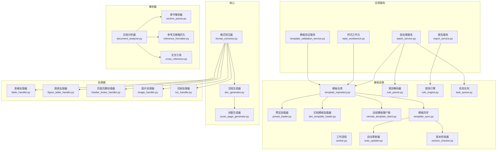
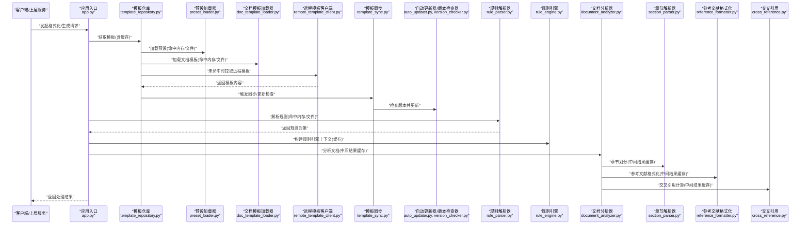
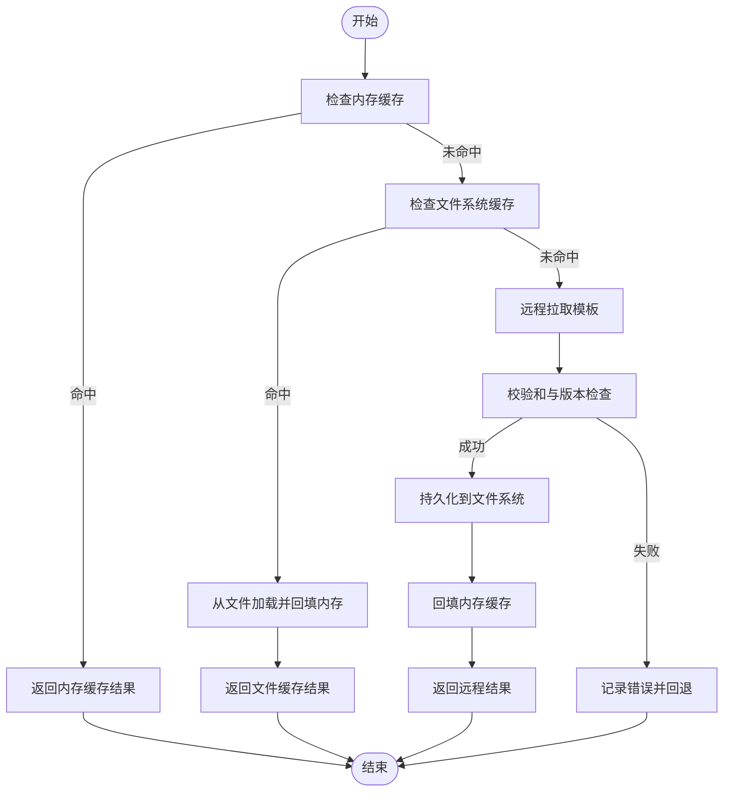
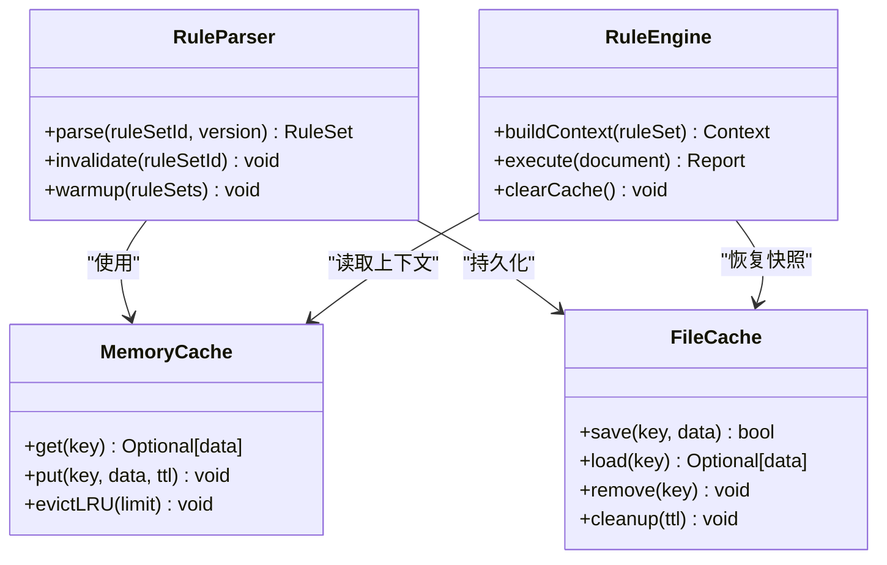
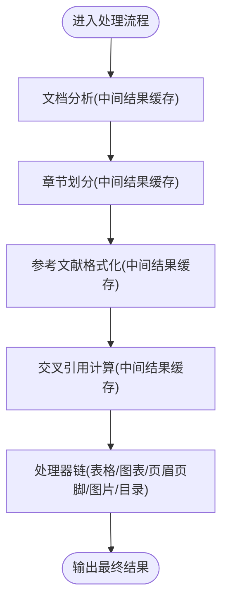
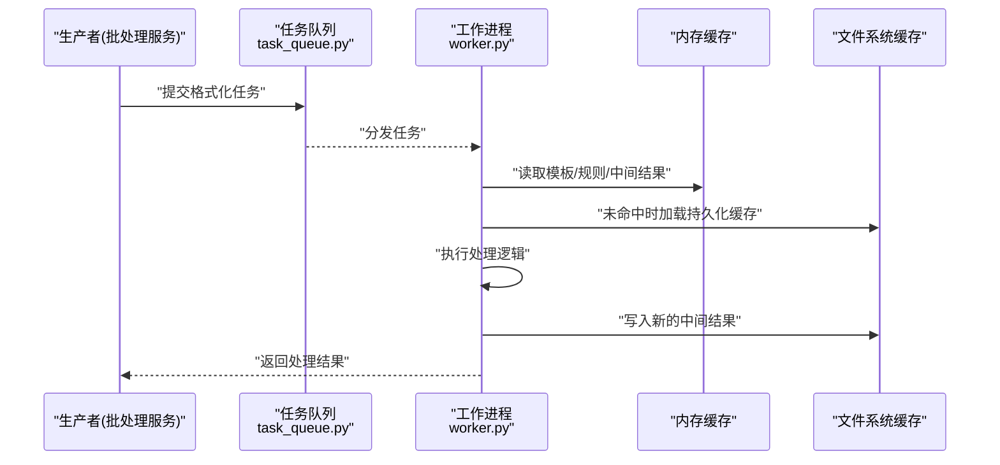
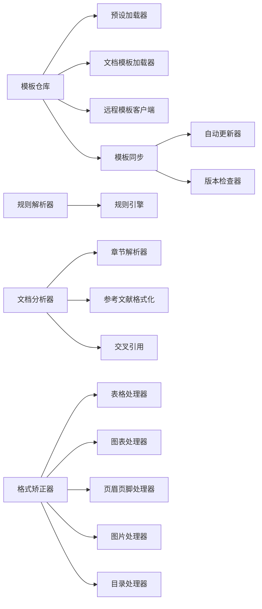

# 缓存策略

<cite>
**本文引用的文件**   
- [config.yaml](file://config/config.yaml)
- [updater.yaml](file://config/updater.yaml)
- [app.py](file://src/paper_format_corrector/app.py)
- [template_repository.py](file://src/paper_format_corrector/infra/template_repository.py)
- [preset_loader.py](file://src/paper_format_corrector/infra/preset_loader.py)
- [doc_template_loader.py](file://src/paper_format_corrector/infra/doc_template_loader.py)
- [rule_parser.py](file://src/paper_format_corrector/infrastructure/parsers/rule_parser.py)
- [rule_engine.py](file://src/paper_format_corrector/infrastructure/quality/rule_engine.py)
- [task_queue.py](file://src/paper_format_corrector/infrastructure/queue/task_queue.py)
- [worker.py](file://src/paper_format_corrector/infrastructure/queue/worker.py)
- [remote_template_client.py](file://src/paper_format_corrector/infra/remote_template_client.py)
- [template_sync.py](file://src/paper_format_corrector/infra/template_sync.py)
- [auto_updater.py](file://src/paper_format_corrector/infra/updater/auto_updater.py)
- [version_checker.py](file://src/paper_format_corrector/infra/updater/version_checker.py)
- [batch_service.py](file://src/paper_format_corrector/application/services/batch_service.py)
- [report_service.py](file://src/paper_format_corrector/application/services/report_service.py)
- [style_workbench.py](file://src/paper_format_corrector/application/services/style_workbench.py)
- [template_validation_service.py](file://src/paper_format_corrector/application/services/template_validation_service.py)
- [document_analyzer.py](file://src/paper_format_corrector/infrastructure/parsers/document_analyzer.py)
- [section_parser.py](file://src/paper_format_corrector/infrastructure/parsers/section_parser.py)
- [reference_formatter.py](file://src/paper_format_corrector/infrastructure/parsers/reference_formatter.py)
- [cross_reference.py](file://src/paper_format_corrector/infrastructure/parsers/cross_reference.py)
- [format_corrector.py](file://src/paper_format_corrector/core/format_corrector.py)
- [doc_generator.py](file://src/paper_format_corrector/generators/doc_generator.py)
- [cover_page_generator.py](file://src/paper_format_corrector/generators/cover_page_generator.py)
- [table_handler.py](file://src/paper_format_corrector/handlers/table_handler.py)
- [figure_table_handler.py](file://src/paper_format_corrector/handlers/figure_table_handler.py)
- [header_footer_handler.py](file://src/paper_format_corrector/handlers/header_footer_handler.py)
- [image_handler.py](file://src/paper_format_corrector/handlers/image_handler.py)
- [toc_handler.py](file://src/paper_format_corrector/handlers/toc_handler.py)
</cite>

## 目录
1. [简介](#简介)
2. [项目结构](#项目结构)
3. [核心组件](#核心组件)
4. [架构总览](#架构总览)
5. [详细组件分析](#详细组件分析)
6. [依赖关系分析](#依赖关系分析)
7. [性能考量](#性能考量)
8. [故障排查指南](#故障排查指南)
9. [结论](#结论)
10. [附录](#附录)

## 简介
本文件围绕“多级缓存架构”展开，聚焦模板缓存、规则缓存与中间结果缓存的设计与实现。文档涵盖：
- 缓存分层：内存缓存、文件系统缓存、分布式缓存的使用场景与职责边界
- 失效策略与一致性保证：基于版本、时间戳与事件驱动的更新机制
- 预热、更新与清理：启动预热、增量更新与定时清理流程
- 监控与容量规划：命中率指标、延迟分布与存储容量估算
- 配置调优与自定义策略：通过配置文件与扩展点实现灵活控制

## 项目结构
系统采用分层与模块化组织方式，缓存相关能力分布在基础设施层与应用服务层：
- 基础设施层负责模板加载、规则解析、任务队列与远程同步等底层能力
- 应用服务层编排处理流程，串联解析、校验、生成与导出等环节
- 核心层提供格式矫正、文档生成等通用能力
- 处理器层针对表格、图表、页眉页脚、图片、目录等元素进行专项处理

图示来源
- [app.py:1-200](file://src/paper_format_corrector/app.py#L1-L200)
- [template_repository.py:1-200](file://src/paper_format_corrector/infra/template_repository.py#L1-L200)
- [preset_loader.py:1-200](file://src/paper_format_corrector/infra/preset_loader.py#L1-L200)
- [doc_template_loader.py:1-200](file://src/paper_format_corrector/infra/doc_template_loader.py#L1-L200)
- [rule_parser.py:1-200](file://src/paper_format_corrector/infrastructure/parsers/rule_parser.py#L1-L200)
- [rule_engine.py:1-200](file://src/paper_format_corrector/infrastructure/quality/rule_engine.py#L1-L200)
- [task_queue.py:1-200](file://src/paper_format_corrector/infrastructure/queue/task_queue.py#L1-L200)
- [worker.py:1-200](file://src/paper_format_corrector/infrastructure/queue/worker.py#L1-L200)
- [remote_template_client.py:1-200](file://src/paper_format_corrector/infra/remote_template_client.py#L1-L200)
- [template_sync.py:1-200](file://src/paper_format_corrector/infra/template_sync.py#L1-L200)
- [auto_updater.py:1-200](file://src/paper_format_corrector/infra/updater/auto_updater.py#L1-L200)
- [version_checker.py:1-200](file://src/paper_format_corrector/infra/updater/version_checker.py#L1-L200)
- [batch_service.py:1-200](file://src/paper_format_corrector/application/services/batch_service.py#L1-L200)
- [report_service.py:1-200](file://src/paper_format_corrector/application/services/report_service.py#L1-L200)
- [style_workbench.py:1-200](file://src/paper_format_corrector/application/services/style_workbench.py#L1-L200)
- [template_validation_service.py:1-200](file://src/paper_format_corrector/application/services/template_validation_service.py#L1-L200)
- [document_analyzer.py:1-200](file://src/paper_format_corrector/infrastructure/parsers/document_analyzer.py#L1-L200)
- [section_parser.py:1-200](file://src/paper_format_corrector/infrastructure/parsers/section_parser.py#L1-L200)
- [reference_formatter.py:1-200](file://src/paper_format_corrector/infrastructure/parsers/reference_formatter.py#L1-L200)
- [cross_reference.py:1-200](file://src/paper_format_corrector/infrastructure/parsers/cross_reference.py#L1-L200)
- [format_corrector.py:1-200](file://src/paper_format_corrector/core/format_corrector.py#L1-L200)
- [doc_generator.py:1-200](file://src/paper_format_corrector/generators/doc_generator.py#L1-L200)
- [cover_page_generator.py:1-200](file://src/paper_format_corrector/generators/cover_page_generator.py#L1-L200)
- [table_handler.py:1-200](file://src/paper_format_corrector/handlers/table_handler.py#L1-L200)
- [figure_table_handler.py:1-200](file://src/paper_format_corrector/handlers/figure_table_handler.py#L1-L200)
- [header_footer_handler.py:1-200](file://src/paper_format_corrector/handlers/header_footer_handler.py#L1-L200)
- [image_handler.py:1-200](file://src/paper_format_corrector/handlers/image_handler.py#L1-L200)
- [toc_handler.py:1-200](file://src/paper_format_corrector/handlers/toc_handler.py#L1-L200)

章节来源
- [app.py:1-200](file://src/paper_format_corrector/app.py#L1-L200)

## 核心组件
- 模板缓存（Template Cache）
  - 目标：缓存模板元数据、样式定义、预设与文档模板对象，减少重复解析与网络请求
  - 层级：内存缓存（进程内字典/对象）、文件系统缓存（本地磁盘持久化）、分布式缓存（可选，跨进程/多实例共享）
  - 关键入口：模板仓库、预设加载器、文档模板加载器、远程模板客户端、模板同步
- 规则缓存（Rule Cache）
  - 目标：缓存规则解析结果与规则引擎上下文，避免重复解析与编译
  - 层级：内存缓存为主，必要时落盘为结构化文件
  - 关键入口：规则解析器、规则引擎
- 中间结果缓存（Intermediate Result Cache）
  - 目标：缓存文档分析、章节划分、参考文献格式化、交叉引用计算等中间产物
  - 层级：内存缓存用于短生命周期；文件系统缓存用于可复用的大对象；分布式缓存用于并发场景
  - 关键入口：文档分析器、章节解析器、参考文献格式化、交叉引用、处理器链

章节来源
- [template_repository.py:1-200](file://src/paper_format_corrector/infra/template_repository.py#L1-L200)
- [preset_loader.py:1-200](file://src/paper_format_corrector/infra/preset_loader.py#L1-L200)
- [doc_template_loader.py:1-200](file://src/paper_format_corrector/infra/doc_template_loader.py#L1-L200)
- [rule_parser.py:1-200](file://src/paper_format_corrector/infrastructure/parsers/rule_parser.py#L1-L200)
- [rule_engine.py:1-200](file://src/paper_format_corrector/infrastructure/quality/rule_engine.py#L1-L200)
- [document_analyzer.py:1-200](file://src/paper_format_corrector/infrastructure/parsers/document_analyzer.py#L1-L200)
- [section_parser.py:1-200](file://src/paper_format_corrector/infrastructure/parsers/section_parser.py#L1-L200)
- [reference_formatter.py:1-200](file://src/paper_format_corrector/infrastructure/parsers/reference_formatter.py#L1-L200)
- [cross_reference.py:1-200](file://src/paper_format_corrector/infrastructure/parsers/cross_reference.py#L1-L200)

## 架构总览
多级缓存的整体调用时序如下：

图示来源
- [app.py:1-200](file://src/paper_format_corrector/app.py#L1-L200)
- [template_repository.py:1-200](file://src/paper_format_corrector/infra/template_repository.py#L1-L200)
- [preset_loader.py:1-200](file://src/paper_format_corrector/infra/preset_loader.py#L1-L200)
- [doc_template_loader.py:1-200](file://src/paper_format_corrector/infra/doc_template_loader.py#L1-L200)
- [remote_template_client.py:1-200](file://src/paper_format_corrector/infra/remote_template_client.py#L1-L200)
- [template_sync.py:1-200](file://src/paper_format_corrector/infra/template_sync.py#L1-L200)
- [auto_updater.py:1-200](file://src/paper_format_corrector/infra/updater/auto_updater.py#L1-L200)
- [version_checker.py:1-200](file://src/paper_format_corrector/infra/updater/version_checker.py#L1-L200)
- [rule_parser.py:1-200](file://src/paper_format_corrector/infrastructure/parsers/rule_parser.py#L1-L200)
- [rule_engine.py:1-200](file://src/paper_format_corrector/infrastructure/quality/rule_engine.py#L1-L200)
- [document_analyzer.py:1-200](file://src/paper_format_corrector/infrastructure/parsers/document_analyzer.py#L1-L200)
- [section_parser.py:1-200](file://src/paper_format_corrector/infrastructure/parsers/section_parser.py#L1-L200)
- [reference_formatter.py:1-200](file://src/paper_format_corrector/infrastructure/parsers/reference_formatter.py#L1-L200)
- [cross_reference.py:1-200](file://src/paper_format_corrector/infrastructure/parsers/cross_reference.py#L1-L200)

## 详细组件分析

### 模板缓存（Template Cache）
- 设计要点
  - 内存缓存：进程内字典或对象池，键包含模板标识、版本与哈希摘要，值包含模板元数据与已解析的文档模板对象
  - 文件系统缓存：将模板内容与元数据序列化到本地目录，支持离线使用与快速重启恢复
  - 分布式缓存：在多实例部署下，通过远程模板客户端与模板同步模块共享模板资源
- 失效策略
  - 版本驱动：当远程模板版本变化或本地文件变更时，使旧缓存失效
  - 时间驱动：对热更新不敏感的模板设置较长TTL，降低频繁刷新开销
  - 事件驱动：模板同步完成后广播失效事件，通知各缓存层清理
- 一致性保证
  - 原子写入：先写临时文件再原子替换，避免读取到半写状态
  - 幂等拉取：远程拉取具备去重与断点续传能力
  - 校验和：模板内容附带校验和，命中前校验一致性与完整性
- 预热与更新
  - 启动预热：在应用启动阶段预加载常用模板与预设，提升首请求响应速度
  - 增量更新：仅拉取差异部分，结合版本检查器判断是否需要更新
- 清理机制
  - LRU淘汰：内存缓存按最近最少使用淘汰
  - 过期清理：定期扫描文件系统缓存，删除超过TTL的条目
  - 空间上限：限制缓存目录大小，超出阈值时按优先级与访问频率清理

图示来源
- [template_repository.py:1-200](file://src/paper_format_corrector/infra/template_repository.py#L1-L200)
- [preset_loader.py:1-200](file://src/paper_format_corrector/infra/preset_loader.py#L1-L200)
- [doc_template_loader.py:1-200](file://src/paper_format_corrector/infra/doc_template_loader.py#L1-L200)
- [remote_template_client.py:1-200](file://src/paper_format_corrector/infra/remote_template_client.py#L1-L200)
- [template_sync.py:1-200](file://src/paper_format_corrector/infra/template_sync.py#L1-L200)
- [auto_updater.py:1-200](file://src/paper_format_corrector/infra/updater/auto_updater.py#L1-L200)
- [version_checker.py:1-200](file://src/paper_format_corrector/infra/updater/version_checker.py#L1-L200)

章节来源
- [template_repository.py:1-200](file://src/paper_format_corrector/infra/template_repository.py#L1-L200)
- [preset_loader.py:1-200](file://src/paper_format_corrector/infra/preset_loader.py#L1-L200)
- [doc_template_loader.py:1-200](file://src/paper_format_corrector/infra/doc_template_loader.py#L1-L200)
- [remote_template_client.py:1-200](file://src/paper_format_corrector/infra/remote_template_client.py#L1-L200)
- [template_sync.py:1-200](file://src/paper_format_corrector/infra/template_sync.py#L1-L200)
- [auto_updater.py:1-200](file://src/paper_format_corrector/infra/updater/auto_updater.py#L1-L200)
- [version_checker.py:1-200](file://src/paper_format_corrector/infra/updater/version_checker.py#L1-L200)

### 规则缓存（Rule Cache）
- 设计要点
  - 内存缓存：规则解析后的对象树与索引结构，键由规则集标识与版本组成
  - 文件系统缓存：规则集合的序列化快照，便于冷启动快速恢复
- 失效策略
  - 规则文件变更：监听规则文件修改事件，触发对应规则集失效
  - 版本切换：不同规则版本独立缓存，避免相互污染
- 一致性保证
  - 幂等解析：相同输入产生相同输出，确保缓存可安全复用
  - 校验与回滚：解析失败时保留上一有效版本
- 预热与更新
  - 启动预热：预解析常用规则集，减少首次执行延迟
  - 增量更新：仅重新解析变更的规则片段
- 清理机制
  - 按规则集维度清理，避免全局失效导致抖动
  - 内存淘汰策略与文件大小上限控制

图示来源
- [rule_parser.py:1-200](file://src/paper_format_corrector/infrastructure/parsers/rule_parser.py#L1-L200)
- [rule_engine.py:1-200](file://src/paper_format_corrector/infrastructure/quality/rule_engine.py#L1-L200)

章节来源
- [rule_parser.py:1-200](file://src/paper_format_corrector/infrastructure/parsers/rule_parser.py#L1-L200)
- [rule_engine.py:1-200](file://src/paper_format_corrector/infrastructure/quality/rule_engine.py#L1-L200)

### 中间结果缓存（Intermediate Result Cache）
- 设计要点
  - 文档分析结果：段落、表格、图片、公式等元素的抽取与标注
  - 章节划分结果：标题层级与结构树
  - 参考文献格式化结果：规范化后的引用条目
  - 交叉引用结果：编号映射与链接信息
- 失效策略
  - 源文档变更：基于文档指纹（如大小、修改时间、内容哈希）失效
  - 处理器变更：当处理器逻辑升级时，选择性失效相关中间结果
- 一致性保证
  - 幂等处理：相同输入产生相同中间结果
  - 原子替换：更新中间结果时使用临时文件与原子替换
- 预热与更新
  - 批量任务：在批处理服务中并行预热常见文档结构的中间结果
  - 增量更新：仅对变更段落或元素重新计算
- 清理机制
  - 按文档ID与处理器维度管理生命周期
  - 定期清理长时间未访问的中间结果

图示来源
- [document_analyzer.py:1-200](file://src/paper_format_corrector/infrastructure/parsers/document_analyzer.py#L1-L200)
- [section_parser.py:1-200](file://src/paper_format_corrector/infrastructure/parsers/section_parser.py#L1-L200)
- [reference_formatter.py:1-200](file://src/paper_format_corrector/infrastructure/parsers/reference_formatter.py#L1-L200)
- [cross_reference.py:1-200](file://src/paper_format_corrector/infrastructure/parsers/cross_reference.py#L1-L200)
- [table_handler.py:1-200](file://src/paper_format_corrector/handlers/table_handler.py#L1-L200)
- [figure_table_handler.py:1-200](file://src/paper_format_corrector/handlers/figure_table_handler.py#L1-L200)
- [header_footer_handler.py:1-200](file://src/paper_format_corrector/handlers/header_footer_handler.py#L1-L200)
- [image_handler.py:1-200](file://src/paper_format_corrector/handlers/image_handler.py#L1-L200)
- [toc_handler.py:1-200](file://src/paper_format_corrector/handlers/toc_handler.py#L1-L200)

章节来源
- [document_analyzer.py:1-200](file://src/paper_format_corrector/infrastructure/parsers/document_analyzer.py#L1-L200)
- [section_parser.py:1-200](file://src/paper_format_corrector/infrastructure/parsers/section_parser.py#L1-L200)
- [reference_formatter.py:1-200](file://src/paper_format_corrector/infrastructure/parsers/reference_formatter.py#L1-L200)
- [cross_reference.py:1-200](file://src/paper_format_corrector/infrastructure/parsers/cross_reference.py#L1-L200)
- [table_handler.py:1-200](file://src/paper_format_corrector/handlers/table_handler.py#L1-L200)
- [figure_table_handler.py:1-200](file://src/paper_format_corrector/handlers/figure_table_handler.py#L1-L200)
- [header_footer_handler.py:1-200](file://src/paper_format_corrector/handlers/header_footer_handler.py#L1-L200)
- [image_handler.py:1-200](file://src/paper_format_corrector/handlers/image_handler.py#L1-L200)
- [toc_handler.py:1-200](file://src/paper_format_corrector/handlers/toc_handler.py#L1-L200)

### 任务队列与工作进程中的缓存协作
- 任务队列：将格式化任务入队，工作进程消费任务并复用缓存
- 进程间共享：通过文件系统缓存或分布式缓存实现跨进程共享
- 隔离与竞争：任务级别隔离，避免并发写入冲突

图示来源
- [task_queue.py:1-200](file://src/paper_format_corrector/infrastructure/queue/task_queue.py#L1-L200)
- [worker.py:1-200](file://src/paper_format_corrector/infrastructure/queue/worker.py#L1-L200)

章节来源
- [task_queue.py:1-200](file://src/paper_format_corrector/infrastructure/queue/task_queue.py#L1-L200)
- [worker.py:1-200](file://src/paper_format_corrector/infrastructure/queue/worker.py#L1-L200)

## 依赖关系分析
- 组件耦合
  - 模板仓库依赖预设加载器、文档模板加载器、远程模板客户端与模板同步模块
  - 规则解析器与规则引擎紧密耦合，共同维护规则缓存
  - 文档分析器组合多个解析器与处理器，形成中间结果缓存链
- 外部依赖
  - 文件系统：用于持久化模板与中间结果
  - 网络：远程模板拉取与版本检查
  - 队列：任务调度与工作进程通信
- 潜在循环依赖
  - 通过接口抽象与服务编排避免直接循环依赖
  - 模板同步与自动更新器之间保持单向依赖

图示来源
- [template_repository.py:1-200](file://src/paper_format_corrector/infra/template_repository.py#L1-L200)
- [preset_loader.py:1-200](file://src/paper_format_corrector/infra/preset_loader.py#L1-L200)
- [doc_template_loader.py:1-200](file://src/paper_format_corrector/infra/doc_template_loader.py#L1-L200)
- [remote_template_client.py:1-200](file://src/paper_format_corrector/infra/remote_template_client.py#L1-L200)
- [template_sync.py:1-200](file://src/paper_format_corrector/infra/template_sync.py#L1-L200)
- [auto_updater.py:1-200](file://src/paper_format_corrector/infra/updater/auto_updater.py#L1-L200)
- [version_checker.py:1-200](file://src/paper_format_corrector/infra/updater/version_checker.py#L1-L200)
- [rule_parser.py:1-200](file://src/paper_format_corrector/infrastructure/parsers/rule_parser.py#L1-L200)
- [rule_engine.py:1-200](file://src/paper_format_corrector/infrastructure/quality/rule_engine.py#L1-L200)
- [document_analyzer.py:1-200](file://src/paper_format_corrector/infrastructure/parsers/document_analyzer.py#L1-L200)
- [section_parser.py:1-200](file://src/paper_format_corrector/infrastructure/parsers/section_parser.py#L1-L200)
- [reference_formatter.py:1-200](file://src/paper_format_corrector/infrastructure/parsers/reference_formatter.py#L1-L200)
- [cross_reference.py:1-200](file://src/paper_format_corrector/infrastructure/parsers/cross_reference.py#L1-L200)
- [format_corrector.py:1-200](file://src/paper_format_corrector/core/format_corrector.py#L1-L200)
- [table_handler.py:1-200](file://src/paper_format_corrector/handlers/table_handler.py#L1-L200)
- [figure_table_handler.py:1-200](file://src/paper_format_corrector/handlers/figure_table_handler.py#L1-L200)
- [header_footer_handler.py:1-200](file://src/paper_format_corrector/handlers/header_footer_handler.py#L1-L200)
- [image_handler.py:1-200](file://src/paper_format_corrector/handlers/image_handler.py#L1-L200)
- [toc_handler.py:1-200](file://src/paper_format_corrector/handlers/toc_handler.py#L1-L200)

章节来源
- [template_repository.py:1-200](file://src/paper_format_corrector/infra/template_repository.py#L1-L200)
- [rule_parser.py:1-200](file://src/paper_format_corrector/infrastructure/parsers/rule_parser.py#L1-L200)
- [rule_engine.py:1-200](file://src/paper_format_corrector/infrastructure/quality/rule_engine.py#L1-L200)
- [document_analyzer.py:1-200](file://src/paper_format_corrector/infrastructure/parsers/document_analyzer.py#L1-L200)
- [format_corrector.py:1-200](file://src/paper_format_corrector/core/format_corrector.py#L1-L200)

## 性能考量
- 命中率监控
  - 指标：内存命中率、文件命中率、远程命中率、平均延迟、错误率
  - 采集点：模板仓库、规则解析器、文档分析器、处理器链
- 延迟分布
  - P50/P95/P99延迟分位统计，识别长尾请求
  - 区分冷启动与热运行阶段的性能特征
- 容量规划
  - 内存容量：根据热点模板与规则集数量估算对象体积
  - 文件容量：根据中间结果规模与TTL估算磁盘占用
  - 网络带宽：远程拉取的峰值带宽与重试策略
- 优化建议
  - 合理设置TTL与淘汰策略，平衡新鲜度与性能
  - 使用压缩与序列化优化，减少I/O与内存占用
  - 异步预热与懒加载，降低首请求延迟

[本节为通用指导，无需具体文件来源]

## 故障排查指南
- 常见问题
  - 缓存未命中：检查键生成逻辑与版本/哈希是否正确
  - 一致性异常：确认原子写入与校验和是否生效
  - 远端拉取失败：检查网络连通性与重试策略
  - 文件权限问题：确认缓存目录读写权限
- 定位方法
  - 日志：记录缓存命中/未命中、错误堆栈与耗时
  - 指标：监控命中率、延迟与错误率趋势
  - 回放：使用最小数据集复现问题，逐步缩小范围
- 恢复策略
  - 清理局部缓存后重试
  - 强制刷新特定模板或规则集
  - 降级到默认模板或规则集

章节来源
- [template_repository.py:1-200](file://src/paper_format_corrector/infra/template_repository.py#L1-L200)
- [rule_parser.py:1-200](file://src/paper_format_corrector/infrastructure/parsers/rule_parser.py#L1-L200)
- [document_analyzer.py:1-200](file://src/paper_format_corrector/infrastructure/parsers/document_analyzer.py#L1-L200)

## 结论
本系统通过模板缓存、规则缓存与中间结果缓存的多级架构，显著提升了格式化与生成的性能与稳定性。通过版本驱动、时间驱动与事件驱动的失效策略，以及原子写入与校验和的一致性保证，系统在复杂场景下仍能保持高可用与低延迟。配合预热、更新与清理机制，以及完善的监控与容量规划，系统具备良好的可扩展性与可运维性。

[本节为总结性内容，无需具体文件来源]

## 附录

### 配置参数调优
- 模板缓存
  - 内存容量上限、TTL、淘汰策略
  - 文件系统路径、最大大小、清理周期
  - 远程拉取超时、重试次数、并发数
- 规则缓存
  - 规则集版本隔离、TTL、清理策略
  - 解析并发与批处理大小
- 中间结果缓存
  - 文档指纹字段、TTL、清理策略
  - 处理器级开关与粒度控制

章节来源
- [config.yaml:1-200](file://config/config.yaml#L1-L200)
- [updater.yaml:1-200](file://config/updater.yaml#L1-L200)

### 自定义缓存策略实现方法
- 扩展点
  - 自定义键生成器：根据业务需求调整键维度
  - 自定义存储后端：替换内存或文件系统实现
  - 自定义失效策略：基于事件或外部信号触发
- 集成步骤
  - 注册新缓存后端到模板仓库与规则解析器
  - 在文档分析器与处理器链中接入中间结果缓存
  - 配置监控与日志，确保可观测性

章节来源
- [template_repository.py:1-200](file://src/paper_format_corrector/infra/template_repository.py#L1-L200)
- [rule_parser.py:1-200](file://src/paper_format_corrector/infrastructure/parsers/rule_parser.py#L1-L200)
- [document_analyzer.py:1-200](file://src/paper_format_corrector/infrastructure/parsers/document_analyzer.py#L1-L200)