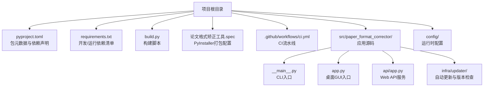
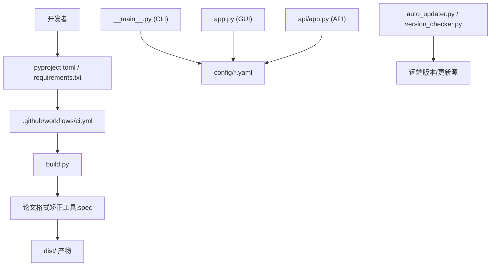
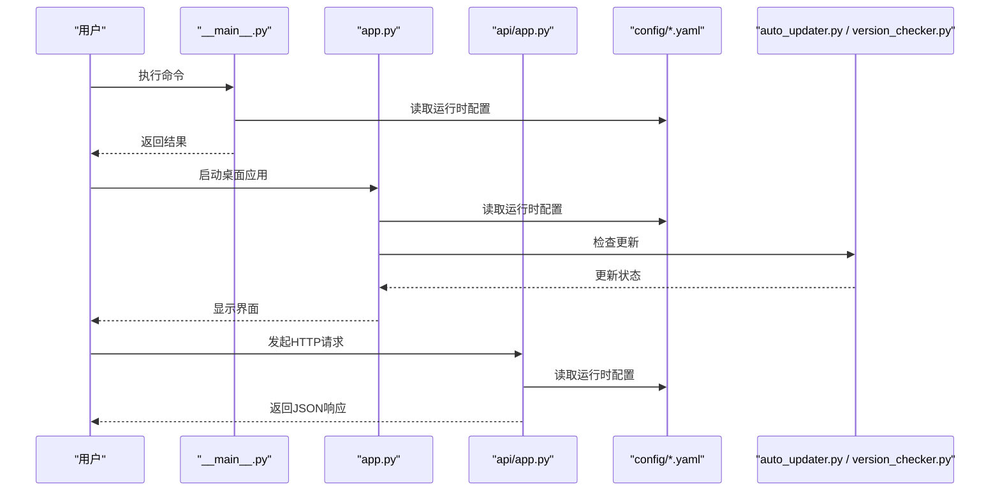
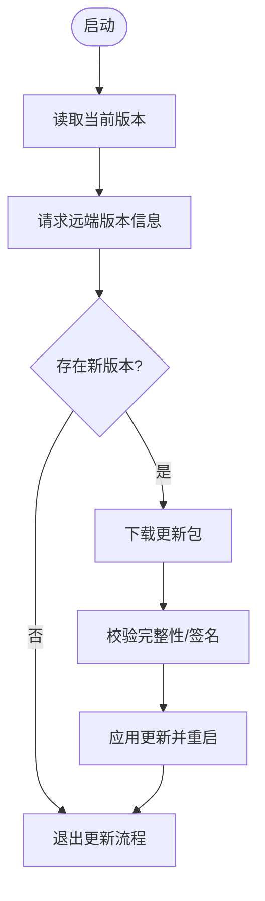

# 技术栈与依赖管理

<cite>
**本文引用的文件**   
- [pyproject.toml](file://pyproject.toml)
- [requirements.txt](file://requirements.txt)
- [build.py](file://build.py)
- [.github/workflows/ci.yml](file://.github/workflows/ci.yml)
- [论文格式矫正工具.spec](file://论文格式矫正工具.spec)
- [README.md](file://README.md)
- [src/paper_format_corrector/__main__.py](file://src/paper_format_corrector/__main__.py)
- [src/paper_format_corrector/app.py](file://src/paper_format_corrector/app.py)
- [src/paper_format_corrector/api/app.py](file://src/paper_format_corrector/api/app.py)
- [src/paper_format_corrector/infra/updater/auto_updater.py](file://src/paper_format_corrector/infra/updater/auto_updater.py)
- [src/paper_format_corrector/infra/updater/version_checker.py](file://src/paper_format_corrector/infra/updater/version_checker.py)
- [config/config.yaml](file://config/config.yaml)
- [config/updater.yaml](file://config/updater.yaml)
</cite>

## 目录
1. [简介](#简介)
2. [项目结构](#项目结构)
3. [核心组件](#核心组件)
4. [架构总览](#架构总览)
5. [详细组件分析](#详细组件分析)
6. [依赖分析](#依赖分析)
7. [性能考虑](#性能考虑)
8. [故障排查指南](#故障排查指南)
9. [结论](#结论)
10. [附录](#附录)

## 简介
本文件聚焦于“论文格式矫正工具”的技术栈与依赖管理，覆盖Python版本要求、主要框架与库的选择理由、第三方依赖的版本控制与安全更新策略、构建系统与打包流程、开发工具链配置与使用、依赖冲突解决与性能优化策略，以及环境配置与部署要求。文档以仓库中的实际配置文件与入口脚本为依据，确保信息可追溯、可落地。

## 项目结构
从工程根目录可见以下与依赖和构建相关的关键位置：
- 包元数据与依赖声明：pyproject.toml、requirements.txt
- 构建与打包：build.py、论文格式矫正工具.spec（PyInstaller）
- CI流水线：.github/workflows/ci.yml
- 应用入口与API服务：src/paper_format_corrector/__main__.py、src/paper_format_corrector/app.py、src/paper_format_corrector/api/app.py
- 自动更新与版本检查：src/paper_format_corrector/infra/updater/auto_updater.py、src/paper_format_corrector/infra/updater/version_checker.py
- 运行时配置：config/config.yaml、config/updater.yaml

图表来源
- [pyproject.toml](file://pyproject.toml)
- [requirements.txt](file://requirements.txt)
- [build.py](file://build.py)
- [论文格式矫正工具.spec](file://论文格式矫正工具.spec)
- [.github/workflows/ci.yml](file://.github/workflows/ci.yml)
- [src/paper_format_corrector/__main__.py](file://src/paper_format_corrector/__main__.py)
- [src/paper_format_corrector/app.py](file://src/paper_format_corrector/app.py)
- [src/paper_format_corrector/api/app.py](file://src/paper_format_corrector/api/app.py)
- [src/paper_format_corrector/infra/updater/auto_updater.py](file://src/paper_format_corrector/infra/updater/auto_updater.py)
- [src/paper_format_corrector/infra/updater/version_checker.py](file://src/paper_format_corrector/infra/updater/version_checker.py)
- [config/config.yaml](file://config/config.yaml)
- [config/updater.yaml](file://config/updater.yaml)

章节来源
- [README.md](file://README.md)
- [pyproject.toml](file://pyproject.toml)
- [requirements.txt](file://requirements.txt)
- [build.py](file://build.py)
- [论文格式矫正工具.spec](file://论文格式矫正工具.spec)
- [.github/workflows/ci.yml](file://.github/workflows/ci.yml)

## 核心组件
本节概述与依赖管理直接相关的核心构件及其职责：
- 包元数据与依赖声明（pyproject.toml、requirements.txt）：定义Python版本约束、运行期依赖、可选依赖与安装入口点。
- 构建脚本（build.py）：封装本地构建步骤，如清理、生成资源、调用打包工具等。
- PyInstaller打包配置（论文格式矫正工具.spec）：指定可执行产物、隐藏导入、数据文件与图标等。
- CI流水线（.github/workflows/ci.yml）：在云端执行依赖解析、测试与构建任务，保障一致性。
- 应用入口（__main__.py、app.py、api/app.py）：分别承载CLI、桌面GUI与Web API三种运行形态的启动逻辑。
- 自动更新与版本检查（auto_updater.py、version_checker.py）：负责远程版本探测与增量更新流程。
- 运行时配置（config/config.yaml、config/updater.yaml）：提供默认行为、模板路径、更新源等配置项。

章节来源
- [pyproject.toml](file://pyproject.toml)
- [requirements.txt](file://requirements.txt)
- [build.py](file://build.py)
- [论文格式矫正工具.spec](file://论文格式矫正工具.spec)
- [src/paper_format_corrector/__main__.py](file://src/paper_format_corrector/__main__.py)
- [src/paper_format_corrector/app.py](file://src/paper_format_corrector/app.py)
- [src/paper_format_corrector/api/app.py](file://src/paper_format_corrector/api/app.py)
- [src/paper_format_corrector/infra/updater/auto_updater.py](file://src/paper_format_corrector/infra/updater/auto_updater.py)
- [src/paper_format_corrector/infra/updater/version_checker.py](file://src/paper_format_corrector/infra/updater/version_checker.py)
- [config/config.yaml](file://config/config.yaml)
- [config/updater.yaml](file://config/updater.yaml)

## 架构总览
下图展示依赖管理与构建打包的整体关系：开发者通过pyproject.toml与requirements.txt声明依赖；CI基于这些声明进行解析与验证；本地或CI触发build.py与spec完成打包；应用入口根据运行形态加载配置并启动服务。

图表来源
- [pyproject.toml](file://pyproject.toml)
- [requirements.txt](file://requirements.txt)
- [.github/workflows/ci.yml](file://.github/workflows/ci.yml)
- [build.py](file://build.py)
- [论文格式矫正工具.spec](file://论文格式矫正工具.spec)
- [src/paper_format_corrector/__main__.py](file://src/paper_format_corrector/__main__.py)
- [src/paper_format_corrector/app.py](file://src/paper_format_corrector/app.py)
- [src/paper_format_corrector/api/app.py](file://src/paper_format_corrector/api/app.py)
- [src/paper_format_corrector/infra/updater/auto_updater.py](file://src/paper_format_corrector/infra/updater/auto_updater.py)
- [src/paper_format_corrector/infra/updater/version_checker.py](file://src/paper_format_corrector/infra/updater/version_checker.py)
- [config/config.yaml](file://config/config.yaml)
- [config/updater.yaml](file://config/updater.yaml)

## 详细组件分析

### Python版本与包元数据（pyproject.toml）
- 作用：集中声明Python最低版本、包名、版本、描述、作者、许可证、依赖分组（运行/开发/测试）、安装入口点等。
- 建议关注点：
  - Python版本约束应与CI中配置的Python版本一致，避免环境差异。
  - 将可选功能拆分为extras，便于按需安装，减少体积。
  - 明确依赖来源与版本范围，避免上游破坏性升级影响稳定性。

章节来源
- [pyproject.toml](file://pyproject.toml)

### 依赖清单（requirements.txt）
- 作用：提供可直接安装的依赖列表，常用于虚拟环境快速初始化与CI安装。
- 建议关注点：
  - 与pyproject.toml保持同步，避免重复维护成本。
  - 对关键依赖锁定版本或使用兼容范围，兼顾安全修复与兼容性。

章节来源
- [requirements.txt](file://requirements.txt)

### 构建脚本（build.py）
- 作用：封装本地构建流程，可能包括清理中间产物、生成静态资源、调用打包工具等。
- 建议关注点：
  - 幂等设计，支持断点续建与增量构建。
  - 输出日志与错误码，便于CI集成与问题定位。

章节来源
- [build.py](file://build.py)

### PyInstaller打包配置（论文格式矫正工具.spec）
- 作用：定义可执行文件的打包参数，包括隐藏导入、数据文件、图标、排除模块、平台特定选项等。
- 建议关注点：
  - 仅包含必要模块，减小产物体积。
  - 显式声明动态加载的资源与插件路径，避免运行时缺失。
  - 针对不同平台分别构建，保证二进制兼容性。

章节来源
- [论文格式矫正工具.spec](file://论文格式矫正工具.spec)

### CI流水线（.github/workflows/ci.yml）
- 作用：在多Python版本矩阵上执行依赖解析、单元测试、构建与打包，确保跨版本兼容性与回归质量。
- 建议关注点：
  - 缓存pip/venv依赖，加速流水线。
  - 失败时保留构建产物与日志，便于复现问题。
  - 发布阶段签名与校验，保障分发可信度。

章节来源
- [.github/workflows/ci.yml](file://.github/workflows/ci.yml)

### 应用入口与运行形态
- CLI入口（__main__.py）：提供命令行接口，适合自动化与批处理场景。
- GUI入口（app.py）：提供桌面图形界面，适合普通用户交互。
- API服务（api/app.py）：提供HTTP接口，便于集成到Web或微服务架构。

图表来源
- [src/paper_format_corrector/__main__.py](file://src/paper_format_corrector/__main__.py)
- [src/paper_format_corrector/app.py](file://src/paper_format_corrector/app.py)
- [src/paper_format_corrector/api/app.py](file://src/paper_format_corrector/api/app.py)
- [config/config.yaml](file://config/config.yaml)
- [config/updater.yaml](file://config/updater.yaml)
- [src/paper_format_corrector/infra/updater/auto_updater.py](file://src/paper_format_corrector/infra/updater/auto_updater.py)
- [src/paper_format_corrector/infra/updater/version_checker.py](file://src/paper_format_corrector/infra/updater/version_checker.py)

章节来源
- [src/paper_format_corrector/__main__.py](file://src/paper_format_corrector/__main__.py)
- [src/paper_format_corrector/app.py](file://src/paper_format_corrector/app.py)
- [src/paper_format_corrector/api/app.py](file://src/paper_format_corrector/api/app.py)

### 自动更新与版本检查
- 版本检查（version_checker.py）：向远端查询最新版本并与当前版本比较。
- 自动更新（auto_updater.py）：下载更新包并执行替换或重启流程。
- 配置（config/updater.yaml）：指定更新源地址、渠道、是否启用自动更新等。

图表来源
- [src/paper_format_corrector/infra/updater/version_checker.py](file://src/paper_format_corrector/infra/updater/version_checker.py)
- [src/paper_format_corrector/infra/updater/auto_updater.py](file://src/paper_format_corrector/infra/updater/auto_updater.py)
- [config/updater.yaml](file://config/updater.yaml)

章节来源
- [src/paper_format_corrector/infra/updater/version_checker.py](file://src/paper_format_corrector/infra/updater/version_checker.py)
- [src/paper_format_corrector/infra/updater/auto_updater.py](file://src/paper_format_corrector/infra/updater/auto_updater.py)
- [config/updater.yaml](file://config/updater.yaml)

## 依赖分析
- 版本控制策略
  - 使用pyproject.toml作为单一事实来源，requirements.txt用于快速安装与CI兼容。
  - 对关键依赖采用最小兼容范围，结合CI多版本矩阵验证兼容性。
- 安全更新
  - 在CI中加入依赖漏洞扫描任务，定期拉取安全公告并评估影响。
  - 对高危漏洞优先升级，必要时引入补丁或替代方案。
- 兼容性处理
  - 针对平台差异（Windows/macOS/Linux）在spec中区分打包选项。
  - 对C扩展或系统库依赖，在CI中预装对应系统包。
- 依赖冲突解决
  - 当出现版本冲突时，优先调整上层依赖的范围，避免直接修改底层库。
  - 使用隔离环境（venv/conda）复现与定位冲突。
- 性能优化
  - 精简可选依赖，按功能拆分extras。
  - 在spec中排除未使用的子模块，减少包体与启动时间。
  - 利用CI缓存依赖，缩短构建时间。

章节来源
- [pyproject.toml](file://pyproject.toml)
- [requirements.txt](file://requirements.txt)
- [论文格式矫正工具.spec](file://论文格式矫正工具.spec)
- [.github/workflows/ci.yml](file://.github/workflows/ci.yml)

## 性能考虑
- 启动性能
  - 延迟加载重型模块，仅在需要时导入。
  - 合理设置spec的隐藏导入与排除列表，减少冻结体积。
- 运行性能
  - 对I/O密集型操作使用异步或队列机制，避免阻塞主线程。
  - 对大文档处理采用分块与流式处理，降低内存峰值。
- 构建性能
  - 在CI中缓存依赖与构建产物，提升流水线速度。
  - 并行化测试与构建任务，缩短反馈周期。

[本节为通用指导，不直接分析具体文件]

## 故障排查指南
- 依赖安装失败
  - 检查pyproject.toml与requirements.txt中的版本范围是否与当前Python版本兼容。
  - 查看CI日志，确认是否在目标Python版本矩阵上失败。
- 打包失败
  - 核对spec中的隐藏导入与数据文件路径是否正确。
  - 在本地使用相同Python与平台复现，逐步缩小问题范围。
- 运行时配置错误
  - 校验config/*.yaml语法与必填字段。
  - 在应用启动前打印关键配置项，确认加载路径正确。
- 自动更新异常
  - 检查config/updater.yaml中的更新源可达性与证书配置。
  - 查看版本检查与下载过程的日志，定位网络或权限问题。

章节来源
- [pyproject.toml](file://pyproject.toml)
- [requirements.txt](file://requirements.txt)
- [论文格式矫正工具.spec](file://论文格式矫正工具.spec)
- [config/config.yaml](file://config/config.yaml)
- [config/updater.yaml](file://config/updater.yaml)
- [.github/workflows/ci.yml](file://.github/workflows/ci.yml)

## 结论
本项目通过pyproject.toml与requirements.txt统一管理依赖，结合build.py与PyInstaller spec实现跨平台打包，并通过CI流水线保障多Python版本的兼容性与质量。自动更新与版本检查模块增强了产品的可维护性。建议在后续迭代中持续完善依赖安全扫描、可选依赖拆分与构建缓存策略，以提升整体效率与安全性。

[本节为总结性内容，不直接分析具体文件]

## 附录
- 环境配置与部署要点
  - 使用与CI一致的Python版本创建虚拟环境。
  - 优先从pyproject.toml安装依赖，必要时参考requirements.txt。
  - 部署前在目标平台执行最小化测试，验证字体、模板与外部工具可用性。
  - 生产环境关闭调试模式，启用结构化日志与告警。

章节来源
- [README.md](file://README.md)
- [pyproject.toml](file://pyproject.toml)
- [requirements.txt](file://requirements.txt)
- [.github/workflows/ci.yml](file://.github/workflows/ci.yml)