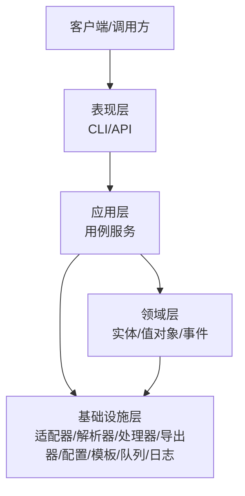
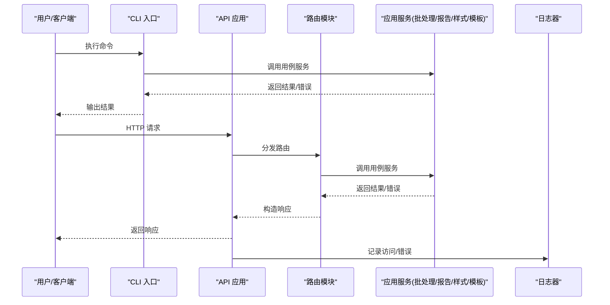
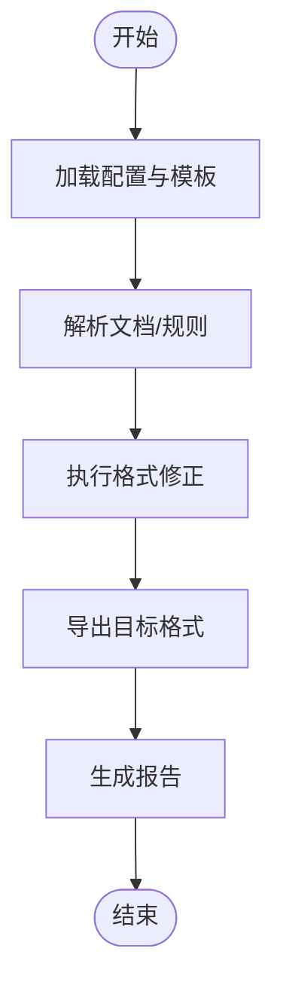
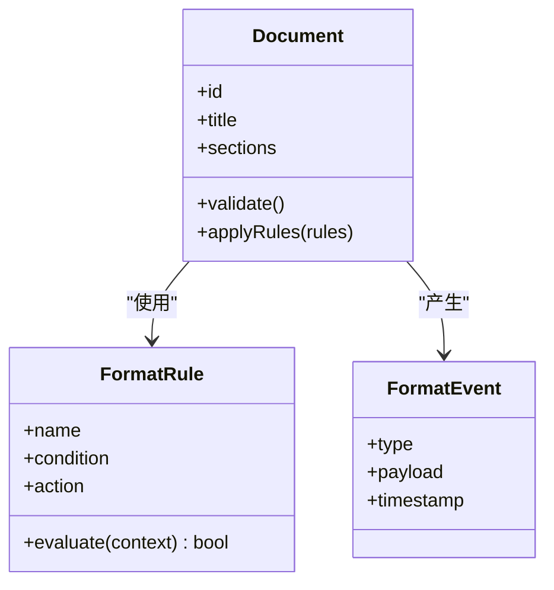
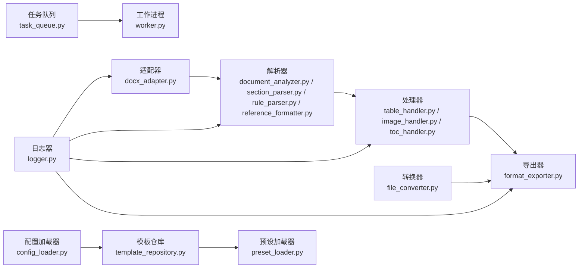
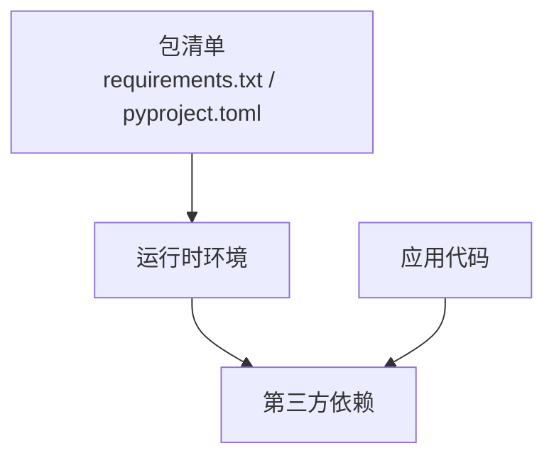
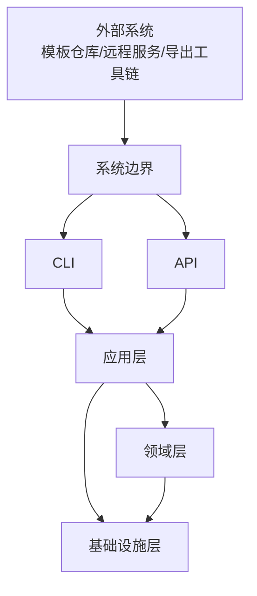
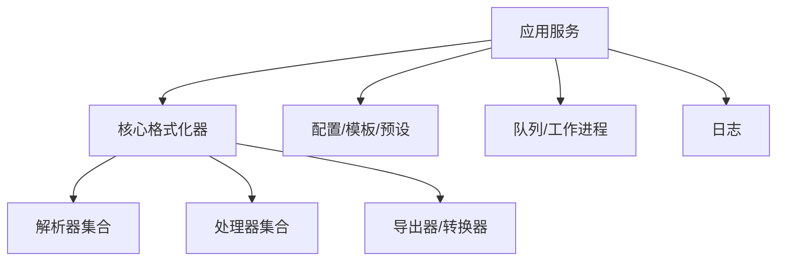

# 架构设计

<cite>
**本文引用的文件**   
- [src/paper_format_corrector/app.py](file://src/paper_format_corrector/app.py)
- [src/paper_format_corrector/__main__.py](file://src/paper_format_corrector/__main__.py)
- [src/paper_format_corrector/cli.py](file://src/paper_format_corrector/cli.py)
- [src/paper_format_corrector/api/app.py](file://src/paper_format_corrector/api/app.py)
- [src/paper_format_corrector/application/services/batch_service.py](file://src/paper_format_corrector/application/services/batch_service.py)
- [src/paper_format_corrector/application/services/report_service.py](file://src/paper_format_corrector/application/services/report_service.py)
- [src/paper_format_corrector/application/services/style_workbench.py](file://src/paper_format_corrector/application/services/style_workbench.py)
- [src/paper_format_corrector/application/services/template_validation_service.py](file://src/paper_format_corrector/application/services/template_validation_service.py)
- [src/paper_format_corrector/core/format_corrector.py](file://src/paper_format_corrector/core/format_corrector.py)
- [src/paper_format_corrector/core/doc_generator.py](file://src/paper_format_corrector/core/doc_generator.py)
- [src/paper_format_corrector/core/file_converter.py](file://src/paper_format_corrector/core/file_converter.py)
- [src/paper_format_corrector/infrastructure/adapters/docx_adapter.py](file://src/paper_format_corrector/infrastructure/adapters/docx_adapter.py)
- [src/paper_format_corrector/infrastructure/converters/file_converter.py](file://src/paper_format_corrector/infrastructure/converters/file_converter.py)
- [src/paper_format_corrector/infrastructure/exporters/format_exporter.py](file://src/paper_format_corrector/infrastructure/exporters/format_exporter.py)
- [src/paper_format_corrector/infrastructure/parsers/document_analyzer.py](file://src/paper_format_corrector/infrastructure/parsers/document_analyzer.py)
- [src/paper_format_corrector/infrastructure/parsers/section_parser.py](file://src/paper_format_corrector/infrastructure/parsers/section_parser.py)
- [src/paper_format_corrector/infrastructure/parsers/rule_parser.py](file://src/paper_format_corrector/infrastructure/parsers/rule_parser.py)
- [src/paper_format_corrector/infrastructure/parsers/reference_formatter.py](file://src/paper_format_corrector/infrastructure/parsers/reference_formatter.py)
- [src/paper_format_corrector/infrastructure/handlers/table_handler.py](file://src/paper_format_corrector/infrastructure/handlers/table_handler.py)
- [src/paper_format_corrector/infrastructure/handlers/image_handler.py](file://src/paper_format_corrector/infrastructure/handlers/image_handler.py)
- [src/paper_format_corrector/infrastructure/handlers/toc_handler.py](file://src/paper_format_corrector/infrastructure/handlers/toc_handler.py)
- [src/paper_format_corrector/infrastructure/config/config_loader.py](file://src/paper_format_corrector/infrastructure/config/config_loader.py)
- [src/paper_format_corrector/infrastructure/template_repository.py](file://src/paper_format_corrector/infrastructure/template_repository.py)
- [src/paper_format_corrector/infrastructure/preset_loader.py](file://src/paper_format_corrector/infrastructure/preset_loader.py)
- [src/paper_format_corrector/infrastructure/logger.py](file://src/paper_format_corrector/infrastructure/logger.py)
- [src/paper_format_corrector/infrastructure/queue/task_queue.py](file://src/paper_format_corrector/infrastructure/queue/task_queue.py)
- [src/paper_format_corrector/infrastructure/queue/worker.py](file://src/paper_format_corrector/infrastructure/queue/worker.py)
- [src/paper_format_corrector/interfaces/api/routes/correct_routes.py](file://src/paper_format_corrector/interfaces/api/routes/correct_routes.py)
- [src/paper_format_corrector/interfaces/api/routes/template_routes.py](file://src/paper_format_corrector/interfaces/api/routes/template_routes.py)
- [src/paper_format_corrector/domain/entities/document.py](file://src/paper_format_corrector/domain/entities/document.py)
- [src/paper_format_corrector/domain/events/format_event.py](file://src/paper_format_corrector/domain/events/format_event.py)
- [src/paper_format_corrector/domain/value_objects/format_rule.py](file://src/paper_format_corrector/domain/value_objects/format_rule.py)
- [config/config.yaml](file://config/config.yaml)
- [requirements.txt](file://requirements.txt)
- [pyproject.toml](file://pyproject.toml)
</cite>

## 目录
1. [引言](#引言)
2. [项目结构](#项目结构)
3. [核心组件](#核心组件)
4. [架构总览](#架构总览)
5. [详细组件分析](#详细组件分析)
6. [依赖分析](#依赖分析)
7. [性能考虑](#性能考虑)
8. [故障排查指南](#故障排查指南)
9. [结论](#结论)
10. [附录](#附录)

## 引言
本文件面向“论文格式矫正工具”的系统架构设计，采用领域驱动设计（DDD）、分层架构与模块化原则，将系统划分为表现层、应用层、领域层与基础设施层。文档重点阐述：
- 高层设计理念与架构模式选择
- 各层职责与组件交互关系
- 数据流与控制流
- 技术栈与第三方依赖管理策略
- 可扩展性与性能考量
- 安全策略、监控方案与灾难恢复计划

## 项目结构
仓库采用按功能域与层次混合的组织方式：
- 表现层：CLI、Web API、桌面端入口
- 应用层：编排用例服务、DTO、端口定义
- 领域层：实体、值对象、领域事件与服务
- 基础设施层：适配器、转换器、导出器、解析器、处理器、配置加载、模板仓库、队列等

```mermaid
graph TB
subgraph "表现层"
CLI["命令行接口<br/>cli.py"]
API["API 应用入口<br/>api/app.py"]
Routes["路由模块<br/>interfaces/api/routes/*"]
end
subgraph "应用层"
BatchSvc["批处理服务<br/>application/services/batch_service.py"]
ReportSvc["报告服务<br/>application/services/report_service.py"]
StyleWB["样式工作台服务<br/>application/services/style_workbench.py"]
TmplValSvc["模板校验服务<br/>application/services/template_validation_service.py"]
end
subgraph "领域层"
DocEntity["文档实体<br/>domain/entities/document.py"]
FmtRule["格式规则值对象<br/>domain/value_objects/format_rule.py"]
FmtEvent["格式事件<br/>domain/events/format_event.py"]
end
subgraph "基础设施层"
CoreFC["核心格式化器<br/>core/format_corrector.py"]
CoreDG["文档生成器<br/>core/doc_generator.py"]
CoreFCv["核心文件转换<br/>core/file_converter.py"]
Adapter["DocX 适配器<br/>infrastructure/adapters/docx_adapter.py"]
Conv["文件转换器<br/>infrastructure/converters/file_converter.py"]
Export["格式导出器<br/>infrastructure/exporters/format_exporter.py"]
ParserDA["文档分析器<br/>infrastructure/parsers/document_analyzer.py"]
ParserSP["章节解析器<br/>infrastructure/parsers/section_parser.py"]
ParserRP["规则解析器<br/>infrastructure/parsers/rule_parser.py"]
ParserRF["参考文献格式化<br/>infrastructure/parsers/reference_formatter.py"]
HandlerT["表格处理器<br/>infrastructure/handlers/table_handler.py"]
HandlerI["图片处理器<br/>infrastructure/handlers/image_handler.py"]
HandlerTOC["目录处理器<br/>infrastructure/handlers/toc_handler.py"]
Config["配置加载器<br/>infrastructure/config/config_loader.py"]
TmplRepo["模板仓库<br/>infrastructure/template_repository.py"]
Preset["预设加载器<br/>infrastructure/preset_loader.py"]
Logger["日志器<br/>infrastructure/logger.py"]
Queue["任务队列<br/>infrastructure/queue/task_queue.py"]
Worker["工作进程<br/>infrastructure/queue/worker.py"]
end
CLI --> API
API --> Routes
Routes --> BatchSvc
Routes --> ReportSvc
Routes --> StyleWB
Routes --> TmplValSvc
BatchSvc --> CoreFC
BatchSvc --> CoreDG
BatchSvc --> CoreFCv
ReportSvc --> CoreFC
StyleWB --> CoreFC
TmplValSvc --> TmplRepo
TmplValSvc --> Preset
CoreFC --> Adapter
CoreFC --> ParserDA
CoreFC --> ParserSP
CoreFC --> ParserRP
CoreFC --> ParserRF
CoreFC --> HandlerT
CoreFC --> HandlerI
CoreFC --> HandlerTOC
CoreDG --> Export
CoreFCv --> Conv
Config --> TmplRepo
Logger --> API
Logger --> CLI
Queue --> Worker
```



图表来源
- [src/paper_format_corrector/cli.py](file://src/paper_format_corrector/cli.py)
- [src/paper_format_corrector/api/app.py](file://src/paper_format_corrector/api/app.py)
- [src/paper_format_corrector/application/services/batch_service.py](file://src/paper_format_corrector/application/services/batch_service.py)
- [src/paper_format_corrector/application/services/report_service.py](file://src/paper_format_corrector/application/services/report_service.py)
- [src/paper_format_corrector/application/services/style_workbench.py](file://src/paper_format_corrector/application/services/style_workbench.py)
- [src/paper_format_corrector/application/services/template_validation_service.py](file://src/paper_format_corrector/application/services/template_validation_service.py)
- [src/paper_format_corrector/core/format_corrector.py](file://src/paper_format_corrector/core/format_corrector.py)
- [src/paper_format_corrector/core/doc_generator.py](file://src/paper_format_corrector/core/doc_generator.py)
- [src/paper_format_corrector/core/file_converter.py](file://src/paper_format_corrector/core/file_converter.py)
- [src/paper_format_corrector/infrastructure/adapters/docx_adapter.py](file://src/paper_format_corrector/infrastructure/adapters/docx_adapter.py)
- [src/paper_format_corrector/infrastructure/converters/file_converter.py](file://src/paper_format_corrector/infrastructure/converters/file_converter.py)
- [src/paper_format_corrector/infrastructure/exporters/format_exporter.py](file://src/paper_format_corrector/infrastructure/exporters/format_exporter.py)
- [src/paper_format_corrector/infrastructure/parsers/document_analyzer.py](file://src/paper_format_corrector/infrastructure/parsers/document_analyzer.py)
- [src/paper_format_corrector/infrastructure/parsers/section_parser.py](file://src/paper_format_corrector/infrastructure/parsers/section_parser.py)
- [src/paper_format_corrector/infrastructure/parsers/rule_parser.py](file://src/paper_format_corrector/infrastructure/parsers/rule_parser.py)
- [src/paper_format_corrector/infrastructure/parsers/reference_formatter.py](file://src/paper_format_corrector/infrastructure/parsers/reference_formatter.py)
- [src/paper_format_corrector/infrastructure/handlers/table_handler.py](file://src/paper_format_corrector/infrastructure/handlers/table_handler.py)
- [src/paper_format_corrector/infrastructure/handlers/image_handler.py](file://src/paper_format_corrector/infrastructure/handlers/image_handler.py)
- [src/paper_format_corrector/infrastructure/handlers/toc_handler.py](file://src/paper_format_corrector/infrastructure/handlers/toc_handler.py)
- [src/paper_format_corrector/infrastructure/config/config_loader.py](file://src/paper_format_corrector/infrastructure/config/config_loader.py)
- [src/paper_format_corrector/infrastructure/template_repository.py](file://src/paper_format_corrector/infrastructure/template_repository.py)
- [src/paper_format_corrector/infrastructure/preset_loader.py](file://src/paper_format_corrector/infrastructure/preset_loader.py)
- [src/paper_format_corrector/infrastructure/logger.py](file://src/paper_format_corrector/infrastructure/logger.py)
- [src/paper_format_corrector/infrastructure/queue/task_queue.py](file://src/paper_format_corrector/infrastructure/queue/task_queue.py)
- [src/paper_format_corrector/infrastructure/queue/worker.py](file://src/paper_format_corrector/infrastructure/queue/worker.py)

章节来源
- [src/paper_format_corrector/app.py](file://src/paper_format_corrector/app.py)
- [src/paper_format_corrector/__main__.py](file://src/paper_format_corrector/__main__.py)
- [src/paper_format_corrector/cli.py](file://src/paper_format_corrector/cli.py)
- [src/paper_format_corrector/api/app.py](file://src/paper_format_corrector/api/app.py)

## 核心组件
- 应用服务
  - 批处理服务：编排多文档的格式化流水线，协调解析、修正、导出与报告生成。
  - 报告服务：汇总质量评分、差异报告与审计信息。
  - 样式工作台服务：提供样式提取、比对与工作台操作编排。
  - 模板校验服务：基于模板仓库与预设进行模板一致性校验与导入。
- 核心能力
  - 核心格式化器：组合解析器、处理器与导出器，执行格式修正主流程。
  - 文档生成器：根据模板与规则生成目标文档结构。
  - 文件转换器：在多种中间表示之间进行转换。
- 基础设施
  - 适配器：对底层文档库（如 docx）进行适配封装。
  - 解析器：文档分析、章节识别、规则解析、参考文献格式化。
  - 处理器：针对表格、图片、目录等元素的专项处理。
  - 配置与模板：统一加载配置、模板仓库与预设。
  - 队列与工作进程：异步任务调度与执行。
  - 日志：集中化日志输出与级别控制。

章节来源
- [src/paper_format_corrector/application/services/batch_service.py](file://src/paper_format_corrector/application/services/batch_service.py)
- [src/paper_format_corrector/application/services/report_service.py](file://src/paper_format_corrector/application/services/report_service.py)
- [src/paper_format_corrector/application/services/style_workbench.py](file://src/paper_format_corrector/application/services/style_workbench.py)
- [src/paper_format_corrector/application/services/template_validation_service.py](file://src/paper_format_corrector/application/services/template_validation_service.py)
- [src/paper_format_corrector/core/format_corrector.py](file://src/paper_format_corrector/core/format_corrector.py)
- [src/paper_format_corrector/core/doc_generator.py](file://src/paper_format_corrector/core/doc_generator.py)
- [src/paper_format_corrector/core/file_converter.py](file://src/paper_format_corrector/core/file_converter.py)
- [src/paper_format_corrector/infrastructure/adapters/docx_adapter.py](file://src/paper_format_corrector/infrastructure/adapters/docx_adapter.py)
- [src/paper_format_corrector/infrastructure/parsers/document_analyzer.py](file://src/paper_format_corrector/infrastructure/parsers/document_analyzer.py)
- [src/paper_format_corrector/infrastructure/parsers/section_parser.py](file://src/paper_format_corrector/infrastructure/parsers/section_parser.py)
- [src/paper_format_corrector/infrastructure/parsers/rule_parser.py](file://src/paper_format_corrector/infrastructure/parsers/rule_parser.py)
- [src/paper_format_corrector/infrastructure/parsers/reference_formatter.py](file://src/paper_format_corrector/infrastructure/parsers/reference_formatter.py)
- [src/paper_format_corrector/infrastructure/handlers/table_handler.py](file://src/paper_format_corrector/infrastructure/handlers/table_handler.py)
- [src/paper_format_corrector/infrastructure/handlers/image_handler.py](file://src/paper_format_corrector/infrastructure/handlers/image_handler.py)
- [src/paper_format_corrector/infrastructure/handlers/toc_handler.py](file://src/paper_format_corrector/infrastructure/handlers/toc_handler.py)
- [src/paper_format_corrector/infrastructure/config/config_loader.py](file://src/paper_format_corrector/infrastructure/config/config_loader.py)
- [src/paper_format_corrector/infrastructure/template_repository.py](file://src/paper_format_corrector/infrastructure/template_repository.py)
- [src/paper_format_corrector/infrastructure/preset_loader.py](file://src/paper_format_corrector/infrastructure/preset_loader.py)
- [src/paper_format_corrector/infrastructure/logger.py](file://src/paper_format_corrector/infrastructure/logger.py)
- [src/paper_format_corrector/infrastructure/queue/task_queue.py](file://src/paper_format_corrector/infrastructure/queue/task_queue.py)
- [src/paper_format_corrector/infrastructure/queue/worker.py](file://src/paper_format_corrector/infrastructure/queue/worker.py)

## 架构总览
系统遵循 DDD 与分层架构，强调高内聚低耦合与可插拔扩展点：
- 表现层：通过 CLI 与 Web API 暴露能力，负责参数校验、请求路由与响应组装。
- 应用层：以用例为导向的服务编排，不直接依赖外部实现，仅依赖领域与端口抽象。
- 领域层：承载业务概念（文档、规则、事件），保持纯业务逻辑与不变式。
- 基础设施层：提供具体实现（解析、转换、导出、存储、队列、日志等）。



图表来源
- [src/paper_format_corrector/api/app.py](file://src/paper_format_corrector/api/app.py)
- [src/paper_format_corrector/cli.py](file://src/paper_format_corrector/cli.py)
- [src/paper_format_corrector/application/services/batch_service.py](file://src/paper_format_corrector/application/services/batch_service.py)
- [src/paper_format_corrector/domain/entities/document.py](file://src/paper_format_corrector/domain/entities/document.py)
- [src/paper_format_corrector/infrastructure/logger.py](file://src/paper_format_corrector/infrastructure/logger.py)

## 详细组件分析

### 表现层（CLI 与 API）
- 职责
  - 接收用户输入或 HTTP 请求，进行基础校验与上下文构建。
  - 路由到对应应用服务，返回结构化结果或错误信息。
- 关键入口
  - CLI 入口：命令解析与参数绑定。
  - API 应用：挂载路由、生命周期钩子、全局异常处理与日志注入。
- 交互
  - 调用应用层服务完成格式化、报告生成、模板校验等操作。
  - 使用日志器记录访问与错误信息。



图表来源
- [src/paper_format_corrector/cli.py](file://src/paper_format_corrector/cli.py)
- [src/paper_format_corrector/api/app.py](file://src/paper_format_corrector/api/app.py)
- [src/paper_format_corrector/interfaces/api/routes/correct_routes.py](file://src/paper_format_corrector/interfaces/api/routes/correct_routes.py)
- [src/paper_format_corrector/interfaces/api/routes/template_routes.py](file://src/paper_format_corrector/interfaces/api/routes/template_routes.py)
- [src/paper_format_corrector/infrastructure/logger.py](file://src/paper_format_corrector/infrastructure/logger.py)

章节来源
- [src/paper_format_corrector/cli.py](file://src/paper_format_corrector/cli.py)
- [src/paper_format_corrector/api/app.py](file://src/paper_format_corrector/api/app.py)
- [src/paper_format_corrector/interfaces/api/routes/correct_routes.py](file://src/paper_format_corrector/interfaces/api/routes/correct_routes.py)
- [src/paper_format_corrector/interfaces/api/routes/template_routes.py](file://src/paper_format_corrector/interfaces/api/routes/template_routes.py)

### 应用层（用例服务）
- 批处理服务
  - 编排多文档的解析、修正、导出与报告生成流程。
  - 支持并发与失败重试，聚合结果并生成批处理报告。
- 报告服务
  - 汇总质量评分、差异对比与审计信息，输出可读报告。
- 样式工作台服务
  - 提供样式提取、比对、合并与版本化管理。
- 模板校验服务
  - 基于模板仓库与预设进行一致性校验与导入。



图表来源
- [src/paper_format_corrector/application/services/batch_service.py](file://src/paper_format_corrector/application/services/batch_service.py)
- [src/paper_format_corrector/application/services/report_service.py](file://src/paper_format_corrector/application/services/report_service.py)
- [src/paper_format_corrector/application/services/style_workbench.py](file://src/paper_format_corrector/application/services/style_workbench.py)
- [src/paper_format_corrector/application/services/template_validation_service.py](file://src/paper_format_corrector/application/services/template_validation_service.py)

章节来源
- [src/paper_format_corrector/application/services/batch_service.py](file://src/paper_format_corrector/application/services/batch_service.py)
- [src/paper_format_corrector/application/services/report_service.py](file://src/paper_format_corrector/application/services/report_service.py)
- [src/paper_format_corrector/application/services/style_workbench.py](file://src/paper_format_corrector/application/services/style_workbench.py)
- [src/paper_format_corrector/application/services/template_validation_service.py](file://src/paper_format_corrector/application/services/template_validation_service.py)

### 领域层（实体、值对象、事件）
- 文档实体：表达文档的核心状态与不变式。
- 格式规则值对象：封装不可变的格式约束与校验逻辑。
- 格式事件：用于领域内事件通知与解耦（如“格式已修正”、“模板变更”）。



图表来源
- [src/paper_format_corrector/domain/entities/document.py](file://src/paper_format_corrector/domain/entities/document.py)
- [src/paper_format_corrector/domain/value_objects/format_rule.py](file://src/paper_format_corrector/domain/value_objects/format_rule.py)
- [src/paper_format_corrector/domain/events/format_event.py](file://src/paper_format_corrector/domain/events/format_event.py)

章节来源
- [src/paper_format_corrector/domain/entities/document.py](file://src/paper_format_corrector/domain/entities/document.py)
- [src/paper_format_corrector/domain/value_objects/format_rule.py](file://src/paper_format_corrector/domain/value_objects/format_rule.py)
- [src/paper_format_corrector/domain/events/format_event.py](file://src/paper_format_corrector/domain/events/format_event.py)

### 基础设施层（适配器、解析器、处理器、导出器、配置、模板、队列、日志）
- 适配器
  - DocX 适配器：屏蔽底层文档库细节，提供统一的读写接口。
- 解析器
  - 文档分析器：抽取结构、样式与元数据。
  - 章节解析器：识别章节层级与类型。
  - 规则解析器：加载与解析格式规则。
  - 参考文献格式化：规范化引用格式。
- 处理器
  - 表格处理器：对齐、编号、跨页处理。
  - 图片处理器：尺寸、分辨率、嵌入策略。
  - 目录处理器：自动生成与更新。
- 导出器与转换器
  - 格式导出器：输出 PDF/LaTeX/HTML 等。
  - 文件转换器：在不同中间表示间转换。
- 配置与模板
  - 配置加载器：读取 YAML/环境变量。
  - 模板仓库：本地/远程模板管理与同步。
  - 预设加载器：加载机构/会议预设。
- 队列与工作进程
  - 任务队列：持久化任务与重试。
  - 工作进程：消费任务并执行。
- 日志
  - 集中化日志输出、分级与轮转。



图表来源
- [src/paper_format_corrector/infrastructure/adapters/docx_adapter.py](file://src/paper_format_corrector/infrastructure/adapters/docx_adapter.py)
- [src/paper_format_corrector/infrastructure/parsers/document_analyzer.py](file://src/paper_format_corrector/infrastructure/parsers/document_analyzer.py)
- [src/paper_format_corrector/infrastructure/parsers/section_parser.py](file://src/paper_format_corrector/infrastructure/parsers/section_parser.py)
- [src/paper_format_corrector/infrastructure/parsers/rule_parser.py](file://src/paper_format_corrector/infrastructure/parsers/rule_parser.py)
- [src/paper_format_corrector/infrastructure/parsers/reference_formatter.py](file://src/paper_format_corrector/infrastructure/parsers/reference_formatter.py)
- [src/paper_format_corrector/infrastructure/handlers/table_handler.py](file://src/paper_format_corrector/infrastructure/handlers/table_handler.py)
- [src/paper_format_corrector/infrastructure/handlers/image_handler.py](file://src/paper_format_corrector/infrastructure/handlers/image_handler.py)
- [src/paper_format_corrector/infrastructure/handlers/toc_handler.py](file://src/paper_format_corrector/infrastructure/handlers/toc_handler.py)
- [src/paper_format_corrector/infrastructure/exporters/format_exporter.py](file://src/paper_format_corrector/infrastructure/exporters/format_exporter.py)
- [src/paper_format_corrector/infrastructure/converters/file_converter.py](file://src/paper_format_corrector/infrastructure/converters/file_converter.py)
- [src/paper_format_corrector/infrastructure/config/config_loader.py](file://src/paper_format_corrector/infrastructure/config/config_loader.py)
- [src/paper_format_corrector/infrastructure/template_repository.py](file://src/paper_format_corrector/infrastructure/template_repository.py)
- [src/paper_format_corrector/infrastructure/preset_loader.py](file://src/paper_format_corrector/infrastructure/preset_loader.py)
- [src/paper_format_corrector/infrastructure/queue/task_queue.py](file://src/paper_format_corrector/infrastructure/queue/task_queue.py)
- [src/paper_format_corrector/infrastructure/queue/worker.py](file://src/paper_format_corrector/infrastructure/queue/worker.py)
- [src/paper_format_corrector/infrastructure/logger.py](file://src/paper_format_corrector/infrastructure/logger.py)

章节来源
- [src/paper_format_corrector/infrastructure/adapters/docx_adapter.py](file://src/paper_format_corrector/infrastructure/adapters/docx_adapter.py)
- [src/paper_format_corrector/infrastructure/parsers/document_analyzer.py](file://src/paper_format_corrector/infrastructure/parsers/document_analyzer.py)
- [src/paper_format_corrector/infrastructure/parsers/section_parser.py](file://src/paper_format_corrector/infrastructure/parsers/section_parser.py)
- [src/paper_format_corrector/infrastructure/parsers/rule_parser.py](file://src/paper_format_corrector/infrastructure/parsers/rule_parser.py)
- [src/paper_format_corrector/infrastructure/parsers/reference_formatter.py](file://src/paper_format_corrector/infrastructure/parsers/reference_formatter.py)
- [src/paper_format_corrector/infrastructure/handlers/table_handler.py](file://src/paper_format_corrector/infrastructure/handlers/table_handler.py)
- [src/paper_format_corrector/infrastructure/handlers/image_handler.py](file://src/paper_format_corrector/infrastructure/handlers/image_handler.py)
- [src/paper_format_corrector/infrastructure/handlers/toc_handler.py](file://src/paper_format_corrector/infrastructure/handlers/toc_handler.py)
- [src/paper_format_corrector/infrastructure/exporters/format_exporter.py](file://src/paper_format_corrector/infrastructure/exporters/format_exporter.py)
- [src/paper_format_corrector/infrastructure/converters/file_converter.py](file://src/paper_format_corrector/infrastructure/converters/file_converter.py)
- [src/paper_format_corrector/infrastructure/config/config_loader.py](file://src/paper_format_corrector/infrastructure/config/config_loader.py)
- [src/paper_format_corrector/infrastructure/template_repository.py](file://src/paper_format_corrector/infrastructure/template_repository.py)
- [src/paper_format_corrector/infrastructure/preset_loader.py](file://src/paper_format_corrector/infrastructure/preset_loader.py)
- [src/paper_format_corrector/infrastructure/queue/task_queue.py](file://src/paper_format_corrector/infrastructure/queue/task_queue.py)
- [src/paper_format_corrector/infrastructure/queue/worker.py](file://src/paper_format_corrector/infrastructure/queue/worker.py)
- [src/paper_format_corrector/infrastructure/logger.py](file://src/paper_format_corrector/infrastructure/logger.py)

## 依赖分析
- 内部依赖
  - 表现层依赖应用层；应用层依赖领域层与基础设施层；领域层可依赖基础设施层的事件总线或仓储接口。
  - 基础设施层内部按职责划分，避免循环依赖。
- 外部依赖
  - 文档处理库（如 python-docx）、PDF/LaTeX 导出工具链、HTTP 框架、序列化库、配置与日志库。
- 依赖管理策略
  - 使用 requirements.txt 锁定运行时依赖，pyproject.toml 声明包元数据与构建配置。
  - 通过虚拟环境隔离运行依赖，CI 中固定版本安装与缓存加速。



图表来源
- [requirements.txt](file://requirements.txt)
- [pyproject.toml](file://pyproject.toml)

章节来源
- [requirements.txt](file://requirements.txt)
- [pyproject.toml](file://pyproject.toml)

## 性能考虑
- 解析与处理
  - 分块解析大文档，减少内存峰值。
  - 并行处理独立元素（如段落、图片），注意线程安全与资源竞争。
- 缓存与复用
  - 缓存模板与规则解析结果，避免重复 IO 与计算。
  - 复用文档对象与样式对象，减少创建开销。
- 导出优化
  - 增量导出与流式写入，降低磁盘压力。
  - 按需启用高质量渲染选项，平衡速度与质量。
- 队列与背压
  - 使用任务队列削峰填谷，限制并发度防止过载。
  - 失败重试与退避策略，保障稳定性。

[本节为通用指导，无需源码引用]

## 故障排查指南
- 常见问题定位
  - 配置加载失败：检查配置文件路径与权限。
  - 模板缺失或不兼容：核对模板仓库与预设索引。
  - 解析异常：查看文档分析器与章节解析器的日志。
  - 导出失败：确认导出工具链可用性与路径。
- 日志与诊断
  - 开启调试日志，捕获关键步骤输入输出。
  - 使用报告服务生成的差异报告辅助定位问题。
- 恢复策略
  - 任务队列持久化，崩溃后可恢复未完成任务。
  - 模板与配置版本化，支持回滚。

章节来源
- [src/paper_format_corrector/infrastructure/logger.py](file://src/paper_format_corrector/infrastructure/logger.py)
- [src/paper_format_corrector/application/services/report_service.py](file://src/paper_format_corrector/application/services/report_service.py)
- [src/paper_format_corrector/infrastructure/queue/task_queue.py](file://src/paper_format_corrector/infrastructure/queue/task_queue.py)
- [src/paper_format_corrector/infrastructure/queue/worker.py](file://src/paper_format_corrector/infrastructure/queue/worker.py)

## 结论
本架构以 DDD 为核心思想，结合分层与模块化设计，清晰划分了表现层、应用层、领域层与基础设施层的职责。通过适配器、解析器、处理器与导出器等组件的解耦，系统具备良好的可扩展性与可维护性。配合队列、日志与报告机制，系统在性能、可靠性与可观测性方面达到工程化要求。未来可在策略模式与工厂模式的进一步落地、观察者模式的事件总线完善以及安全与灾备能力的增强上持续演进。

[本节为总结性内容，无需源码引用]

## 附录

### 系统边界图


图表来源
- [src/paper_format_corrector/cli.py](file://src/paper_format_corrector/cli.py)
- [src/paper_format_corrector/api/app.py](file://src/paper_format_corrector/api/app.py)
- [src/paper_format_corrector/application/services/batch_service.py](file://src/paper_format_corrector/application/services/batch_service.py)
- [src/paper_format_corrector/domain/entities/document.py](file://src/paper_format_corrector/domain/entities/document.py)
- [src/paper_format_corrector/infrastructure/logger.py](file://src/paper_format_corrector/infrastructure/logger.py)

### 组件关系图


图表来源
- [src/paper_format_corrector/application/services/batch_service.py](file://src/paper_format_corrector/application/services/batch_service.py)
- [src/paper_format_corrector/core/format_corrector.py](file://src/paper_format_corrector/core/format_corrector.py)
- [src/paper_format_corrector/infrastructure/parsers/document_analyzer.py](file://src/paper_format_corrector/infrastructure/parsers/document_analyzer.py)
- [src/paper_format_corrector/infrastructure/handlers/table_handler.py](file://src/paper_format_corrector/infrastructure/handlers/table_handler.py)
- [src/paper_format_corrector/infrastructure/exporters/format_exporter.py](file://src/paper_format_corrector/infrastructure/exporters/format_exporter.py)
- [src/paper_format_corrector/infrastructure/config/config_loader.py](file://src/paper_format_corrector/infrastructure/config/config_loader.py)
- [src/paper_format_corrector/infrastructure/template_repository.py](file://src/paper_format_corrector/infrastructure/template_repository.py)
- [src/paper_format_corrector/infrastructure/preset_loader.py](file://src/paper_format_corrector/infrastructure/preset_loader.py)
- [src/paper_format_corrector/infrastructure/queue/task_queue.py](file://src/paper_format_corrector/infrastructure/queue/task_queue.py)
- [src/paper_format_corrector/infrastructure/queue/worker.py](file://src/paper_format_corrector/infrastructure/queue/worker.py)
- [src/paper_format_corrector/infrastructure/logger.py](file://src/paper_format_corrector/infrastructure/logger.py)

### 数据流与控制流
- 数据流
  - 输入文档 -> 解析器 -> 中间表示 -> 处理器 -> 导出器 -> 输出文档/报告。
- 控制流
  - 表现层路由 -> 应用服务编排 -> 核心格式化器调度 -> 基础设施组件执行 -> 结果回传。

```mermaid
sequenceDiagram
participant U as "用户"
participant API as "API"
participant App as "应用服务"
participant FC as "核心格式化器"
participant PAR as "解析器"
participant HD as "处理器"
participant EXP as "导出器"
U->>API : 提交文档与规则
API->>App : 调用批处理服务
App->>FC : 启动格式化流程
FC->>PAR : 解析文档/规则
PAR-->>FC : 结构化数据
FC->>HD : 执行元素处理
HD-->>FC : 处理后数据
FC->>EXP : 导出目标格式
EXP-->>FC : 输出文件
FC-->>App : 返回结果
App-->>API : 返回响应
API-->>U : 下载/展示结果
```

图表来源
- [src/paper_format_corrector/api/app.py](file://src/paper_format_corrector/api/app.py)
- [src/paper_format_corrector/application/services/batch_service.py](file://src/paper_format_corrector/application/services/batch_service.py)
- [src/paper_format_corrector/core/format_corrector.py](file://src/paper_format_corrector/core/format_corrector.py)
- [src/paper_format_corrector/infrastructure/parsers/document_analyzer.py](file://src/paper_format_corrector/infrastructure/parsers/document_analyzer.py)
- [src/paper_format_corrector/infrastructure/handlers/table_handler.py](file://src/paper_format_corrector/infrastructure/handlers/table_handler.py)
- [src/paper_format_corrector/infrastructure/exporters/format_exporter.py](file://src/paper_format_corrector/infrastructure/exporters/format_exporter.py)

### 技术栈与依赖管理
- 技术栈
  - Python 生态：python-docx、HTTP 框架、YAML 配置、日志库、PDF/LaTeX 导出工具链。
- 依赖管理
  - requirements.txt 锁定版本，pyproject.toml 管理包元数据与构建。
  - CI 固定依赖安装，缓存加速构建与测试。

章节来源
- [requirements.txt](file://requirements.txt)
- [pyproject.toml](file://pyproject.toml)

### 安全策略
- 输入验证与白名单：严格校验文件路径、模板名称与规则键名。
- 最小权限：以非特权用户运行，限制文件系统访问范围。
- 模板与规则签名：确保来源可信，防止恶意模板注入。
- 传输安全：API 启用 HTTPS，敏感配置通过环境变量注入。

[本节为通用指导，无需源码引用]

### 监控方案
- 指标采集：请求量、处理时长、错误率、队列积压。
- 日志聚合：集中收集 CLI/API/Worker 日志，关联追踪 ID。
- 告警阈值：超时、失败率、磁盘空间不足等告警。

[本节为通用指导，无需源码引用]

### 灾难恢复计划
- 备份策略：模板仓库、配置与任务队列持久化定期备份。
- 恢复演练：定期演练模板回滚与任务重放。
- 降级策略：导出工具链不可用时切换轻量导出模式。

[本节为通用指导，无需源码引用]