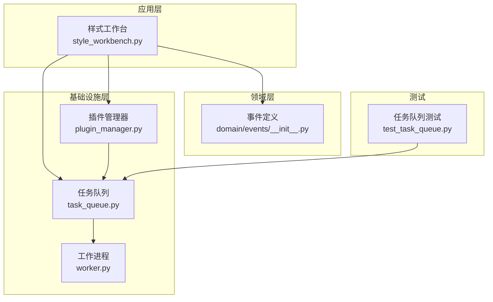
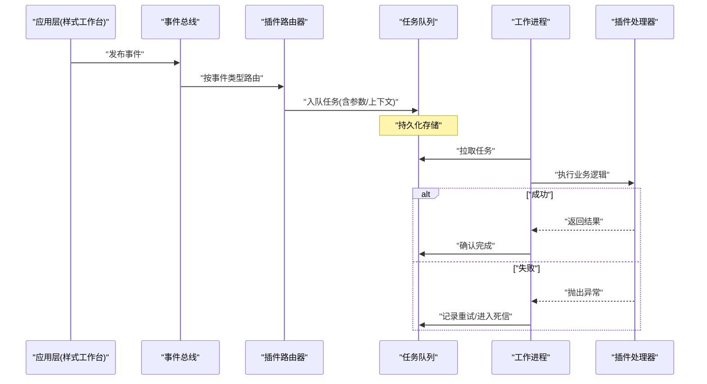
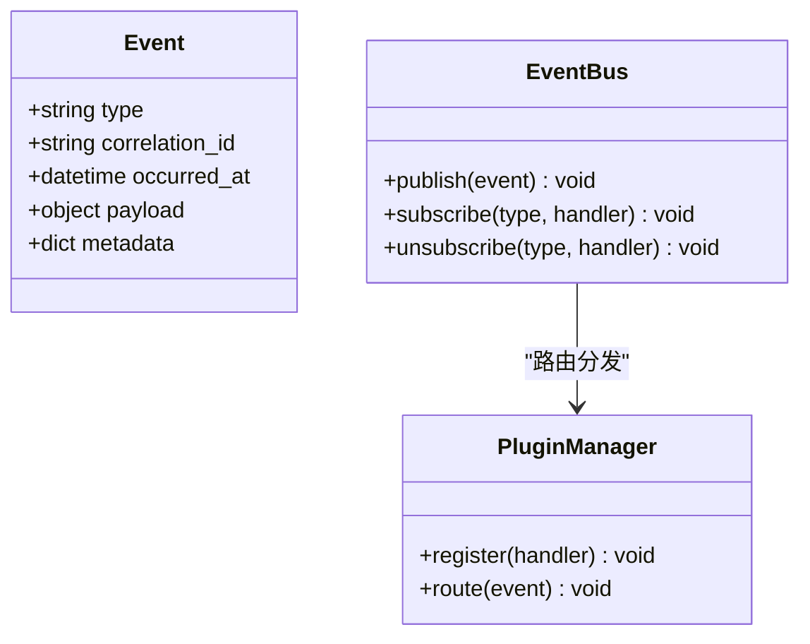
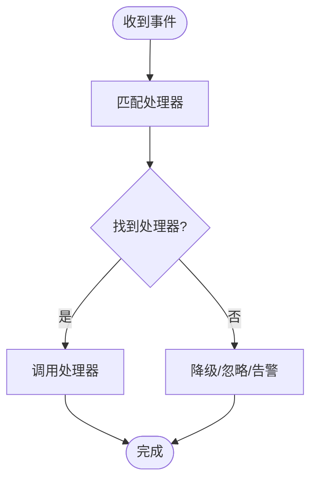
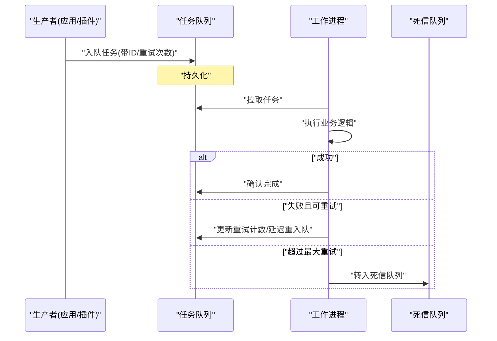
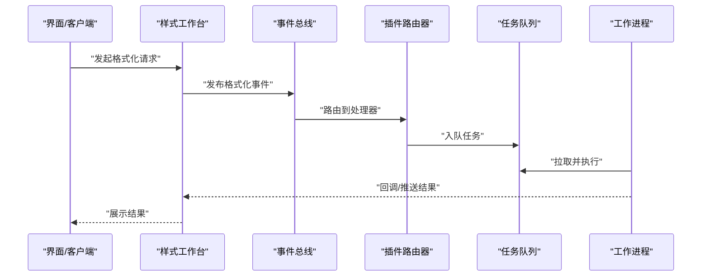
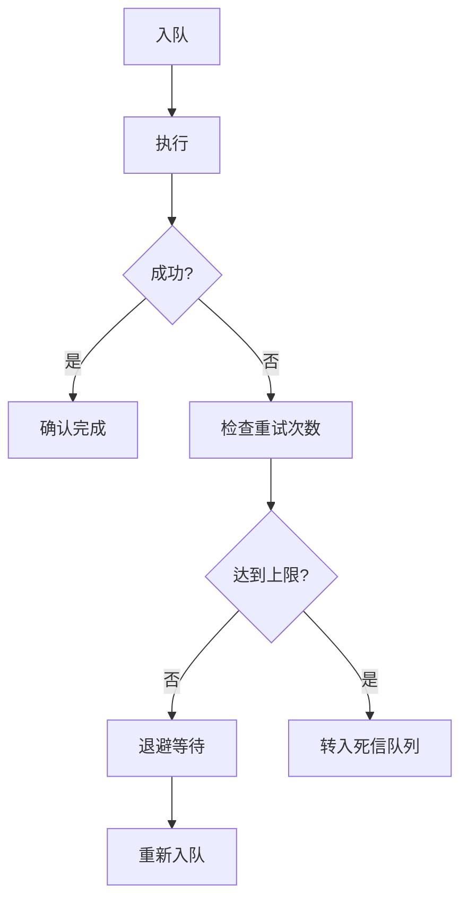
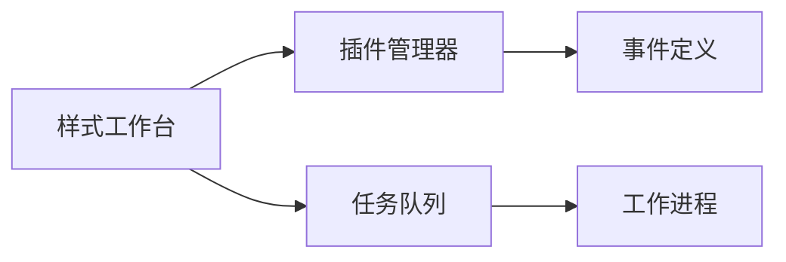

# 事件驱动消息传递

<cite>
**本文引用的文件**   
- [src/paper_format_corrector/infrastructure/queue/task_queue.py](file://src/paper_format_corrector/infrastructure/queue/task_queue.py)
- [src/paper_format_corrector/infrastructure/queue/worker.py](file://src/paper_format_corrector/infrastructure/queue/worker.py)
- [src/paper_format_corrector/domain/events/__init__.py](file://src/paper_format_corrector/domain/events/__init__.py)
- [src/paper_format_corrector/infra/plugin_manager.py](file://src/paper_format_corrector/infra/plugin_manager.py)
- [src/paper_format_corrector/application/services/style_workbench.py](file://src/paper_format_corrector/application/services/style_workbench.py)
- [tests/test_task_queue.py](file://tests/test_task_queue.py)
</cite>

## 目录
1. [简介](#简介)
2. [项目结构](#项目结构)
3. [核心组件](#核心组件)
4. [架构总览](#架构总览)
5. [详细组件分析](#详细组件分析)
6. [依赖关系分析](#依赖关系分析)
7. [性能考虑](#性能考虑)
8. [故障排查指南](#故障排查指南)
9. [结论](#结论)
10. [附录](#附录)

## 简介
本文件聚焦于系统内部的事件驱动与消息传递机制，覆盖以下主题：
- 发布/订阅模型与事件总线
- 插件系统的消息路由与工作台的交互事件处理
- 异步消息队列的实现、确认机制与重试策略
- 消息持久化、死信队列（DLQ）处理
- 关键流程图与序列图

## 项目结构
围绕事件与消息的关键代码主要分布在以下模块：
- 领域事件定义：domain/events
- 基础设施队列：infrastructure/queue
- 插件管理与路由：infra/plugin_manager
- 工作台服务：application/services/style_workbench
- 任务队列测试：tests/test_task_queue.py

图表来源
- [src/paper_format_corrector/application/services/style_workbench.py](file://src/paper_format_corrector/application/services/style_workbench.py)
- [src/paper_format_corrector/domain/events/__init__.py](file://src/paper_format_corrector/domain/events/__init__.py)
- [src/paper_format_corrector/infrastructure/queue/task_queue.py](file://src/paper_format_corrector/infrastructure/queue/task_queue.py)
- [src/paper_format_corrector/infrastructure/queue/worker.py](file://src/paper_format_corrector/infrastructure/queue/worker.py)
- [src/paper_format_corrector/infra/plugin_manager.py](file://src/paper_format_corrector/infra/plugin_manager.py)
- [tests/test_task_queue.py](file://tests/test_task_queue.py)

章节来源
- [src/paper_format_corrector/application/services/style_workbench.py](file://src/paper_format_corrector/application/services/style_workbench.py)
- [src/paper_format_corrector/domain/events/__init__.py](file://src/paper_format_corrector/domain/events/__init__.py)
- [src/paper_format_corrector/infrastructure/queue/task_queue.py](file://src/paper_format_corrector/infrastructure/queue/task_queue.py)
- [src/paper_format_corrector/infrastructure/queue/worker.py](file://src/paper_format_corrector/infrastructure/queue/worker.py)
- [src/paper_format_corrector/infra/plugin_manager.py](file://src/paper_format_corrector/infra/plugin_manager.py)
- [tests/test_task_queue.py](file://tests/test_task_queue.py)

## 核心组件
- 事件定义（领域层）
  - 用于描述系统内发生的业务事件，供发布/订阅消费。
- 任务队列（基础设施层）
  - 提供异步任务入队、出队、重试、持久化等能力。
- 工作进程（基础设施层）
  - 从队列拉取任务并执行，负责确认与失败处理。
- 插件管理器（基础设施层）
  - 注册插件处理器，按事件类型进行路由分发。
- 样式工作台（应用层）
  - 作为事件发布者与消费者，协调格式化流程与插件调用。

章节来源
- [src/paper_format_corrector/domain/events/__init__.py](file://src/paper_format_corrector/domain/events/__init__.py)
- [src/paper_format_corrector/infrastructure/queue/task_queue.py](file://src/paper_format_corrector/infrastructure/queue/task_queue.py)
- [src/paper_format_corrector/infrastructure/queue/worker.py](file://src/paper_format_corrector/infrastructure/queue/worker.py)
- [src/paper_format_corrector/infra/plugin_manager.py](file://src/paper_format_corrector/infra/plugin_manager.py)
- [src/paper_format_corrector/application/services/style_workbench.py](file://src/paper_format_corrector/application/services/style_workbench.py)

## 架构总览
下图展示了“发布-订阅 + 异步队列”的整体交互：应用层通过事件总线发布事件；插件管理器根据事件类型路由到对应处理器；工作进程从队列中拉取任务并执行，完成确认后返回结果或进入重试/死信流程。

图表来源
- [src/paper_format_corrector/application/services/style_workbench.py](file://src/paper_format_corrector/application/services/style_workbench.py)
- [src/paper_format_corrector/infra/plugin_manager.py](file://src/paper_format_corrector/infra/plugin_manager.py)
- [src/paper_format_corrector/infrastructure/queue/task_queue.py](file://src/paper_format_corrector/infrastructure/queue/task_queue.py)
- [src/paper_format_corrector/infrastructure/queue/worker.py](file://src/paper_format_corrector/infrastructure/queue/worker.py)

## 详细组件分析

### 事件定义与发布/订阅
- 事件定义位于领域层，用于统一事件结构与语义。
- 发布/订阅通常由事件总线实现，将事件分发至已注册的处理器。
- 建议事件包含：事件类型、关联ID、时间戳、负载数据、扩展元数据。

图表来源
- [src/paper_format_corrector/domain/events/__init__.py](file://src/paper_format_corrector/domain/events/__init__.py)
- [src/paper_format_corrector/infra/plugin_manager.py](file://src/paper_format_corrector/infra/plugin_manager.py)

章节来源
- [src/paper_format_corrector/domain/events/__init__.py](file://src/paper_format_corrector/domain/events/__init__.py)
- [src/paper_format_corrector/infra/plugin_manager.py](file://src/paper_format_corrector/infra/plugin_manager.py)

### 插件系统与消息路由
- 插件管理器负责插件生命周期与事件路由。
- 路由策略可按事件类型精确匹配，支持通配或优先级策略（若实现）。
- 工作台在需要时触发插件处理，如格式校验、样式转换等。

图表来源
- [src/paper_format_corrector/infra/plugin_manager.py](file://src/paper_format_corrector/infra/plugin_manager.py)
- [src/paper_format_corrector/application/services/style_workbench.py](file://src/paper_format_corrector/application/services/style_workbench.py)

章节来源
- [src/paper_format_corrector/infra/plugin_manager.py](file://src/paper_format_corrector/infra/plugin_manager.py)
- [src/paper_format_corrector/application/services/style_workbench.py](file://src/paper_format_corrector/application/services/style_workbench.py)

### 异步消息队列与确认机制
- 任务队列提供入队/出队接口，支持持久化存储。
- 工作进程拉取任务后执行，成功后发送确认；失败则进入重试或死信队列。
- 建议为每条任务分配唯一ID，便于追踪与幂等处理。

图表来源
- [src/paper_format_corrector/infrastructure/queue/task_queue.py](file://src/paper_format_corrector/infrastructure/queue/task_queue.py)
- [src/paper_format_corrector/infrastructure/queue/worker.py](file://src/paper_format_corrector/infrastructure/queue/worker.py)

章节来源
- [src/paper_format_corrector/infrastructure/queue/task_queue.py](file://src/paper_format_corrector/infrastructure/queue/task_queue.py)
- [src/paper_format_corrector/infrastructure/queue/worker.py](file://src/paper_format_corrector/infrastructure/queue/worker.py)

### 工作台交互事件处理
- 样式工作台作为编排者，负责：
  - 接收用户操作或外部请求
  - 发布相应事件
  - 监听处理结果并反馈给用户
- 与插件系统协作，动态选择处理器执行具体逻辑。

图表来源
- [src/paper_format_corrector/application/services/style_workbench.py](file://src/paper_format_corrector/application/services/style_workbench.py)
- [src/paper_format_corrector/infra/plugin_manager.py](file://src/paper_format_corrector/infra/plugin_manager.py)
- [src/paper_format_corrector/infrastructure/queue/task_queue.py](file://src/paper_format_corrector/infrastructure/queue/task_queue.py)
- [src/paper_format_corrector/infrastructure/queue/worker.py](file://src/paper_format_corrector/infrastructure/queue/worker.py)

章节来源
- [src/paper_format_corrector/application/services/style_workbench.py](file://src/paper_format_corrector/application/services/style_workbench.py)
- [src/paper_format_corrector/infra/plugin_manager.py](file://src/paper_format_corrector/infra/plugin_manager.py)
- [src/paper_format_corrector/infrastructure/queue/task_queue.py](file://src/paper_format_corrector/infrastructure/queue/task_queue.py)
- [src/paper_format_corrector/infrastructure/queue/worker.py](file://src/paper_format_corrector/infrastructure/queue/worker.py)

### 消息持久化、重试与死信队列
- 持久化：任务入队即落盘，保障崩溃恢复与顺序性。
- 重试：基于最大重试次数与退避策略（指数退避/固定间隔）。
- 死信：超过重试上限的任务转入死信队列，供人工介入或离线分析。

图表来源
- [src/paper_format_corrector/infrastructure/queue/task_queue.py](file://src/paper_format_corrector/infrastructure/queue/task_queue.py)
- [src/paper_format_corrector/infrastructure/queue/worker.py](file://src/paper_format_corrector/infrastructure/queue/worker.py)

章节来源
- [src/paper_format_corrector/infrastructure/queue/task_queue.py](file://src/paper_format_corrector/infrastructure/queue/task_queue.py)
- [src/paper_format_corrector/infrastructure/queue/worker.py](file://src/paper_format_corrector/infrastructure/queue/worker.py)

## 依赖关系分析
- 应用层依赖基础设施层的队列与插件管理。
- 插件管理器依赖事件定义以识别处理器。
- 工作进程依赖队列的拉取与确认接口。

图表来源
- [src/paper_format_corrector/application/services/style_workbench.py](file://src/paper_format_corrector/application/services/style_workbench.py)
- [src/paper_format_corrector/infra/plugin_manager.py](file://src/paper_format_corrector/infra/plugin_manager.py)
- [src/paper_format_corrector/domain/events/__init__.py](file://src/paper_format_corrector/domain/events/__init__.py)
- [src/paper_format_corrector/infrastructure/queue/task_queue.py](file://src/paper_format_corrector/infrastructure/queue/task_queue.py)
- [src/paper_format_corrector/infrastructure/queue/worker.py](file://src/paper_format_corrector/infrastructure/queue/worker.py)

章节来源
- [src/paper_format_corrector/application/services/style_workbench.py](file://src/paper_format_corrector/application/services/style_workbench.py)
- [src/paper_format_corrector/infra/plugin_manager.py](file://src/paper_format_corrector/infra/plugin_manager.py)
- [src/paper_format_corrector/domain/events/__init__.py](file://src/paper_format_corrector/domain/events/__init__.py)
- [src/paper_format_corrector/infrastructure/queue/task_queue.py](file://src/paper_format_corrector/infrastructure/queue/task_queue.py)
- [src/paper_format_corrector/infrastructure/queue/worker.py](file://src/paper_format_corrector/infrastructure/queue/worker.py)

## 性能考虑
- 并发度：合理配置工作进程数量，避免资源争用。
- 背压：当队列积压时，限制生产者速率或扩容消费者。
- 幂等：确保任务可重复执行而不产生副作用。
- 批处理：对轻量任务采用批量拉取与提交，降低开销。
- 监控：跟踪入队/出队/确认/重试/死信指标，及时预警。

## 故障排查指南
- 常见问题
  - 任务未确认导致重复消费：检查工作进程确认逻辑与异常分支。
  - 死信堆积：分析失败原因，必要时调整重试策略或修复处理器。
  - 插件路由失败：核对事件类型与处理器注册是否一致。
- 定位手段
  - 使用任务ID追踪全链路日志。
  - 查看队列状态与死信队列内容。
  - 验证插件注册表与事件映射。

章节来源
- [tests/test_task_queue.py](file://tests/test_task_queue.py)

## 结论
本系统通过“事件定义 + 插件路由 + 异步队列 + 确认/重试/死信”的组合，实现了高可靠的消息传递与可扩展的处理能力。工作台作为编排中心，将用户交互转化为事件，交由插件与队列协同完成复杂任务，具备良好的弹性与可观测性。

## 附录
- 术语
  - 事件：系统内发生的事实，携带必要上下文。
  - 任务：可被工作进程执行的单元，具备唯一ID与重试信息。
  - 死信队列：存放无法处理的任务，供后续分析与修复。
- 最佳实践
  - 为每个事件/任务设计稳定标识与版本字段。
  - 处理器保持无状态与幂等。
  - 明确超时与重试边界，避免雪崩。
  - 完善日志与指标采集，支撑排障与容量规划。