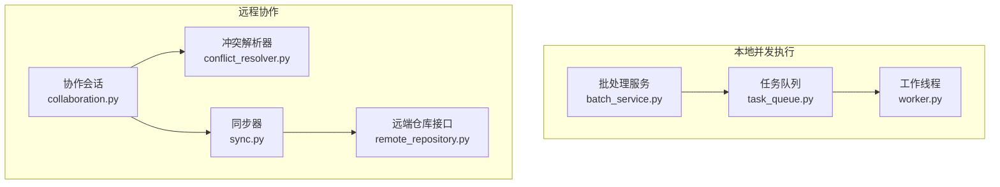
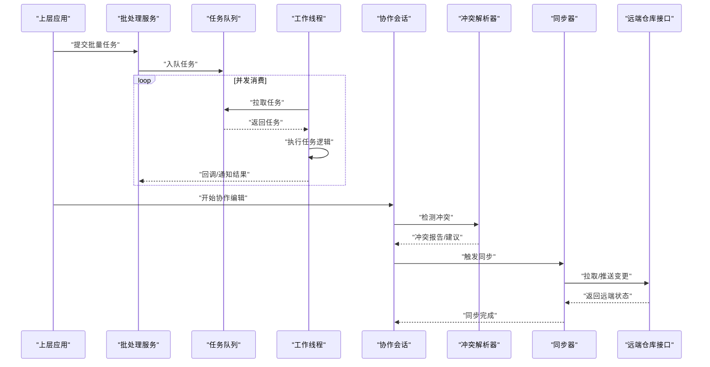
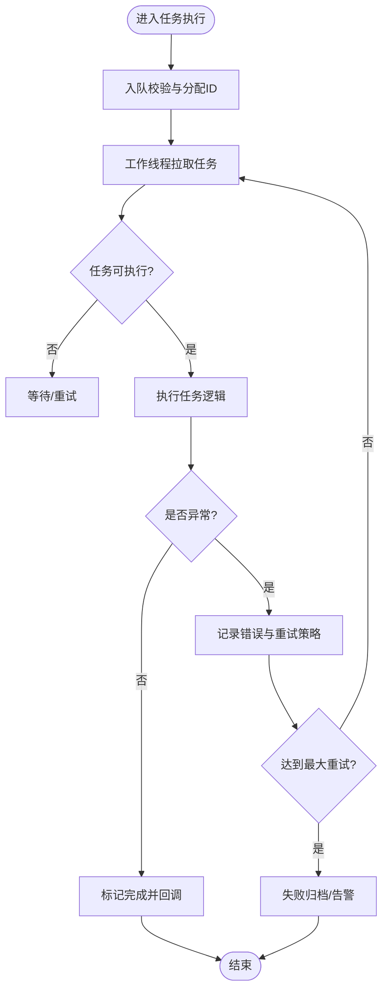
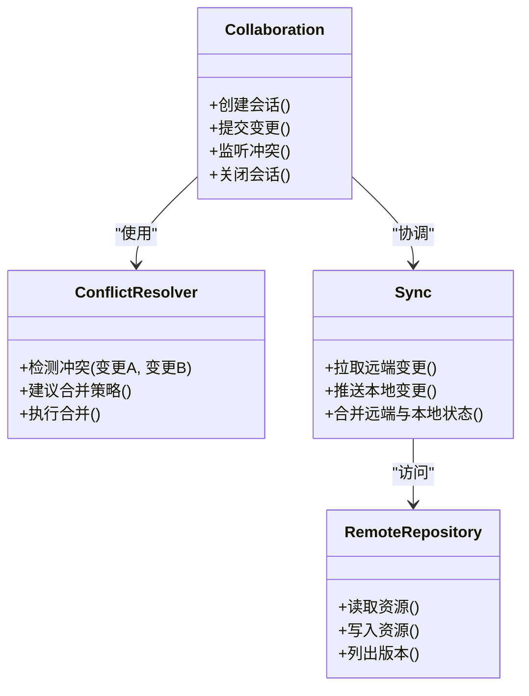
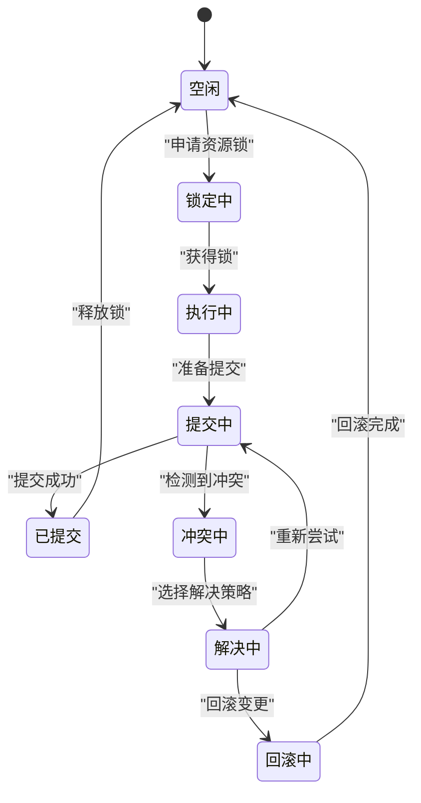
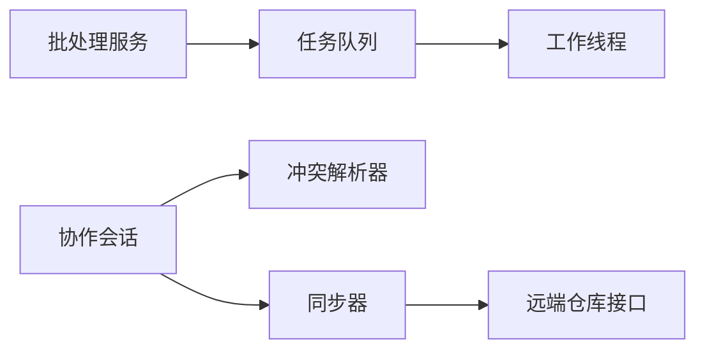

# 并发控制与状态管理

<cite>
**本文引用的文件**   
- [src/paper_format_corrector/infrastructure/queue/task_queue.py](file://src/paper_format_corrector/infrastructure/queue/task_queue.py)
- [src/paper_format_corrector/infrastructure/queue/worker.py](file://src/paper_format_corrector/infrastructure/queue/worker.py)
- [src/paper_format_corrector/infra/remote/collaboration.py](file://src/paper_format_corrector/infra/remote/collaboration.py)
- [src/paper_format_corrector/infra/remote/conflict_resolver.py](file://src/paper_format_corrector/infra/remote/conflict_resolver.py)
- [src/paper_format_corrector/infra/remote/sync.py](file://src/paper_format_corrector/infra/remote/sync.py)
- [src/paper_format_corrector/infra/remote/remote_repository.py](file://src/paper_format_corrector/infra/remote/remote_repository.py)
- [src/paper_format_corrector/application/services/batch_service.py](file://src/paper_format_corrector/application/services/batch_service.py)
- [tests/test_task_queue.py](file://tests/test_task_queue.py)
</cite>

## 目录
1. [简介](#简介)
2. [项目结构](#项目结构)
3. [核心组件](#核心组件)
4. [架构总览](#架构总览)
5. [详细组件分析](#详细组件分析)
6. [依赖关系分析](#依赖关系分析)
7. [性能考虑](#性能考虑)
8. [故障排查指南](#故障排查指南)
9. [结论](#结论)
10. [附录](#附录)

## 简介
本文件聚焦于“并发控制与状态管理”，围绕以下目标展开：
- 任务队列的并发处理机制与工作线程的状态同步
- 协作编辑中的冲突检测与解决策略
- 分布式环境下的状态一致性与锁机制
- 并发流程图与状态机图
- 性能监控、资源调度与故障恢复策略

## 项目结构
与并发和状态相关的代码主要分布在两个子系统中：
- 本地并发执行子系统：基于任务队列与工作线程，负责批处理任务的并发调度与执行
- 远程协作子系统：提供协作会话、冲突检测与合并、同步与远端仓库访问等能力

图表来源
- [src/paper_format_corrector/infrastructure/queue/task_queue.py](file://src/paper_format_corrector/infrastructure/queue/task_queue.py)
- [src/paper_format_corrector/infrastructure/queue/worker.py](file://src/paper_format_corrector/infrastructure/queue/worker.py)
- [src/paper_format_corrector/application/services/batch_service.py](file://src/paper_format_corrector/application/services/batch_service.py)
- [src/paper_format_corrector/infra/remote/collaboration.py](file://src/paper_format_corrector/infra/remote/collaboration.py)
- [src/paper_format_corrector/infra/remote/conflict_resolver.py](file://src/paper_format_corrector/infra/remote/conflict_resolver.py)
- [src/paper_format_corrector/infra/remote/sync.py](file://src/paper_format_corrector/infra/remote/sync.py)
- [src/paper_format_corrector/infra/remote/remote_repository.py](file://src/paper_format_corrector/infra/remote/remote_repository.py)

章节来源
- [src/paper_format_corrector/infrastructure/queue/task_queue.py](file://src/paper_format_corrector/infrastructure/queue/task_queue.py)
- [src/paper_format_corrector/infrastructure/queue/worker.py](file://src/paper_format_corrector/infrastructure/queue/worker.py)
- [src/paper_format_corrector/application/services/batch_service.py](file://src/paper_format_corrector/application/services/batch_service.py)
- [src/paper_format_corrector/infra/remote/collaboration.py](file://src/paper_format_corrector/infra/remote/collaboration.py)
- [src/paper_format_corrector/infra/remote/conflict_resolver.py](file://src/paper_format_corrector/infra/remote/conflict_resolver.py)
- [src/paper_format_corrector/infra/remote/sync.py](file://src/paper_format_corrector/infra/remote/sync.py)
- [src/paper_format_corrector/infra/remote/remote_repository.py](file://src/paper_format_corrector/infra/remote/remote_repository.py)

## 核心组件
- 任务队列（TaskQueue）：维护待执行任务集合，提供入队、出队、取消与查询能力；在并发场景下需保证线程安全。
- 工作线程（Worker）：从队列拉取任务并执行，支持生命周期管理与错误上报。
- 批处理服务（BatchService）：面向上层应用的任务编排入口，负责批量提交与结果聚合。
- 协作会话（Collaboration）：管理多用户编辑会话，协调变更事件与版本信息。
- 冲突解析器（ConflictResolver）：对同一资源的并发修改进行差异比对与合并策略选择。
- 同步器（Sync）：负责本地与远端仓库之间的增量同步、拉取与推送。
- 远端仓库接口（RemoteRepository）：抽象远端存储与网络交互，为同步器提供统一数据访问。

章节来源
- [src/paper_format_corrector/infrastructure/queue/task_queue.py](file://src/paper_format_corrector/infrastructure/queue/task_queue.py)
- [src/paper_format_corrector/infrastructure/queue/worker.py](file://src/paper_format_corrector/infrastructure/queue/worker.py)
- [src/paper_format_corrector/application/services/batch_service.py](file://src/paper_format_corrector/application/services/batch_service.py)
- [src/paper_format_corrector/infra/remote/collaboration.py](file://src/paper_format_corrector/infra/remote/collaboration.py)
- [src/paper_format_corrector/infra/remote/conflict_resolver.py](file://src/paper_format_corrector/infra/remote/conflict_resolver.py)
- [src/paper_format_corrector/infra/remote/sync.py](file://src/paper_format_corrector/infra/remote/sync.py)
- [src/paper_format_corrector/infra/remote/remote_repository.py](file://src/paper_format_corrector/infra/remote/remote_repository.py)

## 架构总览
下图展示了从批处理服务到任务队列与工作线程的执行路径，以及协作模块与远端仓库的交互关系。

图表来源
- [src/paper_format_corrector/application/services/batch_service.py](file://src/paper_format_corrector/application/services/batch_service.py)
- [src/paper_format_corrector/infrastructure/queue/task_queue.py](file://src/paper_format_corrector/infrastructure/queue/task_queue.py)
- [src/paper_format_corrector/infrastructure/queue/worker.py](file://src/paper_format_corrector/infrastructure/queue/worker.py)
- [src/paper_format_corrector/infra/remote/collaboration.py](file://src/paper_format_corrector/infra/remote/collaboration.py)
- [src/paper_format_corrector/infra/remote/conflict_resolver.py](file://src/paper_format_corrector/infra/remote/conflict_resolver.py)
- [src/paper_format_corrector/infra/remote/sync.py](file://src/paper_format_corrector/infra/remote/sync.py)
- [src/paper_format_corrector/infra/remote/remote_repository.py](file://src/paper_format_corrector/infra/remote/remote_repository.py)

## 详细组件分析

### 任务队列与工作线程（并发处理与状态同步）
- 并发模型
  - 生产者：批处理服务将任务加入队列
  - 消费者：多个工作线程循环从队列拉取任务执行
  - 状态同步：通过队列内部的数据结构与事件通知实现线程间状态一致性
- 关键流程
  - 入队：校验任务参数、分配唯一标识、写入队列
  - 出队：阻塞或轮询获取任务，避免忙等
  - 执行：工作线程执行任务，捕获异常并记录结果
  - 完成：更新任务状态、释放资源、触发回调
- 并发控制要点
  - 线程安全：队列操作需加锁或使用线程安全数据结构
  - 背压与限流：根据工作线程数量与系统负载动态调整吞吐
  - 幂等性：任务设计应支持重复执行而不产生副作用

图表来源
- [src/paper_format_corrector/infrastructure/queue/task_queue.py](file://src/paper_format_corrector/infrastructure/queue/task_queue.py)
- [src/paper_format_corrector/infrastructure/queue/worker.py](file://src/paper_format_corrector/infrastructure/queue/worker.py)
- [src/paper_format_corrector/application/services/batch_service.py](file://src/paper_format_corrector/application/services/batch_service.py)

章节来源
- [src/paper_format_corrector/infrastructure/queue/task_queue.py](file://src/paper_format_corrector/infrastructure/queue/task_queue.py)
- [src/paper_format_corrector/infrastructure/queue/worker.py](file://src/paper_format_corrector/infrastructure/queue/worker.py)
- [src/paper_format_corrector/application/services/batch_service.py](file://src/paper_format_corrector/application/services/batch_service.py)
- [tests/test_task_queue.py](file://tests/test_task_queue.py)

### 协作编辑（冲突检测与解决策略）
- 冲突检测
  - 基于文档片段或行级差异进行比对
  - 识别重叠修改区域，生成冲突报告
- 解决策略
  - 自动合并：对无冲突或可确定性合并的变更进行自动整合
  - 人工介入：对复杂冲突提示用户选择保留策略
  - 版本回滚：在不可合并时回退到最近一致点
- 协作会话
  - 维护会话上下文、参与者信息与变更序列
  - 与同步器配合，确保本地与远端状态一致

图表来源
- [src/paper_format_corrector/infra/remote/collaboration.py](file://src/paper_format_corrector/infra/remote/collaboration.py)
- [src/paper_format_corrector/infra/remote/conflict_resolver.py](file://src/paper_format_corrector/infra/remote/conflict_resolver.py)
- [src/paper_format_corrector/infra/remote/sync.py](file://src/paper_format_corrector/infra/remote/sync.py)
- [src/paper_format_corrector/infra/remote/remote_repository.py](file://src/paper_format_corrector/infra/remote/remote_repository.py)

章节来源
- [src/paper_format_corrector/infra/remote/collaboration.py](file://src/paper_format_corrector/infra/remote/collaboration.py)
- [src/paper_format_corrector/infra/remote/conflict_resolver.py](file://src/paper_format_corrector/infra/remote/conflict_resolver.py)
- [src/paper_format_corrector/infra/remote/sync.py](file://src/paper_format_corrector/infra/remote/sync.py)
- [src/paper_format_corrector/infra/remote/remote_repository.py](file://src/paper_format_corrector/infra/remote/remote_repository.py)

### 分布式状态一致性与锁机制
- 一致性模型
  - 最终一致性：允许短暂不一致，通过同步与合并收敛至一致
  - 强一致性：在关键路径上采用锁或事务保证严格一致
- 锁机制
  - 细粒度锁：针对资源片段加锁，提高并发度
  - 乐观锁：基于版本号或时间戳的冲突检测与重试
  - 分布式锁：跨节点协调，防止写写冲突
- 同步策略
  - 增量同步：仅传输差异，降低带宽与延迟
  - 冲突优先：先检测冲突再决定合并或回滚

图表来源
- [src/paper_format_corrector/infra/remote/sync.py](file://src/paper_format_corrector/infra/remote/sync.py)
- [src/paper_format_corrector/infra/remote/remote_repository.py](file://src/paper_format_corrector/infra/remote/remote_repository.py)

章节来源
- [src/paper_format_corrector/infra/remote/sync.py](file://src/paper_format_corrector/infra/remote/sync.py)
- [src/paper_format_corrector/infra/remote/remote_repository.py](file://src/paper_format_corrector/infra/remote/remote_repository.py)

## 依赖关系分析
- 组件耦合
  - 批处理服务依赖任务队列与工作线程，形成生产-消费模型
  - 协作模块依赖冲突解析器与同步器，同步器依赖远端仓库接口
- 外部依赖
  - 网络通信：远端仓库接口封装HTTP/GRPC等协议
  - 序列化：变更与冲突报告的序列化格式
- 潜在环依赖
  - 应避免协作模块直接调用任务队列，保持职责边界清晰

图表来源
- [src/paper_format_corrector/application/services/batch_service.py](file://src/paper_format_corrector/application/services/batch_service.py)
- [src/paper_format_corrector/infrastructure/queue/task_queue.py](file://src/paper_format_corrector/infrastructure/queue/task_queue.py)
- [src/paper_format_corrector/infrastructure/queue/worker.py](file://src/paper_format_corrector/infrastructure/queue/worker.py)
- [src/paper_format_corrector/infra/remote/collaboration.py](file://src/paper_format_corrector/infra/remote/collaboration.py)
- [src/paper_format_corrector/infra/remote/conflict_resolver.py](file://src/paper_format_corrector/infra/remote/conflict_resolver.py)
- [src/paper_format_corrector/infra/remote/sync.py](file://src/paper_format_corrector/infra/remote/sync.py)
- [src/paper_format_corrector/infra/remote/remote_repository.py](file://src/paper_format_corrector/infra/remote/remote_repository.py)

章节来源
- [src/paper_format_corrector/application/services/batch_service.py](file://src/paper_format_corrector/application/services/batch_service.py)
- [src/paper_format_corrector/infrastructure/queue/task_queue.py](file://src/paper_format_corrector/infrastructure/queue/task_queue.py)
- [src/paper_format_corrector/infrastructure/queue/worker.py](file://src/paper_format_corrector/infrastructure/queue/worker.py)
- [src/paper_format_corrector/infra/remote/collaboration.py](file://src/paper_format_corrector/infra/remote/collaboration.py)
- [src/paper_format_corrector/infra/remote/conflict_resolver.py](file://src/paper_format_corrector/infra/remote/conflict_resolver.py)
- [src/paper_format_corrector/infra/remote/sync.py](file://src/paper_format_corrector/infra/remote/sync.py)
- [src/paper_format_corrector/infra/remote/remote_repository.py](file://src/paper_format_corrector/infra/remote/remote_repository.py)

## 性能考虑
- 并发度调优
  - 工作线程数与CPU核数匹配，I/O密集型可适当增加
  - 队列容量与背压策略平衡内存占用与吞吐
- 资源调度
  - 优先级队列：高优先级任务优先执行
  - 资源隔离：按任务类型划分线程池，避免相互影响
- 监控指标
  - 队列长度、平均等待时间、任务成功率、错误率
  - 工作线程利用率、GC频率、内存峰值
- 优化建议
  - 批量提交减少锁竞争
  - 任务幂等与去重避免重复计算
  - 异步回调与事件驱动提升响应速度

[本节为通用指导，不直接分析具体文件]

## 故障排查指南
- 常见问题
  - 任务堆积：检查工作线程是否挂起或异常退出
  - 死锁风险：确认锁粒度与持有时间，避免嵌套锁
  - 冲突频繁：评估变更粒度与合并策略
- 定位方法
  - 日志追踪：记录任务生命周期与关键状态转换
  - 指标采集：监控队列与工作线程健康度
  - 复现用例：使用测试套件验证并发场景
- 恢复策略
  - 自动重试与退避
  - 失败任务归档与人工干预
  - 快照与回滚到稳定版本

章节来源
- [tests/test_task_queue.py](file://tests/test_task_queue.py)

## 结论
本方案通过任务队列与工作线程实现高效并发执行，结合协作与会话机制保障多用户编辑的一致性。通过合理的锁策略、冲突检测与合并算法，系统在分布式环境下具备较强的鲁棒性与可扩展性。配合完善的监控与故障恢复策略，可在高负载与复杂场景中保持稳定运行。

[本节为总结性内容，不直接分析具体文件]

## 附录
- 术语表
  - 任务队列：用于缓冲与分发任务的并发数据结构
  - 工作线程：执行队列中任务的并发实体
  - 协作会话：多用户共同编辑时的上下文与协调机制
  - 冲突解析：对并发修改进行差异比对与合并的过程
  - 同步器：负责本地与远端状态一致的组件
  - 远端仓库接口：抽象远端存储与网络访问的统一接口

[本节为概念性说明，不直接分析具体文件]