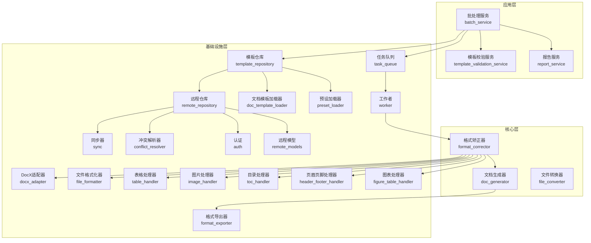
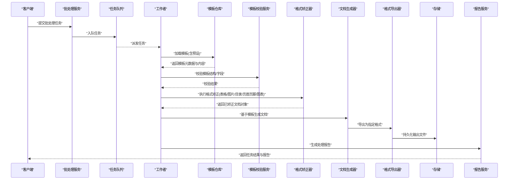
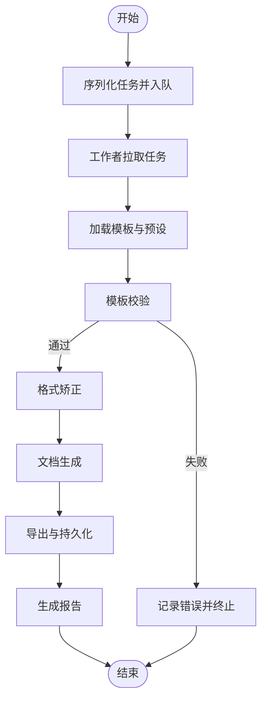
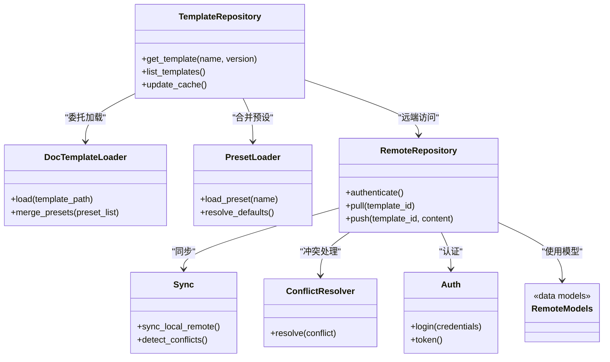
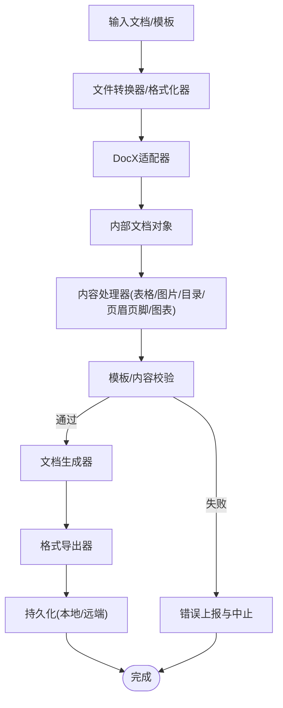
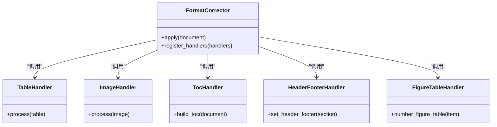
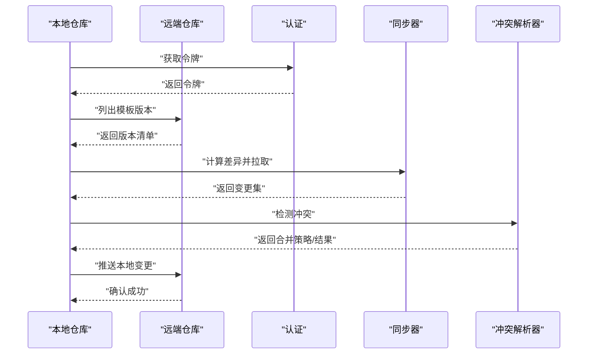
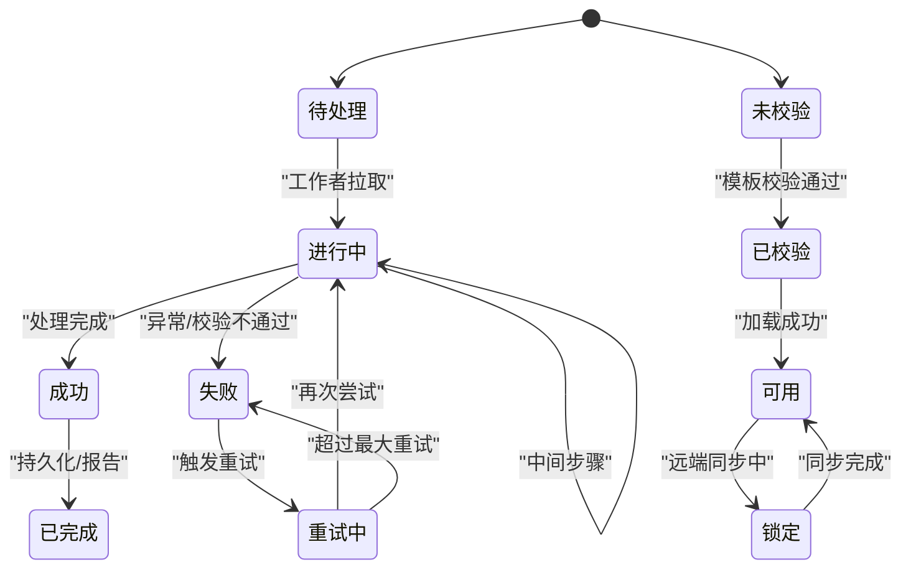
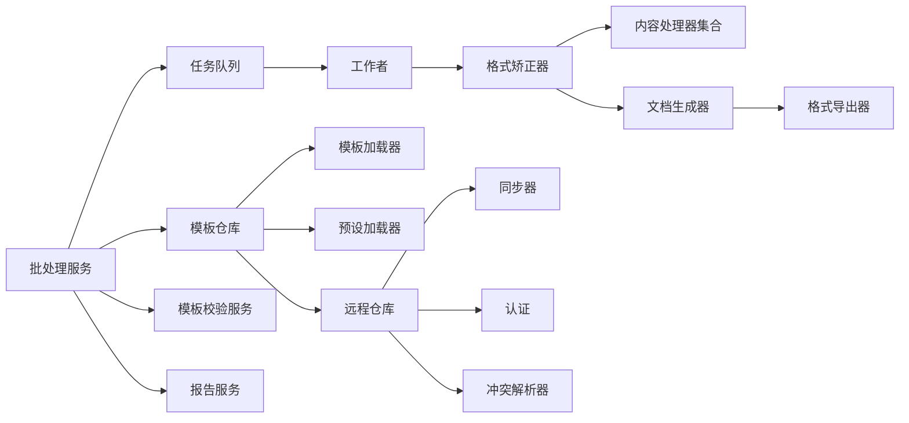

# 数据流模式

<cite>
**本文引用的文件**   
- [src/paper_format_corrector/application/services/batch_service.py](file://src/paper_format_corrector/application/services/batch_service.py)
- [src/paper_format_corrector/infrastructure/queue/task_queue.py](file://src/paper_format_corrector/infrastructure/queue/task_queue.py)
- [src/paper_format_corrector/infrastructure/queue/worker.py](file://src/paper_format_corrector/infrastructure/queue/worker.py)
- [src/paper_format_corrector/core/format_corrector.py](file://src/paper_format_corrector/core/format_corrector.py)
- [src/paper_format_corrector/core/doc_generator.py](file://src/paper_format_corrector/core/doc_generator.py)
- [src/paper_format_corrector/core/file_converter.py](file://src/paper_format_corrector/core/file_converter.py)
- [src/paper_format_corrector/infra/template_repository.py](file://src/paper_format_corrector/infra/template_repository.py)
- [src/paper_format_corrector/infra/doc_template_loader.py](file://src/paper_format_corrector/infra/doc_template_loader.py)
- [src/paper_format_corrector/infra/preset_loader.py](file://src/paper_format_corrector/infra/preset_loader.py)
- [src/paper_format_corrector/application/services/template_validation_service.py](file://src/paper_format_corrector/application/services/template_validation_service.py)
- [src/paper_format_corrector/application/services/report_service.py](file://src/paper_format_corrector/application/services/report_service.py)
- [src/paper_format_corrector/infrastructure/adapters/docx_adapter.py](file://src/paper_format_corrector/infrastructure/adapters/docx_adapter.py)
- [src/paper_format_corrector/infrastructure/converters/file_formatter.py](file://src/paper_format_corrector/infrastructure/converters/file_formatter.py)
- [src/paper_format_corrector/infrastructure/exporters/format_exporter.py](file://src/paper_format_corrector/infrastructure/exporters/format_exporter.py)
- [src/paper_format_corrector/handlers/table_handler.py](file://src/paper_format_corrector/handlers/table_handler.py)
- [src/paper_format_corrector/handlers/image_handler.py](file://src/paper_format_corrector/handlers/image_handler.py)
- [src/paper_format_corrector/handlers/toc_handler.py](file://src/paper_format_corrector/handlers/toc_handler.py)
- [src/paper_format_corrector/handlers/header_footer_handler.py](file://src/paper_format_corrector/handlers/header_footer_handler.py)
- [src/paper_format_corrector/handlers/figure_table_handler.py](file://src/paper_format_corrector/handlers/figure_table_handler.py)
- [src/paper_format_corrector/infrastructure/remote/remote_repository.py](file://src/paper_format_corrector/infrastructure/remote/remote_repository.py)
- [src/paper_format_corrector/infrastructure/remote/sync.py](file://src/paper_format_corrector/infrastructure/remote/sync.py)
- [src/paper_format_corrector/infrastructure/remote/conflict_resolver.py](file://src/paper_format_corrector/infrastructure/remote/conflict_resolver.py)
- [src/paper_format_corrector/infrastructure/remote/auth.py](file://src/paper_format_corrector/infrastructure/remote/auth.py)
- [src/paper_format_corrector/infrastructure/remote/remote_models.py](file://src/paper_format_corrector/infrastructure/remote/remote_models.py)
- [src/paper_format_corrector/infrastructure/remote/__init__.py](file://src/paper_format_corrector/infrastructure/remote/__init__.py)
- [config/config.yaml](file://config/config.yaml)
- [examples/sample_template.yaml](file://examples/sample_template.yaml)
</cite>

## 目录
1. [简介](#简介)
2. [项目结构](#项目结构)
3. [核心组件](#核心组件)
4. [架构总览](#架构总览)
5. [详细组件分析](#详细组件分析)
6. [依赖关系分析](#依赖关系分析)
7. [性能考虑](#性能考虑)
8. [故障排查指南](#故障排查指南)
9. [结论](#结论)
10. [附录](#附录)

## 简介
本文件聚焦于系统的数据流模式，围绕以下目标展开：
- 描述批处理服务的数据管道设计与执行流程
- 说明模板仓库的数据访问模式与一致性策略
- 解释数据转换、验证与持久化的实现方式
- 提供数据流图与状态转换图
- 阐述数据一致性与事务管理机制

## 项目结构
从数据流视角，系统按“应用层-领域/核心-基础设施”分层组织。关键路径包括：
- 批处理入口与应用编排：batch_service
- 任务队列与工作者：task_queue、worker
- 文档格式矫正与生成：format_corrector、doc_generator
- 模板加载与校验：template_repository、doc_template_loader、preset_loader、template_validation_service
- 文档读写适配与导出：docx_adapter、file_formatter、format_exporter
- 内容处理器：table_handler、image_handler、toc_handler、header_footer_handler、figure_table_handler
- 远程协作与同步：remote_repository、sync、conflict_resolver、auth、remote_models

图示来源
- [src/paper_format_corrector/application/services/batch_service.py](file://src/paper_format_corrector/application/services/batch_service.py)
- [src/paper_format_corrector/infrastructure/queue/task_queue.py](file://src/paper_format_corrector/infrastructure/queue/task_queue.py)
- [src/paper_format_corrector/infrastructure/queue/worker.py](file://src/paper_format_corrector/infrastructure/queue/worker.py)
- [src/paper_format_corrector/core/format_corrector.py](file://src/paper_format_corrector/core/format_corrector.py)
- [src/paper_format_corrector/core/doc_generator.py](file://src/paper_format_corrector/core/doc_generator.py)
- [src/paper_format_corrector/core/file_converter.py](file://src/paper_format_corrector/core/file_converter.py)
- [src/paper_format_corrector/infra/template_repository.py](file://src/paper_format_corrector/infra/template_repository.py)
- [src/paper_format_corrector/infra/doc_template_loader.py](file://src/paper_format_corrector/infra/doc_template_loader.py)
- [src/paper_format_corrector/infra/preset_loader.py](file://src/paper_format_corrector/infra/preset_loader.py)
- [src/paper_format_corrector/application/services/template_validation_service.py](file://src/paper_format_corrector/application/services/template_validation_service.py)
- [src/paper_format_corrector/application/services/report_service.py](file://src/paper_format_corrector/application/services/report_service.py)
- [src/paper_format_corrector/infrastructure/adapters/docx_adapter.py](file://src/paper_format_corrector/infrastructure/adapters/docx_adapter.py)
- [src/paper_format_corrector/infrastructure/converters/file_formatter.py](file://src/paper_format_corrector/infrastructure/converters/file_formatter.py)
- [src/paper_format_corrector/infrastructure/exporters/format_exporter.py](file://src/paper_format_corrector/infrastructure/exporters/format_exporter.py)
- [src/paper_format_corrector/handlers/table_handler.py](file://src/paper_format_corrector/handlers/table_handler.py)
- [src/paper_format_corrector/handlers/image_handler.py](file://src/paper_format_corrector/handlers/image_handler.py)
- [src/paper_format_corrector/handlers/toc_handler.py](file://src/paper_format_corrector/handlers/toc_handler.py)
- [src/paper_format_corrector/handlers/header_footer_handler.py](file://src/paper_format_corrector/handlers/header_footer_handler.py)
- [src/paper_format_corrector/handlers/figure_table_handler.py](file://src/paper_format_corrector/handlers/figure_table_handler.py)
- [src/paper_format_corrector/infrastructure/remote/remote_repository.py](file://src/paper_format_corrector/infrastructure/remote/remote_repository.py)
- [src/paper_format_corrector/infrastructure/remote/sync.py](file://src/paper_format_corrector/infrastructure/remote/sync.py)
- [src/paper_format_corrector/infrastructure/remote/conflict_resolver.py](file://src/paper_format_corrector/infrastructure/remote/conflict_resolver.py)
- [src/paper_format_corrector/infrastructure/remote/auth.py](file://src/paper_format_corrector/infrastructure/remote/auth.py)
- [src/paper_format_corrector/infrastructure/remote/remote_models.py](file://src/paper_format_corrector/infrastructure/remote/remote_models.py)

章节来源
- [src/paper_format_corrector/application/services/batch_service.py](file://src/paper_format_corrector/application/services/batch_service.py)
- [src/paper_format_corrector/infrastructure/queue/task_queue.py](file://src/paper_format_corrector/infrastructure/queue/task_queue.py)
- [src/paper_format_corrector/infrastructure/queue/worker.py](file://src/paper_format_corrector/infrastructure/queue/worker.py)
- [src/paper_format_corrector/core/format_corrector.py](file://src/paper_format_corrector/core/format_corrector.py)
- [src/paper_format_corrector/core/doc_generator.py](file://src/paper_format_corrector/core/doc_generator.py)
- [src/paper_format_corrector/core/file_converter.py](file://src/paper_format_corrector/core/file_converter.py)
- [src/paper_format_corrector/infra/template_repository.py](file://src/paper_format_corrector/infra/template_repository.py)
- [src/paper_format_corrector/infra/doc_template_loader.py](file://src/paper_format_corrector/infra/doc_template_loader.py)
- [src/paper_format_corrector/infra/preset_loader.py](file://src/paper_format_corrector/infra/preset_loader.py)
- [src/paper_format_corrector/application/services/template_validation_service.py](file://src/paper_format_corrector/application/services/template_validation_service.py)
- [src/paper_format_corrector/application/services/report_service.py](file://src/paper_format_corrector/application/services/report_service.py)
- [src/paper_format_corrector/infrastructure/adapters/docx_adapter.py](file://src/paper_format_corrector/infrastructure/adapters/docx_adapter.py)
- [src/paper_format_corrector/infrastructure/converters/file_formatter.py](file://src/paper_format_corrector/infrastructure/converters/file_formatter.py)
- [src/paper_format_corrector/infrastructure/exporters/format_exporter.py](file://src/paper_format_corrector/infrastructure/exporters/format_exporter.py)
- [src/paper_format_corrector/handlers/table_handler.py](file://src/paper_format_corrector/handlers/table_handler.py)
- [src/paper_format_corrector/handlers/image_handler.py](file://src/paper_format_corrector/handlers/image_handler.py)
- [src/paper_format_corrector/handlers/toc_handler.py](file://src/paper_format_corrector/handlers/toc_handler.py)
- [src/paper_format_corrector/handlers/header_footer_handler.py](file://src/paper_format_corrector/handlers/header_footer_handler.py)
- [src/paper_format_corrector/handlers/figure_table_handler.py](file://src/paper_format_corrector/handlers/figure_table_handler.py)
- [src/paper_format_corrector/infrastructure/remote/remote_repository.py](file://src/paper_format_corrector/infrastructure/remote/remote_repository.py)
- [src/paper_format_corrector/infrastructure/remote/sync.py](file://src/paper_format_corrector/infrastructure/remote/sync.py)
- [src/paper_format_corrector/infrastructure/remote/conflict_resolver.py](file://src/paper_format_corrector/infrastructure/remote/conflict_resolver.py)
- [src/paper_format_corrector/infrastructure/remote/auth.py](file://src/paper_format_corrector/infrastructure/remote/auth.py)
- [src/paper_format_corrector/infrastructure/remote/remote_models.py](file://src/paper_format_corrector/infrastructure/remote/remote_models.py)

## 核心组件
- 批处理服务：负责接收批量任务、编排模板校验、读取模板、驱动格式矫正、生成文档与导出结果，并产出报告。
- 任务队列与工作进程：将批处理任务入队，由工作进程消费并执行，支持并发与重试。
- 格式矫正器：组合多个处理器（表格、图片、目录、页眉页脚、图表）对文档进行结构化修正。
- 文档生成器：基于模板与规则生成最终文档，调用导出器完成持久化。
- 模板仓库与加载器：统一访问本地/远端模板，提供缓存与版本管理；预设加载器提供默认样式配置。
- 模板校验服务：在运行前对模板结构与字段进行校验，确保后续处理稳定。
- 报告服务：汇总处理过程信息，输出质量与差异报告。
- DocX适配器与导出器：封装底层文档库操作，统一读写与导出接口。
- 远程仓库与同步：提供模板的远程拉取、推送、冲突解决与认证能力。

章节来源
- [src/paper_format_corrector/application/services/batch_service.py](file://src/paper_format_corrector/application/services/batch_service.py)
- [src/paper_format_corrector/infrastructure/queue/task_queue.py](file://src/paper_format_corrector/infrastructure/queue/task_queue.py)
- [src/paper_format_corrector/infrastructure/queue/worker.py](file://src/paper_format_corrector/infrastructure/queue/worker.py)
- [src/paper_format_corrector/core/format_corrector.py](file://src/paper_format_corrector/core/format_corrector.py)
- [src/paper_format_corrector/core/doc_generator.py](file://src/paper_format_corrector/core/doc_generator.py)
- [src/paper_format_corrector/infra/template_repository.py](file://src/paper_format_corrector/infra/template_repository.py)
- [src/paper_format_corrector/infra/doc_template_loader.py](file://src/paper_format_corrector/infra/doc_template_loader.py)
- [src/paper_format_corrector/infra/preset_loader.py](file://src/paper_format_corrector/infra/preset_loader.py)
- [src/paper_format_corrector/application/services/template_validation_service.py](file://src/paper_format_corrector/application/services/template_validation_service.py)
- [src/paper_format_corrector/application/services/report_service.py](file://src/paper_format_corrector/application/services/report_service.py)
- [src/paper_format_corrector/infrastructure/adapters/docx_adapter.py](file://src/paper_format_corrector/infrastructure/adapters/docx_adapter.py)
- [src/paper_format_corrector/infrastructure/exporters/format_exporter.py](file://src/paper_format_corrector/infrastructure/exporters/format_exporter.py)
- [src/paper_format_corrector/infrastructure/remote/remote_repository.py](file://src/paper_format_corrector/infrastructure/remote/remote_repository.py)
- [src/paper_format_corrector/infrastructure/remote/sync.py](file://src/paper_format_corrector/infrastructure/remote/sync.py)
- [src/paper_format_corrector/infrastructure/remote/conflict_resolver.py](file://src/paper_format_corrector/infrastructure/remote/conflict_resolver.py)
- [src/paper_format_corrector/infrastructure/remote/auth.py](file://src/paper_format_corrector/infrastructure/remote/auth.py)
- [src/paper_format_corrector/infrastructure/remote/remote_models.py](file://src/paper_format_corrector/infrastructure/remote/remote_models.py)

## 架构总览
下图展示一次典型批处理请求的数据流转：从任务入队到工作者执行，再到模板校验、文档矫正、生成与导出，最后写入存储并产出报告。

图示来源
- [src/paper_format_corrector/application/services/batch_service.py](file://src/paper_format_corrector/application/services/batch_service.py)
- [src/paper_format_corrector/infrastructure/queue/task_queue.py](file://src/paper_format_corrector/infrastructure/queue/task_queue.py)
- [src/paper_format_corrector/infrastructure/queue/worker.py](file://src/paper_format_corrector/infrastructure/queue/worker.py)
- [src/paper_format_corrector/infra/template_repository.py](file://src/paper_format_corrector/infra/template_repository.py)
- [src/paper_format_corrector/application/services/template_validation_service.py](file://src/paper_format_corrector/application/services/template_validation_service.py)
- [src/paper_format_corrector/core/format_corrector.py](file://src/paper_format_corrector/core/format_corrector.py)
- [src/paper_format_corrector/core/doc_generator.py](file://src/paper_format_corrector/core/doc_generator.py)
- [src/paper_format_corrector/infrastructure/exporters/format_exporter.py](file://src/paper_format_corrector/infrastructure/exporters/format_exporter.py)
- [src/paper_format_corrector/application/services/report_service.py](file://src/paper_format_corrector/application/services/report_service.py)

## 详细组件分析

### 批处理服务与任务队列
- 数据进入点：批处理服务接收任务参数（输入文档、模板选择、输出格式等），将其序列化为任务消息并入队。
- 任务生命周期：入队后由工作者拉取执行，包含模板加载、校验、矫正、生成、导出与报告生成。
- 并发与重试：队列支持多工作者并行消费；失败任务可配置重试与退避策略。
- 幂等性：任务以唯一ID标识，避免重复处理；中间状态可恢复。

图示来源
- [src/paper_format_corrector/application/services/batch_service.py](file://src/paper_format_corrector/application/services/batch_service.py)
- [src/paper_format_corrector/infrastructure/queue/task_queue.py](file://src/paper_format_corrector/infrastructure/queue/task_queue.py)
- [src/paper_format_corrector/infrastructure/queue/worker.py](file://src/paper_format_corrector/infrastructure/queue/worker.py)

章节来源
- [src/paper_format_corrector/application/services/batch_service.py](file://src/paper_format_corrector/application/services/batch_service.py)
- [src/paper_format_corrector/infrastructure/queue/task_queue.py](file://src/paper_format_corrector/infrastructure/queue/task_queue.py)
- [src/paper_format_corrector/infrastructure/queue/worker.py](file://src/paper_format_corrector/infrastructure/queue/worker.py)

### 模板仓库与加载模式
- 统一访问：模板仓库抽象本地与远端源，提供一致的获取接口。
- 加载顺序：优先使用用户指定模板，其次回退到预设模板；支持按需合并配置。
- 缓存与版本：对模板内容与元数据进行缓存，结合版本标记减少重复IO。
- 远端同步：通过认证模块鉴权，使用同步器拉取/推送模板变更，冲突由冲突解析器处理。

图示来源
- [src/paper_format_corrector/infra/template_repository.py](file://src/paper_format_corrector/infra/template_repository.py)
- [src/paper_format_corrector/infra/doc_template_loader.py](file://src/paper_format_corrector/infra/doc_template_loader.py)
- [src/paper_format_corrector/infra/preset_loader.py](file://src/paper_format_corrector/infra/preset_loader.py)
- [src/paper_format_corrector/infrastructure/remote/remote_repository.py](file://src/paper_format_corrector/infrastructure/remote/remote_repository.py)
- [src/paper_format_corrector/infrastructure/remote/sync.py](file://src/paper_format_corrector/infrastructure/remote/sync.py)
- [src/paper_format_corrector/infrastructure/remote/conflict_resolver.py](file://src/paper_format_corrector/infrastructure/remote/conflict_resolver.py)
- [src/paper_format_corrector/infrastructure/remote/auth.py](file://src/paper_format_corrector/infrastructure/remote/auth.py)
- [src/paper_format_corrector/infrastructure/remote/remote_models.py](file://src/paper_format_corrector/infrastructure/remote/remote_models.py)

章节来源
- [src/paper_format_corrector/infra/template_repository.py](file://src/paper_format_corrector/infra/template_repository.py)
- [src/paper_format_corrector/infra/doc_template_loader.py](file://src/paper_format_corrector/infra/doc_template_loader.py)
- [src/paper_format_corrector/infra/preset_loader.py](file://src/paper_format_corrector/infra/preset_loader.py)
- [src/paper_format_corrector/infrastructure/remote/remote_repository.py](file://src/paper_format_corrector/infrastructure/remote/remote_repository.py)
- [src/paper_format_corrector/infrastructure/remote/sync.py](file://src/paper_format_corrector/infrastructure/remote/sync.py)
- [src/paper_format_corrector/infrastructure/remote/conflict_resolver.py](file://src/paper_format_corrector/infrastructure/remote/conflict_resolver.py)
- [src/paper_format_corrector/infrastructure/remote/auth.py](file://src/paper_format_corrector/infrastructure/remote/auth.py)
- [src/paper_format_corrector/infrastructure/remote/remote_models.py](file://src/paper_format_corrector/infrastructure/remote/remote_models.py)

### 数据转换、验证与持久化
- 数据转换：
  - 文件转换器与文件格式化器负责输入格式的识别与规范化，统一为内部文档对象。
  - DocX适配器封装底层文档库操作，屏蔽具体实现细节。
  - 格式导出器将内部对象转换为目标格式并落盘。
- 数据验证：
  - 模板校验服务在运行前检查模板结构与必填字段，防止运行时异常。
  - 各处理器在执行前后进行局部校验，保证中间态一致性。
- 数据持久化：
  - 导出器统一写入文件系统或远程存储，确保原子写入与回滚策略。
  - 任务状态与中间产物持久化，支持断点续跑。

图示来源
- [src/paper_format_corrector/core/file_converter.py](file://src/paper_format_corrector/core/file_converter.py)
- [src/paper_format_corrector/infrastructure/converters/file_formatter.py](file://src/paper_format_corrector/infrastructure/converters/file_formatter.py)
- [src/paper_format_corrector/infrastructure/adapters/docx_adapter.py](file://src/paper_format_corrector/infrastructure/adapters/docx_adapter.py)
- [src/paper_format_corrector/handlers/table_handler.py](file://src/paper_format_corrector/handlers/table_handler.py)
- [src/paper_format_corrector/handlers/image_handler.py](file://src/paper_format_corrector/handlers/image_handler.py)
- [src/paper_format_corrector/handlers/toc_handler.py](file://src/paper_format_corrector/handlers/toc_handler.py)
- [src/paper_format_corrector/handlers/header_footer_handler.py](file://src/paper_format_corrector/handlers/header_footer_handler.py)
- [src/paper_format_corrector/handlers/figure_table_handler.py](file://src/paper_format_corrector/handlers/figure_table_handler.py)
- [src/paper_format_corrector/application/services/template_validation_service.py](file://src/paper_format_corrector/application/services/template_validation_service.py)
- [src/paper_format_corrector/core/doc_generator.py](file://src/paper_format_corrector/core/doc_generator.py)
- [src/paper_format_corrector/infrastructure/exporters/format_exporter.py](file://src/paper_format_corrector/infrastructure/exporters/format_exporter.py)

章节来源
- [src/paper_format_corrector/core/file_converter.py](file://src/paper_format_corrector/core/file_converter.py)
- [src/paper_format_corrector/infrastructure/converters/file_formatter.py](file://src/paper_format_corrector/infrastructure/converters/file_formatter.py)
- [src/paper_format_corrector/infrastructure/adapters/docx_adapter.py](file://src/paper_format_corrector/infrastructure/adapters/docx_adapter.py)
- [src/paper_format_corrector/handlers/table_handler.py](file://src/paper_format_corrector/handlers/table_handler.py)
- [src/paper_format_corrector/handlers/image_handler.py](file://src/paper_format_corrector/handlers/image_handler.py)
- [src/paper_format_corrector/handlers/toc_handler.py](file://src/paper_format_corrector/handlers/toc_handler.py)
- [src/paper_format_corrector/handlers/header_footer_handler.py](file://src/paper_format_corrector/handlers/header_footer_handler.py)
- [src/paper_format_corrector/handlers/figure_table_handler.py](file://src/paper_format_corrector/handlers/figure_table_handler.py)
- [src/paper_format_corrector/application/services/template_validation_service.py](file://src/paper_format_corrector/application/services/template_validation_service.py)
- [src/paper_format_corrector/core/doc_generator.py](file://src/paper_format_corrector/core/doc_generator.py)
- [src/paper_format_corrector/infrastructure/exporters/format_exporter.py](file://src/paper_format_corrector/infrastructure/exporters/format_exporter.py)

### 内容处理器与格式矫正器
- 表格处理器：规范表格样式、标题、编号与跨页行为。
- 图片处理器：统一尺寸、对齐、浮动与引用编号。
- 目录处理器：重建目录项、更新交叉引用。
- 页眉页脚处理器：设置页码、章节标题与版式。
- 图表处理器：处理公式与图表的编号与引用。
- 格式矫正器：编排上述处理器，定义执行顺序与容错策略。

图示来源
- [src/paper_format_corrector/core/format_corrector.py](file://src/paper_format_corrector/core/format_corrector.py)
- [src/paper_format_corrector/handlers/table_handler.py](file://src/paper_format_corrector/handlers/table_handler.py)
- [src/paper_format_corrector/handlers/image_handler.py](file://src/paper_format_corrector/handlers/image_handler.py)
- [src/paper_format_corrector/handlers/toc_handler.py](file://src/paper_format_corrector/handlers/toc_handler.py)
- [src/paper_format_corrector/handlers/header_footer_handler.py](file://src/paper_format_corrector/handlers/header_footer_handler.py)
- [src/paper_format_corrector/handlers/figure_table_handler.py](file://src/paper_format_corrector/handlers/figure_table_handler.py)

章节来源
- [src/paper_format_corrector/core/format_corrector.py](file://src/paper_format_corrector/core/format_corrector.py)
- [src/paper_format_corrector/handlers/table_handler.py](file://src/paper_format_corrector/handlers/table_handler.py)
- [src/paper_format_corrector/handlers/image_handler.py](file://src/paper_format_corrector/handlers/image_handler.py)
- [src/paper_format_corrector/handlers/toc_handler.py](file://src/paper_format_corrector/handlers/toc_handler.py)
- [src/paper_format_corrector/handlers/header_footer_handler.py](file://src/paper_format_corrector/handlers/header_footer_handler.py)
- [src/paper_format_corrector/handlers/figure_table_handler.py](file://src/paper_format_corrector/handlers/figure_table_handler.py)

### 远程协作与一致性
- 认证与授权：通过认证模块获取令牌，保护模板资源访问。
- 同步机制：检测本地与远端差异，增量拉取/推送，避免全量覆盖。
- 冲突解析：当同一模板被多方修改时，采用策略合并或人工介入。
- 模型契约：远程模型定义统一的模板元数据与版本信息，确保跨端一致。

图示来源
- [src/paper_format_corrector/infrastructure/remote/auth.py](file://src/paper_format_corrector/infrastructure/remote/auth.py)
- [src/paper_format_corrector/infrastructure/remote/remote_repository.py](file://src/paper_format_corrector/infrastructure/remote/remote_repository.py)
- [src/paper_format_corrector/infrastructure/remote/sync.py](file://src/paper_format_corrector/infrastructure/remote/sync.py)
- [src/paper_format_corrector/infrastructure/remote/conflict_resolver.py](file://src/paper_format_corrector/infrastructure/remote/conflict_resolver.py)
- [src/paper_format_corrector/infrastructure/remote/remote_models.py](file://src/paper_format_corrector/infrastructure/remote/remote_models.py)

章节来源
- [src/paper_format_corrector/infrastructure/remote/auth.py](file://src/paper_format_corrector/infrastructure/remote/auth.py)
- [src/paper_format_corrector/infrastructure/remote/remote_repository.py](file://src/paper_format_corrector/infrastructure/remote/remote_repository.py)
- [src/paper_format_corrector/infrastructure/remote/sync.py](file://src/paper_format_corrector/infrastructure/remote/sync.py)
- [src/paper_format_corrector/infrastructure/remote/conflict_resolver.py](file://src/paper_format_corrector/infrastructure/remote/conflict_resolver.py)
- [src/paper_format_corrector/infrastructure/remote/remote_models.py](file://src/paper_format_corrector/infrastructure/remote/remote_models.py)

### 状态转换图（任务与模板）
- 任务状态：待处理→进行中→成功/失败→已完成/重试中。
- 模板状态：未校验→已校验→可用→锁定（远端同步中）。

[此图为概念性状态图，无需图示来源]

## 依赖关系分析
- 低耦合高内聚：处理器与矫正器解耦，通过注册机制扩展；导出器与适配器分离，便于替换后端。
- 外部依赖：
  - 文档库：通过DocX适配器间接依赖底层库。
  - 远端服务：通过认证与同步模块访问远端模板仓库。
- 潜在循环依赖：通过接口与工厂模式避免直接循环导入；队列与服务之间通过消息传递。

图示来源
- [src/paper_format_corrector/application/services/batch_service.py](file://src/paper_format_corrector/application/services/batch_service.py)
- [src/paper_format_corrector/infrastructure/queue/task_queue.py](file://src/paper_format_corrector/infrastructure/queue/task_queue.py)
- [src/paper_format_corrector/infrastructure/queue/worker.py](file://src/paper_format_corrector/infrastructure/queue/worker.py)
- [src/paper_format_corrector/core/format_corrector.py](file://src/paper_format_corrector/core/format_corrector.py)
- [src/paper_format_corrector/core/doc_generator.py](file://src/paper_format_corrector/core/doc_generator.py)
- [src/paper_format_corrector/infra/template_repository.py](file://src/paper_format_corrector/infra/template_repository.py)
- [src/paper_format_corrector/infra/doc_template_loader.py](file://src/paper_format_corrector/infra/doc_template_loader.py)
- [src/paper_format_corrector/infra/preset_loader.py](file://src/paper_format_corrector/infra/preset_loader.py)
- [src/paper_format_corrector/application/services/template_validation_service.py](file://src/paper_format_corrector/application/services/template_validation_service.py)
- [src/paper_format_corrector/application/services/report_service.py](file://src/paper_format_corrector/application/services/report_service.py)
- [src/paper_format_corrector/infrastructure/exporters/format_exporter.py](file://src/paper_format_corrector/infrastructure/exporters/format_exporter.py)
- [src/paper_format_corrector/infrastructure/remote/remote_repository.py](file://src/paper_format_corrector/infrastructure/remote/remote_repository.py)
- [src/paper_format_corrector/infrastructure/remote/sync.py](file://src/paper_format_corrector/infrastructure/remote/sync.py)
- [src/paper_format_corrector/infrastructure/remote/conflict_resolver.py](file://src/paper_format_corrector/infrastructure/remote/conflict_resolver.py)
- [src/paper_format_corrector/infrastructure/remote/auth.py](file://src/paper_format_corrector/infrastructure/remote/auth.py)

章节来源
- [src/paper_format_corrector/application/services/batch_service.py](file://src/paper_format_corrector/application/services/batch_service.py)
- [src/paper_format_corrector/infrastructure/queue/task_queue.py](file://src/paper_format_corrector/infrastructure/queue/task_queue.py)
- [src/paper_format_corrector/infrastructure/queue/worker.py](file://src/paper_format_corrector/infrastructure/queue/worker.py)
- [src/paper_format_corrector/core/format_corrector.py](file://src/paper_format_corrector/core/format_corrector.py)
- [src/paper_format_corrector/core/doc_generator.py](file://src/paper_format_corrector/core/doc_generator.py)
- [src/paper_format_corrector/infra/template_repository.py](file://src/paper_format_corrector/infra/template_repository.py)
- [src/paper_format_corrector/infra/doc_template_loader.py](file://src/paper_format_corrector/infra/doc_template_loader.py)
- [src/paper_format_corrector/infra/preset_loader.py](file://src/paper_format_corrector/infra/preset_loader.py)
- [src/paper_format_corrector/application/services/template_validation_service.py](file://src/paper_format_corrector/application/services/template_validation_service.py)
- [src/paper_format_corrector/application/services/report_service.py](file://src/paper_format_corrector/application/services/report_service.py)
- [src/paper_format_corrector/infrastructure/exporters/format_exporter.py](file://src/paper_format_corrector/infrastructure/exporters/format_exporter.py)
- [src/paper_format_corrector/infrastructure/remote/remote_repository.py](file://src/paper_format_corrector/infrastructure/remote/remote_repository.py)
- [src/paper_format_corrector/infrastructure/remote/sync.py](file://src/paper_format_corrector/infrastructure/remote/sync.py)
- [src/paper_format_corrector/infrastructure/remote/conflict_resolver.py](file://src/paper_format_corrector/infrastructure/remote/conflict_resolver.py)
- [src/paper_format_corrector/infrastructure/remote/auth.py](file://src/paper_format_corrector/infrastructure/remote/auth.py)

## 性能考虑
- 批处理并发：合理设置工作者数量，避免I/O瓶颈；对大文档分块处理。
- 模板缓存：命中缓存减少IO与解析开销；版本变化时失效策略需明确。
- 处理器优化：表格与图片处理尽量惰性加载与增量更新。
- 导出优化：批量导出时复用导出器实例，减少初始化成本。
- 远端同步：增量同步与压缩传输，降低带宽占用。

[本节为通用指导，无需章节来源]

## 故障排查指南
- 任务失败：
  - 检查任务日志与报告服务输出，定位失败阶段（模板校验、矫正、生成、导出）。
  - 确认任务是否因模板缺失或字段不合法导致。
- 模板问题：
  - 使用模板校验服务复现错误；核对示例模板结构。
  - 检查远端同步与冲突解析结果，确认版本一致性。
- 导出异常：
  - 验证导出格式与目标环境兼容性；检查权限与磁盘空间。
- 队列堆积：
  - 调整工作者数量与重试策略；监控队列长度与消费者健康度。

章节来源
- [src/paper_format_corrector/application/services/report_service.py](file://src/paper_format_corrector/application/services/report_service.py)
- [src/paper_format_corrector/application/services/template_validation_service.py](file://src/paper_format_corrector/application/services/template_validation_service.py)
- [src/paper_format_corrector/infrastructure/queue/task_queue.py](file://src/paper_format_corrector/infrastructure/queue/task_queue.py)
- [src/paper_format_corrector/infrastructure/queue/worker.py](file://src/paper_format_corrector/infrastructure/queue/worker.py)

## 结论
本系统通过清晰的层次划分与模块化设计，实现了稳定的批处理数据管道与灵活的模板访问模式。数据在转换、验证与持久化过程中具备良好的一致性与可观测性。借助任务队列与远程协作能力，系统可在大规模场景下保持高效与可靠。

[本节为总结，无需章节来源]

## 附录
- 配置参考：
  - 全局配置：[config/config.yaml](file://config/config.yaml)
  - 示例模板：[examples/sample_template.yaml](file://examples/sample_template.yaml)

章节来源
- [config/config.yaml](file://config/config.yaml)
- [examples/sample_template.yaml](file://examples/sample_template.yaml)