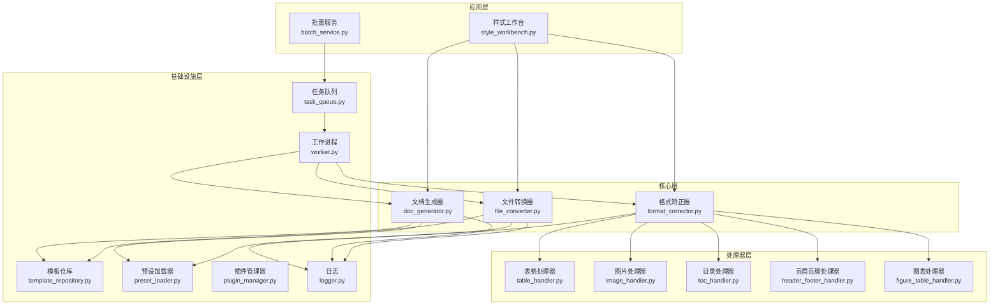
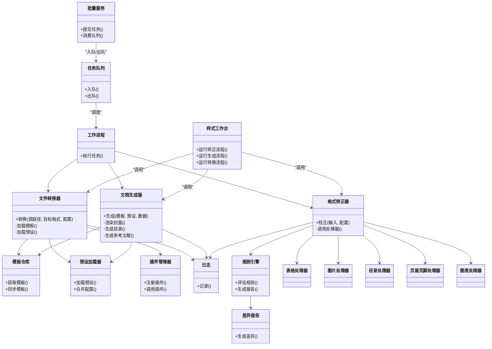
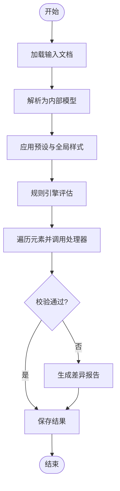
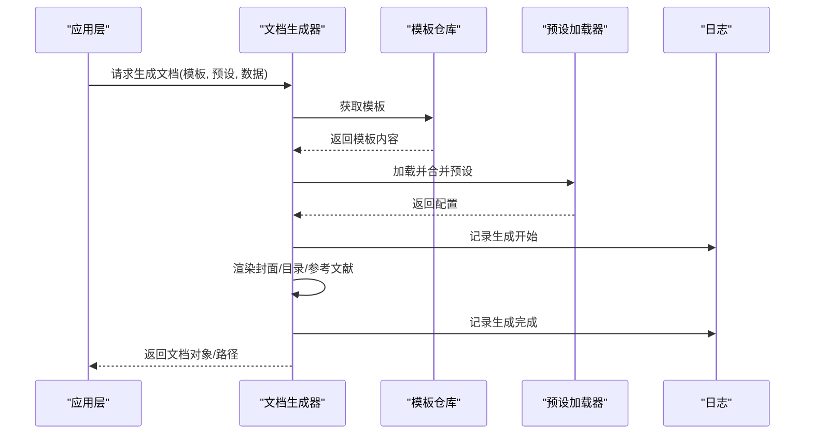
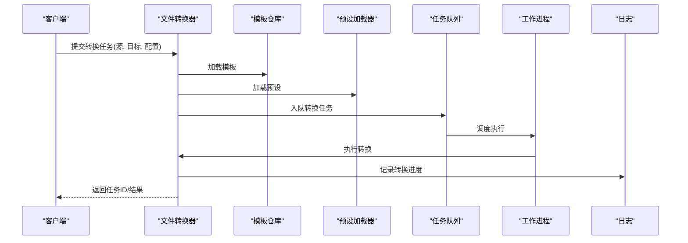
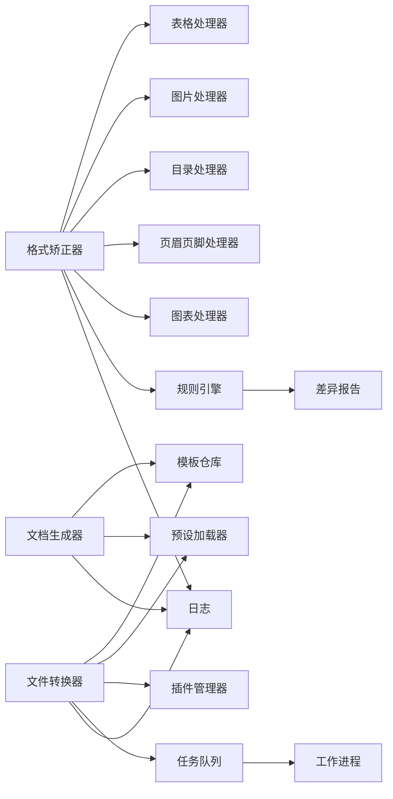

# 核心组件架构

<cite>
**本文引用的文件**   
- [src/paper_format_corrector/core/format_corrector.py](file://src/paper_format_corrector/core/format_corrector.py)
- [src/paper_format_corrector/core/doc_generator.py](file://src/paper_format_corrector/core/doc_generator.py)
- [src/paper_format_corrector/core/file_converter.py](file://src/paper_format_corrector/core/file_converter.py)
- [src/paper_format_corrector/infrastructure/converters/file_converter.py](file://src/paper_format_corrector/infrastructure/converters/file_converter.py)
- [src/paper_format_corrector/infrastructure/generators/cover_generator.py](file://src/paper_format_corrector/infrastructure/generators/cover_generator.py)
- [src/paper_format_corrector/application/services/style_workbench.py](file://src/paper_format_corrector/application/services/style_workbench.py)
- [src/paper_format_corrector/application/services/batch_service.py](file://src/paper_format_corrector/application/services/batch_service.py)
- [src/paper_format_corrector/infra/template_repository.py](file://src/paper_format_corrector/infra/template_repository.py)
- [src/paper_format_corrector/infra/preset_loader.py](file://src/paper_format_corrector/infra/preset_loader.py)
- [src/paper_format_corrector/infra/logger.py](file://src/paper_format_corrector/infra/logger.py)
- [src/paper_format_corrector/infra/plugin_manager.py](file://src/paper_format_corrector/infra/plugin_manager.py)
- [src/paper_format_corrector/infrastructure/queue/task_queue.py](file://src/paper_format_corrector/infrastructure/queue/task_queue.py)
- [src/paper_format_corrector/infrastructure/queue/worker.py](file://src/paper_format_corrector/infrastructure/queue/worker.py)
- [src/paper_format_corrector/quality/rule_engine.py](file://src/paper_format_corrector/quality/rule_engine.py)
- [src/paper_format_corrector/quality/diff_reporter.py](file://src/paper_format_corrector/quality/diff_reporter.py)
- [src/paper_format_corrector/handlers/table_handler.py](file://src/paper_format_corrector/handlers/table_handler.py)
- [src/paper_format_corrector/handlers/image_handler.py](file://src/paper_format_corrector/handlers/image_handler.py)
- [src/paper_format_corrector/handlers/toc_handler.py](file://src/paper_format_corrector/handlers/toc_handler.py)
- [src/paper_format_corrector/handlers/header_footer_handler.py](file://src/paper_format_corrector/handlers/header_footer_handler.py)
- [src/paper_format_corrector/handlers/figure_table_handler.py](file://src/paper_format_corrector/handlers/figure_table_handler.py)
</cite>

## 目录
1. [简介](#简介)
2. [项目结构](#项目结构)
3. [核心组件](#核心组件)
4. [架构总览](#架构总览)
5. [详细组件分析](#详细组件分析)
6. [依赖关系分析](#依赖关系分析)
7. [性能考虑](#性能考虑)
8. [故障排查指南](#故障排查指南)
9. [结论](#结论)
10. [附录](#附录)

## 简介
本文件聚焦于“格式矫正器”“文档生成器”“文件转换器”三大核心组件的架构与协作机制，阐述其职责边界、接口契约、通信协议与数据交换格式，并提供架构图与依赖图。同时覆盖组件生命周期管理与错误处理策略，帮助读者快速理解系统如何从输入文档到标准化输出进行端到端处理。

## 项目结构
本项目采用分层与领域驱动相结合的组织方式：
- core 层定义核心能力（格式矫正、文档生成、文件转换）
- application 层编排业务流程（样式工作台、批量任务等）
- infrastructure 层提供基础设施（模板仓库、队列、插件、日志等）
- handlers 层封装文档元素处理器（表格、图片、目录、页眉页脚等）
- quality 层提供规则引擎与差异报告

图示来源
- [src/paper_format_corrector/application/services/style_workbench.py](file://src/paper_format_corrector/application/services/style_workbench.py)
- [src/paper_format_corrector/application/services/batch_service.py](file://src/paper_format_corrector/application/services/batch_service.py)
- [src/paper_format_corrector/core/format_corrector.py](file://src/paper_format_corrector/core/format_corrector.py)
- [src/paper_format_corrector/core/doc_generator.py](file://src/paper_format_corrector/core/doc_generator.py)
- [src/paper_format_corrector/core/file_converter.py](file://src/paper_format_corrector/core/file_converter.py)
- [src/paper_format_corrector/infra/template_repository.py](file://src/paper_format_corrector/infra/template_repository.py)
- [src/paper_format_corrector/infra/preset_loader.py](file://src/paper_format_corrector/infra/preset_loader.py)
- [src/paper_format_corrector/infra/logger.py](file://src/paper_format_corrector/infra/logger.py)
- [src/paper_format_corrector/infra/plugin_manager.py](file://src/paper_format_corrector/infra/plugin_manager.py)
- [src/paper_format_corrector/infrastructure/queue/task_queue.py](file://src/paper_format_corrector/infrastructure/queue/task_queue.py)
- [src/paper_format_corrector/infrastructure/queue/worker.py](file://src/paper_format_corrector/infrastructure/queue/worker.py)
- [src/paper_format_corrector/handlers/table_handler.py](file://src/paper_format_corrector/handlers/table_handler.py)
- [src/paper_format_corrector/handlers/image_handler.py](file://src/paper_format_corrector/handlers/image_handler.py)
- [src/paper_format_corrector/handlers/toc_handler.py](file://src/paper_format_corrector/handlers/toc_handler.py)
- [src/paper_format_corrector/handlers/header_footer_handler.py](file://src/paper_format_corrector/handlers/header_footer_handler.py)
- [src/paper_format_corrector/handlers/figure_table_handler.py](file://src/paper_format_corrector/handlers/figure_table_handler.py)

章节来源
- [src/paper_format_corrector/application/services/style_workbench.py](file://src/paper_format_corrector/application/services/style_workbench.py)
- [src/paper_format_corrector/application/services/batch_service.py](file://src/paper_format_corrector/application/services/batch_service.py)
- [src/paper_format_corrector/core/format_corrector.py](file://src/paper_format_corrector/core/format_corrector.py)
- [src/paper_format_corrector/core/doc_generator.py](file://src/paper_format_corrector/core/doc_generator.py)
- [src/paper_format_corrector/core/file_converter.py](file://src/paper_format_corrector/core/file_converter.py)
- [src/paper_format_corrector/infra/template_repository.py](file://src/paper_format_corrector/infra/template_repository.py)
- [src/paper_format_corrector/infra/preset_loader.py](file://src/paper_format_corrector/infra/preset_loader.py)
- [src/paper_format_corrector/infra/logger.py](file://src/paper_format_corrector/infra/logger.py)
- [src/paper_format_corrector/infra/plugin_manager.py](file://src/paper_format_corrector/infra/plugin_manager.py)
- [src/paper_format_corrector/infrastructure/queue/task_queue.py](file://src/paper_format_corrector/infrastructure/queue/task_queue.py)
- [src/paper_format_corrector/infrastructure/queue/worker.py](file://src/paper_format_corrector/infrastructure/queue/worker.py)
- [src/paper_format_corrector/handlers/table_handler.py](file://src/paper_format_corrector/handlers/table_handler.py)
- [src/paper_format_corrector/handlers/image_handler.py](file://src/paper_format_corrector/handlers/image_handler.py)
- [src/paper_format_corrector/handlers/toc_handler.py](file://src/paper_format_corrector/handlers/toc_handler.py)
- [src/paper_format_corrector/handlers/header_footer_handler.py](file://src/paper_format_corrector/handlers/header_footer_handler.py)
- [src/paper_format_corrector/handlers/figure_table_handler.py](file://src/paper_format_corrector/handlers/figure_table_handler.py)

## 核心组件
- 格式矫正器：负责解析输入文档、应用样式与规则、执行段落/标题/引用/图表等规范化处理，并输出中间表示或目标文档。
- 文档生成器：基于模板与预设，构建封面、目录、参考文献、交叉引用等结构化内容，生成最终文档。
- 文件转换器：在多种输入/输出格式之间进行转换，协调模板与预设资源，确保格式一致性与兼容性。

章节来源
- [src/paper_format_corrector/core/format_corrector.py](file://src/paper_format_corrector/core/format_corrector.py)
- [src/paper_format_corrector/core/doc_generator.py](file://src/paper_format_corrector/core/doc_generator.py)
- [src/paper_format_corrector/core/file_converter.py](file://src/paper_format_corrector/core/file_converter.py)

## 架构总览
整体采用“应用编排 + 核心能力 + 基础设施”的分层设计。应用层通过样式工作台和批量服务组织流程；核心层提供可复用的格式化、生成与转换能力；基础设施层提供模板、预设、队列、插件与日志支撑。处理器层对文档元素进行细粒度操作，质量层提供规则校验与差异报告。

图示来源
- [src/paper_format_corrector/application/services/style_workbench.py](file://src/paper_format_corrector/application/services/style_workbench.py)
- [src/paper_format_corrector/application/services/batch_service.py](file://src/paper_format_corrector/application/services/batch_service.py)
- [src/paper_format_corrector/core/format_corrector.py](file://src/paper_format_corrector/core/format_corrector.py)
- [src/paper_format_corrector/core/doc_generator.py](file://src/paper_format_corrector/core/doc_generator.py)
- [src/paper_format_corrector/core/file_converter.py](file://src/paper_format_corrector/core/file_converter.py)
- [src/paper_format_corrector/infra/template_repository.py](file://src/paper_format_corrector/infra/template_repository.py)
- [src/paper_format_corrector/infra/preset_loader.py](file://src/paper_format_corrector/infra/preset_loader.py)
- [src/paper_format_corrector/infra/logger.py](file://src/paper_format_corrector/infra/logger.py)
- [src/paper_format_corrector/infra/plugin_manager.py](file://src/paper_format_corrector/infra/plugin_manager.py)
- [src/paper_format_corrector/infrastructure/queue/task_queue.py](file://src/paper_format_corrector/infrastructure/queue/task_queue.py)
- [src/paper_format_corrector/infrastructure/queue/worker.py](file://src/paper_format_corrector/infrastructure/queue/worker.py)
- [src/paper_format_corrector/quality/rule_engine.py](file://src/paper_format_corrector/quality/rule_engine.py)
- [src/paper_format_corrector/quality/diff_reporter.py](file://src/paper_format_corrector/quality/diff_reporter.py)
- [src/paper_format_corrector/handlers/table_handler.py](file://src/paper_format_corrector/handlers/table_handler.py)
- [src/paper_format_corrector/handlers/image_handler.py](file://src/paper_format_corrector/handlers/image_handler.py)
- [src/paper_format_corrector/handlers/toc_handler.py](file://src/paper_format_corrector/handlers/toc_handler.py)
- [src/paper_format_corrector/handlers/header_footer_handler.py](file://src/paper_format_corrector/handlers/header_footer_handler.py)
- [src/paper_format_corrector/handlers/figure_table_handler.py](file://src/paper_format_corrector/handlers/figure_table_handler.py)

## 详细组件分析

### 格式矫正器
职责与模式
- 职责：读取输入文档，应用预设与规则，调用各处理器完成段落、标题、表格、图片、目录、页眉页脚、图表等元素的标准化处理，输出中间表示或目标文档。
- 设计模式：管道-过滤器（按阶段调用处理器）、策略（不同规则集与处理器组合）、观察者（日志与质量报告）。

接口与依赖
- 输入：文档路径或字节流、配置对象（包含预设、规则、处理器开关等）
- 输出：标准化后的文档对象或文件路径
- 依赖：处理器集合、规则引擎、日志、插件管理器（可选扩展）

关键流程

图示来源
- [src/paper_format_corrector/core/format_corrector.py](file://src/paper_format_corrector/core/format_corrector.py)
- [src/paper_format_corrector/quality/rule_engine.py](file://src/paper_format_corrector/quality/rule_engine.py)
- [src/paper_format_corrector/quality/diff_reporter.py](file://src/paper_format_corrector/quality/diff_reporter.py)
- [src/paper_format_corrector/handlers/table_handler.py](file://src/paper_format_corrector/handlers/table_handler.py)
- [src/paper_format_corrector/handlers/image_handler.py](file://src/paper_format_corrector/handlers/image_handler.py)
- [src/paper_format_corrector/handlers/toc_handler.py](file://src/paper_format_corrector/handlers/toc_handler.py)
- [src/paper_format_corrector/handlers/header_footer_handler.py](file://src/paper_format_corrector/handlers/header_footer_handler.py)
- [src/paper_format_corrector/handlers/figure_table_handler.py](file://src/paper_format_corrector/handlers/figure_table_handler.py)

章节来源
- [src/paper_format_corrector/core/format_corrector.py](file://src/paper_format_corrector/core/format_corrector.py)
- [src/paper_format_corrector/quality/rule_engine.py](file://src/paper_format_corrector/quality/rule_engine.py)
- [src/paper_format_corrector/quality/diff_reporter.py](file://src/paper_format_corrector/quality/diff_reporter.py)
- [src/paper_format_corrector/handlers/table_handler.py](file://src/paper_format_corrector/handlers/table_handler.py)
- [src/paper_format_corrector/handlers/image_handler.py](file://src/paper_format_corrector/handlers/image_handler.py)
- [src/paper_format_corrector/handlers/toc_handler.py](file://src/paper_format_corrector/handlers/toc_handler.py)
- [src/paper_format_corrector/handlers/header_footer_handler.py](file://src/paper_format_corrector/handlers/header_footer_handler.py)
- [src/paper_format_corrector/handlers/figure_table_handler.py](file://src/paper_format_corrector/handlers/figure_table_handler.py)

### 文档生成器
职责与模式
- 职责：根据模板与预设生成封面、目录、参考文献、交叉引用等结构化内容，并将数据渲染到目标文档中。
- 设计模式：模板渲染（模板仓库+预设加载器）、工厂（按需创建封面/目录/参考文献生成器）、策略（不同模板风格）。

接口与依赖
- 输入：模板标识、预设配置、数据模型（章节、标题、参考文献条目等）
- 输出：目标文档对象或文件路径
- 依赖：模板仓库、预设加载器、日志、插件管理器（可选扩展）

关键流程

图示来源
- [src/paper_format_corrector/core/doc_generator.py](file://src/paper_format_corrector/core/doc_generator.py)
- [src/paper_format_corrector/infra/template_repository.py](file://src/paper_format_corrector/infra/template_repository.py)
- [src/paper_format_corrector/infra/preset_loader.py](file://src/paper_format_corrector/infra/preset_loader.py)
- [src/paper_format_corrector/infra/logger.py](file://src/paper_format_corrector/infra/logger.py)

章节来源
- [src/paper_format_corrector/core/doc_generator.py](file://src/paper_format_corrector/core/doc_generator.py)
- [src/paper_format_corrector/infra/template_repository.py](file://src/paper_format_corrector/infra/template_repository.py)
- [src/paper_format_corrector/infra/preset_loader.py](file://src/paper_format_corrector/infra/preset_loader.py)
- [src/paper_format_corrector/infra/logger.py](file://src/paper_format_corrector/infra/logger.py)

### 文件转换器
职责与模式
- 职责：在不同输入/输出格式间进行转换，协调模板与预设资源，确保格式一致性与兼容性。
- 设计模式：适配器（适配不同文件格式）、策略（选择转换管线）、命令（将转换任务入队异步执行）。

接口与依赖
- 输入：源文件路径、目标格式、配置（含模板与预设）
- 输出：目标文件路径或字节流
- 依赖：模板仓库、预设加载器、插件管理器、日志、任务队列与工作进程（可选）

关键流程

图示来源
- [src/paper_format_corrector/core/file_converter.py](file://src/paper_format_corrector/core/file_converter.py)
- [src/paper_format_corrector/infrastructure/converters/file_converter.py](file://src/paper_format_corrector/infrastructure/converters/file_converter.py)
- [src/paper_format_corrector/infra/template_repository.py](file://src/paper_format_corrector/infra/template_repository.py)
- [src/paper_format_corrector/infra/preset_loader.py](file://src/paper_format_corrector/infra/preset_loader.py)
- [src/paper_format_corrector/infra/logger.py](file://src/paper_format_corrector/infra/logger.py)
- [src/paper_format_corrector/infra/plugin_manager.py](file://src/paper_format_corrector/infra/plugin_manager.py)
- [src/paper_format_corrector/infrastructure/queue/task_queue.py](file://src/paper_format_corrector/infrastructure/queue/task_queue.py)
- [src/paper_format_corrector/infrastructure/queue/worker.py](file://src/paper_format_corrector/infrastructure/queue/worker.py)

章节来源
- [src/paper_format_corrector/core/file_converter.py](file://src/paper_format_corrector/core/file_converter.py)
- [src/paper_format_corrector/infrastructure/converters/file_converter.py](file://src/paper_format_corrector/infrastructure/converters/file_converter.py)
- [src/paper_format_corrector/infra/template_repository.py](file://src/paper_format_corrector/infra/template_repository.py)
- [src/paper_format_corrector/infra/preset_loader.py](file://src/paper_format_corrector/infra/preset_loader.py)
- [src/paper_format_corrector/infra/logger.py](file://src/paper_format_corrector/infra/logger.py)
- [src/paper_format_corrector/infra/plugin_manager.py](file://src/paper_format_corrector/infra/plugin_manager.py)
- [src/paper_format_corrector/infrastructure/queue/task_queue.py](file://src/paper_format_corrector/infrastructure/queue/task_queue.py)
- [src/paper_format_corrector/infrastructure/queue/worker.py](file://src/paper_format_corrector/infrastructure/queue/worker.py)

### 处理器层（表格、图片、目录、页眉页脚、图表）
职责与模式
- 职责：对文档中的特定元素执行标准化操作（如表格编号、图片对齐、目录更新、页眉页脚设置、图表引用一致性等）。
- 设计模式：策略（不同处理器对应不同元素类型）、责任链（按顺序处理多个元素）。

协作机制
- 由格式矫正器统一调度，传入当前文档模型与配置，处理器返回修改后的局部结构。
- 处理器内部可调用日志与插件扩展点以增强功能。

章节来源
- [src/paper_format_corrector/handlers/table_handler.py](file://src/paper_format_corrector/handlers/table_handler.py)
- [src/paper_format_corrector/handlers/image_handler.py](file://src/paper_format_corrector/handlers/image_handler.py)
- [src/paper_format_corrector/handlers/toc_handler.py](file://src/paper_format_corrector/handlers/toc_handler.py)
- [src/paper_format_corrector/handlers/header_footer_handler.py](file://src/paper_format_corrector/handlers/header_footer_handler.py)
- [src/paper_format_corrector/handlers/figure_table_handler.py](file://src/paper_format_corrector/handlers/figure_table_handler.py)

### 应用编排（样式工作台与批量服务）
职责与模式
- 样式工作台：编排矫正、生成、转换流程，提供统一的入口方法，支持一次性多步骤流水线。
- 批量服务：将任务入队，由工作进程异步执行，提升吞吐与稳定性。

章节来源
- [src/paper_format_corrector/application/services/style_workbench.py](file://src/paper_format_corrector/application/services/style_workbench.py)
- [src/paper_format_corrector/application/services/batch_service.py](file://src/paper_format_corrector/application/services/batch_service.py)

## 依赖关系分析
- 松耦合：核心组件通过清晰的接口与配置对象交互，避免直接依赖具体实现。
- 可扩展：插件管理器允许在不修改核心逻辑的情况下扩展处理能力。
- 可观测：日志贯穿各组件，便于追踪问题与性能分析。
- 可测试：处理器与规则引擎可独立测试，配合差异报告验证行为。

图示来源
- [src/paper_format_corrector/core/format_corrector.py](file://src/paper_format_corrector/core/format_corrector.py)
- [src/paper_format_corrector/core/doc_generator.py](file://src/paper_format_corrector/core/doc_generator.py)
- [src/paper_format_corrector/core/file_converter.py](file://src/paper_format_corrector/core/file_converter.py)
- [src/paper_format_corrector/infra/template_repository.py](file://src/paper_format_corrector/infra/template_repository.py)
- [src/paper_format_corrector/infra/preset_loader.py](file://src/paper_format_corrector/infra/preset_loader.py)
- [src/paper_format_corrector/infra/logger.py](file://src/paper_format_corrector/infra/logger.py)
- [src/paper_format_corrector/infra/plugin_manager.py](file://src/paper_format_corrector/infra/plugin_manager.py)
- [src/paper_format_corrector/infrastructure/queue/task_queue.py](file://src/paper_format_corrector/infrastructure/queue/task_queue.py)
- [src/paper_format_corrector/infrastructure/queue/worker.py](file://src/paper_format_corrector/infrastructure/queue/worker.py)
- [src/paper_format_corrector/quality/rule_engine.py](file://src/paper_format_corrector/quality/rule_engine.py)
- [src/paper_format_corrector/quality/diff_reporter.py](file://src/paper_format_corrector/quality/diff_reporter.py)
- [src/paper_format_corrector/handlers/table_handler.py](file://src/paper_format_corrector/handlers/table_handler.py)
- [src/paper_format_corrector/handlers/image_handler.py](file://src/paper_format_corrector/handlers/image_handler.py)
- [src/paper_format_corrector/handlers/toc_handler.py](file://src/paper_format_corrector/handlers/toc_handler.py)
- [src/paper_format_corrector/handlers/header_footer_handler.py](file://src/paper_format_corrector/handlers/header_footer_handler.py)
- [src/paper_format_corrector/handlers/figure_table_handler.py](file://src/paper_format_corrector/handlers/figure_table_handler.py)

## 性能考虑
- 批处理与异步：通过任务队列与工作进程并行执行转换与矫正任务，提高吞吐。
- 懒加载与缓存：模板与预设在首次加载后缓存，减少重复IO。
- 增量处理：处理器仅对变更区域进行重算，避免全量重建。
- 资源控制：限制并发度与内存占用，防止大文档导致OOM。

## 故障排查指南
- 日志定位：在各组件的关键节点记录开始、结束与异常信息，结合任务ID追踪问题。
- 规则失败：查看规则引擎评估结果与差异报告，定位不合规项。
- 模板缺失：检查模板仓库是否可用，确认模板标识与版本匹配。
- 队列阻塞：检查工作进程状态与队列长度，必要时扩容或清理积压任务。
- 插件异常：隔离插件调用，回退到默认行为并记录插件名称与错误堆栈。

章节来源
- [src/paper_format_corrector/infra/logger.py](file://src/paper_format_corrector/infra/logger.py)
- [src/paper_format_corrector/quality/rule_engine.py](file://src/paper_format_corrector/quality/rule_engine.py)
- [src/paper_format_corrector/quality/diff_reporter.py](file://src/paper_format_corrector/quality/diff_reporter.py)
- [src/paper_format_corrector/infra/template_repository.py](file://src/paper_format_corrector/infra/template_repository.py)
- [src/paper_format_corrector/infra/plugin_manager.py](file://src/paper_format_corrector/infra/plugin_manager.py)
- [src/paper_format_corrector/infrastructure/queue/task_queue.py](file://src/paper_format_corrector/infrastructure/queue/task_queue.py)
- [src/paper_format_corrector/infrastructure/queue/worker.py](file://src/paper_format_corrector/infrastructure/queue/worker.py)

## 结论
本架构通过清晰的分层与职责划分，使格式矫正器、文档生成器与文件转换器能够高效协作。借助模板仓库、预设加载器、规则引擎与处理器体系，系统在可扩展性、可观测性与稳定性方面具备良好基础。建议在生产环境启用异步队列与缓存策略，并结合差异报告持续优化规则与处理器。

## 附录
- 组件生命周期管理
  - 初始化：加载模板与预设，注册处理器与插件，建立日志与队列连接。
  - 运行：接收任务，执行矫正/生成/转换流程，产出结果并持久化。
  - 销毁：释放资源（文件句柄、网络连接），关闭队列与工作进程。
- 错误处理策略
  - 捕获并分类异常（IO、解析、渲染、规则冲突），记录上下文信息。
  - 使用差异报告输出不可恢复问题的详细信息，辅助人工干预。
  - 对可重试错误实施指数退避与最大重试次数限制。