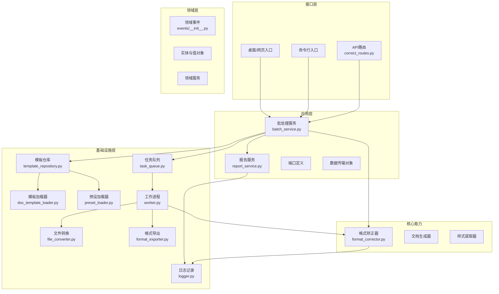
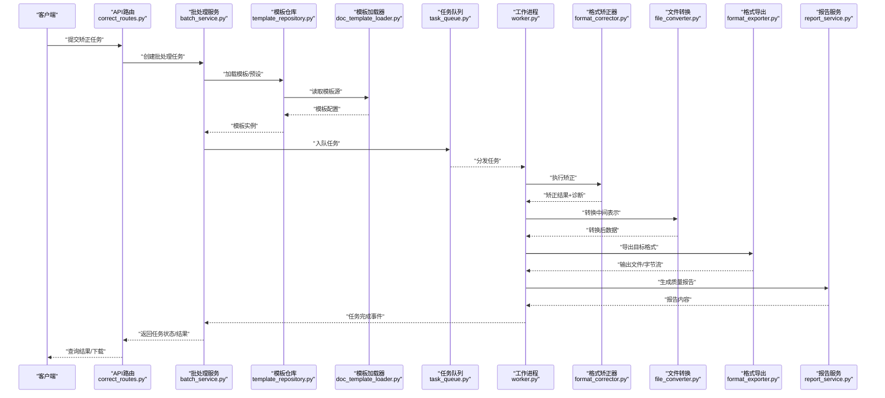
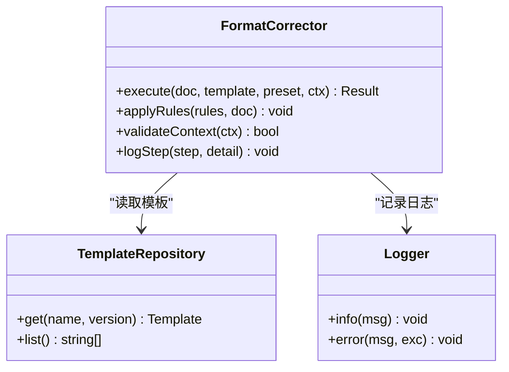
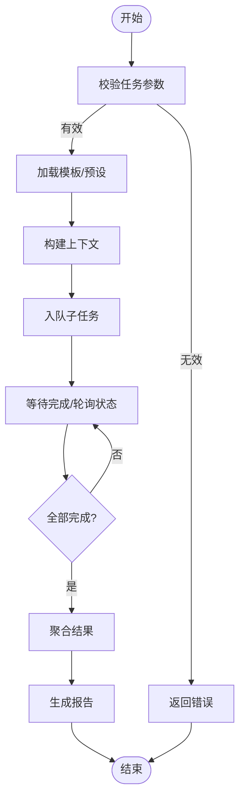
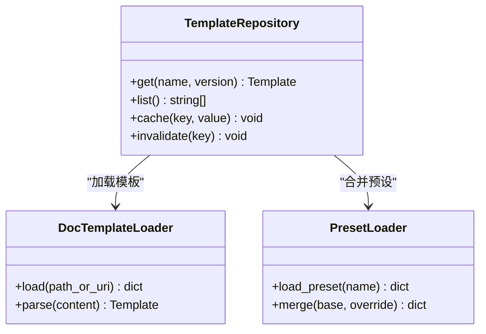
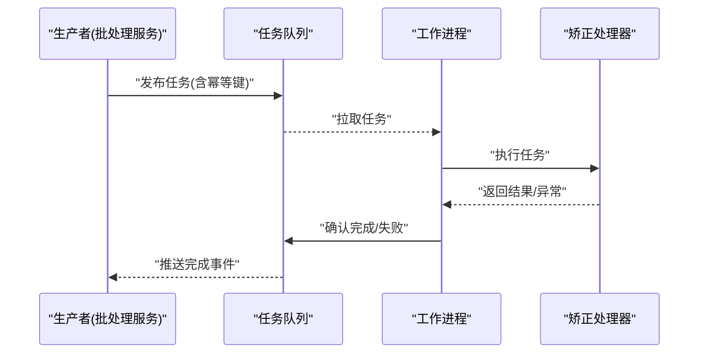
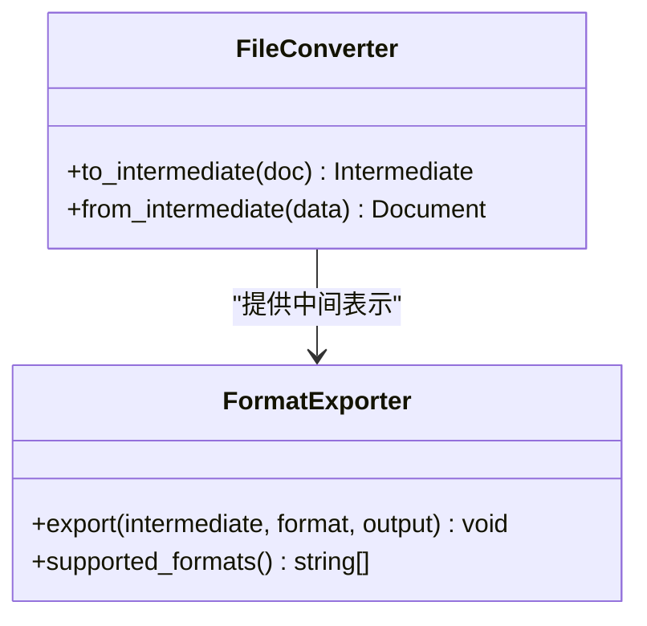
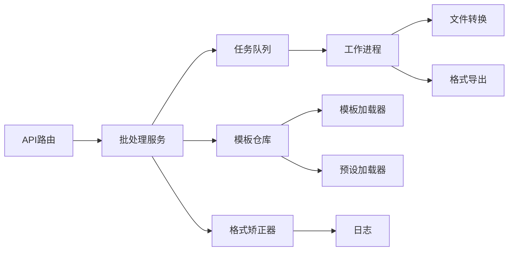

# 组件交互与数据流

<cite>
**本文引用的文件**   
- [src/paper_format_corrector/app.py](file://src/paper_format_corrector/app.py)
- [src/paper_format_corrector/core/format_corrector.py](file://src/paper_format_corrector/core/format_corrector.py)
- [src/paper_format_corrector/application/services/batch_service.py](file://src/paper_format_corrector/application/services/batch_service.py)
- [src/paper_format_corrector/infra/template_repository.py](file://src/paper_format_corrector/infra/template_repository.py)
- [src/paper_format_corrector/infrastructure/queue/task_queue.py](file://src/paper_format_corrector/infrastructure/queue/task_queue.py)
- [src/paper_format_corrector/infrastructure/queue/worker.py](file://src/paper_format_corrector/infrastructure/queue/worker.py)
- [src/paper_format_corrector/infra/doc_template_loader.py](file://src/paper_format_corrector/infra/doc_template_loader.py)
- [src/paper_format_corrector/infra/preset_loader.py](file://src/paper_format_corrector/infra/preset_loader.py)
- [src/paper_format_corrector/infra/logger.py](file://src/paper_format_corrector/infra/logger.py)
- [src/paper_format_corrector/domain/events/__init__.py](file://src/paper_format_corrector/domain/events/__init__.py)
- [src/paper_format_corrector/interfaces/api/routes/correct_routes.py](file://src/paper_format_corrector/interfaces/api/routes/correct_routes.py)
- [src/paper_format_corrector/application/services/report_service.py](file://src/paper_format_corrector/application/services/report_service.py)
- [src/paper_format_corrector/infrastructure/converters/file_converter.py](file://src/paper_format_corrector/infrastructure/converters/file_converter.py)
- [src/paper_format_corrector/infrastructure/exporters/format_exporter.py](file://src/paper_format_corrector/infrastructure/exporters/format_exporter.py)
</cite>

## 目录
1. [简介](#简介)
2. [项目结构](#项目结构)
3. [核心组件](#核心组件)
4. [架构总览](#架构总览)
5. [详细组件分析](#详细组件分析)
6. [依赖关系分析](#依赖关系分析)
7. [性能考虑](#性能考虑)
8. [故障排查指南](#故障排查指南)
9. [结论](#结论)
10. [附录](#附录)

## 简介
本文件聚焦于系统内部各组件之间的交互关系与数据流转过程，重点说明格式矫正器、批处理服务、模板仓库等核心组件的协作机制。文档包含组件关系图与数据流图，解释消息传递、事件驱动与异步处理的实现方式，并覆盖错误传播、状态管理与并发控制的设计要点。同时提供关键业务流程的序列图与时序图，帮助读者快速理解从请求进入到结果输出的完整链路。

## 项目结构
本项目采用分层与领域驱动相结合的组织方式：
- 接口层（interfaces）：API、CLI、桌面与Web入口
- 应用层（application）：用例编排、DTO、端口定义与服务编排
- 领域层（domain）：实体、值对象、领域事件与领域服务
- 基础设施层（infrastructure）：适配器、转换器、导出器、解析器、队列与工具
- 核心能力（core）：格式矫正、文档生成、样式提取等通用能力
- 插件与预设（plugins、presets）：扩展点与模板预设
- 配置与资源（config、templates、examples）：运行期配置与示例

图表来源
- [src/paper_format_corrector/interfaces/api/routes/correct_routes.py](file://src/paper_format_corrector/interfaces/api/routes/correct_routes.py)
- [src/paper_format_corrector/application/services/batch_service.py](file://src/paper_format_corrector/application/services/batch_service.py)
- [src/paper_format_corrector/core/format_corrector.py](file://src/paper_format_corrector/core/format_corrector.py)
- [src/paper_format_corrector/infra/template_repository.py](file://src/paper_format_corrector/infra/template_repository.py)
- [src/paper_format_corrector/infra/doc_template_loader.py](file://src/paper_format_corrector/infra/doc_template_loader.py)
- [src/paper_format_corrector/infra/preset_loader.py](file://src/paper_format_corrector/infra/preset_loader.py)
- [src/paper_format_corrector/infrastructure/queue/task_queue.py](file://src/paper_format_corrector/infrastructure/queue/task_queue.py)
- [src/paper_format_corrector/infrastructure/queue/worker.py](file://src/paper_format_corrector/infrastructure/queue/worker.py)
- [src/paper_format_corrector/infrastructure/converters/file_converter.py](file://src/paper_format_corrector/infrastructure/converters/file_converter.py)
- [src/paper_format_corrector/infrastructure/exporters/format_exporter.py](file://src/paper_format_corrector/infrastructure/exporters/format_exporter.py)
- [src/paper_format_corrector/infra/logger.py](file://src/paper_format_corrector/infra/logger.py)

章节来源
- [src/paper_format_corrector/app.py](file://src/paper_format_corrector/app.py)

## 核心组件
- 格式矫正器（FormatCorrector）
  - 职责：对文档进行结构与样式层面的规范化处理，包括段落、标题、引用、表格、图片等规则执行。
  - 输入：文档对象或中间表示；模板与预设参数。
  - 输出：矫正后的文档对象与变更摘要。
  - 关键点：幂等性、可插拔规则链、可观测性（日志与指标）。

- 批处理服务（BatchService）
  - 职责：编排一次或多份文档的矫正流程，协调模板加载、矫正执行、转换与导出，以及质量报告生成。
  - 输入：批量任务描述（文件列表、目标模板、导出格式等）。
  - 输出：任务状态、结果集合与报告。
  - 关键点：并发控制、失败重试、进度上报、事务边界（以任务为单位）。

- 模板仓库（TemplateRepository）
  - 职责：统一加载与管理模板与预设，提供按名称或标识获取模板的能力。
  - 输入：模板名/ID、版本、来源（本地/远程）。
  - 输出：模板实例或结构化配置。
  - 关键点：缓存策略、版本一致性、冲突检测。

- 任务队列与工作进程（TaskQueue & Worker）
  - 职责：将矫正任务入队，由工作进程异步消费执行，支持水平扩展。
  - 输入：任务消息（含上下文、参数、回调地址）。
  - 输出：任务完成事件、结果持久化、错误上报。
  - 关键点：去重、幂等、死信队列、背压控制。

- 报告服务（ReportService）
  - 职责：汇总矫正过程中的问题与建议，生成可读的质量报告。
  - 输入：矫正阶段产生的诊断信息。
  - 输出：报告文档或结构化数据。

章节来源
- [src/paper_format_corrector/core/format_corrector.py](file://src/paper_format_corrector/core/format_corrector.py)
- [src/paper_format_corrector/application/services/batch_service.py](file://src/paper_format_corrector/application/services/batch_service.py)
- [src/paper_format_corrector/infra/template_repository.py](file://src/paper_format_corrector/infra/template_repository.py)
- [src/paper_format_corrector/infrastructure/queue/task_queue.py](file://src/paper_format_corrector/infrastructure/queue/task_queue.py)
- [src/paper_format_corrector/infrastructure/queue/worker.py](file://src/paper_format_corrector/infrastructure/queue/worker.py)
- [src/paper_format_corrector/application/services/report_service.py](file://src/paper_format_corrector/application/services/report_service.py)

## 架构总览
整体采用“接口层 -> 应用层 -> 领域层 -> 核心能力 -> 基础设施”的分层架构，并通过事件与队列解耦关键路径。

图表来源
- [src/paper_format_corrector/interfaces/api/routes/correct_routes.py](file://src/paper_format_corrector/interfaces/api/routes/correct_routes.py)
- [src/paper_format_corrector/application/services/batch_service.py](file://src/paper_format_corrector/application/services/batch_service.py)
- [src/paper_format_corrector/infra/template_repository.py](file://src/paper_format_corrector/infra/template_repository.py)
- [src/paper_format_corrector/infra/doc_template_loader.py](file://src/paper_format_corrector/infra/doc_template_loader.py)
- [src/paper_format_corrector/infrastructure/queue/task_queue.py](file://src/paper_format_corrector/infrastructure/queue/task_queue.py)
- [src/paper_format_corrector/infrastructure/queue/worker.py](file://src/paper_format_corrector/infrastructure/queue/worker.py)
- [src/paper_format_corrector/core/format_corrector.py](file://src/paper_format_corrector/core/format_corrector.py)
- [src/paper_format_corrector/infrastructure/converters/file_converter.py](file://src/paper_format_corrector/infrastructure/converters/file_converter.py)
- [src/paper_format_corrector/infrastructure/exporters/format_exporter.py](file://src/paper_format_corrector/infrastructure/exporters/format_exporter.py)
- [src/paper_format_corrector/application/services/report_service.py](file://src/paper_format_corrector/application/services/report_service.py)

## 详细组件分析

### 格式矫正器（FormatCorrector）
- 角色定位：核心业务能力的承载者，负责将模板规则应用到文档上。
- 输入/输出：
  - 输入：文档对象、模板配置、预设参数、上下文（如语言、字体映射）。
  - 输出：矫正后的文档对象、变更清单、诊断信息。
- 设计要点：
  - 规则链式执行，支持插入/替换/删除操作。
  - 幂等执行，避免重复矫正导致二次破坏。
  - 可观测性：通过日志记录关键步骤与异常。

图表来源
- [src/paper_format_corrector/core/format_corrector.py](file://src/paper_format_corrector/core/format_corrector.py)
- [src/paper_format_corrector/infra/template_repository.py](file://src/paper_format_corrector/infra/template_repository.py)
- [src/paper_format_corrector/infra/logger.py](file://src/paper_format_corrector/infra/logger.py)

章节来源
- [src/paper_format_corrector/core/format_corrector.py](file://src/paper_format_corrector/core/format_corrector.py)
- [src/paper_format_corrector/infra/logger.py](file://src/paper_format_corrector/infra/logger.py)

### 批处理服务（BatchService）
- 角色定位：编排多文档矫正流程，管理任务生命周期与并发。
- 关键流程：
  - 接收任务描述，校验参数。
  - 加载模板与预设，构建上下文。
  - 将子任务入队，等待工作进程完成。
  - 聚合结果，生成报告，返回状态。
- 并发与状态：
  - 使用任务队列进行异步处理，限制并发度。
  - 任务状态机：待处理 -> 进行中 -> 已完成/失败。
  - 失败重试与退避策略。

图表来源
- [src/paper_format_corrector/application/services/batch_service.py](file://src/paper_format_corrector/application/services/batch_service.py)
- [src/paper_format_corrector/infra/template_repository.py](file://src/paper_format_corrector/infra/template_repository.py)
- [src/paper_format_corrector/infra/doc_template_loader.py](file://src/paper_format_corrector/infra/doc_template_loader.py)
- [src/paper_format_corrector/infra/preset_loader.py](file://src/paper_format_corrector/infra/preset_loader.py)
- [src/paper_format_corrector/infrastructure/queue/task_queue.py](file://src/paper_format_corrector/infrastructure/queue/task_queue.py)

章节来源
- [src/paper_format_corrector/application/services/batch_service.py](file://src/paper_format_corrector/application/services/batch_service.py)

### 模板仓库（TemplateRepository）
- 角色定位：模板与预设的统一访问点，屏蔽底层存储差异。
- 功能要点：
  - 按名称/版本获取模板。
  - 合并预设与用户覆盖项。
  - 缓存热点模板以提升性能。
  - 版本冲突检测与回滚建议。

图表来源
- [src/paper_format_corrector/infra/template_repository.py](file://src/paper_format_corrector/infra/template_repository.py)
- [src/paper_format_corrector/infra/doc_template_loader.py](file://src/paper_format_corrector/infra/doc_template_loader.py)
- [src/paper_format_corrector/infra/preset_loader.py](file://src/paper_format_corrector/infra/preset_loader.py)

章节来源
- [src/paper_format_corrector/infra/template_repository.py](file://src/paper_format_corrector/infra/template_repository.py)
- [src/paper_format_corrector/infra/doc_template_loader.py](file://src/paper_format_corrector/infra/doc_template_loader.py)
- [src/paper_format_corrector/infra/preset_loader.py](file://src/paper_format_corrector/infra/preset_loader.py)

### 任务队列与工作进程（TaskQueue & Worker）
- 角色定位：异步任务调度与执行，支撑高吞吐与可扩展性。
- 关键特性：
  - 任务去重与幂等键。
  - 消费者并发度可控。
  - 失败重试与死信队列。
  - 健康检查与优雅退出。

图表来源
- [src/paper_format_corrector/infrastructure/queue/task_queue.py](file://src/paper_format_corrector/infrastructure/queue/task_queue.py)
- [src/paper_format_corrector/infrastructure/queue/worker.py](file://src/paper_format_corrector/infrastructure/queue/worker.py)

章节来源
- [src/paper_format_corrector/infrastructure/queue/task_queue.py](file://src/paper_format_corrector/infrastructure/queue/task_queue.py)
- [src/paper_format_corrector/infrastructure/queue/worker.py](file://src/paper_format_corrector/infrastructure/queue/worker.py)

### 文件转换与格式导出（FileConverter & FormatExporter）
- 角色定位：在矫正完成后，将中间表示转换为最终目标格式（如PDF、HTML、DOCX等）。
- 设计要点：
  - 转换器与导出器分离，便于新增格式。
  - 支持增量导出与差异对比。
  - 错误隔离：单个格式失败不影响其他格式导出。

图表来源
- [src/paper_format_corrector/infrastructure/converters/file_converter.py](file://src/paper_format_corrector/infrastructure/converters/file_converter.py)
- [src/paper_format_corrector/infrastructure/exporters/format_exporter.py](file://src/paper_format_corrector/infrastructure/exporters/format_exporter.py)

章节来源
- [src/paper_format_corrector/infrastructure/converters/file_converter.py](file://src/paper_format_corrector/infrastructure/converters/file_converter.py)
- [src/paper_format_corrector/infrastructure/exporters/format_exporter.py](file://src/paper_format_corrector/infrastructure/exporters/format_exporter.py)

### 报告服务（ReportService）
- 角色定位：汇总矫正过程中的问题与建议，生成可读报告。
- 输入：诊断信息、变更记录、质量评分。
- 输出：报告文档或结构化数据，供前端展示或归档。

章节来源
- [src/paper_format_corrector/application/services/report_service.py](file://src/paper_format_corrector/application/services/report_service.py)

### 领域事件（Domain Events）
- 角色定位：跨组件通信的事件载体，用于通知关键状态变化（如任务完成、模板更新、错误发生）。
- 使用场景：
  - 任务完成事件触发后续动作（如清理临时文件、发送通知）。
  - 模板更新事件触发缓存失效与重新加载。
  - 错误事件触发告警与降级策略。

章节来源
- [src/paper_format_corrector/domain/events/__init__.py](file://src/paper_format_corrector/domain/events/__init__.py)

## 依赖关系分析
- 耦合与内聚：
  - 应用层仅依赖领域与核心能力，不直接感知基础设施细节。
  - 基础设施层通过适配器暴露稳定接口，降低上层耦合。
- 外部依赖：
  - 模板仓库可能对接本地文件系统与远程仓库。
  - 队列可能基于内存或消息中间件。
- 潜在循环依赖：
  - 确保应用层不反向依赖基础设施的具体实现，避免环。

图表来源
- [src/paper_format_corrector/interfaces/api/routes/correct_routes.py](file://src/paper_format_corrector/interfaces/api/routes/correct_routes.py)
- [src/paper_format_corrector/application/services/batch_service.py](file://src/paper_format_corrector/application/services/batch_service.py)
- [src/paper_format_corrector/core/format_corrector.py](file://src/paper_format_corrector/core/format_corrector.py)
- [src/paper_format_corrector/infra/template_repository.py](file://src/paper_format_corrector/infra/template_repository.py)
- [src/paper_format_corrector/infra/doc_template_loader.py](file://src/paper_format_corrector/infra/doc_template_loader.py)
- [src/paper_format_corrector/infra/preset_loader.py](file://src/paper_format_corrector/infra/preset_loader.py)
- [src/paper_format_corrector/infrastructure/queue/task_queue.py](file://src/paper_format_corrector/infrastructure/queue/task_queue.py)
- [src/paper_format_corrector/infrastructure/queue/worker.py](file://src/paper_format_corrector/infrastructure/queue/worker.py)
- [src/paper_format_corrector/infrastructure/converters/file_converter.py](file://src/paper_format_corrector/infrastructure/converters/file_converter.py)
- [src/paper_format_corrector/infrastructure/exporters/format_exporter.py](file://src/paper_format_corrector/infrastructure/exporters/format_exporter.py)
- [src/paper_format_corrector/infra/logger.py](file://src/paper_format_corrector/infra/logger.py)

## 性能考虑
- 并发控制：
  - 通过队列消费者数量限制并发，避免资源争用。
  - 大文档分块处理，减少单次内存占用。
- 缓存策略：
  - 模板与预设缓存，缩短冷启动时间。
  - 中间表示缓存，避免重复转换。
- I/O优化：
  - 读写分离，使用缓冲与流式处理。
  - 导出阶段并行不同格式，但限制全局并发上限。
- 可观测性：
  - 关键路径埋点，监控耗时与错误率。
  - 慢查询与阻塞告警。

## 故障排查指南
- 常见问题定位：
  - 模板加载失败：检查模板仓库与加载器配置，查看日志中的错误堆栈。
  - 任务堆积：检查队列容量与消费者数量，评估工作进程健康状态。
  - 导出失败：确认目标格式依赖是否安装，检查输出路径权限。
- 日志与诊断：
  - 使用日志记录关键步骤与异常，结合任务ID追踪全链路。
  - 报告服务生成的质量报告可作为问题复现与回归测试依据。
- 恢复策略：
  - 失败任务自动重试与退避。
  - 死信队列保留失败样本，便于人工干预。

章节来源
- [src/paper_format_corrector/infra/logger.py](file://src/paper_format_corrector/infra/logger.py)
- [src/paper_format_corrector/application/services/report_service.py](file://src/paper_format_corrector/application/services/report_service.py)

## 结论
本系统通过分层架构与事件/队列机制实现了高内聚、低耦合的组件交互模型。格式矫正器作为核心能力被批处理服务编排，模板仓库提供稳定的模板与预设访问，任务队列与工作进程保障异步与可扩展性。配合完善的日志与报告机制，系统在错误传播、状态管理与并发控制方面具备良好工程实践。

## 附录
- 术语表：
  - 模板：定义文档结构与样式的配置集合。
  - 预设：预定义的规则与参数组合，简化常见场景配置。
  - 中间表示：矫正过程中统一的文档抽象，便于转换与导出。
- 参考入口：
  - 应用启动与装配：[src/paper_format_corrector/app.py](file://src/paper_format_corrector/app.py)
  - API路由：[src/paper_format_corrector/interfaces/api/routes/correct_routes.py](file://src/paper_format_corrector/interfaces/api/routes/correct_routes.py)