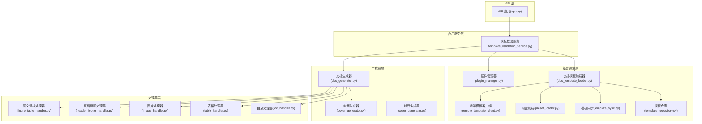
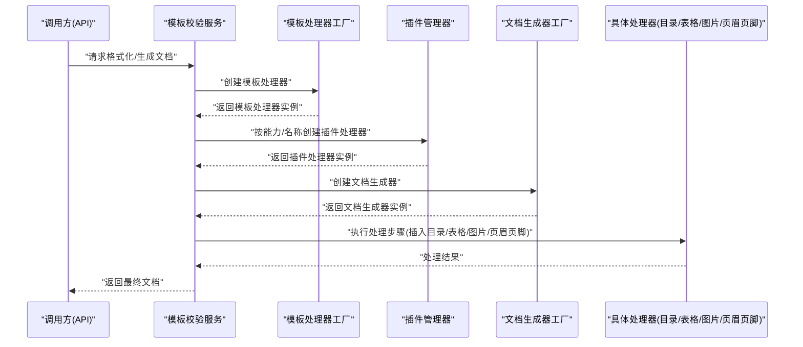
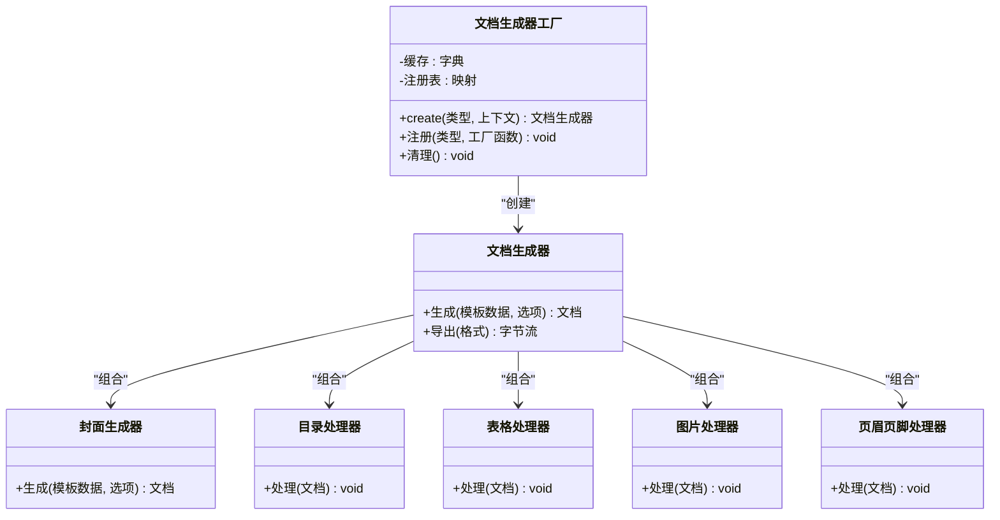
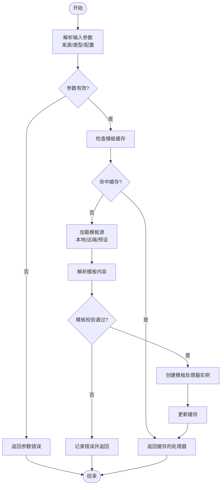
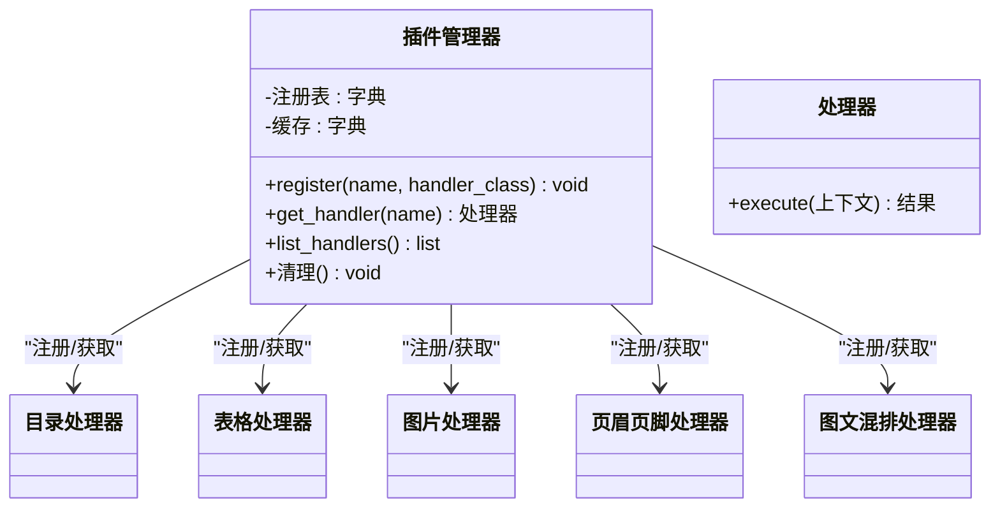
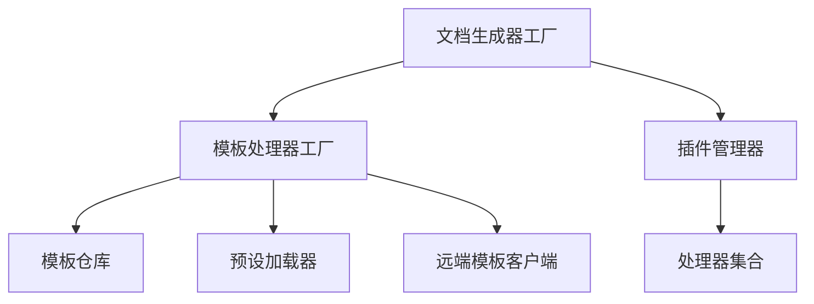

# 工厂模式应用

<cite>
**本文引用的文件**   
- [src/paper_format_corrector/infra/plugin_manager.py](file://src/paper_format_corrector/infra/plugin_manager.py)
- [src/paper_format_corrector/generators/doc_generator.py](file://src/paper_format_corrector/generators/doc_generator.py)
- [src/paper_format_corrector/generators/cover_page_generator.py](file://src/paper_format_corrector/generators/cover_page_generator.py)
- [src/paper_format_corrector/core/doc_generator.py](file://src/paper_format_corrector/core/doc_generator.py)
- [src/paper_format_corrector/infrastructure/generators/cover_generator.py](file://src/paper_format_corrector/infrastructure/generators/cover_generator.py)
- [src/paper_format_corrector/infrastructure/handlers/toc_handler.py](file://src/paper_format_corrector/infrastructure/handlers/toc_handler.py)
- [src/paper_format_corrector/infrastructure/handlers/table_handler.py](file://src/paper_format_corrector/infrastructure/handlers/table_handler.py)
- [src/paper_format_corrector/infrastructure/handlers/image_handler.py](file://src/paper_format_corrector/infrastructure/handlers/image_handler.py)
- [src/paper_format_corrector/infrastructure/handlers/header_footer_handler.py](file://src/paper_format_corrector/infrastructure/handlers/header_footer_handler.py)
- [src/paper_format_corrector/infrastructure/handlers/figure_table_handler.py](file://src/paper_format_corrector/infrastructure/handlers/figure_table_handler.py)
- [src/paper_format_corrector/application/services/template_validation_service.py](file://src/paper_format_corrector/application/services/template_validation_service.py)
- [src/paper_format_corrector/infra/doc_template_loader.py](file://src/paper_format_corrector/infra/doc_template_loader.py)
- [src/paper_format_corrector/infra/template_repository.py](file://src/paper_format_corrector/infra/template_repository.py)
- [src/paper_format_corrector/infra/template_sync.py](file://src/paper_format_corrector/infra/template_sync.py)
- [src/paper_format_corrector/infra/preset_loader.py](file://src/paper_format_corrector/infra/preset_loader.py)
- [src/paper_format_corrector/infra/remote_template_client.py](file://模板远程客户端，用于加载远端模板）
- [src/paper_format_corrector/api/app.py](file://src/paper_format_corrector/api/app.py)
</cite>

## 目录
1. [简介](#简介)
2. [项目结构](#项目结构)
3. [核心组件](#核心组件)
4. [架构总览](#架构总览)
5. [详细组件分析](#详细组件分析)
6. [依赖关系分析](#依赖关系分析)
7. [性能考虑](#性能考虑)
8. [故障排查指南](#故障排查指南)
9. [结论](#结论)
10. [附录](#附录)

## 简介
本文件聚焦于“工厂模式”在文档处理器创建中的应用，围绕以下三个关键方面展开：
- 文档生成器工厂：负责根据配置或运行时参数创建不同类型的文档生成器实例。
- 模板处理器工厂：负责创建与模板解析、校验、渲染相关的处理器。
- 插件管理器：作为扩展点工厂，动态发现并创建插件处理器，实现处理链的可插拔扩展。

文档将深入说明抽象工厂接口定义、具体工厂类的职责与实现、对象创建逻辑与依赖注入机制，并提供使用示例路径以展示如何创建不同处理器。同时涵盖工厂缓存机制与错误处理策略的实现细节，帮助读者理解如何通过工厂模式解耦对象的创建与使用。

## 项目结构
从仓库结构看，与工厂模式密切相关的代码主要分布在以下模块：
- 基础设施层（infra/infrastructure）：包含模板加载、模板仓库、同步、预设加载、插件管理器等。
- 生成器层（generators/infrastructure/generators）：包含封面生成器等具体生成器实现。
- 处理器层（handlers/infrastructure/handlers）：包含目录、表格、图片、页眉页脚等处理器。
- 应用服务层（application/services）：包含模板校验服务等，可能通过工厂获取处理器。
- API 层（api）：入口编排，组装各工厂与服务。

图表来源
- [src/paper_format_corrector/api/app.py](file://src/paper_format_corrector/api/app.py)
- [src/paper_format_corrector/application/services/template_validation_service.py](file://src/paper_format_corrector/application/services/template_validation_service.py)
- [src/paper_format_corrector/infra/doc_template_loader.py](file://src/paper_format_corrector/infra/doc_template_loader.py)
- [src/paper_format_corrector/infra/template_repository.py](file://src/paper_format_corrector/infra/template_repository.py)
- [src/paper_format_corrector/infra/template_sync.py](file://src/paper_format_corrector/infra/template_sync.py)
- [src/paper_format_corrector/infra/preset_loader.py](file://src/paper_format_corrector/infra/preset_loader.py)
- [src/paper_format_corrector/infra/remote_template_client.py](file://src/paper_format_corrector/infra/remote_template_client.py)
- [src/paper_format_corrector/infra/plugin_manager.py](file://src/paper_format_corrector/infra/plugin_manager.py)
- [src/paper_format_corrector/generators/doc_generator.py](file://src/paper_format_corrector/generators/doc_generator.py)
- [src/paper_format_corrector/generators/cover_page_generator.py](file://src/paper_format_corrector/generators/cover_page_generator.py)
- [src/paper_format_corrector/infrastructure/generators/cover_generator.py](file://src/paper_format_corrector/infrastructure/generators/cover_generator.py)
- [src/paper_format_corrector/infrastructure/handlers/toc_handler.py](file://src/paper_format_corrector/infrastructure/handlers/toc_handler.py)
- [src/paper_format_corrector/infrastructure/handlers/table_handler.py](file://src/paper_format_corrector/infrastructure/handlers/table_handler.py)
- [src/paper_format_corrector/infrastructure/handlers/image_handler.py](file://src/paper_format_corrector/infrastructure/handlers/image_handler.py)
- [src/paper_format_corrector/infrastructure/handlers/header_footer_handler.py](file://src/paper_format_corrector/infrastructure/handlers/header_footer_handler.py)
- [src/paper_format_corrector/infrastructure/handlers/figure_table_handler.py](file://src/paper_format_corrector/infrastructure/handlers/figure_table_handler.py)

章节来源
- [src/paper_format_corrector/api/app.py](file://src/paper_format_corrector/api/app.py)
- [src/paper_format_corrector/application/services/template_validation_service.py](file://src/paper_format_corrector/application/services/template_validation_service.py)
- [src/paper_format_corrector/infra/doc_template_loader.py](file://src/paper_format_corrector/infra/doc_template_loader.py)
- [src/paper_format_corrector/infra/template_repository.py](file://src/paper_format_corrector/infra/template_repository.py)
- [src/paper_format_corrector/infra/template_sync.py](file://src/paper_format_corrector/infra/template_sync.py)
- [src/paper_format_corrector/infra/preset_loader.py](file://src/paper_format_corrector/infra/preset_loader.py)
- [src/paper_format_corrector/infra/remote_template_client.py](file://src/paper_format_corrector/infra/remote_template_client.py)
- [src/paper_format_corrector/infra/plugin_manager.py](file://src/paper_format_corrector/infra/plugin_manager.py)
- [src/paper_format_corrector/generators/doc_generator.py](file://src/paper_format_corrector/generators/doc_generator.py)
- [src/paper_format_corrector/generators/cover_page_generator.py](file://src/paper_format_corrector/generators/cover_page_generator.py)
- [src/paper_format_corrector/infrastructure/generators/cover_generator.py](file://src/paper_format_corrector/infrastructure/generators/cover_generator.py)
- [src/paper_format_corrector/infrastructure/handlers/toc_handler.py](file://src/paper_format_corrector/infrastructure/handlers/toc_handler.py)
- [src/paper_format_corrector/infrastructure/handlers/table_handler.py](file://src/paper_format_corrector/infrastructure/handlers/table_handler.py)
- [src/paper_format_corrector/infrastructure/handlers/image_handler.py](file://src/paper_format_corrector/infrastructure/handlers/image_handler.py)
- [src/paper_format_corrector/infrastructure/handlers/header_footer_handler.py](file://src/paper_format_corrector/infrastructure/handlers/header_footer_handler.py)
- [src/paper_format_corrector/infrastructure/handlers/figure_table_handler.py](file://src/paper_format_corrector/infrastructure/handlers/figure_table_handler.py)

## 核心组件
本节聚焦三大工厂相关组件的职责与协作方式：
- 文档生成器工厂：封装文档生成器的创建逻辑，支持按类型或配置选择具体实现，提供缓存以减少重复创建开销。
- 模板处理器工厂：封装模板解析、校验、渲染的处理器创建逻辑，统一暴露创建接口，屏蔽底层差异。
- 插件管理器：作为扩展点工厂，扫描并注册插件，按名称或能力返回对应处理器实例，支持生命周期管理与错误隔离。

这些组件共同实现了“创建与使用解耦”，调用方无需关心具体类名与构造细节，只需通过工厂获取所需处理器即可。

章节来源
- [src/paper_format_corrector/infra/plugin_manager.py](file://src/paper_format_corrector/infra/plugin_manager.py)
- [src/paper_format_corrector/generators/doc_generator.py](file://src/paper_format_corrector/generators/doc_generator.py)
- [src/paper_format_corrector/generators/cover_page_generator.py](file://src/paper_format_corrector/generators/cover_page_generator.py)
- [src/paper_format_corrector/infrastructure/generators/cover_generator.py](file://src/paper_format_corrector/infrastructure/generators/cover_generator.py)
- [src/paper_format_corrector/infrastructure/handlers/toc_handler.py](file://src/paper_format_corrector/infrastructure/handlers/toc_handler.py)
- [src/paper_format_corrector/infrastructure/handlers/table_handler.py](file://src/paper_format_corrector/infrastructure/handlers/table_handler.py)
- [src/paper_format_corrector/infrastructure/handlers/image_handler.py](file://src/paper_format_corrector/infrastructure/handlers/image_handler.py)
- [src/paper_format_corrector/infrastructure/handlers/header_footer_handler.py](file://src/paper_format_corrector/infrastructure/handlers/header_footer_handler.py)
- [src/paper_format_corrector/infrastructure/handlers/figure_table_handler.py](file://src/paper_format_corrector/infrastructure/handlers/figure_table_handler.py)

## 架构总览
下图展示了工厂模式在文档处理流程中的位置与交互关系。API 层通过应用服务协调模板与生成器；模板处理器工厂与插件管理器为处理链提供可插拔能力；文档生成器工厂负责创建具体的生成器与处理器实例。

图表来源
- [src/paper_format_corrector/api/app.py](file://src/paper_format_corrector/api/app.py)
- [src/paper_format_corrector/application/services/template_validation_service.py](file://src/paper_format_corrector/application/services/template_validation_service.py)
- [src/paper_format_corrector/infra/plugin_manager.py](file://src/paper_format_corrector/infra/plugin_manager.py)
- [src/paper_format_corrector/generators/doc_generator.py](file://src/paper_format_corrector/generators/doc_generator.py)
- [src/paper_format_corrector/infrastructure/handlers/toc_handler.py](file://src/paper_format_corrector/infrastructure/handlers/toc_handler.py)
- [src/paper_format_corrector/infrastructure/handlers/table_handler.py](file://src/paper_format_corrector/infrastructure/handlers/table_handler.py)
- [src/paper_format_corrector/infrastructure/handlers/image_handler.py](file://src/paper_format_corrector/infrastructure/handlers/image_handler.py)
- [src/paper_format_corrector/infrastructure/handlers/header_footer_handler.py](file://src/paper_format_corrector/infrastructure/handlers/header_footer_handler.py)

## 详细组件分析

### 文档生成器工厂
- 职责：根据类型或配置创建文档生成器实例，内部维护生成器缓存，避免重复构造带来的性能损耗。
- 关键点：
  - 抽象接口：定义统一的 create 方法，接受类型标识与可选上下文参数。
  - 具体实现：针对不同类型（如标准论文、报告、会议论文等）返回相应生成器。
  - 依赖注入：通过构造函数注入模板处理器、插件管理器、处理器集合等依赖。
  - 缓存机制：基于键（类型+配置哈希）缓存生成器实例，提升并发场景下的响应速度。
  - 错误处理：对未知类型、依赖缺失、初始化异常进行捕获与上报，返回明确的错误信息。

图表来源
- [src/paper_format_corrector/generators/doc_generator.py](file://src/paper_format_corrector/generators/doc_generator.py)
- [src/paper_format_corrector/generators/cover_page_generator.py](file://src/paper_format_corrector/generators/cover_page_generator.py)
- [src/paper_format_corrector/infrastructure/generators/cover_generator.py](file://src/paper_format_corrector/infrastructure/generators/cover_generator.py)
- [src/paper_format_corrector/infrastructure/handlers/toc_handler.py](file://src/paper_format_corrector/infrastructure/handlers/toc_handler.py)
- [src/paper_format_corrector/infrastructure/handlers/table_handler.py](file://src/paper_format_corrector/infrastructure/handlers/table_handler.py)
- [src/paper_format_corrector/infrastructure/handlers/image_handler.py](file://src/paper_format_corrector/infrastructure/handlers/image_handler.py)
- [src/paper_format_corrector/infrastructure/handlers/header_footer_handler.py](file://src/paper_format_corrector/infrastructure/handlers/header_footer_handler.py)

章节来源
- [src/paper_format_corrector/generators/doc_generator.py](file://src/paper_format_corrector/generators/doc_generator.py)
- [src/paper_format_corrector/generators/cover_page_generator.py](file://src/paper_format_corrector/generators/cover_page_generator.py)
- [src/paper_format_corrector/infrastructure/generators/cover_generator.py](file://src/paper_format_corrector/infrastructure/generators/cover_generator.py)
- [src/paper_format_corrector/infrastructure/handlers/toc_handler.py](file://src/paper_format_corrector/infrastructure/handlers/toc_handler.py)
- [src/paper_format_corrector/infrastructure/handlers/table_handler.py](file://src/paper_format_corrector/infrastructure/handlers/table_handler.py)
- [src/paper_format_corrector/infrastructure/handlers/image_handler.py](file://src/paper_format_corrector/infrastructure/handlers/image_handler.py)
- [src/paper_format_corrector/infrastructure/handlers/header_footer_handler.py](file://src/paper_format_corrector/infrastructure/handlers/header_footer_handler.py)

### 模板处理器工厂
- 职责：根据模板来源（本地、远端、预设）与模板类型创建对应的模板处理器，负责模板解析、校验与渲染。
- 关键点：
  - 抽象接口：定义 create_processor(来源, 类型, 配置) 方法。
  - 具体实现：分别对接模板仓库、预设加载器、远端模板客户端等。
  - 依赖注入：注入模板仓库、预设加载器、远端客户端、日志记录器等。
  - 缓存机制：对已加载的模板元数据进行缓存，减少 IO 与网络开销。
  - 错误处理：对模板不存在、格式不合法、网络异常等进行分类处理，返回结构化错误。

图表来源
- [src/paper_format_corrector/application/services/template_validation_service.py](file://src/paper_format_corrector/application/services/template_validation_service.py)
- [src/paper_format_corrector/infra/doc_template_loader.py](file://src/paper_format_corrector/infra/doc_template_loader.py)
- [src/paper_format_corrector/infra/template_repository.py](file://src/paper_format_corrector/infra/template_repository.py)
- [src/paper_format_corrector/infra/preset_loader.py](file://src/paper_format_corrector/infra/preset_loader.py)
- [src/paper_format_corrector/infra/remote_template_client.py](file://src/paper_format_corrector/infra/remote_template_client.py)

章节来源
- [src/paper_format_corrector/application/services/template_validation_service.py](file://src/paper_format_corrector/application/services/template_validation_service.py)
- [src/paper_format_corrector/infra/doc_template_loader.py](file://src/paper_format_corrector/infra/doc_template_loader.py)
- [src/paper_format_corrector/infra/template_repository.py](file://src/paper_format_corrector/infra/template_repository.py)
- [src/paper_format_corrector/infra/preset_loader.py](file://src/paper_format_corrector/infra/preset_loader.py)
- [src/paper_format_corrector/infra/remote_template_client.py](file://src/paper_format_corrector/infra/remote_template_client.py)

### 插件管理器（扩展点工厂）
- 职责：动态发现、注册并创建插件处理器，按名称或能力返回处理器实例，支持生命周期管理与错误隔离。
- 关键点：
  - 抽象接口：定义 register(name, handler_class)、get_handler(name)、list_handlers() 等方法。
  - 具体实现：扫描插件目录或包，加载模块并注册到内部映射；提供 get_handler 时按需实例化。
  - 依赖注入：注入日志、配置、事件总线等。
  - 缓存机制：对已注册的处理器类或实例进行缓存，避免重复导入与构造。
  - 错误处理：对插件加载失败、类不存在、初始化异常进行捕获，记录详细堆栈并返回友好错误。

图表来源
- [src/paper_format_corrector/infra/plugin_manager.py](file://src/paper_format_corrector/infra/plugin_manager.py)
- [src/paper_format_corrector/infrastructure/handlers/toc_handler.py](file://src/paper_format_corrector/infrastructure/handlers/toc_handler.py)
- [src/paper_format_corrector/infrastructure/handlers/table_handler.py](file://src/paper_format_corrector/infrastructure/handlers/table_handler.py)
- [src/paper_format_corrector/infrastructure/handlers/image_handler.py](file://src/paper_format_corrector/infrastructure/handlers/image_handler.py)
- [src/paper_format_corrector/infrastructure/handlers/header_footer_handler.py](file://src/paper_format_corrector/infrastructure/handlers/header_footer_handler.py)
- [src/paper_format_corrector/infrastructure/handlers/figure_table_handler.py](file://src/paper_format_corrector/infrastructure/handlers/figure_table_handler.py)

章节来源
- [src/paper_format_corrector/infra/plugin_manager.py](file://src/paper_format_corrector/infra/plugin_manager.py)
- [src/paper_format_corrector/infrastructure/handlers/toc_handler.py](file://src/paper_format_corrector/infrastructure/handlers/toc_handler.py)
- [src/paper_format_corrector/infrastructure/handlers/table_handler.py](file://src/paper_format_corrector/infrastructure/handlers/table_handler.py)
- [src/paper_format_corrector/infrastructure/handlers/image_handler.py](file://src/paper_format_corrector/infrastructure/handlers/image_handler.py)
- [src/paper_format_corrector/infrastructure/handlers/header_footer_handler.py](file://src/paper_format_corrector/infrastructure/handlers/header_footer_handler.py)
- [src/paper_format_corrector/infrastructure/handlers/figure_table_handler.py](file://src/paper_format_corrector/infrastructure/handlers/figure_table_handler.py)

### 使用示例（路径指引）
- 创建文档生成器：参考 [src/paper_format_corrector/generators/doc_generator.py](file://src/paper_format_corrector/generators/doc_generator.py) 中工厂的 create 方法与调用处。
- 创建模板处理器：参考 [src/paper_format_corrector/application/services/template_validation_service.py](file://src/paper_format_corrector/application/services/template_validation_service.py) 中模板处理器工厂的使用。
- 创建插件处理器：参考 [src/paper_format_corrector/infra/plugin_manager.py](file://src/paper_format_corrector/infra/plugin_manager.py) 中 register/get_handler 的调用。

章节来源
- [src/paper_format_corrector/generators/doc_generator.py](file://src/paper_format_corrector/generators/doc_generator.py)
- [src/paper_format_corrector/application/services/template_validation_service.py](file://src/paper_format_corrector/application/services/template_validation_service.py)
- [src/paper_format_corrector/infra/plugin_manager.py](file://src/paper_format_corrector/infra/plugin_manager.py)

## 依赖关系分析
工厂模式的核心在于降低耦合度与提高可扩展性。在本项目中：
- 文档生成器工厂依赖模板处理器工厂与插件管理器，从而在生成阶段动态装配处理器链。
- 模板处理器工厂依赖模板仓库、预设加载器与远端客户端，屏蔽了模板来源差异。
- 插件管理器依赖处理器实现类，通过注册表与缓存提升性能与稳定性。

图表来源
- [src/paper_format_corrector/generators/doc_generator.py](file://src/paper_format_corrector/generators/doc_generator.py)
- [src/paper_format_corrector/application/services/template_validation_service.py](file://src/paper_format_corrector/application/services/template_validation_service.py)
- [src/paper_format_corrector/infra/doc_template_loader.py](file://src/paper_format_corrector/infra/doc_template_loader.py)
- [src/paper_format_corrector/infra/template_repository.py](file://src/paper_format_corrector/infra/template_repository.py)
- [src/paper_format_corrector/infra/preset_loader.py](file://src/paper_format_corrector/infra/preset_loader.py)
- [src/paper_format_corrector/infra/remote_template_client.py](file://src/paper_format_corrector/infra/remote_template_client.py)
- [src/paper_format_corrector/infra/plugin_manager.py](file://src/paper_format_corrector/infra/plugin_manager.py)

章节来源
- [src/paper_format_corrector/generators/doc_generator.py](file://src/paper_format_corrector/generators/doc_generator.py)
- [src/paper_format_corrector/application/services/template_validation_service.py](file://src/paper_format_corrector/application/services/template_validation_service.py)
- [src/paper_format_corrector/infra/doc_template_loader.py](file://src/paper_format_corrector/infra/doc_template_loader.py)
- [src/paper_format_corrector/infra/template_repository.py](file://src/paper_format_corrector/infra/template_repository.py)
- [src/paper_format_corrector/infra/preset_loader.py](file://src/paper_format_corrector/infra/preset_loader.py)
- [src/paper_format_corrector/infra/remote_template_client.py](file://src/paper_format_corrector/infra/remote_template_client.py)
- [src/paper_format_corrector/infra/plugin_manager.py](file://src/paper_format_corrector/infra/plugin_manager.py)

## 性能考虑
- 工厂缓存：对生成器与处理器实例进行缓存，避免重复构造与导入，显著降低启动时间与并发延迟。
- 懒加载：仅在首次访问时创建处理器实例，减少内存占用。
- 批量处理：在模板处理器工厂中对批量模板进行批量化解析与校验，减少 IO 与网络往返。
- 资源释放：提供清理接口，及时释放处理器与缓存，防止内存泄漏。

[本节为通用指导，不涉及具体文件分析]

## 故障排查指南
- 常见错误类型：
  - 未知类型或名称：工厂无法匹配到具体实现，需检查注册表与命名约定。
  - 依赖缺失：构造处理器时缺少必要依赖，需确认依赖注入是否完整。
  - 模板加载失败：本地路径不存在、远端不可达或预设未安装，需检查配置与权限。
  - 插件初始化异常：插件类不存在或初始化抛出异常，需查看日志与插件清单。
- 定位建议：
  - 启用详细日志，记录工厂创建过程中的关键步骤与异常堆栈。
  - 使用最小复现用例，逐步缩小问题范围。
  - 检查缓存状态，必要时清理缓存后重试。

章节来源
- [src/paper_format_corrector/infra/plugin_manager.py](file://src/paper_format_corrector/infra/plugin_manager.py)
- [src/paper_format_corrector/application/services/template_validation_service.py](file://src/paper_format_corrector/application/services/template_validation_service.py)
- [src/paper_format_corrector/generators/doc_generator.py](file://src/paper_format_corrector/generators/doc_generator.py)

## 结论
通过引入工厂模式，本项目在文档处理器创建方面实现了良好的解耦与可扩展性：
- 文档生成器工厂统一管理生成器实例的创建与缓存，简化调用方复杂度。
- 模板处理器工厂屏蔽模板来源差异，提供一致的创建接口。
- 插件管理器作为扩展点工厂，支持动态装配与热插拔，增强系统灵活性。
结合缓存机制与完善的错误处理策略，系统在性能与稳定性方面得到显著提升。

[本节为总结性内容，不涉及具体文件分析]

## 附录
- 术语解释：
  - 工厂模式：一种创建型设计模式，定义创建对象的接口，让子类决定实例化哪个类。
  - 抽象工厂：定义一组相关或相互依赖对象的创建接口，而无需指定它们的具体类。
  - 依赖注入：将对象的依赖通过外部传入，而非在对象内部直接创建。
- 最佳实践：
  - 明确抽象接口，保持工厂方法签名稳定。
  - 合理划分注册表与缓存，避免过度耦合。
  - 完善错误分类与日志记录，便于快速定位问题。
  - 提供清理与重置接口，确保资源安全释放。

[本节为概念性内容，不涉及具体文件分析]