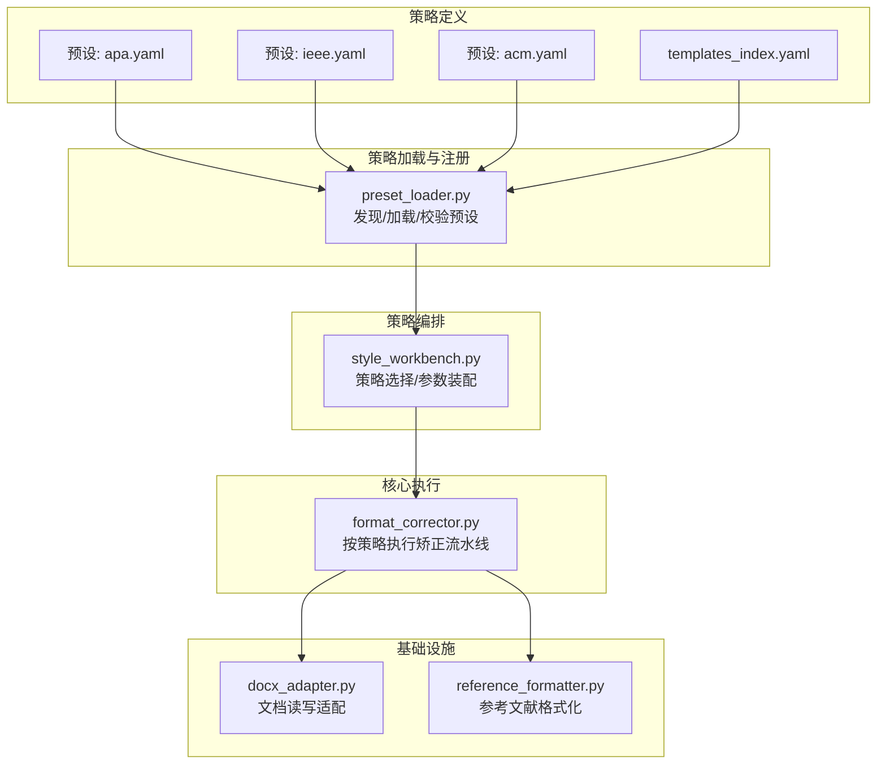
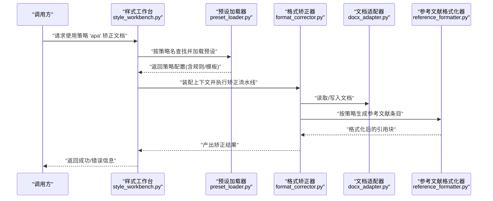
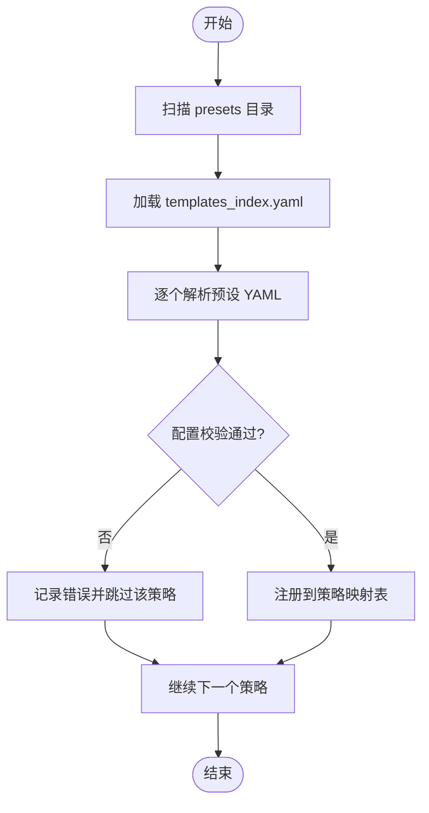
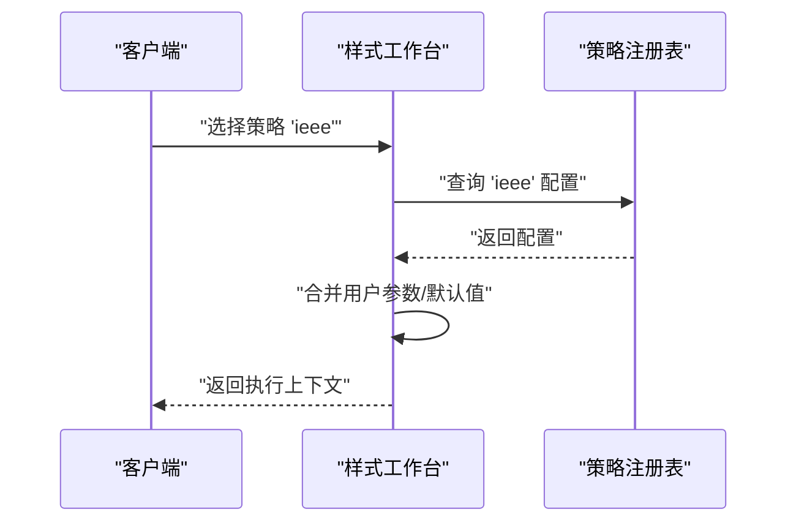
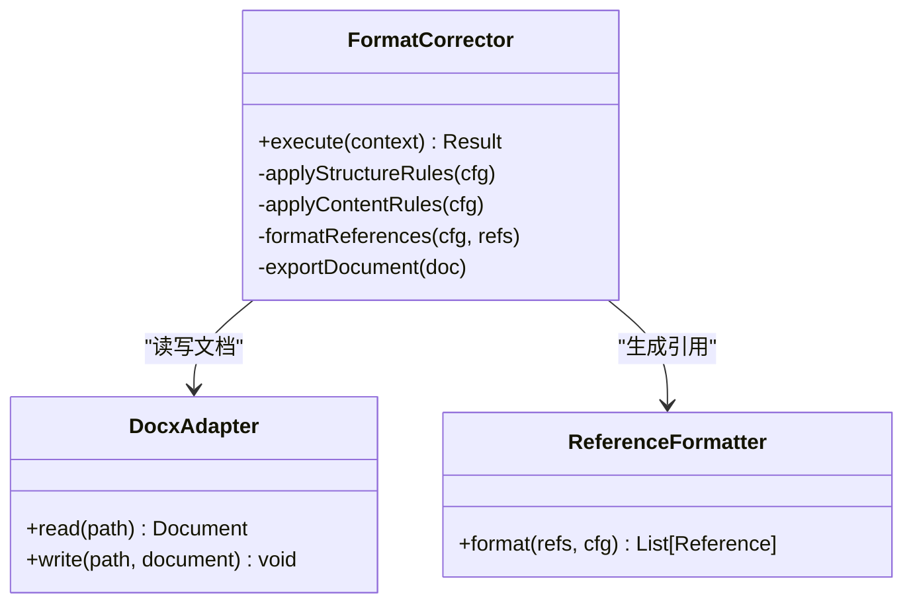
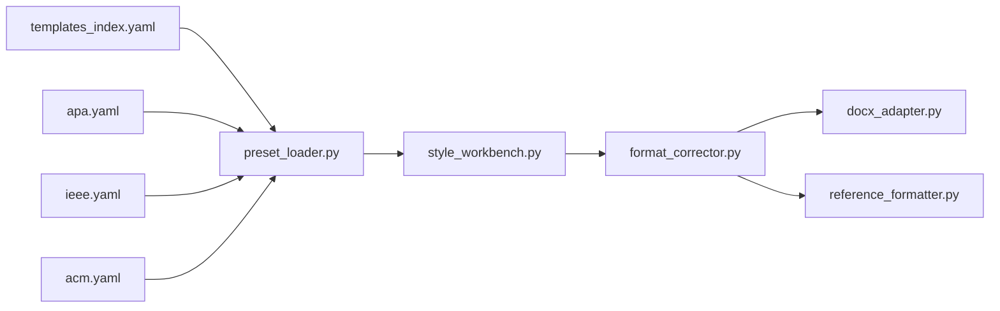

# 策略模式应用

<cite>
**本文引用的文件**   
- [src/paper_format_corrector/infra/preset_loader.py](file://src/paper_format_corrector/infra/preset_loader.py)
- [src/paper_format_corrector/core/format_corrector.py](file://src/paper_format_corrector/core/format_corrector.py)
- [src/paper_format_corrector/application/services/style_workbench.py](file://src/paper_format_corrector/application/services/style_workbench.py)
- [src/paper_format_corrector/infrastructure/adapters/docx_adapter.py](file://src/paper_format_corrector/infrastructure/adapters/docx_adapter.py)
- [src/paper_format_corrector/infrastructure/parsers/reference_formatter.py](file://src/paper_format_corrector/infrastructure/parsers/reference_formatter.py)
- [presets/apa.yaml](file://presets/apa.yaml)
- [presets/ieee.yaml](file://presets/ieee.yaml)
- [presets/acm.yaml](file://presets/acm.yaml)
- [presets/templates_index.yaml](file://presets/templates_index.yaml)
</cite>

## 目录
1. [引言](#引言)
2. [项目结构](#项目结构)
3. [核心组件](#核心组件)
4. [架构总览](#架构总览)
5. [详细组件分析](#详细组件分析)
6. [依赖分析](#依赖分析)
7. [性能考虑](#性能考虑)
8. [故障排查指南](#故障排查指南)
9. [结论](#结论)
10. [附录](#附录)

## 引言
本文件聚焦于“格式矫正引擎”中策略模式的系统化应用，围绕不同学术格式标准（如 APA、IEEE、ACM 等）作为独立策略的实现方式展开。文档将说明：
- 策略接口与约定
- 具体策略类的职责与实现要点
- 策略选择机制与动态切换逻辑
- 如何扩展新策略（以最小侵入的方式）
- 策略注册表管理与策略验证机制
- 通过图示展示数据流与控制流

## 项目结构
从仓库结构看，策略模式主要分布在以下层次：
- 预设加载层：负责发现、加载并解析 YAML 预设模板，形成可执行的策略配置对象
- 编排服务层：根据输入的策略标识选择对应策略，协调各处理阶段
- 核心执行层：基于策略配置驱动文档分析与格式化流程
- 基础设施适配层：对 Word 文档进行读写与转换的适配器
- 参考格式器：依据策略配置生成参考文献条目

图表来源
- [src/paper_format_corrector/infra/preset_loader.py](file://src/paper_format_corrector/infra/preset_loader.py)
- [src/paper_format_corrector/application/services/style_workbench.py](file://src/paper_format_corrector/application/services/style_workbench.py)
- [src/paper_format_corrector/core/format_corrector.py](file://src/paper_format_corrector/core/format_corrector.py)
- [src/paper_format_corrector/infrastructure/adapters/docx_adapter.py](file://src/paper_format_corrector/infrastructure/adapters/docx_adapter.py)
- [src/paper_format_corrector/infrastructure/parsers/reference_formatter.py](file://src/paper_format_corrector/infrastructure/parsers/reference_formatter.py)
- [presets/apa.yaml](file://presets/apa.yaml)
- [presets/ieee.yaml](file://presets/ieee.yaml)
- [presets/acm.yaml](file://presets/acm.yaml)
- [presets/templates_index.yaml](file://presets/templates_index.yaml)

章节来源
- [src/paper_format_corrector/infra/preset_loader.py](file://src/paper_format_corrector/infra/preset_loader.py)
- [src/paper_format_corrector/application/services/style_workbench.py](file://src/paper_format_corrector/application/services/style_workbench.py)
- [src/paper_format_corrector/core/format_corrector.py](file://src/paper_format_corrector/core/format_corrector.py)
- [src/paper_format_corrector/infrastructure/adapters/docx_adapter.py](file://src/paper_format_corrector/infrastructure/adapters/docx_adapter.py)
- [src/paper_format_corrector/infrastructure/parsers/reference_formatter.py](file://src/paper_format_corrector/infrastructure/parsers/reference_formatter.py)
- [presets/apa.yaml](file://presets/apa.yaml)
- [presets/ieee.yaml](file://presets/ieee.yaml)
- [presets/acm.yaml](file://presets/acm.yaml)
- [presets/templates_index.yaml](file://presets/templates_index.yaml)

## 核心组件
- 策略接口与约定
  - 策略由“预设模板 + 解析规则 + 渲染/格式化规则”构成，统一通过策略标识（如 “apa”、“ieee”、“acm”）访问
  - 策略需暴露一致的输入输出契约：输入为文档结构与元数据，输出为符合目标格式的文档或中间表示
- 策略加载与注册
  - 通过预设加载器扫描 presets 目录，解析 templates_index.yaml 索引，构建“策略名 -> 策略配置”的映射
  - 在启动时完成策略注册，支持热更新与增量发现
- 策略选择与动态切换
  - 样式工作台根据调用方传入的策略标识，从注册表中获取策略配置，组装上下文并交由核心执行器运行
- 核心执行器
  - 按策略配置驱动段落、标题、引用、图表、页眉页脚等处理阶段
- 基础设施适配
  - 文档适配器负责 docx 文件的读取与写入
  - 参考文献格式化器依据策略配置生成条目顺序、标点、缩进等

章节来源
- [src/paper_format_corrector/infra/preset_loader.py](file://src/paper_format_corrector/infra/preset_loader.py)
- [src/paper_format_corrector/application/services/style_workbench.py](file://src/paper_format_corrector/application/services/style_workbench.py)
- [src/paper_format_corrector/core/format_corrector.py](file://src/paper_format_corrector/core/format_corrector.py)
- [src/paper_format_corrector/infrastructure/adapters/docx_adapter.py](file://src/paper_format_corrector/infrastructure/adapters/docx_adapter.py)
- [src/paper_format_corrector/infrastructure/parsers/reference_formatter.py](file://src/paper_format_corrector/infrastructure/parsers/reference_formatter.py)

## 架构总览
下图展示了策略模式在格式矫正引擎中的端到端流程：从策略定义到执行落盘。

图表来源
- [src/paper_format_corrector/application/services/style_workbench.py](file://src/paper_format_corrector/application/services/style_workbench.py)
- [src/paper_format_corrector/infra/preset_loader.py](file://src/paper_format_corrector/infra/preset_loader.py)
- [src/paper_format_corrector/core/format_corrector.py](file://src/paper_format_corrector/core/format_corrector.py)
- [src/paper_format_corrector/infrastructure/adapters/docx_adapter.py](file://src/paper_format_corrector/infrastructure/adapters/docx_adapter.py)
- [src/paper_format_corrector/infrastructure/parsers/reference_formatter.py](file://src/paper_format_corrector/infrastructure/parsers/reference_formatter.py)

## 详细组件分析

### 策略接口与约定
- 策略标识
  - 采用字符串键（如 “apa”、“ieee”、“acm”）作为策略唯一标识
- 策略配置项（来自 YAML 预设）
  - 文档结构规范：标题层级、编号规则、页边距、字体字号等
  - 引用规范：作者名格式、年份位置、标点与空格、排序规则
  - 图表规范：题注前缀、编号方式、对齐与间距
  - 其他：页眉页脚、封面、目录等
- 策略契约
  - 输入：文档结构抽象 + 策略配置
  - 输出：符合目标格式的文档对象或中间表示
  - 错误：当策略缺失或配置不合法时，应返回明确的错误信息

章节来源
- [presets/apa.yaml](file://presets/apa.yaml)
- [presets/ieee.yaml](file://presets/ieee.yaml)
- [presets/acm.yaml](file://presets/acm.yaml)
- [presets/templates_index.yaml](file://presets/templates_index.yaml)

### 策略加载与注册表管理
- 策略发现
  - 扫描 presets 目录，结合 templates_index.yaml 索引，收集可用策略清单
- 策略解析
  - 将 YAML 预设解析为内部策略模型，包含字段校验与默认值填充
- 注册表
  - 维护“策略名 -> 策略配置”的映射，提供按名查询能力
  - 支持运行时刷新（重新扫描与解析），便于新增策略后无需重启

图表来源
- [src/paper_format_corrector/infra/preset_loader.py](file://src/paper_format_corrector/infra/preset_loader.py)
- [presets/templates_index.yaml](file://presets/templates_index.yaml)

章节来源
- [src/paper_format_corrector/infra/preset_loader.py](file://src/paper_format_corrector/infra/preset_loader.py)
- [presets/templates_index.yaml](file://presets/templates_index.yaml)

### 策略选择与动态切换
- 选择入口
  - 样式工作台接收策略标识，向注册表查询对应策略配置
- 动态切换
  - 若注册表已刷新，则可直接切换到新策略；否则先触发刷新再选择
- 参数装配
  - 将策略配置与用户可选参数合并，形成最终执行上下文

图表来源
- [src/paper_format_corrector/application/services/style_workbench.py](file://src/paper_format_corrector/application/services/style_workbench.py)
- [src/paper_format_corrector/infra/preset_loader.py](file://src/paper_format_corrector/infra/preset_loader.py)

章节来源
- [src/paper_format_corrector/application/services/style_workbench.py](file://src/paper_format_corrector/application/services/style_workbench.py)
- [src/paper_format_corrector/infra/preset_loader.py](file://src/paper_format_corrector/infra/preset_loader.py)

### 核心执行器（按策略驱动）
- 执行阶段
  - 文档结构矫正：标题、段落、编号、页边距等
  - 内容规范化：字体、行距、对齐、图片/表格题注
  - 引用格式化：按策略生成参考文献条目
  - 导出与保存：通过文档适配器写回 docx
- 策略注入
  - 执行器仅依赖策略配置，不关心具体格式细节，从而保持开闭原则

图表来源
- [src/paper_format_corrector/core/format_corrector.py](file://src/paper_format_corrector/core/format_corrector.py)
- [src/paper_format_corrector/infrastructure/adapters/docx_adapter.py](file://src/paper_format_corrector/infrastructure/adapters/docx_adapter.py)
- [src/paper_format_corrector/infrastructure/parsers/reference_formatter.py](file://src/paper_format_corrector/infrastructure/parsers/reference_formatter.py)

章节来源
- [src/paper_format_corrector/core/format_corrector.py](file://src/paper_format_corrector/core/format_corrector.py)
- [src/paper_format_corrector/infrastructure/adapters/docx_adapter.py](file://src/paper_format_corrector/infrastructure/adapters/docx_adapter.py)
- [src/paper_format_corrector/infrastructure/parsers/reference_formatter.py](file://src/paper_format_corrector/infrastructure/parsers/reference_formatter.py)

### 具体策略示例：APA、IEEE、ACM
- 策略差异点
  - 标题与编号：APA 常用层级编号与无编号标题；IEEE 使用数字编号；ACM 有特定模板要求
  - 参考文献：作者名缩写、年份位置、标点与斜体规则不同
  - 图表题注：前缀与编号方式存在差异
- 配置来源
  - 各策略的具体规则由对应 YAML 文件定义，并通过加载器统一注册

章节来源
- [presets/apa.yaml](file://presets/apa.yaml)
- [presets/ieee.yaml](file://presets/ieee.yaml)
- [presets/acm.yaml](file://presets/acm.yaml)

### 添加新策略的步骤（最小侵入）
- 步骤一：创建新的 YAML 预设
  - 在 presets 目录下新增策略文件，描述所有格式规则
- 步骤二：更新索引
  - 在 templates_index.yaml 中添加新策略条目，确保能被发现
- 步骤三：校验与测试
  - 使用现有测试用例覆盖新策略的关键路径
- 步骤四：按需扩展
  - 若需要新的规则类型，可在加载器与执行器中增加相应解析与处理分支

章节来源
- [presets/templates_index.yaml](file://presets/templates_index.yaml)
- [src/paper_format_corrector/infra/preset_loader.py](file://src/paper_format_corrector/infra/preset_loader.py)
- [src/paper_format_corrector/core/format_corrector.py](file://src/paper_format_corrector/core/format_corrector.py)

### 策略验证机制
- 静态校验
  - 必填字段检查、枚举值范围、嵌套结构完整性
- 动态校验
  - 在首次使用时对策略进行兼容性检查，必要时给出降级或提示
- 错误上报
  - 记录不可用策略的原因，避免影响整体启动

章节来源
- [src/paper_format_corrector/infra/preset_loader.py](file://src/paper_format_corrector/infra/preset_loader.py)

## 依赖分析
- 组件耦合
  - 样式工作台依赖预设加载器与策略注册表
  - 格式矫正器依赖文档适配器与参考文献格式化器
  - 预设加载器依赖 YAML 文件与索引
- 外部依赖
  - YAML 解析库、docx 操作库（通过适配器封装）

图表来源
- [presets/templates_index.yaml](file://presets/templates_index.yaml)
- [presets/apa.yaml](file://presets/apa.yaml)
- [presets/ieee.yaml](file://presets/ieee.yaml)
- [presets/acm.yaml](file://presets/acm.yaml)
- [src/paper_format_corrector/infra/preset_loader.py](file://src/paper_format_corrector/infra/preset_loader.py)
- [src/paper_format_corrector/application/services/style_workbench.py](file://src/paper_format_corrector/application/services/style_workbench.py)
- [src/paper_format_corrector/core/format_corrector.py](file://src/paper_format_corrector/core/format_corrector.py)
- [src/paper_format_corrector/infrastructure/adapters/docx_adapter.py](file://src/paper_format_corrector/infrastructure/adapters/docx_adapter.py)
- [src/paper_format_corrector/infrastructure/parsers/reference_formatter.py](file://src/paper_format_corrector/infrastructure/parsers/reference_formatter.py)

章节来源
- [src/paper_format_corrector/infra/preset_loader.py](file://src/paper_format_corrector/infra/preset_loader.py)
- [src/paper_format_corrector/application/services/style_workbench.py](file://src/paper_format_corrector/application/services/style_workbench.py)
- [src/paper_format_corrector/core/format_corrector.py](file://src/paper_format_corrector/core/format_corrector.py)
- [src/paper_format_corrector/infrastructure/adapters/docx_adapter.py](file://src/paper_format_corrector/infrastructure/adapters/docx_adapter.py)
- [src/paper_format_corrector/infrastructure/parsers/reference_formatter.py](file://src/paper_format_corrector/infrastructure/parsers/reference_formatter.py)
- [presets/templates_index.yaml](file://presets/templates_index.yaml)
- [presets/apa.yaml](file://presets/apa.yaml)
- [presets/ieee.yaml](file://presets/ieee.yaml)
- [presets/acm.yaml](file://presets/acm.yaml)

## 性能考虑
- 策略加载缓存
  - 对已解析的策略配置进行内存缓存，避免重复 I/O 与解析开销
- 增量刷新
  - 仅监听变更的预设文件，减少全量扫描成本
- 并行处理
  - 对多文档批处理场景，可按策略分组并发执行，注意资源隔离
- 惰性初始化
  - 仅在首次使用某策略时进行深度校验与预热

## 故障排查指南
- 常见问题
  - 策略未找到：检查 templates_index.yaml 是否包含该策略条目
  - 配置不合法：查看加载器的校验日志，定位缺失或非法字段
  - 文档写入失败：确认文档适配器权限与路径安全策略
- 定位方法
  - 启用调试日志，记录策略选择与执行阶段的关键状态
  - 针对参考文献问题，单独运行格式化器并比对不同策略的输出

章节来源
- [src/paper_format_corrector/infra/preset_loader.py](file://src/paper_format_corrector/infra/preset_loader.py)
- [src/paper_format_corrector/infrastructure/adapters/docx_adapter.py](file://src/paper_format_corrector/infrastructure/adapters/docx_adapter.py)
- [src/paper_format_corrector/infrastructure/parsers/reference_formatter.py](file://src/paper_format_corrector/infrastructure/parsers/reference_formatter.py)

## 结论
通过将不同学术格式标准抽象为独立策略，并以 YAML 预设驱动，系统在扩展性与可维护性上获得显著提升：
- 新增策略仅需添加配置文件与索引条目，无需修改核心逻辑
- 策略注册表与验证机制保障系统稳定性
- 清晰的职责分层使策略选择、执行与适配解耦，便于测试与演进

## 附录
- 术语
  - 策略：一组用于格式化文档的规则集合，由 YAML 预设定义
  - 策略注册表：维护策略名到配置的映射，并提供查询与刷新能力
  - 策略选择：根据输入标识从注册表中获取策略配置的过程
- 最佳实践
  - 保持策略配置的最小化与一致性
  - 为每个策略编写回归测试，覆盖关键格式点
  - 对复杂规则进行模块化拆分，提升可读性与复用性