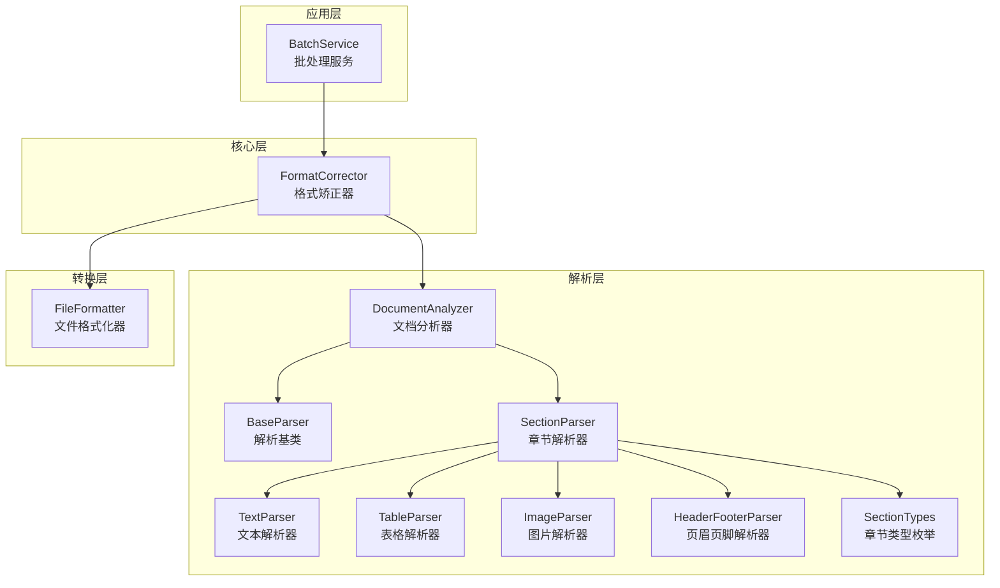
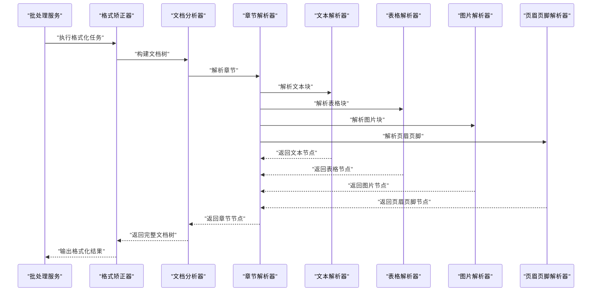
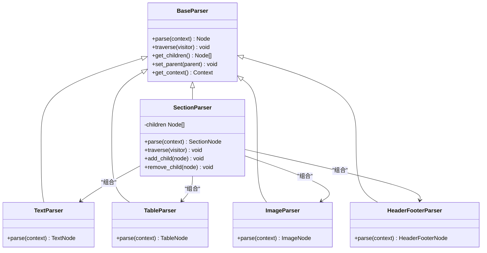
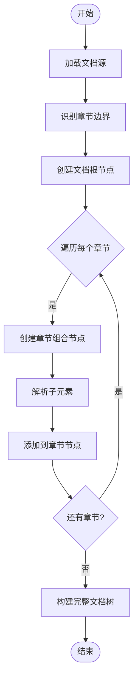
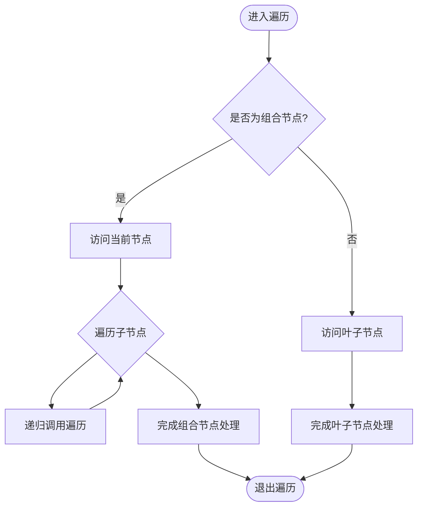
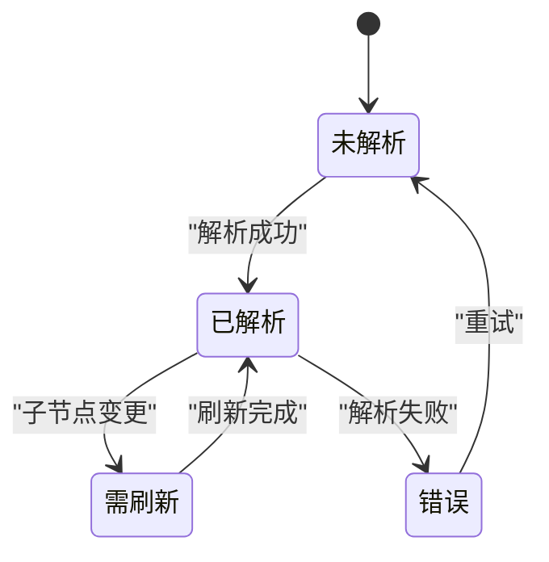
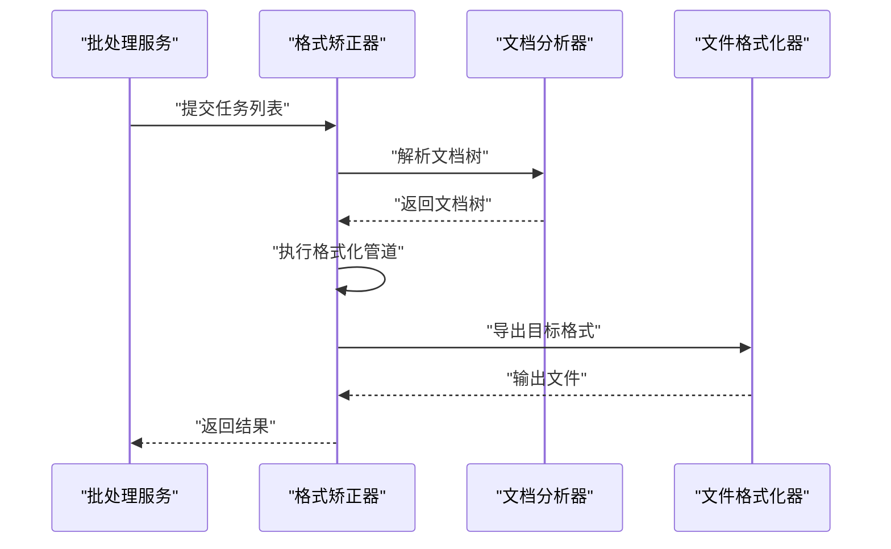
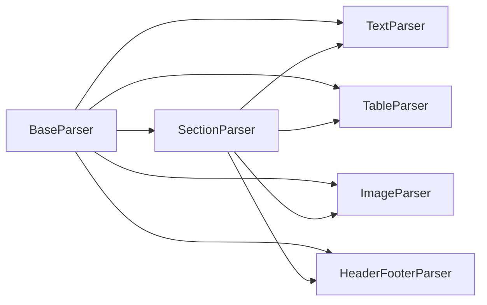

# 组合模式应用

<cite>
**本文引用的文件**   
- [src/paper_format_corrector/infrastructure/parsers/document_analyzer.py](file://src/paper_format_corrector/infrastructure/parsers/document_analyzer.py)
- [src/paper_format_corrector/infrastructure/parsers/modules/base_parser.py](file://src/paper_format_corrector/infrastructure/parsers/modules/base_parser.py)
- [src/paper_format_corrector/infrastructure/parsers/modules/text_parser.py](file://src/paper_format_corrector/infrastructure/parsers/modules/text_parser.py)
- [src/paper_format_corrector/infrastructure/parsers/modules/table_parser.py](file://src/paper_format_corrector/infrastructure/parsers/modules/table_parser.py)
- [src/paper_format_corrector/infrastructure/parsers/modules/image_parser.py](file://src/paper_format_corrector/infrastructure/parsers/modules/image_parser.py)
- [src/paper_format_corrector/infrastructure/parsers/modules/header_footer_parser.py](file://src/paper_format_corrector/infrastructure/parsers/modules/header_footer_parser.py)
- [src/paper_format_corrector/infrastructure/parsers/modules/section_parser.py](file://src/paper_format_corrector/infrastructure/parsers/modules/section_parser.py)
- [src/paper_format_corrector/infrastructure/parsers/section_types.py](file://src/paper_format_corrector/infrastructure/parsers/section_types.py)
- [src/paper_format_corrector/core/format_corrector.py](file://src/paper_format_corrector/core/format_corrector.py)
- [src/paper_format_corrector/application/services/batch_service.py](file://src/paper_format_corrector/application/services/batch_service.py)
- [src/paper_format_corrector/infrastructure/converters/file_formatter.py](file://src/paper_format_corrector/infrastructure/converters/file_formatter.py)
</cite>

## 目录
1. [简介](#简介)
2. [项目结构](#项目结构)
3. [核心组件](#核心组件)
4. [架构总览](#架构总览)
5. [详细组件分析](#详细组件分析)
6. [依赖关系分析](#依赖关系分析)
7. [性能考虑](#性能考虑)
8. [故障排查指南](#故障排查指南)
9. [结论](#结论)
10. [附录](#附录)

## 简介
本文件聚焦于组合模式在文档结构处理中的应用，围绕文档树构建、解析器模块组合与内容处理管道展开。我们将深入说明：
- 组合接口定义与统一操作契约
- 叶子节点（文本、表格、图片等）与组合节点（章节、页眉页脚、文档根）的实现差异
- 递归遍历算法与批量操作的实现机制
- 节点状态管理、变更传播策略与性能优化要点
- 通过具体代码路径示例展示如何构建复杂的文档处理树

## 项目结构
本项目采用分层与模块化组织方式，解析层位于 infrastructure/parsers 下，包含通用解析基类与各元素解析器；核心格式化流程位于 core 与 application 层；转换与导出位于 infrastructure/converters 与 exporters。组合模式主要体现在解析器模块的树形结构与遍历处理上。

图表来源
- [src/paper_format_corrector/infrastructure/parsers/document_analyzer.py](file://src/paper_format_corrector/infrastructure/parsers/document_analyzer.py)
- [src/paper_format_corrector/infrastructure/parsers/modules/base_parser.py](file://src/paper_format_corrector/infrastructure/parsers/modules/base_parser.py)
- [src/paper_format_corrector/infrastructure/parsers/modules/section_parser.py](file://src/paper_format_corrector/infrastructure/parsers/modules/section_parser.py)
- [src/paper_format_corrector/infrastructure/parsers/modules/text_parser.py](file://src/paper_format_corrector/infrastructure/parsers/modules/text_parser.py)
- [src/paper_format_corrector/infrastructure/parsers/modules/table_parser.py](file://src/paper_format_corrector/infrastructure/parsers/modules/table_parser.py)
- [src/paper_format_corrector/infrastructure/parsers/modules/image_parser.py](file://src/paper_format_corrector/infrastructure/parsers/modules/image_parser.py)
- [src/paper_format_corrector/infrastructure/parsers/modules/header_footer_parser.py](file://src/paper_format_corrector/infrastructure/parsers/modules/header_footer_parser.py)
- [src/paper_format_corrector/infrastructure/parsers/section_types.py](file://src/paper_format_corrector/infrastructure/parsers/section_types.py)
- [src/paper_format_corrector/core/format_corrector.py](file://src/paper_format_corrector/core/format_corrector.py)
- [src/paper_format_corrector/application/services/batch_service.py](file://src/paper_format_corrector/application/services/batch_service.py)
- [src/paper_format_corrector/infrastructure/converters/file_formatter.py](file://src/paper_format_corrector/infrastructure/converters/file_formatter.py)

章节来源
- [src/paper_format_corrector/infrastructure/parsers/document_analyzer.py](file://src/paper_format_corrector/infrastructure/parsers/document_analyzer.py)
- [src/paper_format_corrector/infrastructure/parsers/modules/base_parser.py](file://src/paper_format_corrector/infrastructure/parsers/modules/base_parser.py)
- [src/paper_format_corrector/infrastructure/parsers/modules/section_parser.py](file://src/paper_format_corrector/infrastructure/parsers/modules/section_parser.py)
- [src/paper_format_corrector/infrastructure/parsers/modules/text_parser.py](file://src/paper_format_corrector/infrastructure/parsers/modules/text_parser.py)
- [src/paper_format_corrector/infrastructure/parsers/modules/table_parser.py](file://src/paper_format_corrector/infrastructure/parsers/modules/table_parser.py)
- [src/paper_format_corrector/infrastructure/parsers/modules/image_parser.py](file://src/paper_format_corrector/infrastructure/parsers/modules/image_parser.py)
- [src/paper_format_corrector/infrastructure/parsers/modules/header_footer_parser.py](file://src/paper_format_corrector/infrastructure/parsers/modules/header_footer_parser.py)
- [src/paper_format_corrector/infrastructure/parsers/section_types.py](file://src/paper_format_corrector/infrastructure/parsers/section_types.py)
- [src/paper_format_corrector/core/format_corrector.py](file://src/paper_format_corrector/core/format_corrector.py)
- [src/paper_format_corrector/application/services/batch_service.py](file://src/paper_format_corrector/application/services/batch_service.py)
- [src/paper_format_corrector/infrastructure/converters/file_formatter.py](file://src/paper_format_corrector/infrastructure/converters/file_formatter.py)

## 核心组件
- 组合接口与基类：提供统一的解析与遍历接口，使叶子与组合节点可被一致对待。
- 组合节点：章节解析器负责聚合子节点（文本、表格、图片、页眉页脚），并协调其解析顺序与上下文传递。
- 叶子节点：文本、表格、图片、页眉页脚解析器各自实现具体的内容提取与属性设置。
- 文档分析器：作为顶层组合节点，负责整篇文档的构建、调度与结果汇总。
- 格式矫正器与应用服务：驱动解析与格式化流程，支持批量任务编排。

章节来源
- [src/paper_format_corrector/infrastructure/parsers/modules/base_parser.py](file://src/paper_format_corrector/infrastructure/parsers/modules/base_parser.py)
- [src/paper_format_corrector/infrastructure/parsers/modules/section_parser.py](file://src/paper_format_corrector/infrastructure/parsers/modules/section_parser.py)
- [src/paper_format_corrector/infrastructure/parsers/document_analyzer.py](file://src/paper_format_corrector/infrastructure/parsers/document_analyzer.py)
- [src/paper_format_corrector/core/format_corrector.py](file://src/paper_format_corrector/core/format_corrector.py)
- [src/paper_format_corrector/application/services/batch_service.py](file://src/paper_format_corrector/application/services/batch_service.py)

## 架构总览
下图展示了从应用层到解析层的调用链与数据流，体现组合模式在文档树构建中的关键作用。

图表来源
- [src/paper_format_corrector/application/services/batch_service.py](file://src/paper_format_corrector/application/services/batch_service.py)
- [src/paper_format_corrector/core/format_corrector.py](file://src/paper_format_corrector/core/format_corrector.py)
- [src/paper_format_corrector/infrastructure/parsers/document_analyzer.py](file://src/paper_format_corrector/infrastructure/parsers/document_analyzer.py)
- [src/paper_format_corrector/infrastructure/parsers/modules/section_parser.py](file://src/paper_format_corrector/infrastructure/parsers/modules/section_parser.py)
- [src/paper_format_corrector/infrastructure/parsers/modules/text_parser.py](file://src/paper_format_corrector/infrastructure/parsers/modules/text_parser.py)
- [src/paper_format_corrector/infrastructure/parsers/modules/table_parser.py](file://src/paper_format_corrector/infrastructure/parsers/modules/table_parser.py)
- [src/paper_format_corrector/infrastructure/parsers/modules/image_parser.py](file://src/paper_format_corrector/infrastructure/parsers/modules/image_parser.py)
- [src/paper_format_corrector/infrastructure/parsers/modules/header_footer_parser.py](file://src/paper_format_corrector/infrastructure/parsers/modules/header_footer_parser.py)

## 详细组件分析

### 组合接口与基类设计
- 统一接口：所有解析器均暴露一致的解析入口与遍历方法，便于组合节点以相同方式调度子节点。
- 上下文传递：解析过程中共享上下文（如样式、编号、引用信息），确保跨节点的一致性。
- 错误隔离：各解析器内部捕获异常并上报，避免单个节点失败导致整体崩溃。

图表来源
- [src/paper_format_corrector/infrastructure/parsers/modules/base_parser.py](file://src/paper_format_corrector/infrastructure/parsers/modules/base_parser.py)
- [src/paper_format_corrector/infrastructure/parsers/modules/section_parser.py](file://src/paper_format_corrector/infrastructure/parsers/modules/section_parser.py)
- [src/paper_format_corrector/infrastructure/parsers/modules/text_parser.py](file://src/paper_format_corrector/infrastructure/parsers/modules/text_parser.py)
- [src/paper_format_corrector/infrastructure/parsers/modules/table_parser.py](file://src/paper_format_corrector/infrastructure/parsers/modules/table_parser.py)
- [src/paper_format_corrector/infrastructure/parsers/modules/image_parser.py](file://src/paper_format_corrector/infrastructure/parsers/modules/image_parser.py)
- [src/paper_format_corrector/infrastructure/parsers/modules/header_footer_parser.py](file://src/paper_format_corrector/infrastructure/parsers/modules/header_footer_parser.py)

章节来源
- [src/paper_format_corrector/infrastructure/parsers/modules/base_parser.py](file://src/paper_format_corrector/infrastructure/parsers/modules/base_parser.py)
- [src/paper_format_corrector/infrastructure/parsers/modules/section_parser.py](file://src/paper_format_corrector/infrastructure/parsers/modules/section_parser.py)
- [src/paper_format_corrector/infrastructure/parsers/modules/text_parser.py](file://src/paper_format_corrector/infrastructure/parsers/modules/text_parser.py)
- [src/paper_format_corrector/infrastructure/parsers/modules/table_parser.py](file://src/paper_format_corrector/infrastructure/parsers/modules/table_parser.py)
- [src/paper_format_corrector/infrastructure/parsers/modules/image_parser.py](file://src/paper_format_corrector/infrastructure/parsers/modules/image_parser.py)
- [src/paper_format_corrector/infrastructure/parsers/modules/header_footer_parser.py](file://src/paper_format_corrector/infrastructure/parsers/modules/header_footer_parser.py)

### 文档树构建与解析器组合
- 文档分析器作为根节点，按章节类型识别与拆分，创建章节组合节点。
- 章节解析器根据内容类型选择对应的叶子解析器进行解析，并将结果加入子节点列表。
- 解析完成后，文档分析器汇总各章节节点，形成完整的文档树。

图表来源
- [src/paper_format_corrector/infrastructure/parsers/document_analyzer.py](file://src/paper_format_corrector/infrastructure/parsers/document_analyzer.py)
- [src/paper_format_corrector/infrastructure/parsers/modules/section_parser.py](file://src/paper_format_corrector/infrastructure/parsers/modules/section_parser.py)
- [src/paper_format_corrector/infrastructure/parsers/section_types.py](file://src/paper_format_corrector/infrastructure/parsers/section_types.py)

章节来源
- [src/paper_format_corrector/infrastructure/parsers/document_analyzer.py](file://src/paper_format_corrector/infrastructure/parsers/document_analyzer.py)
- [src/paper_format_corrector/infrastructure/parsers/modules/section_parser.py](file://src/paper_format_corrector/infrastructure/parsers/modules/section_parser.py)
- [src/paper_format_corrector/infrastructure/parsers/section_types.py](file://src/paper_format_corrector/infrastructure/parsers/section_types.py)

### 递归遍历算法与批量操作机制
- 递归遍历：组合节点对子节点进行深度优先遍历，叶子节点直接执行访问者逻辑。
- 批量操作：通过统一接口对整棵树执行批量更新（如样式修正、编号重排、引用补全）。
- 变更传播：当某个节点状态变化时，向上通知父节点，必要时触发全局重建或增量更新。

图表来源
- [src/paper_format_corrector/infrastructure/parsers/modules/base_parser.py](file://src/paper_format_corrector/infrastructure/parsers/modules/base_parser.py)
- [src/paper_format_corrector/infrastructure/parsers/modules/section_parser.py](file://src/paper_format_corrector/infrastructure/parsers/modules/section_parser.py)

章节来源
- [src/paper_format_corrector/infrastructure/parsers/modules/base_parser.py](file://src/paper_format_corrector/infrastructure/parsers/modules/base_parser.py)
- [src/paper_format_corrector/infrastructure/parsers/modules/section_parser.py](file://src/paper_format_corrector/infrastructure/parsers/modules/section_parser.py)

### 节点状态管理与变更传播
- 状态字段：节点维护自身状态（如是否已解析、是否需要重新计算、版本号等）。
- 脏标记：当子节点变更时，父节点标记为“脏”，并在下一次遍历时按需刷新。
- 事件通知：可选的事件总线用于跨节点广播变更，便于外部监听与联动更新。

图表来源
- [src/paper_format_corrector/infrastructure/parsers/modules/base_parser.py](file://src/paper_format_corrector/infrastructure/parsers/modules/base_parser.py)
- [src/paper_format_corrector/infrastructure/parsers/modules/section_parser.py](file://src/paper_format_corrector/infrastructure/parsers/modules/section_parser.py)

章节来源
- [src/paper_format_corrector/infrastructure/parsers/modules/base_parser.py](file://src/paper_format_corrector/infrastructure/parsers/modules/base_parser.py)
- [src/paper_format_corrector/infrastructure/parsers/modules/section_parser.py](file://src/paper_format_corrector/infrastructure/parsers/modules/section_parser.py)

### 内容处理管道与格式化集成
- 管道阶段：解析阶段生成文档树后，进入格式化阶段，依次执行样式修正、编号处理、交叉引用补全等。
- 转换器：文件格式化器将文档树转换为目标格式（如 DOCX、PDF、LaTeX）。
- 批处理：批处理服务编排多个文档的任务队列，提升吞吐能力。

图表来源
- [src/paper_format_corrector/application/services/batch_service.py](file://src/paper_format_corrector/application/services/batch_service.py)
- [src/paper_format_corrector/core/format_corrector.py](file://src/paper_format_corrector/core/format_corrector.py)
- [src/paper_format_corrector/infrastructure/converters/file_formatter.py](file://src/paper_format_corrector/infrastructure/converters/file_formatter.py)

章节来源
- [src/paper_format_corrector/application/services/batch_service.py](file://src/paper_format_corrector/application/services/batch_service.py)
- [src/paper_format_corrector/core/format_corrector.py](file://src/paper_format_corrector/core/format_corrector.py)
- [src/paper_format_corrector/infrastructure/converters/file_formatter.py](file://src/paper_format_corrector/infrastructure/converters/file_formatter.py)

## 依赖关系分析
- 低耦合：解析器之间通过统一接口交互，组合节点仅依赖抽象接口，降低耦合度。
- 高内聚：每个解析器专注于单一元素类型的解析逻辑，职责清晰。
- 可扩展性：新增元素类型只需实现统一接口并注册到组合节点，无需修改既有逻辑。

图表来源
- [src/paper_format_corrector/infrastructure/parsers/modules/base_parser.py](file://src/paper_format_corrector/infrastructure/parsers/modules/base_parser.py)
- [src/paper_format_corrector/infrastructure/parsers/modules/section_parser.py](file://src/paper_format_corrector/infrastructure/parsers/modules/section_parser.py)
- [src/paper_format_corrector/infrastructure/parsers/modules/text_parser.py](file://src/paper_format_corrector/infrastructure/parsers/modules/text_parser.py)
- [src/paper_format_corrector/infrastructure/parsers/modules/table_parser.py](file://src/paper_format_corrector/infrastructure/parsers/modules/table_parser.py)
- [src/paper_format_corrector/infrastructure/parsers/modules/image_parser.py](file://src/paper_format_corrector/infrastructure/parsers/modules/image_parser.py)
- [src/paper_format_corrector/infrastructure/parsers/modules/header_footer_parser.py](file://src/paper_format_corrector/infrastructure/parsers/modules/header_footer_parser.py)

章节来源
- [src/paper_format_corrector/infrastructure/parsers/modules/base_parser.py](file://src/paper_format_corrector/infrastructure/parsers/modules/base_parser.py)
- [src/paper_format_corrector/infrastructure/parsers/modules/section_parser.py](file://src/paper_format_corrector/infrastructure/parsers/modules/section_parser.py)
- [src/paper_format_corrector/infrastructure/parsers/modules/text_parser.py](file://src/paper_format_corrector/infrastructure/parsers/modules/text_parser.py)
- [src/paper_format_corrector/infrastructure/parsers/modules/table_parser.py](file://src/paper_format_corrector/infrastructure/parsers/modules/table_parser.py)
- [src/paper_format_corrector/infrastructure/parsers/modules/image_parser.py](file://src/paper_format_corrector/infrastructure/parsers/modules/image_parser.py)
- [src/paper_format_corrector/infrastructure/parsers/modules/header_footer_parser.py](file://src/paper_format_corrector/infrastructure/parsers/modules/header_footer_parser.py)

## 性能考虑
- 惰性解析：仅在需要时解析子节点，减少初始构建开销。
- 增量更新：基于脏标记的局部刷新，避免全树重建。
- 并行处理：批处理服务可对多文档并行执行，提高吞吐。
- 内存优化：大文档分块解析与流式处理，降低峰值内存占用。

[本节为通用指导，不直接分析具体文件]

## 故障排查指南
- 常见错误：
  - 解析失败：检查对应解析器的输入校验与异常捕获逻辑。
  - 状态不一致：确认脏标记与刷新流程是否正确触发。
  - 循环依赖：审查组合节点的子节点注册逻辑，避免环状引用。
- 调试建议：
  - 启用详细日志，记录节点创建与遍历过程。
  - 使用最小复现用例定位问题节点。
  - 逐步禁用子解析器以隔离问题范围。

章节来源
- [src/paper_format_corrector/infrastructure/parsers/modules/base_parser.py](file://src/paper_format_corrector/infrastructure/parsers/modules/base_parser.py)
- [src/paper_format_corrector/infrastructure/parsers/modules/section_parser.py](file://src/paper_format_corrector/infrastructure/parsers/modules/section_parser.py)

## 结论
组合模式在本项目中有效支撑了层次化文档结构的建模与处理。通过统一的解析接口、清晰的组合与叶子节点分工、以及完善的遍历与批量操作机制，系统具备良好的可扩展性与可维护性。结合状态管理与变更传播策略，能够在保证正确性的同时实现高效的增量更新与性能优化。

[本节为总结性内容，不直接分析具体文件]

## 附录
- 代码示例路径（构建复杂文档处理树）：
  - 文档分析器入口与章节拆分：[document_analyzer.py](file://src/paper_format_corrector/infrastructure/parsers/document_analyzer.py)
  - 章节组合节点与子节点管理：[section_parser.py](file://src/paper_format_corrector/infrastructure/parsers/modules/section_parser.py)
  - 文本、表格、图片、页眉页脚解析器实现：
    - [text_parser.py](file://src/paper_format_corrector/infrastructure/parsers/modules/text_parser.py)
    - [table_parser.py](file://src/paper_format_corrector/infrastructure/parsers/modules/table_parser.py)
    - [image_parser.py](file://src/paper_format_corrector/infrastructure/parsers/modules/image_parser.py)
    - [header_footer_parser.py](file://src/paper_format_corrector/infrastructure/parsers/modules/header_footer_parser.py)
  - 章节类型定义与识别规则：[section_types.py](file://src/paper_format_corrector/infrastructure/parsers/section_types.py)
  - 格式化管道与导出：
    - [format_corrector.py](file://src/paper_format_corrector/core/format_corrector.py)
    - [file_formatter.py](file://src/paper_format_corrector/infrastructure/converters/file_formatter.py)
  - 批处理编排：[batch_service.py](file://src/paper_format_corrector/application/services/batch_service.py)

[本节为参考路径汇总，不直接分析具体文件]