# 装饰器模式应用

<cite>
**本文引用的文件**   
- [src/paper_format_corrector/quality/rule_engine.py](file://src/paper_format_corrector/quality/rule_engine.py)
- [src/paper_format_corrector/infrastructure/parsers/rule_parser.py](file://src/paper_format_corrector/infrastructure/parsers/rule_parser.py)
- [src/paper_format_corrector/infra/logger.py](file://src/paper_format_corrector/infra/logger.py)
- [src/paper_format_corrector/core/format_corrector.py](file://src/paper_format_corrector/core/format_corrector.py)
- [src/paper_format_corrector/application/services/report_service.py](file://src/paper_format_corrector/application/services/report_service.py)
- [src/paper_format_corrector/infrastructure/parsers/document_analyzer.py](file://src/paper_format_corrector/infrastructure/parsers/document_analyzer.py)
- [src/paper_format_corrector/quality/diff_reporter.py](file://src/paper_format_corrector/quality/diff_reporter.py)
</cite>

## 目录
1. [简介](#简介)
2. [项目结构](#项目结构)
3. [核心组件](#核心组件)
4. [架构总览](#架构总览)
5. [详细组件分析](#详细组件分析)
6. [依赖分析](#依赖分析)
7. [性能考虑](#性能考虑)
8. [故障排查指南](#故障排查指南)
9. [结论](#结论)
10. [附录](#附录)

## 简介
本文件聚焦于装饰器模式在本项目中的工程化落地，围绕规则引擎与解析器的增强场景展开，系统阐述：
- 装饰器接口定义与职责边界
- 具体装饰器实现（质量检查、验证、日志记录）
- 装饰链的构建与执行顺序控制
- 参数传递与异常处理机制
- 在不修改原有代码的前提下扩展功能的实践优势
- 自定义装饰器的创建方法与最佳实践

## 项目结构
本项目采用分层与领域驱动相结合的组织方式。与装饰器模式密切相关的模块主要分布在以下位置：
- quality：规则引擎与质量评估相关能力
- infrastructure/parsers：文档解析与规则解析等基础设施
- infra：通用基础设施（如日志）
- core：核心格式化流程编排
- application/services：面向应用的编排服务

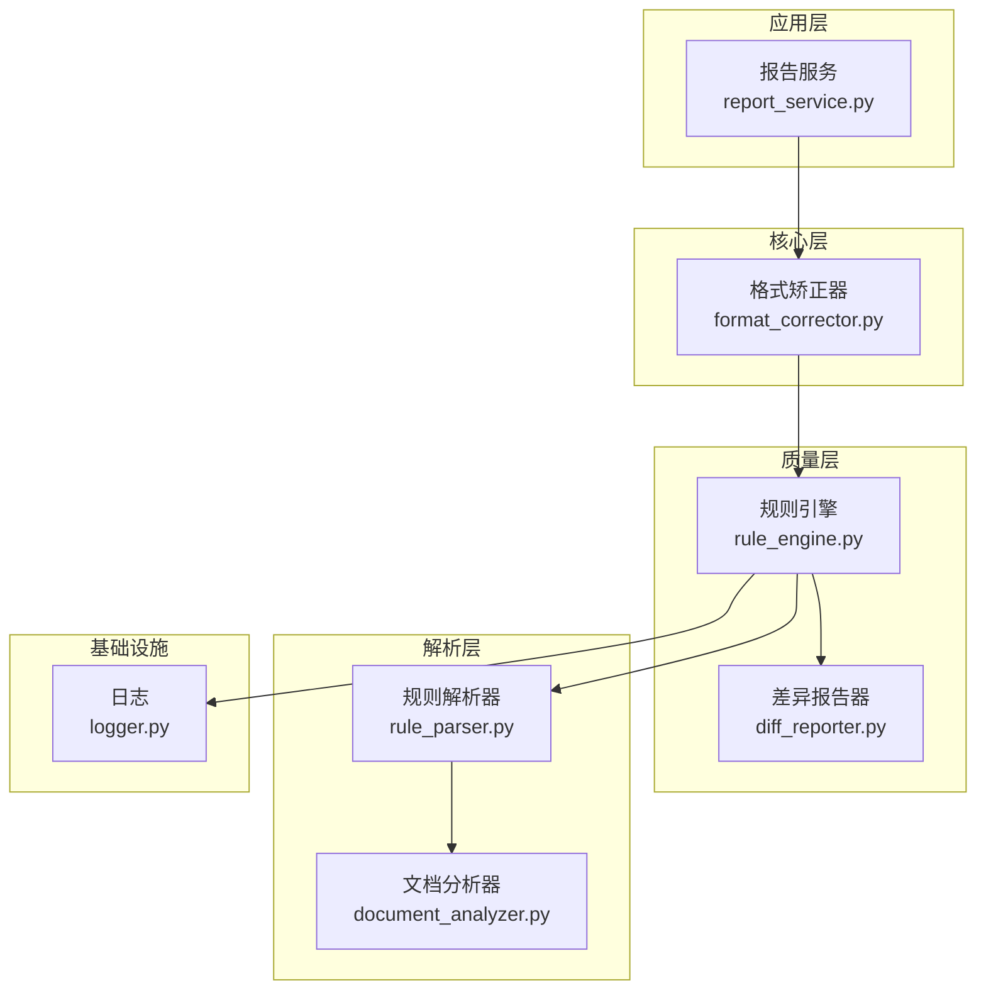

图表来源
- [src/paper_format_corrector/application/services/report_service.py](file://src/paper_format_corrector/application/services/report_service.py)
- [src/paper_format_corrector/core/format_corrector.py](file://src/paper_format_corrector/core/format_corrector.py)
- [src/paper_format_corrector/quality/rule_engine.py](file://src/paper_format_corrector/quality/rule_engine.py)
- [src/paper_format_corrector/infrastructure/parsers/rule_parser.py](file://src/paper_format_corrector/infrastructure/parsers/rule_parser.py)
- [src/paper_format_corrector/infrastructure/parsers/document_analyzer.py](file://src/paper_format_corrector/infrastructure/parsers/document_analyzer.py)
- [src/paper_format_corrector/quality/diff_reporter.py](file://src/paper_format_corrector/quality/diff_reporter.py)
- [src/paper_format_corrector/infra/logger.py](file://src/paper_format_corrector/infra/logger.py)

章节来源
- [src/paper_format_corrector/application/services/report_service.py](file://src/paper_format_corrector/application/services/report_service.py)
- [src/paper_format_corrector/core/format_corrector.py](file://src/paper_format_corrector/core/format_corrector.py)
- [src/paper_format_corrector/quality/rule_engine.py](file://src/paper_format_corrector/quality/rule_engine.py)
- [src/paper_format_corrector/infrastructure/parsers/rule_parser.py](file://src/paper_format_corrector/infrastructure/parsers/rule_parser.py)
- [src/paper_format_corrector/infrastructure/parsers/document_analyzer.py](file://src/paper_format_corrector/infrastructure/parsers/document_analyzer.py)
- [src/paper_format_corrector/quality/diff_reporter.py](file://src/paper_format_corrector/quality/diff_reporter.py)
- [src/paper_format_corrector/infra/logger.py](file://src/paper_format_corrector/infra/logger.py)

## 核心组件
本节从“接口—实现—组合”的角度梳理装饰器模式的核心构件：
- 装饰器接口：定义统一的调用契约，确保被装饰对象与装饰器之间可互换
- 具体装饰器：对目标行为进行横切增强（如日志、校验、度量、缓存等）
- 装饰链：将多个装饰器按序组合，形成可插拔的执行管线
- 上下文与参数：在装饰链中安全地传递请求上下文、配置项与中间结果
- 异常处理：在装饰层统一捕获、转换与上报异常，保证链路健壮性

为便于理解，下面给出一个概念性的类图（不直接映射到具体源码文件）：

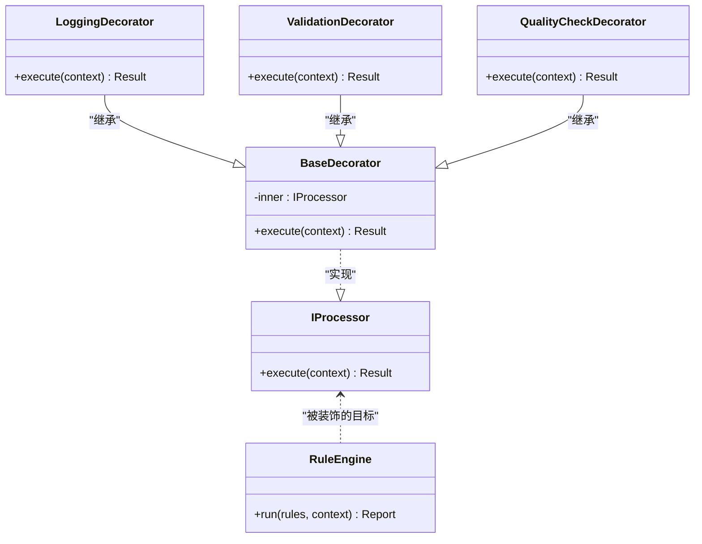

说明
- 通过统一接口隔离变化，使新增装饰器无需改动既有逻辑
- 装饰器以“包裹”的方式在调用前后注入横切关注点
- 装饰链的顺序决定横切行为的生效时机与范围

[本节为概念性说明，未直接分析具体文件，故无章节来源]

## 架构总览
下图展示装饰器模式在规则引擎与解析器增强中的整体协作关系。入口服务组装装饰链，规则引擎作为核心处理器被多层装饰器包裹，最终由解析器完成数据读取与规则匹配。

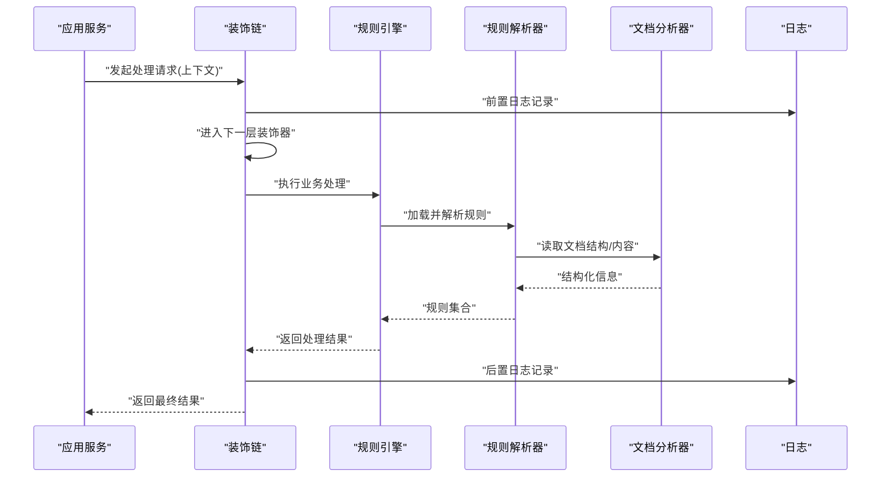

图表来源
- [src/paper_format_corrector/application/services/report_service.py](file://src/paper_format_corrector/application/services/report_service.py)
- [src/paper_format_corrector/quality/rule_engine.py](file://src/paper_format_corrector/quality/rule_engine.py)
- [src/paper_format_corrector/infrastructure/parsers/rule_parser.py](file://src/paper_format_corrector/infrastructure/parsers/rule_parser.py)
- [src/paper_format_corrector/infrastructure/parsers/document_analyzer.py](file://src/paper_format_corrector/infrastructure/parsers/document_analyzer.py)
- [src/paper_format_corrector/infra/logger.py](file://src/paper_format_corrector/infra/logger.py)

## 详细组件分析

### 规则引擎与装饰器接口
- 角色定位
  - 规则引擎负责根据解析出的规则对文档进行分析与评分，是装饰链中被增强的核心处理器
  - 装饰器接口定义了统一的执行契约，使得日志、校验、质量检查等横切逻辑可以透明地插入
- 关键设计要点
  - 接口最小化：仅暴露必要的执行方法，降低耦合
  - 上下文传递：在装饰链中携带请求上下文、配置与中间结果
  - 幂等与可重试：在装饰层提供重试或补偿策略（可选）
  - 错误收敛：在装饰层统一捕获并转换为业务友好的异常类型

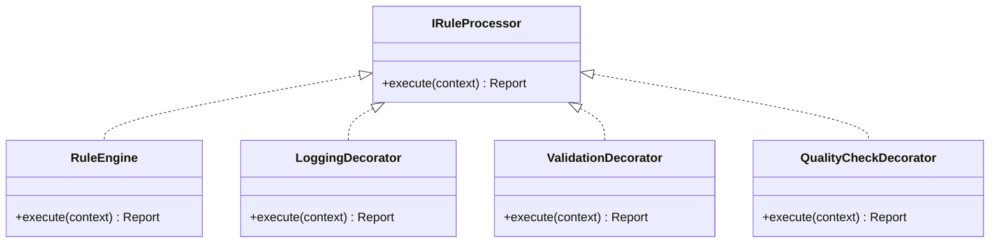

图表来源
- [src/paper_format_corrector/quality/rule_engine.py](file://src/paper_format_corrector/quality/rule_engine.py)

章节来源
- [src/paper_format_corrector/quality/rule_engine.py](file://src/paper_format_corrector/quality/rule_engine.py)

### 日志记录装饰器
- 职责
  - 在调用前后记录入参、耗时、返回值摘要与异常堆栈
  - 支持按级别输出，避免在生产环境产生过多噪音
- 实现要点
  - 使用统一的日志门面，屏蔽底层实现差异
  - 对敏感字段进行脱敏处理
  - 在异常分支补充上下文快照，便于问题定位

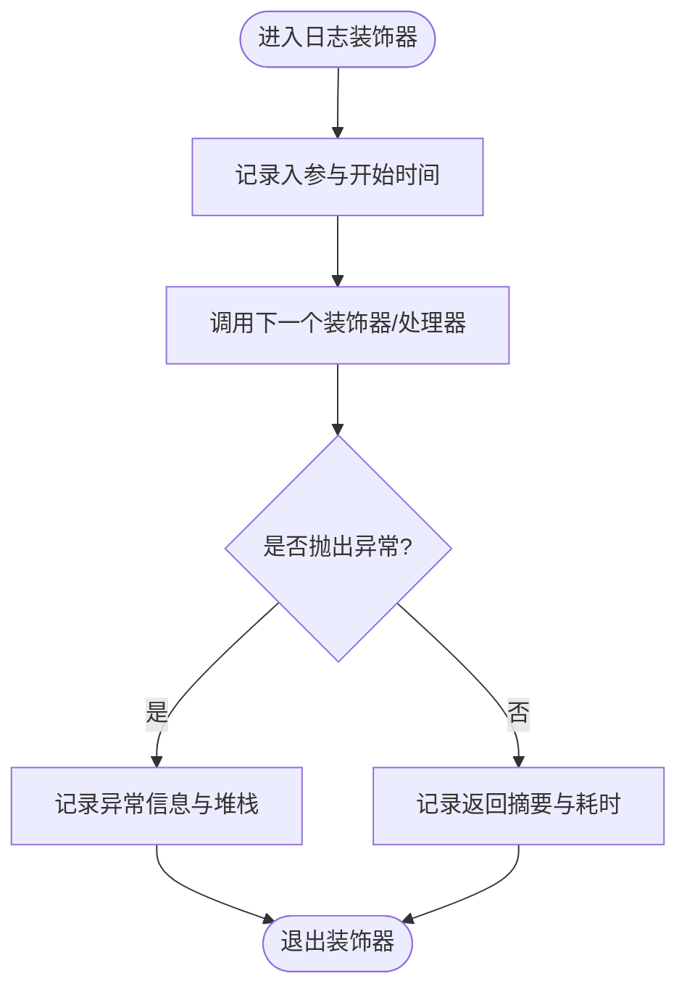

图表来源
- [src/paper_format_corrector/infra/logger.py](file://src/paper_format_corrector/infra/logger.py)

章节来源
- [src/paper_format_corrector/infra/logger.py](file://src/paper_format_corrector/infra/logger.py)

### 验证装饰器
- 职责
  - 在进入核心处理前对输入上下文进行合法性校验
  - 对缺失必填项、非法值、越界参数等进行快速失败
- 实现要点
  - 将校验规则与业务逻辑解耦，便于复用与测试
  - 收集多条校验错误，一次性返回，提升用户体验
  - 与日志装饰器配合，记录校验失败的上下文

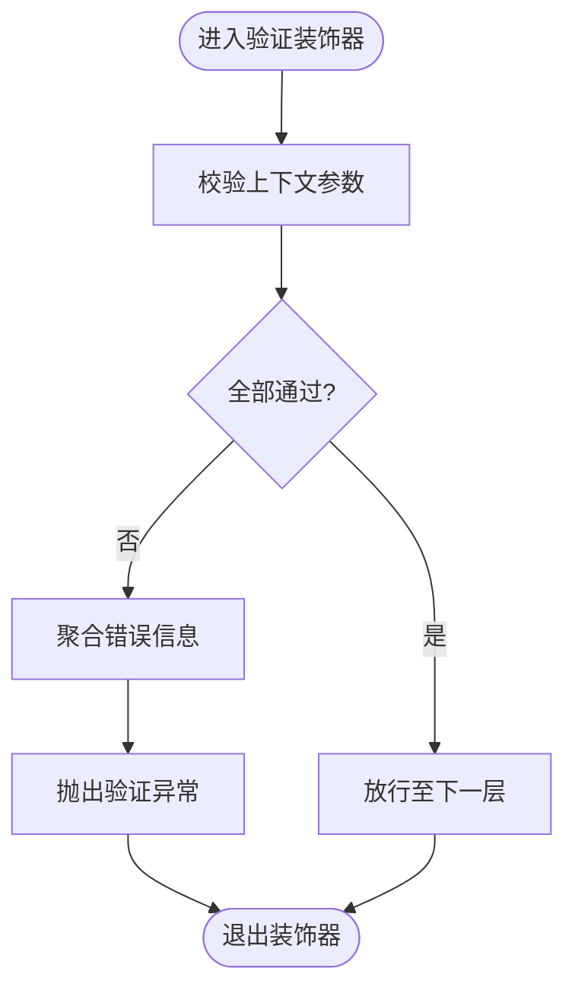

图表来源
- [src/paper_format_corrector/quality/rule_engine.py](file://src/paper_format_corrector/quality/rule_engine.py)

章节来源
- [src/paper_format_corrector/quality/rule_engine.py](file://src/paper_format_corrector/quality/rule_engine.py)

### 质量检查装饰器
- 职责
  - 在核心处理完成后对结果进行二次审视，例如一致性检查、阈值判定、回归对比
  - 生成质量报告或触发告警
- 实现要点
  - 与差异报告器协作，计算变更集与影响面
  - 支持开关式启用，便于灰度与回滚
  - 与日志装饰器联动，输出质量指标与趋势

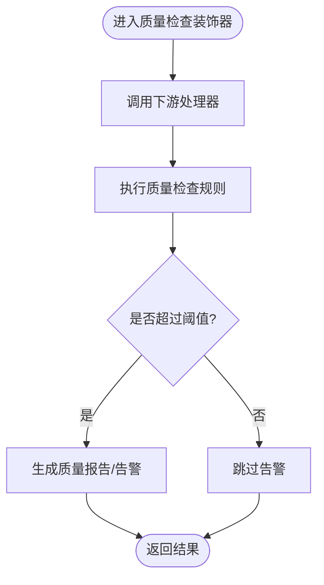

图表来源
- [src/paper_format_corrector/quality/rule_engine.py](file://src/paper_format_corrector/quality/rule_engine.py)
- [src/paper_format_corrector/quality/diff_reporter.py](file://src/paper_format_corrector/quality/diff_reporter.py)

章节来源
- [src/paper_format_corrector/quality/rule_engine.py](file://src/paper_format_corrector/quality/rule_engine.py)
- [src/paper_format_corrector/quality/diff_reporter.py](file://src/paper_format_corrector/quality/diff_reporter.py)

### 解析器增强（规则解析与文档分析）
- 角色定位
  - 规则解析器负责将外部规则描述转化为可执行的规则集合
  - 文档分析器提供文档结构与内容的抽象视图，供规则匹配使用
- 装饰器增强点
  - 在解析阶段增加缓存装饰器，减少重复解析开销
  - 在分析阶段增加审计装饰器，记录访问路径与命中规则
  - 在异常分支增加降级策略，保障可用性

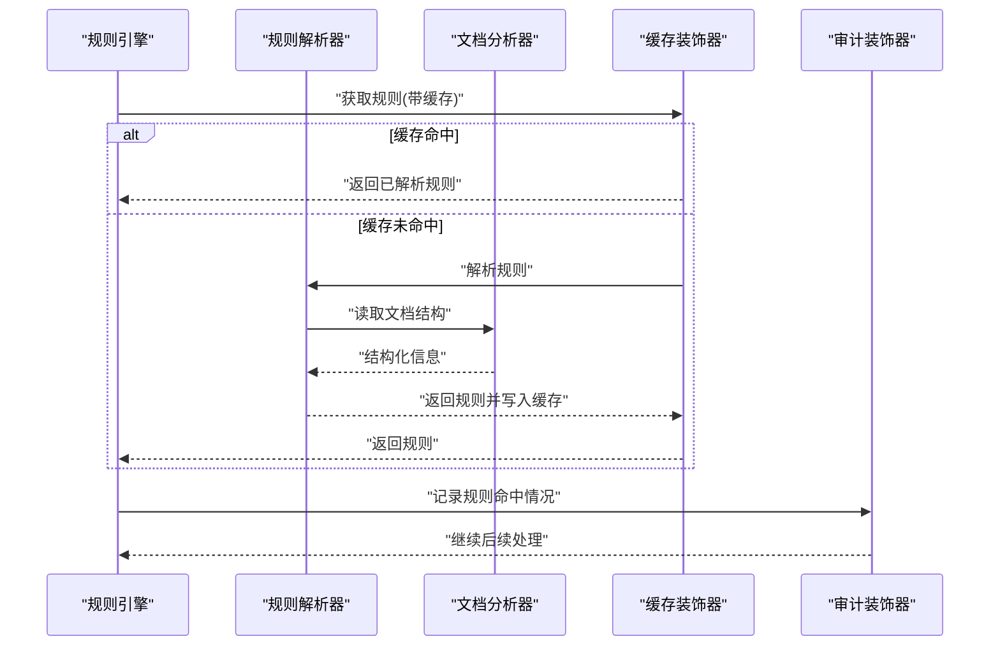

图表来源
- [src/paper_format_corrector/infrastructure/parsers/rule_parser.py](file://src/paper_format_corrector/infrastructure/parsers/rule_parser.py)
- [src/paper_format_corrector/infrastructure/parsers/document_analyzer.py](file://src/paper_format_corrector/infrastructure/parsers/document_analyzer.py)

章节来源
- [src/paper_format_corrector/infrastructure/parsers/rule_parser.py](file://src/paper_format_corrector/infrastructure/parsers/rule_parser.py)
- [src/paper_format_corrector/infrastructure/parsers/document_analyzer.py](file://src/paper_format_corrector/infrastructure/parsers/document_analyzer.py)

### 装饰链构建与顺序控制
- 构建原则
  - 外层装饰器先执行，内层后执行；外层负责横切关注点，内层专注核心逻辑
  - 典型顺序：日志 -> 验证 -> 质量检查 -> 核心处理器
- 动态装配
  - 通过配置或工厂方法动态组装装饰链，支持运行时切换
  - 提供默认链与扩展链，满足不同场景需求
- 参数传递
  - 使用不可变上下文对象承载参数，避免副作用
  - 在装饰器间共享中间结果，减少重复计算

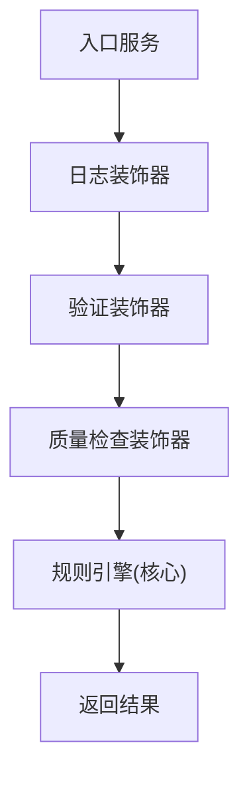

图表来源
- [src/paper_format_corrector/application/services/report_service.py](file://src/paper_format_corrector/application/services/report_service.py)
- [src/paper_format_corrector/core/format_corrector.py](file://src/paper_format_corrector/core/format_corrector.py)
- [src/paper_format_corrector/quality/rule_engine.py](file://src/paper_format_corrector/quality/rule_engine.py)

章节来源
- [src/paper_format_corrector/application/services/report_service.py](file://src/paper_format_corrector/application/services/report_service.py)
- [src/paper_format_corrector/core/format_corrector.py](file://src/paper_format_corrector/core/format_corrector.py)
- [src/paper_format_corrector/quality/rule_engine.py](file://src/paper_format_corrector/quality/rule_engine.py)

### 自定义装饰器示例（步骤指引）
以下为创建自定义装饰器的步骤指引（不包含具体代码片段）：
- 定义装饰器接口：明确 execute(context) 的输入输出约定
- 实现基础装饰器：封装通用逻辑（如计时、异常包装）
- 编写具体装饰器：在调用前后注入横切逻辑（如权限、限流、缓存）
- 组装装饰链：在入口服务或工厂中按顺序组合装饰器
- 单元测试：覆盖正常路径、异常路径与边界条件

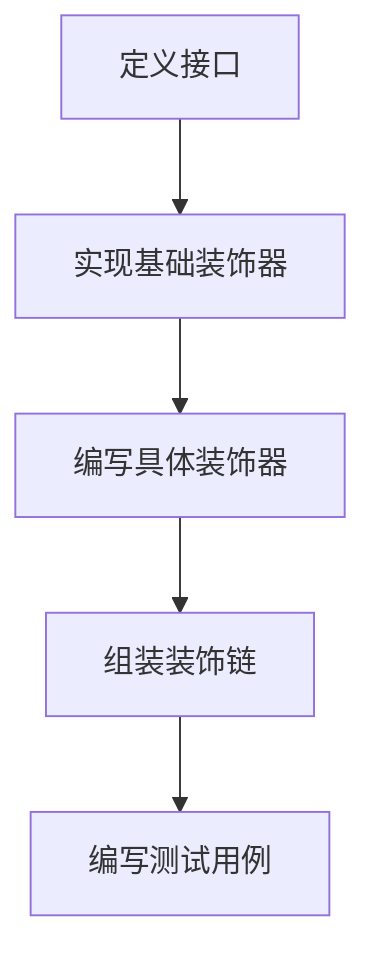

[本节为概念性说明，未直接分析具体文件，故无章节来源]

## 依赖分析
装饰器模式在本项目中形成了清晰的依赖方向：上层服务依赖核心处理器，核心处理器被多个装饰器包裹，解析器与基础设施位于更下层。

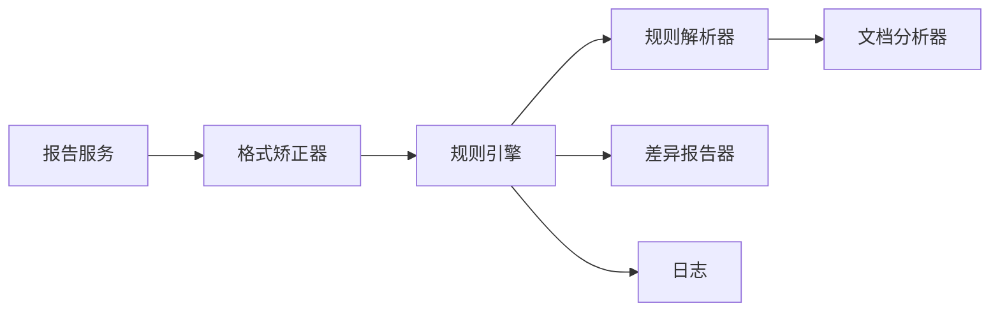

图表来源
- [src/paper_format_corrector/application/services/report_service.py](file://src/paper_format_corrector/application/services/report_service.py)
- [src/paper_format_corrector/core/format_corrector.py](file://src/paper_format_corrector/core/format_corrector.py)
- [src/paper_format_corrector/quality/rule_engine.py](file://src/paper_format_corrector/quality/rule_engine.py)
- [src/paper_format_corrector/infrastructure/parsers/rule_parser.py](file://src/paper_format_corrector/infrastructure/parsers/rule_parser.py)
- [src/paper_format_corrector/infrastructure/parsers/document_analyzer.py](file://src/paper_format_corrector/infrastructure/parsers/document_analyzer.py)
- [src/paper_format_corrector/quality/diff_reporter.py](file://src/paper_format_corrector/quality/diff_reporter.py)
- [src/paper_format_corrector/infra/logger.py](file://src/paper_format_corrector/infra/logger.py)

章节来源
- [src/paper_format_corrector/application/services/report_service.py](file://src/paper_format_corrector/application/services/report_service.py)
- [src/paper_format_corrector/core/format_corrector.py](file://src/paper_format_corrector/core/format_corrector.py)
- [src/paper_format_corrector/quality/rule_engine.py](file://src/paper_format_corrector/quality/rule_engine.py)
- [src/paper_format_corrector/infrastructure/parsers/rule_parser.py](file://src/paper_format_corrector/infrastructure/parsers/rule_parser.py)
- [src/paper_format_corrector/infrastructure/parsers/document_analyzer.py](file://src/paper_format_corrector/infrastructure/parsers/document_analyzer.py)
- [src/paper_format_corrector/quality/diff_reporter.py](file://src/paper_format_corrector/quality/diff_reporter.py)
- [src/paper_format_corrector/infra/logger.py](file://src/paper_format_corrector/infra/logger.py)

## 性能考虑
- 装饰链长度控制：避免过深嵌套导致调用栈过长与额外开销
- 短路优化：在验证装饰器中尽早失败，减少无效处理
- 缓存策略：在解析阶段引入缓存装饰器，降低重复解析成本
- 异步与批处理：对耗时操作采用异步或批量处理，提高吞吐
- 日志采样：生产环境开启采样日志，避免IO瓶颈

[本节为通用指导，未直接分析具体文件，故无章节来源]

## 故障排查指南
- 常见问题
  - 装饰链顺序错误：导致前置校验未生效或后置日志缺失
  - 上下文污染：装饰器修改了共享状态，引发偶发问题
  - 异常吞没：装饰器捕获异常后未正确传播或记录
- 定位建议
  - 在日志装饰器中输出完整上下文与耗时
  - 在验证装饰器中聚合所有错误，便于一次性修复
  - 在质量检查装饰器中输出差异报告，辅助回归定位
- 恢复策略
  - 提供降级路径：当某装饰器失败时，跳过该层并继续处理
  - 熔断与限流：在高负载下自动关闭非关键装饰器

章节来源
- [src/paper_format_corrector/infra/logger.py](file://src/paper_format_corrector/infra/logger.py)
- [src/paper_format_corrector/quality/diff_reporter.py](file://src/paper_format_corrector/quality/diff_reporter.py)

## 结论
通过将装饰器模式应用于规则引擎与解析器增强，项目在保持核心逻辑稳定的同时，获得了良好的可扩展性与可观测性。日志、验证、质量检查等横切关注点以声明式方式组合，显著降低了耦合度与维护成本。未来可在现有基础上进一步引入缓存、限流、审计等装饰器，持续完善系统的弹性与治理能力。

[本节为总结性内容，未直接分析具体文件，故无章节来源]

## 附录
- 术语表
  - 装饰器：在不修改原对象的情况下，动态为其添加行为的包装对象
  - 装饰链：多个装饰器按序组合形成的执行管线
  - 上下文：在装饰链中传递的请求参数与中间结果
- 参考路径
  - 规则引擎与质量检查：[src/paper_format_corrector/quality/rule_engine.py](file://src/paper_format_corrector/quality/rule_engine.py)
  - 规则解析与文档分析：[src/paper_format_corrector/infrastructure/parsers/rule_parser.py](file://src/paper_format_corrector/infrastructure/parsers/rule_parser.py), [src/paper_format_corrector/infrastructure/parsers/document_analyzer.py](file://src/paper_format_corrector/infrastructure/parsers/document_analyzer.py)
  - 日志基础设施：[src/paper_format_corrector/infra/logger.py](file://src/paper_format_corrector/infra/logger.py)
  - 应用编排与服务：[src/paper_format_corrector/application/services/report_service.py](file://src/paper_format_corrector/application/services/report_service.py), [src/paper_format_corrector/core/format_corrector.py](file://src/paper_format_corrector/core/format_corrector.py)
  - 差异报告：[src/paper_format_corrector/quality/diff_reporter.py](file://src/paper_format_corrector/quality/diff_reporter.py)