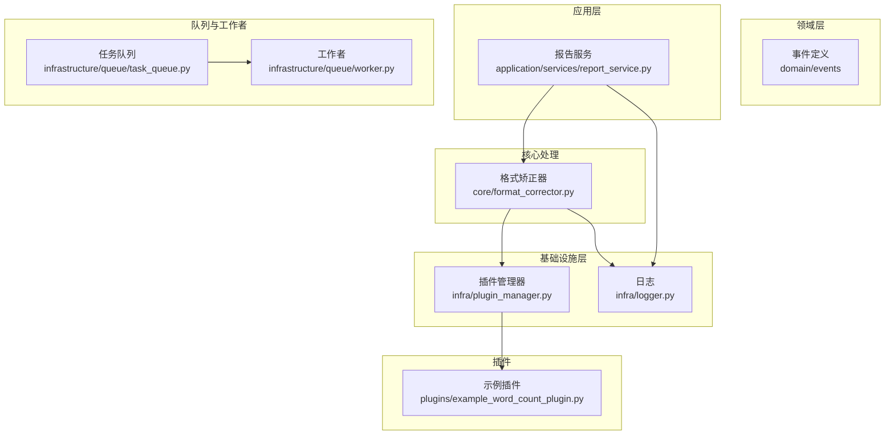
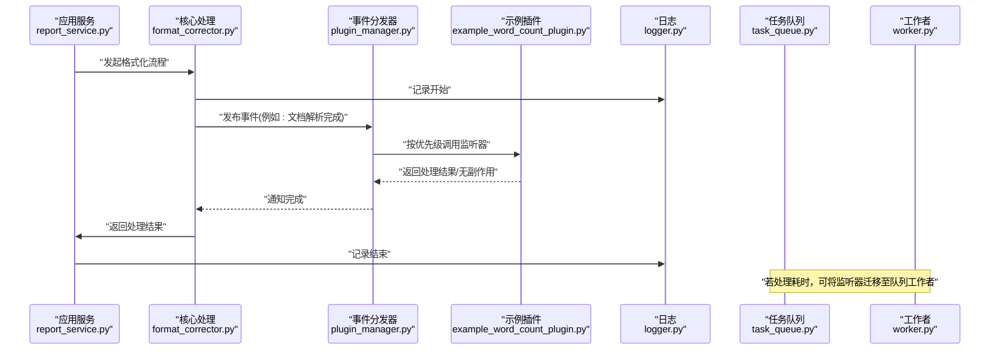
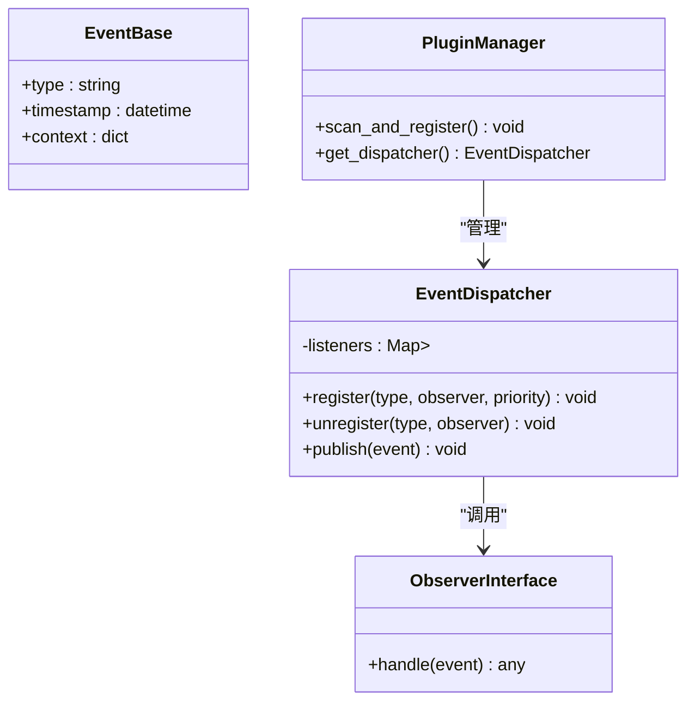
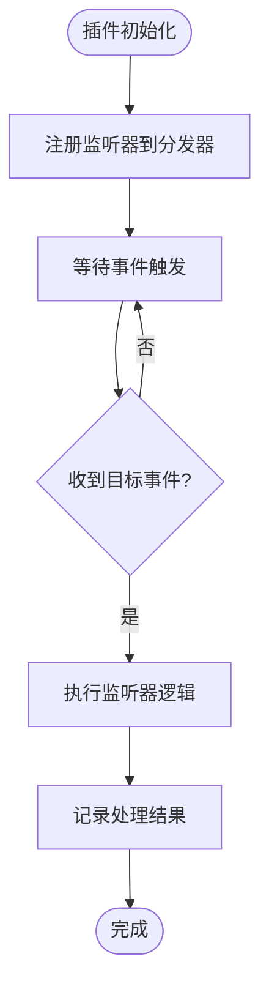
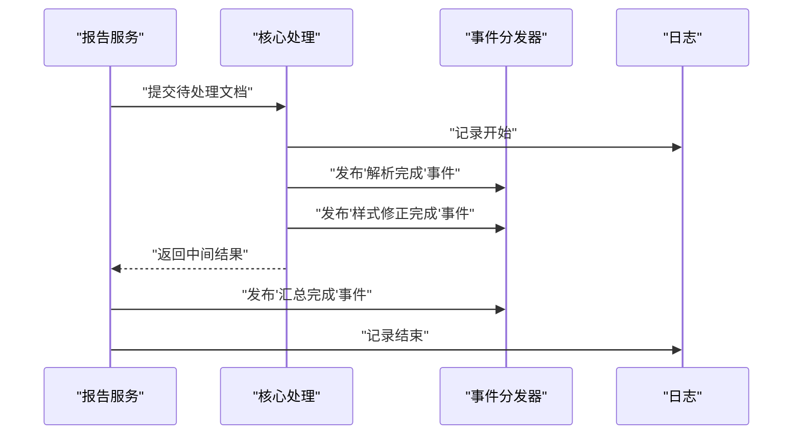
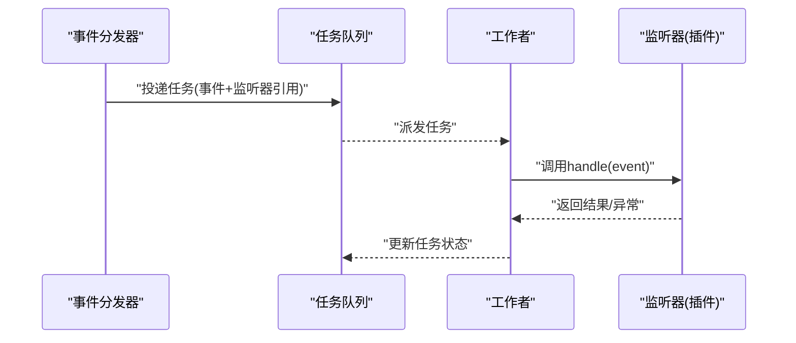
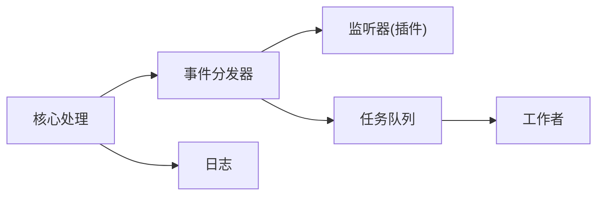

# 观察者模式应用

<cite>
**本文引用的文件**   
- [src/paper_format_corrector/domain/events/__init__.py](file://src/paper_format_corrector/domain/events/__init__.py)
- [src/paper_format_corrector/infra/plugin_manager.py](file://src/paper_format_corrector/infra/plugin_manager.py)
- [plugins/example_word_count_plugin.py](file://plugins/example_word_count_plugin.py)
- [src/paper_format_corrector/core/format_corrector.py](file://src/paper_format_corrector/core/format_corrector.py)
- [src/paper_format_corrector/application/services/report_service.py](file://src/paper_format_corrector/application/services/report_service.py)
- [src/paper_format_corrector/infrastructure/queue/task_queue.py](file://src/paper_format_corrector/infrastructure/queue/task_queue.py)
- [src/paper_format_corrector/infrastructure/queue/worker.py](file://src/paper_format_corrector/infrastructure/queue/worker.py)
- [src/paper_format_corrector/infra/logger.py](file://src/paper_format_corrector/infra/logger.py)
</cite>

## 目录
1. [简介](#简介)
2. [项目结构](#项目结构)
3. [核心组件](#核心组件)
4. [架构总览](#架构总览)
5. [详细组件分析](#详细组件分析)
6. [依赖关系分析](#依赖关系分析)
7. [性能考虑](#性能考虑)
8. [故障排查指南](#故障排查指南)
9. [结论](#结论)
10. [附录](#附录)

## 简介
本文件聚焦于项目中观察者模式在事件驱动架构中的实现，围绕“事件发布-订阅机制、插件系统的事件监听与处理流程”展开。文档将说明：
- 事件基类定义与观察者接口规范
- 事件分发器与监听器注册机制
- 自定义事件与事件处理器的实践路径
- 松耦合组件通信的价值与落地方式
- 事件优先级、异常传播与性能优化要点

## 项目结构
从仓库结构看，事件与观察者相关能力主要分布在以下位置：
- 领域层事件定义：domain/events
- 基础设施层插件管理：infra/plugin_manager.py
- 示例插件：plugins/example_word_count_plugin.py
- 核心处理管线：core/format_corrector.py
- 报告服务（可能触发事件）：application/services/report_service.py
- 任务队列与工作者（异步执行场景）：infrastructure/queue/task_queue.py, worker.py
- 日志记录：infra/logger.py

图表来源
- [src/paper_format_corrector/domain/events/__init__.py](file://src/paper_format_corrector/domain/events/__init__.py)
- [src/paper_format_corrector/infra/plugin_manager.py](file://src/paper_format_corrector/infra/plugin_manager.py)
- [plugins/example_word_count_plugin.py](file://plugins/example_word_count_plugin.py)
- [src/paper_format_corrector/core/format_corrector.py](file://src/paper_format_corrector/core/format_corrector.py)
- [src/paper_format_corrector/application/services/report_service.py](file://src/paper_format_corrector/application/services/report_service.py)
- [src/paper_format_corrector/infrastructure/queue/task_queue.py](file://src/paper_format_corrector/infrastructure/queue/task_queue.py)
- [src/paper_format_corrector/infrastructure/queue/worker.py](file://src/paper_format_corrector/infrastructure/queue/worker.py)
- [src/paper_format_corrector/infra/logger.py](file://src/paper_format_corrector/infra/logger.py)

章节来源
- [src/paper_format_corrector/domain/events/__init__.py](file://src/paper_format_corrector/domain/events/__init__.py)
- [src/paper_format_corrector/infra/plugin_manager.py](file://src/paper_format_corrector/infra/plugin_manager.py)
- [plugins/example_word_count_plugin.py](file://plugins/example_word_count_plugin.py)
- [src/paper_format_corrector/core/format_corrector.py](file://src/paper_format_corrector/core/format_corrector.py)
- [src/paper_format_corrector/application/services/report_service.py](file://src/paper_format_corrector/application/services/report_service.py)
- [src/paper_format_corrector/infrastructure/queue/task_queue.py](file://src/paper_format_corrector/infrastructure/queue/task_queue.py)
- [src/paper_format_corrector/infrastructure/queue/worker.py](file://src/paper_format_corrector/infrastructure/queue/worker.py)
- [src/paper_format_corrector/infra/logger.py](file://src/paper_format_corrector/infra/logger.py)

## 核心组件
- 事件基类与观察者接口
  - 事件基类用于承载事件上下文数据，提供统一的事件元信息访问点。
  - 观察者接口定义了统一的回调签名，确保不同处理器对事件的响应具有一致性。
- 事件分发器与监听器注册
  - 事件分发器负责维护监听器集合、按类型路由事件、支持优先级排序与异常隔离。
  - 监听器注册通常由插件管理器或初始化阶段完成，支持动态增删。
- 插件系统与事件监听
  - 插件通过实现观察者接口并注册到分发器，从而对特定事件做出响应。
  - 示例插件展示了如何监听文档统计类事件并输出结果。
- 核心处理管线与事件触发
  - 核心处理流程在关键阶段触发领域事件，如文档解析完成、样式修正完成等。
  - 报告服务可聚合多个处理阶段的产物，并在完成后触发汇总事件。
- 任务队列与工作者（异步扩展）
  - 对于耗时操作，可通过任务队列将事件处理迁移至后台工作者，避免阻塞主流程。

章节来源
- [src/paper_format_corrector/domain/events/__init__.py](file://src/paper_format_corrector/domain/events/__init__.py)
- [src/paper_format_corrector/infra/plugin_manager.py](file://src/paper_format_corrector/infra/plugin_manager.py)
- [plugins/example_word_count_plugin.py](file://plugins/example_word_count_plugin.py)
- [src/paper_format_corrector/core/format_corrector.py](file://src/paper_format_corrector/core/format_corrector.py)
- [src/paper_format_corrector/application/services/report_service.py](file://src/paper_format_corrector/application/services/report_service.py)
- [src/paper_format_corrector/infrastructure/queue/task_queue.py](file://src/paper_format_corrector/infrastructure/queue/task_queue.py)
- [src/paper_format_corrector/infrastructure/queue/worker.py](file://src/paper_format_corrector/infrastructure/queue/worker.py)

## 架构总览
下图展示事件驱动架构中各组件的交互关系：应用服务触发事件，事件分发器根据类型与优先级调度监听器；插件作为监听器参与处理；日志贯穿全程；队列与工作者为异步场景提供支撑。

图表来源
- [src/paper_format_corrector/application/services/report_service.py](file://src/paper_format_corrector/application/services/report_service.py)
- [src/paper_format_corrector/core/format_corrector.py](file://src/paper_format_corrector/core/format_corrector.py)
- [src/paper_format_corrector/infra/plugin_manager.py](file://src/paper_format_corrector/infra/plugin_manager.py)
- [plugins/example_word_count_plugin.py](file://plugins/example_word_count_plugin.py)
- [src/paper_format_corrector/infra/logger.py](file://src/paper_format_corrector/infra/logger.py)
- [src/paper_format_corrector/infrastructure/queue/task_queue.py](file://src/paper_format_corrector/infrastructure/queue/task_queue.py)
- [src/paper_format_corrector/infrastructure/queue/worker.py](file://src/paper_format_corrector/infrastructure/queue/worker.py)

## 详细组件分析

### 事件基类与观察者接口
- 事件基类职责
  - 提供事件类型标识、时间戳、关联上下文（如文档ID、处理阶段）。
  - 保证事件不可变性或最小可变性，便于并发安全与调试追踪。
- 观察者接口规范
  - 统一方法签名，包含事件对象参数与可选返回值。
  - 约定异常边界：监听器内部应捕获并上报异常，避免污染分发器。
- 复杂度与扩展性
  - 新增事件只需继承基类；新增监听器只需实现接口并注册。
  - 通过类型匹配与优先级字段实现细粒度控制。

章节来源
- [src/paper_format_corrector/domain/events/__init__.py](file://src/paper_format_corrector/domain/events/__init__.py)

### 事件分发器与监听器注册机制
- 分发器职责
  - 维护监听器索引（按事件类型分组）。
  - 支持监听器优先级排序，确保关键逻辑先执行。
  - 异常隔离：单个监听器失败不影响其他监听器。
- 注册机制
  - 插件管理器在启动时扫描并注册监听器。
  - 支持运行时动态注册/注销，便于热插拔与测试替换。
- 性能考量
  - 使用哈希表进行类型到监听器列表的映射，O(1)查找。
  - 批量注册时预排序，减少每次分发的开销。

图表来源
- [src/paper_format_corrector/domain/events/__init__.py](file://src/paper_format_corrector/domain/events/__init__.py)
- [src/paper_format_corrector/infra/plugin_manager.py](file://src/paper_format_corrector/infra/plugin_manager.py)

章节来源
- [src/paper_format_corrector/infra/plugin_manager.py](file://src/paper_format_corrector/infra/plugin_manager.py)

### 插件系统的事件监听与处理流程
- 插件角色
  - 作为观察者实现统一接口，监听特定事件并执行业务逻辑（如字数统计、质量评分）。
- 处理流程
  - 插件在初始化阶段向分发器注册监听器。
  - 事件触发后，分发器按优先级依次调用监听器。
  - 监听器可读取事件上下文，写入日志或持久化结果。
- 示例插件
  - 示例插件演示了监听文档统计事件并输出结果的完整路径。

图表来源
- [plugins/example_word_count_plugin.py](file://plugins/example_word_count_plugin.py)
- [src/paper_format_corrector/infra/plugin_manager.py](file://src/paper_format_corrector/infra/plugin_manager.py)

章节来源
- [plugins/example_word_count_plugin.py](file://plugins/example_word_count_plugin.py)
- [src/paper_format_corrector/infra/plugin_manager.py](file://src/paper_format_corrector/infra/plugin_manager.py)

### 核心处理管线与事件触发
- 触发时机
  - 文档解析完成、样式修正完成、导出完成等关键节点发布事件。
- 与报告服务的协作
  - 报告服务聚合多阶段产物，并在最终阶段发布汇总事件。
- 日志与可观测性
  - 所有关键步骤均记录日志，便于问题定位与性能分析。

图表来源
- [src/paper_format_corrector/application/services/report_service.py](file://src/paper_format_corrector/application/services/report_service.py)
- [src/paper_format_corrector/core/format_corrector.py](file://src/paper_format_corrector/core/format_corrector.py)
- [src/paper_format_corrector/infra/plugin_manager.py](file://src/paper_format_corrector/infra/plugin_manager.py)
- [src/paper_format_corrector/infra/logger.py](file://src/paper_format_corrector/infra/logger.py)

章节来源
- [src/paper_format_corrector/application/services/report_service.py](file://src/paper_format_corrector/application/services/report_service.py)
- [src/paper_format_corrector/core/format_corrector.py](file://src/paper_format_corrector/core/format_corrector.py)
- [src/paper_format_corrector/infra/logger.py](file://src/paper_format_corrector/infra/logger.py)

### 任务队列与工作者（异步扩展）
- 适用场景
  - 当监听器逻辑耗时较长（如外部工具调用、大量IO），建议迁移至队列工作者。
- 工作流
  - 分发器将事件封装为任务投递到队列，工作者消费任务并执行监听器逻辑。
  - 成功/失败状态回写，便于监控与重试。
- 与观察者的集成
  - 监听器仍遵循统一接口，但执行环境变为异步工作者。

图表来源
- [src/paper_format_corrector/infrastructure/queue/task_queue.py](file://src/paper_format_corrector/infrastructure/queue/task_queue.py)
- [src/paper_format_corrector/infrastructure/queue/worker.py](file://src/paper_format_corrector/infrastructure/queue/worker.py)
- [src/paper_format_corrector/infra/plugin_manager.py](file://src/paper_format_corrector/infra/plugin_manager.py)

章节来源
- [src/paper_format_corrector/infrastructure/queue/task_queue.py](file://src/paper_format_corrector/infrastructure/queue/task_queue.py)
- [src/paper_format_corrector/infrastructure/queue/worker.py](file://src/paper_format_corrector/infrastructure/queue/worker.py)

## 依赖关系分析
- 低耦合设计
  - 核心处理仅依赖事件分发器，不直接依赖具体监听器实现。
  - 插件通过接口与分发器解耦，便于替换与扩展。
- 可能的循环依赖
  - 需避免监听器反向依赖核心处理模块，防止循环导入。
- 外部依赖
  - 日志、队列、文件系统、外部工具等通过适配器或配置注入，保持核心稳定。

图表来源
- [src/paper_format_corrector/core/format_corrector.py](file://src/paper_format_corrector/core/format_corrector.py)
- [src/paper_format_corrector/infra/plugin_manager.py](file://src/paper_format_corrector/infra/plugin_manager.py)
- [src/paper_format_corrector/infra/logger.py](file://src/paper_format_corrector/infra/logger.py)
- [src/paper_format_corrector/infrastructure/queue/task_queue.py](file://src/paper_format_corrector/infrastructure/queue/task_queue.py)
- [src/paper_format_corrector/infrastructure/queue/worker.py](file://src/paper_format_corrector/infrastructure/queue/worker.py)

章节来源
- [src/paper_format_corrector/core/format_corrector.py](file://src/paper_format_corrector/core/format_corrector.py)
- [src/paper_format_corrector/infra/plugin_manager.py](file://src/paper_format_corrector/infra/plugin_manager.py)
- [src/paper_format_corrector/infra/logger.py](file://src/paper_format_corrector/infra/logger.py)
- [src/paper_format_corrector/infrastructure/queue/task_queue.py](file://src/paper_format_corrector/infrastructure/queue/task_queue.py)
- [src/paper_format_corrector/infrastructure/queue/worker.py](file://src/paper_format_corrector/infrastructure/queue/worker.py)

## 性能考虑
- 事件分发
  - 使用类型索引与预排序降低分发开销。
  - 对高频事件采用批处理或节流策略。
- 监听器实现
  - 避免在监听器中进行阻塞IO；必要时迁移至队列工作者。
  - 尽量只读事件上下文，减少共享状态竞争。
- 资源管理
  - 监听器注册/注销应在生命周期内集中管理，避免频繁创建销毁。
  - 日志级别按需调整，避免I/O瓶颈。

[本节为通用指导，无需代码来源]

## 故障排查指南
- 常见问题
  - 监听器未触发：检查事件类型是否匹配、监听器是否正确注册。
  - 监听器异常：确认监听器内部异常隔离与上报机制。
  - 性能退化：评估监听器耗时，考虑异步化或并行化。
- 诊断手段
  - 启用详细日志，关注事件发布与监听器调用链路。
  - 使用任务队列的状态查询定位失败任务。
- 恢复策略
  - 对失败监听器进行重试或降级处理。
  - 临时禁用问题监听器，保障核心流程稳定。

章节来源
- [src/paper_format_corrector/infra/logger.py](file://src/paper_format_corrector/infra/logger.py)
- [src/paper_format_corrector/infra/plugin_manager.py](file://src/paper_format_corrector/infra/plugin_manager.py)
- [src/paper_format_corrector/infrastructure/queue/task_queue.py](file://src/paper_format_corrector/infrastructure/queue/task_queue.py)
- [src/paper_format_corrector/infrastructure/queue/worker.py](file://src/paper_format_corrector/infrastructure/queue/worker.py)

## 结论
本项目通过事件基类、观察者接口、事件分发器与插件系统的组合，实现了松耦合的事件驱动架构。核心处理与应用服务通过事件解耦，插件以监听器形式灵活扩展功能。结合任务队列与工作者，可在高负载场景下保持系统稳定性与可扩展性。建议在后续迭代中完善事件优先级策略、异常传播模型与性能监控指标，进一步提升系统健壮性与可观测性。

[本节为总结，无需代码来源]

## 附录
- 自定义事件与实践路径
  - 定义事件：继承事件基类，补充必要上下文字段。
  - 实现监听器：实现观察者接口，编写处理逻辑。
  - 注册监听器：在插件初始化阶段向分发器注册。
  - 触发事件：在核心处理的关键节点发布事件。
- 参考路径
  - 事件定义：[src/paper_format_corrector/domain/events/__init__.py](file://src/paper_format_corrector/domain/events/__init__.py)
  - 插件示例：[plugins/example_word_count_plugin.py](file://plugins/example_word_count_plugin.py)
  - 分发器与注册：[src/paper_format_corrector/infra/plugin_manager.py](file://src/paper_format_corrector/infra/plugin_manager.py)
  - 核心触发点：[src/paper_format_corrector/core/format_corrector.py](file://src/paper_format_corrector/core/format_corrector.py)
  - 报告服务聚合：[src/paper_format_corrector/application/services/report_service.py](file://src/paper_format_corrector/application/services/report_service.py)
  - 异步扩展：[src/paper_format_corrector/infrastructure/queue/task_queue.py](file://src/paper_format_corrector/infrastructure/queue/task_queue.py), [src/paper_format_corrector/infrastructure/queue/worker.py](file://src/paper_format_corrector/infrastructure/queue/worker.py)