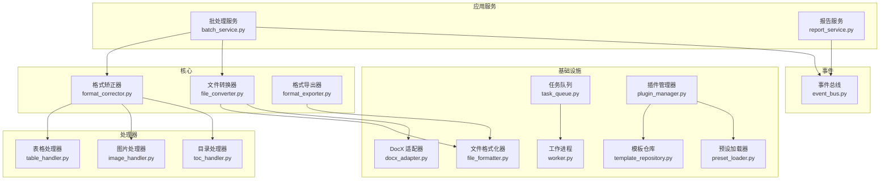
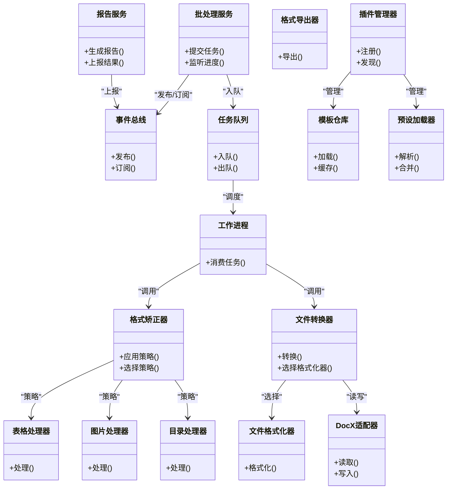
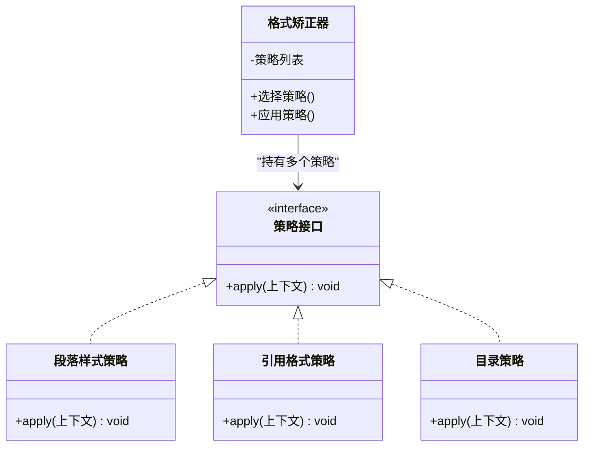
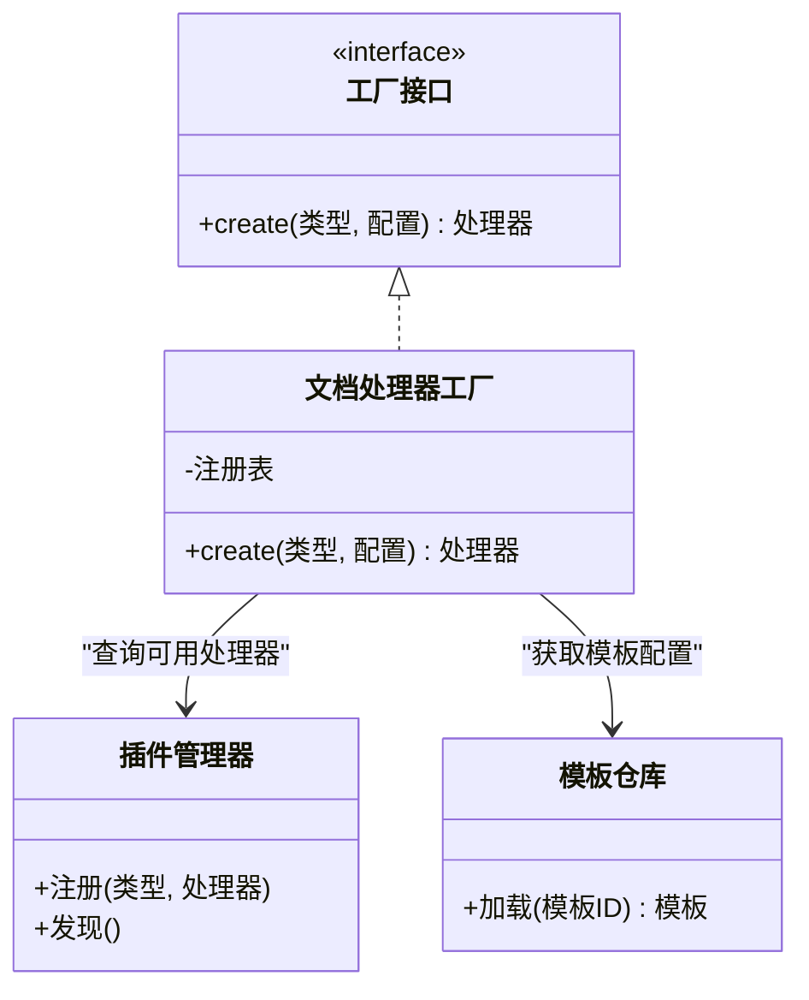
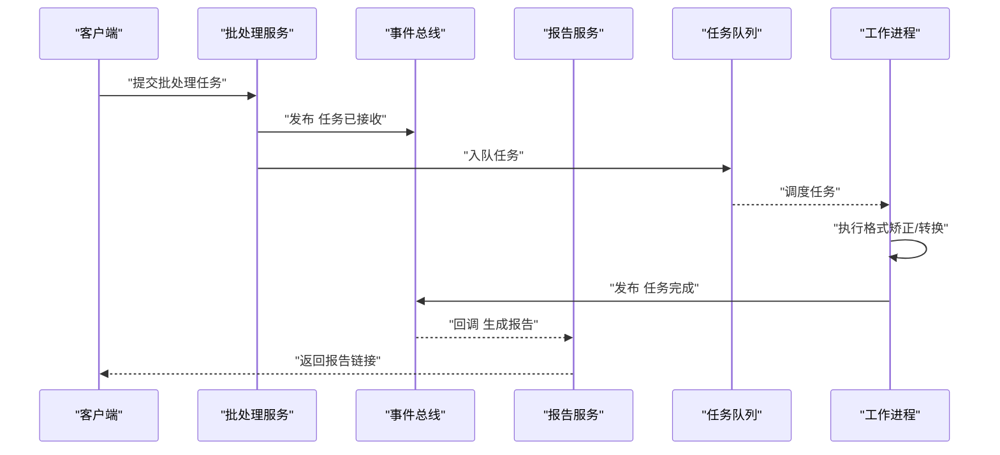
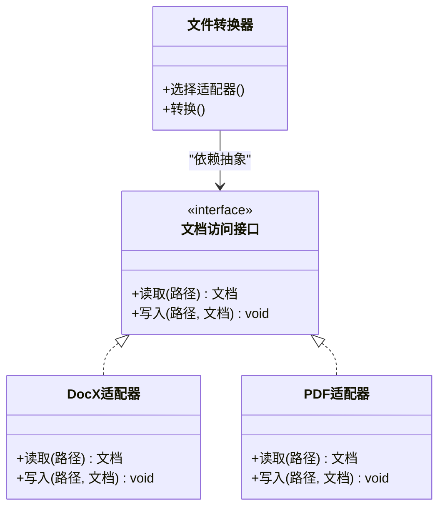
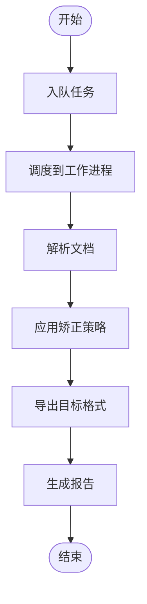
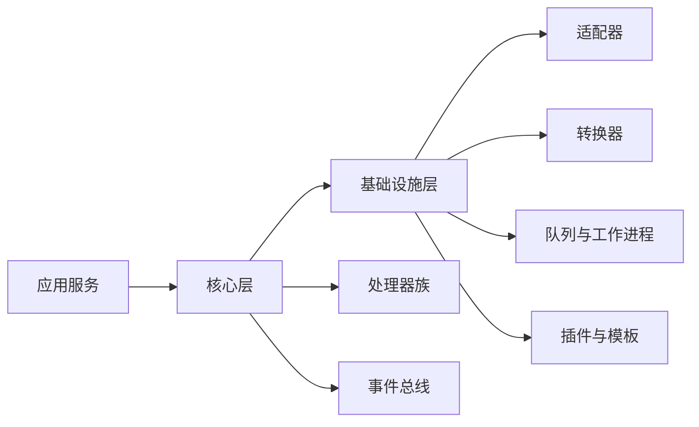

# 设计模式应用

<cite>
**本文引用的文件**   
- [src/paper_format_corrector/core/format_corrector.py](file://src/paper_format_corrector/core/format_corrector.py)
- [src/paper_format_corrector/core/file_converter.py](file://src/paper_format_corrector/core/file_converter.py)
- [src/paper_format_corrector/infrastructure/adapters/docx_adapter.py](file://src/paper_format_corrector/infrastructure/adapters/docx_adapter.py)
- [src/paper_format_corrector/infrastructure/converters/file_formatter.py](file://src/paper_format_corrector/infrastructure/converters/file_formatter.py)
- [src/paper_format_corrector/infrastructure/exporters/format_exporter.py](file://src/paper_format_corrector/infrastructure/exporters/format_exporter.py)
- [src/paper_format_corrector/domain/events/event_bus.py](file://src/paper_format_corrector/domain/events/event_bus.py)
- [src/paper_format_corrector/application/services/batch_service.py](file://src/paper_format_corrector/application/services/batch_service.py)
- [src/paper_format_corrector/application/services/report_service.py](file://src/paper_format_corrector/application/services/report_service.py)
- [src/paper_format_corrector/infra/plugin_manager.py](file://src/paper_format_corrector/infra/plugin_manager.py)
- [src/paper_format_corrector/infra/template_repository.py](file://src/paper_format_corrector/infra/template_repository.py)
- [src/paper_format_corrector/infra/preset_loader.py](file://src/paper_format_corrector/infra/preset_loader.py)
- [src/paper_format_corrector/infrastructure/queue/task_queue.py](file://src/paper_format_corrector/infrastructure/queue/task_queue.py)
- [src/paper_format_corrector/infrastructure/queue/worker.py](file://src/paper_format_corrector/infrastructure/queue/worker.py)
- [src/paper_format_corrector/handlers/table_handler.py](file://src/paper_format_corrector/handlers/table_handler.py)
- [src/paper_format_corrector/handlers/image_handler.py](file://src/paper_format_corrector/handlers/image_handler.py)
- [src/paper_format_corrector/handlers/toc_handler.py](file://src/paper_format_corrector/handlers/toc_handler.py)
- [src/paper_format_corrector/infrastructure/handlers/table_handler.py](file://src/paper_format_corrector/infrastructure/handlers/table_handler.py)
- [src/paper_format_corrector/infrastructure/handlers/image_handler.py](file://src/paper_format_corrector/infrastructure/handlers/image_handler.py)
- [src/paper_format_corrector/infrastructure/handlers/toc_handler.py](file://src/paper_format_corrector/infrastructure/handlers/toc_handler.py)
</cite>

## 目录
1. [简介](#简介)
2. [项目结构](#项目结构)
3. [核心组件](#核心组件)
4. [架构总览](#架构总览)
5. [详细组件分析](#详细组件分析)
6. [依赖关系分析](#依赖关系分析)
7. [性能考量](#性能考量)
8. [故障排查指南](#故障排查指南)
9. [结论](#结论)
10. [附录](#附录)

## 简介
本文件聚焦于论文格式矫正工具中的设计模式应用，围绕策略模式（格式矫正）、工厂模式（文档处理器创建）、观察者模式（事件驱动）与适配器模式（多格式兼容）进行深入剖析。文档将说明每种模式的适用场景、实现方式与收益，并通过类图与流程图展示关键流程，最后给出组合使用的设计考量与最佳实践建议。

## 项目结构
本项目采用分层与领域驱动相结合的组织方式：
- 核心层：负责格式矫正、转换与导出等通用能力
- 基础设施层：提供具体格式适配、转换器、导出器、队列与插件机制
- 应用服务层：编排业务流程，协调核心与基础设施
- 处理器层：针对表格、图片、目录等元素的处理策略
- 事件系统：基于发布-订阅的事件总线，支撑异步与解耦

图表来源
- [src/paper_format_corrector/application/services/batch_service.py](file://src/paper_format_corrector/application/services/batch_service.py)
- [src/paper_format_corrector/application/services/report_service.py](file://src/paper_format_corrector/application/services/report_service.py)
- [src/paper_format_corrector/core/format_corrector.py](file://src/paper_format_corrector/core/format_corrector.py)
- [src/paper_format_corrector/core/file_converter.py](file://src/paper_format_corrector/core/file_converter.py)
- [src/paper_format_corrector/core/format_exporter.py](file://src/paper_format_corrector/core/format_exporter.py)
- [src/paper_format_corrector/infrastructure/adapters/docx_adapter.py](file://src/paper_format_corrector/infrastructure/adapters/docx_adapter.py)
- [src/paper_format_corrector/infrastructure/converters/file_formatter.py](file://src/paper_format_corrector/infrastructure/converters/file_formatter.py)
- [src/paper_format_corrector/infrastructure/exporters/format_exporter.py](file://src/paper_format_corrector/infrastructure/exporters/format_exporter.py)
- [src/paper_format_corrector/infrastructure/queue/task_queue.py](file://src/paper_format_corrector/infrastructure/queue/task_queue.py)
- [src/paper_format_corrector/infrastructure/queue/worker.py](file://src/paper_format_corrector/infrastructure/queue/worker.py)
- [src/paper_format_corrector/infra/plugin_manager.py](file://src/paper_format_corrector/infra/plugin_manager.py)
- [src/paper_format_corrector/infra/template_repository.py](file://src/paper_format_corrector/infra/template_repository.py)
- [src/paper_format_corrector/infra/preset_loader.py](file://src/paper_format_corrector/infra/preset_loader.py)
- [src/paper_format_corrector/handlers/table_handler.py](file://src/paper_format_corrector/handlers/table_handler.py)
- [src/paper_format_corrector/handlers/image_handler.py](file://src/paper_format_corrector/handlers/image_handler.py)
- [src/paper_format_corrector/handlers/toc_handler.py](file://src/paper_format_corrector/handlers/toc_handler.py)
- [src/paper_format_corrector/domain/events/event_bus.py](file://src/paper_format_corrector/domain/events/event_bus.py)

章节来源
- [src/paper_format_corrector/application/services/batch_service.py](file://src/paper_format_corrector/application/services/batch_service.py)
- [src/paper_format_corrector/core/format_corrector.py](file://src/paper_format_corrector/core/format_corrector.py)
- [src/paper_format_corrector/infrastructure/queue/task_queue.py](file://src/paper_format_corrector/infrastructure/queue/task_queue.py)

## 核心组件
- 格式矫正器：封装不同格式规则的策略集合，按模板或预设选择并执行矫正流程
- 文件转换器：统一入口，根据输入输出类型选择对应的格式化器与适配器
- 格式导出器：将内部文档模型导出为目标格式
- 事件总线：提供发布/订阅能力，用于跨模块通知与解耦
- 任务队列与工作进程：支持异步批量处理与可扩展的并发执行
- 插件管理器与模板仓库：动态发现与加载扩展能力与模板资源
- 处理器族：对表格、图片、目录等元素的专项处理策略

章节来源
- [src/paper_format_corrector/core/format_corrector.py](file://src/paper_format_corrector/core/format_corrector.py)
- [src/paper_format_corrector/core/file_converter.py](file://src/paper_format_corrector/core/file_converter.py)
- [src/paper_format_corrector/core/format_exporter.py](file://src/paper_format_corrector/core/format_exporter.py)
- [src/paper_format_corrector/domain/events/event_bus.py](file://src/paper_format_corrector/domain/events/event_bus.py)
- [src/paper_format_corrector/infrastructure/queue/task_queue.py](file://src/paper_format_corrector/infrastructure/queue/task_queue.py)
- [src/paper_format_corrector/infrastructure/queue/worker.py](file://src/paper_format_corrector/infrastructure/queue/worker.py)
- [src/paper_format_corrector/infra/plugin_manager.py](file://src/paper_format_corrector/infra/plugin_manager.py)
- [src/paper_format_corrector/infra/template_repository.py](file://src/paper_format_corrector/infra/template_repository.py)
- [src/paper_format_corrector/infra/preset_loader.py](file://src/paper_format_corrector/infra/preset_loader.py)

## 架构总览
整体采用“应用服务编排 + 核心策略 + 基础设施适配”的分层架构。应用服务通过工厂与策略选择具体实现；基础设施通过适配器屏蔽底层差异；事件总线贯穿各层，实现松耦合通信。

图表来源
- [src/paper_format_corrector/application/services/batch_service.py](file://src/paper_format_corrector/application/services/batch_service.py)
- [src/paper_format_corrector/application/services/report_service.py](file://src/paper_format_corrector/application/services/report_service.py)
- [src/paper_format_corrector/core/format_corrector.py](file://src/paper_format_corrector/core/format_corrector.py)
- [src/paper_format_corrector/core/file_converter.py](file://src/paper_format_corrector/core/file_converter.py)
- [src/paper_format_corrector/core/format_exporter.py](file://src/paper_format_corrector/core/format_exporter.py)
- [src/paper_format_corrector/domain/events/event_bus.py](file://src/paper_format_corrector/domain/events/event_bus.py)
- [src/paper_format_corrector/infrastructure/queue/task_queue.py](file://src/paper_format_corrector/infrastructure/queue/task_queue.py)
- [src/paper_format_corrector/infrastructure/queue/worker.py](file://src/paper_format_corrector/infrastructure/queue/worker.py)
- [src/paper_format_corrector/infra/plugin_manager.py](file://src/paper_format_corrector/infra/plugin_manager.py)
- [src/paper_format_corrector/infra/template_repository.py](file://src/paper_format_corrector/infra/template_repository.py)
- [src/paper_format_corrector/infra/preset_loader.py](file://src/paper_format_corrector/infra/preset_loader.py)
- [src/paper_format_corrector/infrastructure/adapters/docx_adapter.py](file://src/paper_format_corrector/infrastructure/adapters/docx_adapter.py)
- [src/paper_format_corrector/infrastructure/converters/file_formatter.py](file://src/paper_format_corrector/infrastructure/converters/file_formatter.py)
- [src/paper_format_corrector/handlers/table_handler.py](file://src/paper_format_corrector/handlers/table_handler.py)
- [src/paper_format_corrector/handlers/image_handler.py](file://src/paper_format_corrector/handlers/image_handler.py)
- [src/paper_format_corrector/handlers/toc_handler.py](file://src/paper_format_corrector/handlers/toc_handler.py)

## 详细组件分析

### 策略模式在格式矫正中的应用
- 适用场景
  - 同一矫正目标存在多种规则集（如不同学校模板、期刊规范），需要运行时动态切换
  - 新增规则无需修改既有逻辑，遵循开闭原则
- 实现要点
  - 定义统一的策略接口（例如 apply(context)）
  - 为不同模板/规范实现具体策略（段落样式、标题层级、引用格式等）
  - 由格式矫正器根据配置选择并顺序执行策略链
- 收益
  - 可插拔的规则体系，便于扩展与维护
  - 测试友好，可按策略粒度进行单元测试
- 代码示例路径
  - [src/paper_format_corrector/core/format_corrector.py](file://src/paper_format_corrector/core/format_corrector.py)
  - [src/paper_format_corrector/handlers/table_handler.py](file://src/paper_format_corrector/handlers/table_handler.py)
  - [src/paper_format_corrector/handlers/image_handler.py](file://src/paper_format_corrector/handlers/image_handler.py)
  - [src/paper_format_corrector/handlers/toc_handler.py](file://src/paper_format_corrector/handlers/toc_handler.py)

图表来源
- [src/paper_format_corrector/core/format_corrector.py](file://src/paper_format_corrector/core/format_corrector.py)
- [src/paper_format_corrector/handlers/table_handler.py](file://src/paper_format_corrector/handlers/table_handler.py)
- [src/paper_format_corrector/handlers/image_handler.py](file://src/paper_format_corrector/handlers/image_handler.py)
- [src/paper_format_corrector/handlers/toc_handler.py](file://src/paper_format_corrector/handlers/toc_handler.py)

章节来源
- [src/paper_format_corrector/core/format_corrector.py](file://src/paper_format_corrector/core/format_corrector.py)
- [src/paper_format_corrector/handlers/table_handler.py](file://src/paper_format_corrector/handlers/table_handler.py)
- [src/paper_format_corrector/handlers/image_handler.py](file://src/paper_format_corrector/handlers/image_handler.py)
- [src/paper_format_corrector/handlers/toc_handler.py](file://src/paper_format_corrector/handlers/toc_handler.py)

### 工厂模式在文档处理器创建中的作用
- 适用场景
  - 根据输入类型（docx/pdf/txt 等）或配置动态创建对应处理器/转换器
  - 隐藏复杂构造逻辑，集中管理实例化
- 实现要点
  - 定义工厂方法或注册表，按类型键返回具体实现
  - 结合插件管理器动态发现与注册处理器
- 收益
  - 降低耦合，新增处理器只需注册即可生效
  - 提升可测试性，可通过替换工厂返回模拟对象
- 代码示例路径
  - [src/paper_format_corrector/core/file_converter.py](file://src/paper_format_corrector/core/file_converter.py)
  - [src/paper_format_corrector/infra/plugin_manager.py](file://src/paper_format_corrector/infra/plugin_manager.py)
  - [src/paper_format_corrector/infra/template_repository.py](file://src/paper_format_corrector/infra/template_repository.py)

图表来源
- [src/paper_format_corrector/core/file_converter.py](file://src/paper_format_corrector/core/file_converter.py)
- [src/ppaper_format_corrector/infra/plugin_manager.py](file://src/paper_format_corrector/infra/plugin_manager.py)
- [src/paper_format_corrector/infra/template_repository.py](file://src/paper_format_corrector/infra/template_repository.py)

章节来源
- [src/paper_format_corrector/core/file_converter.py](file://src/paper_format_corrector/core/file_converter.py)
- [src/paper_format_corrector/infra/plugin_manager.py](file://src/paper_format_corrector/infra/plugin_manager.py)
- [src/paper_format_corrector/infra/template_repository.py](file://src/paper_format_corrector/infra/template_repository.py)

### 观察者模式在事件驱动架构中的实现
- 适用场景
  - 跨模块通知（如任务开始/完成、错误上报、进度更新）
  - 解耦业务流与监控/日志/审计等横切关注点
- 实现要点
  - 事件总线提供发布/订阅接口
  - 服务层在关键节点发布事件，监听者按需处理
- 收益
  - 低耦合、高内聚，便于横向扩展功能
  - 支持异步处理与重试机制
- 代码示例路径
  - [src/paper_format_corrector/domain/events/event_bus.py](file://src/paper_format_corrector/domain/events/event_bus.py)
  - [src/paper_format_corrector/application/services/batch_service.py](file://src/paper_format_corrector/application/services/batch_service.py)
  - [src/paper_format_corrector/application/services/report_service.py](file://src/paper_format_corrector/application/services/report_service.py)

图表来源
- [src/paper_format_corrector/domain/events/event_bus.py](file://src/paper_format_corrector/domain/events/event_bus.py)
- [src/paper_format_corrector/application/services/batch_service.py](file://src/paper_format_corrector/application/services/batch_service.py)
- [src/paper_format_corrector/application/services/report_service.py](file://src/paper_format_corrector/application/services/report_service.py)
- [src/paper_format_corrector/infrastructure/queue/task_queue.py](file://src/paper_format_corrector/infrastructure/queue/task_queue.py)
- [src/paper_format_corrector/infrastructure/queue/worker.py](file://src/paper_format_corrector/infrastructure/queue/worker.py)

章节来源
- [src/paper_format_corrector/domain/events/event_bus.py](file://src/paper_format_corrector/domain/events/event_bus.py)
- [src/paper_format_corrector/application/services/batch_service.py](file://src/paper_format_corrector/application/services/batch_service.py)
- [src/paper_format_corrector/application/services/report_service.py](file://src/paper_format_corrector/application/services/report_service.py)
- [src/paper_format_corrector/infrastructure/queue/task_queue.py](file://src/paper_format_corrector/infrastructure/queue/task_queue.py)
- [src/paper_format_corrector/infrastructure/queue/worker.py](file://src/paper_format_corrector/infrastructure/queue/worker.py)

### 适配器模式在多格式兼容处理中的应用
- 适用场景
  - 统一抽象不同文件格式（docx/pdf/txt 等）的读写接口
  - 屏蔽第三方库差异，使上层逻辑与具体实现解耦
- 实现要点
  - 定义统一的文档访问接口（读取/写入/元数据）
  - 为每种格式实现具体适配器（如 DocX 适配器）
  - 由转换器根据文件类型选择相应适配器
- 收益
  - 新增格式仅需添加适配器，不影响现有流程
  - 便于替换与测试，可注入模拟适配器
- 代码示例路径
  - [src/paper_format_corrector/infrastructure/adapters/docx_adapter.py](file://src/paper_format_corrector/infrastructure/adapters/docx_adapter.py)
  - [src/paper_format_corrector/infrastructure/converters/file_formatter.py](file://src/paper_format_corrector/infrastructure/converters/file_formatter.py)
  - [src/paper_format_corrector/core/file_converter.py](file://src/paper_format_corrector/core/file_converter.py)

图表来源
- [src/paper_format_corrector/infrastructure/adapters/docx_adapter.py](file://src/paper_format_corrector/infrastructure/adapters/docx_adapter.py)
- [src/paper_format_corrector/infrastructure/converters/file_formatter.py](file://src/paper_format_corrector/infrastructure/converters/file_formatter.py)
- [src/paper_format_corrector/core/file_converter.py](file://src/paper_format_corrector/core/file_converter.py)

章节来源
- [src/paper_format_corrector/infrastructure/adapters/docx_adapter.py](file://src/paper_format_corrector/infrastructure/adapters/docx_adapter.py)
- [src/paper_format_corrector/infrastructure/converters/file_formatter.py](file://src/paper_format_corrector/infrastructure/converters/file_formatter.py)
- [src/paper_format_corrector/core/file_converter.py](file://src/paper_format_corrector/core/file_converter.py)

### 复杂逻辑流程：批量矫正流水线
- 适用场景
  - 大批量文档的自动化处理，包含解析、矫正、导出与报告生成
- 实现要点
  - 以任务为单位入队，工作进程串行/并行消费
  - 每个阶段发布事件，供监控与报告服务订阅
- 收益
  - 高吞吐、可扩展、易观测
- 代码示例路径
  - [src/paper_format_corrector/infrastructure/queue/task_queue.py](file://src/paper_format_corrector/infrastructure/queue/task_queue.py)
  - [src/paper_format_corrector/infrastructure/queue/worker.py](file://src/paper_format_corrector/infrastructure/queue/worker.py)
  - [src/paper_format_corrector/application/services/batch_service.py](file://src/paper_format_corrector/application/services/batch_service.py)

图表来源
- [src/paper_format_corrector/infrastructure/queue/task_queue.py](file://src/paper_format_corrector/infrastructure/queue/task_queue.py)
- [src/paper_format_corrector/infrastructure/queue/worker.py](file://src/paper_format_corrector/infrastructure/queue/worker.py)
- [src/paper_format_corrector/application/services/batch_service.py](file://src/paper_format_corrector/application/services/batch_service.py)

章节来源
- [src/paper_format_corrector/infrastructure/queue/task_queue.py](file://src/paper_format_corrector/infrastructure/queue/task_queue.py)
- [src/paper_format_corrector/infrastructure/queue/worker.py](file://src/paper_format_corrector/infrastructure/queue/worker.py)
- [src/paper_format_corrector/application/services/batch_service.py](file://src/paper_format_corrector/application/services/batch_service.py)

## 依赖关系分析
- 组件耦合
  - 应用服务依赖核心与事件总线，不直接依赖具体格式实现
  - 核心层通过策略与工厂选择具体处理器与适配器
  - 基础设施层提供具体实现，被核心与应用服务间接依赖
- 外部依赖
  - 第三方文档库通过适配器隔离
  - 插件与模板仓库提供动态扩展能力
- 潜在循环依赖
  - 事件总线作为横切组件，避免与其他组件形成双向依赖
- 接口契约
  - 策略接口、文档访问接口、工厂接口明确边界，保障可替换性

图表来源
- [src/paper_format_corrector/application/services/batch_service.py](file://src/paper_format_corrector/application/services/batch_service.py)
- [src/paper_format_corrector/core/format_corrector.py](file://src/paper_format_corrector/core/format_corrector.py)
- [src/paper_format_corrector/infrastructure/adapters/docx_adapter.py](file://src/paper_format_corrector/infrastructure/adapters/docx_adapter.py)
- [src/paper_format_corrector/infrastructure/converters/file_formatter.py](file://src/paper_format_corrector/infrastructure/converters/file_formatter.py)
- [src/paper_format_corrector/infrastructure/queue/task_queue.py](file://src/paper_format_corrector/infrastructure/queue/task_queue.py)
- [src/paper_format_corrector/infrastructure/queue/worker.py](file://src/paper_format_corrector/infrastructure/queue/worker.py)
- [src/paper_format_corrector/infra/plugin_manager.py](file://src/paper_format_corrector/infra/plugin_manager.py)
- [src/paper_format_corrector/infra/template_repository.py](file://src/paper_format_corrector/infra/template_repository.py)
- [src/paper_format_corrector/domain/events/event_bus.py](file://src/paper_format_corrector/domain/events/event_bus.py)

章节来源
- [src/paper_format_corrector/application/services/batch_service.py](file://src/paper_format_corrector/application/services/batch_service.py)
- [src/paper_format_corrector/core/format_corrector.py](file://src/paper_format_corrector/core/format_corrector.py)
- [src/paper_format_corrector/infrastructure/queue/task_queue.py](file://src/paper_format_corrector/infrastructure/queue/task_queue.py)

## 性能考量
- 策略执行顺序与短路
  - 将高频且低成本策略前置，必要时引入短路条件减少后续计算
- 工厂注册表与缓存
  - 对处理器与模板进行懒加载与缓存，避免重复解析与实例化
- 事件与队列
  - 使用有界队列与背压控制，防止内存溢出
  - 监听者异步处理，避免阻塞主流程
- I/O 与序列化
  - 大文档分块处理，减少一次性内存占用
  - 合理设置超时与重试，提高鲁棒性

[本节为通用指导，不涉及具体文件分析]

## 故障排查指南
- 常见问题定位
  - 策略未生效：检查策略注册与选择逻辑，确认配置映射正确
  - 处理器缺失：查看插件注册与发现流程，确认命名空间与版本兼容
  - 事件丢失：核对事件总线订阅关系与消息路由
  - 队列堆积：检查工作进程数量与任务复杂度，调整并发度
- 调试建议
  - 在关键节点增加事件日志与指标上报
  - 使用最小复现用例与断点跟踪策略链
- 代码示例路径
  - [src/paper_format_corrector/domain/events/event_bus.py](file://src/paper_format_corrector/domain/events/event_bus.py)
  - [src/paper_format_corrector/infra/plugin_manager.py](file://src/paper_format_corrector/infra/plugin_manager.py)
  - [src/paper_format_corrector/infrastructure/queue/task_queue.py](file://src/paper_format_corrector/infrastructure/queue/task_queue.py)
  - [src/paper_format_corrector/infrastructure/queue/worker.py](file://src/paper_format_corrector/infrastructure/queue/worker.py)

章节来源
- [src/paper_format_corrector/domain/events/event_bus.py](file://src/paper_format_corrector/domain/events/event_bus.py)
- [src/paper_format_corrector/infra/plugin_manager.py](file://src/paper_format_corrector/infra/plugin_manager.py)
- [src/paper_format_corrector/infrastructure/queue/task_queue.py](file://src/paper_format_corrector/infrastructure/queue/task_queue.py)
- [src/paper_format_corrector/infrastructure/queue/worker.py](file://src/paper_format_corrector/infrastructure/queue/worker.py)

## 结论
本项目通过策略、工厂、观察者与适配器四种模式的组合，实现了高内聚、低耦合、可扩展的格式矫正系统。策略模式让规则灵活可插拔；工厂模式简化了处理器创建与注册；观察者模式提供了强大的事件驱动能力；适配器模式屏蔽了多格式差异。配合任务队列与插件机制，系统在性能与可维护性上取得良好平衡。建议在后续演进中持续完善接口契约、增强可观测性与回归测试覆盖。

## 附录
- 最佳实践
  - 保持策略无状态，避免共享可变状态
  - 工厂注册表需具备幂等注册与冲突检测
  - 事件设计应小而精，避免过度广播
  - 适配器尽量薄，仅做必要的数据转换
- 参考路径
  - [src/paper_format_corrector/core/format_corrector.py](file://src/paper_format_corrector/core/format_corrector.py)
  - [src/paper_format_corrector/core/file_converter.py](file://src/paper_format_corrector/core/file_converter.py)
  - [src/paper_format_corrector/infrastructure/adapters/docx_adapter.py](file://src/paper_format_corrector/infrastructure/adapters/docx_adapter.py)
  - [src/paper_format_corrector/infrastructure/converters/file_formatter.py](file://src/paper_format_corrector/infrastructure/converters/file_formatter.py)
  - [src/paper_format_corrector/infrastructure/exporters/format_exporter.py](file://src/paper_format_corrector/infrastructure/exporters/format_exporter.py)
  - [src/paper_format_corrector/domain/events/event_bus.py](file://src/paper_format_corrector/domain/events/event_bus.py)
  - [src/paper_format_corrector/application/services/batch_service.py](file://src/paper_format_corrector/application/services/batch_service.py)
  - [src/paper_format_corrector/application/services/report_service.py](file://src/paper_format_corrector/application/services/report_service.py)
  - [src/paper_format_corrector/infra/plugin_manager.py](file://src/paper_format_corrector/infra/plugin_manager.py)
  - [src/paper_format_corrector/infra/template_repository.py](file://src/paper_format_corrector/infra/template_repository.py)
  - [src/paper_format_corrector/infra/preset_loader.py](file://src/paper_format_corrector/infra/preset_loader.py)
  - [src/paper_format_corrector/infrastructure/queue/task_queue.py](file://src/paper_format_corrector/infrastructure/queue/task_queue.py)
  - [src/paper_format_corrector/infrastructure/queue/worker.py](file://src/paper_format_corrector/infrastructure/queue/worker.py)
  - [src/paper_format_corrector/handlers/table_handler.py](file://src/paper_format_corrector/handlers/table_handler.py)
  - [src/paper_format_corrector/handlers/image_handler.py](file://src/paper_format_corrector/handlers/image_handler.py)
  - [src/paper_format_corrector/handlers/toc_handler.py](file://src/paper_format_corrector/handlers/toc_handler.py)
  - [src/paper_format_corrector/infrastructure/handlers/table_handler.py](file://src/paper_format_corrector/infrastructure/handlers/table_handler.py)
  - [src/paper_format_corrector/infrastructure/handlers/image_handler.py](file://src/paper_format_corrector/infrastructure/handlers/image_handler.py)
  - [src/paper_format_corrector/infrastructure/handlers/toc_handler.py](file://src/paper_format_corrector/infrastructure/handlers/toc_handler.py)