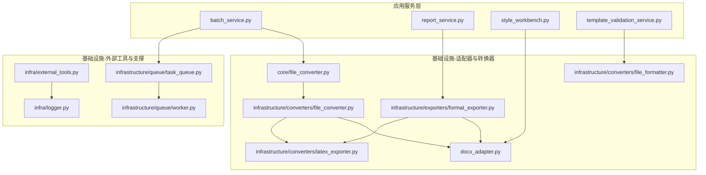
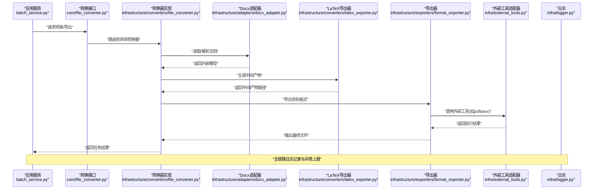
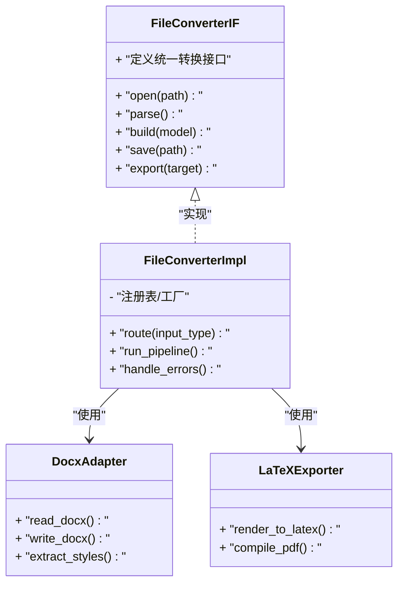
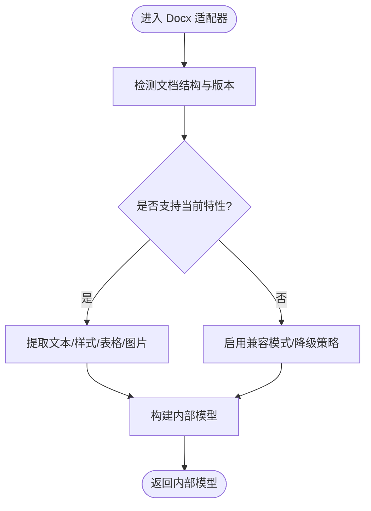
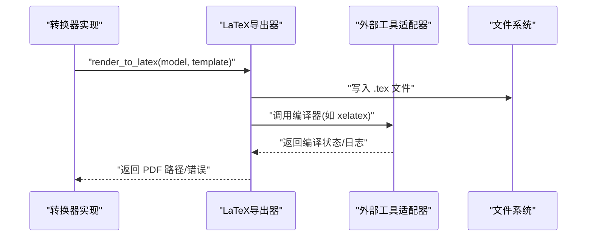
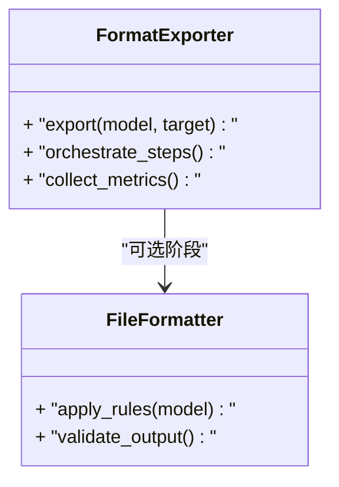
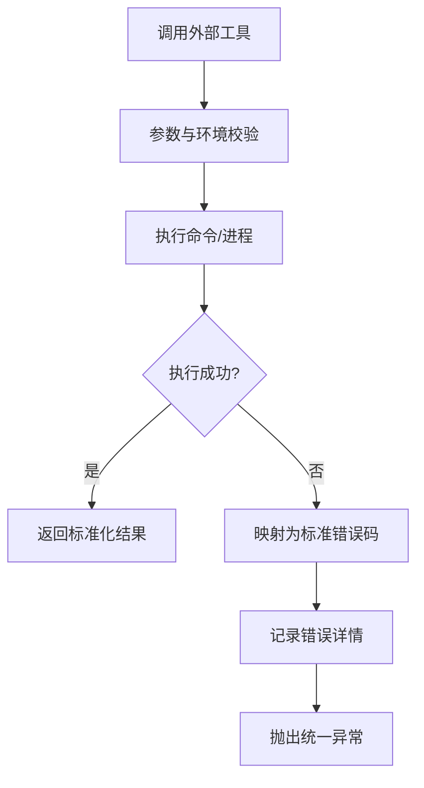
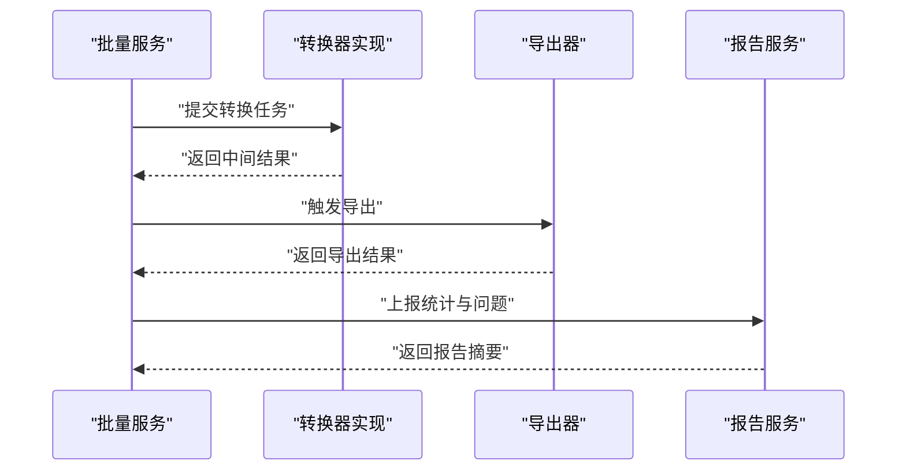
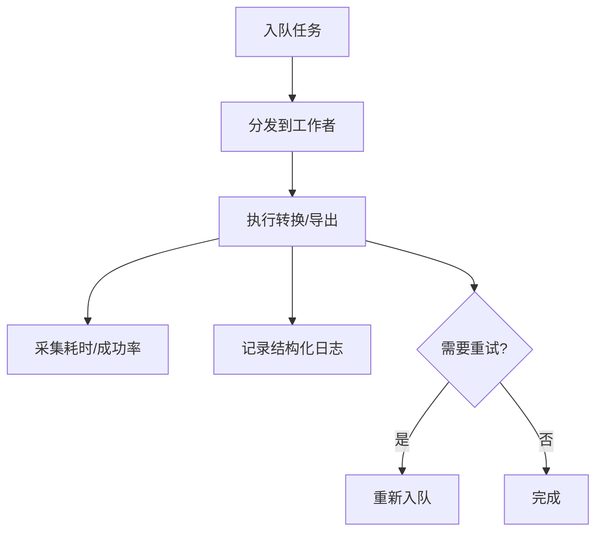
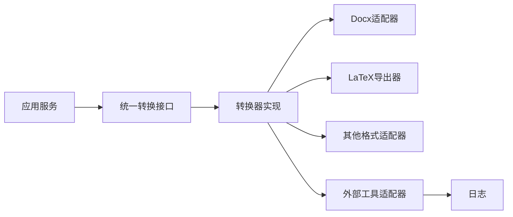

# 适配器模式应用

<cite>
**本文引用的文件**   
- [src/paper_format_corrector/infrastructure/adapters/docx_adapter.py](file://src/paper_format_corrector/infrastructure/adapters/docx_adapter.py)
- [src/paper_format_corrector/core/file_converter.py](file://src/paper_format_corrector/core/file_converter.py)
- [src/paper_format_corrector/infrastructure/converters/file_converter.py](file://src/paper_format_corrector/infrastructure/converters/file_converter.py)
- [src/paper_format_corrector/infrastructure/converters/file_formatter.py](file://src/paper_format_corrector/infrastructure/converters/file_formatter.py)
- [src/paper_format_corrector/infrastructure/converters/latex_exporter.py](file://src/paper_format_corrector/infrastructure/converters/latex_exporter.py)
- [src/paper_format_corrector/infrastructure/exporters/format_exporter.py](file://src/paper_format_corrector/infrastructure/exporters/format_exporter.py)
- [src/paper_format_corrector/infra/external_tools.py](file://src/paper_format_corrector/infra/external_tools.py)
- [src/paper_format_corrector/infra/logger.py](file://src/paper_format_corrector/infra/logger.py)
- [src/paper_format_corrector/application/services/batch_service.py](file://src/paper_format_corrector/application/services/batch_service.py)
- [src/paper_format_corrector/application/services/report_service.py](file://src/paper_format_corrector/application/services/report_service.py)
- [src/paper_format_corrector/application/services/style_workbench.py](file://src/paper_format_corrector/application/services/style_workbench.py)
- [src/paper_format_corrector/application/services/template_validation_service.py](file://src/paper_format_corrector/application/services/template_validation_service.py)
- [src/paper_format_corrector/infrastructure/queue/task_queue.py](file://src/paper_format_corrector/infrastructure/queue/task_queue.py)
- [src/paper_format_corrector/infrastructure/queue/worker.py](file://src/paper_format_corrector/infrastructure/queue/worker.py)
</cite>

## 目录
1. [简介](#简介)
2. [项目结构](#项目结构)
3. [核心组件](#核心组件)
4. [架构总览](#架构总览)
5. [详细组件分析](#详细组件分析)
6. [依赖关系分析](#依赖关系分析)
7. [性能考虑](#性能考虑)
8. [故障排查指南](#故障排查指南)
9. [结论](#结论)
10. [附录](#附录)

## 简介
本文件围绕“适配器模式”在论文格式矫正工具中的落地实践，系统梳理文件格式转换器、外部工具适配器和第三方库封装的适配层设计。重点说明：
- 统一接口定义与具体适配器实现
- 数据转换逻辑与兼容性处理机制
- 错误处理、日志记录与性能监控在适配层的实现要点
- 如何为新的文件格式或外部工具扩展适配器

## 项目结构
本项目采用分层与领域驱动相结合的组织方式，适配层集中在 infrastructure 与 infra 目录下，面向上层提供稳定的接口契约；业务编排位于 application/services；核心流程由 core 模块串联。

图示来源
- [src/paper_format_corrector/application/services/batch_service.py](file://src/paper_format_corrector/application/services/batch_service.py)
- [src/paper_format_corrector/application/services/report_service.py](file://src/paper_format_corrector/application/services/report_service.py)
- [src/paper_format_corrector/application/services/style_workbench.py](file://src/paper_format_corrector/application/services/style_workbench.py)
- [src/paper_format_corrector/application/services/template_validation_service.py](file://src/paper_format_corrector/application/services/template_validation_service.py)
- [src/paper_format_corrector/infrastructure/adapters/docx_adapter.py](file://src/paper_format_corrector/infrastructure/adapters/docx_adapter.py)
- [src/paper_format_corrector/core/file_converter.py](file://src/paper_format_corrector/core/file_converter.py)
- [src/paper_format_corrector/infrastructure/converters/file_converter.py](file://src/paper_format_corrector/infrastructure/converters/file_converter.py)
- [src/paper_format_corrector/infrastructure/converters/file_formatter.py](file://src/paper_format_corrector/infrastructure/converters/file_formatter.py)
- [src/paper_format_corrector/infrastructure/converters/latex_exporter.py](file://src/paper_format_corrector/infrastructure/converters/latex_exporter.py)
- [src/paper_format_corrector/infrastructure/exporters/format_exporter.py](file://src/paper_format_corrector/infrastructure/exporters/format_exporter.py)
- [src/paper_format_corrector/infra/external_tools.py](file://src/paper_format_corrector/infra/external_tools.py)
- [src/paper_format_corrector/infra/logger.py](file://src/paper_format_corrector/infra/logger.py)
- [src/paper_format_corrector/infrastructure/queue/task_queue.py](file://src/paper_format_corrector/infrastructure/queue/task_queue.py)
- [src/paper_format_corrector/infrastructure/queue/worker.py](file://src/paper_format_corrector/infrastructure/queue/worker.py)

章节来源
- [src/paper_format_corrector/core/file_converter.py](file://src/paper_format_corrector/core/file_converter.py)
- [src/paper_format_corrector/infrastructure/converters/file_converter.py](file://src/paper_format_corrector/infrastructure/converters/file_converter.py)
- [src/paper_format_corrector/infrastructure/adapters/docx_adapter.py](file://src/paper_format_corrector/infrastructure/adapters/docx_adapter.py)
- [src/paper_format_corrector/infrastructure/converters/latex_exporter.py](file://src/paper_format_corrector/infrastructure/converters/latex_exporter.py)
- [src/paper_format_corrector/infrastructure/exporters/format_exporter.py](file://src/paper_format_corrector/infrastructure/exporters/format_exporter.py)
- [src/paper_format_corrector/infra/external_tools.py](file://src/paper_format_corrector/infra/external_tools.py)
- [src/paper_format_corrector/infra/logger.py](file://src/paper_format_corrector/infra/logger.py)
- [src/paper_format_corrector/application/services/batch_service.py](file://src/paper_format_corrector/application/services/batch_service.py)
- [src/paper_format_corrector/application/services/report_service.py](file://src/paper_format_corrector/application/services/report_service.py)
- [src/paper_format_corrector/application/services/style_workbench.py](file://src/paper_format_corrector/application/services/style_workbench.py)
- [src/paper_format_corrector/application/services/template_validation_service.py](file://src/paper_format_corrector/application/services/template_validation_service.py)
- [src/paper_format_corrector/infrastructure/queue/task_queue.py](file://src/paper_format_corrector/infrastructure/queue/task_queue.py)
- [src/paper_format_corrector/infrastructure/queue/worker.py](file://src/paper_format_corrector/infrastructure/queue/worker.py)

## 核心组件
- 统一转换接口（抽象）：定义跨格式的读取、写入、导出等能力，屏蔽底层差异。
- 文档对象模型适配器：将 docx 等具体格式映射到内部统一的文档模型。
- 格式转换器：基于统一接口，组合多个适配器完成多格式读写与转换。
- 导出器：将内部模型导出为目标格式（如 PDF/LaTeX）。
- 外部工具适配器：对命令行工具或第三方库进行封装，提供一致调用入口。
- 日志与队列：贯穿适配层的可观测性与异步处理能力。

章节来源
- [src/paper_format_corrector/core/file_converter.py](file://src/paper_format_corrector/core/file_converter.py)
- [src/paper_format_corrector/infrastructure/converters/file_converter.py](file://src/paper_format_corrector/infrastructure/converters/file_converter.py)
- [src/paper_format_corrector/infrastructure/adapters/docx_adapter.py](file://src/paper_format_corrector/infrastructure/adapters/docx_adapter.py)
- [src/paper_format_corrector/infrastructure/converters/latex_exporter.py](file://src/paper_format_corrector/infrastructure/converters/latex_exporter.py)
- [src/paper_format_corrector/infrastructure/exporters/format_exporter.py](file://src/paper_format_corrector/infrastructure/exporters/format_exporter.py)
- [src/paper_format_corrector/infra/external_tools.py](file://src/paper_format_corrector/infra/external_tools.py)
- [src/paper_format_corrector/infra/logger.py](file://src/paper_format_corrector/infra/logger.py)

## 架构总览
下图展示了从应用服务到适配层的数据流与控制流，体现适配器模式如何屏蔽不同格式与外部工具的差异。

图示来源
- [src/paper_format_corrector/application/services/batch_service.py](file://src/paper_format_corrector/application/services/batch_service.py)
- [src/paper_format_corrector/core/file_converter.py](file://src/paper_format_corrector/core/file_converter.py)
- [src/paper_format_corrector/infrastructure/converters/file_converter.py](file://src/paper_format_corrector/infrastructure/converters/file_converter.py)
- [src/paper_format_corrector/infrastructure/adapters/docx_adapter.py](file://src/paper_format_corrector/infrastructure/adapters/docx_adapter.py)
- [src/paper_format_corrector/infrastructure/converters/latex_exporter.py](file://src/paper_format_corrector/infrastructure/converters/latex_exporter.py)
- [src/paper_format_corrector/infrastructure/exporters/format_exporter.py](file://src/paper_format_corrector/infrastructure/exporters/format_exporter.py)
- [src/paper_format_corrector/infra/external_tools.py](file://src/paper_format_corrector/infra/external_tools.py)
- [src/paper_format_corrector/infra/logger.py](file://src/paper_format_corrector/infra/logger.py)

## 详细组件分析

### 统一转换接口与实现
- 抽象接口职责：定义跨格式的统一操作（打开、解析、构建、保存、导出），向上屏蔽具体格式差异。
- 转换器实现：根据输入类型选择具体适配器或导出器，组织转换流水线，并负责错误边界与重试策略。

图示来源
- [src/paper_format_corrector/core/file_converter.py](file://src/paper_format_corrector/core/file_converter.py)
- [src/paper_format_corrector/infrastructure/converters/file_converter.py](file://src/paper_format_corrector/infrastructure/converters/file_converter.py)
- [src/paper_format_corrector/infrastructure/adapters/docx_adapter.py](file://src/paper_format_corrector/infrastructure/adapters/docx_adapter.py)
- [src/paper_format_corrector/infrastructure/converters/latex_exporter.py](file://src/paper_format_corrector/infrastructure/converters/latex_exporter.py)

章节来源
- [src/paper_format_corrector/core/file_converter.py](file://src/paper_format_corrector/core/file_converter.py)
- [src/paper_format_corrector/infrastructure/converters/file_converter.py](file://src/paper_format_corrector/infrastructure/converters/file_converter.py)

### Docx 适配器
- 职责：将 docx 文档解析为内部模型，或将内部模型写回 docx；抽取样式、段落、表格、图片等元素。
- 兼容性：对不同版本 docx 特性做兼容处理，缺失特性时降级或忽略。
- 错误处理：捕获 IO 与解析异常，转换为统一错误码并附带上下文信息。

图示来源
- [src/paper_format_corrector/infrastructure/adapters/docx_adapter.py](file://src/paper_format_corrector/infrastructure/adapters/docx_adapter.py)

章节来源
- [src/paper_format_corrector/infrastructure/adapters/docx_adapter.py](file://src/paper_format_corrector/infrastructure/adapters/docx_adapter.py)

### LaTeX 导出器
- 职责：将内部模型渲染为 LaTeX 源码，并可触发编译流程生成 PDF。
- 模板与变量：通过配置注入模板与变量，保证不同学校/期刊模板的可插拔。
- 外部依赖：封装 pdflatex/xelatex 等命令，统一错误码与输出路径管理。

图示来源
- [src/paper_format_corrector/infrastructure/converters/latex_exporter.py](file://src/paper_format_corrector/infrastructure/converters/latex_exporter.py)
- [src/paper_format_corrector/infra/external_tools.py](file://src/paper_format_corrector/infra/external_tools.py)

章节来源
- [src/paper_format_corrector/infrastructure/converters/latex_exporter.py](file://src/paper_format_corrector/infrastructure/converters/latex_exporter.py)
- [src/paper_format_corrector/infra/external_tools.py](file://src/paper_format_corrector/infra/external_tools.py)

### 导出器与格式化器
- 导出器：统一对外暴露导出 API，协调转换器与外部工具，负责输出路径、命名与归档。
- 格式化器：对特定格式进行二次格式化（如页眉页脚、目录、图表编号等），作为转换流水线的可选阶段。

图示来源
- [src/paper_format_corrector/infrastructure/exporters/format_exporter.py](file://src/paper_format_corrector/infrastructure/exporters/format_exporter.py)
- [src/paper_format_corrector/infrastructure/converters/file_formatter.py](file://src/paper_format_corrector/infrastructure/converters/file_formatter.py)

章节来源
- [src/paper_format_corrector/infrastructure/exporters/format_exporter.py](file://src/paper_format_corrector/infrastructure/exporters/format_exporter.py)
- [src/paper_format_corrector/infrastructure/converters/file_formatter.py](file://src/paper_format_corrector/infrastructure/converters/file_formatter.py)

### 外部工具适配器
- 职责：封装命令行工具或第三方库，提供一致的调用接口、参数校验、超时控制与错误归一化。
- 安全与隔离：限制可执行文件白名单、工作目录隔离、资源配额。
- 可观测性：记录命令、入参、耗时、退出码与标准输出/错误。

图示来源
- [src/paper_format_corrector/infra/external_tools.py](file://src/paper_format_corrector/infra/external_tools.py)
- [src/paper_format_corrector/infra/logger.py](file://src/paper_format_corrector/infra/logger.py)

章节来源
- [src/paper_format_corrector/infra/external_tools.py](file://src/paper_format_corrector/infra/external_tools.py)
- [src/paper_format_corrector/infra/logger.py](file://src/paper_format_corrector/infra/logger.py)

### 应用服务与适配层协作
- 批量服务：接收批量任务，调度转换器与导出器，聚合结果与指标。
- 报告服务：汇总转换与导出过程中的质量指标与问题清单。
- 风格工作台：基于适配器提供的文档模型进行样式编辑与预览。
- 模板验证服务：在转换前校验模板与规则，提前发现不兼容项。

图示来源
- [src/paper_format_corrector/application/services/batch_service.py](file://src/paper_format_corrector/application/services/batch_service.py)
- [src/paper_format_corrector/application/services/report_service.py](file://src/paper_format_corrector/application/services/report_service.py)
- [src/paper_format_corrector/application/services/style_workbench.py](file://src/paper_format_corrector/application/services/style_workbench.py)
- [src/paper_format_corrector/application/services/template_validation_service.py](file://src/paper_format_corrector/application/services/template_validation_service.py)

章节来源
- [src/paper_format_corrector/application/services/batch_service.py](file://src/paper_format_corrector/application/services/batch_service.py)
- [src/paper_format_corrector/application/services/report_service.py](file://src/paper_format_corrector/application/services/report_service.py)
- [src/paper_format_corrector/application/services/style_workbench.py](file://src/paper_format_corrector/application/services/style_workbench.py)
- [src/paper_format_corrector/application/services/template_validation_service.py](file://src/paper_format_corrector/application/services/template_validation_service.py)

### 队列与工作者（适配层可观测性的承载）
- 任务队列：将转换/导出任务持久化，支持重试与幂等。
- 工作者：消费任务，调用适配层组件，记录指标与日志，失败回滚与告警。

图示来源
- [src/paper_format_corrector/infrastructure/queue/task_queue.py](file://src/paper_format_corrector/infrastructure/queue/task_queue.py)
- [src/paper_format_corrector/infrastructure/queue/worker.py](file://src/paper_format_corrector/infrastructure/queue/worker.py)

章节来源
- [src/paper_format_corrector/infrastructure/queue/task_queue.py](file://src/paper_format_corrector/infrastructure/queue/task_queue.py)
- [src/paper_format_corrector/infrastructure/queue/worker.py](file://src/paper_format_corrector/infrastructure/queue/worker.py)

## 依赖关系分析
- 松耦合：应用服务仅依赖统一接口，不感知具体格式与外部工具。
- 内聚性：各适配器聚焦单一格式/工具，变更影响面小。
- 可扩展：新增格式只需实现统一接口并注册到转换器。

图示来源
- [src/paper_format_corrector/core/file_converter.py](file://src/paper_format_corrector/core/file_converter.py)
- [src/paper_format_corrector/infrastructure/converters/file_converter.py](file://src/paper_format_corrector/infrastructure/converters/file_converter.py)
- [src/paper_format_corrector/infrastructure/adapters/docx_adapter.py](file://src/paper_format_corrector/infrastructure/adapters/docx_adapter.py)
- [src/paper_format_corrector/infrastructure/converters/latex_exporter.py](file://src/paper_format_corrector/infrastructure/converters/latex_exporter.py)
- [src/paper_format_corrector/infra/external_tools.py](file://src/paper_format_corrector/infra/external_tools.py)
- [src/paper_format_corrector/infra/logger.py](file://src/paper_format_corrector/infra/logger.py)

章节来源
- [src/paper_format_corrector/core/file_converter.py](file://src/paper_format_corrector/core/file_converter.py)
- [src/paper_format_corrector/infrastructure/converters/file_converter.py](file://src/paper_format_corrector/infrastructure/converters/file_converter.py)
- [src/paper_format_corrector/infrastructure/adapters/docx_adapter.py](file://src/paper_format_corrector/infrastructure/adapters/docx_adapter.py)
- [src/paper_format_corrector/infrastructure/converters/latex_exporter.py](file://src/paper_format_corrector/infrastructure/converters/latex_exporter.py)
- [src/paper_format_corrector/infra/external_tools.py](file://src/paper_format_corrector/infra/external_tools.py)
- [src/paper_format_corrector/infra/logger.py](file://src/paper_format_corrector/infra/logger.py)

## 性能考虑
- 批处理与并行：通过任务队列与工作者并发执行转换/导出，提升吞吐。
- 缓存与复用：对模板、字体、中间产物进行缓存，减少重复计算。
- I/O 优化：大文件分块处理、流式写入，避免内存峰值过高。
- 外部工具调优：设置合理超时、限制并发、收集运行指标以便定位瓶颈。

[本节为通用指导，无需代码引用]

## 故障排查指南
- 常见错误分类
  - 文件 IO 错误：路径不存在、权限不足、磁盘空间不足。
  - 解析错误：格式不兼容、损坏文件、特性缺失。
  - 外部工具错误：未安装、环境变量缺失、编译失败。
- 定位方法
  - 查看结构化日志：包含时间戳、任务 ID、步骤、错误码与堆栈摘要。
  - 检查任务队列：确认任务状态、重试次数与失败原因。
  - 复现最小用例：剥离无关步骤，快速定位根因。
- 恢复策略
  - 自动重试与退避：针对瞬时错误（网络/IO）进行有限次重试。
  - 降级与跳过：对非关键步骤失败时继续主流程，并在报告中标注。
  - 回滚与清理：失败时清理临时文件，保持环境一致性。

章节来源
- [src/paper_format_corrector/infra/logger.py](file://src/paper_format_corrector/infra/logger.py)
- [src/paper_format_corrector/infrastructure/queue/task_queue.py](file://src/paper_format_corrector/infrastructure/queue/task_queue.py)
- [src/paper_format_corrector/infrastructure/queue/worker.py](file://src/paper_format_corrector/infrastructure/queue/worker.py)

## 结论
通过适配器模式，项目在统一接口下实现了多格式兼容、外部工具封装与第三方库集成。该设计显著降低了耦合度，提升了可测试性与可扩展性。配合日志、队列与指标采集，形成了稳定可靠的适配层体系。

[本节为总结，无需代码引用]

## 附录

### 为新文件格式创建适配器的步骤
- 定义统一接口方法（读/写/导出）
- 实现具体适配器，处理格式特有细节与兼容性
- 在转换器中注册新适配器，按输入类型路由
- 补充单元测试与端到端用例，覆盖正常与异常路径
- 更新日志与指标采集点，确保可观测性

### 为外部工具创建适配器的步骤
- 抽象外部工具调用接口（参数、超时、返回值）
- 实现具体适配器，封装命令执行、错误映射与日志
- 在导出器或转换器中按需引入，遵循白名单与安全策略
- 增加健康检查与可用性探测，便于灰度与熔断

[本节为概念性指导，无需代码引用]