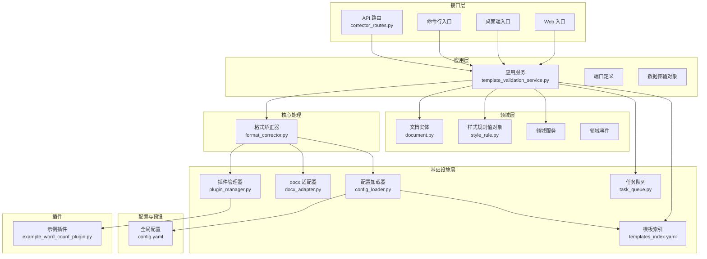
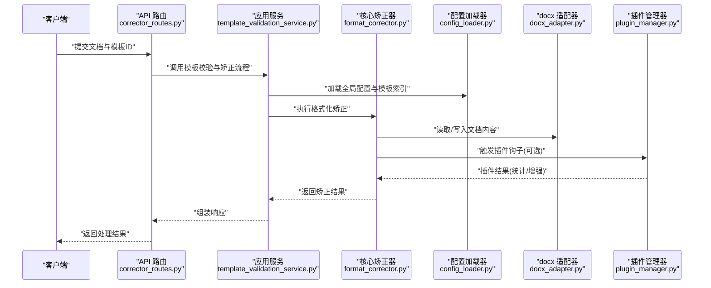
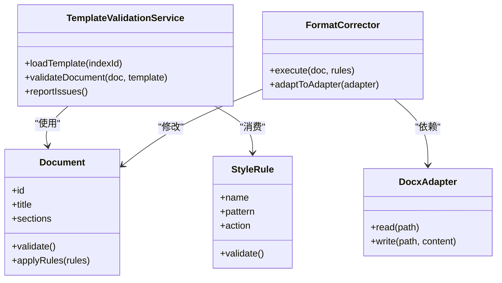
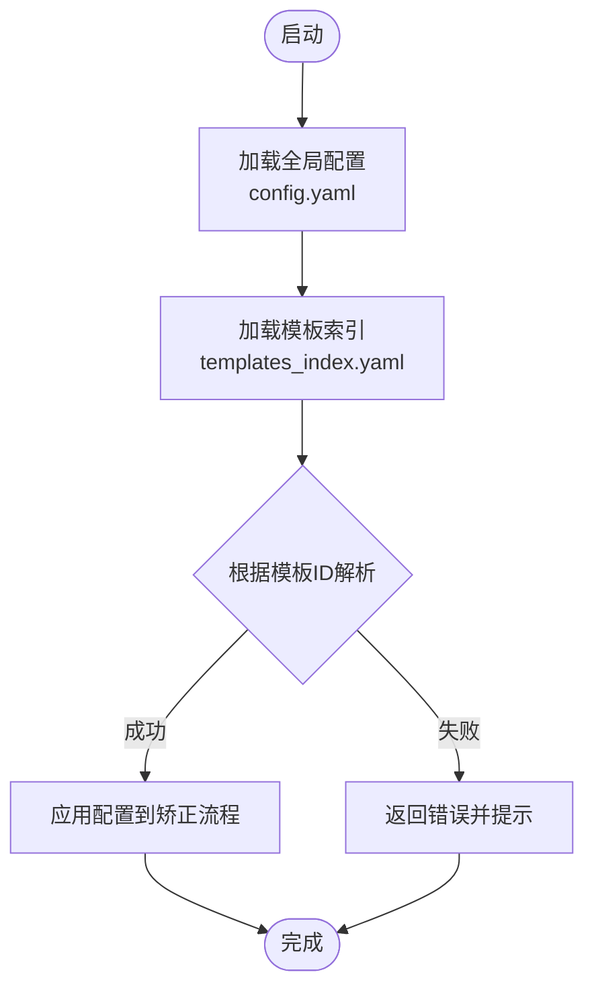
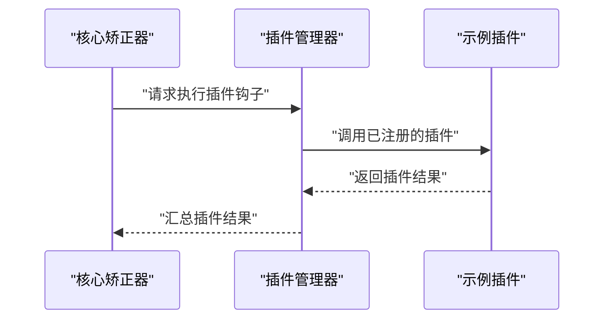
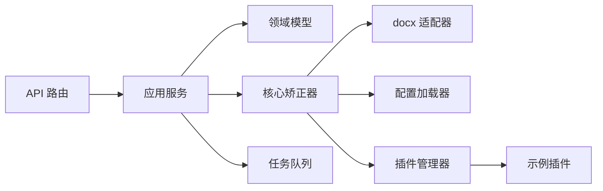

# 设计理念与原则

<cite>
**本文引用的文件**   
- [src/paper_format_corrector/app.py](file://src/paper_format_corrector/app.py)
- [src/paper_format_corrector/core/format_corrector.py](file://src/paper_format_corrector/core/format_corrector.py)
- [src/paper_format_corrector/infrastructure/config/config_loader.py](file://src/paper_format_corrector/infrastructure/config/config_loader.py)
- [src/paper_format_corrector/infra/plugin_manager.py](file://src/paper_format_corrector/infra/plugin_manager.py)
- [plugins/example_word_count_plugin.py](file://plugins/example_word_count_plugin.py)
- [config/config.yaml](file://config/config.yaml)
- [presets/templates_index.yaml](file://presets/templates_index.yaml)
- [src/paper_format_corrector/application/services/template_validation_service.py](file://src/paper_format_corrector/application/services/template_validation_service.py)
- [src/paper_format_corrector/domain/entities/document.py](file://src/paper_format_corrector/domain/entities/document.py)
- [src/paper_format_corrector/domain/value_objects/style_rule.py](file://src/paper_format_corrector/domain/value_objects/style_rule.py)
- [src/paper_format_corrector/infrastructure/adapters/docx_adapter.py](file://src/paper_format_corrector/infrastructure/adapters/docx_adapter.py)
- [src/paper_format_corrector/interfaces/api/routes/corrector_routes.py](file://src/paper_format_corrector/interfaces/api/routes/corrector_routes.py)
- [src/paper_format_corrector/infrastructure/queue/task_queue.py](file://src/paper_format_corrector/infrastructure/queue/task_queue.py)
</cite>

## 目录
1. [引言](#引言)
2. [项目结构](#项目结构)
3. [核心组件](#核心组件)
4. [架构总览](#架构总览)
5. [详细组件分析](#详细组件分析)
6. [依赖关系分析](#依赖关系分析)
7. [性能考量](#性能考量)
8. [故障排查指南](#故障排查指南)
9. [结论](#结论)
10. [附录](#附录)

## 引言
本文件系统化阐述论文格式矫正工具的设计理念与原则，重点覆盖领域驱动设计（DDD）、配置驱动架构、插件化扩展机制等核心理念，并说明单一职责、开闭原则、依赖倒置等原则在项目中的具体体现。文档还解释选择这些理念的动机、权衡与替代方案评估，并通过代码片段路径展示实际落地方式，帮助读者理解系统如何兼顾可扩展性、可维护性与性能。

## 项目结构
项目采用分层与领域驱动相结合的组织方式：
- 接口层（interfaces）：API、CLI、桌面端、Web 入口
- 应用层（application）：用例编排、服务协调、DTO/Ports
- 领域层（domain）：实体、值对象、领域服务、事件
- 基础设施层（infrastructure/infra）：适配器、解析器、转换器、导出器、队列、模板仓库、插件管理、远程协作等
- 核心处理（core）：格式化矫正、文档生成、样式提取等通用能力
- 配置与预设（config/presets）：全局配置、模板索引与模板集
- 插件（plugins）：用户或第三方扩展点

图表来源
- [src/paper_format_corrector/interfaces/api/routes/corrector_routes.py](file://src/paper_format_corrector/interfaces/api/routes/corrector_routes.py)
- [src/paper_format_corrector/application/services/template_validation_service.py](file://src/paper_format_corrector/application/services/template_validation_service.py)
- [src/paper_format_corrector/domain/entities/document.py](file://src/paper_format_corrector/domain/entities/document.py)
- [src/paper_format_corrector/domain/value_objects/style_rule.py](file://src/paper_format_corrector/domain/value_objects/style_rule.py)
- [src/paper_format_corrector/core/format_corrector.py](file://src/paper_format_corrector/core/format_corrector.py)
- [src/paper_format_corrector/infrastructure/adapters/docx_adapter.py](file://src/paper_format_corrector/infrastructure/adapters/docx_adapter.py)
- [src/paper_format_corrector/infrastructure/config/config_loader.py](file://src/paper_format_corrector/infrastructure/config/config_loader.py)
- [src/paper_format_corrector/infra/plugin_manager.py](file://src/paper_format_corrector/infra/plugin_manager.py)
- [plugins/example_word_count_plugin.py](file://plugins/example_word_count_plugin.py)
- [config/config.yaml](file://config/config.yaml)
- [presets/templates_index.yaml](file://presets/templates_index.yaml)
- [src/paper_format_corrector/infrastructure/queue/task_queue.py](file://src/paper_format_corrector/infrastructure/queue/task_queue.py)

章节来源
- [src/paper_format_corrector/app.py](file://src/paper_format_corrector/app.py)
- [config/config.yaml](file://config/config.yaml)
- [presets/templates_index.yaml](file://presets/templates_index.yaml)

## 核心组件
- 领域模型与值对象：以“文档”为核心实体，围绕“样式规则”等值对象表达不变式与约束，确保领域语义清晰且不可变数据易于推理。
- 应用服务：编排跨层流程，如模板校验、批量处理、报告生成；通过端口抽象隔离外部实现细节。
- 核心矫正器：将领域策略与基础设施适配解耦，负责按规则执行格式化矫正。
- 配置加载器：集中读取全局配置与预设模板索引，提供统一配置访问。
- 插件管理器：动态发现、注册与调用插件，支持运行时扩展。
- docx 适配器：封装对底层文档库的读写操作，屏蔽差异。
- 任务队列：异步处理耗时任务，提升吞吐与响应性。

章节来源
- [src/paper_format_corrector/domain/entities/document.py](file://src/paper_format_corrector/domain/entities/document.py)
- [src/paper_format_corrector/domain/value_objects/style_rule.py](file://src/paper_format_corrector/domain/value_objects/style_rule.py)
- [src/paper_format_corrector/application/services/template_validation_service.py](file://src/paper_format_corrector/application/services/template_validation_service.py)
- [src/paper_format_corrector/core/format_corrector.py](file://src/paper_format_corrector/core/format_corrector.py)
- [src/paper_format_corrector/infrastructure/config/config_loader.py](file://src/paper_format_corrector/infrastructure/config/config_loader.py)
- [src/paper_format_corrector/infra/plugin_manager.py](file://src/paper_format_corrector/infra/plugin_manager.py)
- [src/paper_format_corrector/infrastructure/adapters/docx_adapter.py](file://src/paper_format_corrector/infrastructure/adapters/docx_adapter.py)
- [src/paper_format_corrector/infrastructure/queue/task_queue.py](file://src/paper_format_corrector/infrastructure/queue/task_queue.py)

## 架构总览
系统遵循分层与 DDD 边界，结合配置驱动与插件化扩展：
- 接口层仅负责协议转换与参数校验，不承载业务逻辑
- 应用层编排用例，组合领域服务与基础设施端口
- 领域层专注业务不变式与状态迁移
- 基础设施层提供具体实现（IO、网络、持久化、第三方库）
- 配置与预设作为外部化策略，支撑多模板、多场景快速切换
- 插件体系在关键处理阶段注入扩展点，满足横向扩展需求

图表来源
- [src/paper_format_corrector/interfaces/api/routes/corrector_routes.py](file://src/paper_format_corrector/interfaces/api/routes/corrector_routes.py)
- [src/paper_format_corrector/application/services/template_validation_service.py](file://src/paper_format_corrector/application/services/template_validation_service.py)
- [src/paper_format_corrector/core/format_corrector.py](file://src/paper_format_corrector/core/format_corrector.py)
- [src/paper_format_corrector/infrastructure/config/config_loader.py](file://src/paper_format_corrector/infrastructure/config/config_loader.py)
- [src/paper_format_corrector/infrastructure/adapters/docx_adapter.py](file://src/paper_format_corrector/infrastructure/adapters/docx_adapter.py)
- [src/paper_format_corrector/infra/plugin_manager.py](file://src/paper_format_corrector/infra/plugin_manager.py)

## 详细组件分析

### 领域驱动设计（DDD）的应用
- 实体与值对象分离：文档实体承载身份与生命周期，样式规则作为值对象表达不可变约束，便于测试与复用。
- 领域服务：将跨实体的复杂业务规则收敛到领域服务中，避免贫血模型。
- 应用服务编排：用例级流程由应用服务组织，领域保持纯净。

图表来源
- [src/paper_format_corrector/domain/entities/document.py](file://src/paper_format_corrector/domain/entities/document.py)
- [src/paper_format_corrector/domain/value_objects/style_rule.py](file://src/paper_format_corrector/domain/value_objects/style_rule.py)
- [src/paper_format_corrector/application/services/template_validation_service.py](file://src/paper_format_corrector/application/services/template_validation_service.py)
- [src/paper_format_corrector/core/format_corrector.py](file://src/paper_format_corrector/core/format_corrector.py)
- [src/paper_format_corrector/infrastructure/adapters/docx_adapter.py](file://src/paper_format_corrector/infrastructure/adapters/docx_adapter.py)

章节来源
- [src/paper_format_corrector/domain/entities/document.py](file://src/paper_format_corrector/domain/entities/document.py)
- [src/paper_format_corrector/domain/value_objects/style_rule.py](file://src/paper_format_corrector/domain/value_objects/style_rule.py)
- [src/paper_format_corrector/application/services/template_validation_service.py](file://src/paper_format_corrector/application/services/template_validation_service.py)
- [src/paper_format_corrector/core/format_corrector.py](file://src/paper_format_corrector/core/format_corrector.py)
- [src/paper_format_corrector/infrastructure/adapters/docx_adapter.py](file://src/paper_format_corrector/infrastructure/adapters/docx_adapter.py)

### 配置驱动架构
- 全局配置与模板索引外置：通过 YAML 集中管理策略，支持多模板、多机构规范快速切换。
- 配置加载器提供统一访问点，应用层无需关心存储细节。
- 预设模板索引用于快速定位模板资源，降低耦合。

图表来源
- [config/config.yaml](file://config/config.yaml)
- [presets/templates_index.yaml](file://presets/templates_index.yaml)
- [src/paper_format_corrector/infrastructure/config/config_loader.py](file://src/paper_format_corrector/infrastructure/config/config_loader.py)

章节来源
- [config/config.yaml](file://config/config.yaml)
- [presets/templates_index.yaml](file://presets/templates_index.yaml)
- [src/paper_format_corrector/infrastructure/config/config_loader.py](file://src/paper_format_corrector/infrastructure/config/config_loader.py)

### 插件化扩展机制
- 插件管理器负责发现、注册与调用插件，支持在关键处理阶段注入行为（如字数统计、质量评分）。
- 示例插件演示了最小扩展单元的结构与约定。
- 插件与核心解耦，遵循开闭原则：新增功能无需修改核心逻辑。

图表来源
- [src/paper_format_corrector/infra/plugin_manager.py](file://src/paper_format_corrector/infra/plugin_manager.py)
- [plugins/example_word_count_plugin.py](file://plugins/example_word_count_plugin.py)

章节来源
- [src/paper_format_corrector/infra/plugin_manager.py](file://src/paper_format_corrector/infra/plugin_manager.py)
- [plugins/example_word_count_plugin.py](file://plugins/example_word_count_plugin.py)

### 设计原则的具体体现
- 单一职责
  - 各模块聚焦单一职责：接口层只做协议转换，应用层编排用例，领域层表达不变式，基础设施层实现 IO 与外部集成。
  - 参考路径：[接口路由](file://src/paper_format_corrector/interfaces/api/routes/corrector_routes.py)、[应用服务](file://src/paper_format_corrector/application/services/template_validation_service.py)、[核心矫正器](file://src/paper_format_corrector/core/format_corrector.py)。
- 开闭原则
  - 通过插件管理器与配置驱动，在不修改核心逻辑的前提下扩展功能与策略。
  - 参考路径：[插件管理器](file://src/paper_format_corrector/infra/plugin_manager.py)、[配置加载器](file://src/paper_format_corrector/infrastructure/config/config_loader.py)。
- 依赖倒置
  - 应用层与领域层通过端口/接口依赖抽象，基础设施层提供具体实现（如 docx 适配器）。
  - 参考路径：[docx 适配器](file://src/paper_format_corrector/infrastructure/adapters/docx_adapter.py)、[应用服务](file://src/paper_format_corrector/application/services/template_validation_service.py)。

章节来源
- [src/paper_format_corrector/interfaces/api/routes/corrector_routes.py](file://src/paper_format_corrector/interfaces/api/routes/corrector_routes.py)
- [src/paper_format_corrector/application/services/template_validation_service.py](file://src/paper_format_corrector/application/services/template_validation_service.py)
- [src/paper_format_corrector/core/format_corrector.py](file://src/paper_format_corrector/core/format_corrector.py)
- [src/paper_format_corrector/infra/plugin_manager.py](file://src/paper_format_corrector/infra/plugin_manager.py)
- [src/paper_format_corrector/infrastructure/config/config_loader.py](file://src/paper_format_corrector/infrastructure/config/config_loader.py)
- [src/paper_format_corrector/infrastructure/adapters/docx_adapter.py](file://src/paper_format_corrector/infrastructure/adapters/docx_adapter.py)

### 为什么选择这些理念与原则
- 可扩展性：插件化与配置驱动使新模板与新功能以低侵入方式接入。
- 可维护性：DDD 明确边界，单一职责减少副作用，依赖倒置降低耦合。
- 性能：任务队列异步处理耗时任务，适配器缓存与惰性加载可减少 IO 开销。

### 设计决策的权衡与替代方案
- 配置驱动 vs 硬编码策略
  - 权衡：配置灵活但需保证一致性与版本兼容；硬编码简单但变更成本高。
  - 替代：JSON Schema 校验配置、热重载配置中心。
- 插件化 vs 继承扩展
  - 权衡：插件更灵活、可独立部署；继承易形成紧耦合类层次。
  - 替代：基于装饰器的中间件模式。
- 同步 vs 异步处理
  - 权衡：同步简单直观；异步吞吐高但复杂度上升。
  - 替代：消息总线或工作流引擎。

## 依赖关系分析
- 组件内聚与耦合
  - 应用服务对领域模型与核心矫正器有直接依赖，但对基础设施通过适配器与配置加载器间接依赖，符合依赖倒置。
  - 插件管理器与示例插件松耦合，通过约定接口交互。
- 外部依赖与集成点
  - docx 适配器封装第三方库差异；任务队列对接后台作业；配置与模板索引为外部数据源。

图表来源
- [src/paper_format_corrector/interfaces/api/routes/corrector_routes.py](file://src/paper_format_corrector/interfaces/api/routes/corrector_routes.py)
- [src/paper_format_corrector/application/services/template_validation_service.py](file://src/paper_format_corrector/application/services/template_validation_service.py)
- [src/paper_format_corrector/core/format_corrector.py](file://src/paper_format_corrector/core/format_corrector.py)
- [src/paper_format_corrector/infrastructure/adapters/docx_adapter.py](file://src/paper_format_corrector/infrastructure/adapters/docx_adapter.py)
- [src/paper_format_corrector/infrastructure/config/config_loader.py](file://src/paper_format_corrector/infrastructure/config/config_loader.py)
- [src/paper_format_corrector/infra/plugin_manager.py](file://src/paper_format_corrector/infra/plugin_manager.py)
- [plugins/example_word_count_plugin.py](file://plugins/example_word_count_plugin.py)
- [src/paper_format_corrector/infrastructure/queue/task_queue.py](file://src/paper_format_corrector/infrastructure/queue/task_queue.py)

章节来源
- [src/paper_format_corrector/infrastructure/queue/task_queue.py](file://src/paper_format_corrector/infrastructure/queue/task_queue.py)

## 性能考量
- 异步任务：通过任务队列将耗时处理移出主线程，提高并发与响应速度。
- 适配器优化：对频繁 IO 的场景引入缓存与懒加载，减少重复解析。
- 配置预加载：启动时加载必要配置与索引，避免运行时阻塞。
- 插件执行：限制插件数量与执行时间，防止长尾影响整体吞吐。

## 故障排查指南
- 配置问题
  - 检查全局配置与模板索引是否完整、字段是否合法。
  - 参考路径：[配置加载器](file://src/paper_format_corrector/infrastructure/config/config_loader.py)、[全局配置](file://config/config.yaml)、[模板索引](file://presets/templates_index.yaml)。
- 插件异常
  - 确认插件注册与钩子名称匹配，捕获插件抛出的异常并记录日志。
  - 参考路径：[插件管理器](file://src/paper_format_corrector/infra/plugin_manager.py)、[示例插件](file://plugins/example_word_count_plugin.py)。
- 文档处理错误
  - 验证 docx 适配器读写的文件路径权限与格式兼容性。
  - 参考路径：[docx 适配器](file://src/paper_format_corrector/infrastructure/adapters/docx_adapter.py)。
- 任务队列积压
  - 监控队列长度与工作进程健康度，必要时扩容或限流。
  - 参考路径：[任务队列](file://src/paper_format_corrector/infrastructure/queue/task_queue.py)。

章节来源
- [src/paper_format_corrector/infrastructure/config/config_loader.py](file://src/paper_format_corrector/infrastructure/config/config_loader.py)
- [config/config.yaml](file://config/config.yaml)
- [presets/templates_index.yaml](file://presets/templates_index.yaml)
- [src/paper_format_corrector/infra/plugin_manager.py](file://src/paper_format_corrector/infra/plugin_manager.py)
- [plugins/example_word_count_plugin.py](file://plugins/example_word_count_plugin.py)
- [src/paper_format_corrector/infrastructure/adapters/docx_adapter.py](file://src/paper_format_corrector/infrastructure/adapters/docx_adapter.py)
- [src/paper_format_corrector/infrastructure/queue/task_queue.py](file://src/paper_format_corrector/infrastructure/queue/task_queue.py)

## 结论
本项目以 DDD 为骨架，结合配置驱动与插件化扩展，实现了高内聚、低耦合的可扩展架构。通过单一职责、开闭原则与依赖倒置的实践，系统在保持核心稳定的同时，具备强大的横向扩展能力与良好的可维护性。配合任务队列与适配器优化，能够满足大规模文档处理的性能要求。未来可在配置校验、插件治理与可观测性方面持续演进。

## 附录
- 代码片段路径（不含具体代码内容）
  - 领域实体与值对象：[文档实体](file://src/paper_format_corrector/domain/entities/document.py)、[样式规则](file://src/paper_format_corrector/domain/value_objects/style_rule.py)
  - 应用服务与核心矫正器：[模板校验服务](file://src/paper_format_corrector/application/services/template_validation_service.py)、[格式矫正器](file://src/paper_format_corrector/core/format_corrector.py)
  - 基础设施与适配器：[配置加载器](file://src/paper_format_corrector/infrastructure/config/config_loader.py)、[docx 适配器](file://src/paper_format_corrector/infrastructure/adapters/docx_adapter.py)、[插件管理器](file://src/paper_format_corrector/infra/plugin_manager.py)、[任务队列](file://src/paper_format_corrector/infrastructure/queue/task_queue.py)
  - 配置与预设：[全局配置](file://config/config.yaml)、[模板索引](file://presets/templates_index.yaml)
  - 插件示例：[示例插件](file://plugins/example_word_count_plugin.py)
  - 接口路由：[API 路由](file://src/paper_format_corrector/interfaces/api/routes/corrector_routes.py)