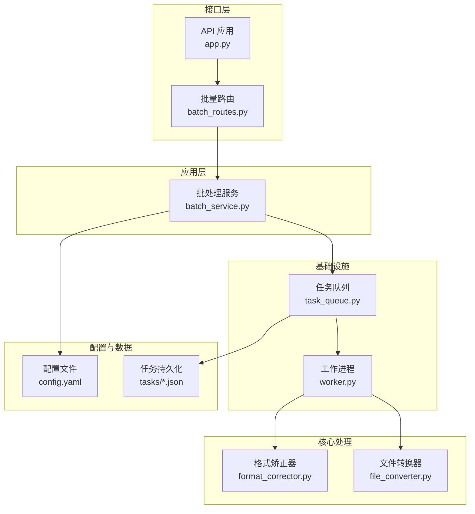
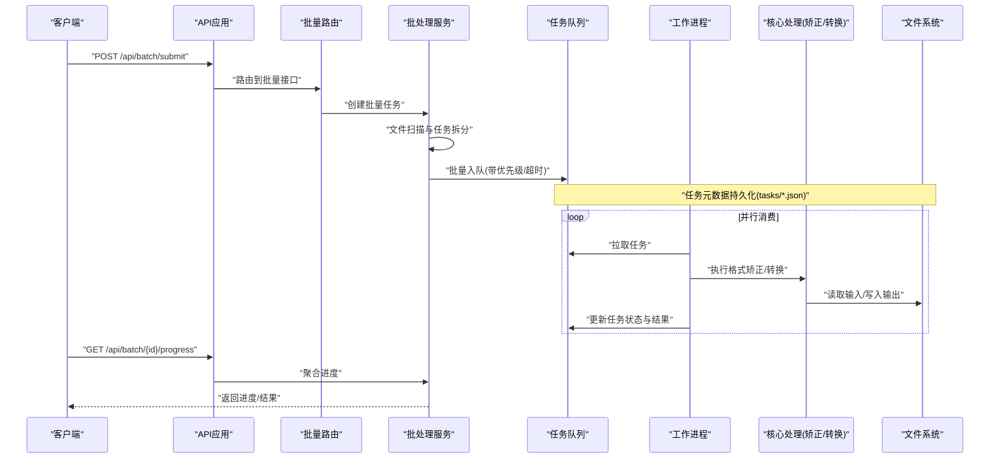
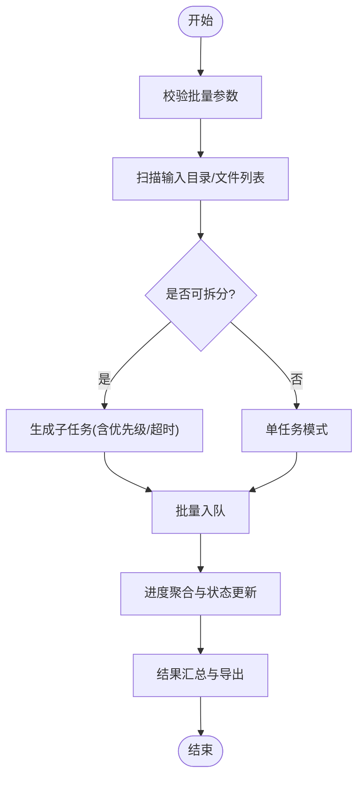
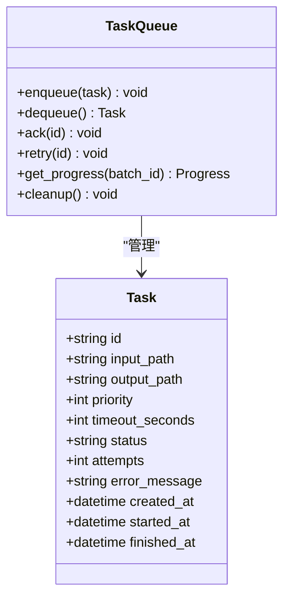
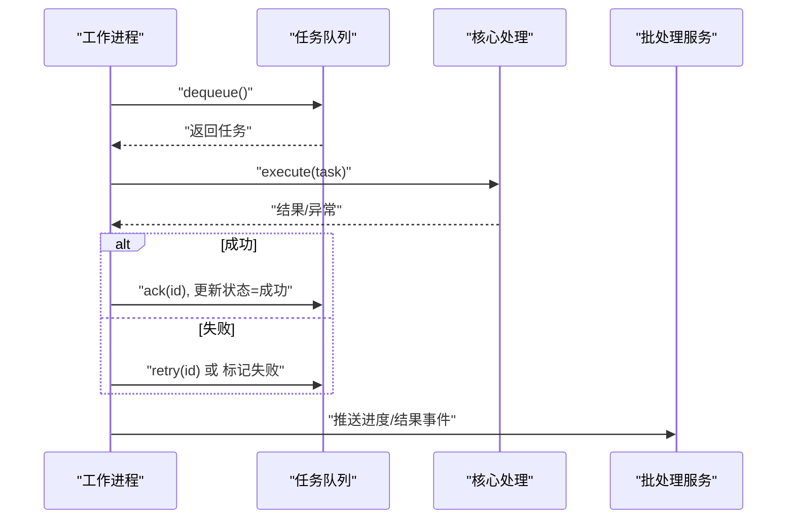
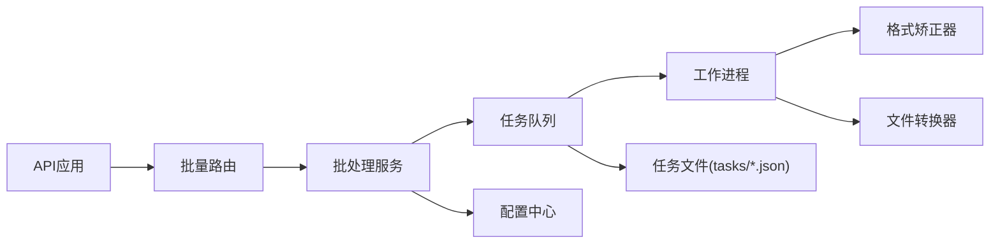

# 批处理服务

<cite>
**本文引用的文件**   
- [src/paper_format_corrector/application/services/batch_service.py](file://src/paper_format_corrector/application/services/batch_service.py)
- [src/paper_format_corrector/infrastructure/queue/task_queue.py](file://src/paper_format_corrector/infrastructure/queue/task_queue.py)
- [src/paper_format_corrector/infrastructure/queue/worker.py](file://src/paper_format_corrector/infrastructure/queue/worker.py)
- [src/paper_format_corrector/core/format_corrector.py](file://src/paper_format_corrector/core/format_corrector.py)
- [src/paper_format_corrector/core/file_converter.py](file://src/paper_format_corrector/core/file_converter.py)
- [src/paper_format_corrector/interfaces/api/routes/batch_routes.py](file://src/paper_format_corrector/interfaces/api/routes/batch_routes.py)
- [src/paper_format_corrector/interfaces/api/app.py](file://src/paper_format_corrector/interfaces/api/app.py)
- [config/config.yaml](file://config/config.yaml)
- [tasks/07427b63-f0ea-4fe4-9066-d2763fec056f.json](file://tasks/07427b63-f0ea-4fe4-9066-d2763fec056f.json)
</cite>

## 目录
1. [简介](#简介)
2. [项目结构](#项目结构)
3. [核心组件](#核心组件)
4. [架构总览](#架构总览)
5. [详细组件分析](#详细组件分析)
6. [依赖关系分析](#依赖关系分析)
7. [性能考虑](#性能考虑)
8. [故障排除指南](#故障排除指南)
9. [结论](#结论)
10. [附录](#附录)

## 简介
本技术文档围绕“批处理服务”展开，聚焦并发处理架构设计、任务队列管理、工作进程调度与资源分配策略；阐述批量文档处理的实现机制（文件扫描、任务分发、进度跟踪、错误恢复）；说明异步处理模式（任务状态管理、回调机制、超时处理）；提供使用示例（批量处理配置、监控接口、结果收集方法）；并给出性能调优参数（并发度控制、内存管理与磁盘I/O优化）以及故障排除指南和最佳实践建议。

## 项目结构
批处理相关代码主要分布在应用层服务、基础设施队列、核心处理逻辑与API路由中：
- 应用层服务：编排批量任务生命周期、协调队列与工作进程
- 基础设施队列：持久化任务队列与Worker调度
- 核心处理：格式矫正与文件转换等具体业务处理
- API路由：对外暴露批量提交、查询、取消与结果获取接口
- 配置：集中式YAML配置，驱动并发度、超时、路径等关键参数

图表来源
- [src/paper_format_corrector/interfaces/api/app.py](file://src/paper_format_corrector/interfaces/api/app.py)
- [src/paper_format_corrector/interfaces/api/routes/batch_routes.py](file://src/paper_format_corrector/interfaces/api/routes/batch_routes.py)
- [src/paper_format_corrector/application/services/batch_service.py](file://src/paper_format_corrector/application/services/batch_service.py)
- [src/paper_format_corrector/infrastructure/queue/task_queue.py](file://src/paper_format_corrector/infrastructure/queue/task_queue.py)
- [src/paper_format_corrector/infrastructure/queue/worker.py](file://src/paper_format_corrector/infrastructure/queue/worker.py)
- [src/paper_format_corrector/core/format_corrector.py](file://src/paper_format_corrector/core/format_corrector.py)
- [src/paper_format_corrector/core/file_converter.py](file://src/paper_format_corrector/core/file_converter.py)
- [config/config.yaml](file://config/config.yaml)
- [tasks/07427b63-f0ea-4fe4-9066-d2763fec056f.json](file://tasks/07427b63-f0ea-4fe4-9066-d2763fec056f.json)

章节来源
- [src/paper_format_corrector/interfaces/api/app.py](file://src/paper_format_corrector/interfaces/api/app.py)
- [src/paper_format_corrector/interfaces/api/routes/batch_routes.py](file://src/paper_format_corrector/interfaces/api/routes/batch_routes.py)
- [src/paper_format_corrector/application/services/batch_service.py](file://src/paper_format_corrector/application/services/batch_service.py)
- [src/paper_format_corrector/infrastructure/queue/task_queue.py](file://src/paper_format_corrector/infrastructure/queue/task_queue.py)
- [src/paper_format_corrector/infrastructure/queue/worker.py](file://src/paper_format_corrector/infrastructure/queue/worker.py)
- [src/paper_format_corrector/core/format_corrector.py](file://src/paper_format_corrector/core/format_corrector.py)
- [src/paper_format_corrector/core/file_converter.py](file://src/paper_format_corrector/core/file_converter.py)
- [config/config.yaml](file://config/config.yaml)
- [tasks/07427b63-f0ea-4fe4-9066-d2763fec056f.json](file://tasks/07427b63-f0ea-4fe4-9066-d2763fec056f.json)

## 核心组件
- 批处理服务：负责批量任务的创建、拆分、入队、进度聚合、结果汇总与异常上报
- 任务队列：提供任务持久化、优先级、重试、去重与消费能力
- 工作进程：从队列拉取任务，执行核心处理逻辑，更新任务状态与产出结果
- 格式矫正器与文件转换器：封装具体的文档处理算法与IO操作
- API路由与应用：暴露HTTP接口，接收批量提交请求，返回任务ID与查询入口
- 配置中心：集中管理并发度、超时、路径、重试策略等运行参数

章节来源
- [src/paper_format_corrector/application/services/batch_service.py](file://src/paper_format_corrector/application/services/batch_service.py)
- [src/paper_format_corrector/infrastructure/queue/task_queue.py](file://src/paper_format_corrector/infrastructure/queue/task_queue.py)
- [src/paper_format_corrector/infrastructure/queue/worker.py](file://src/paper_format_corrector/infrastructure/queue/worker.py)
- [src/paper_format_corrector/core/format_corrector.py](file://src/paper_format_corrector/core/format_corrector.py)
- [src/paper_format_corrector/core/file_converter.py](file://src/paper_format_corrector/core/file_converter.py)
- [src/paper_format_corrector/interfaces/api/routes/batch_routes.py](file://src/paper_format_corrector/interfaces/api/routes/batch_routes.py)
- [src/paper_format_corrector/interfaces/api/app.py](file://src/paper_format_corrector/interfaces/api/app.py)
- [config/config.yaml](file://config/config.yaml)

## 架构总览
批处理服务采用“生产者-消费者”模型：API作为生产者将批量任务拆分为子任务并入队；队列持久化任务元数据；多个Worker并行消费任务，调用核心处理模块完成文档格式化与转换；最终由批处理服务聚合结果并通过API返回。

图表来源
- [src/paper_format_corrector/interfaces/api/app.py](file://src/paper_format_corrector/interfaces/api/app.py)
- [src/paper_format_corrector/interfaces/api/routes/batch_routes.py](file://src/paper_format_corrector/interfaces/api/routes/batch_routes.py)
- [src/paper_format_corrector/application/services/batch_service.py](file://src/paper_format_corrector/application/services/batch_service.py)
- [src/paper_format_corrector/infrastructure/queue/task_queue.py](file://src/paper_format_corrector/infrastructure/queue/task_queue.py)
- [src/paper_format_corrector/infrastructure/queue/worker.py](file://src/paper_format_corrector/infrastructure/queue/worker.py)
- [src/paper_format_corrector/core/format_corrector.py](file://src/paper_format_corrector/core/format_corrector.py)
- [src/paper_format_corrector/core/file_converter.py](file://src/paper_format_corrector/core/file_converter.py)
- [tasks/07427b63-f0ea-4fe4-9066-d2763fec056f.json](file://tasks/07427b63-f0ea-4fe4-9066-d2763fec056f.json)

## 详细组件分析

### 批处理服务（BatchService）
职责
- 接收批量提交请求，进行输入校验与文件扫描
- 将大任务拆分为可并行的子任务，设置优先级与超时
- 维护批量任务的生命周期与进度聚合
- 处理失败子任务的重试与补偿
- 汇总结果并提供查询接口

关键流程
- 文件扫描：遍历输入目录，过滤目标格式，生成待处理清单
- 任务分发：为每个文件生成任务项，写入队列并持久化
- 进度跟踪：按子任务状态计算整体进度百分比
- 错误恢复：对失败任务按策略重试或标记不可恢复

图表来源
- [src/paper_format_corrector/application/services/batch_service.py](file://src/paper_format_corrector/application/services/batch_service.py)

章节来源
- [src/paper_format_corrector/application/services/batch_service.py](file://src/paper_format_corrector/application/services/batch_service.py)

### 任务队列（TaskQueue）
职责
- 提供任务持久化存储（JSON文件），支持高可用与断点续跑
- 管理任务状态机（待处理、进行中、成功、失败、重试）
- 支持优先级队列与去重策略
- 提供拉取、确认、重试与清理接口

数据结构要点
- 任务标识：唯一ID
- 元数据：输入路径、输出路径、模板、规则、优先级、超时时间
- 状态：当前状态、尝试次数、错误信息、结果摘要
- 时间戳：创建、开始、完成时间

图表来源
- [src/paper_format_corrector/infrastructure/queue/task_queue.py](file://src/paper_format_corrector/infrastructure/queue/task_queue.py)
- [tasks/07427b63-f0ea-4fe4-9066-d2763fec056f.json](file://tasks/07427b63-f0ea-4fe4-9066-d2763fec056f.json)

章节来源
- [src/paper_format_corrector/infrastructure/queue/task_queue.py](file://src/paper_format_corrector/infrastructure/queue/task_queue.py)
- [tasks/07427b63-f0ea-4fe4-9066-d2763fec056f.json](file://tasks/07427b63-f0ea-4fe4-9066-d2763fec056f.json)

### 工作进程（Worker）
职责
- 循环从队列拉取任务，设置执行上下文（超时、日志、指标）
- 调用核心处理模块执行格式矫正与文件转换
- 捕获异常并记录错误信息，触发重试或失败分支
- 更新任务状态与结果，确保幂等性

处理流程
- 拉取任务：根据优先级与可用性选择任务
- 执行处理：加载模板与规则，执行转换与矫正
- 结果落盘：写出输出文件，保存结果摘要
- 状态同步：更新任务状态，通知批处理服务聚合进度

图表来源
- [src/paper_format_corrector/infrastructure/queue/worker.py](file://src/paper_format_corrector/infrastructure/queue/worker.py)
- [src/paper_format_corrector/application/services/batch_service.py](file://src/paper_format_corrector/application/services/batch_service.py)

章节来源
- [src/paper_format_corrector/infrastructure/queue/worker.py](file://src/paper_format_corrector/infrastructure/queue/worker.py)
- [src/paper_format_corrector/application/services/batch_service.py](file://src/paper_format_corrector/application/services/batch_service.py)

### 核心处理（格式矫正与文件转换）
职责
- 格式矫正器：依据模板与规则对文档结构、样式、引用等进行修正
- 文件转换器：负责不同格式的读写与中间表示的转换

关键点
- 输入验证：检查文件格式、大小、编码
- 增量处理：避免重复处理已完成的片段
- 资源释放：及时关闭文件句柄，减少内存占用

章节来源
- [src/paper_format_corrector/core/format_corrector.py](file://src/paper_format_corrector/core/format_corrector.py)
- [src/paper_format_corrector/core/file_converter.py](file://src/paper_format_corrector/core/file_converter.py)

### API与路由（批量接口）
职责
- 暴露批量提交、进度查询、结果下载、取消任务等HTTP接口
- 参数校验与权限控制
- 响应标准化与错误码规范

典型接口
- 提交批量任务：返回批次ID
- 查询进度：返回批次内各子任务状态与整体进度
- 获取结果：下载输出文件或结果摘要
- 取消任务：停止未开始的任务，保留已处理结果

章节来源
- [src/paper_format_corrector/interfaces/api/routes/batch_routes.py](file://src/paper_format_corrector/interfaces/api/routes/batch_routes.py)
- [src/paper_format_corrector/interfaces/api/app.py](file://src/paper_format_corrector/interfaces/api/app.py)

## 依赖关系分析
- 低耦合分层：API层仅依赖路由与服务，服务依赖队列与核心处理，核心处理不反向依赖上层
- 外部依赖：文件系统用于任务持久化与结果输出；配置中心提供运行时参数
- 潜在风险：队列与Worker之间通过文件系统持久化，需关注锁竞争与一致性

图表来源
- [src/paper_format_corrector/interfaces/api/app.py](file://src/paper_format_corrector/interfaces/api/app.py)
- [src/paper_format_corrector/interfaces/api/routes/batch_routes.py](file://src/paper_format_corrector/interfaces/api/routes/batch_routes.py)
- [src/paper_format_corrector/application/services/batch_service.py](file://src/paper_format_corrector/application/services/batch_service.py)
- [src/paper_format_corrector/infrastructure/queue/task_queue.py](file://src/paper_format_corrector/infrastructure/queue/task_queue.py)
- [src/paper_format_corrector/infrastructure/queue/worker.py](file://src/paper_format_corrector/infrastructure/queue/worker.py)
- [src/paper_format_corrector/core/format_corrector.py](file://src/paper_format_corrector/core/format_corrector.py)
- [src/paper_format_corrector/core/file_converter.py](file://src/paper_format_corrector/core/file_converter.py)
- [config/config.yaml](file://config/config.yaml)
- [tasks/07427b63-f0ea-4fe4-9066-d2763fec056f.json](file://tasks/07427b63-f0ea-4fe4-9066-d2763fec056f.json)

章节来源
- [src/paper_format_corrector/interfaces/api/app.py](file://src/paper_format_corrector/interfaces/api/app.py)
- [src/paper_format_corrector/interfaces/api/routes/batch_routes.py](file://src/paper_format_corrector/interfaces/api/routes/batch_routes.py)
- [src/paper_format_corrector/application/services/batch_service.py](file://src/paper_format_corrector/application/services/batch_service.py)
- [src/paper_format_corrector/infrastructure/queue/task_queue.py](file://src/paper_format_corrector/infrastructure/queue/task_queue.py)
- [src/paper_format_corrector/infrastructure/queue/worker.py](file://src/paper_format_corrector/infrastructure/queue/worker.py)
- [src/paper_format_corrector/core/format_corrector.py](file://src/paper_format_corrector/core/format_corrector.py)
- [src/paper_format_corrector/core/file_converter.py](file://src/paper_format_corrector/core/file_converter.py)
- [config/config.yaml](file://config/config.yaml)
- [tasks/07427b63-f0ea-4fe4-9066-d2763fec056f.json](file://tasks/07427b63-f0ea-4fe4-9066-d2763fec056f.json)

## 性能考虑
- 并发度控制
  - 调整Worker数量以匹配CPU核数与磁盘吞吐
  - 针对I/O密集型场景可适当提高并发度，但需评估磁盘瓶颈
- 内存管理
  - 限制单次任务最大输入大小，避免OOM
  - 使用流式读写与分块处理降低峰值内存
- 磁盘I/O优化
  - 将任务持久化与结果输出放置在不同磁盘分区，减少争用
  - 合理设置缓存与临时目录，定期清理
- 超时与重试
  - 为长耗时任务设置合理超时，避免僵尸任务
  - 指数退避重试，防止雪崩效应
- 监控与度量
  - 采集队列长度、Worker利用率、任务成功率与平均耗时
  - 基于指标动态扩缩容Worker

[本节为通用指导，无需特定文件来源]

## 故障排除指南
常见问题与定位步骤
- 任务堆积
  - 检查Worker是否正常运行，查看队列拉取与确认日志
  - 评估并发度与任务复杂度是否匹配
- 任务失败
  - 查看任务错误信息与重试次数，定位具体失败阶段
  - 检查输入文件完整性与权限
- 进度不更新
  - 确认Worker是否正确更新任务状态
  - 检查批处理服务聚合逻辑与API响应
- 结果缺失
  - 核对输出路径与权限
  - 检查文件写入是否被中断或覆盖

章节来源
- [src/paper_format_corrector/infrastructure/queue/task_queue.py](file://src/paper_format_corrector/infrastructure/queue/task_queue.py)
- [src/paper_format_corrector/infrastructure/queue/worker.py](file://src/paper_format_corrector/infrastructure/queue/worker.py)
- [src/paper_format_corrector/application/services/batch_service.py](file://src/paper_format_corrector/application/services/batch_service.py)
- [src/paper_format_corrector/interfaces/api/routes/batch_routes.py](file://src/paper_format_corrector/interfaces/api/routes/batch_routes.py)

## 结论
批处理服务通过清晰的分层架构与持久化队列实现了高可靠、可扩展的批量文档处理能力。结合合理的并发度、超时与重试策略，可在复杂生产环境中稳定运行。建议持续完善监控与告警体系，并结合业务负载动态调优参数，以获得最佳性能与稳定性。

[本节为总结性内容，无需特定文件来源]

## 附录

### 使用示例
- 批量处理配置
  - 在配置文件中设置并发度、超时、输入输出路径、重试策略等参数
  - 参考配置路径：[config/config.yaml](file://config/config.yaml)
- 提交批量任务
  - 调用批量提交接口，传入输入目录或文件列表、模板与规则
  - 接口定义参考：[src/paper_format_corrector/interfaces/api/routes/batch_routes.py](file://src/paper_format_corrector/interfaces/api/routes/batch_routes.py)
- 监控接口
  - 查询批次进度与子任务状态，支持分页与过滤
  - 接口定义参考：[src/paper_format_corrector/interfaces/api/routes/batch_routes.py](file://src/paper_format_corrector/interfaces/api/routes/batch_routes.py)
- 结果收集
  - 下载输出文件或结果摘要，支持批量打包
  - 接口定义参考：[src/paper_format_corrector/interfaces/api/routes/batch_routes.py](file://src/paper_format_corrector/interfaces/api/routes/batch_routes.py)

章节来源
- [config/config.yaml](file://config/config.yaml)
- [src/paper_format_corrector/interfaces/api/routes/batch_routes.py](file://src/paper_format_corrector/interfaces/api/routes/batch_routes.py)