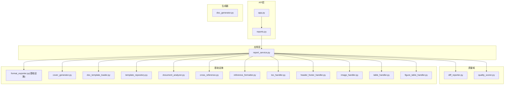
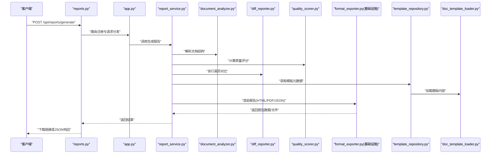
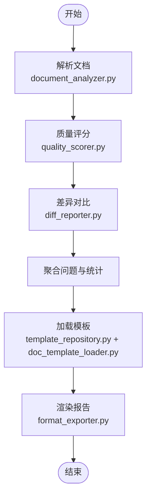
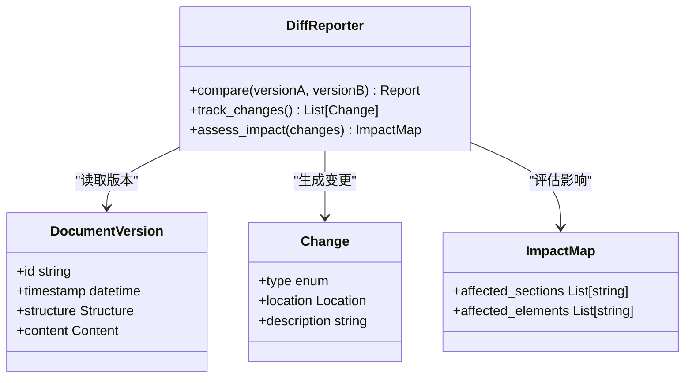
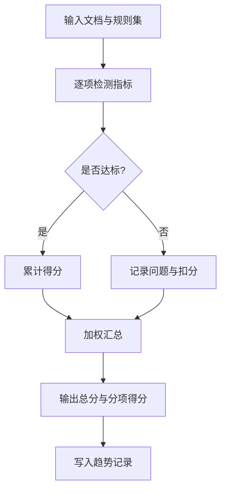
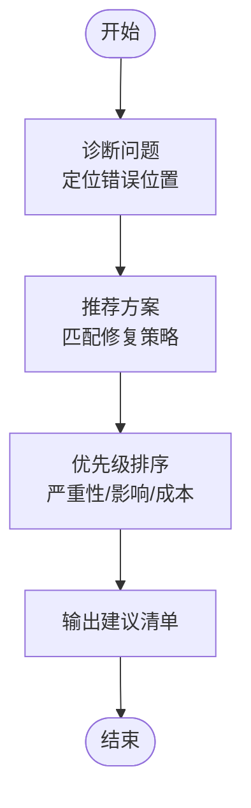
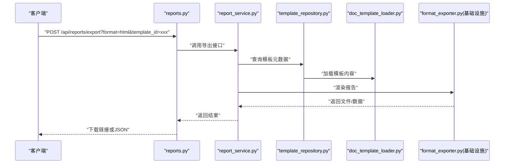
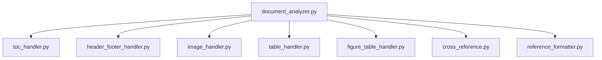
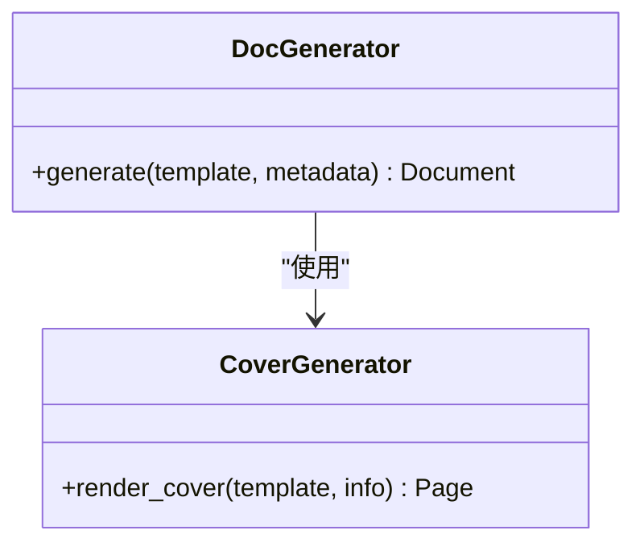
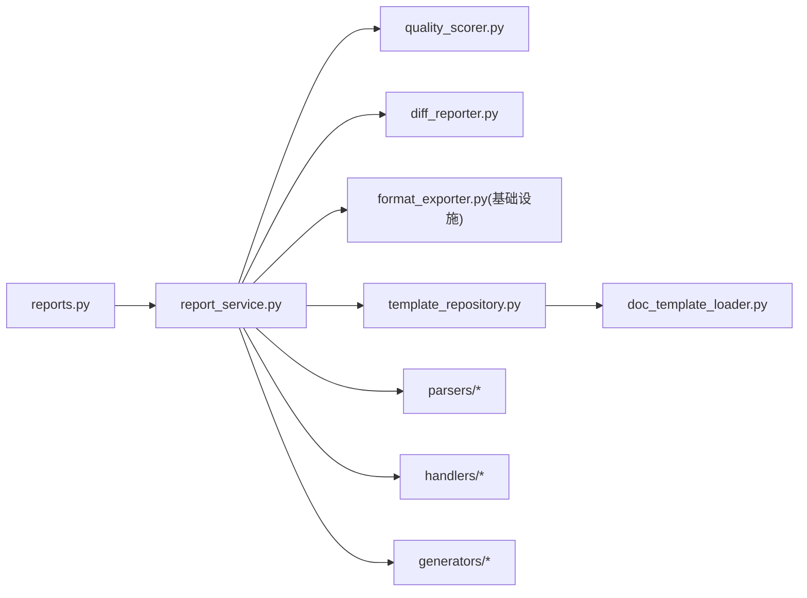

# 报告生成系统

<cite>
**本文引用的文件**   
- [src/paper_format_corrector/application/services/report_service.py](file://src/paper_format_corrector/application/services/report_service.py)
- [src/paper_format_corrector/quality/diff_reporter.py](file://src/paper_format_corrector/quality/diff_reporter.py)
- [src/paper_format_corrector/quality/quality_scorer.py](file://src/paper_format_corrector/quality/quality_scorer.py)
- [src/paper_format_corrector/core/format_exporter.py](file://src/paper_format_corrector/core/format_exporter.py)
- [src/paper_format_corrector/interfaces/api/routes/reports.py](file://src/paper_format_corrector/interfaces/api/routes/reports.py)
- [src/paper_format_corrector/interfaces/api/app.py](file://src/paper_format_corrector/interfaces/api/app.py)
- [src/paper_format_corrector/infrastructure/exporters/format_exporter.py](file://src/paper_format_corrector/infrastructure/exporters/format_exporter.py)
- [src/paper_format_corrector/infrastructure/generators/cover_generator.py](file://src/paper_format_corrector/infrastructure/generators/cover_generator.py)
- [src/paper_format_corrector/generators/doc_generator.py](file://src/paper_format_corrector/generators/doc_generator.py)
- [src/paper_format_corrector/parsers/document_analyzer.py](file://src/paper_format_corrector/parsers/document_analyzer.py)
- [src/paper_format_corrector/parsers/cross_reference.py](file://src/paper_format_corrector/parsers/cross_reference.py)
- [src/paper_format_corrector/parsers/reference_formatter.py](file://src/paper_format_corrector/parsers/reference_formatter.py)
- [src/paper_format_corrector/handlers/toc_handler.py](file://src/paper_format_corrector/handlers/toc_handler.py)
- [src/paper_format_corrector/handlers/header_footer_handler.py](file://src/paper_format_corrector/handlers/header_footer_handler.py)
- [src/paper_format_corrector/handlers/image_handler.py](file://src/paper_format_corrector/handlers/image_handler.py)
- [src/paper_format_corrector/handlers/table_handler.py](file://src/paper_format_corrector/handlers/table_handler.py)
- [src/paper_format_corrector/handlers/figure_table_handler.py](file://src/paper_format_corrector/handlers/figure_table_handler.py)
- [src/paper_format_corrector/infra/template_repository.py](file://src/paper_format_corrector/infra/template_repository.py)
- [src/paper_format_corrector/infra/doc_template_loader.py](file://src/paper_format_corrector/infra/doc_template_loader.py)
- [examples/sample_template.yaml](file://examples/sample_template.yaml)
- [tests/test_report_service.py](file://tests/test_report_service.py)
</cite>

## 目录
1. [简介](#简介)
2. [项目结构](#项目结构)
3. [核心组件](#核心组件)
4. [架构总览](#架构总览)
5. [详细组件分析](#详细组件分析)
6. [依赖关系分析](#依赖关系分析)
7. [性能考量](#性能考量)
8. [故障排查指南](#故障排查指南)
9. [结论](#结论)
10. [附录](#附录)

## 简介
本技术文档围绕“报告生成系统”展开，聚焦以下能力：
- 详细检查报告的生成机制：问题发现、分类统计与可视化展示
- 差异对比分析：版本比较、变更追踪与影响范围评估
- 修复建议生成算法：问题诊断、解决方案推荐与优先级排序
- 报告导出API：支持HTML、PDF、JSON及自定义模板
- 质量评分系统：指标定义、权重配置与趋势分析
- 定制化与集成示例：结合现有接口与模板进行二次开发

## 项目结构
系统采用分层与领域驱动相结合的组织方式：
- 应用层服务：编排报告生成流程（如 report_service）
- 质量域：规则引擎、评分器、差异报告器
- 基础设施：导出器、模板仓库、文档解析与处理器
- API层：对外暴露报告相关接口
- 生成器与处理器：负责封面、目录、图表、图片等元素的组装与渲染

图示来源
- [src/paper_format_corrector/application/services/report_service.py](file://src/paper_format_corrector/application/services/report_service.py)
- [src/paper_format_corrector/quality/diff_reporter.py](file://src/paper_format_corrector/quality/diff_reporter.py)
- [src/paper_format_corrector/quality/quality_scorer.py](file://src/paper_format_corrector/quality/quality_scorer.py)
- [src/paper_format_corrector/infrastructure/exporters/format_exporter.py](file://src/paper_format_corrector/infrastructure/exporters/format_exporter.py)
- [src/paper_format_corrector/infrastructure/generators/cover_generator.py](file://src/paper_format_corrector/infrastructure/generators/cover_generator.py)
- [src/paper_format_corrector/infra/doc_template_loader.py](file://src/paper_format_corrector/infra/doc_template_loader.py)
- [src/paper_format_corrector/infra/template_repository.py](file://src/paper_format_corrector/infra/template_repository.py)
- [src/paper_format_corrector/parsers/document_analyzer.py](file://src/paper_format_corrector/parsers/document_analyzer.py)
- [src/paper_format_corrector/parsers/cross_reference.py](file://src/paper_format_corrector/parsers/cross_reference.py)
- [src/paper_format_corrector/parsers/reference_formatter.py](file://src/paper_format_corrector/parsers/reference_formatter.py)
- [src/paper_format_corrector/handlers/toc_handler.py](file://src/paper_format_corrector/handlers/toc_handler.py)
- [src/paper_format_corrector/handlers/header_footer_handler.py](file://src/paper_format_corrector/handlers/header_footer_handler.py)
- [src/paper_format_corrector/handlers/image_handler.py](file://src/paper_format_corrector/handlers/image_handler.py)
- [src/paper_format_corrector/handlers/table_handler.py](file://src/paper_format_corrector/handlers/table_handler.py)
- [src/paper_format_corrector/handlers/figure_table_handler.py](file://src/paper_format_corrector/handlers/figure_table_handler.py)
- [src/paper_format_corrector/generators/doc_generator.py](file://src/paper_format_corrector/generators/doc_generator.py)
- [src/paper_format_corrector/interfaces/api/app.py](file://src/paper_format_corrector/interfaces/api/app.py)
- [src/paper_format_corrector/interfaces/api/routes/reports.py](file://src/paper_format_corrector/interfaces/api/routes/reports.py)

章节来源
- [src/paper_format_corrector/application/services/report_service.py](file://src/paper_format_corrector/application/services/report_service.py)
- [src/paper_format_corrector/interfaces/api/routes/reports.py](file://src/paper_format_corrector/interfaces/api/routes/reports.py)
- [src/paper_format_corrector/interfaces/api/app.py](file://src/paper_format_corrector/interfaces/api/app.py)

## 核心组件
- 报告服务：协调解析、规则检测、评分、差异分析与导出，输出结构化报告数据
- 差异报告器：对多版本文档进行比对，识别新增、删除、修改项并计算影响范围
- 质量评分器：基于指标与权重计算综合得分，支持历史趋势分析
- 格式导出器：将报告数据渲染为HTML/PDF/JSON，支持自定义模板
- 模板仓库与加载器：管理模板元数据与内容，提供按需加载能力
- 文档解析与处理器：抽取章节、交叉引用、参考文献、目录、页眉页脚、图片表格等元素
- 生成器：组合封面、目录等页面元素，形成最终文档或报告

章节来源
- [src/paper_format_corrector/application/services/report_service.py](file://src/paper_format_corrector/application/services/report_service.py)
- [src/paper_format_corrector/quality/diff_reporter.py](file://src/paper_format_corrector/quality/diff_reporter.py)
- [src/paper_format_corrector/quality/quality_scorer.py](file://src/paper_format_corrector/quality/quality_scorer.py)
- [src/paper_format_corrector/infrastructure/exporters/format_exporter.py](file://src/paper_format_corrector/infrastructure/exporters/format_exporter.py)
- [src/paper_format_corrector/infra/template_repository.py](file://src/paper_format_corrector/infra/template_repository.py)
- [src/paper_format_corrector/infra/doc_template_loader.py](file://src/paper_format_corrector/infra/doc_template_loader.py)
- [src/paper_format_corrector/parsers/document_analyzer.py](file://src/paper_format_corrector/parsers/document_analyzer.py)
- [src/paper_format_corrector/parsers/cross_reference.py](file://src/paper_format_corrector/parsers/cross_reference.py)
- [src/paper_format_corrector/parsers/reference_formatter.py](file://src/paper_format_corrector/parsers/reference_formatter.py)
- [src/paper_format_corrector/handlers/toc_handler.py](file://src/paper_format_corrector/handlers/toc_handler.py)
- [src/paper_format_corrector/handlers/header_footer_handler.py](file://src/paper_format_corrector/handlers/header_footer_handler.py)
- [src/paper_format_corrector/handlers/image_handler.py](file://src/paper_format_corrector/handlers/image_handler.py)
- [src/paper_format_corrector/handlers/table_handler.py](file://src/paper_format_corrector/handlers/table_handler.py)
- [src/paper_format_corrector/handlers/figure_table_handler.py](file://src/paper_format_corrector/handlers/figure_table_handler.py)
- [src/paper_format_corrector/generators/doc_generator.py](file://src/paper_format_corrector/generators/doc_generator.py)

## 架构总览
报告生成的端到端流程如下：
- 输入：文档路径、模板标识、导出格式、质量阈值等参数
- 解析与抽取：章节、段落、图片、表格、交叉引用、参考文献等
- 规则检测与评分：依据规则集发现问题、计算质量分数
- 差异分析：对比历史版本，生成变更清单与影响范围
- 报告组装：按模板渲染HTML/PDF/JSON，包含问题列表、统计图表与建议
- 输出：报告文件与结构化数据

图示来源
- [src/paper_format_corrector/interfaces/api/routes/reports.py](file://src/paper_format_corrector/interfaces/api/routes/reports.py)
- [src/paper_format_corrector/interfaces/api/app.py](file://src/paper_format_corrector/interfaces/api/app.py)
- [src/paper_format_corrector/application/services/report_service.py](file://src/paper_format_corrector/application/services/report_service.py)
- [src/paper_format_corrector/parsers/document_analyzer.py](file://src/paper_format_corrector/parsers/document_analyzer.py)
- [src/paper_format_corrector/quality/diff_reporter.py](file://src/paper_format_corrector/quality/diff_reporter.py)
- [src/paper_format_corrector/quality/quality_scorer.py](file://src/paper_format_corrector/quality/quality_scorer.py)
- [src/paper_format_corrector/infrastructure/exporters/format_exporter.py](file://src/paper_format_corrector/infrastructure/exporters/format_exporter.py)
- [src/paper_format_corrector/infra/template_repository.py](file://src/paper_format_corrector/infra/template_repository.py)
- [src/paper_format_corrector/infra/doc_template_loader.py](file://src/paper_format_corrector/infra/doc_template_loader.py)

## 详细组件分析

### 报告服务（Report Service）
职责：
- 编排文档解析、规则检测、评分、差异分析与导出
- 聚合问题清单、分类统计、可视化数据与修复建议
- 根据模板与导出格式生成最终报告

关键流程要点：
- 解析阶段：调用文档分析器提取结构与元素
- 质量阶段：调用评分器计算指标与总分
- 差异阶段：调用差异报告器进行版本对比
- 导出阶段：调用导出器渲染为指定格式

图示来源
- [src/paper_format_corrector/application/services/report_service.py](file://src/paper_format_corrector/application/services/report_service.py)
- [src/paper_format_corrector/parsers/document_analyzer.py](file://src/paper_format_corrector/parsers/document_analyzer.py)
- [src/paper_format_corrector/quality/quality_scorer.py](file://src/paper_format_corrector/quality/quality_scorer.py)
- [src/paper_format_corrector/quality/diff_reporter.py](file://src/paper_format_corrector/quality/diff_reporter.py)
- [src/paper_format_corrector/infra/template_repository.py](file://src/paper_format_corrector/infra/template_repository.py)
- [src/paper_format_corrector/infra/doc_template_loader.py](file://src/paper_format_corrector/infra/doc_template_loader.py)
- [src/paper_format_corrector/infrastructure/exporters/format_exporter.py](file://src/paper_format_corrector/infrastructure/exporters/format_exporter.py)

章节来源
- [src/paper_format_corrector/application/services/report_service.py](file://src/paper_format_corrector/application/services/report_service.py)

### 差异对比分析（Diff Reporter）
功能：
- 版本比较：对比两版文档的结构与内容差异
- 变更追踪：记录新增、删除、修改的条目
- 影响范围评估：定位受影响的章节、图表、参考文献等

图示来源
- [src/paper_format_corrector/quality/diff_reporter.py](file://src/paper_format_corrector/quality/diff_reporter.py)

章节来源
- [src/paper_format_corrector/quality/diff_reporter.py](file://src/paper_format_corrector/quality/diff_reporter.py)

### 质量评分系统（Quality Scorer）
逻辑：
- 指标定义：包括格式规范、结构完整性、交叉引用一致性、参考文献规范性等
- 权重配置：通过模板或配置文件设定各指标权重
- 趋势分析：记录历史得分，计算变化趋势与波动

图示来源
- [src/paper_format_corrector/quality/quality_scorer.py](file://src/paper_format_corrector/quality/quality_scorer.py)

章节来源
- [src/paper_format_corrector/quality/quality_scorer.py](file://src/paper_format_corrector/quality/quality_scorer.py)

### 修复建议生成算法
步骤：
- 问题诊断：基于检测结果定位具体错误位置与原因
- 解决方案推荐：匹配规则库中的修复策略
- 优先级排序：依据严重性、影响范围与修复成本排序

图示来源
- [src/paper_format_corrector/application/services/report_service.py](file://src/paper_format_corrector/application/services/report_service.py)
- [src/paper_format_corrector/quality/quality_scorer.py](file://src/paper_format_corrector/quality/quality_scorer.py)

章节来源
- [src/paper_format_corrector/application/services/report_service.py](file://src/paper_format_corrector/application/services/report_service.py)
- [src/paper_format_corrector/quality/quality_scorer.py](file://src/paper_format_corrector/quality/quality_scorer.py)

### 报告导出API
支持的格式：
- HTML：适合在线预览与交互式查看
- PDF：适合打印与归档
- JSON：便于系统集成与二次处理

自定义模板：
- 通过模板仓库与加载器管理模板元数据与内容
- 在导出时选择模板ID，渲染对应布局与样式

图示来源
- [src/paper_format_corrector/interfaces/api/routes/reports.py](file://src/paper_format_corrector/interfaces/api/routes/reports.py)
- [src/paper_format_corrector/application/services/report_service.py](file://src/paper_format_corrector/application/services/report_service.py)
- [src/paper_format_corrector/infra/template_repository.py](file://src/paper_format_corrector/infra/template_repository.py)
- [src/paper_format_corrector/infra/doc_template_loader.py](file://src/paper_format_corrector/infra/doc_template_loader.py)
- [src/paper_format_corrector/infrastructure/exporters/format_exporter.py](file://src/paper_format_corrector/infrastructure/exporters/format_exporter.py)

章节来源
- [src/paper_format_corrector/interfaces/api/routes/reports.py](file://src/paper_format_corrector/interfaces/api/routes/reports.py)
- [src/paper_format_corrector/infrastructure/exporters/format_exporter.py](file://src/paper_format_corrector/infrastructure/exporters/format_exporter.py)

### 可视化展示
- 问题分布：按类别统计问题数量与占比
- 质量趋势：展示历史评分曲线与波动
- 差异热力：高亮变更密集区域与受影响元素

实现要点：
- 使用导出器将统计数据嵌入HTML模板
- 在JSON中保留原始数据供前端图表库渲染
- 在PDF中插入静态图表或摘要表格

章节来源
- [src/paper_format_corrector/infrastructure/exporters/format_exporter.py](file://src/paper_format_corrector/infrastructure/exporters/format_exporter.py)
- [src/paper_format_corrector/application/services/report_service.py](file://src/paper_format_corrector/application/services/report_service.py)

### 文档解析与处理器
- 文档分析器：抽取章节、段落、标题层级等结构信息
- 交叉引用：校验引用一致性与完整性
- 参考文献格式化：统一格式与顺序
- 目录、页眉页脚、图片、表格、图文混排：由相应处理器负责

图示来源
- [src/paper_format_corrector/parsers/document_analyzer.py](file://src/paper_format_corrector/parsers/document_analyzer.py)
- [src/paper_format_corrector/handlers/toc_handler.py](file://src/paper_format_corrector/handlers/toc_handler.py)
- [src/paper_format_corrector/handlers/header_footer_handler.py](file://src/paper_format_corrector/handlers/header_footer_handler.py)
- [src/paper_format_corrector/handlers/image_handler.py](file://src/paper_format_corrector/handlers/image_handler.py)
- [src/paper_format_corrector/handlers/table_handler.py](file://src/paper_format_corrector/handlers/table_handler.py)
- [src/paper_format_corrector/handlers/figure_table_handler.py](file://src/paper_format_corrector/handlers/figure_table_handler.py)
- [src/paper_format_corrector/parsers/cross_reference.py](file://src/paper_format_corrector/parsers/cross_reference.py)
- [src/paper_format_corrector/parsers/reference_formatter.py](file://src/paper_format_corrector/parsers/reference_formatter.py)

章节来源
- [src/paper_format_corrector/parsers/document_analyzer.py](file://src/paper_format_corrector/parsers/document_analyzer.py)
- [src/paper_format_corrector/parsers/cross_reference.py](file://src/paper_format_corrector/parsers/cross_reference.py)
- [src/paper_format_corrector/parsers/reference_formatter.py](file://src/paper_format_corrector/parsers/reference_formatter.py)
- [src/paper_format_corrector/handlers/toc_handler.py](file://src/paper_format_corrector/handlers/toc_handler.py)
- [src/paper_format_corrector/handlers/header_footer_handler.py](file://src/paper_format_corrector/handlers/header_footer_handler.py)
- [src/paper_format_corrector/handlers/image_handler.py](file://src/paper_format_corrector/handlers/image_handler.py)
- [src/paper_format_corrector/handlers/table_handler.py](file://src/paper_format_corrector/handlers/table_handler.py)
- [src/paper_format_corrector/handlers/figure_table_handler.py](file://src/paper_format_corrector/handlers/figure_table_handler.py)

### 生成器与封面
- 文档生成器：组合封面、目录、正文等页面元素
- 封面生成器：根据模板与元数据生成封面页

图示来源
- [src/paper_format_corrector/generators/doc_generator.py](file://src/paper_format_corrector/generators/doc_generator.py)
- [src/paper_format_corrector/infrastructure/generators/cover_generator.py](file://src/paper_format_corrector/infrastructure/generators/cover_generator.py)

章节来源
- [src/paper_format_corrector/generators/doc_generator.py](file://src/paper_format_corrector/generators/doc_generator.py)
- [src/paper_format_corrector/infrastructure/generators/cover_generator.py](file://src/paper_format_corrector/infrastructure/generators/cover_generator.py)

## 依赖关系分析
- 应用层依赖质量域与基础设施模块
- API层仅暴露必要接口，内部委托给服务层
- 模板仓库与加载器解耦模板管理与内容加载
- 导出器与生成器协作完成最终输出

图示来源
- [src/paper_format_corrector/interfaces/api/routes/reports.py](file://src/paper_format_corrector/interfaces/api/routes/reports.py)
- [src/paper_format_corrector/application/services/report_service.py](file://src/paper_format_corrector/application/services/report_service.py)
- [src/paper_format_corrector/quality/quality_scorer.py](file://src/paper_format_corrector/quality/quality_scorer.py)
- [src/paper_format_corrector/quality/diff_reporter.py](file://src/paper_format_corrector/quality/diff_reporter.py)
- [src/paper_format_corrector/infrastructure/exporters/format_exporter.py](file://src/paper_format_corrector/infrastructure/exporters/format_exporter.py)
- [src/paper_format_corrector/infra/template_repository.py](file://src/paper_format_corrector/infra/template_repository.py)
- [src/paper_format_corrector/infra/doc_template_loader.py](file://src/paper_format_corrector/infra/doc_template_loader.py)

章节来源
- [src/paper_format_corrector/interfaces/api/routes/reports.py](file://src/paper_format_corrector/interfaces/api/routes/reports.py)
- [src/paper_format_corrector/application/services/report_service.py](file://src/paper_format_corrector/application/services/report_service.py)

## 性能考量
- 解析与处理并行化：对独立元素（图片、表格、章节）进行并发处理
- 增量差异：缓存上一版本指纹，减少全量比对开销
- 模板预加载：启动时预热常用模板，降低首次渲染延迟
- 导出优化：大文档分块渲染，避免内存峰值过高

## 故障排查指南
常见问题与定位：
- 模板未找到或加载失败：检查模板仓库与加载器配置
- 导出格式不支持：确认导出器实现与参数
- 评分异常：核对指标权重与规则集
- 差异对比为空：确认版本ID与时间戳是否正确

排查步骤：
- 启用日志并捕获异常堆栈
- 验证输入参数与模板ID
- 逐步断点至解析、评分、差异、导出阶段
- 使用测试用例复现与回归

章节来源
- [tests/test_report_service.py](file://tests/test_report_service.py)

## 结论
报告生成系统以清晰的分层架构与模块化设计，实现了从文档解析、质量评估、差异对比到多格式导出的完整闭环。通过模板仓库与加载器的解耦，系统具备良好的可扩展性与可定制性；质量评分与差异分析则为持续改进提供了量化依据。

## 附录

### 报告导出API参考
- 接口路径：/api/reports/generate、/api/reports/export
- 方法：POST
- 参数：
  - format：html/pdf/json
  - template_id：模板标识
  - document_path：文档路径
  - quality_threshold：质量阈值（可选）
- 响应：
  - JSON：包含报告数据与下载链接
  - 文件：直接返回二进制流

章节来源
- [src/paper_format_corrector/interfaces/api/routes/reports.py](file://src/paper_format_corrector/interfaces/api/routes/reports.py)

### 模板与示例
- 示例模板：examples/sample_template.yaml
- 模板仓库：infra/template_repository.py
- 模板加载器：infra/doc_template_loader.py

章节来源
- [examples/sample_template.yaml](file://examples/sample_template.yaml)
- [src/paper_format_corrector/infra/template_repository.py](file://src/paper_format_corrector/infra/template_repository.py)
- [src/paper_format_corrector/infra/doc_template_loader.py](file://src/paper_format_corrector/infra/doc_template_loader.py)