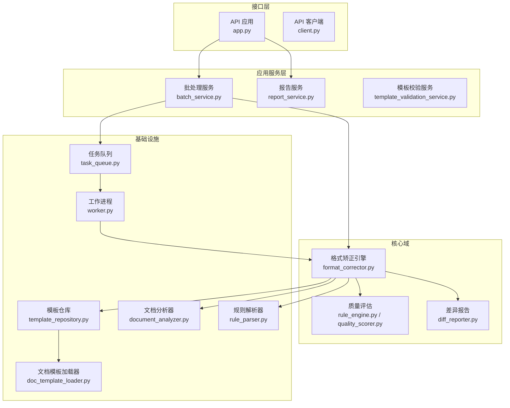
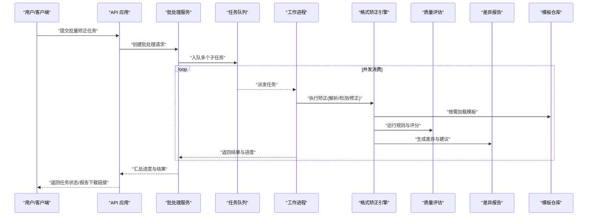
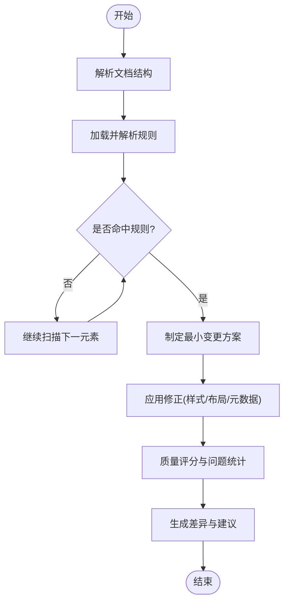
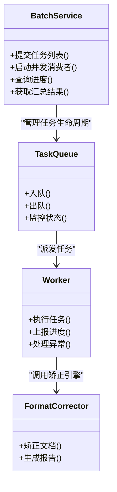
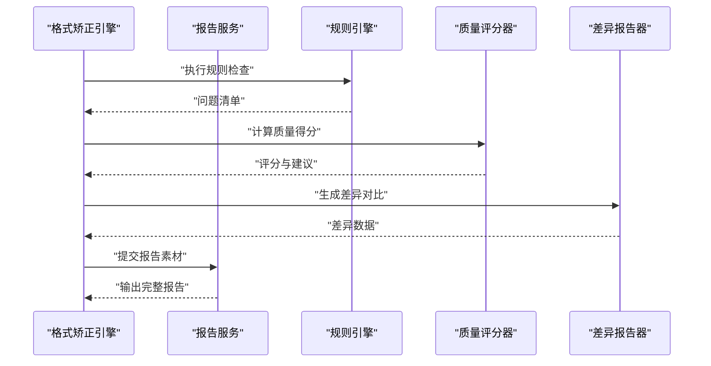
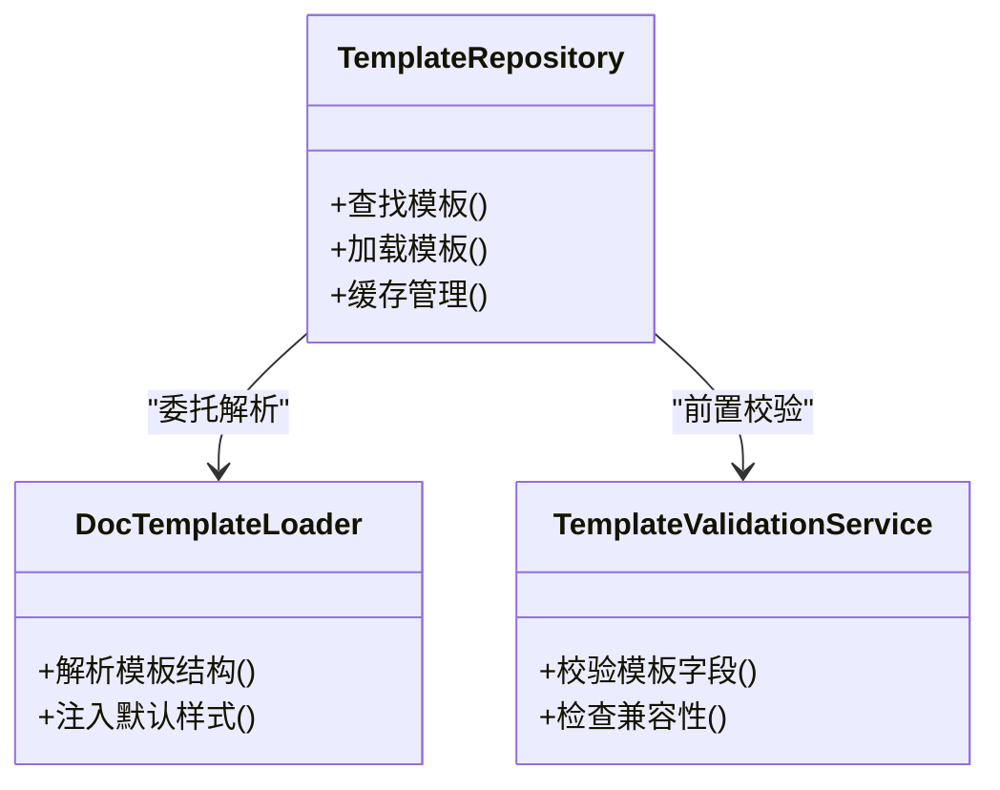
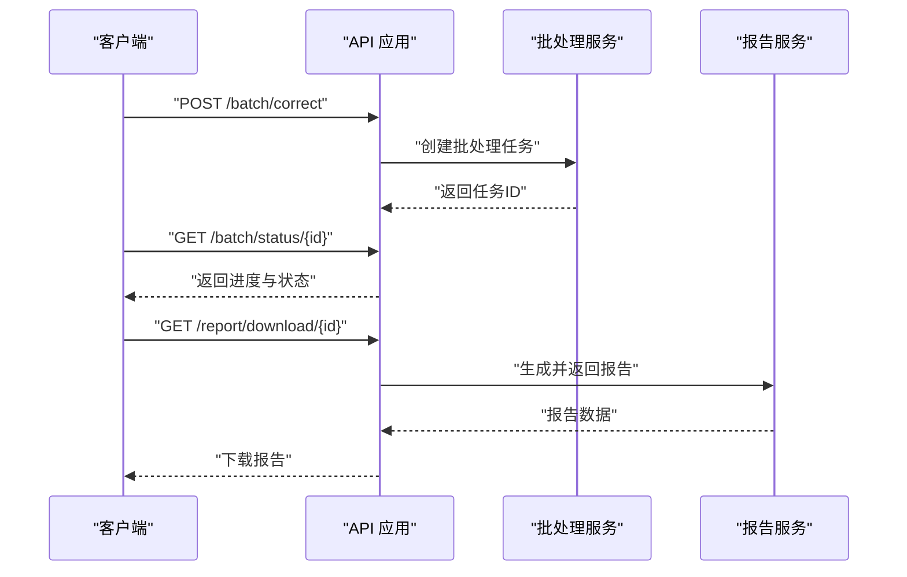
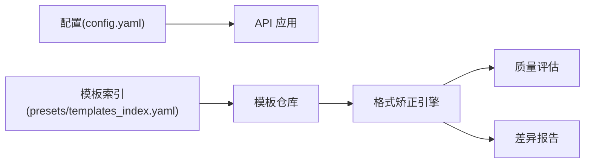

# 核心功能

<cite>
**本文引用的文件**   
- [src/paper_format_corrector/core/format_corrector.py](file://src/paper_format_corrector/core/format_corrector.py)
- [src/paper_format_corrector/application/services/batch_service.py](file://src/paper_format_corrector/application/services/batch_service.py)
- [src/paper_format_corrector/application/services/report_service.py](file://src/paper_format_corrector/application/services/report_service.py)
- [src/paper_format_corrector/infra/template_repository.py](file://src/paper_format_corrector/infra/template_repository.py)
- [src/paper_format_corrector/infra/doc_template_loader.py](file://src/paper_format_corrector/infra/doc_template_loader.py)
- [src/paper_format_corrector/quality/rule_engine.py](file://src/paper_format_corrector/quality/rule_engine.py)
- [src/paper_format_corrector/quality/diff_reporter.py](file://src/paper_format_corrector/quality/diff_reporter.py)
- [src/paper_format_corrector/quality/quality_scorer.py](file://src/paper_format_corrector/quality/quality_scorer.py)
- [src/paper_format_corrector/interfaces/api/app.py](file://src/paper_format_corrector/interfaces/api/app.py)
- [src/paper_format_corrector/interfaces/api/client.py](file://src/paper_format_corrector/interfaces/api/client.py)
- [src/paper_format_corrector/infrastructure/queue/task_queue.py](file://src/paper_format_corrector/infrastructure/queue/task_queue.py)
- [src/paper_format_corrector/infrastructure/queue/worker.py](file://src/paper_format_corrector/infrastructure/queue/worker.py)
- [src/paper_format_corrector/infrastructure/parsers/document_analyzer.py](file://src/paper_format_corrector/infrastructure/parsers/document_analyzer.py)
- [src/paper_format_corrector/infrastructure/parsers/rule_parser.py](file://src/paper_format_corrector/infrastructure/parsers/rule_parser.py)
- [config/config.yaml](file://config/config.yaml)
- [presets/templates_index.yaml](file://presets/templates_index.yaml)
</cite>

## 目录
1. [简介](#简介)
2. [项目结构](#项目结构)
3. [核心组件](#核心组件)
4. [架构总览](#架构总览)
5. [详细组件分析](#详细组件分析)
6. [依赖关系分析](#依赖关系分析)
7. [性能考虑](#性能考虑)
8. [故障排查指南](#故障排查指南)
9. [结论](#结论)
10. [附录](#附录)

## 简介
本技术文档聚焦论文格式矫正工具的核心功能模块，围绕以下目标展开：
- 格式矫正引擎的工作原理：自动格式检测算法、智能修正逻辑与质量评估机制。
- 批处理服务实现：并发策略、错误处理与进度跟踪。
- 报告生成系统：检查报告、差异对比分析与修复建议生成。
- 模板管理系统：动态加载、验证与缓存机制。
- API调用示例与配置选项说明。
- 性能优化建议与最佳实践。

## 项目结构
本项目采用分层与领域驱动相结合的组织方式，核心代码位于 src/paper_format_corrector 下，按职责划分为 core（核心能力）、application（应用服务）、interfaces（对外接口）、infra/infrastructure（基础设施与适配层）、quality（质量与规则）、handlers（文档元素处理器）等。

图表来源
- [src/paper_format_corrector/interfaces/api/app.py](file://src/paper_format_corrector/interfaces/api/app.py)
- [src/paper_format_corrector/application/services/batch_service.py](file://src/paper_format_corrector/application/services/batch_service.py)
- [src/paper_format_corrector/application/services/report_service.py](file://src/paper_format_corrector/application/services/report_service.py)
- [src/paper_format_corrector/core/format_corrector.py](file://src/paper_format_corrector/core/format_corrector.py)
- [src/paper_format_corrector/quality/rule_engine.py](file://src/paper_format_corrector/quality/rule_engine.py)
- [src/paper_format_corrector/quality/diff_reporter.py](file://src/paper_format_corrector/quality/diff_reporter.py)
- [src/paper_format_corrector/infra/template_repository.py](file://src/paper_format_corrector/infra/template_repository.py)
- [src/paper_format_corrector/infra/doc_template_loader.py](file://src/paper_format_corrector/infra/doc_template_loader.py)
- [src/paper_format_corrector/infrastructure/parsers/document_analyzer.py](file://src/paper_format_corrector/infrastructure/parsers/document_analyzer.py)
- [src/paper_format_corrector/infrastructure/parsers/rule_parser.py](file://src/paper_format_corrector/infrastructure/parsers/rule_parser.py)
- [src/paper_format_corrector/infrastructure/queue/task_queue.py](file://src/paper_format_corrector/infrastructure/queue/task_queue.py)
- [src/paper_format_corrector/infrastructure/queue/worker.py](file://src/paper_format_corrector/infrastructure/queue/worker.py)

章节来源
- [src/paper_format_corrector/interfaces/api/app.py](file://src/paper_format_corrector/interfaces/api/app.py)
- [src/paper_format_corrector/application/services/batch_service.py](file://src/paper_format_corrector/application/services/batch_service.py)
- [src/paper_format_corrector/application/services/report_service.py](file://src/paper_format_corrector/application/services/report_service.py)
- [src/paper_format_corrector/core/format_corrector.py](file://src/paper_format_corrector/core/format_corrector.py)
- [src/paper_format_corrector/quality/rule_engine.py](file://src/paper_format_corrector/quality/rule_engine.py)
- [src/paper_format_corrector/quality/diff_reporter.py](file://src/paper_format_corrector/quality/diff_reporter.py)
- [src/paper_format_corrector/infra/template_repository.py](file://src/paper_format_corrector/infra/template_repository.py)
- [src/paper_format_corrector/infra/doc_template_loader.py](file://src/paper_format_corrector/infra/doc_template_loader.py)
- [src/paper_format_corrector/infrastructure/parsers/document_analyzer.py](file://src/paper_format_corrector/infrastructure/parsers/document_analyzer.py)
- [src/paper_format_corrector/infrastructure/parsers/rule_parser.py](file://src/paper_format_corrector/infrastructure/parsers/rule_parser.py)
- [src/paper_format_corrector/infrastructure/queue/task_queue.py](file://src/paper_format_corrector/infrastructure/queue/task_queue.py)
- [src/paper_format_corrector/infrastructure/queue/worker.py](file://src/paper_format_corrector/infrastructure/queue/worker.py)

## 核心组件
- 格式矫正引擎：负责文档解析、规则匹配、自动检测与智能修正，并输出质量评分与差异报告。
- 批处理服务：提供批量文件的并发处理、任务调度、错误隔离与进度上报。
- 报告生成系统：汇总检查结果、生成差异对比与修复建议，支持多种输出格式。
- 模板管理系统：统一加载、校验与缓存模板资源，支撑多风格与机构规范。

章节来源
- [src/paper_format_corrector/core/format_corrector.py](file://src/paper_format_corrector/core/format_corrector.py)
- [src/paper_format_corrector/application/services/batch_service.py](file://src/paper_format_corrector/application/services/batch_service.py)
- [src/paper_format_corrector/application/services/report_service.py](file://src/paper_format_corrector/application/services/report_service.py)
- [src/paper_format_corrector/infra/template_repository.py](file://src/paper_format_corrector/infra/template_repository.py)
- [src/paper_format_corrector/infra/doc_template_loader.py](file://src/paper_format_corrector/infra/doc_template_loader.py)

## 架构总览
整体架构遵循“接口层-应用服务-核心域-基础设施”的分层模式，通过队列与工作进程解耦高吞吐批处理流程；质量评估与差异报告贯穿始终，为前端展示与后续自动化决策提供依据。

图表来源
- [src/paper_format_corrector/interfaces/api/app.py](file://src/paper_format_corrector/interfaces/api/app.py)
- [src/paper_format_corrector/application/services/batch_service.py](file://src/paper_format_corrector/application/services/batch_service.py)
- [src/paper_format_corrector/infrastructure/queue/task_queue.py](file://src/paper_format_corrector/infrastructure/queue/task_queue.py)
- [src/paper_format_corrector/infrastructure/queue/worker.py](file://src/paper_format_corrector/infrastructure/queue/worker.py)
- [src/paper_format_corrector/core/format_corrector.py](file://src/paper_format_corrector/core/format_corrector.py)
- [src/paper_format_corrector/quality/rule_engine.py](file://src/paper_format_corrector/quality/rule_engine.py)
- [src/paper_format_corrector/quality/diff_reporter.py](file://src/paper_format_corrector/quality/diff_reporter.py)
- [src/paper_format_corrector/infra/template_repository.py](file://src/paper_format_corrector/infra/template_repository.py)

## 详细组件分析

### 格式矫正引擎
- 自动格式检测算法
  - 基于文档分析器对段落、标题、表格、图片、引用等进行结构化抽取。
  - 结合规则解析器将 YAML/JSON 规则转换为可执行检查项，覆盖字体、行距、缩进、编号、页眉页脚、参考文献等维度。
- 智能修正逻辑
  - 在规则命中后，优先采用最小变更策略进行样式修正，避免破坏内容语义。
  - 对冲突场景（如自定义样式与模板样式不一致）采用模板优先级与回退策略。
- 质量评估机制
  - 规则引擎产出问题清单与严重级别，评分器综合计算质量得分与改进建议。
  - 差异报告记录修改前后关键属性变化，便于审计与回溯。

图表来源
- [src/paper_format_corrector/core/format_corrector.py](file://src/paper_format_corrector/core/format_corrector.py)
- [src/paper_format_corrector/infrastructure/parsers/document_analyzer.py](file://src/paper_format_corrector/infrastructure/parsers/document_analyzer.py)
- [src/paper_format_corrector/infrastructure/parsers/rule_parser.py](file://src/paper_format_corrector/infrastructure/parsers/rule_parser.py)
- [src/paper_format_corrector/quality/rule_engine.py](file://src/paper_format_corrector/quality/rule_engine.py)
- [src/paper_format_corrector/quality/quality_scorer.py](file://src/paper_format_corrector/quality/quality_scorer.py)
- [src/paper_format_corrector/quality/diff_reporter.py](file://src/paper_format_corrector/quality/diff_reporter.py)

章节来源
- [src/paper_format_corrector/core/format_corrector.py](file://src/paper_format_corrector/core/format_corrector.py)
- [src/paper_format_corrector/infrastructure/parsers/document_analyzer.py](file://src/paper_format_corrector/infrastructure/parsers/document_analyzer.py)
- [src/paper_format_corrector/infrastructure/parsers/rule_parser.py](file://src/paper_format_corrector/infrastructure/parsers/rule_parser.py)
- [src/paper_format_corrector/quality/rule_engine.py](file://src/paper_format_corrector/quality/rule_engine.py)
- [src/paper_format_corrector/quality/quality_scorer.py](file://src/paper_format_corrector/quality/quality_scorer.py)
- [src/paper_format_corrector/quality/diff_reporter.py](file://src/paper_format_corrector/quality/diff_reporter.py)

### 批处理服务
- 并发处理策略
  - 使用任务队列与工作进程模型，支持固定或自适应的并发度控制。
  - 每个文件作为独立任务单元，具备失败重试与隔离能力。
- 错误处理
  - 捕获解析异常、规则不兼容、模板缺失等错误，记录到任务日志并标记失败原因。
  - 支持跳过失败项继续处理其他任务，保证整体批处理鲁棒性。
- 进度跟踪
  - 任务状态机包含待处理、进行中、成功、失败等状态，实时上报完成百分比与当前处理文件。
  - 聚合结果用于前端进度条与最终报告汇总。

图表来源
- [src/paper_format_corrector/application/services/batch_service.py](file://src/paper_format_corrector/application/services/batch_service.py)
- [src/paper_format_corrector/infrastructure/queue/task_queue.py](file://src/paper_format_corrector/infrastructure/queue/task_queue.py)
- [src/paper_format_corrector/infrastructure/queue/worker.py](file://src/paper_format_corrector/infrastructure/queue/worker.py)
- [src/paper_format_corrector/core/format_corrector.py](file://src/paper_format_corrector/core/format_corrector.py)

章节来源
- [src/paper_format_corrector/application/services/batch_service.py](file://src/paper_format_corrector/application/services/batch_service.py)
- [src/paper_format_corrector/infrastructure/queue/task_queue.py](file://src/paper_format_corrector/infrastructure/queue/task_queue.py)
- [src/paper_format_corrector/infrastructure/queue/worker.py](file://src/paper_format_corrector/infrastructure/queue/worker.py)

### 报告生成系统
- 详细检查报告
  - 汇总所有规则检查结果，包括问题类型、严重级别、位置信息与修复建议。
- 差异对比分析
  - 对比修正前后的关键属性（如字体、字号、行距、缩进、编号、页边距等），以结构化形式呈现。
- 修复建议生成
  - 根据规则与上下文自动生成可操作的修复步骤，必要时提示人工确认。

图表来源
- [src/paper_format_corrector/application/services/report_service.py](file://src/paper_format_corrector/application/services/report_service.py)
- [src/paper_format_corrector/quality/rule_engine.py](file://src/paper_format_corrector/quality/rule_engine.py)
- [src/paper_format_corrector/quality/quality_scorer.py](file://src/paper_format_corrector/quality/quality_scorer.py)
- [src/paper_format_corrector/quality/diff_reporter.py](file://src/paper_format_corrector/quality/diff_reporter.py)

章节来源
- [src/paper_format_corrector/application/services/report_service.py](file://src/paper_format_corrector/application/services/report_service.py)
- [src/paper_format_corrector/quality/rule_engine.py](file://src/paper_format_corrector/quality/rule_engine.py)
- [src/paper_format_corrector/quality/quality_scorer.py](file://src/paper_format_corrector/quality/quality_scorer.py)
- [src/paper_format_corrector/quality/diff_reporter.py](file://src/paper_format_corrector/quality/diff_reporter.py)

### 模板管理系统
- 动态加载
  - 通过模板仓库统一入口，支持本地与远程模板索引，按需加载指定模板。
  - 文档模板加载器负责解析模板结构与默认样式，注入到矫正流程。
- 验证
  - 模板校验服务确保模板字段完整性、版本兼容性与规则可用性。
- 缓存机制
  - 对已加载模板进行内存与磁盘缓存，减少重复 IO 与解析开销。
  - 支持失效策略与热更新，保障模板升级后的稳定性。

图表来源
- [src/paper_format_corrector/infra/template_repository.py](file://src/paper_format_corrector/infra/template_repository.py)
- [src/paper_format_corrector/infra/doc_template_loader.py](file://src/paper_format_corrector/infra/doc_template_loader.py)
- [src/paper_format_corrector/application/services/template_validation_service.py](file://src/paper_format_corrector/application/services/template_validation_service.py)

章节来源
- [src/paper_format_corrector/infra/template_repository.py](file://src/paper_format_corrector/infra/template_repository.py)
- [src/paper_format_corrector/infra/doc_template_loader.py](file://src/paper_format_corrector/infra/doc_template_loader.py)
- [src/paper_format_corrector/application/services/template_validation_service.py](file://src/paper_format_corrector/application/services/template_validation_service.py)

### API 与客户端
- API 应用
  - 暴露批量矫正、进度查询、报告下载等接口，集成认证与限流。
- 客户端
  - 提供便捷方法封装，简化调用方发起任务、轮询进度与拉取结果的流程。

图表来源
- [src/paper_format_corrector/interfaces/api/app.py](file://src/paper_format_corrector/interfaces/api/app.py)
- [src/paper_format_corrector/interfaces/api/client.py](file://src/paper_format_corrector/interfaces/api/client.py)
- [src/paper_format_corrector/application/services/batch_service.py](file://src/paper_format_corrector/application/services/batch_service.py)
- [src/paper_format_corrector/application/services/report_service.py](file://src/paper_format_corrector/application/services/report_service.py)

章节来源
- [src/paper_format_corrector/interfaces/api/app.py](file://src/paper_format_corrector/interfaces/api/app.py)
- [src/paper_format_corrector/interfaces/api/client.py](file://src/paper_format_corrector/interfaces/api/client.py)

## 依赖关系分析
- 组件耦合
  - 批处理服务强依赖任务队列与工作进程；矫正引擎依赖文档分析器、规则解析器、质量评估与差异报告。
  - 模板仓库为矫正引擎提供模板资源，模板加载器与校验服务为其提供解析与验证能力。
- 外部依赖
  - 配置文件 config.yaml 提供全局参数（如并发度、超时、路径等）。
  - 预设模板索引 presets/templates_index.yaml 提供可用模板清单与版本信息。

图表来源
- [config/config.yaml](file://config/config.yaml)
- [presets/templates_index.yaml](file://presets/templates_index.yaml)
- [src/paper_format_corrector/infra/template_repository.py](file://src/paper_format_corrector/infra/template_repository.py)
- [src/paper_format_corrector/core/format_corrector.py](file://src/paper_format_corrector/core/format_corrector.py)
- [src/paper_format_corrector/quality/rule_engine.py](file://src/paper_format_corrector/quality/rule_engine.py)
- [src/paper_format_corrector/quality/diff_reporter.py](file://src/paper_format_corrector/quality/diff_reporter.py)

章节来源
- [config/config.yaml](file://config/config.yaml)
- [presets/templates_index.yaml](file://presets/templates_index.yaml)
- [src/paper_format_corrector/infra/template_repository.py](file://src/paper_format_corrector/infra/template_repository.py)
- [src/paper_format_corrector/core/format_corrector.py](file://src/paper_format_corrector/core/format_corrector.py)
- [src/paper_format_corrector/quality/rule_engine.py](file://src/paper_format_corrector/quality/rule_engine.py)
- [src/paper_format_corrector/quality/diff_reporter.py](file://src/paper_format_corrector/quality/diff_reporter.py)

## 性能考虑
- 并发与队列
  - 合理设置工作进程数量与队列容量，避免内存峰值过高；对大文档分块处理。
- 模板缓存
  - 启用模板缓存与预加载，减少重复解析；对频繁使用的模板建立热点缓存。
- 规则与评分
  - 规则解析结果缓存，避免每次矫正重复构建；评分器采用增量计算，降低复杂度。
- I/O 优化
  - 批量任务采用异步读写与缓冲策略；报告生成时延迟序列化，按需输出。
- 资源限制
  - 为任务设置超时与最大重试次数，防止长尾任务拖垮系统。

[本节为通用指导，无需具体文件来源]

## 故障排查指南
- 常见问题定位
  - 任务失败：查看任务日志与错误码，确认是否为模板缺失、规则不兼容或文档损坏。
  - 进度停滞：检查队列积压与工作进程健康状态，必要时重启或扩容。
  - 报告不完整：确认报告服务是否正常生成差异与建议，核对输出路径权限。
- 调试建议
  - 开启详细日志，关注规则命中与修正应用阶段。
  - 使用最小样本复现问题，逐步缩小范围至具体规则或模板。

章节来源
- [src/paper_format_corrector/application/services/batch_service.py](file://src/paper_format_corrector/application/services/batch_service.py)
- [src/paper_format_corrector/infrastructure/queue/task_queue.py](file://src/paper_format_corrector/infrastructure/queue/task_queue.py)
- [src/paper_format_corrector/infrastructure/queue/worker.py](file://src/paper_format_corrector/infrastructure/queue/worker.py)
- [src/paper_format_corrector/application/services/report_service.py](file://src/paper_format_corrector/application/services/report_service.py)

## 结论
本工具通过分层架构与模块化设计，实现了高效的论文格式矫正流水线。格式矫正引擎结合规则与质量评估，确保修正的准确性与可解释性；批处理服务提供稳定可靠的并发处理能力；报告系统为用户提供全面的检查与对比信息；模板管理系统则保障了多风格与机构规范的灵活扩展。配合合理的配置与性能优化策略，可在大规模文档处理场景中保持高吞吐与低延迟。

[本节为总结性内容，无需具体文件来源]

## 附录

### API 调用示例（概念性）
- 提交批量矫正任务
  - 方法：POST
  - 路径：/batch/correct
  - 请求体：包含文件列表、模板标识、输出选项等
  - 响应：返回任务 ID 与初始状态
- 查询任务进度
  - 方法：GET
  - 路径：/batch/status/{id}
  - 响应：包含完成百分比、当前处理文件、错误摘要
- 下载报告
  - 方法：GET
  - 路径：/report/download/{id}
  - 响应：报告文件或下载链接

章节来源
- [src/paper_format_corrector/interfaces/api/app.py](file://src/paper_format_corrector/interfaces/api/app.py)
- [src/paper_format_corrector/interfaces/api/client.py](file://src/paper_format_corrector/interfaces/api/client.py)

### 配置选项说明（概念性）
- 全局配置
  - 并发度：控制工作进程数量与队列大小
  - 超时：单任务最大执行时间
  - 路径：输入/输出目录与临时目录
- 模板配置
  - 模板索引：可用模板清单与版本
  - 缓存策略：内存与磁盘缓存开关与过期时间
- 质量与规则
  - 规则集：启用的规则集合与优先级
  - 评分阈值：触发告警或拒绝的质量分数

章节来源
- [config/config.yaml](file://config/config.yaml)
- [presets/templates_index.yaml](file://presets/templates_index.yaml)