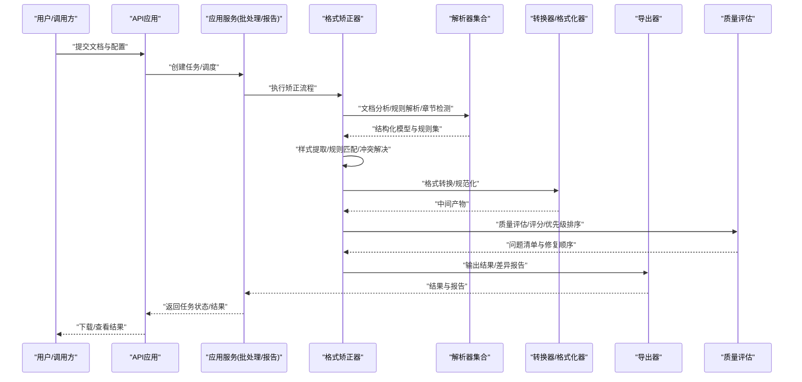
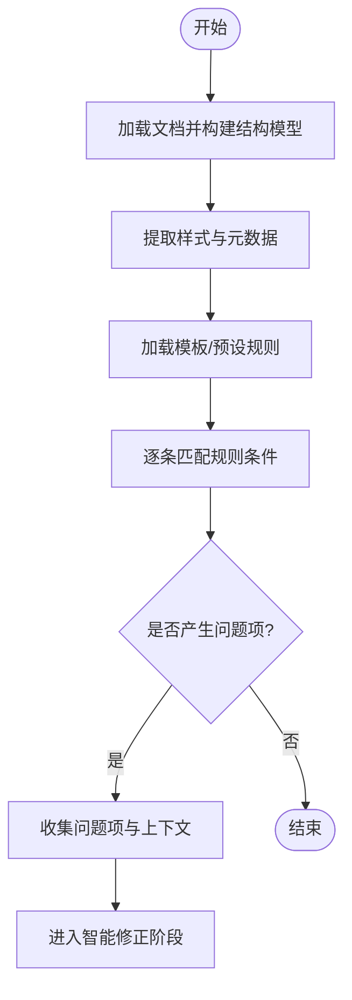
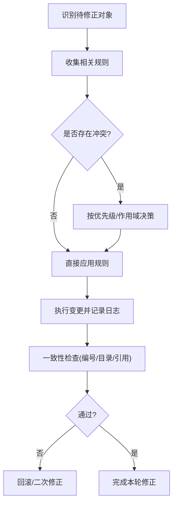
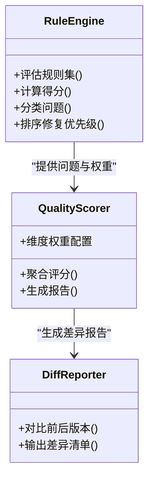
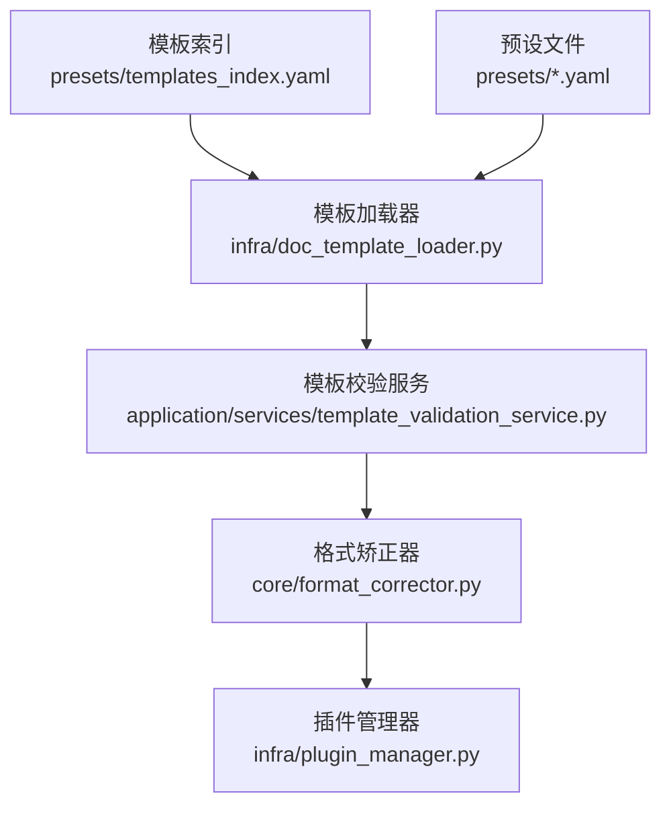
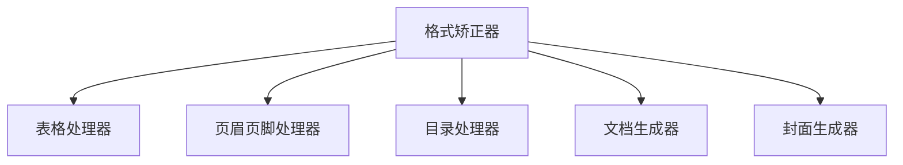
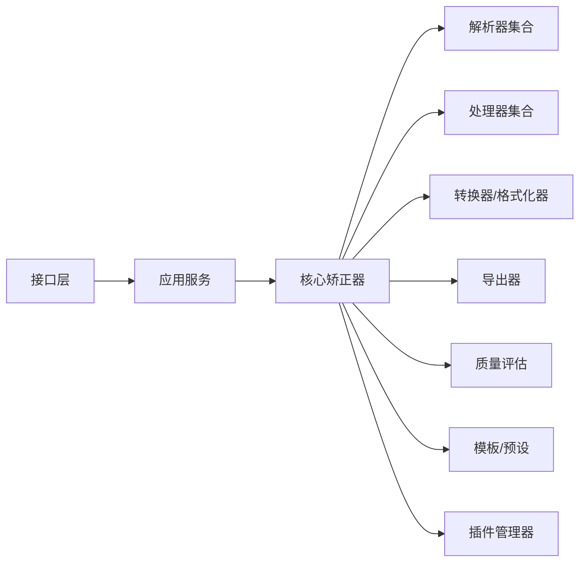

# 格式矫正引擎

<cite>
**本文引用的文件**   
- [README.md](file://README.md)
- [pyproject.toml](file://pyproject.toml)
- [requirements.txt](file://requirements.txt)
- [run.py](file://run.py)
- [src/paper_format_corrector/app.py](file://src/paper_format_corrector/app.py)
- [src/paper_format_corrector/core/format_corrector.py](file://src/paper_format_corrector/core/format_corrector.py)
- [src/paper_format_corrector/core/style_extractor.py](file://src/paper_format_corrector/core/style_extractor.py)
- [src/paper_format_corrector/infrastructure/parsers/document_analyzer.py](file://src/paper_format_corrector/infrastructure/parsers/document_analyzer.py)
- [src/paper_format_corrector/infrastructure/parsers/rule_parser.py](file://src/paper_format_corrector/infrastructure/parsers/rule_parser.py)
- [src/paper_format_corrector/infrastructure/parsers/section_detector.py](file://src/paper_format_corrector/infrastructure/parsers/section_detector.py)
- [src/paper_format_corrector/infrastructure/parsers/reference_formatter.py](file://src/paper_format_corrector/infrastructure/parsers/reference_formatter.py)
- [src/paper_format_corrector/infrastructure/parsers/cross_reference.py](file://src/paper_format_corrector/infrastructure/parsers/cross_reference.py)
- [src/paper_format_corrector/infrastructure/parsers/model_discovery.py](file://src/paper_format_corrector/infrastructure/parsers/model_discovery.py)
- [src/paper_format_corrector/infrastructure/parsers/pdf_style_extractor.py](file://src/paper_format_corrector/infrastructure/parsers/pdf_style_extractor.py)
- [src/paper_format_corrector/infrastructure/converters/file_converter.py](file://src/paper_format_corrector/infrastructure/converters/file_converter.py)
- [src/paper_format_corrector/infrastructure/converters/file_formatter.py](file://src/paper_format_corrector/infrastructure/converters/file_formatter.py)
- [src/paper_format_corrector/infrastructure/exporters/format_exporter.py](file://src/paper_format_corrector/infrastructure/exporters/format_exporter.py)
- [src/paper_format_corrector/quality/rule_engine.py](file://src/paper_format_corrector/quality/rule_engine.py)
- [src/paper_format_corrector/quality/quality_scorer.py](file://src/paper_format_corrector/quality/quality_scorer.py)
- [src/paper_format_corrector/quality/diff_reporter.py](file://src/paper_format_corrector/quality/diff_reporter.py)
- [src/paper_format_corrector/application/services/template_validation_service.py](file://src/paper_format_corrector/application/services/template_validation_service.py)
- [src/paper_format_corrector/application/services/batch_service.py](file://src/paper_format_corrector/application/services/batch_service.py)
- [src/paper_format_corrector/application/services/report_service.py](file://src/paper_format_corrector/application/services/report_service.py)
- [src/paper_format_corrector/application/services/style_workbench.py](file://src/paper_format_corrector/application/services/style_workbench.py)
- [src/paper_format_corrector/infra/doc_template_loader.py](file://src/paper_format_corrector/infra/doc_template_loader.py)
- [src/paper_format_corrector/infra/preset_loader.py](file://src/paper_format_corrector/infra/preset_loader.py)
- [src/paper_format_corrector/infra/plugin_manager.py](file://src/paper_format_corrector/infra/plugin_manager.py)
- [src/paper_format_corrector/infra/remote/conflict_resolver.py](file://src/paper_format_corrector/infra/remote/conflict_resolver.py)
- [src/paper_format_corrector/interfaces/api/app.py](file://src/paper_format_corrector/interfaces/api/app.py)
- [src/paper_format_corrector/interfaces/api/client.py](file://src/paper_format_corrector/interfaces/api/client.py)
- [src/paper_format_corrector/handlers/table_handler.py](file://src/paper_format_corrector/handlers/table_handler.py)
- [src/paper_format_corrector/handlers/header_footer_handler.py](file://src/paper_format_corrector/handlers/header_footer_handler.py)
- [src/paper_format_corrector/handlers/toc_handler.py](file://src/paper_format_corrector/handlers/toc_handler.py)
- [src/paper_format_corrector/generators/doc_generator.py](file://src/paper_format_corrector/generators/doc_generator.py)
- [src/paper_format_corrector/generators/cover_page_generator.py](file://src/paper_format_corrector/generators/cover_page_generator.py)
- [config/config.yaml](file://config/config.yaml)
- [presets/templates_index.yaml](file://presets/templates_index.yaml)
</cite>

## 目录
1. [简介](#简介)
2. [项目结构](#项目结构)
3. [核心组件](#核心组件)
4. [架构总览](#架构总览)
5. [详细组件分析](#详细组件分析)
6. [依赖关系分析](#依赖关系分析)
7. [性能考虑](#性能考虑)
8. [故障排查指南](#故障排查指南)
9. [结论](#结论)
10. [附录](#附录)

## 简介
本技术文档面向“格式矫正引擎”，围绕自动格式检测、智能修正、质量评估与模板集成四大主题，系统阐述其实现原理、数据流、处理逻辑与扩展点。文档同时提供API使用示例（以路径引用形式）、常见问题定位方法与性能优化建议，帮助开发者快速理解并高效使用该引擎。

## 项目结构
工程采用分层与领域驱动相结合的组织方式：
- 应用层：服务编排、批处理、报告生成、样式工作台等
- 核心层：格式矫正主流程、样式提取、导出器、转换器
- 基础设施层：解析器（文档分析、规则解析、章节检测、参考文献格式化、交叉引用、模型发现、PDF样式提取）、转换器（文件转换/格式化）、导出器、队列与插件管理、远程冲突解决
- 接口层：API应用与客户端、CLI、桌面端、Web端
- 处理器与生成器：表格、页眉页脚、目录、封面等专用处理与生成
- 配置与预设：全局配置、模板索引与各模板预设

```mermaid
graph TB
subgraph "接口层"
API["API应用<br/>interfaces/api/app.py"]
Client["API客户端<br/>interfaces/api/client.py"]
end
subgraph "应用层"
BatchSvc["批处理服务<br/>application/services/batch_service.py"]
ReportSvc["报告服务<br/>application/services/report_service.py"]
StyleWB["样式工作台<br/>application/services/style_workbench.py"]
TplValSvc["模板校验服务<br/>application/services/template_validation_service.py"]
end
subgraph "核心层"
FC["格式矫正器<br/>core/format_corrector.py"]
SE["样式提取器<br/>core/style_extractor.py"]
FE["格式导出器<br/>infrastructure/exporters/format_exporter.py"]
end
subgraph "基础设施层"
DA["文档分析器<br/>infrastructure/parsers/document_analyzer.py"]
RP["规则解析器<br/>infrastructure/parsers/rule_parser.py"]
SD["章节检测器<br/>infrastructure/parsers/section_detector.py"]
RF["参考文献格式化<br/>infrastructure/parsers/reference_formatter.py"]
CR["交叉引用<br/>infrastructure/parsers/cross_reference.py"]
MD["模型发现<br/>infrastructure/parsers/model_discovery.py"]
PSE["PDF样式提取<br/>infrastructure/parsers/pdf_style_extractor.py"]
FConv["文件转换器<br/>infrastructure/converters/file_converter.py"]
FFmt["文件格式化器<br/>infrastructure/converters/file_formatter.py"]
PluginMgr["插件管理器<br/>infra/plugin_manager.py"]
Conflict["冲突解决器<br/>infra/remote/conflict_resolver.py"]
end
subgraph "处理器与生成器"
TH["表格处理器<br/>handlers/table_handler.py"]
HFH["页眉页脚处理器<br/>handlers/header_footer_handler.py"]
TOC["目录处理器<br/>handlers/toc_handler.py"]
DG["文档生成器<br/>generators/doc_generator.py"]
CG["封面生成器<br/>generators/cover_page_generator.py"]
end
subgraph "配置与预设"
Cfg["全局配置<br/>config/config.yaml"]
TplIdx["模板索引<br/>presets/templates_index.yaml"]
end
API --> BatchSvc
API --> ReportSvc
API --> StyleWB
BatchSvc --> FC
FC --> DA
FC --> RP
FC --> SD
FC --> RF
FC --> CR
FC --> MD
FC --> PSE
FC --> FConv
FC --> FFmt
FC --> FE
FC --> TH
FC --> HFH
FC --> TOC
FC --> DG
FC --> CG
FC --> PluginMgr
FC --> Conflict
FC --> Cfg
FC --> TplIdx
```

图表来源
- [src/paper_format_corrector/interfaces/api/app.py](file://src/paper_format_corrector/interfaces/api/app.py)
- [src/paper_format_corrector/application/services/batch_service.py](file://src/paper_format_corrector/application/services/batch_service.py)
- [src/paper_format_corrector/core/format_corrector.py](file://src/paper_format_corrector/core/format_corrector.py)
- [src/paper_format_corrector/infrastructure/parsers/document_analyzer.py](file://src/paper_format_corrector/infrastructure/parsers/document_analyzer.py)
- [src/paper_format_corrector/infrastructure/parsers/rule_parser.py](file://src/paper_format_corrector/infrastructure/parsers/rule_parser.py)
- [src/paper_format_corrector/infrastructure/parsers/section_detector.py](file://src/paper_format_corrector/infrastructure/parsers/section_detector.py)
- [src/paper_format_corrector/infrastructure/parsers/reference_formatter.py](file://src/paper_format_corrector/infrastructure/parsers/reference_formatter.py)
- [src/paper_format_corrector/infrastructure/parsers/cross_reference.py](file://src/paper_format_corrector/infrastructure/parsers/cross_reference.py)
- [src/paper_format_corrector/infrastructure/parsers/model_discovery.py](file://src/paper_format_corrector/infrastructure/parsers/model_discovery.py)
- [src/paper_format_corrector/infrastructure/parsers/pdf_style_extractor.py](file://src/paper_format_corrector/infrastructure/parsers/pdf_style_extractor.py)
- [src/paper_format_corrector/infrastructure/converters/file_converter.py](file://src/paper_format_corrector/infrastructure/converters/file_converter.py)
- [src/paper_format_corrector/infrastructure/converters/file_formatter.py](file://src/paper_format_corrector/infrastructure/converters/file_formatter.py)
- [src/paper_format_corrector/infrastructure/exporters/format_exporter.py](file://src/paper_format_corrector/infrastructure/exporters/format_exporter.py)
- [src/paper_format_corrector/handlers/table_handler.py](file://src/paper_format_corrector/handlers/table_handler.py)
- [src/paper_format_corrector/handlers/header_footer_handler.py](file://src/paper_format_corrector/handlers/header_footer_handler.py)
- [src/paper_format_corrector/handlers/toc_handler.py](file://src/paper_format_corrector/handlers/toc_handler.py)
- [src/paper_format_corrector/generators/doc_generator.py](file://src/paper_format_corrector/generators/doc_generator.py)
- [src/paper_format_corrector/generators/cover_page_generator.py](file://src/paper_format_corrector/generators/cover_page_generator.py)
- [config/config.yaml](file://config/config.yaml)
- [presets/templates_index.yaml](file://presets/templates_index.yaml)

章节来源
- [README.md](file://README.md)
- [pyproject.toml](file://pyproject.toml)
- [requirements.txt](file://requirements.txt)
- [run.py](file://run.py)

## 核心组件
- 格式矫正器：协调文档分析、规则匹配、样式提取、修正执行与一致性检查的主控流程
- 文档分析器：对输入文档进行结构与内容建模，识别段落、标题、表格、图片、公式等元素
- 规则解析器：加载并解析模板/预设中的格式规则，构建可执行的规则集
- 章节检测器：基于内容与样式推断章节层级与类型，辅助导航与编号
- 参考文献格式化：统一引文格式、序号与排序，支持多种标准
- 交叉引用：维护文中引用与目标的一致性，修复断链与错位
- 模型发现：从文档中抽取潜在的结构化信息（如作者、摘要、关键词）
- PDF样式提取：从PDF中提取样式线索，辅助无样式的Word文档重建
- 文件转换器/格式化器：在docx、PDF、LaTeX等格式间转换与规范化
- 格式导出器：输出标准化结果或差异报告
- 质量评估：评分算法、错误分类与修复优先级排序
- 模板与预设：模板索引、大学/期刊预设、自定义模板导入与校验
- 插件与冲突解决：可扩展能力与协作场景下的冲突消解

章节来源
- [src/paper_format_corrector/core/format_corrector.py](file://src/paper_format_corrector/core/format_corrector.py)
- [src/paper_format_corrector/infrastructure/parsers/document_analyzer.py](file://src/paper_format_corrector/infrastructure/parsers/document_analyzer.py)
- [src/paper_format_corrector/infrastructure/parsers/rule_parser.py](file://src/paper_format_corrector/infrastructure/parsers/rule_parser.py)
- [src/paper_format_corrector/infrastructure/parsers/section_detector.py](file://src/paper_format_corrector/infrastructure/parsers/section_detector.py)
- [src/paper_format_corrector/infrastructure/parsers/reference_formatter.py](file://src/paper_format_corrector/infrastructure/parsers/reference_formatter.py)
- [src/paper_format_corrector/infrastructure/parsers/cross_reference.py](file://src/paper_format_corrector/infrastructure/parsers/cross_reference.py)
- [src/paper_format_corrector/infrastructure/parsers/model_discovery.py](file://src/paper_format_corrector/infrastructure/parsers/model_discovery.py)
- [src/paper_format_corrector/infrastructure/parsers/pdf_style_extractor.py](file://src/paper_format_corrector/infrastructure/parsers/pdf_style_extractor.py)
- [src/paper_format_corrector/infrastructure/converters/file_converter.py](file://src/paper_format_corrector/infrastructure/converters/file_converter.py)
- [src/paper_format_corrector/infrastructure/converters/file_formatter.py](file://src/paper_format_corrector/infrastructure/converters/file_formatter.py)
- [src/paper_format_corrector/infrastructure/exporters/format_exporter.py](file://src/paper_format_corrector/infrastructure/exporters/format_exporter.py)
- [src/paper_format_corrector/quality/rule_engine.py](file://src/paper_format_corrector/quality/rule_engine.py)
- [src/paper_format_corrector/quality/quality_scorer.py](file://src/paper_format_corrector/quality/quality_scorer.py)
- [src/paper_format_corrector/quality/diff_reporter.py](file://src/paper_format_corrector/quality/diff_reporter.py)
- [src/paper_format_corrector/application/services/template_validation_service.py](file://src/paper_format_corrector/application/services/template_validation_service.py)
- [src/paper_format_corrector/infra/doc_template_loader.py](file://src/paper_format_corrector/infra/doc_template_loader.py)
- [src/paper_format_corrector/infra/preset_loader.py](file://src/paper_format_corrector/infra/preset_loader.py)
- [src/paper_format_corrector/infra/plugin_manager.py](file://src/paper_format_corrector/infra/plugin_manager.py)
- [src/paper_format_corrector/infra/remote/conflict_resolver.py](file://src/paper_format_corrector/infra/remote/conflict_resolver.py)

## 架构总览
整体采用“接口层 -> 应用服务 -> 核心矫正器 -> 基础设施解析/转换/导出”的分层架构。核心矫正器作为编排中心，调用各类解析器与处理器完成检测与修正；质量子系统贯穿始终，提供评分与差异报告；模板与预设体系为规则与样式提供来源；插件机制与冲突解决增强扩展性与协作能力。

图表来源
- [src/paper_format_corrector/interfaces/api/app.py](file://src/paper_format_corrector/interfaces/api/app.py)
- [src/paper_format_corrector/application/services/batch_service.py](file://src/paper_format_corrector/application/services/batch_service.py)
- [src/paper_format_corrector/core/format_corrector.py](file://src/paper_format_corrector/core/format_corrector.py)
- [src/paper_format_corrector/infrastructure/parsers/document_analyzer.py](file://src/paper_format_corrector/infrastructure/parsers/document_analyzer.py)
- [src/paper_format_corrector/infrastructure/parsers/rule_parser.py](file://src/paper_format_corrector/infrastructure/parsers/rule_parser.py)
- [src/paper_format_corrector/infrastructure/parsers/section_detector.py](file://src/paper_format_corrector/infrastructure/parsers/section_detector.py)
- [src/paper_format_corrector/infrastructure/converters/file_converter.py](file://src/paper_format_corrector/infrastructure/converters/file_converter.py)
- [src/paper_format_corrector/infrastructure/converters/file_formatter.py](file://src/paper_format_corrector/infrastructure/converters/file_formatter.py)
- [src/paper_format_corrector/infrastructure/exporters/format_exporter.py](file://src/paper_format_corrector/infrastructure/exporters/format_exporter.py)
- [src/paper_format_corrector/quality/quality_scorer.py](file://src/paper_format_corrector/quality/quality_scorer.py)

## 详细组件分析

### 自动格式检测算法
- 文档结构分析：通过文档分析器构建元素树，识别段落、标题、列表、表格、图片、公式、脚注尾注等，并记录位置与上下文
- 样式提取：结合内置样式与PDF样式提取器，抽取字体、字号、行距、对齐、缩进、颜色、段落样式、表格样式等
- 规则匹配：由规则解析器加载模板/预设规则，将当前文档的样式与结构特征与规则条件进行匹配，产出待修正项

图表来源
- [src/paper_format_corrector/infrastructure/parsers/document_analyzer.py](file://src/paper_format_corrector/infrastructure/parsers/document_analyzer.py)
- [src/paper_format_corrector/infrastructure/parsers/pdf_style_extractor.py](file://src/paper_format_corrector/infrastructure/parsers/pdf_style_extractor.py)
- [src/paper_format_corrector/infrastructure/parsers/rule_parser.py](file://src/paper_format_corrector/infrastructure/parsers/rule_parser.py)

章节来源
- [src/paper_format_corrector/infrastructure/parsers/document_analyzer.py](file://src/paper_format_corrector/infrastructure/parsers/document_analyzer.py)
- [src/paper_format_corrector/infrastructure/parsers/pdf_style_extractor.py](file://src/paper_format_corrector/infrastructure/parsers/pdf_style_extractor.py)
- [src/paper_format_corrector/infrastructure/parsers/rule_parser.py](file://src/paper_format_corrector/infrastructure/parsers/rule_parser.py)

### 智能修正逻辑
- 格式识别：基于已匹配的规则项，识别具体需要修改的段落、字符、表格、图片等对象
- 冲突解决：当多条规则对同一对象存在冲突时，依据优先级策略（模板权重、规则类别、作用域）选择最终方案
- 一致性检查：确保编号、目录、交叉引用、参考文献等跨元素一致性不被破坏

图表来源
- [src/paper_format_corrector/core/format_corrector.py](file://src/paper_format_corrector/core/format_corrector.py)
- [src/paper_format_corrector/infrastructure/parsers/cross_reference.py](file://src/paper_format_corrector/infrastructure/parsers/cross_reference.py)
- [src/paper_format_corrector/infrastructure/parsers/reference_formatter.py](file://src/paper_format_corrector/infrastructure/parsers/reference_formatter.py)
- [src/paper_format_corrector/handlers/toc_handler.py](file://src/paper_format_corrector/handlers/toc_handler.py)

章节来源
- [src/paper_format_corrector/core/format_corrector.py](file://src/paper_format_corrector/core/format_corrector.py)
- [src/paper_format_corrector/infrastructure/parsers/cross_reference.py](file://src/paper_format_corrector/infrastructure/parsers/cross_reference.py)
- [src/paper_format_corrector/infrastructure/parsers/reference_formatter.py](file://src/paper_format_corrector/infrastructure/parsers/reference_formatter.py)
- [src/paper_format_corrector/handlers/toc_handler.py](file://src/paper_format_corrector/handlers/toc_handler.py)

### 质量评估系统
- 评分算法：综合样式合规度、结构完整性、引用一致性、表格/图片规范等维度计算总分
- 错误分类：将问题分为严重/警告/提示，并按影响范围与作用域归类
- 修复优先级排序：根据错误严重性、修复成本与依赖关系确定执行顺序，避免副作用

图表来源
- [src/paper_format_corrector/quality/rule_engine.py](file://src/paper_format_corrector/quality/rule_engine.py)
- [src/paper_format_corrector/quality/quality_scorer.py](file://src/paper_format_corrector/quality/quality_scorer.py)
- [src/paper_format_corrector/quality/diff_reporter.py](file://src/paper_format_corrector/quality/diff_reporter.py)

章节来源
- [src/paper_format_corrector/quality/rule_engine.py](file://src/paper_format_corrector/quality/rule_engine.py)
- [src/paper_format_corrector/quality/quality_scorer.py](file://src/paper_format_corrector/quality/quality_scorer.py)
- [src/paper_format_corrector/quality/diff_reporter.py](file://src/paper_format_corrector/quality/diff_reporter.py)

### 模板系统与集成
- 模板索引与预设：通过模板索引与预设文件定义不同机构/期刊的格式要求
- 模板加载与校验：支持本地与远程模板加载，并进行语法与语义校验
- 扩展点：允许自定义规则、处理器与转换器，接入插件管理器

图表来源
- [presets/templates_index.yaml](file://presets/templates_index.yaml)
- [src/paper_format_corrector/infra/doc_template_loader.py](file://src/paper_format_corrector/infra/doc_template_loader.py)
- [src/paper_format_corrector/application/services/template_validation_service.py](file://src/paper_format_corrector/application/services/template_validation_service.py)
- [src/paper_format_corrector/core/format_corrector.py](file://src/paper_format_corrector/core/format_corrector.py)
- [src/paper_format_corrector/infra/plugin_manager.py](file://src/paper_format_corrector/infra/plugin_manager.py)

章节来源
- [presets/templates_index.yaml](file://presets/templates_index.yaml)
- [src/paper_format_corrector/infra/doc_template_loader.py](file://src/paper_format_corrector/infra/doc_template_loader.py)
- [src/paper_format_corrector/application/services/template_validation_service.py](file://src/paper_format_corrector/application/services/template_validation_service.py)
- [src/paper_format_corrector/infra/preset_loader.py](file://src/paper_format_corrector/infra/preset_loader.py)
- [src/paper_format_corrector/infra/plugin_manager.py](file://src/paper_format_corrector/infra/plugin_manager.py)

### 处理器与生成器
- 表格处理器：统一表头、边框、对齐、合并单元格等
- 页眉页脚处理器：规范页码、章节标题、学校/机构标识
- 目录处理器：更新目录结构、链接与页码
- 文档/封面生成器：根据模板生成封面、目录、参考文献等

图表来源
- [src/paper_format_corrector/handlers/table_handler.py](file://src/paper_format_corrector/handlers/table_handler.py)
- [src/paper_format_corrector/handlers/header_footer_handler.py](file://src/paper_format_corrector/handlers/header_footer_handler.py)
- [src/paper_format_corrector/handlers/toc_handler.py](file://src/paper_format_corrector/handlers/toc_handler.py)
- [src/paper_format_corrector/generators/doc_generator.py](file://src/paper_format_corrector/generators/doc_generator.py)
- [src/paper_format_corrector/generators/cover_page_generator.py](file://src/paper_format_corrector/generators/cover_page_generator.py)

章节来源
- [src/paper_format_corrector/handlers/table_handler.py](file://src/paper_format_corrector/handlers/table_handler.py)
- [src/paper_format_corrector/handlers/header_footer_handler.py](file://src/paper_format_corrector/handlers/header_footer_handler.py)
- [src/paper_format_corrector/handlers/toc_handler.py](file://src/paper_format_corrector/handlers/toc_handler.py)
- [src/paper_format_corrector/generators/doc_generator.py](file://src/paper_format_corrector/generators/doc_generator.py)
- [src/paper_format_corrector/generators/cover_page_generator.py](file://src/paper_format_corrector/generators/cover_page_generator.py)

### API 使用示例（路径引用）
- 启动API服务：参考接口应用入口
- 提交矫正任务：通过API客户端发送请求，包含文档路径、模板名称、选项开关
- 查询任务状态与结果：轮询任务ID获取进度与下载结果
- 配置选项：全局配置与模板参数覆盖
- 返回值处理：解析JSON响应，提取评分、问题清单与差异报告

章节来源
- [src/paper_format_corrector/interfaces/api/app.py](file://src/paper_format_corrector/interfaces/api/app.py)
- [src/paper_format_corrector/interfaces/api/client.py](file://src/paper_format_corrector/interfaces/api/client.py)
- [config/config.yaml](file://config/config.yaml)

## 依赖关系分析
- 模块内聚与耦合：核心矫正器高度内聚于流程编排，对外暴露清晰接口；解析器与处理器职责单一，降低耦合
- 外部依赖：文档处理库、PDF解析工具、模板与预设加载器、插件框架
- 循环依赖：通过服务层与接口层隔离，避免核心层与接口层相互引用
- 扩展点：插件管理器、处理器注册、转换器注册、规则注入

图表来源
- [src/paper_format_corrector/interfaces/api/app.py](file://src/paper_format_corrector/interfaces/api/app.py)
- [src/paper_format_corrector/application/services/batch_service.py](file://src/paper_format_corrector/application/services/batch_service.py)
- [src/paper_format_corrector/core/format_corrector.py](file://src/paper_format_corrector/core/format_corrector.py)
- [src/paper_format_corrector/infra/plugin_manager.py](file://src/paper_format_corrector/infra/plugin_manager.py)

章节来源
- [src/paper_format_corrector/core/format_corrector.py](file://src/paper_format_corrector/core/format_corrector.py)
- [src/paper_format_corrector/infra/plugin_manager.py](file://src/paper_format_corrector/infra/plugin_manager.py)

## 性能考虑
- 并行处理：批处理服务可对多文档并发执行，注意资源上限与I/O瓶颈
- 增量分析：仅对变更区域重新分析与匹配，减少全量扫描开销
- 缓存策略：对模板、预设、规则集与常见样式进行缓存，避免重复加载
- 流式处理：大文档分块解析与处理，控制内存占用
- 异步导出：导出与报告生成异步化，缩短主流程耗时
- 选择性规则：按需启用规则子集，减少匹配次数

[本节为通用指导，不直接分析具体文件]

## 故障排查指南
- 模板加载失败：检查模板索引与预设文件路径、权限与语法
- 规则冲突：查看质量报告的冲突说明，调整模板权重或规则优先级
- 引用不一致：运行交叉引用修复后再次验证目录与参考文献
- 表格/页眉页脚异常：检查对应处理器日志与差异报告
- 远程协作冲突：使用冲突解决器进行三方合并与人工确认

章节来源
- [src/paper_format_corrector/quality/diff_reporter.py](file://src/paper_format_corrector/quality/diff_reporter.py)
- [src/paper_format_corrector/infra/remote/conflict_resolver.py](file://src/paper_format_corrector/infra/remote/conflict_resolver.py)
- [src/paper_format_corrector/infrastructure/parsers/cross_reference.py](file://src/paper_format_corrector/infrastructure/parsers/cross_reference.py)
- [src/paper_format_corrector/handlers/table_handler.py](file://src/paper_format_corrector/handlers/table_handler.py)
- [src/paper_format_corrector/handlers/header_footer_handler.py](file://src/paper_format_corrector/handlers/header_footer_handler.py)

## 结论
格式矫正引擎通过分层架构与模块化设计，实现了从文档结构分析、样式提取、规则匹配到智能修正与质量评估的完整闭环。模板与预设体系提供了灵活的规则来源，插件与冲突解决增强了扩展性与协作能力。配合性能优化策略与完善的故障排查方法，可在复杂场景中稳定高效地输出符合规范的文档。

## 附录
- 安装与运行：参考项目根目录配置文件与入口脚本
- 模板与预设：参见模板索引与各预设文件
- 测试用例：参考tests目录下的单元测试与集成测试

章节来源
- [pyproject.toml](file://pyproject.toml)
- [requirements.txt](file://requirements.txt)
- [run.py](file://run.py)
- [presets/templates_index.yaml](file://presets/templates_index.yaml)