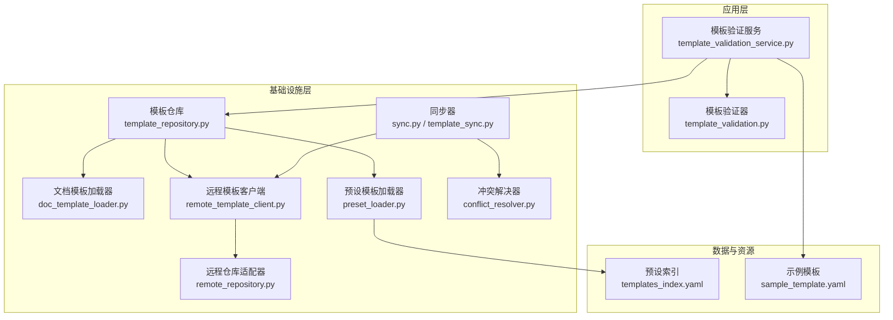
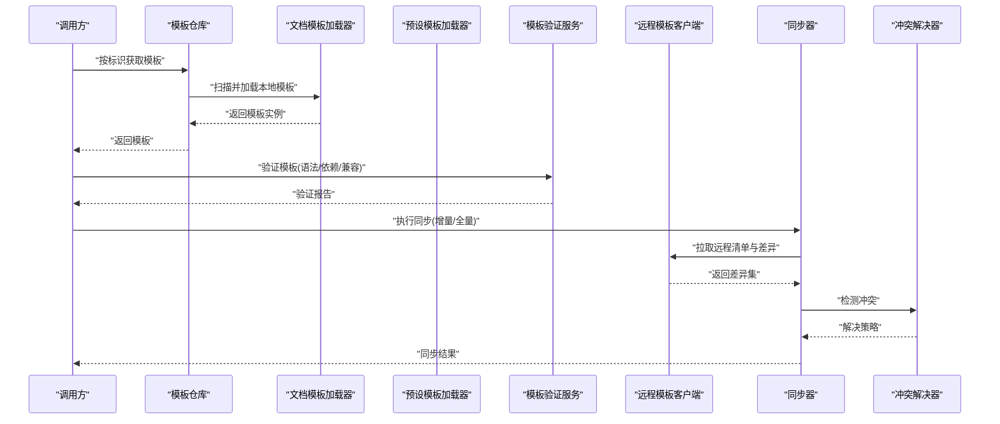
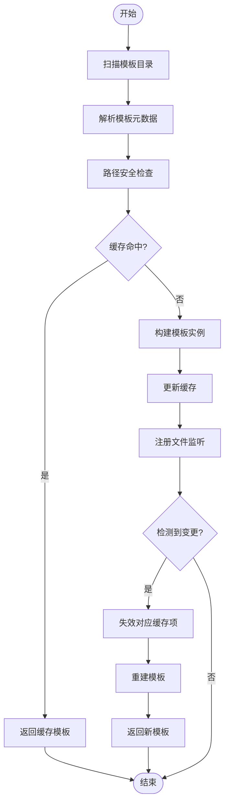
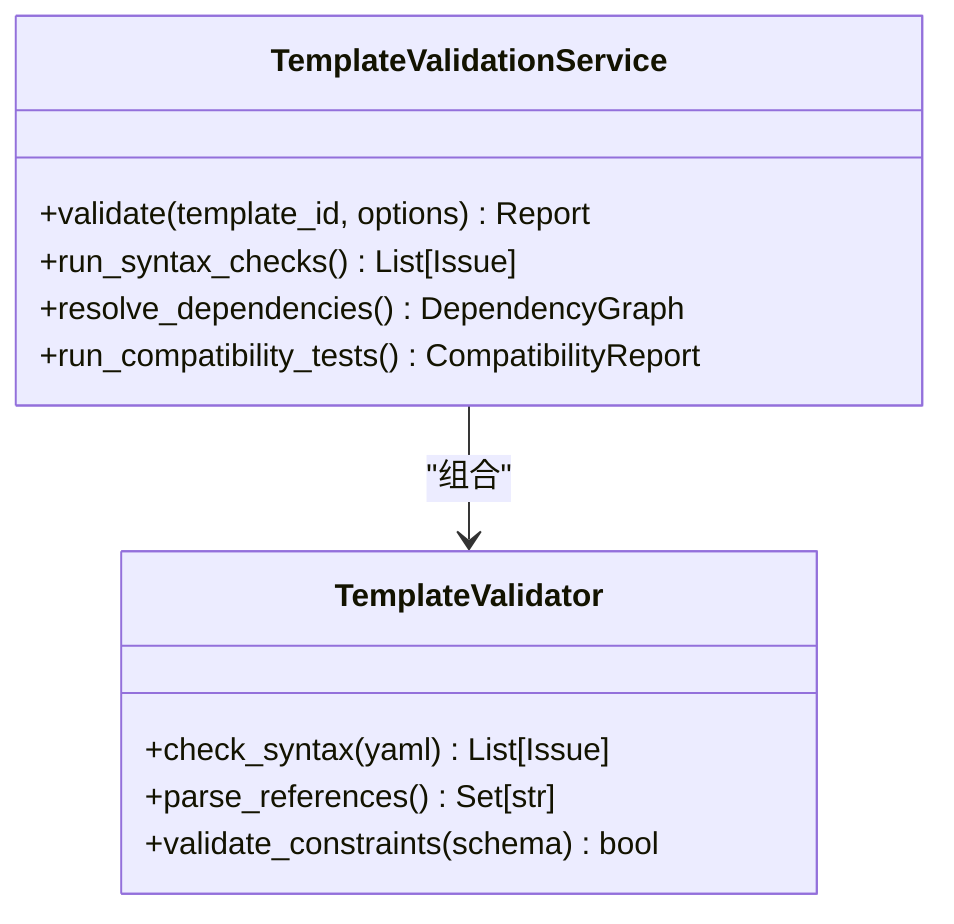
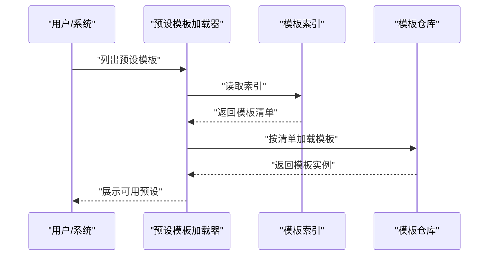
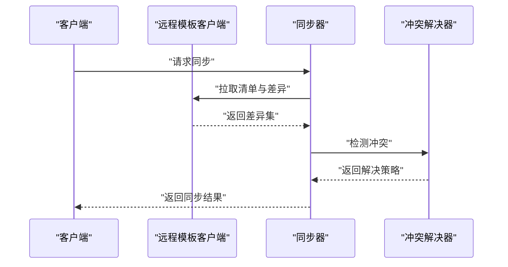
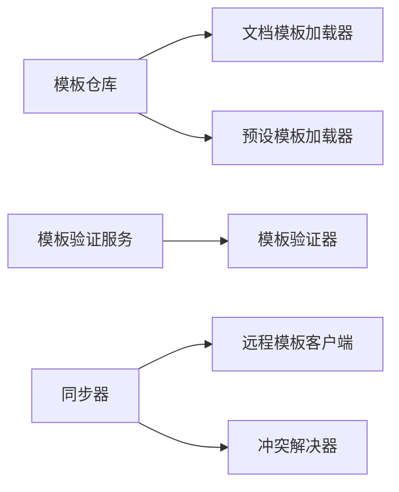

# 模板管理系统

<cite>
**本文引用的文件**   
- [src/paper_format_corrector/infra/doc_template_loader.py](file://src/paper_format_corrector/infra/doc_template_loader.py)
- [src/paper_format_corrector/infra/template_repository.py](file://src/paper_format_corrector/infra/template_repository.py)
- [src/paper_format_corrector/infra/preset_loader.py](file://src/paper_format_corrector/infra/preset_loader.py)
- [src/paper_format_corrector/application/services/template_validation_service.py](file://src/paper_format_corrector/application/services/template_validation_service.py)
- [src/paper_format_corrector/application/services/template_validation.py](file://src/paper_format_corrector/application/services/template_validation.py)
- [src/paper_format_corrector/infra/remote_template_client.py](file://src/paper_format_corrector/infra/remote_template_client.py)
- [src/paper_format_corrector/infra/remote/sync.py](file://src/paper_format_corrector/infra/remote/sync.py)
- [src/paper_format_corrector/infra/remote/conflict_resolver.py](file://src/paper_format_corrector/infra/remote/conflict_resolver.py)
- [src/paper_format_corrector/infra/remote/remote_repository.py](file://src/paper_format_corrector/infra/remote/remote_repository.py)
- [src/paper_format_corrector/infra/template_sync.py](file://src/paper_format_corrector/infra/template_sync.py)
- [presets/templates_index.yaml](file://presets/templates_index.yaml)
- [examples/sample_template.yaml](file://examples/sample_template.yaml)
- [tests/test_template_repository.py](file://tests/test_template_repository.py)
- [tests/test_template_sync.py](file://tests/test_template_sync.py)
- [tests/test_template_validation_and_import.py](file://tests/test_template_validation_and_import.py)
</cite>

## 目录
1. [简介](#简介)
2. [项目结构](#项目结构)
3. [核心组件](#核心组件)
4. [架构总览](#架构总览)
5. [详细组件分析](#详细组件分析)
6. [依赖关系分析](#依赖关系分析)
7. [性能考虑](#性能考虑)
8. [故障排查指南](#故障排查指南)
9. [结论](#结论)
10. [附录](#附录)

## 简介
本技术文档围绕“模板管理系统”展开，聚焦以下目标：
- 动态模板加载机制：文件系统扫描、缓存策略与热重载
- 模板验证系统：语法检查、依赖解析与兼容性测试
- 预设模板管理：内置索引、版本控制与更新机制
- 模板开发指南：YAML配置语法、规则定义方法与测试框架使用
- 远程模板仓库集成：同步机制、冲突解决与离线支持
- 发布流程与最佳实践

## 项目结构
模板相关能力主要分布在 infra（基础设施）、application（应用服务）、presets（预设模板）与 tests（测试）等目录中。关键模块职责如下：
- 模板加载与仓库：负责从本地文件系统扫描、加载、缓存模板，并提供统一访问接口
- 预设模板加载器：维护内置模板索引，提供按名称或分类的查询能力
- 模板验证服务：对模板进行语法校验、依赖解析与兼容性测试
- 远程模板客户端与同步：对接远程仓库，实现增量同步、冲突解决与离线可用
- 测试套件：覆盖仓库行为、同步流程与验证逻辑

图表来源
- [src/paper_format_corrector/infra/template_repository.py](file://src/paper_format_corrector/infra/template_repository.py)
- [src/paper_format_corrector/infra/doc_template_loader.py](file://src/paper_format_corrector/infra/doc_template_loader.py)
- [src/paper_format_corrector/infra/preset_loader.py](file://src/paper_format_corrector/infra/preset_loader.py)
- [src/paper_format_corrector/application/services/template_validation_service.py](file://src/paper_format_corrector/application/services/template_validation_service.py)
- [src/paper_format_corrector/application/services/template_validation.py](file://src/paper_format_corrector/application/services/template_validation.py)
- [src/paper_format_corrector/infra/remote_template_client.py](file://src/paper_format_corrector/infra/remote_template_client.py)
- [src/paper_format_corrector/infra/remote/remote_repository.py](file://src/paper_format_corrector/infra/remote/remote_repository.py)
- [src/paper_format_corrector/infra/remote/sync.py](file://src/paper_format_corrector/infra/remote/sync.py)
- [src/paper_format_corrector/infra/remote/conflict_resolver.py](file://src/paper_format_corrector/infra/remote/conflict_resolver.py)
- [src/paper_format_corrector/infra/template_sync.py](file://src/paper_format_corrector/infra/template_sync.py)
- [presets/templates_index.yaml](file://presets/templates_index.yaml)
- [examples/sample_template.yaml](file://examples/sample_template.yaml)

章节来源
- [src/paper_format_corrector/infra/template_repository.py](file://src/paper_format_corrector/infra/template_repository.py)
- [src/paper_format_corrector/infra/doc_template_loader.py](file://src/paper_format_corrector/infra/doc_template_loader.py)
- [src/paper_format_corrector/infra/preset_loader.py](file://src/paper_format_corrector/infra/preset_loader.py)
- [src/paper_format_corrector/application/services/template_validation_service.py](file://src/paper_format_corrector/application/services/template_validation_service.py)
- [src/paper_format_corrector/application/services/template_validation.py](file://src/paper_format_corrector/application/services/template_validation.py)
- [src/paper_format_corrector/infra/remote_template_client.py](file://src/paper_format_corrector/infra/remote_template_client.py)
- [src/paper_format_corrector/infra/remote/remote_repository.py](file://src/paper_format_corrector/infra/remote/remote_repository.py)
- [src/paper_format_corrector/infra/remote/sync.py](file://src/paper_format_corrector/infra/remote/sync.py)
- [src/paper_format_corrector/infra/remote/conflict_resolver.py](file://src/paper_format_corrector/infra/remote/conflict_resolver.py)
- [src/paper_format_corrector/infra/template_sync.py](file://src/paper_format_corrector/infra/template_sync.py)
- [presets/templates_index.yaml](file://presets/templates_index.yaml)
- [examples/sample_template.yaml](file://examples/sample_template.yaml)

## 核心组件
- 模板仓库（TemplateRepository）
  - 职责：统一管理模板的加载、缓存、版本选择与卸载；对外暴露按标识获取模板实例的能力
  - 关键点：结合文件系统扫描与内存缓存，支持按需刷新与失效策略
- 文档模板加载器（DocTemplateLoader）
  - 职责：解析模板元数据与内容，构建可执行的模板对象
  - 关键点：路径安全校验、依赖收集、懒加载
- 预设模板加载器（PresetLoader）
  - 职责：读取内置模板索引，提供按名称/分类检索与默认模板选择
  - 关键点：索引变更感知、回退到内置集合
- 模板验证服务（TemplateValidationService）
  - 职责：编排语法检查、依赖解析与兼容性测试，输出验证报告
  - 关键点：错误聚合、断言级别分级、可插拔校验器
- 远程模板客户端（RemoteTemplateClient）
  - 职责：封装远程仓库协议，提供拉取、列表、差异对比等操作
  - 关键点：认证、重试、超时与降级
- 同步器（Sync/TemplateSync）
  - 职责：执行增量同步、冲突检测与合并、离线缓存
  - 关键点：幂等性、事务性提交、冲突策略
- 冲突解决器（ConflictResolver）
  - 职责：基于时间戳、版本号与内容哈希判定冲突并给出解决策略
  - 关键点：三方合并、用户介入提示

章节来源
- [src/paper_format_corrector/infra/template_repository.py](file://src/paper_format_corrector/infra/template_repository.py)
- [src/paper_format_corrector/infra/doc_template_loader.py](file://src/paper_format_corrector/infra/doc_template_loader.py)
- [src/paper_format_corrector/infra/preset_loader.py](file://src/paper_format_corrector/infra/preset_loader.py)
- [src/paper_format_corrector/application/services/template_validation_service.py](file://src/paper_format_corrector/application/services/template_validation_service.py)
- [src/paper_format_corrector/application/services/template_validation.py](file://src/paper_format_corrector/application/services/template_validation.py)
- [src/paper_format_corrector/infra/remote_template_client.py](file://src/paper_format_corrector/infra/remote_template_client.py)
- [src/paper_format_corrector/infra/remote/sync.py](file://src/paper_format_corrector/infra/remote/sync.py)
- [src/paper_format_corrector/infra/remote/conflict_resolver.py](file://src/paper_format_corrector/infra/remote/conflict_resolver.py)
- [src/paper_format_corrector/infra/template_sync.py](file://src/paper_format_corrector/infra/template_sync.py)

## 架构总览
下图展示了模板在系统中的加载、验证与同步主流程，以及各组件之间的交互关系。

图表来源
- [src/paper_format_corrector/infra/template_repository.py](file://src/paper_format_corrector/infra/template_repository.py)
- [src/paper_format_corrector/infra/doc_template_loader.py](file://src/paper_format_corrector/infra/doc_template_loader.py)
- [src/paper_format_corrector/infra/preset_loader.py](file://src/paper_format_corrector/infra/preset_loader.py)
- [src/paper_format_corrector/application/services/template_validation_service.py](file://src/paper_format_corrector/application/services/template_validation_service.py)
- [src/paper_format_corrector/infra/remote_template_client.py](file://src/paper_format_corrector/infra/remote_template_client.py)
- [src/paper_format_corrector/infra/remote/sync.py](file://src/paper_format_corrector/infra/remote/sync.py)
- [src/paper_format_corrector/infra/remote/conflict_resolver.py](file://src/paper_format_corrector/infra/remote/conflict_resolver.py)

## 详细组件分析

### 动态模板加载机制（文件系统扫描、缓存策略、热重载）
- 文件系统扫描
  - 通过模板仓库驱动加载器遍历模板目录，识别有效模板清单与资源文件
  - 支持按命名空间/分类组织，过滤无效或损坏的模板
- 缓存策略
  - 内存缓存：以模板标识为键，缓存已解析的模板对象与元数据
  - 磁盘缓存：可选持久化缓存，加速冷启动
  - 失效策略：基于文件mtime或显式失效标记，保证一致性
- 热重载
  - 监听模板目录变更事件，触发增量重建与缓存更新
  - 提供手动刷新接口，便于调试与发布后即时生效

图表来源
- [src/paper_format_corrector/infra/template_repository.py](file://src/paper_format_corrector/infra/template_repository.py)
- [src/paper_format_corrector/infra/doc_template_loader.py](file://src/paper_format_corrector/infra/doc_template_loader.py)

章节来源
- [src/paper_format_corrector/infra/template_repository.py](file://src/paper_format_corrector/infra/template_repository.py)
- [src/paper_format_corrector/infra/doc_template_loader.py](file://src/paper_format_corrector/infra/doc_template_loader.py)

### 模板验证系统（语法检查、依赖解析、兼容性测试）
- 语法检查
  - 校验YAML结构、必填字段、类型约束与取值范围
  - 对引用路径、占位符与宏表达式进行词法/语法分析
- 依赖解析
  - 解析模板间依赖图，检测循环依赖与缺失依赖
  - 生成依赖清单用于预检与打包
- 兼容性测试
  - 基于目标平台/引擎版本矩阵运行最小用例集
  - 输出兼容性矩阵与失败详情

图表来源
- [src/paper_format_corrector/application/services/template_validation_service.py](file://src/paper_format_corrector/application/services/template_validation_service.py)
- [src/paper_format_corrector/application/services/template_validation.py](file://src/paper_format_corrector/application/services/template_validation.py)

章节来源
- [src/paper_format_corrector/application/services/template_validation_service.py](file://src/paper_format_corrector/application/services/template_validation_service.py)
- [src/paper_format_corrector/application/services/template_validation.py](file://src/paper_format_corrector/application/services/template_validation.py)

### 预设模板的加载与管理（内置索引、版本控制、更新机制）
- 内置模板索引
  - 通过索引文件集中描述预设模板的元信息（名称、版本、分类、适用场景）
  - 提供按名称、分类、标签的快速检索
- 版本控制
  - 每个预设模板包含版本字段，支持语义化版本比较
  - 升级时优先保留用户自定义覆盖
- 更新机制
  - 支持从内置源或远程源拉取更新包
  - 提供回滚与快照能力

图表来源
- [src/paper_format_corrector/infra/preset_loader.py](file://src/paper_format_corrector/infra/preset_loader.py)
- [presets/templates_index.yaml](file://presets/templates_index.yaml)
- [src/paper_format_corrector/infra/template_repository.py](file://src/paper_format_corrector/infra/template_repository.py)

章节来源
- [src/paper_format_corrector/infra/preset_loader.py](file://src/paper_format_corrector/infra/preset_loader.py)
- [presets/templates_index.yaml](file://presets/templates_index.yaml)

### 模板开发指南（YAML配置语法、规则定义方法、测试框架使用）
- YAML配置语法
  - 建议遵循示例模板的结构与字段约定，确保必填字段完整
  - 使用注释说明复杂字段含义与取值范围
- 规则定义方法
  - 将格式化规则抽象为可复用的片段，避免重复定义
  - 通过依赖声明引入公共规则库
- 测试框架使用
  - 使用单元测试覆盖语法校验、依赖解析与兼容性测试
  - 提供最小可复现用例与期望输出，便于回归

章节来源
- [examples/sample_template.yaml](file://examples/sample_template.yaml)
- [tests/test_template_validation_and_import.py](file://tests/test_template_validation_and_import.py)

### 远程模板仓库集成（同步机制、冲突解决、离线支持）
- 同步机制
  - 增量同步：基于清单与差异集拉取变更，减少网络开销
  - 全量同步：首次安装或强制更新时使用
- 冲突解决
  - 基于时间戳、版本号与内容哈希判断冲突
  - 支持自动策略（最新优先/本地优先）与人工确认
- 离线支持
  - 本地缓存最近一次成功同步状态
  - 无网络时仍可加载已缓存模板与索引

图表来源
- [src/paper_format_corrector/infra/remote_template_client.py](file://src/paper_format_corrector/infra/remote_template_client.py)
- [src/paper_format_corrector/infra/remote/sync.py](file://src/paper_format_corrector/infra/remote/sync.py)
- [src/paper_format_corrector/infra/remote/conflict_resolver.py](file://src/paper_format_corrector/infra/remote/conflict_resolver.py)
- [src/paper_format_corrector/infra/template_sync.py](file://src/paper_format_corrector/infra/template_sync.py)

章节来源
- [src/paper_format_corrector/infra/remote_template_client.py](file://src/paper_format_corrector/infra/remote_template_client.py)
- [src/paper_format_corrector/infra/remote/sync.py](file://src/paper_format_corrector/infra/remote/sync.py)
- [src/paper_format_corrector/infra/remote/conflict_resolver.py](file://src/paper_format_corrector/infra/remote/conflict_resolver.py)
- [src/paper_format_corrector/infra/template_sync.py](file://src/paper_format_corrector/infra/template_sync.py)

### 模板发布流程与最佳实践
- 发布流程
  - 编写模板与配套测试，完成本地验证
  - 提交至远程仓库，触发CI校验（语法、依赖、兼容性）
  - 打标签并发布新版本，更新索引
- 最佳实践
  - 保持向后兼容，重大变更需提升主版本
  - 提供迁移脚本与回滚方案
  - 完善文档与示例，降低使用门槛

章节来源
- [tests/test_template_repository.py](file://tests/test_template_repository.py)
- [tests/test_template_sync.py](file://tests/test_template_sync.py)

## 依赖关系分析
- 组件耦合
  - 模板仓库依赖加载器与预设加载器，屏蔽底层差异
  - 验证服务依赖具体验证器，便于扩展新的校验规则
  - 同步器依赖远程客户端与冲突解决器，形成稳定的协作边界
- 外部依赖
  - 文件系统I/O、网络I/O、序列化/反序列化
- 潜在风险
  - 循环依赖：应避免在加载器与仓库之间相互直接调用
  - 单点故障：远程不可用时应优雅降级

图表来源
- [src/paper_format_corrector/infra/template_repository.py](file://src/paper_format_corrector/infra/template_repository.py)
- [src/paper_format_corrector/infra/doc_template_loader.py](file://src/paper_format_corrector/infra/doc_template_loader.py)
- [src/paper_format_corrector/infra/preset_loader.py](file://src/paper_format_corrector/infra/preset_loader.py)
- [src/paper_format_corrector/application/services/template_validation_service.py](file://src/paper_format_corrector/application/services/template_validation_service.py)
- [src/paper_format_corrector/application/services/template_validation.py](file://src/paper_format_corrector/application/services/template_validation.py)
- [src/paper_format_corrector/infra/remote_template_client.py](file://src/paper_format_corrector/infra/remote_template_client.py)
- [src/paper_format_corrector/infra/remote/sync.py](file://src/paper_format_corrector/infra/remote/sync.py)
- [src/paper_format_corrector/infra/remote/conflict_resolver.py](file://src/paper_format_corrector/infra/remote/conflict_resolver.py)

章节来源
- [src/paper_format_corrector/infra/template_repository.py](file://src/paper_format_corrector/infra/template_repository.py)
- [src/paper_format_corrector/infra/doc_template_loader.py](file://src/paper_format_corrector/infra/doc_template_loader.py)
- [src/paper_format_corrector/infra/preset_loader.py](file://src/paper_format_corrector/infra/preset_loader.py)
- [src/paper_format_corrector/application/services/template_validation_service.py](file://src/paper_format_corrector/application/services/template_validation_service.py)
- [src/paper_format_corrector/application/services/template_validation.py](file://src/paper_format_corrector/application/services/template_validation.py)
- [src/paper_format_corrector/infra/remote_template_client.py](file://src/paper_format_corrector/infra/remote_template_client.py)
- [src/paper_format_corrector/infra/remote/sync.py](file://src/paper_format_corrector/infra/remote/sync.py)
- [src/paper_format_corrector/infra/remote/conflict_resolver.py](file://src/paper_format_corrector/infra/remote/conflict_resolver.py)

## 性能考虑
- 缓存命中率优化
  - 合理设置缓存过期时间与失效粒度，避免全量重建
- 并发与锁
  - 对热点模板采用读多写少的并发模型，写入时加细粒度锁
- I/O与网络
  - 批量操作合并请求，减少往返次数
  - 启用压缩与断点续传，提高弱网环境稳定性
- 资源清理
  - 及时释放未使用的模板实例与临时文件，防止内存泄漏

## 故障排查指南
- 常见问题
  - 模板无法加载：检查路径安全、权限与YAML语法
  - 依赖解析失败：核对依赖声明与版本约束
  - 同步失败：查看网络状态、认证信息与服务器响应码
- 定位手段
  - 开启详细日志，记录关键步骤与异常堆栈
  - 使用最小用例复现问题，逐步缩小范围
- 恢复策略
  - 回滚到上一个稳定版本
  - 清理缓存并重试

章节来源
- [tests/test_template_repository.py](file://tests/test_template_repository.py)
- [tests/test_template_sync.py](file://tests/test_template_sync.py)
- [tests/test_template_validation_and_import.py](file://tests/test_template_validation_and_import.py)

## 结论
本模板管理系统通过清晰的组件划分与稳健的加载、验证与同步机制，提供了可扩展、可维护且高性能的模板管理能力。配合完善的测试与发布流程，能够保障模板生态的稳定演进与快速迭代。

## 附录
- 术语表
  - 模板：描述文档结构与格式规则的配置文件与资源集合
  - 预设模板：系统内置的常用模板，开箱即用
  - 同步：将远程模板变更应用到本地的过程
- 参考文件
  - 示例模板：[examples/sample_template.yaml](file://examples/sample_template.yaml)
  - 预设索引：[presets/templates_index.yaml](file://presets/templates_index.yaml)