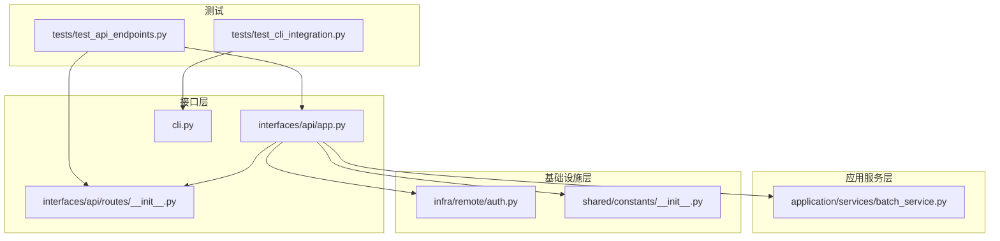
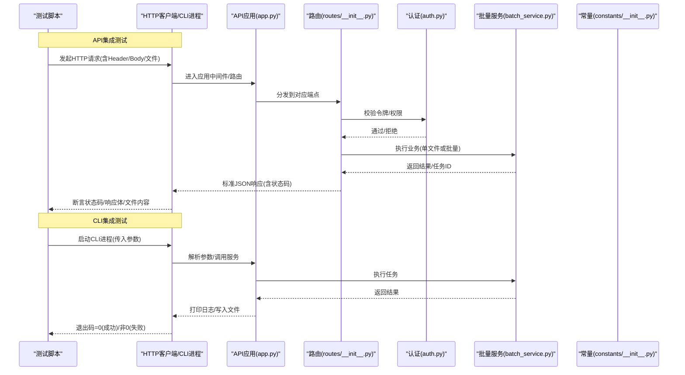
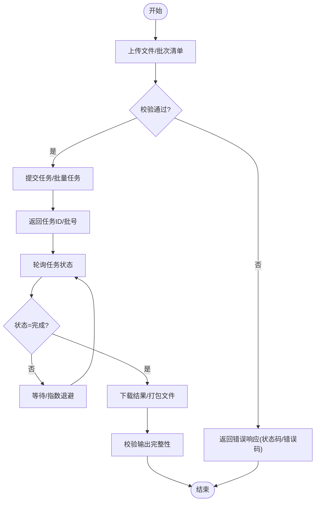
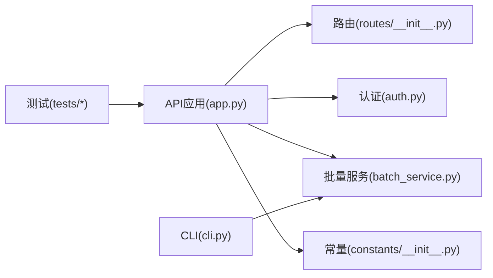

# API接口集成测试

<cite>
**本文引用的文件**   
- [tests/test_api_endpoints.py](file://tests/test_api_endpoints.py)
- [tests/test_cli_integration.py](file://tests/test_cli_integration.py)
- [src/paper_format_corrector/interfaces/api/routes/__init__.py](file://src/paper_format_corrector/interfaces/api/routes/__init__.py)
- [src/paper_format_corrector/interfaces/api/app.py](file://src/paper_format_corrector/interfaces/api/app.py)
- [src/paper_format_corrector/cli.py](file://src/paper_format_corrector/cli.py)
- [src/paper_format_corrector/infra/remote/auth.py](file://src/paper_format_corrector/infra/remote/auth.py)
- [src/paper_format_corrector/application/services/batch_service.py](file://src/paper_format_corrector/application/services/batch_service.py)
- [src/paper_format_corrector/shared/constants/__init__.py](file://src/paper_format_corrector/shared/constants/__init__.py)
</cite>

## 目录
1. [简介](#简介)
2. [项目结构](#项目结构)
3. [核心组件](#核心组件)
4. [架构总览](#架构总览)
5. [详细组件分析](#详细组件分析)
6. [依赖关系分析](#依赖关系分析)
7. [性能考虑](#性能考虑)
8. [故障排查指南](#故障排查指南)
9. [结论](#结论)
10. [附录](#附录) 

## 简介
本指南面向需要为论文格式矫正工具的API与CLI进行集成测试的工程师，围绕以下目标展开：
- RESTful API端点的测试实现（HTTP请求模拟、响应验证、错误处理）
- CLI工具集成测试（命令行参数、输出验证、退出码检查）
- 异步API与并发请求测试策略
- 认证与授权机制的测试用例设计
- 文件上传下载与批量处理接口的测试方法
- API版本兼容性测试方法

## 项目结构
本项目采用分层与按功能域组织相结合的结构。与API和CLI集成测试直接相关的代码主要位于：
- 接口层：API路由与应用装配、CLI入口
- 应用服务层：批量处理等业务流程
- 基础设施层：认证、远程能力等
- 测试层：针对API与CLI的集成测试

图表来源
- [tests/test_api_endpoints.py](file://tests/test_api_endpoints.py)
- [tests/test_cli_integration.py](file://tests/test_cli_integration.py)
- [src/paper_format_corrector/interfaces/api/app.py](file://src/paper_format_corrector/interfaces/api/app.py)
- [src/paper_format_corrector/interfaces/api/routes/__init__.py](file://src/paper_format_corrector/interfaces/api/routes/__init__.py)
- [src/paper_format_corrector/cli.py](file://src/paper_format_corrector/cli.py)
- [src/paper_format_corrector/application/services/batch_service.py](file://src/paper_format_corrector/application/services/batch_service.py)
- [src/paper_format_corrector/infra/remote/auth.py](file://src/paper_format_corrector/infra/remote/auth.py)
- [src/paper_format_corrector/shared/constants/__init__.py](file://src/paper_format_corrector/shared/constants/__init__.py)

章节来源
- [tests/test_api_endpoints.py](file://tests/test_api_endpoints.py)
- [tests/test_cli_integration.py](file://tests/test_cli_integration.py)
- [src/paper_format_corrector/interfaces/api/app.py](file://src/paper_format_corrector/interfaces/api/app.py)
- [src/paper_format_corrector/interfaces/api/routes/__init__.py](file://src/paper_format_corrector/interfaces/api/routes/__init__.py)
- [src/paper_format_corrector/cli.py](file://src/paper_format_corrector/cli.py)
- [src/paper_format_corrector/application/services/batch_service.py](file://src/paper_format_corrector/application/services/batch_service.py)
- [src/paper_format_corrector/infra/remote/auth.py](file://src/paper_format_corrector/infra/remote/auth.py)
- [src/paper_format_corrector/shared/constants/__init__.py](file://src/paper_format_corrector/shared/constants/__init__.py)

## 核心组件
- API应用装配与路由注册：负责创建Web应用实例、挂载中间件与路由，提供REST端点。
- 路由模块：定义具体路径与处理器，承载业务调用与数据校验。
- CLI入口：解析命令行参数、执行任务并返回退出码。
- 批量服务：封装批量处理流程，供API或CLI调用。
- 认证模块：提供鉴权逻辑（如Token校验、权限判断）。
- 常量模块：集中管理状态码、错误码、版本标识等。

章节来源
- [src/paper_format_corrector/interfaces/api/app.py](file://src/paper_format_corrector/interfaces/api/app.py)
- [src/paper_format_corrector/interfaces/api/routes/__init__.py](file://src/paper_format_corrector/interfaces/api/routes/__init__.py)
- [src/paper_format_corrector/cli.py](file://src/paper_format_corrector/cli.py)
- [src/paper_format_corrector/application/services/batch_service.py](file://src/paper_format_corrector/application/services/batch_service.py)
- [src/paper_format_corrector/infra/remote/auth.py](file://src/paper_format_corrector/infra/remote/auth.py)
- [src/paper_format_corrector/shared/constants/__init__.py](file://src/paper_format_corrector/shared/constants/__init__.py)

## 架构总览
下图展示了从测试到服务端的关键交互路径，包括API与CLI两条主线以及认证、批量服务的参与。

图表来源
- [tests/test_api_endpoints.py](file://tests/test_api_endpoints.py)
- [tests/test_cli_integration.py](file://tests/test_cli_integration.py)
- [src/paper_format_corrector/interfaces/api/app.py](file://src/paper_format_corrector/interfaces/api/app.py)
- [src/paper_format_corrector/interfaces/api/routes/__init__.py](file://src/paper_format_corrector/interfaces/api/routes/__init__.py)
- [src/paper_format_corrector/infra/remote/auth.py](file://src/paper_format_corrector/infra/remote/auth.py)
- [src/paper_format_corrector/application/services/batch_service.py](file://src/paper_format_corrector/application/services/batch_service.py)
- [src/paper_format_corrector/shared/constants/__init__.py](file://src/paper_format_corrector/shared/constants/__init__.py)

## 详细组件分析

### RESTful API端点测试（test_api_endpoints.py）
- HTTP请求模拟
  - 使用测试客户端或HTTP库构造GET/POST/PUT/DELETE请求，覆盖正常路径与异常路径。
  - 对查询参数、路径参数、请求头（如Content-Type、Authorization）、表单与multipart上传进行组合测试。
- 响应验证
  - 断言HTTP状态码、响应头、JSON结构字段与类型、分页信息、错误码与消息。
  - 对文件下载接口，校验响应Content-Type、文件名、文件大小与内容一致性。
- 错误处理测试
  - 输入校验失败、资源不存在、权限不足、服务器内部错误等场景的状态码与错误体结构。
  - 幂等性与重试边界条件（如重复提交、超时重试）。
- 典型用例建议
  - 健康检查与版本信息端点
  - 文档处理单文件上传与下载
  - 批量任务提交与进度查询
  - 模板管理与校验
  - 搜索与过滤（分页、排序、范围查询）

章节来源
- [tests/test_api_endpoints.py](file://tests/test_api_endpoints.py)
- [src/paper_format_corrector/interfaces/api/app.py](file://src/paper_format_corrector/interfaces/api/app.py)
- [src/paper_format_corrector/interfaces/api/routes/__init__.py](file://src/paper_format_corrector/interfaces/api/routes/__init__.py)
- [src/paper_format_corrector/infra/remote/auth.py](file://src/paper_format_corrector/infra/remote/auth.py)
- [src/paper_format_corrector/shared/constants/__init__.py](file://src/paper_format_corrector/shared/constants/__init__.py)

### CLI工具集成测试（test_cli_integration.py）
- 命令行参数测试
  - 覆盖必需参数缺失、非法值、互斥参数、默认值与帮助信息。
- 输出验证
  - 标准输出/标准错误的内容片段匹配；日志级别控制；结构化输出开关。
- 退出码检查
  - 成功返回0；参数错误返回特定非0码；运行时错误返回另一非0码。
- 典型用例建议
  - 单文件处理模式
  - 批量目录扫描模式
  - 配置加载与覆盖
  - 模板选择与校验
  - 输出目录与命名规则

章节来源
- [tests/test_cli_integration.py](file://tests/test_cli_integration.py)
- [src/paper_format_corrector/cli.py](file://src/paper_format_corrector/cli.py)

### 异步API与并发请求测试策略
- 异步API
  - 使用异步HTTP客户端发起请求，结合事件循环与超时控制。
  - 对长耗时任务采用“提交任务—轮询状态”的模式，断言任务生命周期各阶段状态。
- 并发请求
  - 使用线程池或协程并发发起请求，验证资源竞争、锁与队列行为。
  - 压测关键路径，观察吞吐、延迟与错误率，确保稳定性。
- 注意事项
  - 设置合理的超时与重试退避策略。
  - 隔离测试数据与环境，避免相互污染。
  - 对共享资源（如临时目录、数据库）进行清理与回滚。

章节来源
- [src/paper_format_corrector/application/services/batch_service.py](file://src/paper_format_corrector/application/services/batch_service.py)
- [src/paper_format_corrector/interfaces/api/app.py](file://src/paper_format_corrector/interfaces/api/app.py)

### 认证与授权机制的测试用例设计
- 认证
  - 无Token访问受保护端点应返回未授权状态码。
  - Token过期、签名无效、用户被禁用等场景的错误响应。
- 授权
  - 不同角色对同一资源的访问控制（读/写/删除）。
  - 跨租户/跨项目数据隔离验证。
- 最佳实践
  - 使用测试夹具生成有效/无效Token。
  - 将认证逻辑与业务逻辑解耦，便于Mock与替换。
  - 记录鉴权决策以便审计与定位问题。

章节来源
- [src/paper_format_corrector/infra/remote/auth.py](file://src/paper_format_corrector/infra/remote/auth.py)
- [src/paper_format_corrector/interfaces/api/routes/__init__.py](file://src/paper_format_corrector/interfaces/api/routes/__init__.py)

### 文件上传下载与批量处理接口测试
- 文件上传
  - 支持多格式输入、大小限制、MIME类型校验、恶意文件名防护。
  - 分块上传与断点续传（若实现）的可靠性与一致性。
- 文件下载
  - 正确设置Content-Disposition、文件名编码、流式传输与大文件内存占用控制。
- 批量处理
  - 批量任务提交、任务列表查询、单个任务取消、批量取消。
  - 任务状态机：待处理、进行中、完成、失败、已取消。
  - 失败重试与补偿机制验证。

图表来源
- [src/paper_format_corrector/application/services/batch_service.py](file://src/paper_format_corrector/application/services/batch_service.py)
- [src/paper_format_corrector/interfaces/api/routes/__init__.py](file://src/paper_format_corrector/interfaces/api/routes/__init__.py)

章节来源
- [src/paper_format_corrector/application/services/batch_service.py](file://src/paper_format_corrector/application/services/batch_service.py)
- [src/paper_format_corrector/interfaces/api/routes/__init__.py](file://src/paper_format_corrector/interfaces/api/routes/__init__.py)

### API版本兼容性测试方法
- 版本标识
  - 在URL路径或请求头中携带版本号，服务端根据常量或配置进行路由分发。
- 兼容策略
  - 向后兼容：新字段可选、旧字段保留。
  - 废弃策略：弃用警告头、迁移指南链接。
- 测试要点
  - 同时运行多版本客户端，验证共存。
  - 变更影响面回归：新增字段不影响旧客户端解析。
  - 灰度发布与A/B流量切换下的行为一致性。

章节来源
- [src/paper_format_corrector/shared/constants/__init__.py](file://src/paper_format_corrector/shared/constants/__init__.py)
- [src/paper_format_corrector/interfaces/api/app.py](file://src/paper_format_corrector/interfaces/api/app.py)

## 依赖关系分析
- 低耦合高内聚
  - 路由层仅负责请求分发与基础校验，业务逻辑下沉至服务层。
  - 认证作为横切关注点，以中间件或装饰器形式注入。
- 外部依赖
  - 文件系统I/O、对象存储、消息队列（用于异步任务）等，应在测试中使用Mock或测试容器。
- 潜在风险
  - 全局状态与共享资源需严格隔离。
  - 第三方服务不稳定时，需具备降级与熔断策略。

图表来源
- [tests/test_api_endpoints.py](file://tests/test_api_endpoints.py)
- [tests/test_cli_integration.py](file://tests/test_cli_integration.py)
- [src/paper_format_corrector/interfaces/api/app.py](file://src/paper_format_corrector/interfaces/api/app.py)
- [src/paper_format_corrector/interfaces/api/routes/__init__.py](file://src/paper_format_corrector/interfaces/api/routes/__init__.py)
- [src/paper_format_corrector/infra/remote/auth.py](file://src/paper_format_corrector/infra/remote/auth.py)
- [src/paper_format_corrector/application/services/batch_service.py](file://src/paper_format_corrector/application/services/batch_service.py)
- [src/paper_format_corrector/shared/constants/__init__.py](file://src/paper_format_corrector/shared/constants/__init__.py)

章节来源
- [src/paper_format_corrector/interfaces/api/app.py](file://src/paper_format_corrector/interfaces/api/app.py)
- [src/paper_format_corrector/interfaces/api/routes/__init__.py](file://src/paper_format_corrector/interfaces/api/routes/__init__.py)
- [src/paper_format_corrector/application/services/batch_service.py](file://src/paper_format_corrector/application/services/batch_service.py)
- [src/paper_format_corrector/infra/remote/auth.py](file://src/paper_format_corrector/infra/remote/auth.py)
- [src/paper_format_corrector/shared/constants/__init__.py](file://src/paper_format_corrector/shared/constants/__init__.py)

## 性能考虑
- 大文件处理
  - 使用流式读写，避免一次性加载到内存；合理设置缓冲区大小。
- 并发与限流
  - 对热点接口实施速率限制与连接池复用；对CPU密集型任务引入工作队列。
- 缓存与去重
  - 对只读数据与计算结果进行缓存；对重复任务进行去重。
- 监控与可观测性
  - 暴露关键指标（QPS、P99延迟、错误率），结合分布式追踪定位瓶颈。

[本节为通用指导，不直接分析具体文件]

## 故障排查指南
- 常见问题
  - 401/403：检查Token有效性、权限范围与租户隔离。
  - 413/415：检查文件大小与MIME类型限制。
  - 500/503：查看服务端日志、依赖服务健康状态与资源水位。
- 定位步骤
  - 复现最小用例，开启调试日志。
  - 分离网络层与业务层问题，逐步缩小范围。
  - 对批量任务，核对任务状态与失败原因。
- 恢复策略
  - 自动重试与幂等键；失败任务入死信队列人工干预。
  - 快速回滚与降级开关。

章节来源
- [src/paper_format_corrector/infra/remote/auth.py](file://src/paper_format_corrector/infra/remote/auth.py)
- [src/paper_format_corrector/application/services/batch_service.py](file://src/paper_format_corrector/application/services/batch_service.py)

## 结论
通过系统化的API与CLI集成测试，可以显著提升系统的稳定性与可维护性。建议在CI中常态化运行端到端用例，结合契约测试与性能基准，持续保障质量。

[本节为总结性内容，不直接分析具体文件]

## 附录
- 测试环境准备
  - 使用独立数据库与对象存储；准备样例模板与测试文件集。
- 数据与资源管理
  - 测试前后清理临时文件与任务产物；使用事务或快照回滚。
- 最佳实践清单
  - 单一职责的用例命名与分组；失败时保留上下文与快照；避免硬编码敏感信息。

[本节为补充说明，不直接分析具体文件]