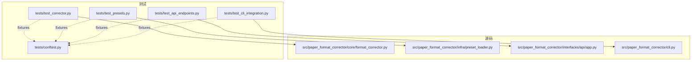
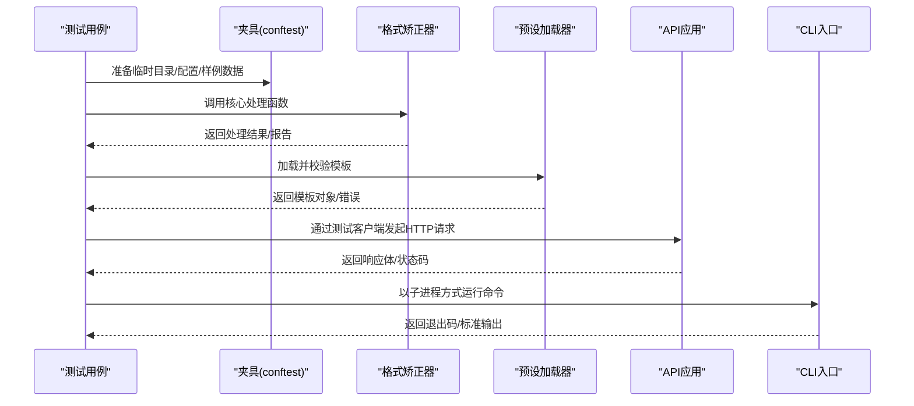
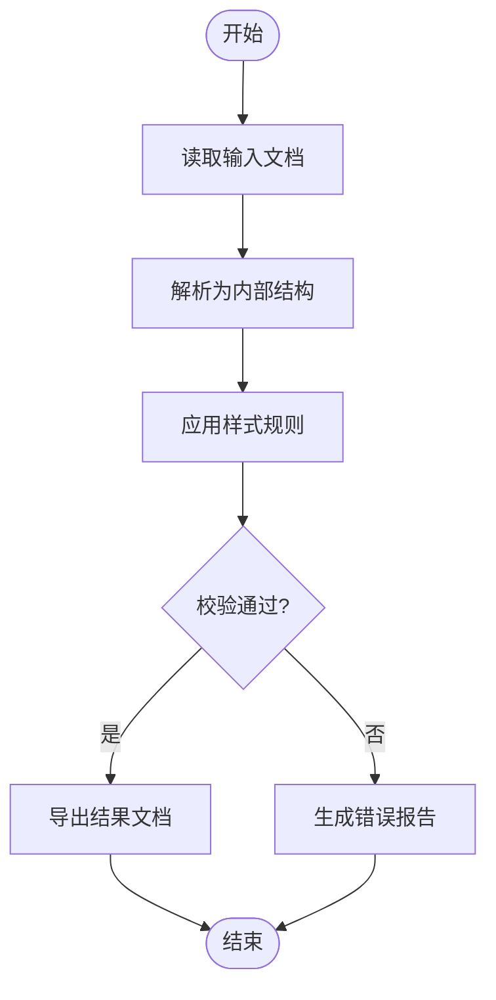
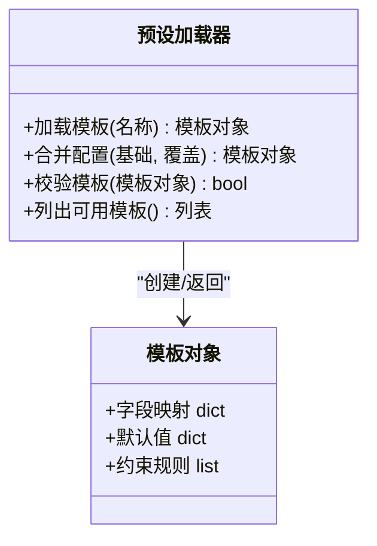
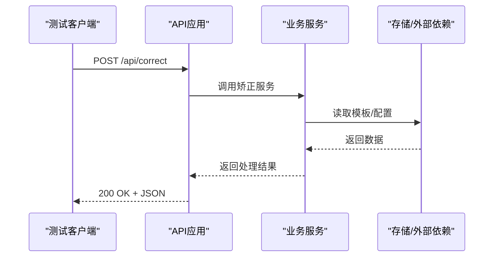
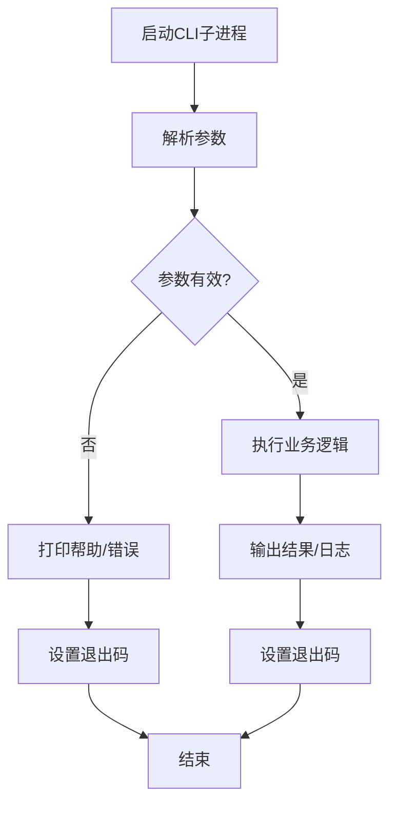
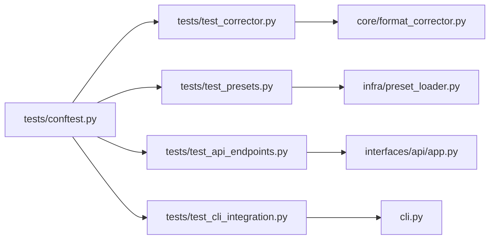

# 单元测试与集成测试

<cite>
**本文引用的文件**   
- [tests/test_corrector.py](file://tests/test_corrector.py)
- [tests/test_presets.py](file://tests/test_presets.py)
- [tests/test_api_endpoints.py](file://tests/test_api_endpoints.py)
- [tests/test_cli_integration.py](file://tests/test_cli_integration.py)
- [src/paper_format_corrector/core/format_corrector.py](file://src/paper_format_corrector/core/format_corrector.py)
- [src/paper_format_corrector/infra/preset_loader.py](file://src/paper_format_corrector/infra/preset_loader.py)
- [src/paper_format_corrector/interfaces/api/app.py](file://src/paper_format_corrector/interfaces/api/app.py)
- [src/paper_format_corrector/cli.py](file://src/paper_format_corrector/cli.py)
- [tests/conftest.py](file://tests/conftest.py)
</cite>

## 目录
1. [简介](#简介)
2. [项目结构](#项目结构)
3. [核心组件](#核心组件)
4. [架构总览](#架构总览)
5. [详细组件分析](#详细组件分析)
6. [依赖分析](#依赖分析)
7. [性能考虑](#性能考虑)
8. [故障排查指南](#故障排查指南)
9. [结论](#结论)
10. [附录](#附录)

## 简介
本指南面向开发与测试工程师，围绕论文格式矫正工具的核心功能，提供系统化的单元测试与集成测试策略。重点覆盖：
- 格式矫正器（test_corrector.py）的测试设计与实现
- 预设模板系统（test_presets.py）的验证与回归
- API接口（test_api_endpoints.py）的契约与端到端流程
- CLI集成（test_cli_integration.py）的命令行为与错误路径
- Mock与Stub的使用场景、测试数据管理与清理机制
- 边界条件与异常用例设计
- 异步与并发测试方法
- 外部依赖与服务集成的测试策略

## 项目结构
测试代码集中于 tests 目录，按被测模块划分；被测核心逻辑位于 src/paper_format_corrector 下，包含核心处理、基础设施、接口层等。

图表来源
- [tests/test_corrector.py](file://tests/test_corrector.py)
- [tests/test_presets.py](file://tests/test_presets.py)
- [tests/test_api_endpoints.py](file://tests/test_api_endpoints.py)
- [tests/test_cli_integration.py](file://tests/test_cli_integration.py)
- [tests/conftest.py](file://tests/conftest.py)
- [src/paper_format_corrector/core/format_corrector.py](file://src/paper_format_corrector/core/format_corrector.py)
- [src/paper_format_corrector/infra/preset_loader.py](file://src/paper_format_corrector/infra/preset_loader.py)
- [src/paper_format_corrector/interfaces/api/app.py](file://src/paper_format_corrector/interfaces/api/app.py)
- [src/paper_format_corrector/cli.py](file://src/paper_format_corrector/cli.py)

章节来源
- [tests/test_corrector.py](file://tests/test_corrector.py)
- [tests/test_presets.py](file://tests/test_presets.py)
- [tests/test_api_endpoints.py](file://tests/test_api_endpoints.py)
- [tests/test_cli_integration.py](file://tests/test_cli_integration.py)
- [tests/conftest.py](file://tests/conftest.py)
- [src/paper_format_corrector/core/format_corrector.py](file://src/paper_format_corrector/core/format_corrector.py)
- [src/paper_format_corrector/infra/preset_loader.py](file://src/paper_format_corrector/infra/preset_loader.py)
- [src/paper_format_corrector/interfaces/api/app.py](file://src/paper_format_corrector/interfaces/api/app.py)
- [src/paper_format_corrector/cli.py](file://src/paper_format_corrector/cli.py)

## 核心组件
本节聚焦四个关键测试目标及其被测对象，说明测试范围、断言要点与隔离策略。

- 格式矫正器测试（test_corrector.py）
  - 目标：验证文档解析、样式规则应用、段落/表格/图片处理、引用与交叉引用格式化等核心流程的正确性。
  - 关注点：输入输出一致性、中间状态可观测性、异常路径返回码与消息。
  - 隔离：对文件系统、外部工具、网络请求使用Mock或临时目录。

- 预设模板系统测试（test_presets.py）
  - 目标：校验模板加载、字段映射、默认值填充、冲突合并与回退策略。
  - 关注点：模板索引有效性、缺失键容错、类型转换与约束检查。
  - 隔离：固定模板集合、禁用远程同步与更新检查。

- API接口测试（test_api_endpoints.py）
  - 目标：验证HTTP路由、参数校验、响应体结构、状态码与错误语义。
  - 关注点：幂等性、分页/过滤、上传/下载流式处理、鉴权与限流（若启用）。
  - 隔离：使用测试客户端启动最小化服务，Mock下游依赖。

- CLI集成测试（test_cli_integration.py）
  - 目标：验证命令行入口、参数解析、子命令执行、日志与退出码。
  - 关注点：帮助信息、非法参数、交互式提示（若有）、工作目录与权限。
  - 隔离：模拟标准输入输出、临时工作区、冻结时间与环境变量。

章节来源
- [tests/test_corrector.py](file://tests/test_corrector.py)
- [tests/test_presets.py](file://tests/test_presets.py)
- [tests/test_api_endpoints.py](file://tests/test_api_endpoints.py)
- [tests/test_cli_integration.py](file://tests/test_cli_integration.py)
- [src/paper_format_corrector/core/format_corrector.py](file://src/paper_format_corrector/core/format_corrector.py)
- [src/paper_format_corrector/infra/preset_loader.py](file://src/paper_format_corrector/infra/preset_loader.py)
- [src/paper_format_corrector/interfaces/api/app.py](file://src/paper_format_corrector/interfaces/api/app.py)
- [src/paper_format_corrector/cli.py](file://src/paper_format_corrector/cli.py)

## 架构总览
下图展示从测试到被测系统的调用关系与数据流向，强调隔离点与断言位置。

图表来源
- [tests/conftest.py](file://tests/conftest.py)
- [src/paper_format_corrector/core/format_corrector.py](file://src/paper_format_corrector/core/format_corrector.py)
- [src/paper_format_corrector/infra/preset_loader.py](file://src/paper_format_corrector/infra/preset_loader.py)
- [src/paper_format_corrector/interfaces/api/app.py](file://src/paper_format_corrector/interfaces/api/app.py)
- [src/paper_format_corrector/cli.py](file://src/paper_format_corrector/cli.py)

## 详细组件分析

### 格式矫正器测试（test_corrector.py）
- 测试目标
  - 文档解析与结构化表示构建
  - 样式规则应用与差异对比
  - 多元素处理（段落、表格、图片、标题、脚注/尾注、目录）
  - 引用与交叉引用格式化
  - 批量处理与进度/报告生成
- 关键断言
  - 输出文档结构与内容一致性
  - 样式属性符合预期（字体、行距、缩进、编号等）
  - 错误路径返回明确错误码与诊断信息
- 隔离策略
  - 使用临时目录存放输入/输出，避免污染本地环境
  - 对文件I/O、外部工具调用进行Mock
  - 对耗时操作（如OCR、PDF解析）注入Stub返回

图表来源
- [tests/test_corrector.py](file://tests/test_corrector.py)
- [src/paper_format_corrector/core/format_corrector.py](file://src/paper_format_corrector/core/format_corrector.py)

章节来源
- [tests/test_corrector.py](file://tests/test_corrector.py)
- [src/paper_format_corrector/core/format_corrector.py](file://src/paper_format_corrector/core/format_corrector.py)

### 预设模板系统测试（test_presets.py）
- 测试目标
  - 模板索引与元数据完整性
  - 模板字段映射与默认值填充
  - 冲突合并策略与回退顺序
  - 模板版本兼容性与迁移
- 关键断言
  - 必填字段存在且类型正确
  - 缺失键时回退到默认值
  - 合并后最终配置满足约束
- 隔离策略
  - 锁定模板集合，禁止远程拉取
  - 使用只读副本防止写入干扰
  - 对网络访问与磁盘写操作进行Mock

图表来源
- [tests/test_presets.py](file://tests/test_presets.py)
- [src/paper_format_corrector/infra/preset_loader.py](file://src/paper_format_corrector/infra/preset_loader.py)

章节来源
- [tests/test_presets.py](file://tests/test_presets.py)
- [src/paper_format_corrector/infra/preset_loader.py](file://src/paper_format_corrector/infra/preset_loader.py)

### API接口测试（test_api_endpoints.py）
- 测试目标
  - HTTP路由注册与路径匹配
  - 请求参数校验与错误响应
  - 响应体结构与字段完整性
  - 文件上传/下载、分页与过滤
- 关键断言
  - 状态码与错误码一致
  - 响应JSON Schema符合定义
  - 幂等接口多次调用结果一致
- 隔离策略
  - 使用测试客户端启动最小化服务
  - Mock数据库、缓存、外部服务
  - 使用事务回滚或内存存储保证可重复性

图表来源
- [tests/test_api_endpoints.py](file://tests/test_api_endpoints.py)
- [src/paper_format_corrector/interfaces/api/app.py](file://src/paper_format_corrector/interfaces/api/app.py)

章节来源
- [tests/test_api_endpoints.py](file://tests/test_api_endpoints.py)
- [src/paper_format_corrector/interfaces/api/app.py](file://src/paper_format_corrector/interfaces/api/app.py)

### CLI集成测试（test_cli_integration.py）
- 测试目标
  - 主入口与子命令注册
  - 参数解析与帮助信息
  - 正常执行与错误路径
  - 日志输出与退出码
- 关键断言
  - 退出码符合约定
  - 标准输出/错误包含期望片段
  - 工作目录与权限影响被正确处理
- 隔离策略
  - 以子进程方式运行CLI，捕获stdout/stderr
  - 使用临时工作目录与冻结时间
  - 环境变量注入控制行为

图表来源
- [tests/test_cli_integration.py](file://tests/test_cli_integration.py)
- [src/paper_format_corrector/cli.py](file://src/paper_format_corrector/cli.py)

章节来源
- [tests/test_cli_integration.py](file://tests/test_cli_integration.py)
- [src/paper_format_corrector/cli.py](file://src/paper_format_corrector/cli.py)

### 测试数据管理与清理机制
- 管理策略
  - 使用夹具集中创建与销毁测试数据
  - 采用只读样本与最小数据集，降低维护成本
  - 对动态生成的数据赋予唯一标识，便于定位
- 清理机制
  - 每个用例结束后自动删除临时目录与文件
  - 数据库/缓存使用内存实现或事务回滚
  - 对共享资源加锁或串行化，避免竞态

章节来源
- [tests/conftest.py](file://tests/conftest.py)

### Mock与Stub使用场景
- Mock
  - 替换外部服务（网络、数据库、文件系统）
  - 记录调用次数与参数，用于契约断言
- Stub
  - 提供确定返回值，屏蔽不稳定因素（时间、随机数）
  - 注入异常路径，验证健壮性
- 最佳实践
  - 仅Mock边界与外部依赖，不Mock被测单元内部
  - 保持Mock轻量，避免过度耦合
  - 在夹具中统一配置，减少重复

章节来源
- [tests/test_corrector.py](file://tests/test_corrector.py)
- [tests/test_presets.py](file://tests/test_presets.py)
- [tests/test_api_endpoints.py](file://tests/test_api_endpoints.py)
- [tests/test_cli_integration.py](file://tests/test_cli_integration.py)

### 边界条件与异常情况设计
- 边界条件
  - 空输入、超大文件、特殊字符与编码问题
  - 模板缺失键、类型不匹配、版本不兼容
  - API参数越界、分页为空、排序字段不存在
  - CLI缺少必需参数、路径无权限、工作目录不可写
- 异常路径
  - 网络超时、连接失败、认证失败
  - 文件损坏、解析失败、规则冲突
  - 并发写入竞争、死锁检测与恢复

章节来源
- [tests/test_corrector.py](file://tests/test_corrector.py)
- [tests/test_presets.py](file://tests/test_presets.py)
- [tests/test_api_endpoints.py](file://tests/test_api_endpoints.py)
- [tests/test_cli_integration.py](file://tests/test_cli_integration.py)

### 异步与并发测试方法
- 异步测试
  - 使用事件循环驱动协程，确保回调与异常传播
  - 对超时、取消、重试进行断言
- 并发测试
  - 使用线程/进程池模拟高并发
  - 对共享资源加锁、队列消费、任务去重进行验证
  - 使用确定性调度或种子固定随机性，提升稳定性

章节来源
- [tests/test_api_endpoints.py](file://tests/test_api_endpoints.py)
- [tests/test_cli_integration.py](file://tests/test_cli_integration.py)

### 外部依赖与服务集成测试
- 策略
  - 优先使用Mock/Stub替代真实依赖
  - 对必须集成的服务，使用容器化或内存实现
  - 将集成测试与单元测试分离，按需执行
- 注意事项
  - 控制外部依赖可用性标志位
  - 记录依赖版本与兼容性矩阵
  - 对敏感配置使用环境变量注入

章节来源
- [tests/test_api_endpoints.py](file://tests/test_api_endpoints.py)
- [tests/test_cli_integration.py](file://tests/test_cli_integration.py)

## 依赖分析
测试与被测模块之间的依赖关系如下：

图表来源
- [tests/test_corrector.py](file://tests/test_corrector.py)
- [tests/test_presets.py](file://tests/test_presets.py)
- [tests/test_api_endpoints.py](file://tests/test_api_endpoints.py)
- [tests/test_cli_integration.py](file://tests/test_cli_integration.py)
- [tests/conftest.py](file://tests/conftest.py)
- [src/paper_format_corrector/core/format_corrector.py](file://src/paper_format_corrector/core/format_corrector.py)
- [src/paper_format_corrector/infra/preset_loader.py](file://src/paper_format_corrector/infra/preset_loader.py)
- [src/paper_format_corrector/interfaces/api/app.py](file://src/paper_format_corrector/interfaces/api/app.py)
- [src/paper_format_corrector/cli.py](file://src/paper_format_corrector/cli.py)

章节来源
- [tests/test_corrector.py](file://tests/test_corrector.py)
- [tests/test_presets.py](file://tests/test_presets.py)
- [tests/test_api_endpoints.py](file://tests/test_api_endpoints.py)
- [tests/test_cli_integration.py](file://tests/test_cli_integration.py)
- [tests/conftest.py](file://tests/conftest.py)
- [src/paper_format_corrector/core/format_corrector.py](file://src/paper_format_corrector/core/format_corrector.py)
- [src/paper_format_corrector/infra/preset_loader.py](file://src/paper_format_corrector/infra/preset_loader.py)
- [src/paper_format_corrector/interfaces/api/app.py](file://src/paper_format_corrector/interfaces/api/app.py)
- [src/paper_format_corrector/cli.py](file://src/paper_format_corrector/cli.py)

## 性能考虑
- 用例粒度
  - 单测聚焦快速路径，避免长耗时I/O
  - 集成测试分批执行，必要时并行化
- 数据规模
  - 小数据用例覆盖常规路径，大数据用例覆盖边界
- 资源占用
  - 限制并发度，避免CPU/内存峰值
  - 使用内存存储与临时目录，减少磁盘抖动
- 可观测性
  - 记录关键指标（耗时、失败率、资源使用）
  - 引入采样与降级策略，保障CI稳定

[本节为通用指导，无需特定文件来源]

## 故障排查指南
- 常见问题
  - 测试数据未清理导致偶发失败：确认夹具的清理逻辑是否生效
  - Mock未生效导致外部依赖波动：检查补丁作用域与导入时机
  - 并发竞态导致断言不稳定：增加等待/重试或串行化关键步骤
  - 环境变量未注入导致行为不一致：在夹具中统一设置
- 调试技巧
  - 打印中间状态与日志片段
  - 缩小用例范围，逐步定位根因
  - 使用确定性种子固定随机性

章节来源
- [tests/conftest.py](file://tests/conftest.py)
- [tests/test_corrector.py](file://tests/test_corrector.py)
- [tests/test_presets.py](file://tests/test_presets.py)
- [tests/test_api_endpoints.py](file://tests/test_api_endpoints.py)
- [tests/test_cli_integration.py](file://tests/test_cli_integration.py)

## 结论
通过分层测试策略（单元、集成、端到端），结合严格的隔离与数据管理，能够显著提升格式矫正工具的可靠性与可维护性。建议持续完善边界与异常用例，强化异步与并发覆盖，并将外部依赖测试纳入CI流水线，形成稳定的质量保障闭环。

[本节为总结性内容，无需特定文件来源]

## 附录
- 术语
  - Mock：模拟外部依赖的行为与交互
  - Stub：提供固定返回值的替身
  - Fixture：测试夹具，负责数据准备与清理
- 参考
  - 测试组织与命名规范
  - 覆盖率阈值与报告要求
  - CI流水线中的测试阶段编排

[本节为补充信息，无需特定文件来源]