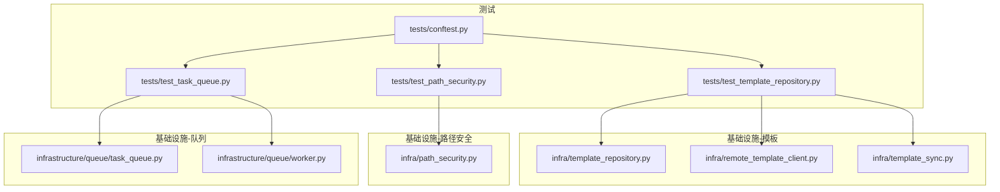
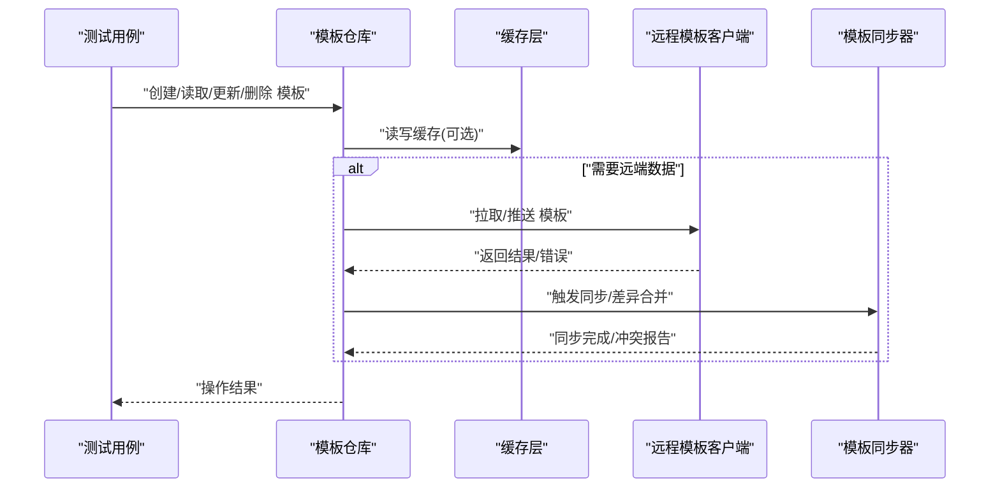
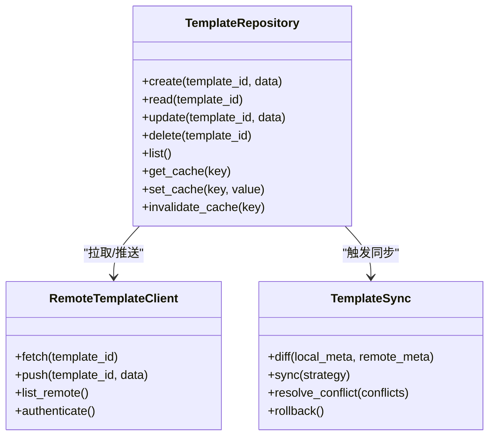
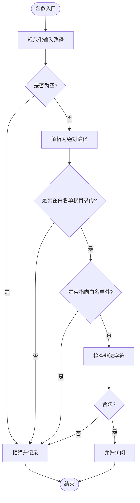
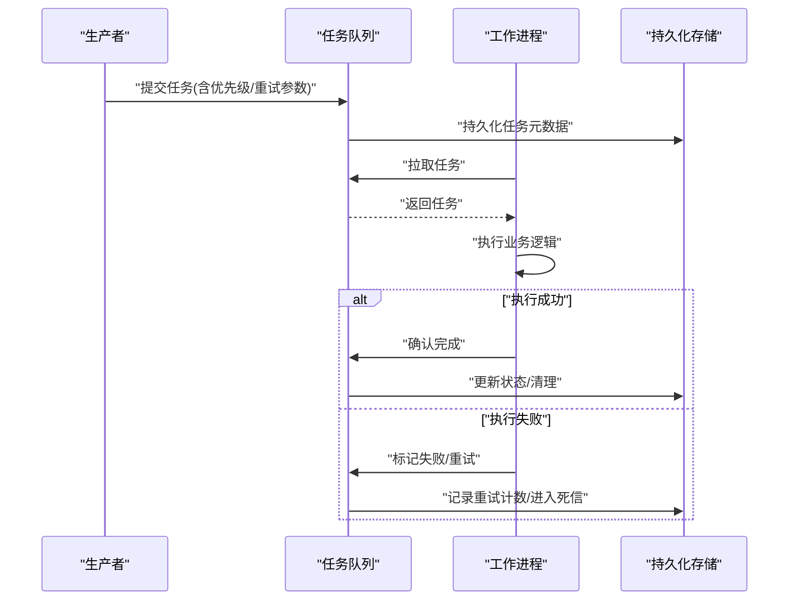
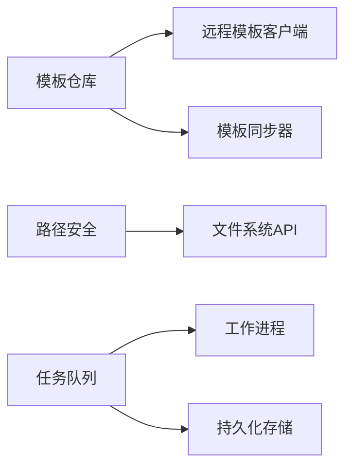

# 基础设施层测试

<cite>
**本文引用的文件**   
- [tests/test_template_repository.py](file://tests/test_template_repository.py)
- [src/paper_format_corrector/infra/template_repository.py](file://src/paper_format_corrector/infra/template_repository.py)
- [src/paper_format_corrector/infra/remote_template_client.py](file://src/paper_format_corrector/infra/remote_template_client.py)
- [src/paper_format_corrector/infra/template_sync.py](file://src/paper_format_corrector/infra/template_sync.py)
- [tests/test_path_security.py](file://tests/test_path_security.py)
- [src/paper_format_corrector/infra/path_security.py](file://src/paper_format_corrector/infra/path_security.py)
- [tests/test_task_queue.py](file://tests/test_task_queue.py)
- [src/paper_format_corrector/infrastructure/queue/task_queue.py](file://src/paper_format_corrector/infrastructure/queue/task_queue.py)
- [src/paper_format_corrector/infrastructure/queue/worker.py](file://src/paper_format_corrector/infrastructure/queue/worker.py)
- [tests/conftest.py](file://tests/conftest.py)
</cite>

## 目录
1. [简介](#简介)
2. [项目结构](#项目结构)
3. [核心组件](#核心组件)
4. [架构总览](#架构总览)
5. [详细组件分析](#详细组件分析)
6. [依赖关系分析](#依赖关系分析)
7. [性能考虑](#性能考虑)
8. [故障排查指南](#故障排查指南)
9. [结论](#结论)
10. [附录](#附录)

## 简介
本文件聚焦于“基础设施层”的测试设计与实现，围绕以下目标展开：
- 模板仓库（本地与远程）的CRUD操作、缓存机制与同步策略的测试覆盖
- 路径安全（文件访问控制、权限验证与安全边界）的测试用例说明
- 任务队列的并发处理与消息传递测试
- 外部服务集成（数据库连接、文件系统、网络请求）的mock策略
- 配置管理与持久化存储功能的测试方法

文档以渐进式方式组织，既提供高层概览，也深入到具体实现细节，并辅以图示帮助理解。

## 项目结构
与基础设施层测试直接相关的代码与测试文件分布如下：
- 模板仓库与同步
  - 源码：template_repository.py、remote_template_client.py、template_sync.py
  - 测试：test_template_repository.py
- 路径安全
  - 源码：path_security.py
  - 测试：test_path_security.py
- 任务队列
  - 源码：task_queue.py、worker.py
  - 测试：test_task_queue.py
- 通用测试夹具与工具
  - 测试夹具：conftest.py

图表来源
- [tests/test_template_repository.py](file://tests/test_template_repository.py)
- [src/paper_format_corrector/infra/template_repository.py](file://src/paper_format_corrector/infra/template_repository.py)
- [src/paper_format_corrector/infra/remote_template_client.py](file://src/paper_format_corrector/infra/remote_template_client.py)
- [src/paper_format_corrector/infra/template_sync.py](file://src/paper_format_corrector/infra/template_sync.py)
- [tests/test_path_security.py](file://tests/test_path_security.py)
- [src/paper_format_corrector/infra/path_security.py](file://src/paper_format_corrector/infra/path_security.py)
- [tests/test_task_queue.py](file://tests/test_task_queue.py)
- [src/paper_format_corrector/infrastructure/queue/task_queue.py](file://src/paper_format_corrector/infrastructure/queue/task_queue.py)
- [src/paper_format_corrector/infrastructure/queue/worker.py](file://src/paper_format_corrector/infrastructure/queue/worker.py)
- [tests/conftest.py](file://tests/conftest.py)

章节来源
- [tests/test_template_repository.py](file://tests/test_template_repository.py)
- [src/paper_format_corrector/infra/template_repository.py](file://src/paper_format_corrector/infra/template_repository.py)
- [src/paper_format_corrector/infra/remote_template_client.py](file://src/paper_format_corrector/infra/remote_template_client.py)
- [src/paper_format_corrector/infra/template_sync.py](file://src/paper_format_corrector/infra/template_sync.py)
- [tests/test_path_security.py](file://tests/test_path_security.py)
- [src/paper_format_corrector/infra/path_security.py](file://src/paper_format_corrector/infra/path_security.py)
- [tests/test_task_queue.py](file://tests/test_task_queue.py)
- [src/paper_format_corrector/infrastructure/queue/task_queue.py](file://src/paper_format_corrector/infrastructure/queue/task_queue.py)
- [src/paper_format_corrector/infrastructure/queue/worker.py](file://src/paper_format_corrector/infrastructure/queue/worker.py)
- [tests/conftest.py](file://tests/conftest.py)

## 核心组件
本节概述各基础设施组件的职责及测试关注点：
- 模板仓库（TemplateRepository）
  - 职责：管理本地模板的CRUD、索引构建、版本元数据维护；在需要时通过远程客户端拉取或推送；提供缓存接口以减少重复I/O。
  - 测试关注：创建/读取/更新/删除的幂等性与一致性；异常分支（不存在、冲突、损坏）；缓存命中与失效；并发写入安全。
- 远程模板客户端（RemoteTemplateClient）
  - 职责：封装对远端模板仓库的网络访问（认证、重试、超时、分页）。
  - 测试关注：成功/失败路径、网络异常、鉴权失败、速率限制、超时重试。
- 模板同步器（TemplateSync）
  - 职责：协调本地与远端的差异检测与合并，支持增量同步、冲突解决策略。
  - 测试关注：差异计算正确性、冲突策略生效、断点续传、回滚与一致性校验。
- 路径安全（PathSecurity）
  - 职责：校验与规范化路径，防止越界访问、符号链接劫持、非法字符注入。
  - 测试关注：白名单根目录、相对路径解析、特殊字符与空路径、跨卷/挂载点隔离。
- 任务队列（TaskQueue + Worker）
  - 职责：生产者-消费者模型的任务调度，支持优先级、重试、死信队列、状态持久化。
  - 测试关注：并发消费、消息顺序、背压与限流、失败重试、幂等处理、资源清理。

章节来源
- [src/paper_format_corrector/infra/template_repository.py](file://src/paper_format_corrector/infra/template_repository.py)
- [src/paper_format_corrector/infra/remote_template_client.py](file://src/paper_format_corrector/infra/remote_template_client.py)
- [src/paper_format_corrector/infra/template_sync.py](file://src/paper_format_corrector/infra/template_sync.py)
- [src/paper_format_corrector/infra/path_security.py](file://src/paper_format_corrector/infra/path_security.py)
- [src/paper_format_corrector/infrastructure/queue/task_queue.py](file://src/paper_format_corrector/infrastructure/queue/task_queue.py)
- [src/paper_format_corrector/infrastructure/queue/worker.py](file://src/paper_format_corrector/infrastructure/queue/worker.py)

## 架构总览
下图展示模板仓库、远程客户端与同步器的交互关系，以及测试如何对这些交互进行验证。

图表来源
- [src/paper_format_corrector/infra/template_repository.py](file://src/paper_format_corrector/infra/template_repository.py)
- [src/paper_format_corrector/infra/remote_template_client.py](file://src/paper_format_corrector/infra/remote_template_client.py)
- [src/paper_format_corrector/infra/template_sync.py](file://src/paper_format_corrector/infra/template_sync.py)

## 详细组件分析

### 模板仓库测试（本地与远程CRUD、缓存与同步）
- 测试范围
  - 本地CRUD：新建模板、读取模板、更新模板、删除模板；包含重复键、缺失键、损坏模板等异常场景。
  - 远程CRUD：通过远程客户端拉取/推送模板；模拟网络错误、鉴权失败、超时与重试。
  - 缓存机制：验证缓存命中、过期、失效与一致性；确保并发读写的线程安全。
  - 同步策略：差异检测、增量同步、冲突解决（如保留本地/远端/合并）、失败回滚。
- 关键断言建议
  - 幂等性：多次执行相同操作应得到一致结果。
  - 一致性：本地与远端元数据对齐，版本号与时间戳合理。
  - 健壮性：异常路径不泄露敏感信息，日志可追踪。
- 常用Mock策略
  - 使用内存文件系统替代真实磁盘，隔离测试环境。
  - Mock远程客户端的HTTP调用，返回预设响应或抛出特定异常。
  - 使用计时器或延迟对象模拟网络延迟与超时。
- 参考实现位置
  - 测试入口与用例组织：[tests/test_template_repository.py](file://tests/test_template_repository.py)
  - 仓库实现：[src/paper_format_corrector/infra/template_repository.py](file://src/paper_format_corrector/infra/template_repository.py)
  - 远程客户端：[src/paper_format_corrector/infra/remote_template_client.py](file://src/paper_format_corrector/infra/remote_template_client.py)
  - 同步器：[src/paper_format_corrector/infra/template_sync.py](file://src/paper_format_corrector/infra/template_sync.py)

图表来源
- [src/paper_format_corrector/infra/template_repository.py](file://src/paper_format_corrector/infra/template_repository.py)
- [src/paper_format_corrector/infra/remote_template_client.py](file://src/paper_format_corrector/infra/remote_template_client.py)
- [src/paper_format_corrector/infra/template_sync.py](file://src/paper_format_corrector/infra/template_sync.py)

章节来源
- [tests/test_template_repository.py](file://tests/test_template_repository.py)
- [src/paper_format_corrector/infra/template_repository.py](file://src/paper_format_corrector/infra/template_repository.py)
- [src/paper_format_corrector/infra/remote_template_client.py](file://src/paper_format_corrector/infra/remote_template_client.py)
- [src/paper_format_corrector/infra/template_sync.py](file://src/paper_format_corrector/infra/template_sync.py)

### 路径安全测试（文件访问控制、权限验证与安全边界）
- 测试范围
  - 路径规范化与白名单校验：仅允许在受控根目录下访问。
  - 符号链接与相对路径攻击防护：拒绝跳出白名单的路径。
  - 非法字符与空路径处理：拒绝包含危险字符或空输入。
  - 权限边界：在不同用户上下文下验证最小权限原则。
- 关键断言建议
  - 所有输入均经过严格校验与规范化。
  - 越界访问一律被拒绝并记录审计日志。
  - 错误信息不包含内部路径细节。
- 参考实现位置
  - 测试用例：[tests/test_path_security.py](file://tests/test_path_security.py)
  - 安全模块：[src/paper_format_corrector/infra/path_security.py](file://src/paper_format_corrector/infra/path_security.py)

图表来源
- [src/paper_format_corrector/infra/path_security.py](file://src/paper_format_corrector/infra/path_security.py)

章节来源
- [tests/test_path_security.py](file://tests/test_path_security.py)
- [src/paper_format_corrector/infra/path_security.py](file://src/paper_format_corrector/infra/path_security.py)

### 任务队列测试（并发与消息传递）
- 测试范围
  - 并发生产与消费：多生产者同时入队，多消费者并行出队。
  - 消息传递语义：至少一次/恰好一次投递、顺序保证（若要求）、去重。
  - 失败重试与死信：重试次数上限、退避策略、失败归档。
  - 背压与限流：队列容量、丢弃策略、背压信号。
- 关键断言建议
  - 无丢失、无重复（或在可接受范围内）。
  - 消费者幂等处理，避免副作用重复执行。
  - 资源释放与清理在异常路径下也能正确执行。
- 参考实现位置
  - 测试用例：[tests/test_task_queue.py](file://tests/test_task_queue.py)
  - 队列实现：[src/paper_format_corrector/infrastructure/queue/task_queue.py](file://src/paper_format_corrector/infrastructure/queue/task_queue.py)
  - 工作进程：[src/paper_format_corrector/infrastructure/queue/worker.py](file://src/paper_format_corrector/infrastructure/queue/worker.py)

图表来源
- [src/paper_format_corrector/infrastructure/queue/task_queue.py](file://src/paper_format_corrector/infrastructure/queue/task_queue.py)
- [src/paper_format_corrector/infrastructure/queue/worker.py](file://src/paper_format_corrector/infrastructure/queue/worker.py)

章节来源
- [tests/test_task_queue.py](file://tests/test_task_queue.py)
- [src/paper_format_corrector/infrastructure/queue/task_queue.py](file://src/paper_format_corrector/infrastructure/queue/task_queue.py)
- [src/paper_format_corrector/infrastructure/queue/worker.py](file://src/paper_format_corrector/infrastructure/queue/worker.py)

### 外部服务集成测试策略（数据库、文件系统、网络）
- 数据库连接
  - 使用内存数据库或测试专用实例，避免污染生产数据。
  - 使用事务回滚或快照恢复，保证测试间隔离。
  - 模拟慢查询与连接池耗尽，验证超时与重试。
- 文件系统操作
  - 使用临时目录或内存文件系统，测试前后自动清理。
  - 模拟权限不足、磁盘满、IO异常等边界条件。
- 网络请求
  - 使用HTTP客户端Mock或本地测试服务器，固定响应集。
  - 模拟鉴权失败、速率限制、超时与部分失败。
- 配置管理与持久化
  - 使用独立配置文件或环境变量注入，避免共享状态。
  - 验证配置热更新、默认值与校验规则。
  - 持久化数据的迁移与兼容性测试。

章节来源
- [tests/conftest.py](file://tests/conftest.py)

## 依赖关系分析
- 耦合与内聚
  - 模板仓库对远程客户端与同步器存在依赖，但通过接口抽象降低耦合度。
  - 路径安全作为横切关注点，被多处复用，应保持高内聚与低耦合。
  - 任务队列与工作进程解耦，通过消息协议通信，便于扩展与替换。
- 循环依赖
  - 当前设计未见明显循环依赖；如需引入事件总线，需确保单向依赖。
- 外部依赖
  - 网络库、文件系统API、数据库驱动均为外部依赖，应在测试中充分Mock。

图表来源
- [src/paper_format_corrector/infra/template_repository.py](file://src/paper_format_corrector/infra/template_repository.py)
- [src/paper_format_corrector/infra/remote_template_client.py](file://src/paper_format_corrector/infra/remote_template_client.py)
- [src/paper_format_corrector/infra/template_sync.py](file://src/paper_format_corrector/infra/template_sync.py)
- [src/paper_format_corrector/infra/path_security.py](file://src/paper_format_corrector/infra/path_security.py)
- [src/paper_format_corrector/infrastructure/queue/task_queue.py](file://src/paper_format_corrector/infrastructure/queue/task_queue.py)
- [src/paper_format_corrector/infrastructure/queue/worker.py](file://src/paper_format_corrector/infrastructure/queue/worker.py)

章节来源
- [src/paper_format_corrector/infra/template_repository.py](file://src/paper_format_corrector/infra/template_repository.py)
- [src/paper_format_corrector/infra/remote_template_client.py](file://src/paper_format_corrector/infra/remote_template_client.py)
- [src/paper_format_corrector/infra/template_sync.py](file://src/paper_format_corrector/infra/template_sync.py)
- [src/paper_format_corrector/infra/path_security.py](file://src/paper_format_corrector/infra/path_security.py)
- [src/paper_format_corrector/infrastructure/queue/task_queue.py](file://src/paper_format_corrector/infrastructure/queue/task_queue.py)
- [src/paper_format_corrector/infrastructure/queue/worker.py](file://src/paper_format_corrector/infrastructure/queue/worker.py)

## 性能考虑
- 缓存命中率与失效策略：避免频繁I/O，确保一致性。
- 队列吞吐与延迟：调整消费者数量与批大小，平衡延迟与吞吐。
- 网络重试与退避：避免雪崩效应，设置合理的超时与熔断。
- I/O路径优化：批量写入、异步落盘、压缩传输。

## 故障排查指南
- 常见问题定位
  - 模板同步不一致：检查差异算法与冲突策略，核对版本与时间戳。
  - 路径安全误拒：审查白名单配置与路径规范化逻辑。
  - 任务丢失或重复：确认消费者幂等与确认机制，检查持久化状态。
- 调试技巧
  - 开启详细日志与追踪ID，关联上下游调用。
  - 使用最小复现用例与隔离环境，逐步缩小问题范围。
  - 针对网络与I/O，构造可控的失败场景进行回归验证。

## 结论
通过对模板仓库、路径安全与任务队列的测试设计与实现进行深入分析，可以显著提升基础设施层的可靠性与可维护性。结合完善的Mock策略与清晰的断言规范，能够在早期发现潜在缺陷，保障系统在复杂运行环境下的稳定性。

## 附录
- 测试运行建议
  - 使用独立测试数据库与临时目录，避免污染。
  - 并行执行测试时注意资源竞争与状态隔离。
  - 定期更新Mock响应集，覆盖新增边界条件。