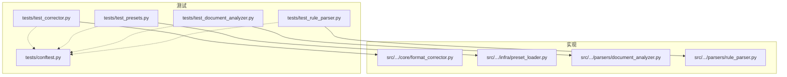
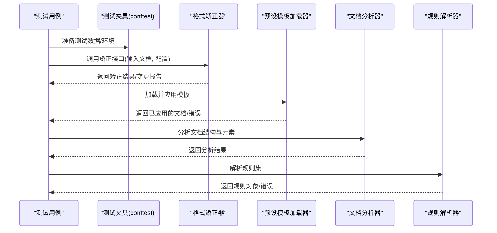
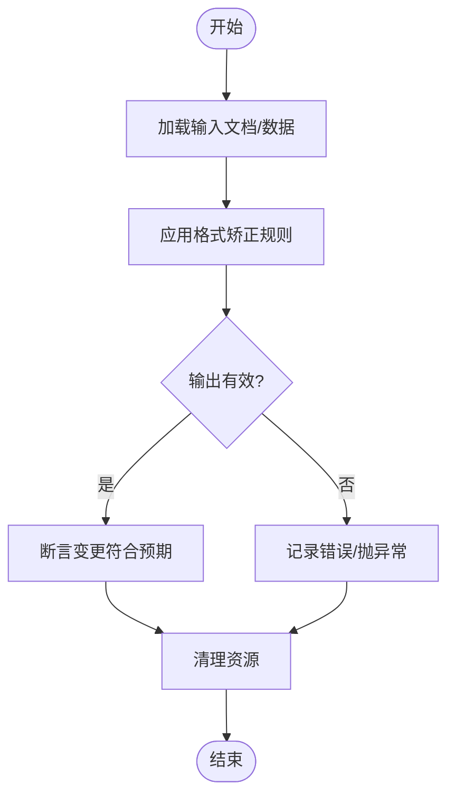
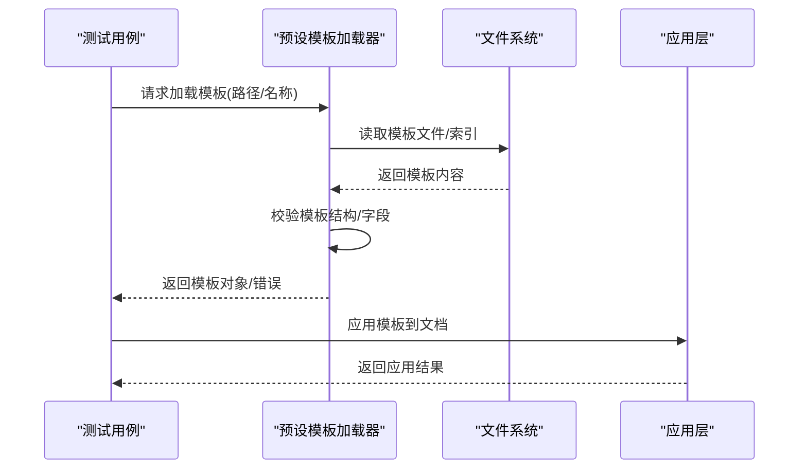
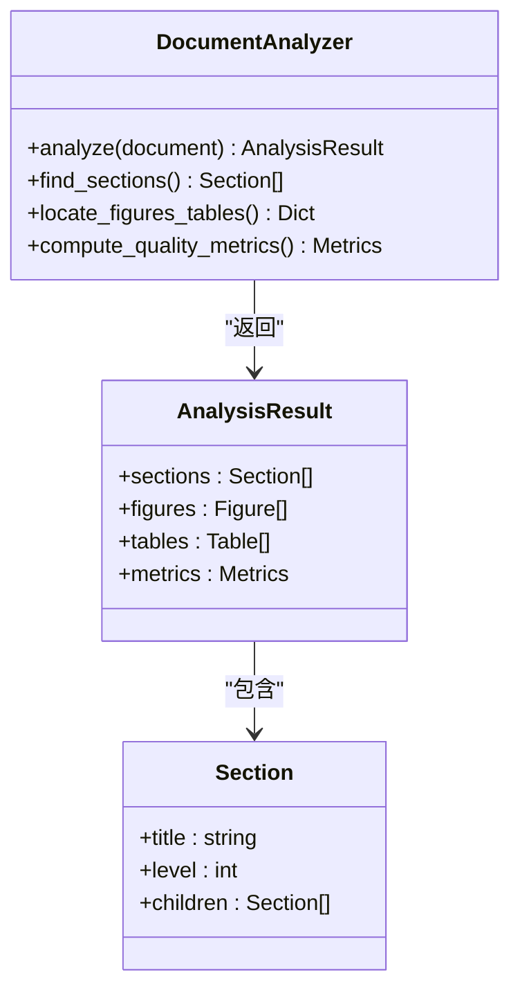
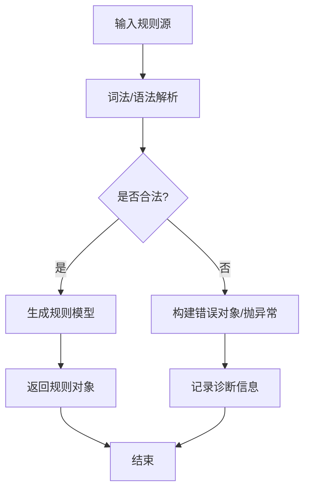
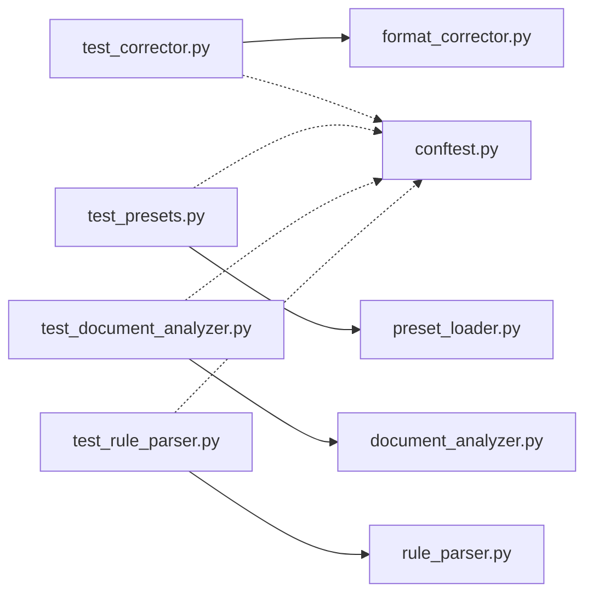

# 核心功能单元测试

<cite>
**本文引用的文件**   
- [test_corrector.py](file://tests/test_corrector.py)
- [test_presets.py](file://tests/test_presets.py)
- [test_document_analyzer.py](file://tests/test_document_analyzer.py)
- [test_rule_parser.py](file://tests/test_rule_parser.py)
- [conftest.py](file://tests/conftest.py)
- [format_corrector.py](file://src/paper_format_corrector/core/format_corrector.py)
- [preset_loader.py](file://src/paper_format_corrector/infra/preset_loader.py)
- [document_analyzer.py](file://src/paper_format_corrector/parsers/document_analyzer.py)
- [rule_parser.py](file://src/paper_format_corrector/parsers/rule_parser.py)
</cite>

## 目录
1. [简介](#简介)
2. [项目结构](#项目结构)
3. [核心组件](#核心组件)
4. [架构总览](#架构总览)
5. [详细组件分析](#详细组件分析)
6. [依赖分析](#依赖分析)
7. [性能考虑](#性能考虑)
8. [故障排查指南](#故障排查指南)
9. [结论](#结论)
10. [附录](#附录)

## 简介
本文件聚焦于“论文格式矫正工具”的核心功能单元测试，围绕以下测试文件与对应实现模块展开：
- 格式矫正器测试：[test_corrector.py](file://tests/test_corrector.py) 对 [format_corrector.py](file://src/paper_format_corrector/core/format_corrector.py) 的行为进行验证，覆盖多格式标准、边界条件与异常场景。
- 预设模板系统测试：[test_presets.py](file://tests/test_presets.py) 针对 [preset_loader.py](file://src/paper_format_corrector/infra/preset_loader.py) 的加载、校验与应用流程进行测试。
- 文档分析器与规则解析器测试：[test_document_analyzer.py](file://tests/test_document_analyzer.py)、[test_rule_parser.py](file://tests/test_rule_parser.py) 分别验证 [document_analyzer.py](file://src/paper_format_corrector/parsers/document_analyzer.py) 与 [rule_parser.py](file://src/paper_format_corrector/parsers/rule_parser.py) 的规则解析与分析能力。
- 测试基础设施：[conftest.py](file://tests/conftest.py) 提供共享夹具、数据管理与清理机制。

目标读者包括希望理解或扩展该项目的测试策略与实现的工程师与研究者。

## 项目结构
下图展示了与本次文档相关的测试与实现文件的组织关系，以及关键交互路径。

图表来源
- [test_corrector.py](file://tests/test_corrector.py)
- [test_presets.py](file://tests/test_presets.py)
- [test_document_analyzer.py](file://tests/test_document_analyzer.py)
- [test_rule_parser.py](file://tests/test_rule_parser.py)
- [conftest.py](file://tests/conftest.py)
- [format_corrector.py](file://src/paper_format_corrector/core/format_corrector.py)
- [preset_loader.py](file://src/paper_format_corrector/infra/preset_loader.py)
- [document_analyzer.py](file://src/paper_format_corrector/parsers/document_analyzer.py)
- [rule_parser.py](file://src/paper_format_corrector/parsers/rule_parser.py)

章节来源
- [test_corrector.py](file://tests/test_corrector.py)
- [test_presets.py](file://tests/test_presets.py)
- [test_document_analyzer.py](file://tests/test_document_analyzer.py)
- [test_rule_parser.py](file://tests/test_rule_parser.py)
- [conftest.py](file://tests/conftest.py)

## 核心组件
本节概述各测试文件与其对应的被测模块的职责与关注点：
- 格式矫正器测试：验证不同格式标准（如字体、段落、页边距等）的矫正行为；检查输入为空、缺失样式、非法值等边界与异常路径；确保输出符合预期且可复现。
- 预设模板系统测试：验证模板加载（本地/远程）、模板校验（字段完整性、类型约束）、模板应用（应用到文档对象）的正确性与健壮性。
- 文档分析器测试：验证文档结构识别、标题层级、表格/图片定位、交叉引用检测等分析逻辑。
- 规则解析器测试：验证规则语法解析、参数提取、优先级与冲突处理、错误诊断信息。

章节来源
- [test_corrector.py](file://tests/test_corrector.py)
- [test_presets.py](file://tests/test_presets.py)
- [test_document_analyzer.py](file://tests/test_document_analyzer.py)
- [test_rule_parser.py](file://tests/test_rule_parser.py)

## 架构总览
下图展示测试到实现的调用关系与数据流向，突出关键入口与外部依赖（文件系统、配置、网络等）。

图表来源
- [test_corrector.py](file://tests/test_corrector.py)
- [test_presets.py](file://tests/test_presets.py)
- [test_document_analyzer.py](file://tests/test_document_analyzer.py)
- [test_rule_parser.py](file://tests/test_rule_parser.py)
- [format_corrector.py](file://src/paper_format_corrector/core/format_corrector.py)
- [preset_loader.py](file://src/paper_format_corrector/infra/preset_loader.py)
- [document_analyzer.py](file://src/paper_format_corrector/parsers/document_analyzer.py)
- [rule_parser.py](file://src/paper_format_corrector/parsers/rule_parser.py)

## 详细组件分析

### 格式矫正器测试（test_corrector.py）
- 测试目标
  - 覆盖主流格式标准（例如学术、期刊、学位论文等）的矫正规则。
  - 验证边界条件：空文档、无样式、缺失必要字段、重复定义等。
  - 验证异常场景：非法参数、不可读文件、权限不足、IO异常等。
- 关键断言
  - 矫正前后文档结构一致性（保留非相关元素）。
  - 属性变更符合预期（字体、字号、行距、缩进、页眉页脚等）。
  - 错误路径抛出明确异常并提供诊断信息。
- 典型流程
  - 构造输入文档或从夹具读取样例。
  - 设置矫正配置（选择预设或自定义规则）。
  - 执行矫正并断言输出。
  - 清理临时文件与环境。

图表来源
- [test_corrector.py](file://tests/test_corrector.py)
- [format_corrector.py](file://src/paper_format_corrector/core/format_corrector.py)

章节来源
- [test_corrector.py](file://tests/test_corrector.py)
- [format_corrector.py](file://src/paper_format_corrector/core/format_corrector.py)

### 预设模板系统测试（test_presets.py）
- 测试目标
  - 模板加载：支持本地 YAML/JSON 模板与索引文件。
  - 模板校验：必填字段、类型约束、取值范围、依赖关系。
  - 模板应用：将模板应用到文档对象，生成一致的格式效果。
- 关键断言
  - 模板索引正确枚举可用模板。
  - 无效模板被拒绝并返回结构化错误。
  - 应用后文档属性与模板定义一致。
- 典型流程
  - 使用夹具创建临时模板文件或目录。
  - 调用加载器获取模板对象。
  - 校验模板有效性。
  - 应用模板并断言结果。
  - 清理临时文件。

图表来源
- [test_presets.py](file://tests/test_presets.py)
- [preset_loader.py](file://src/paper_format_corrector/infra/preset_loader.py)

章节来源
- [test_presets.py](file://tests/test_presets.py)
- [preset_loader.py](file://src/paper_format_corrector/infra/preset_loader.py)

### 文档分析器测试（test_document_analyzer.py）
- 测试目标
  - 文档结构识别：章节、段落、标题层级、列表、表格、图片等。
  - 引用与交叉引用检测：参考文献、图/表编号、公式编号等。
  - 质量指标计算：一致性、规范性评分。
- 关键断言
  - 解析出的结构树与期望一致。
  - 特定元素（如图表标题）能被准确定位。
  - 分析结果可用于后续矫正或报告生成。
- 典型流程
  - 使用夹具准备包含复杂结构的文档。
  - 调用分析器进行扫描与建模。
  - 断言节点数量、类型、属性与关系。
  - 清理临时资源。

图表来源
- [test_document_analyzer.py](file://tests/test_document_analyzer.py)
- [document_analyzer.py](file://src/paper_format_corrector/parsers/document_analyzer.py)

章节来源
- [test_document_analyzer.py](file://tests/test_document_analyzer.py)
- [document_analyzer.py](file://src/paper_format_corrector/parsers/document_analyzer.py)

### 规则解析器测试（test_rule_parser.py）
- 测试目标
  - 规则语法解析：键值对、嵌套结构、数组、布尔/数值/字符串类型。
  - 参数提取与默认值：缺失字段时回退默认值。
  - 冲突与优先级：同名规则合并策略、覆盖顺序。
  - 错误诊断：位置信息、错误消息可读性。
- 关键断言
  - 合法规则集成功解析为内部模型。
  - 非法规则抛出异常并附带上下文。
  - 解析结果可直接用于规则引擎执行。
- 典型流程
  - 构造规则文本或对象。
  - 调用解析器生成规则对象。
  - 断言字段、类型、优先级与错误信息。
  - 清理中间状态。

图表来源
- [test_rule_parser.py](file://tests/test_rule_parser.py)
- [rule_parser.py](file://src/paper_format_corrector/parsers/rule_parser.py)

章节来源
- [test_rule_parser.py](file://tests/test_rule_parser.py)
- [rule_parser.py](file://src/paper_format_corrector/parsers/rule_parser.py)

### Mock 对象使用示例与最佳实践
- 适用场景
  - 隔离外部依赖：文件系统、网络请求、数据库、第三方库。
  - 控制输入输出：模拟 IO 异常、超时、部分失败。
  - 验证交互：确认调用次数、参数、返回值。
- 常见模式
  - 方法级 mock：替换具体函数或类方法。
  - 上下文管理器：在测试块内启用/恢复 mock。
  - 副作用注入：根据输入动态返回或抛出异常。
- 注意事项
  - 避免过度 mock，保持测试贴近真实行为。
  - 为每个测试准备独立 mock 实例，防止状态污染。
  - 在 teardown 中显式清理全局状态。

章节来源
- [conftest.py](file://tests/conftest.py)

### 测试数据管理与清理机制
- 数据管理
  - 使用夹具集中管理测试数据（文档样例、模板、规则集）。
  - 通过参数化在不同数据集上运行相同用例。
- 清理机制
  - 在测试结束后删除临时文件、重置全局缓存。
  - 使用上下文管理器确保异常路径也能完成清理。
- 建议
  - 将大型样本数据放入只读目录，避免写入。
  - 对需要写操作的测试，使用独立的临时目录。

章节来源
- [conftest.py](file://tests/conftest.py)

### 复杂业务逻辑与算法的测试策略
- 分层测试
  - 单元层：最小粒度的函数/方法，快速、确定性强。
  - 集成层：组合多个模块，验证端到端流程。
  - 回归层：基于历史问题构造用例，防止复发。
- 数据驱动
  - 使用参数化与数据工厂批量生成用例。
  - 对比基准结果（golden file）确保稳定性。
- 随机与模糊测试
  - 对容错性强的算法引入随机输入，观察崩溃与异常路径。
- 覆盖率与性能
  - 结合覆盖率工具定位未覆盖分支。
  - 对热点路径进行基准测试，监控退化。

章节来源
- [test_corrector.py](file://tests/test_corrector.py)
- [test_presets.py](file://tests/test_presets.py)
- [test_document_analyzer.py](file://tests/test_document_analyzer.py)
- [test_rule_parser.py](file://tests/test_rule_parser.py)

## 依赖分析
下图展示测试与实现之间的直接依赖关系，帮助识别耦合点与潜在循环依赖。

图表来源
- [test_corrector.py](file://tests/test_corrector.py)
- [test_presets.py](file://tests/test_presets.py)
- [test_document_analyzer.py](file://tests/test_document_analyzer.py)
- [test_rule_parser.py](file://tests/test_rule_parser.py)
- [conftest.py](file://tests/conftest.py)
- [format_corrector.py](file://src/paper_format_corrector/core/format_corrector.py)
- [preset_loader.py](file://src/paper_format_corrector/infra/preset_loader.py)
- [document_analyzer.py](file://src/paper_format_corrector/parsers/document_analyzer.py)
- [rule_parser.py](file://src/paper_format_corrector/parsers/rule_parser.py)

章节来源
- [test_corrector.py](file://tests/test_corrector.py)
- [test_presets.py](file://tests/test_presets.py)
- [test_document_analyzer.py](file://tests/test_document_analyzer.py)
- [test_rule_parser.py](file://tests/test_rule_parser.py)
- [conftest.py](file://tests/conftest.py)

## 性能考虑
- 减少 I/O：尽量使用内存中的数据结构与 fixture，避免频繁读写磁盘。
- 并行执行：将相互独立的测试分组，利用并发提升整体速度。
- 选择性运行：按模块或标签筛选测试，缩短反馈周期。
- 基准测试：对关键算法建立基准，定期回归以发现性能退化。

## 故障排查指南
- 常见问题
  - 模板加载失败：检查路径、权限、文件格式与编码。
  - 规则解析错误：核对语法、类型与必填字段。
  - 矫正结果不一致：确认输入文档版本、依赖库版本与平台差异。
- 定位技巧
  - 开启详细日志，捕获异常堆栈与上下文。
  - 使用最小可复现用例缩小范围。
  - 逐步注释代码或断言，二分定位问题。
- 修复建议
  - 增强错误消息的可读性与上下文信息。
  - 增加边界与异常路径的测试用例。
  - 对不稳定依赖添加重试或降级策略。

章节来源
- [test_corrector.py](file://tests/test_corrector.py)
- [test_presets.py](file://tests/test_presets.py)
- [test_document_analyzer.py](file://tests/test_document_analyzer.py)
- [test_rule_parser.py](file://tests/test_rule_parser.py)

## 结论
通过对格式矫正器、预设模板系统、文档分析器与规则解析器的单元测试进行深入分析，可以清晰看到：
- 测试覆盖了正常路径、边界条件与异常场景，具备较强的鲁棒性。
- 借助夹具与 mock，测试实现了良好的隔离性与可维护性。
- 分层与数据驱动的测试策略有助于持续演进复杂业务逻辑与算法。
建议在后续迭代中继续完善覆盖率、基准测试与回归用例，进一步提升质量保障能力。

## 附录
- 术语
  - 夹具：测试前/后的准备与清理逻辑封装。
  - Mock：对外部依赖的替身，用于控制输入输出与验证交互。
  - 参数化：用多组数据驱动同一测试用例。
- 参考
  - 测试框架与约定：参见 conftest 与测试命名规范。
  - 模板与规则：参见 presets 与 rules 目录下的定义与示例。