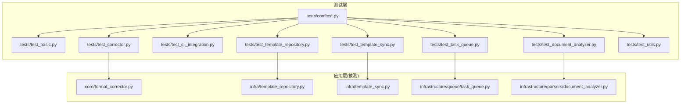
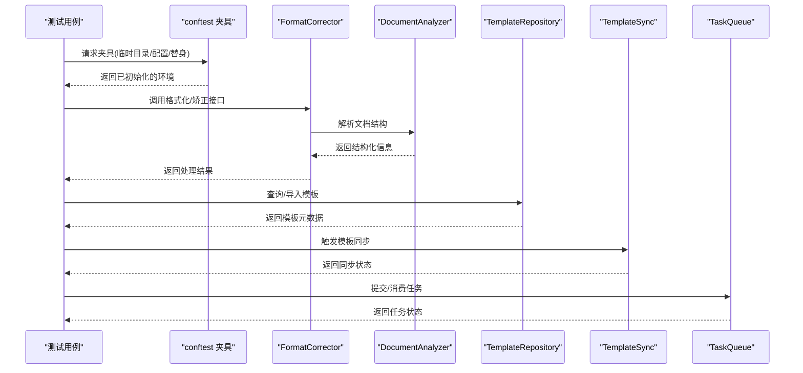
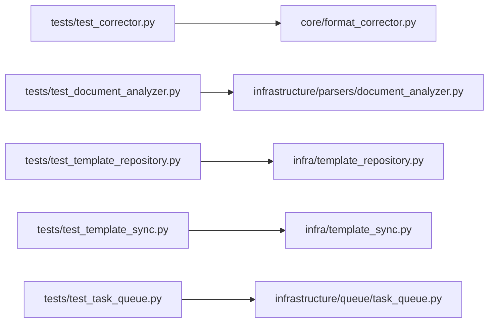

# 测试工具和辅助设施

<cite>
**本文引用的文件**   
- [tests/conftest.py](file://tests/conftest.py)
- [tests/test_basic.py](file://tests/test_basic.py)
- [tests/test_corrector.py](file://tests/test_corrector.py)
- [tests/test_cli_integration.py](file://tests/test_cli_integration.py)
- [tests/test_document_analyzer.py](file://tests/test_document_analyzer.py)
- [tests/test_template_repository.py](file://tests/test_template_repository.py)
- [tests/test_template_sync.py](file://tests/test_template_sync.py)
- [tests/test_task_queue.py](file://tests/test_task_queue.py)
- [tests/test_utils.py](file://tests/test_utils.py)
- [src/paper_format_corrector/infra/template_repository.py](file://src/paper_format_corrector/infra/template_repository.py)
- [src/paper_format_corrector/infra/template_sync.py](file://src/paper_format_corrector/infra/template_sync.py)
- [src/paper_format_corrector/infrastructure/queue/task_queue.py](file://src/paper_format_corrector/infrastructure/queue/task_queue.py)
- [src/paper_format_corrector/core/format_corrector.py](file://src/paper_format_corrector/core/format_corrector.py)
- [src/paper_format_corrector/infrastructure/parsers/document_analyzer.py](file://src/paper_format_corrector/infrastructure/parsers/document_analyzer.py)
</cite>

## 目录
1. [简介](#简介)
2. [项目结构](#项目结构)
3. [核心组件](#核心组件)
4. [架构总览](#架构总览)
5. [详细组件分析](#详细组件分析)
6. [依赖关系分析](#依赖关系分析)
7. [性能考虑](#性能考虑)
8. [故障排查指南](#故障排查指南)
9. [结论](#结论)
10. [附录](#附录)

## 简介
本指南聚焦于项目的测试工具与辅助设施，帮助读者快速理解并高效使用 pytest 配置、测试夹具（fixture）、测试环境初始化与资源管理；同时梳理测试工具模块与测试数据组织策略，并提供单元测试数据的构建与管理方法。文档还包含测试性能监控与调试技巧，旨在提升测试稳定性与可维护性。

## 项目结构
测试相关代码主要位于 tests 目录，核心被测逻辑位于 src/paper_format_corrector 下。下图展示了测试与源码的对应关系以及关键入口点。

图表来源
- [tests/conftest.py](file://tests/conftest.py)
- [tests/test_basic.py](file://tests/test_basic.py)
- [tests/test_corrector.py](file://tests/test_corrector.py)
- [tests/test_cli_integration.py](file://tests/test_cli_integration.py)
- [tests/test_document_analyzer.py](file://tests/test_document_analyzer.py)
- [tests/test_template_repository.py](file://tests/test_template_repository.py)
- [tests/test_template_sync.py](file://tests/test_template_sync.py)
- [tests/test_task_queue.py](file://tests/test_task_queue.py)
- [tests/test_utils.py](file://tests/test_utils.py)
- [src/paper_format_corrector/core/format_corrector.py](file://src/paper_format_corrector/core/format_corrector.py)
- [src/paper_format_corrector/infra/template_repository.py](file://src/paper_format_corrector/infra/template_repository.py)
- [src/paper_format_corrector/infra/template_sync.py](file://src/paper_format_corrector/infra/template_sync.py)
- [src/paper_format_corrector/infrastructure/queue/task_queue.py](file://src/paper_format_corrector/infrastructure/queue/task_queue.py)
- [src/paper_format_corrector/infrastructure/parsers/document_analyzer.py](file://src/paper_format_corrector/infrastructure/parsers/document_analyzer.py)

章节来源
- [tests/conftest.py](file://tests/conftest.py)
- [tests/test_basic.py](file://tests/test_basic.py)
- [tests/test_corrector.py](file://tests/test_corrector.py)
- [tests/test_cli_integration.py](file://tests/test_cli_integration.py)
- [tests/test_document_analyzer.py](file://tests/test_document_analyzer.py)
- [tests/test_template_repository.py](file://tests/test_template_repository.py)
- [tests/test_template_sync.py](file://tests/test_template_sync.py)
- [tests/test_task_queue.py](file://tests/test_task_queue.py)
- [tests/test_utils.py](file://tests/test_utils.py)

## 核心组件
本节概述 pytest 配置与夹具在测试中的作用，并说明如何基于 conftest.py 进行统一的测试环境初始化与资源管理。

- pytest 配置与发现
  - 通过 conftest.py 集中定义全局夹具与钩子，减少重复设置，提高测试一致性。
  - 建议将临时目录、日志、网络或外部依赖的替换项放在共享夹具中，确保跨用例复用。

- 夹具（Fixture）设计要点
  - 作用域选择：按用例粒度使用函数级，按模块或会话级复用大型资源（如模板仓库实例）。
  - 资源清理：优先使用 yield 模式，在 finally 分支执行清理，避免失败路径导致残留。
  - 参数化：对多模板、多输入场景采用参数化夹具，降低用例膨胀。

- 测试环境初始化
  - 隔离文件系统：为每个用例创建独立临时目录，避免相互污染。
  - 外部依赖替身：对网络、磁盘 IO、时间等不稳定因素提供替身或可控实现。
  - 配置注入：通过夹具注入配置对象，便于在不同环境下切换行为。

- 资源管理与生命周期
  - 会话级资源：仅在会话开始时创建一次，结束时统一释放。
  - 模块级资源：在模块加载时创建，模块卸载时释放。
  - 用例级资源：每个用例前后自动完成创建与销毁。

章节来源
- [tests/conftest.py](file://tests/conftest.py)

## 架构总览
下图展示测试层与被测模块之间的调用关系，突出关键流程：格式矫正、文档解析、模板仓库与同步、任务队列。

图表来源
- [tests/test_corrector.py](file://tests/test_corrector.py)
- [tests/test_document_analyzer.py](file://tests/test_document_analyzer.py)
- [tests/test_template_repository.py](file://tests/test_template_repository.py)
- [tests/test_template_sync.py](file://tests/test_template_sync.py)
- [tests/test_task_queue.py](file://tests/test_task_queue.py)
- [src/paper_format_corrector/core/format_corrector.py](file://src/paper_format_corrector/core/format_corrector.py)
- [src/paper_format_corrector/infrastructure/parsers/document_analyzer.py](file://src/paper_format_corrector/infrastructure/parsers/document_analyzer.py)
- [src/paper_format_corrector/infra/template_repository.py](file://src/paper_format_corrector/infra/template_repository.py)
- [src/paper_format_corrector/infra/template_sync.py](file://src/paper_format_corrector/infra/template_sync.py)
- [src/paper_format_corrector/infrastructure/queue/task_queue.py](file://src/paper_format_corrector/infrastructure/queue/task_queue.py)

## 详细组件分析

### 测试夹具与环境初始化（conftest.py）
- 职责
  - 提供跨用例复用的夹具：临时工作目录、配置对象、替身对象、示例数据路径等。
  - 统一异常断言与日志输出，增强可读性与可诊断性。
- 最佳实践
  - 使用 yield 模式管理资源，确保失败路径也能正确清理。
  - 将耗时资源提升到更高作用域，配合参数化减少重复开销。
  - 对外部依赖进行替身注入，保证测试确定性。

章节来源
- [tests/conftest.py](file://tests/conftest.py)

### 基础能力与通用断言（test_basic.py）
- 目标
  - 验证项目基础能力与运行环境是否就绪，例如包导入、版本信息、基本 CLI 可用性等。
- 关注点
  - 快速失败：尽早暴露环境问题。
  - 轻量稳定：不依赖外部系统，适合 CI 预检。

章节来源
- [tests/test_basic.py](file://tests/test_basic.py)

### 格式矫正器集成测试（test_corrector.py）
- 目标
  - 端到端验证格式矫正流程：输入文档 -> 解析 -> 矫正 -> 输出文档。
- 关键点
  - 使用夹具准备输入/期望输出，断言输出结构与样式符合预期。
  - 覆盖边界条件：空段落、特殊字符、复杂表格等。

章节来源
- [tests/test_corrector.py](file://tests/test_corrector.py)
- [src/paper_format_corrector/core/format_corrector.py](file://src/paper_format_corrector/core/format_corrector.py)

### CLI 集成测试（test_cli_integration.py）
- 目标
  - 验证命令行入口的参数解析、错误提示与退出码。
- 关键点
  - 模拟标准输入/输出，断言控制台输出与返回值。
  - 覆盖非法参数、缺失文件等异常路径。

章节来源
- [tests/test_cli_integration.py](file://tests/test_cli_integration.py)

### 文档解析器测试（test_document_analyzer.py）
- 目标
  - 验证文档结构解析的正确性与鲁棒性。
- 关键点
  - 构造多种文档片段，断言节点树、属性值与层级关系。
  - 针对异常输入（损坏 XML、缺失命名空间）进行健壮性检查。

章节来源
- [tests/test_document_analyzer.py](file://tests/test_document_analyzer.py)
- [src/paper_format_corrector/infrastructure/parsers/document_analyzer.py](file://src/paper_format_corrector/infrastructure/parsers/document_analyzer.py)

### 模板仓库与同步测试（test_template_repository.py, test_template_sync.py）
- 目标
  - 验证模板的加载、查询、导入与远程同步流程。
- 关键点
  - 使用夹具隔离文件系统，断言模板元数据一致性与完整性。
  - 模拟网络失败、权限不足等异常，验证回退与重试策略。

章节来源
- [tests/test_template_repository.py](file://tests/test_template_repository.py)
- [tests/test_template_sync.py](file://tests/test_template_sync.py)
- [src/paper_format_corrector/infra/template_repository.py](file://src/paper_format_corrector/infra/template_repository.py)
- [src/paper_format_corrector/infra/template_sync.py](file://src/paper_format_corrector/infra/template_sync.py)

### 任务队列测试（test_task_queue.py）
- 目标
  - 验证任务的提交、调度、执行与状态流转。
- 关键点
  - 并发安全：多线程/协程下的任务竞争与幂等性。
  - 失败重试与死信队列：异常路径的状态恢复与告警。

章节来源
- [tests/test_task_queue.py](file://tests/test_task_queue.py)
- [src/paper_format_corrector/infrastructure/queue/task_queue.py](file://src/paper_format_corrector/infrastructure/queue/task_queue.py)

### 工具与辅助函数测试（test_utils.py）
- 目标
  - 验证通用工具函数的正确性，如路径处理、字符串清洗、编码转换等。
- 关键点
  - 边界值与异常输入覆盖，确保工具函数具备防御性编程。

章节来源
- [tests/test_utils.py](file://tests/test_utils.py)

### 概念性概览：测试数据与工具模块组织
- 测试数据（test_files/）
  - 建议按功能域划分目录，如“文档样例”、“模板样例”、“异常输入”。
  - 每个样例附带最小描述文件（如 README 或 YAML 清单），记录用途、前置条件与期望结果。
- 单元测试数据（unitdata/）
  - 存放小型、稳定的数据片段（XML/JSON/文本），用于单元级别断言。
  - 保持不可变与只读，避免在测试中修改源数据。
- 测试工具模块（unitutil/）
  - 提供 mock 对象创建、XML 验证助手、文件操作工具等。
  - 将常用断言封装为高阶函数，提升可读性与复用率。

[此图为概念性流程图，不直接映射具体源码文件]

## 依赖关系分析
下图展示测试文件与其依赖的被测模块之间的关系，有助于定位回归范围与影响面。

图表来源
- [tests/test_corrector.py](file://tests/test_corrector.py)
- [tests/test_document_analyzer.py](file://tests/test_document_analyzer.py)
- [tests/test_template_repository.py](file://tests/test_template_repository.py)
- [tests/test_template_sync.py](file://tests/test_template_sync.py)
- [tests/test_task_queue.py](file://tests/test_task_queue.py)
- [src/paper_format_corrector/core/format_corrector.py](file://src/paper_format_corrector/core/format_corrector.py)
- [src/paper_format_corrector/infrastructure/parsers/document_analyzer.py](file://src/paper_format_corrector/infrastructure/parsers/document_analyzer.py)
- [src/paper_format_corrector/infra/template_repository.py](file://src/paper_format_corrector/infra/template_repository.py)
- [src/paper_format_corrector/infra/template_sync.py](file://src/paper_format_corrector/infra/template_sync.py)
- [src/paper_format_corrector/infrastructure/queue/task_queue.py](file://src/paper_format_corrector/infrastructure/queue/task_queue.py)

章节来源
- [tests/test_corrector.py](file://tests/test_corrector.py)
- [tests/test_document_analyzer.py](file://tests/test_document_analyzer.py)
- [tests/test_template_repository.py](file://tests/test_template_repository.py)
- [tests/test_template_sync.py](file://tests/test_template_sync.py)
- [tests/test_task_queue.py](file://tests/test_task_queue.py)

## 性能考虑
- 控制测试规模
  - 使用参数化时注意组合爆炸，必要时拆分用例集。
  - 将昂贵资源（如模板下载、大文档解析）提升到更高作用域，并缓存结果。
- 并行执行
  - 合理划分用例集，避免共享可变状态；对需要隔离的资源使用临时目录。
- 断言优化
  - 优先断言关键差异，避免全量比对带来的性能损耗。
- 外部依赖
  - 对网络与磁盘 IO 进行替身或限速，减少不确定性与时延。

[本节为通用指导，无需源码引用]

## 故障排查指南
- 常见问题
  - 夹具未正确清理：检查 yield 模式与 finally 分支，确保失败路径也能释放资源。
  - 路径与编码问题：确认临时目录与文件读写使用一致的编码与路径分隔符。
  - 外部依赖不稳定：为网络与时间相关逻辑提供替身，固定随机种子。
- 定位技巧
  - 使用详细的断言消息与上下文信息，快速定位失败位置。
  - 对长链路流程增加中间断言，缩小问题范围。
  - 结合日志与覆盖率报告，识别未覆盖的关键分支。

章节来源
- [tests/conftest.py](file://tests/conftest.py)
- [tests/test_basic.py](file://tests/test_basic.py)
- [tests/test_corrector.py](file://tests/test_corrector.py)
- [tests/test_cli_integration.py](file://tests/test_cli_integration.py)
- [tests/test_document_analyzer.py](file://tests/test_document_analyzer.py)
- [tests/test_template_repository.py](file://tests/test_template_repository.py)
- [tests/test_template_sync.py](file://tests/test_template_sync.py)
- [tests/test_task_queue.py](file://tests/test_task_queue.py)
- [tests/test_utils.py](file://tests/test_utils.py)

## 结论
通过统一的 conftest 夹具与清晰的测试分层，本项目实现了高内聚、低耦合的测试体系。围绕格式矫正、文档解析、模板仓库与同步、任务队列等核心能力的测试覆盖了关键路径与异常分支。遵循本文的组织策略与最佳实践，可进一步提升测试的可维护性与执行效率。

[本节为总结性内容，无需源码引用]

## 附录
- 推荐命令
  - 运行全部测试：pytest
  - 仅运行特定模块：pytest tests/test_corrector.py
  - 生成覆盖率：pytest --cov=src/paper_format_corrector
  - 并行执行：pytest -n auto
- 参考文件
  - 夹具与环境初始化：[tests/conftest.py](file://tests/conftest.py)
  - 基础能力验证：[tests/test_basic.py](file://tests/test_basic.py)
  - 格式矫正集成：[tests/test_corrector.py](file://tests/test_corrector.py)
  - CLI 集成：[tests/test_cli_integration.py](file://tests/test_cli_integration.py)
  - 文档解析：[tests/test_document_analyzer.py](file://tests/test_document_analyzer.py)
  - 模板仓库与同步：[tests/test_template_repository.py](file://tests/test_template_repository.py)、[tests/test_template_sync.py](file://tests/test_template_sync.py)
  - 任务队列：[tests/test_task_queue.py](file://tests/test_task_queue.py)
  - 工具函数：[tests/test_utils.py](file://tests/test_utils.py)