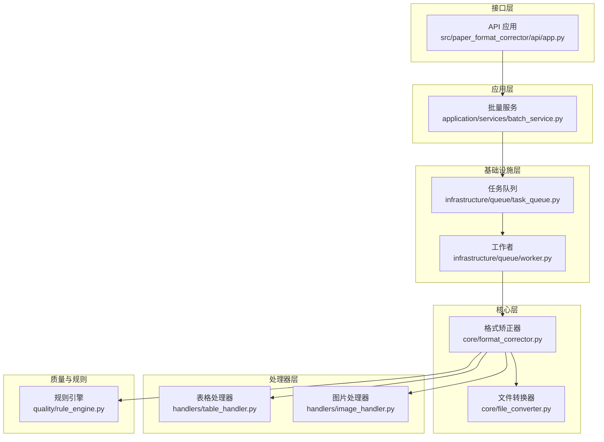
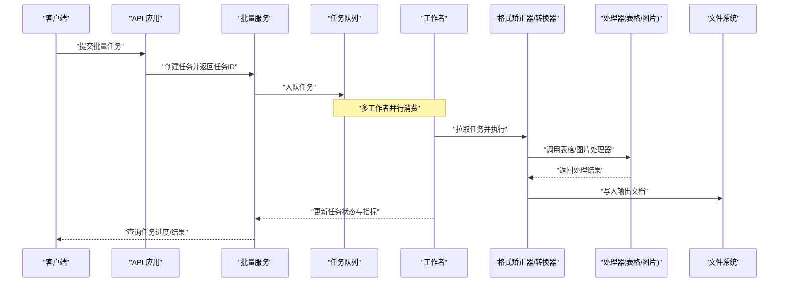
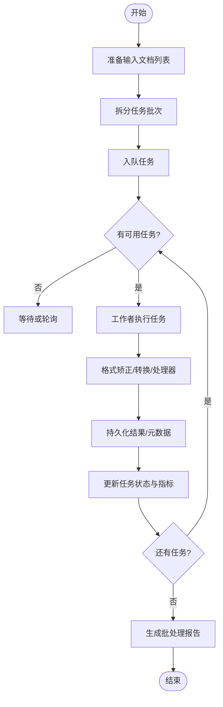
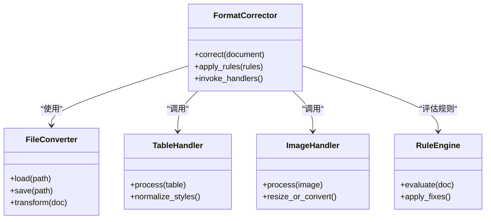
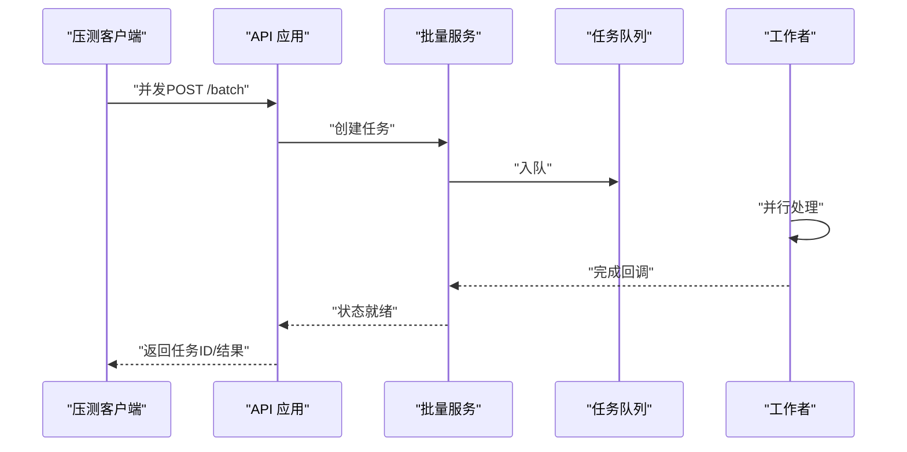
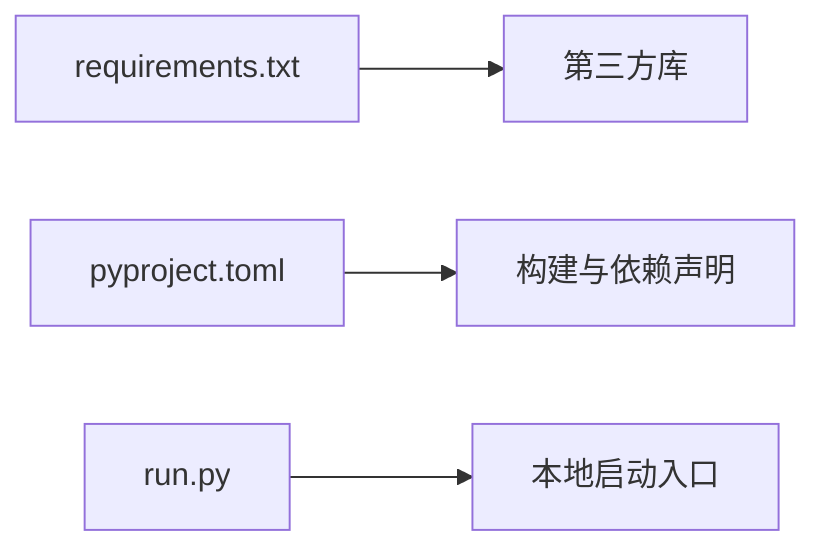

# 性能测试与压力测试

<cite>
**本文引用的文件**   
- [README.md](file://README.md)
- [pyproject.toml](file://pyproject.toml)
- [requirements.txt](file://requirements.txt)
- [run.py](file://run.py)
- [src/paper_format_corrector/app.py](file://src/paper_format_corrector/app.py)
- [src/paper_format_corrector/api/app.py](file://src/paper_format_corrector/api/app.py)
- [src/paper_format_corrector/application/services/batch_service.py](file://src/paper_format_corrector/application/services/batch_service.py)
- [src/paper_format_corrector/infrastructure/queue/task_queue.py](file://src/paper_format_corrector/infrastructure/queue/task_queue.py)
- [src/paper_format_corrector/infrastructure/queue/worker.py](file://src/paper_format_corrector/infrastructure/queue/worker.py)
- [src/paper_format_corrector/core/format_corrector.py](file://src/paper_format_corrector/core/format_corrector.py)
- [src/paper_format_corrector/core/file_converter.py](file://src/paper_format_corrector/core/file_converter.py)
- [src/paper_format_corrector/handlers/table_handler.py](file://src/paper_format_corrector/handlers/table_handler.py)
- [src/paper_format_corrector/handlers/image_handler.py](file://src/paper_format_corrector/handlers/image_handler.py)
- [src/paper_format_corrector/quality/rule_engine.py](file://src/paper_format_corrector/quality/rule_engine.py)
- [tests/test_task_queue.py](file://tests/test_task_queue.py)
- [tests/test_api_endpoints.py](file://tests/test_api_endpoints.py)
- [tests/conftest.py](file://tests/conftest.py)
</cite>

## 目录
1. [简介](#简介)
2. [项目结构](#项目结构)
3. [核心组件](#核心组件)
4. [架构总览](#架构总览)
5. [详细组件分析](#详细组件分析)
6. [依赖关系分析](#依赖关系分析)
7. [性能考虑](#性能考虑)
8. [故障排查指南](#故障排查指南)
9. [结论](#结论)
10. [附录](#附录)

## 简介
本指南面向论文格式矫正工具的性能与压力测试，覆盖基准测试、并发处理、内存与CPU监控、大规模文档处理的压测场景设计、瓶颈识别与优化建议，以及性能回归测试和质量门禁的落地方案。目标是在不改变现有功能的前提下，建立可重复、可度量、可回归的性能保障体系。

## 项目结构
本项目采用分层与领域驱动相结合的组织方式：应用服务层负责编排批量任务；基础设施层提供队列与工作者；核心层实现格式矫正与转换；处理器层针对表格、图片等复杂元素进行专项处理；API层暴露HTTP接口；测试层包含单元与集成用例。

图表来源
- [src/paper_format_corrector/api/app.py](file://src/paper_format_corrector/api/app.py)
- [src/paper_format_corrector/application/services/batch_service.py](file://src/paper_format_corrector/application/services/batch_service.py)
- [src/paper_format_corrector/infrastructure/queue/task_queue.py](file://src/paper_format_corrector/infrastructure/queue/task_queue.py)
- [src/paper_format_corrector/infrastructure/queue/worker.py](file://src/paper_format_corrector/infrastructure/queue/worker.py)
- [src/paper_format_corrector/core/format_corrector.py](file://src/paper_format_corrector/core/format_corrector.py)
- [src/paper_format_corrector/core/file_converter.py](file://src/paper_format_corrector/core/file_converter.py)
- [src/paper_format_corrector/handlers/table_handler.py](file://src/paper_format_corrector/handlers/table_handler.py)
- [src/paper_format_corrector/handlers/image_handler.py](file://src/paper_format_corrector/handlers/image_handler.py)
- [src/paper_format_corrector/quality/rule_engine.py](file://src/paper_format_corrector/quality/rule_engine.py)

章节来源
- [README.md](file://README.md)
- [pyproject.toml](file://pyproject.toml)
- [requirements.txt](file://requirements.txt)
- [run.py](file://run.py)

## 核心组件
- API 应用：接收请求并路由到批量服务，适合用于端到端压测入口。
- 批量服务：组织任务、调度队列、聚合结果，是并发与吞吐的关键编排点。
- 任务队列与工作者：解耦生产与消费，支撑水平扩展与背压控制。
- 格式矫正器与文件转换器：核心计算路径，涉及大量文档对象操作与IO。
- 处理器（表格/图片）：对复杂元素进行解析与重写，通常是热点路径。
- 规则引擎：执行质量检查与修正策略，可能引入额外CPU开销。

章节来源
- [src/paper_format_corrector/api/app.py](file://src/paper_format_corrector/api/app.py)
- [src/paper_format_corrector/application/services/batch_service.py](file://src/paper_format_corrector/application/services/batch_service.py)
- [src/paper_format_corrector/infrastructure/queue/task_queue.py](file://src/paper_format_corrector/infrastructure/queue/task_queue.py)
- [src/paper_format_corrector/infrastructure/queue/worker.py](file://src/paper_format_corrector/infrastructure/queue/worker.py)
- [src/paper_format_corrector/core/format_corrector.py](file://src/paper_format_corrector/core/format_corrector.py)
- [src/paper_format_corrector/core/file_converter.py](file://src/paper_format_corrector/core/file_converter.py)
- [src/paper_format_corrector/handlers/table_handler.py](file://src/paper_format_corrector/handlers/table_handler.py)
- [src/paper_format_corrector/handlers/image_handler.py](file://src/paper_format_corrector/handlers/image_handler.py)
- [src/paper_format_corrector/quality/rule_engine.py](file://src/paper_format_corrector/quality/rule_engine.py)

## 架构总览
下图展示一次批量格式化请求从API进入，经批量服务入队、工作者出队执行、核心处理与落盘的完整流程。该流程是构建压测场景与埋点观测的基础。

图表来源
- [src/paper_format_corrector/api/app.py](file://src/paper_format_corrector/api/app.py)
- [src/paper_format_corrector/application/services/batch_service.py](file://src/paper_format_corrector/application/services/batch_service.py)
- [src/paper_format_corrector/infrastructure/queue/task_queue.py](file://src/paper_format_corrector/infrastructure/queue/task_queue.py)
- [src/paper_format_corrector/infrastructure/queue/worker.py](file://src/paper_format_corrector/infrastructure/queue/worker.py)
- [src/paper_format_corrector/core/format_corrector.py](file://src/paper_format_corrector/core/format_corrector.py)
- [src/paper_format_corrector/core/file_converter.py](file://src/paper_format_corrector/core/file_converter.py)
- [src/paper_format_corrector/handlers/table_handler.py](file://src/paper_format_corrector/handlers/table_handler.py)
- [src/paper_format_corrector/handlers/image_handler.py](file://src/paper_format_corrector/handlers/image_handler.py)

## 详细组件分析

### 批量服务与队列工作流
- 批量服务负责将待处理文档集合切分为任务项，按策略入队，并在完成后汇总报告。
- 任务队列承载任务持久化与分发，支持多消费者并行。
- 工作者从队列拉取任务，调用核心处理链路，记录耗时与错误信息。

图表来源
- [src/paper_format_corrector/application/services/batch_service.py](file://src/paper_format_corrector/application/services/batch_service.py)
- [src/paper_format_corrector/infrastructure/queue/task_queue.py](file://src/paper_format_corrector/infrastructure/queue/task_queue.py)
- [src/paper_format_corrector/infrastructure/queue/worker.py](file://src/paper_format_corrector/infrastructure/queue/worker.py)

章节来源
- [src/paper_format_corrector/application/services/batch_service.py](file://src/paper_format_corrector/application/services/batch_service.py)
- [src/paper_format_corrector/infrastructure/queue/task_queue.py](file://src/paper_format_corrector/infrastructure/queue/task_queue.py)
- [src/paper_format_corrector/infrastructure/queue/worker.py](file://src/paper_format_corrector/infrastructure/queue/worker.py)

### 核心处理路径（格式矫正与转换）
- 格式矫正器串联各处理器与转换器，形成主计算路径。
- 文件转换器负责文档对象的加载、修改与保存，涉及大量IO与序列化。
- 处理器（表格/图片）在遍历与重建节点时易产生内存峰值。

图表来源
- [src/paper_format_corrector/core/format_corrector.py](file://src/paper_format_corrector/core/format_corrector.py)
- [src/paper_format_corrector/core/file_converter.py](file://src/paper_format_corrector/core/file_converter.py)
- [src/paper_format_corrector/handlers/table_handler.py](file://src/paper_format_corrector/handlers/table_handler.py)
- [src/paper_format_corrector/handlers/image_handler.py](file://src/paper_format_corrector/handlers/image_handler.py)
- [src/paper_format_corrector/quality/rule_engine.py](file://src/paper_format_corrector/quality/rule_engine.py)

章节来源
- [src/paper_format_corrector/core/format_corrector.py](file://src/paper_format_corrector/core/format_corrector.py)
- [src/paper_format_corrector/core/file_converter.py](file://src/paper_format_corrector/core/file_converter.py)
- [src/paper_format_corrector/handlers/table_handler.py](file://src/paper_format_corrector/handlers/table_handler.py)
- [src/paper_format_corrector/handlers/image_handler.py](file://src/paper_format_corrector/handlers/image_handler.py)
- [src/paper_format_corrector/quality/rule_engine.py](file://src/paper_format_corrector/quality/rule_engine.py)

### API 端到端压测入口
- API 应用作为外部压测客户端的接入点，适合发起并发请求以模拟真实负载。
- 可通过批量接口触发批量任务，结合队列与工作者观察系统整体吞吐与延迟分布。

图表来源
- [src/paper_format_corrector/api/app.py](file://src/paper_format_corrector/api/app.py)
- [src/paper_format_corrector/application/services/batch_service.py](file://src/paper_format_corrector/application/services/batch_service.py)
- [src/paper_format_corrector/infrastructure/queue/task_queue.py](file://src/paper_format_corrector/infrastructure/queue/task_queue.py)
- [src/paper_format_corrector/infrastructure/queue/worker.py](file://src/paper_format_corrector/infrastructure/queue/worker.py)

章节来源
- [src/paper_format_corrector/api/app.py](file://src/paper_format_corrector/api/app.py)
- [tests/test_api_endpoints.py](file://tests/test_api_endpoints.py)

## 依赖关系分析
- 外部依赖通过包管理文件声明，便于在压测环境中锁定版本，避免环境差异导致的性能波动。
- 运行入口脚本提供本地启动能力，可用于单机压测与基准对比。

图表来源
- [requirements.txt](file://requirements.txt)
- [pyproject.toml](file://pyproject.toml)
- [run.py](file://run.py)

章节来源
- [requirements.txt](file://requirements.txt)
- [pyproject.toml](file://pyproject.toml)
- [run.py](file://run.py)

## 性能考虑
- 并发处理能力
  - 通过工作者数量与队列容量调节吞吐；在高I/O场景下适当增加并发，在CPU密集场景下根据核数调优。
  - 使用批量服务分批入队，避免一次性加载全部文档导致内存尖峰。
- 内存使用优化
  - 对大文档采用分块处理与惰性读取；及时释放中间对象引用；避免在循环中累积临时数据结构。
  - 图片与表格处理器注意缓存复用与资源清理。
- CPU利用率监控
  - 在工作者与核心处理路径埋点统计CPU时间占比，识别热点函数。
  - 对规则引擎与样式规范化等逻辑进行采样剖析，定位高开销分支。
- IO与磁盘
  - 输出目录使用高性能存储；合并小文件写入；必要时启用异步落盘或缓冲写。
- 稳定性与背压
  - 队列满时拒绝新任务或降级策略；为长时间任务设置超时与重试上限。

[本节为通用指导，无需特定文件来源]

## 故障排查指南
- 常见问题定位
  - 任务堆积：检查队列积压与工作者健康度，确认是否有阻塞或异常退出。
  - 内存泄漏：关注长生命周期对象是否被正确释放，特别是文档树与图片缓存。
  - CPU飙升：聚焦规则匹配与表格/图片处理热点路径，考虑算法优化或缓存命中。
- 诊断手段
  - 使用性能剖析工具在工作线程中采集CPU与内存快照。
  - 基于现有测试夹具与用例构造最小复现场景，隔离问题范围。
- 回归验证
  - 将关键路径纳入基准测试集，确保变更不会引入性能退化。

章节来源
- [tests/test_task_queue.py](file://tests/test_task_queue.py)
- [tests/conftest.py](file://tests/conftest.py)

## 结论
通过在API入口、批量服务、队列与工作者的全链路埋点与压测，可以准确评估系统的吞吐、延迟与资源占用。结合基准测试与回归门禁，能够在持续集成中自动拦截性能退化，保障大规模文档处理的稳定性与效率。

[本节为总结性内容，无需特定文件来源]

## 附录

### 基准测试与性能分析工具
- pytest-benchmark
  - 用途：对核心函数与处理路径进行微基准测试，比较不同版本的性能变化。
  - 建议：围绕格式矫正、表格/图片处理、规则评估等热点函数编写基准用例，固定输入规模与环境。
- locust
  - 用途：对API与批量接口进行并发压测，模拟真实用户行为与流量模型。
  - 建议：定义典型场景（单文档、批量、混合负载），采集P50/P95/P99延迟与错误率。

[本节为通用指导，无需特定文件来源]

### 批量处理任务的压测策略
- 场景设计
  - 小规模基准：少量文档快速往返，验证正确性与基线吞吐。
  - 中等规模：数十至数百文档，观察队列与工作者均衡情况。
  - 大规模压力：数千至数万文档，关注内存峰值、GC行为与磁盘IO。
- 指标采集
  - 吞吐（任务/秒）、平均与分位延迟、错误率、CPU/内存/IO利用率、队列深度与消费者空闲率。
- 执行方法
  - 使用locust脚本驱动API批量接口；配合系统监控（如进程级指标）采集资源使用情况。
  - 逐步提升并发与任务量，直至达到系统瓶颈或SLA阈值。

[本节为通用指导，无需特定文件来源]

### 性能回归测试与质量门禁
- 回归测试
  - 在CI中运行pytest-benchmark基准集，设定阈值（如P95延迟增长不超过X%）。
  - 定期运行locust压测脚本，产出趋势报告并与历史基线对比。
- 质量门禁
  - 当基准失败或压测指标越界时阻断合并；要求提交者附带性能分析与优化说明。
  - 对热点路径新增或重构必须附带基准用例与压测报告。

[本节为通用指导，无需特定文件来源]