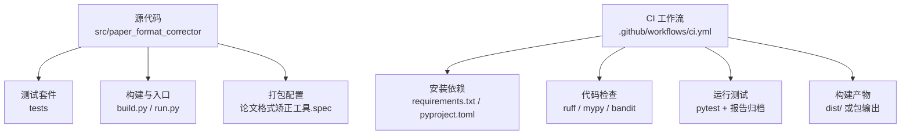
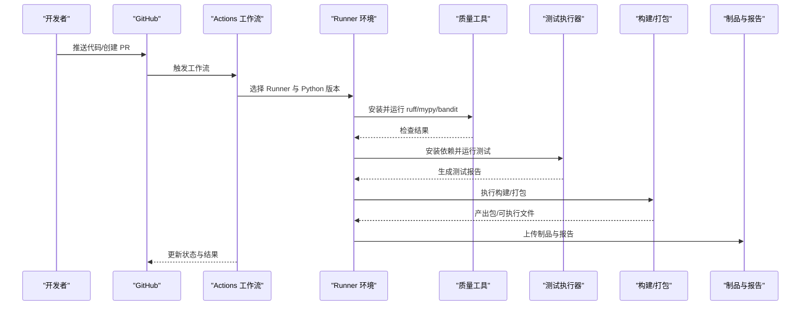
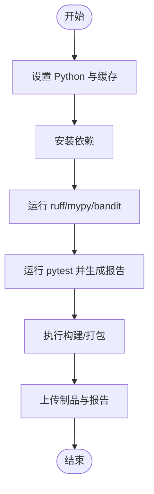
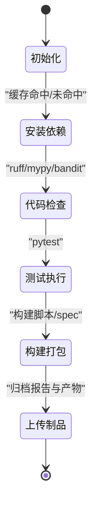
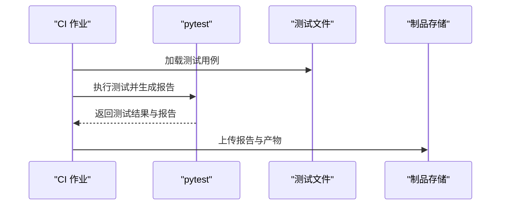
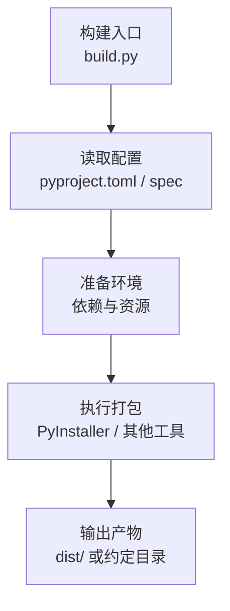
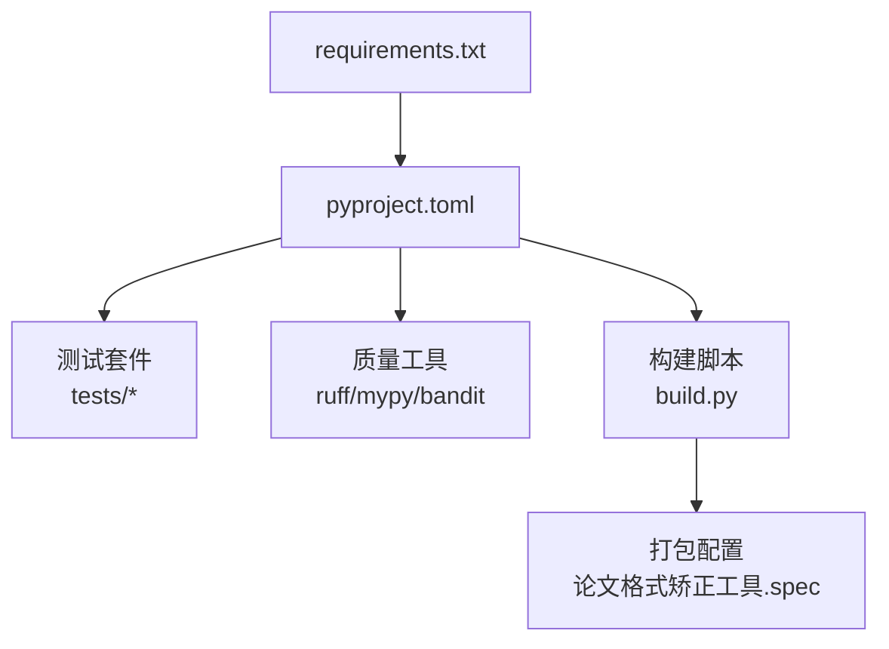

# 持续集成与自动化

<cite>
**本文引用的文件**   
- [ci.yml](file://.github/workflows/ci.yml)
- [pyproject.toml](file://pyproject.toml)
- [requirements.txt](file://requirements.txt)
- [build.py](file://build.py)
- [run.py](file://run.py)
- [paper_format_corrector.spec](file://论文格式矫正工具.spec)
- [test_basic.py](file://tests/test_basic.py)
- [test_cli_integration.py](file://tests/test_cli_integration.py)
- [test_template_repository.py](file://tests/test_template_repository.py)
- [test_template_sync.py](file://tests/test_template_sync.py)
- [test_api_endpoints.py](file://tests/test_api_endpoints.py)
- [conftest.py](file://tests/conftest.py)
</cite>

## 目录
1. [简介](#简介)
2. [项目结构](#项目结构)
3. [核心组件](#核心组件)
4. [架构总览](#架构总览)
5. [详细组件分析](#详细组件分析)
6. [依赖分析](#依赖分析)
7. [性能考虑](#性能考虑)
8. [故障诊断指南](#故障诊断指南)
9. [结论](#结论)
10. [附录](#附录)

## 简介
本文件面向持续集成与自动化的工程实践，围绕 GitHub Actions 工作流配置、代码检查、测试执行、构建打包与部署流程进行系统化说明。文档同时覆盖多环境测试（Python 版本矩阵）、依赖管理策略、并行化执行、质量工具集成（ruff、mypy、bandit）、测试报告生成与归档，以及常见问题的诊断与调试技巧。目标是帮助团队在本地与 CI 环境中保持一致的开发体验与交付质量。

## 项目结构
仓库采用分层与模块化组织方式：
- 源码位于 src/paper_format_corrector，按领域与职责划分模块
- 测试位于 tests，包含单元测试、集成测试与端到端用例
- 构建脚本与入口位于根目录（build.py、run.py）
- 打包配置文件（spec）用于桌面应用打包
- 质量与依赖配置集中在 pyproject.toml 与 requirements.txt
- CI 工作流定义于 .github/workflows/ci.yml

**图表来源**
- [ci.yml](file://.github/workflows/ci.yml)
- [pyproject.toml](file://pyproject.toml)
- [requirements.txt](file://requirements.txt)
- [build.py](file://build.py)
- [论文格式矫正工具.spec](file://论文格式矫正工具.spec)

**章节来源**
- [ci.yml](file://.github/workflows/ci.yml)
- [pyproject.toml](file://pyproject.toml)
- [requirements.txt](file://requirements.txt)
- [build.py](file://build.py)
- [论文格式矫正工具.spec](file://论文格式矫正工具.spec)

## 核心组件
- CI 工作流（GitHub Actions）
  - 触发条件：推送与拉取请求
  - 任务矩阵：多 Python 版本并行执行
  - 步骤：设置 Python、缓存依赖、安装依赖、代码检查、运行测试、构建打包、上传制品与报告
- 依赖与配置
  - requirements.txt：运行时依赖
  - pyproject.toml：元数据、可选依赖、工具配置（如 ruff、mypy、bandit、pytest）
- 构建与打包
  - build.py：构建脚本（可调用打包工具）
  - 论文格式矫正工具.spec：PyInstaller 打包配置
- 测试套件
  - tests 下各测试文件覆盖 CLI、API、模板仓库与同步等关键路径
  - conftest.py：共享夹具与全局配置

**章节来源**
- [ci.yml](file://.github/workflows/ci.yml)
- [pyproject.toml](file://pyproject.toml)
- [requirements.txt](file://requirements.txt)
- [build.py](file://build.py)
- [论文格式矫正工具.spec](file://论文格式矫正工具.spec)
- [conftest.py](file://tests/conftest.py)
- [test_basic.py](file://tests/test_basic.py)
- [test_cli_integration.py](file://tests/test_cli_integration.py)
- [test_template_repository.py](file://tests/test_template_repository.py)
- [test_template_sync.py](file://tests/test_template_sync.py)
- [test_api_endpoints.py](file://tests/test_api_endpoints.py)

## 架构总览
下图展示 CI 流水线从触发到产物的整体流程，包括代码检查、测试执行、构建打包与制品归档。

**图表来源**
- [ci.yml](file://.github/workflows/ci.yml)
- [pyproject.toml](file://pyproject.toml)
- [requirements.txt](file://requirements.txt)
- [build.py](file://build.py)
- [论文格式矫正工具.spec](file://论文格式矫正工具.spec)

## 详细组件分析

### CI 工作流（GitHub Actions）
- 触发与矩阵
  - 通过推送与拉取请求事件触发
  - 使用 Python 版本矩阵实现并行化，覆盖主流版本
- 环境与依赖
  - 设置指定 Python 版本
  - 缓存 pip 依赖以提升速度
  - 安装 requirements.txt 与可选开发依赖
- 代码检查
  - ruff：语法与风格检查
  - mypy：静态类型检查
  - bandit：安全扫描
- 测试执行
  - pytest 运行全部测试
  - 生成 JUnit XML 报告以便归档
- 构建与打包
  - 调用构建脚本或打包工具
  - 将产物输出至 dist 或约定目录
- 制品与报告归档
  - 上传测试报告与构建产物供后续查看与发布

**图表来源**
- [ci.yml](file://.github/workflows/ci.yml)

**章节来源**
- [ci.yml](file://.github/workflows/ci.yml)

### 多环境测试与并行化
- Python 版本矩阵
  - 在工作流中声明多个 Python 版本，Runner 并行执行每个组合
- 依赖隔离
  - 每个矩阵项独立安装依赖，避免相互污染
- 缓存策略
  - 基于操作系统与 Python 版本的键缓存 pip 包，显著缩短冷启动时间
- 失败快速反馈
  - 任一矩阵项失败即标记整个作业失败，便于快速定位问题

**图表来源**
- [ci.yml](file://.github/workflows/ci.yml)

**章节来源**
- [ci.yml](file://.github/workflows/ci.yml)

### 依赖管理与兼容性
- requirements.txt
  - 集中声明运行时依赖，确保环境一致性
- pyproject.toml
  - 定义项目元数据、可选依赖与工具配置
  - 可配置 ruff、mypy、bandit、pytest 的行为与规则
- 兼容性与升级
  - 通过矩阵覆盖多 Python 版本，尽早发现兼容性问题
  - 定期更新依赖并观察 CI 结果，降低回归风险

**章节来源**
- [requirements.txt](file://requirements.txt)
- [pyproject.toml](file://pyproject.toml)

### 代码质量检查工具集成
- ruff
  - 快速语法与风格检查，适合在 CI 中作为门禁
- mypy
  - 静态类型检查，提升代码健壮性
- bandit
  - 安全扫描，识别潜在安全问题
- 集成策略
  - 在 CI 中顺序执行，任一失败即阻断流水线
  - 结合 pyproject.toml 中的配置统一规则与阈值

**章节来源**
- [pyproject.toml](file://pyproject.toml)
- [ci.yml](file://.github/workflows/ci.yml)

### 测试执行策略与报告归档
- 测试范围
  - 基础功能、CLI 集成、API 端点、模板仓库与同步等
- 执行方式
  - pytest 收集并运行测试，支持并行插件（如 pytest-xdist）以加速
- 报告生成
  - 生成 JUnit XML 报告，便于归档与可视化
- 归档机制
  - 使用工件上传动作保存报告与产物，供后续审查与发布

**图表来源**
- [ci.yml](file://.github/workflows/ci.yml)
- [test_basic.py](file://tests/test_basic.py)
- [test_cli_integration.py](file://tests/test_cli_integration.py)
- [test_template_repository.py](file://tests/test_template_repository.py)
- [test_template_sync.py](file://tests/test_template_sync.py)
- [test_api_endpoints.py](file://tests/test_api_endpoints.py)
- [conftest.py](file://tests/conftest.py)

**章节来源**
- [ci.yml](file://.github/workflows/ci.yml)
- [test_basic.py](file://tests/test_basic.py)
- [test_cli_integration.py](file://tests/test_cli_integration.py)
- [test_template_repository.py](file://tests/test_template_repository.py)
- [test_template_sync.py](file://tests/test_template_sync.py)
- [test_api_endpoints.py](file://tests/test_api_endpoints.py)
- [conftest.py](file://tests/conftest.py)

### 构建与打包流程
- 构建脚本
  - build.py 负责协调构建过程，可调用打包工具或生成产物
- 打包配置
  - 论文格式矫正工具.spec 定义 PyInstaller 打包参数与资源
- 产物输出
  - 构建产物通常输出至 dist 目录，便于分发与发布

**图表来源**
- [build.py](file://build.py)
- [论文格式矫正工具.spec](file://论文格式矫正工具.spec)
- [pyproject.toml](file://pyproject.toml)

**章节来源**
- [build.py](file://build.py)
- [论文格式矫正工具.spec](file://论文格式矫正工具.spec)
- [pyproject.toml](file://pyproject.toml)

### 入口与运行
- 命令行入口
  - run.py 提供程序入口，便于本地运行与调试
- 与 CI 的衔接
  - 可在 CI 中直接调用入口验证基本功能

**章节来源**
- [run.py](file://run.py)

## 依赖分析
- 外部依赖
  - requirements.txt 声明运行时依赖，确保跨环境一致
- 内部模块
  - src/paper_format_corrector 下的模块按职责划分，测试覆盖关键路径
- 工具链依赖
  - ruff、mypy、bandit、pytest 等在 pyproject.toml 中配置

**图表来源**
- [requirements.txt](file://requirements.txt)
- [pyproject.toml](file://pyproject.toml)
- [build.py](file://build.py)
- [论文格式矫正工具.spec](file://论文格式矫正工具.spec)

**章节来源**
- [requirements.txt](file://requirements.txt)
- [pyproject.toml](file://pyproject.toml)
- [build.py](file://build.py)
- [论文格式矫正工具.spec](file://论文格式矫正工具.spec)

## 性能考虑
- 依赖缓存
  - 使用 pip 缓存与 Actions cache 减少下载与安装时间
- 并行执行
  - 利用矩阵并行与 pytest 并行插件缩短测试时长
- 增量检查
  - 仅对变更文件运行检查（可通过过滤策略优化）
- 产物复用
  - 合理缓存构建中间产物，避免重复计算

[本节为通用指导，不直接分析具体文件]

## 故障诊断指南
- 依赖安装失败
  - 检查网络与镜像源；确认 Python 版本与依赖兼容
  - 清理缓存后重试
- 代码检查失败
  - 根据 ruff/mypy/bandit 的输出定位问题并修复
  - 调整规则或阈值以平衡严格性与可维护性
- 测试失败
  - 查看 pytest 日志与 JUnit 报告，定位失败用例
  - 使用 conftest.py 中的夹具与配置复现问题
- 构建/打包失败
  - 检查 spec 配置与资源路径
  - 确认系统依赖与平台差异

**章节来源**
- [ci.yml](file://.github/workflows/ci.yml)
- [conftest.py](file://tests/conftest.py)
- [论文格式矫正工具.spec](file://论文格式矫正工具.spec)

## 结论
通过完善的 CI 工作流、严格的代码质量检查、全面的测试覆盖与可靠的构建打包流程，本项目能够在多 Python 版本环境下保持高质量与高稳定性。建议持续优化缓存与并行策略，定期更新依赖与规则，确保交付效率与质量稳步提升。

[本节为总结性内容，不直接分析具体文件]

## 附录
- 常用命令参考
  - 本地运行：参见入口脚本
  - 运行测试：使用 pytest 并生成报告
  - 构建打包：执行构建脚本并检查产物
- 最佳实践
  - 小步提交与频繁触发 CI
  - 明确失败原因并快速修复
  - 定期回顾质量规则与测试覆盖率

[本节为补充信息，不直接分析具体文件]