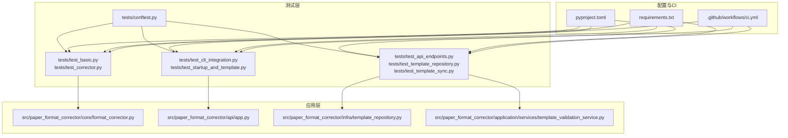
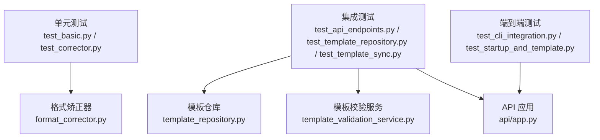
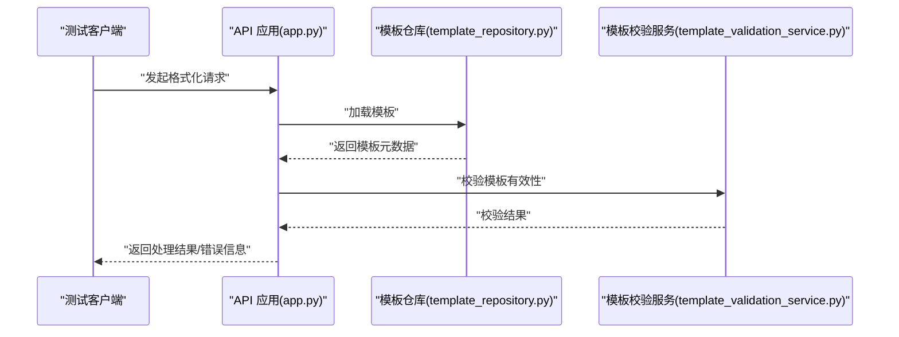
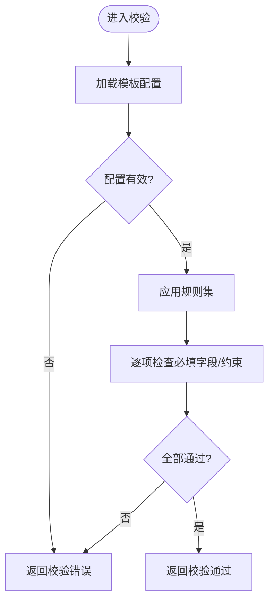
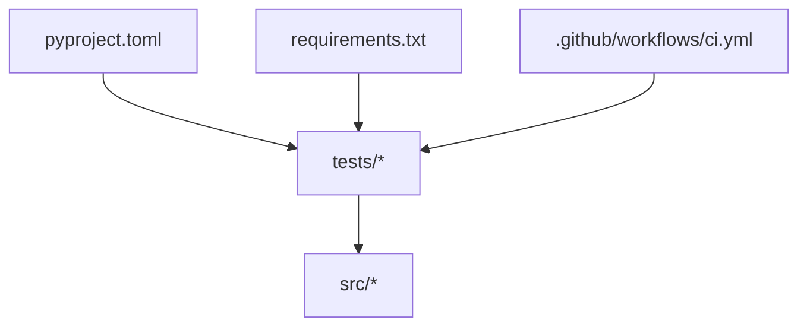

# 测试与质量保证

<cite>
**本文引用的文件**   
- [pyproject.toml](file://pyproject.toml)
- [requirements.txt](file://requirements.txt)
- [.github/workflows/ci.yml](file://.github/workflows/ci.yml)
- [tests/conftest.py](file://tests/conftest.py)
- [tests/test_basic.py](file://tests/test_basic.py)
- [tests/test_corrector.py](file://tests/test_corrector.py)
- [tests/test_api_endpoints.py](file://tests/test_api_endpoints.py)
- [src/paper_format_corrector/core/format_corrector.py](file://src/paper_format_corrector/core/format_corrector.py)
- [src/paper_format_corrector/api/app.py](file://src/paper_format_corrector/api/app.py)
- [src/paper_format_corrector/infra/template_repository.py](file://src/paper_format_corrector/infra/template_repository.py)
- [src/paper_format_corrector/application/services/template_validation_service.py](file://src/paper_format_corrector/application/services/template_validation_service.py)
</cite>

## 目录
1. [简介](#简介)
2. [项目结构](#项目结构)
3. [核心组件](#核心组件)
4. [架构总览](#架构总览)
5. [详细组件分析](#详细组件分析)
6. [依赖分析](#依赖分析)
7. [性能考虑](#性能考虑)
8. [故障排查指南](#故障排查指南)
9. [结论](#结论)
10. [附录](#附录)

## 简介
本指南面向“论文格式矫正工具”的测试与质量保证，目标是建立可维护、可扩展且高效的测试体系。内容覆盖：
- 测试策略与测试金字塔（单元测试、集成测试、端到端测试）
- pytest 配置与使用（fixtures、测试数据准备、覆盖率与报告）
- 核心功能测试策略（格式矫正器、模板系统、API 接口）
- 代码覆盖率要求与质量门禁
- 持续集成流水线配置与优化
- 性能测试与压力测试方法
- 测试自动化与回归测试最佳实践

## 项目结构
仓库采用分层与领域驱动相结合的组织方式，测试位于 tests 目录，按功能域拆分；应用入口与 API 位于 src 下；CI 配置在 .github/workflows/ci.yml；pytest 与依赖在 pyproject.toml 与 requirements.txt 中管理。

图表来源
- [pyproject.toml](file://pyproject.toml)
- [requirements.txt](file://requirements.txt)
- [.github/workflows/ci.yml](file://.github/workflows/ci.yml)
- [tests/conftest.py](file://tests/conftest.py)
- [tests/test_basic.py](file://tests/test_basic.py)
- [tests/test_corrector.py](file://tests/test_corrector.py)
- [tests/test_api_endpoints.py](file://tests/test_api_endpoints.py)
- [src/paper_format_corrector/core/format_corrector.py](file://src/paper_format_corrector/core/format_corrector.py)
- [src/paper_format_corrector/api/app.py](file://src/paper_format_corrector/api/app.py)
- [src/paper_format_corrector/infra/template_repository.py](file://src/paper_format_corrector/infra/template_repository.py)
- [src/paper_format_corrector/application/services/template_validation_service.py](file://src/paper_format_corrector/application/services/template_validation_service.py)

章节来源
- [pyproject.toml](file://pyproject.toml)
- [requirements.txt](file://requirements.txt)
- [.github/workflows/ci.yml](file://.github/workflows/ci.yml)
- [tests/conftest.py](file://tests/conftest.py)
- [tests/test_basic.py](file://tests/test_basic.py)
- [tests/test_corrector.py](file://tests/test_corrector.py)
- [tests/test_api_endpoints.py](file://tests/test_api_endpoints.py)
- [src/paper_format_corrector/core/format_corrector.py](file://src/paper_format_corrector/core/format_corrector.py)
- [src/paper_format_corrector/api/app.py](file://src/paper_format_corrector/api/app.py)
- [src/paper_format_corrector/infra/template_repository.py](file://src/paper_format_corrector/infra/template_repository.py)
- [src/paper_format_corrector/application/services/template_validation_service.py](file://src/paper_format_corrector/application/services/template_validation_service.py)

## 核心组件
- 测试框架与配置
  - pytest 作为统一测试运行器，通过 pyproject.toml 集中管理插件、标记、参数化与覆盖率阈值等。
  - 依赖声明在 requirements.txt，便于本地与 CI 环境一致性。
- 测试基础设施
  - conftest.py 提供全局 fixtures、路径解析、临时目录与共享夹具，减少重复样板代码。
- 测试分层
  - 单元测试：聚焦纯函数与无外部依赖逻辑（如格式矫正规则）。
  - 集成测试：验证模块间协作（模板仓库、模板校验服务、API 路由与服务编排）。
  - 端到端测试：模拟真实用户流程（CLI 启动、模板加载、文档处理输出）。

章节来源
- [pyproject.toml](file://pyproject.toml)
- [requirements.txt](file://requirements.txt)
- [tests/conftest.py](file://tests/conftest.py)

## 架构总览
测试金字塔在本项目中体现为：
- 底层：大量快速、稳定的单元测试，覆盖核心算法与边界条件。
- 中层：集成测试验证关键交互（模板仓库、模板校验、API 路由）。
- 顶层：少量端到端测试保障关键用户旅程。

图表来源
- [tests/test_basic.py](file://tests/test_basic.py)
- [tests/test_corrector.py](file://tests/test_corrector.py)
- [tests/test_api_endpoints.py](file://tests/test_api_endpoints.py)
- [tests/test_cli_integration.py](file://tests/test_cli_integration.py)
- [tests/test_startup_and_template.py](file://tests/test_startup_and_template.py)
- [src/paper_format_corrector/core/format_corrector.py](file://src/paper_format_corrector/core/format_corrector.py)
- [src/paper_format_corrector/infra/template_repository.py](file://src/paper_format_corrector/infra/template_repository.py)
- [src/paper_format_corrector/application/services/template_validation_service.py](file://src/paper_format_corrector/application/services/template_validation_service.py)
- [src/paper_format_corrector/api/app.py](file://src/paper_format_corrector/api/app.py)

## 详细组件分析

### 测试框架与配置（pytest）
- 目标
  - 统一测试入口、插件与参数化能力，确保本地与 CI 行为一致。
- 关键点
  - 在 pyproject.toml 中定义 pytest 相关配置（插件、标记、参数化、覆盖率阈值等）。
  - 在 requirements.txt 中声明测试依赖，避免环境漂移。
- 建议
  - 将覆盖率阈值写入 pyproject.toml，并在 CI 中强制失败。
  - 使用 pytest 标记组织测试（如 unit/integration/e2e），支持选择性执行。

章节来源
- [pyproject.toml](file://pyproject.toml)
- [requirements.txt](file://requirements.txt)

### Fixtures 与测试数据准备
- 目标
  - 通过 conftest.py 提供可复用的夹具，降低测试耦合度与重复代码。
- 关键点
  - 提供临时目录、固定输入输出路径、示例模板与样例文档。
  - 封装常见初始化步骤（如创建最小可用模板、清理资源）。
- 建议
  - 对 IO 操作使用临时目录，避免污染文件系统。
  - 对网络或外部服务使用 mock/fixture 替换，保证测试稳定性。

章节来源
- [tests/conftest.py](file://tests/conftest.py)

### 单元测试：格式矫正器
- 目标
  - 验证格式矫正器的核心规则与边界条件，确保高内聚、低耦合。
- 关注点
  - 输入合法性校验、异常分支、多语言与特殊字符、空文档与超大文档。
  - 规则组合与优先级、增量修正与幂等性。
- 建议
  - 使用参数化用例覆盖典型与异常场景。
  - 对复杂规则进行等价类划分与边界值分析。

章节来源
- [tests/test_corrector.py](file://tests/test_corrector.py)
- [src/paper_format_corrector/core/format_corrector.py](file://src/paper_format_corrector/core/format_corrector.py)

### 集成测试：模板系统与 API
- 目标
  - 验证模板仓库读取、模板校验服务与 API 路由之间的协作。
- 关注点
  - 模板仓库的加载与缓存、模板校验规则生效、API 请求响应契约。
  - 错误码、异常传播与日志记录。
- 建议
  - 使用 fixture 注入内存或轻量级模板存储，避免磁盘 IO。
  - 对 API 使用客户端调用或内部装配对象，减少 HTTP 开销。

章节来源
- [tests/test_api_endpoints.py](file://tests/test_api_endpoints.py)
- [src/paper_format_corrector/infra/template_repository.py](file://src/paper_format_corrector/infra/template_repository.py)
- [src/paper_format_corrector/application/services/template_validation_service.py](file://src/paper_format_corrector/application/services/template_validation_service.py)
- [src/paper_format_corrector/api/app.py](file://src/paper_format_corrector/api/app.py)

### 端到端测试：CLI 与启动流程
- 目标
  - 模拟真实用户从 CLI 启动到生成输出的完整流程。
- 关注点
  - 启动时间、模板加载成功率、输出文件完整性与一致性。
  - 环境变量与配置文件的影响。
- 建议
  - 控制超时与重试，避免 CI 抖动。
  - 使用快照对比或结构化断言，提高稳定性。

章节来源
- [tests/test_cli_integration.py](file://tests/test_cli_integration.py)
- [tests/test_startup_and_template.py](file://tests/test_startup_and_template.py)

### 测试序列图：API 调用流程

图表来源
- [src/paper_format_corrector/api/app.py](file://src/paper_format_corrector/api/app.py)
- [src/paper_format_corrector/infra/template_repository.py](file://src/paper_format_corrector/infra/template_repository.py)
- [src/paper_format_corrector/application/services/template_validation_service.py](file://src/paper_format_corrector/application/services/template_validation_service.py)

### 流程图：模板校验服务决策

图表来源
- [src/paper_format_corrector/application/services/template_validation_service.py](file://src/paper_format_corrector/application/services/template_validation_service.py)

## 依赖分析
- 测试依赖与应用依赖分离，确保构建与运行环境稳定。
- CI 通过工作流拉取依赖并执行测试，形成质量门禁。

图表来源
- [pyproject.toml](file://pyproject.toml)
- [requirements.txt](file://requirements.txt)
- [.github/workflows/ci.yml](file://.github/workflows/ci.yml)

章节来源
- [pyproject.toml](file://pyproject.toml)
- [requirements.txt](file://requirements.txt)
- [.github/workflows/ci.yml](file://.github/workflows/ci.yml)

## 性能考虑
- 单元测试优先使用内存与轻量数据结构，避免磁盘与网络 IO。
- 对大文档处理采用分块处理与流式读取，防止内存峰值过高。
- 使用 pytest-benchmark 或类似工具对热点路径进行基准测试，纳入回归基线。
- 在集成测试中对耗时操作设置合理超时与重试策略，避免 CI 不稳定。

## 故障排查指南
- 常见问题
  - 测试环境不一致：确认 requirements.txt 与 pyproject.toml 版本锁定。
  - 路径问题：使用 conftest.py 提供的绝对路径与临时目录。
  - 外部依赖：对网络与文件系统使用 mock/fixture 隔离。
- 定位技巧
  - 使用 pytest -v 与 -s 查看详细输出与打印。
  - 针对失败用例单独执行，缩小范围。
  - 结合日志与断言中间状态，定位根因。

章节来源
- [tests/conftest.py](file://tests/conftest.py)
- [tests/test_basic.py](file://tests/test_basic.py)
- [tests/test_corrector.py](file://tests/test_corrector.py)
- [tests/test_api_endpoints.py](file://tests/test_api_endpoints.py)

## 结论
通过分层测试策略、完善的 fixtures 与数据准备、严格的覆盖率与质量门禁，以及稳定的 CI 流水线，本项目能够在保持开发效率的同时，持续提升代码质量与可靠性。建议在后续迭代中持续完善基准测试与回归基线，逐步扩大端到端场景覆盖，以应对复杂业务变化。

## 附录

### 测试策略与金字塔实现要点
- 单元测试
  - 覆盖核心算法与边界条件，强调速度与稳定性。
  - 使用参数化与等价类划分提升覆盖率。
- 集成测试
  - 验证模块间协作与契约，尽量使用内存或轻量替代。
  - 对 API 使用客户端或内部装配对象，减少 HTTP 开销。
- 端到端测试
  - 聚焦关键用户旅程，控制数量与频率，避免过长运行时间。

### pytest 设置与使用
- 在 pyproject.toml 中集中配置插件、标记、参数化与覆盖率阈值。
- 在 requirements.txt 中声明测试依赖，确保环境一致。
- 使用 conftest.py 提供全局 fixtures 与路径解析。

章节来源
- [pyproject.toml](file://pyproject.toml)
- [requirements.txt](file://requirements.txt)
- [tests/conftest.py](file://tests/conftest.py)

### 覆盖率要求与质量门禁
- 建议最低覆盖率阈值（例如整体行覆盖率不低于 80%），并在 CI 中强制失败。
- 对关键模块（格式矫正器、模板校验服务、API 路由）设定更高阈值。
- 使用覆盖率报告与趋势分析，识别退化与盲区。

章节来源
- [pyproject.toml](file://pyproject.toml)
- [.github/workflows/ci.yml](file://.github/workflows/ci.yml)

### 持续集成流水线配置与优化
- 并行执行测试任务，缩短反馈时间。
- 缓存依赖与构建产物，加速流水线。
- 失败时保留工件与日志，便于回溯。
- 引入质量门禁（覆盖率、静态检查、安全扫描）。

章节来源
- [.github/workflows/ci.yml](file://.github/workflows/ci.yml)

### 性能测试与压力测试方法
- 基准测试：对热点路径使用 pytest-benchmark 建立基线，纳入回归。
- 压力测试：模拟并发请求与批量文档处理，观察吞吐与延迟。
- 监控指标：CPU、内存、IO 与 GC 情况，定位瓶颈。

### 测试自动化与回归测试最佳实践
- 自动化触发：提交即运行，合并前必须通过。
- 回归基线：保存关键输出快照，变更需人工评审。
- 用例维护：定期清理过时用例，补充新场景。
- 文档化：为复杂用例添加注释与链接，便于理解与维护。