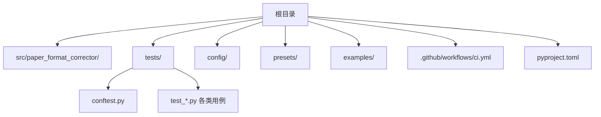
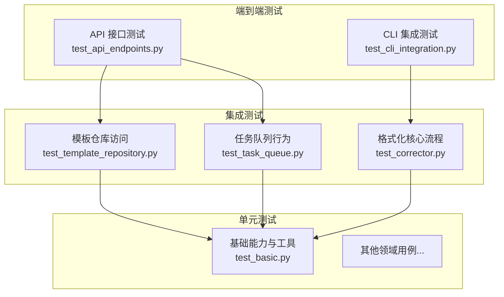
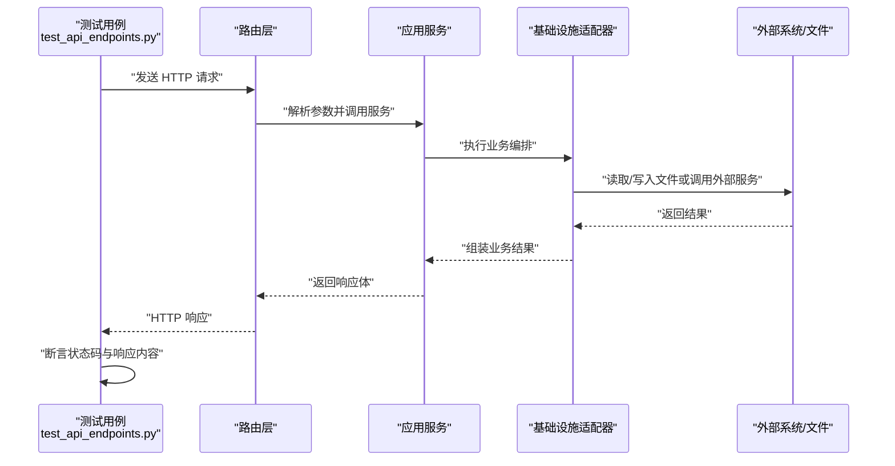
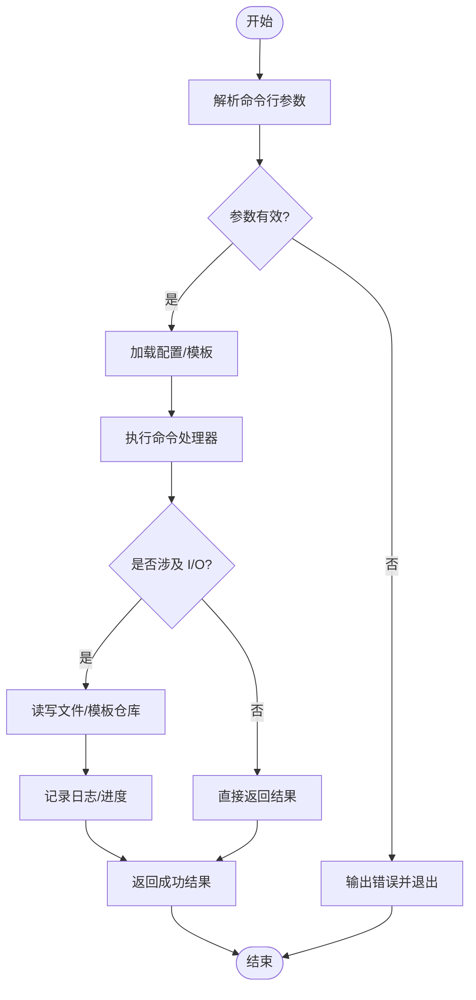
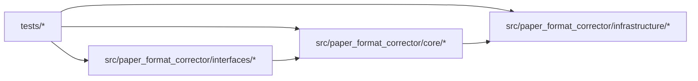

# 测试策略与框架

<cite>
**本文引用的文件**   
- [pyproject.toml](file://pyproject.toml)
- [tests/conftest.py](file://tests/conftest.py)
- [tests/test_basic.py](file://tests/test_basic.py)
- [tests/test_cli_integration.py](file://tests/test_cli_integration.py)
- [tests/test_corrector.py](file://tests/test_corrector.py)
- [tests/test_template_repository.py](file://tests/test_template_repository.py)
- [tests/test_task_queue.py](file://tests/test_task_queue.py)
- [tests/test_api_endpoints.py](file://tests/test_api_endpoints.py)
- [.github/workflows/ci.yml](file://.github/workflows/ci.yml)
</cite>

## 目录
1. [简介](#简介)
2. [项目结构](#项目结构)
3. [核心组件](#核心组件)
4. [架构总览](#架构总览)
5. [详细组件分析](#详细组件分析)
6. [依赖分析](#依赖分析)
7. [性能考虑](#性能考虑)
8. [故障排查指南](#故障排查指南)
9. [结论](#结论)
10. [附录](#附录)

## 简介
本文件面向“论文格式矫正工具”的测试体系，系统化阐述测试金字塔（单元测试、集成测试、端到端测试）的组织方式与执行策略；说明 pytest 的配置与使用要点，包括 conftest.py 中 fixtures 的定义、测试数据准备与管理；给出测试命名约定与高质量用例编写规范；并介绍覆盖率工具 coverage.py 的设置与报告生成方法。文档同时提供可操作的流程图与时序图，帮助读者快速上手与维护测试套件。

## 项目结构
仓库采用按功能域划分的源码组织方式，测试代码集中于 tests 目录，遵循 pytest 默认发现规则：以 test_*.py 或 *_test.py 命名的模块会被自动识别。顶层 pyproject.toml 集中管理构建与测试相关配置，CI 流水线通过 .github/workflows/ci.yml 触发测试任务。

图表来源
- [pyproject.toml](file://pyproject.toml)
- [.github/workflows/ci.yml](file://.github/workflows/ci.yml)

章节来源
- [pyproject.toml](file://pyproject.toml)
- [.github/workflows/ci.yml](file://.github/workflows/ci.yml)

## 核心组件
- 测试运行器与发现：pytest 负责发现与执行 tests 下的所有测试用例。
- 共享夹具与生命周期：tests/conftest.py 提供跨用例复用的 fixtures、会话级资源与清理逻辑。
- 分层测试集：
  - 单元测试：针对具体函数/类的小粒度断言，覆盖边界条件与异常路径。
  - 集成测试：验证多个子系统协作（如 CLI 调用、模板仓库访问、任务队列等）。
  - 端到端测试：模拟真实用户流程（如 API 接口、完整处理链路）。
- 覆盖率统计：coverage.py 用于度量测试覆盖度，结合 CI 输出报告。

章节来源
- [tests/conftest.py](file://tests/conftest.py)
- [tests/test_basic.py](file://tests/test_basic.py)
- [tests/test_cli_integration.py](file://tests/test_cli_integration.py)
- [tests/test_corrector.py](file://tests/test_corrector.py)
- [tests/test_template_repository.py](file://tests/test_template_repository.py)
- [tests/test_task_queue.py](file://tests/test_task_queue.py)
- [tests/test_api_endpoints.py](file://tests/test_api_endpoints.py)

## 架构总览
下图展示测试金字塔在仓库中的落地形态：底层大量单元测试保障核心逻辑正确性，中层集成测试验证子系统交互，顶层少量端到端测试确保关键用户旅程可用。

图表来源
- [tests/test_api_endpoints.py](file://tests/test_api_endpoints.py)
- [tests/test_cli_integration.py](file://tests/test_cli_integration.py)
- [tests/test_template_repository.py](file://tests/test_template_repository.py)
- [tests/test_task_queue.py](file://tests/test_task_queue.py)
- [tests/test_corrector.py](file://tests/test_corrector.py)
- [tests/test_basic.py](file://tests/test_basic.py)

## 详细组件分析

### 测试金字塔与分层策略
- 单元测试
  - 目标：最小单元（函数/类）的正确性与健壮性。
  - 关注点：输入输出契约、异常分支、边界值、并发安全（若适用）。
  - 示例文件：[tests/test_basic.py](file://tests/test_basic.py)、[tests/test_corrector.py](file://tests/test_corrector.py)。
- 集成测试
  - 目标：多组件协作的正确性（文件系统、外部库、网络、队列等）。
  - 关注点：I/O 隔离、资源清理、幂等性、错误恢复。
  - 示例文件：[tests/test_template_repository.py](file://tests/test_template_repository.py)、[tests/test_task_queue.py](file://tests/test_task_queue.py)。
- 端到端测试
  - 目标：关键用户旅程的可用性（API/CLI/GUI）。
  - 关注点：环境依赖、数据准备、结果校验、稳定性。
  - 示例文件：[tests/test_api_endpoints.py](file://tests/test_api_endpoints.py)、[tests/test_cli_integration.py](file://tests/test_cli_integration.py)。

章节来源
- [tests/test_basic.py](file://tests/test_basic.py)
- [tests/test_corrector.py](file://tests/test_corrector.py)
- [tests/test_template_repository.py](file://tests/test_template_repository.py)
- [tests/test_task_queue.py](file://tests/test_task_queue.py)
- [tests/test_api_endpoints.py](file://tests/test_api_endpoints.py)
- [tests/test_cli_integration.py](file://tests/test_cli_integration.py)

### pytest 配置与使用要点
- 发现与过滤
  - 默认发现规则：tests 目录下匹配 test_*.py 或 *_test.py 的模块。
  - 常用参数：-v（详细）、-k（表达式过滤）、--co（仅收集不执行）、--lf/--failed-first（优先失败用例）。
- 标记与分组
  - 建议为不同层级添加标记（例如 unit/integration/e2e），便于选择性执行。
- 插件生态
  - 推荐：pytest-timeout、pytest-xdist（并行）、pytest-cov（覆盖率）、pytest-mock（Mock）。
- 配置文件
  - 将 pytest 选项集中到 pyproject.toml 的 [tool.pytest.ini_options] 段，统一团队行为。

章节来源
- [pyproject.toml](file://pyproject.toml)

### conftest.py 夹具与测试数据管理
- 夹具职责
  - 提供可复用的测试对象（如临时目录、样例文档、配置对象、客户端实例）。
  - 控制作用域：function/session/module/class，避免不必要的重复初始化。
- 测试数据
  - 将静态数据置于 tests/fixtures 或 tests/data 子目录，按需加载。
  - 对大文件或外部依赖，建议使用 fixture 延迟创建并在 teardown 中清理。
- 典型模式
  - 会话级资源：数据库连接、缓存服务、外部服务 mock。
  - 工厂式夹具：根据参数动态构造不同场景的数据。
  - 上下文管理器：with 语句封装资源生命周期。

章节来源
- [tests/conftest.py](file://tests/conftest.py)

### 测试命名约定与组织结构
- 文件命名
  - 模块：test_<feature>.py 或 <feature>_test.py。
  - 用例：test_<scenario>_<expected_behavior>。
- 目录组织
  - 可按功能域划分（如 api、core、infra），或在 tests 下按层次划分（unit、integration、e2e）。
- 可读性原则
  - 名称自解释，包含输入特征与期望结果。
  - 每个用例只断言一个主要行为，必要时拆分为多个小用例。

章节来源
- [tests/test_basic.py](file://tests/test_basic.py)
- [tests/test_cli_integration.py](file://tests/test_cli_integration.py)
- [tests/test_corrector.py](file://tests/test_corrector.py)
- [tests/test_template_repository.py](file://tests/test_template_repository.py)
- [tests/test_task_queue.py](file://tests/test_task_queue.py)
- [tests/test_api_endpoints.py](file://tests/test_api_endpoints.py)

### 高质量测试用例编写指南
- 明确前置条件与后置清理，保证用例独立与可重复。
- 使用参数化覆盖典型、边界与异常输入。
- 对外部依赖进行 Mock/Stub，避免不稳定因素。
- 断言应聚焦于可观察的外部行为（返回值、副作用、状态变化）。
- 对耗时操作设置合理超时，避免阻塞 CI。

章节来源
- [tests/test_basic.py](file://tests/test_basic.py)
- [tests/test_corrector.py](file://tests/test_corrector.py)

### 覆盖率工具 coverage.py 配置与报告
- 安装与基本命令
  - 安装：pip install coverage
  - 运行：coverage run -m pytest
  - 报告：coverage report、coverage html、coverage xml
- 配置项
  - 在 pyproject.toml 的 [tool.coverage.run] 与 [tool.coverage.report] 中设置 include/exclude、跳过未执行分支、阈值等。
- 与 CI 集成
  - 在 GitHub Actions 中生成 HTML/XML 报告并上传工件，便于归档与审查。

章节来源
- [pyproject.toml](file://pyproject.toml)
- [.github/workflows/ci.yml](file://.github/workflows/ci.yml)

### 端到端工作流时序（API 层）
以下时序图展示了端到端 API 测试的典型调用链：测试驱动请求 -> 路由分发 -> 应用服务 -> 基础设施适配器 -> 返回响应。

图表来源
- [tests/test_api_endpoints.py](file://tests/test_api_endpoints.py)

章节来源
- [tests/test_api_endpoints.py](file://tests/test_api_endpoints.py)

### 复杂逻辑流程图（CLI 集成测试）
CLI 集成测试通常涉及参数解析、命令调度、I/O 与日志记录。下图概括其关键步骤。

图表来源
- [tests/test_cli_integration.py](file://tests/test_cli_integration.py)

章节来源
- [tests/test_cli_integration.py](file://tests/test_cli_integration.py)

## 依赖分析
- 测试与源码耦合
  - 单元测试应尽量低耦合，仅依赖被测模块的最小接口。
  - 集成测试会引入更多外部依赖（文件系统、网络、队列），需通过夹具与 Mock 降低不确定性。
- 外部依赖
  - 第三方库（如 docx 处理、网络请求、队列实现）应在测试中被替换为轻量替代或内存实现。
- 循环依赖
  - 测试不应引入生产代码的循环依赖；如需复用，建议抽取公共夹具至 conftest.py。

图表来源
- [tests/test_basic.py](file://tests/test_basic.py)
- [tests/test_corrector.py](file://tests/test_corrector.py)
- [tests/test_template_repository.py](file://tests/test_template_repository.py)
- [tests/test_task_queue.py](file://tests/test_task_queue.py)
- [tests/test_api_endpoints.py](file://tests/test_api_endpoints.py)

章节来源
- [tests/test_basic.py](file://tests/test_basic.py)
- [tests/test_corrector.py](file://tests/test_corrector.py)
- [tests/test_template_repository.py](file://tests/test_template_repository.py)
- [tests/test_task_queue.py](file://tests/test_task_queue.py)
- [tests/test_api_endpoints.py](file://tests/test_api_endpoints.py)

## 性能考虑
- 用例粒度
  - 单元测试保持轻量，避免 I/O 与网络调用。
  - 集成测试批量执行时启用并行（pytest-xdist）缩短反馈时间。
- 资源复用
  - 使用 session 级 fixture 复用昂贵资源（如进程、连接池）。
- 数据准备
  - 预生成固定数据集，减少运行时构造开销。
- 超时与重试
  - 对不稳定环节设置合理超时与重试策略，避免偶发失败影响整体通过率。

## 故障排查指南
- 常见问题
  - 用例发现不到：检查文件名与位置是否符合 pytest 默认规则。
  - 夹具冲突：确认作用域与同名夹具优先级，必要时重命名或拆分。
  - 外部依赖不稳定：使用 Mock/Stub 或本地镜像源。
  - 覆盖率偏低：检查 include/exclude 配置与分支覆盖策略。
- 定位技巧
  - 使用 --tb=short 或 --tb=long 查看堆栈。
  - 使用 -vv 打印详细日志，结合 logging 定位问题。
  - 使用 --collect-only 仅收集用例，验证筛选条件是否正确。

章节来源
- [tests/conftest.py](file://tests/conftest.py)
- [pyproject.toml](file://pyproject.toml)

## 结论
通过清晰的测试金字塔、统一的 pytest 配置与规范的夹具/数据管理，本项目实现了从单元到端到端的全面质量保障。配合覆盖率工具与 CI 流水线，可在持续集成中快速反馈质量问题，提升交付可靠性与迭代效率。

## 附录
- 常用 pytest 命令
  - 运行全部：pytest
  - 指定模块：pytest tests/test_basic.py
  - 过滤用例：pytest -k "corrector"
  - 仅收集：pytest --co
  - 并行执行：pytest -n auto
- 覆盖率命令
  - 运行并统计：coverage run -m pytest
  - 文本报告：coverage report
  - HTML 报告：coverage html
  - XML 报告：coverage xml