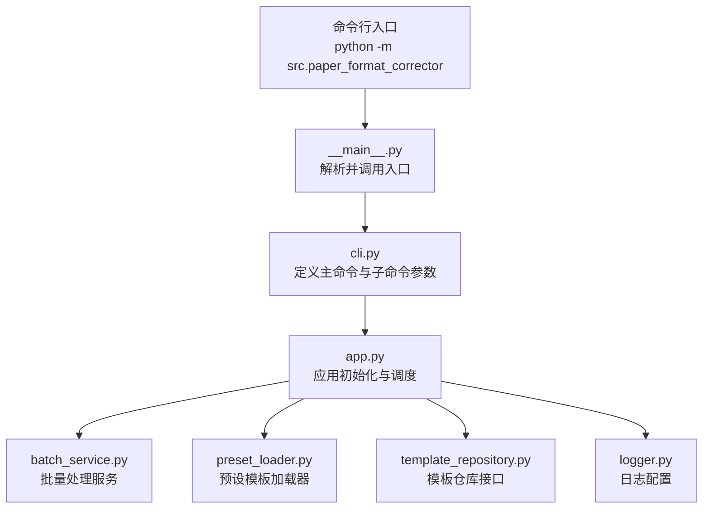
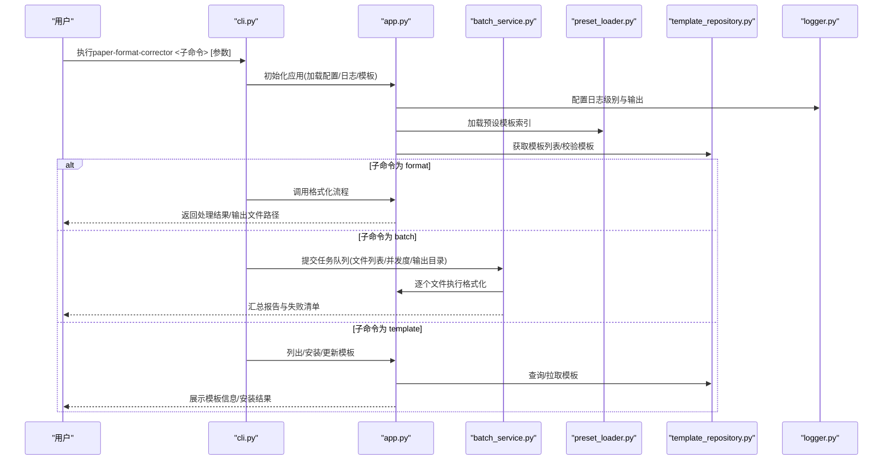
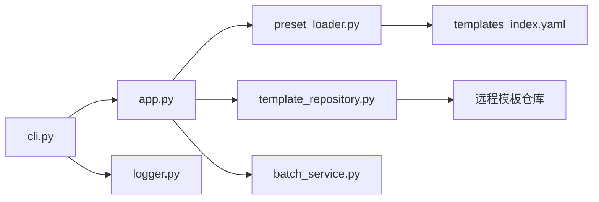

# CLI命令行工具

<cite>
**本文引用的文件**   
- [src/paper_format_corrector/cli.py](file://src/paper_format_corrector/cli.py)
- [src/paper_format_corrector/__main__.py](file://src/paper_format_corrector/__main__.py)
- [src/paper_format_corrector/app.py](file://src/paper_format_corrector/app.py)
- [src/paper_format_corrector/application/services/batch_service.py](file://src/paper_format_corrector/application/services/batch_service.py)
- [src/paper_format_corrector/infra/template_repository.py](file://src/paper_format_corrector/infra/template_repository.py)
- [src/paper_format_corrector/infra/preset_loader.py](file://src/paper_format_corrector/infra/preset_loader.py)
- [src/paper_format_corrector/infra/logger.py](file://src/paper_format_corrector/infra/logger.py)
- [config/config.yaml](file://config/config.yaml)
- [presets/templates_index.yaml](file://presets/templates_index.yaml)
- [examples/sample_template.yaml](file://examples/sample_template.yaml)
- [README.md](file://README.md)
</cite>

## 目录
1. [简介](#简介)
2. [项目结构](#项目结构)
3. [核心组件](#核心组件)
4. [架构总览](#架构总览)
5. [详细组件分析](#详细组件分析)
6. [依赖关系分析](#依赖关系分析)
7. [性能考虑](#性能考虑)
8. [故障排查指南](#故障排查指南)
9. [结论](#结论)
10. [附录](#附录)

## 简介
本章节面向使用 paper-format-corrector 命令行工具的用户，提供完整的使用说明。内容涵盖：
- 主命令与子命令（format、batch、template）的参数与用法
- 文件输入、格式选择、输出配置与批处理功能
- 配置文件与环境变量设置
- 错误处理、日志输出与性能监控选项
- 常见场景示例与自动化集成建议

## 项目结构
CLI入口位于包内，通过标准Python入口点注册可执行命令。核心CLI定义在cli模块中，应用启动逻辑在app模块中，__main__用于直接运行包。

**图示来源** 
- [src/paper_format_corrector/__main__.py](file://src/paper_format_corrector/__main__.py)
- [src/paper_format_corrector/cli.py](file://src/paper_format_corrector/cli.py)
- [src/paper_format_corrector/app.py](file://src/paper_format_corrector/app.py)
- [src/paper_format_corrector/application/services/batch_service.py](file://src/paper_format_corrector/application/services/batch_service.py)
- [src/paper_format_corrector/infra/preset_loader.py](file://src/paper_format_corrector/infra/preset_loader.py)
- [src/paper_format_corrector/infra/template_repository.py](file://src/paper_format_corrector/infra/template_repository.py)
- [src/paper_format_corrector/infra/logger.py](file://src/paper_format_corrector/infra/logger.py)

**章节来源**
- [src/paper_format_corrector/__main__.py](file://src/paper_format_corrector/__main__.py)
- [src/paper_format_corrector/cli.py](file://src/paper_format_corrector/cli.py)
- [src/paper_format_corrector/app.py](file://src/paper_format_corrector/app.py)

## 核心组件
- 命令行解析与路由：负责解析全局参数与子命令，将请求分发到对应处理器。
- 应用初始化：加载配置、初始化日志、准备模板与插件环境。
- 批量服务：支持多文件并行或串行处理，聚合结果与报告。
- 模板与预设：从本地与远程仓库加载模板，管理模板索引与版本。
- 日志系统：统一日志级别、输出目标与轮转策略。

**章节来源**
- [src/paper_format_corrector/cli.py](file://src/paper_format_corrector/cli.py)
- [src/paper_format_corrector/app.py](file://src/paper_format_corrector/app.py)
- [src/paper_format_corrector/application/services/batch_service.py](file://src/paper_format_corrector/application/services/batch_service.py)
- [src/paper_format_corrector/infra/preset_loader.py](file://src/paper_format_corrector/infra/preset_loader.py)
- [src/paper_format_corrector/infra/template_repository.py](file://src/paper_format_corrector/infra/template_repository.py)
- [src/paper_format_corrector/infra/logger.py](file://src/paper_format_corrector/infra/logger.py)

## 架构总览
下图展示了CLI命令到内部服务的调用路径，以及配置与模板的加载流程。

**图示来源** 
- [src/paper_format_corrector/cli.py](file://src/paper_format_corrector/cli.py)
- [src/paper_format_corrector/app.py](file://src/paper_format_corrector/app.py)
- [src/paper_format_corrector/application/services/batch_service.py](file://src/paper_format_corrector/application/services/batch_service.py)
- [src/paper_format_corrector/infra/preset_loader.py](file://src/paper_format_corrector/infra/preset_loader.py)
- [src/paper_format_corrector/infra/template_repository.py](file://src/paper_format_corrector/infra/template_repository.py)
- [src/paper_format_corrector/infra/logger.py](file://src/paper_format_corrector/infra/logger.py)

## 详细组件分析

### 全局参数与通用选项
- 常用全局开关
  - --verbose/-v：提高日志详细程度
  - --quiet/-q：降低日志输出
  - --log-level：指定日志级别（如DEBUG/INFO/WARNING/ERROR）
  - --log-file：指定日志文件路径
  - --config：指定配置文件路径（默认读取内置或工作目录下的config.yaml）
  - --version：显示版本号
  - --help/-h：显示帮助信息
- 行为控制
  - --dry-run：仅模拟执行，不写入文件
  - --force-overwrite：覆盖已有输出文件
  - --timeout：单个文档处理超时时间（秒）
  - --max-workers：批处理最大并发数
  - --output-dir：批量输出根目录
  - --report-format：生成报告格式（如json/text）

注意：以上参数以实际实现为准；若某参数未在当前版本暴露，请通过--help查看可用项。

**章节来源**
- [src/paper_format_corrector/cli.py](file://src/paper_format_corrector/cli.py)
- [config/config.yaml](file://config/config.yaml)

### 子命令：format（单次文档矫正）
- 用途：对单个Word文档进行格式矫正与规范化输出。
- 关键参数
  - --input/-i：输入文件路径（必填）
  - --output/-o：输出文件路径（可选；未指定时覆盖原文件或生成同名文件）
  - --preset：预设模板名称（如ieee、apa、chinese_thesis等）
  - --template/-t：自定义模板YAML路径（与--preset互斥）
  - --style：样式策略（如strict/relaxed）
  - --section-mode：章节识别模式（auto/manual）
  - --skip-validation：跳过模板校验（谨慎使用）
  - --overwrite：是否覆盖原文件
  - --timeout：处理超时
- 典型用法
  - 使用预设模板矫正并输出到新文件
  - 使用自定义模板矫正并保留原文件
  - 仅预览变更（dry-run）

**章节来源**
- [src/paper_format_corrector/cli.py](file://src/paper_format_corrector/cli.py)
- [src/paper_format_corrector/app.py](file://src/paper_format_corrector/app.py)

### 子命令：batch（批量处理）
- 用途：对多个文档进行批量格式化，支持并发与报告生成。
- 关键参数
  - --input-dir/-d：输入目录（递归扫描docx文件）
  - --pattern/-p：文件名匹配模式（如*.docx）
  - --output-dir/-o：输出根目录（保持相对路径结构）
  - --preset/--template：同format子命令
  - --max-workers/-w：并发工作线程数
  - --continue-on-error：遇到错误继续处理后续文件
  - --report-format：报告格式（json/text）
  - --report-file：报告输出路径
  - --exclude-patterns：排除的文件/目录模式
- 典型用法
  - 全目录批量矫正并生成JSON报告
  - 按模式筛选文件并限制并发
  - 失败重试与忽略错误

**章节来源**
- [src/paper_format_corrector/cli.py](file://src/paper_format_corrector/cli.py)
- [src/paper_format_corrector/application/services/batch_service.py](file://src/paper_format_corrector/application/services/batch_service.py)

### 子命令：template（模板管理）
- 用途：列出、安装、更新与管理模板。
- 关键参数
  - list：列出可用模板（本地/远程）
  - install：安装指定模板（名称或URL）
  - update：更新已安装模板
  - remove：移除模板
  - show：查看模板详情
  - validate：校验模板YAML语法与字段
  - --index：指定模板索引文件路径（默认使用内置索引）
  - --remote-url：指定远程模板仓库地址
- 典型用法
  - 列出所有可用模板
  - 安装特定机构模板
  - 校验自定义模板是否符合规范

**章节来源**
- [src/paper_format_corrector/cli.py](file://src/paper_format_corrector/cli.py)
- [src/paper_format_corrector/infra/template_repository.py](file://src/paper_format_corrector/infra/template_repository.py)
- [presets/templates_index.yaml](file://presets/templates_index.yaml)

### 配置文件与环境变量
- 配置文件
  - 位置：config/config.yaml（可通过--config指定）
  - 主要键值
    - logging：日志级别、输出目标、文件路径
    - templates：默认模板、索引路径、远程仓库URL
    - processing：默认并发数、超时、跳过校验开关
    - output：默认输出目录、覆盖策略
- 环境变量
  - PAPER_FORMAT_CONFIG：配置文件路径
  - PAPER_FORMAT_LOG_LEVEL：日志级别
  - PAPER_FORMAT_OUTPUT_DIR：默认输出目录
  - PAPER_FORMAT_TEMPLATE_INDEX：模板索引路径
  - PAPER_FORMAT_REMOTE_URL：远程模板仓库地址
- 优先级
  - 命令行参数 > 环境变量 > 配置文件 > 内置默认值

**章节来源**
- [config/config.yaml](file://config/config.yaml)
- [src/paper_format_corrector/app.py](file://src/paper_format_corrector/app.py)

### 错误处理与日志输出
- 错误分类
  - 参数错误：缺失必填参数、非法值
  - 文件错误：路径不存在、权限不足、格式不支持
  - 模板错误：模板缺失、校验失败、版本不兼容
  - 运行时错误：IO异常、解析异常、超时
- 日志输出
  - 控制台与文件双写
  - 结构化日志（含时间戳、级别、模块、消息）
  - 调试模式下记录关键步骤与耗时
- 诊断建议
  - 开启--log-level=DEBUG并指定--log-file
  - 使用--dry-run验证参数与模板
  - 检查模板索引与远程仓库连通性

**章节来源**
- [src/paper_format_corrector/infra/logger.py](file://src/paper_format_corrector/infra/logger.py)
- [src/paper_format_corrector/cli.py](file://src/paper_format_corrector/cli.py)

### 性能监控与优化
- 并发控制
  - 通过--max-workers调整批处理并发度
  - 合理设置避免I/O瓶颈与内存峰值
- 超时与重试
  - 为大型文档设置--timeout
  - 结合--continue-on-error提升鲁棒性
- 资源占用
  - 监控CPU与内存使用，必要时降低并发
  - 使用SSD存储以提升IO吞吐

[本节为通用指导，无需代码引用]

## 依赖关系分析
CLI层依赖应用初始化、模板与预设加载、日志与批处理服务。

**图示来源** 
- [src/paper_format_corrector/cli.py](file://src/paper_format_corrector/cli.py)
- [src/paper_format_corrector/app.py](file://src/paper_format_corrector/app.py)
- [src/paper_format_corrector/infra/preset_loader.py](file://src/paper_format_corrector/infra/preset_loader.py)
- [src/paper_format_corrector/infra/template_repository.py](file://src/paper_format_corrector/infra/template_repository.py)
- [src/paper_format_corrector/application/services/batch_service.py](file://src/paper_format_corrector/application/services/batch_service.py)
- [presets/templates_index.yaml](file://presets/templates_index.yaml)

**章节来源**
- [src/paper_format_corrector/cli.py](file://src/paper_format_corrector/cli.py)
- [src/paper_format_corrector/app.py](file://src/paper_format_corrector/app.py)
- [src/paper_format_corrector/infra/preset_loader.py](file://src/paper_format_corrector/infra/preset_loader.py)
- [src/paper_format_corrector/infra/template_repository.py](file://src/paper_format_corrector/infra/template_repository.py)
- [src/paper_format_corrector/application/services/batch_service.py](file://src/paper_format_corrector/application/services/batch_service.py)
- [presets/templates_index.yaml](file://presets/templates_index.yaml)

## 性能考虑
- 批处理并发度应与硬件能力匹配，避免过度并发导致抖动
- 大文档建议单独处理并设置合理超时
- 使用缓存机制减少重复模板解析开销（由内部实现决定）
- 输出目录建议使用高速磁盘以提升IO效率

[本节为通用指导，无需代码引用]

## 故障排查指南
- 常见问题
  - 找不到模板：检查--preset名称或--template路径是否正确；确认模板索引有效
  - 权限错误：确保对输入/输出目录有读写权限
  - 超时：增大--timeout或降低并发
  - 日志为空：检查--log-file路径与--log-level设置
- 定位方法
  - 使用--log-level=DEBUG并查看日志文件
  - 使用--dry-run验证参数与模板
  - 使用template validate校验自定义模板

**章节来源**
- [src/paper_format_corrector/infra/logger.py](file://src/paper_format_corrector/infra/logger.py)
- [src/paper_format_corrector/cli.py](file://src/paper_format_corrector/cli.py)

## 结论
paper-format-corrector CLI提供了完整的文档格式矫正能力，支持单次与批量处理、模板管理与丰富的配置选项。通过合理的参数与环境变量设置，可实现高效稳定的自动化流程。

[本节为总结，无需代码引用]

## 附录

### 常见场景示例
- 单次文档矫正
  - 使用预设模板矫正并输出到新文件
  - 使用自定义模板矫正并保留原文件
  - 仅预览变更（dry-run）
- 批量处理
  - 全目录批量矫正并生成JSON报告
  - 按模式筛选文件并限制并发
  - 失败重试与忽略错误
- 模板管理
  - 列出所有可用模板
  - 安装特定机构模板
  - 校验自定义模板是否符合规范

提示：具体参数请以各子命令的--help输出为准。

**章节来源**
- [src/paper_format_corrector/cli.py](file://src/paper_format_corrector/cli.py)
- [examples/sample_template.yaml](file://examples/sample_template.yaml)

### 批处理脚本编写指南与自动化集成
- 脚本要点
  - 使用--input-dir与--pattern限定范围
  - 设置--max-workers与--timeout平衡性能与稳定性
  - 输出JSON报告便于后续审计与告警
- CI/CD集成
  - 在流水线中执行batch命令，失败则阻断构建
  - 将报告与产物作为工件上传
- 定时任务
  - 使用系统计划任务定期扫描目录并处理新文档

[本节为通用指导，无需代码引用]

### 参考与扩展
- README与用户指南：了解项目背景与总体能力
- 示例模板：参考sample_template.yaml结构与字段

**章节来源**
- [README.md](file://README.md)
- [examples/sample_template.yaml](file://examples/sample_template.yaml)