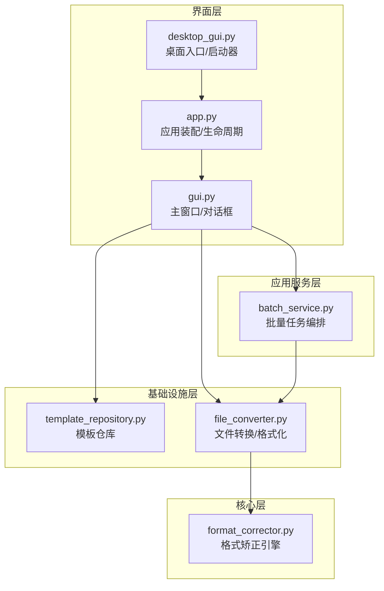
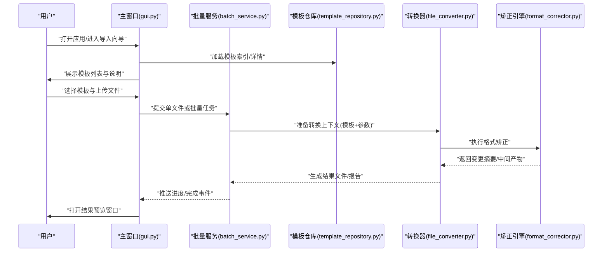
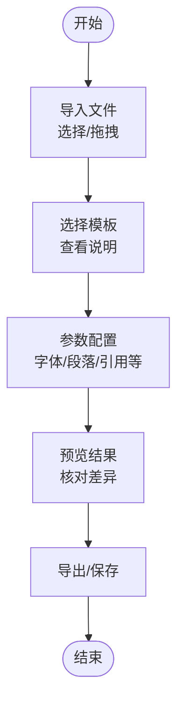
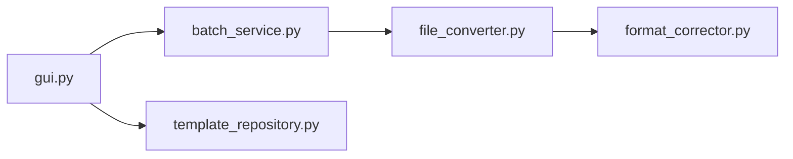

# GUI图形界面

<cite>
**本文引用的文件**   
- [src/paper_format_corrector/gui.py](file://src/paper_format_corrector/gui.py)
- [src/paper_format_corrector/desktop_gui.py](file://src/paper_format_corrector/desktop_gui.py)
- [src/paper_format_corrector/app.py](file://src/paper_format_corrector/app.py)
- [src/paper_format_corrector/cli.py](file://src/paper_format_corrector/cli.py)
- [src/paper_format_corrector/core/format_corrector.py](file://src/paper_format_corrector/core/format_corrector.py)
- [src/paper_format_corrector/infrastructure/converters/file_converter.py](file://src/paper_format_corrector/infrastructure/converters/file_converter.py)
- [src/paper_format_corrector/application/services/batch_service.py](file://src/paper_format_corrector/application/services/batch_service.py)
- [src/paper_format_corrector/infra/template_repository.py](file://src/paper_format_corrector/infra/template_repository.py)
- [presets/templates_index.yaml](file://presets/templates_index.yaml)
- [config/config.yaml](file://config/config.yaml)
- [README.md](file://README.md)
</cite>

## 目录
1. [简介](#简介)
2. [项目结构](#项目结构)
3. [核心组件](#核心组件)
4. [架构总览](#架构总览)
5. [详细组件分析](#详细组件分析)
6. [依赖关系分析](#依赖关系分析)
7. [性能与体验优化建议](#性能与体验优化建议)
8. [故障排除指南](#故障排除指南)
9. [结论](#结论)
10. [附录：常见问题解答](#附录：常见问题解答)

## 简介
本使用文档面向桌面端GUI用户，系统介绍论文格式矫正工具的图形界面功能与操作流程。内容覆盖从文档导入、模板选择、参数配置到结果预览的完整流程；解释字体、段落、引用样式等关键配置项的作用与影响；提供批量处理界面的使用方法（多文件选择与进度监控）；并包含界面自定义与主题设置说明、常见问题与故障排除指导。

## 项目结构
本项目采用分层架构，GUI层负责用户交互与状态管理，应用服务层编排业务逻辑，基础设施层提供模板仓库、转换与导出能力，核心层实现格式矫正算法。

图表来源
- [src/paper_format_corrector/gui.py](file://src/paper_format_corrector/gui.py)
- [src/paper_format_corrector/desktop_gui.py](file://src/paper_format_corrector/desktop_gui.py)
- [src/paper_format_corrector/app.py](file://src/paper_format_corrector/app.py)
- [src/paper_format_corrector/application/services/batch_service.py](file://src/paper_format_corrector/application/services/batch_service.py)
- [src/paper_format_corrector/infra/template_repository.py](file://src/paper_format_corrector/infra/template_repository.py)
- [src/paper_format_corrector/infrastructure/converters/file_converter.py](file://src/paper_format_corrector/infrastructure/converters/file_converter.py)
- [src/paper_format_corrector/core/format_corrector.py](file://src/paper_format_corrector/core/format_corrector.py)

章节来源
- [README.md](file://README.md)
- [src/paper_format_corrector/app.py](file://src/paper_format_corrector/app.py)
- [src/paper_format_corrector/desktop_gui.py](file://src/paper_format_corrector/desktop_gui.py)
- [src/paper_format_corrector/gui.py](file://src/paper_format_corrector/gui.py)

## 核心组件
- 主窗口与向导：提供“文件导入向导”“模板选择”“参数配置面板”“结果预览窗口”四大模块，贯穿从上传到完成的全流程。
- 批量处理：支持多文件选择、队列化执行、实时进度与结果汇总。
- 模板仓库：加载预设模板索引与具体模板定义，驱动格式规则与样式。
- 转换与矫正：将模板与参数转换为具体的文档修改操作，输出标准化结果。

章节来源
- [src/paper_format_corrector/gui.py](file://src/paper_format_corrector/gui.py)
- [src/paper_format_corrector/application/services/batch_service.py](file://src/paper_format_corrector/application/services/batch_service.py)
- [src/paper_format_corrector/infra/template_repository.py](file://src/paper_format_corrector/infra/template_repository.py)
- [src/paper_format_corrector/infrastructure/converters/file_converter.py](file://src/paper_format_corrector/infrastructure/converters/file_converter.py)
- [src/paper_format_corrector/core/format_corrector.py](file://src/paper_format_corrector/core/format_corrector.py)

## 架构总览
下图展示GUI端到端的调用链路与数据流向：用户通过界面触发导入与配置，应用服务协调模板与转换器，核心引擎执行格式矫正，最终生成可预览或导出的结果。

图表来源
- [src/paper_format_corrector/gui.py](file://src/paper_format_corrector/gui.py)
- [src/paper_format_corrector/application/services/batch_service.py](file://src/paper_format_corrector/application/services/batch_service.py)
- [src/paper_format_corrector/infra/template_repository.py](file://src/paper_format_corrector/infra/template_repository.py)
- [src/paper_format_corrector/infrastructure/converters/file_converter.py](file://src/paper_format_corrector/infrastructure/converters/file_converter.py)
- [src/paper_format_corrector/core/format_corrector.py](file://src/paper_format_corrector/core/format_corrector.py)

## 详细组件分析

### 文件导入向导
- 功能要点
  - 支持拖拽或浏览选择单个/多个文档文件。
  - 自动识别文件格式并进行基础校验（如扩展名、可读性）。
  - 对大文件进行异步读取提示，避免界面卡顿。
- 用户操作
  - 点击“选择文件”，在弹窗中勾选目标文件后确认。
  - 支持多选与清空列表；重复文件将被去重。
  - 导入成功后显示文件清单与基本信息（文件名、大小、类型）。
- 注意事项
  - 若文件过大或路径含特殊字符，可能触发安全限制或解析失败，需调整路径或拆分文件。

章节来源
- [src/paper_format_corrector/gui.py](file://src/paper_format_corrector/gui.py)

### 格式模板选择
- 功能要点
  - 基于模板索引快速筛选与搜索，展示模板名称、适用场景与版本信息。
  - 支持本地与远程模板同步（由模板仓库负责）。
- 用户操作
  - 在模板列表中点击某模板查看说明与示例。
  - 确认后进入参数配置阶段。
- 配置项概览
  - 语言与地区：影响日期、编号、引文排序等默认行为。
  - 页面布局：页边距、纸张尺寸、分栏等。
  - 元数据：标题、作者、机构、关键词等。

章节来源
- [src/paper_format_corrector/infra/template_repository.py](file://src/paper_format_corrector/infra/template_repository.py)
- [presets/templates_index.yaml](file://presets/templates_index.yaml)

### 参数配置面板
- 功能要点
  - 以分组形式呈现各类格式选项，便于定位与调整。
  - 提供“恢复默认”“重置为模板默认”等操作。
- 关键配置项
  - 字体设置
    - 正文字体、字号、行距、段前段后间距。
    - 中英文混排时的字体回退策略。
  - 段落格式
    - 对齐方式、首行缩进、悬挂缩进、段内换行控制。
  - 引用样式
    - 引文风格（如APA、GB/T 7714等）、脚注/尾注位置与编号规则。
  - 图表与表格
    - 题注格式、编号规则、跨页断行、边框与对齐。
  - 封面与目录
    - 封面元素开关、目录层级与样式、自动生成范围。
- 影响说明
  - 字体与段落直接影响正文排版与打印效果。
  - 引用样式决定参考文献列表与文中上标/括号格式。
  - 图表与目录相关设置会影响后续自动生成的准确性。

章节来源
- [src/paper_format_corrector/gui.py](file://src/paper_format_corrector/gui.py)
- [config/config.yaml](file://config/config.yaml)

### 结果预览窗口
- 功能要点
  - 在应用内渲染文档片段或整篇预览，支持缩放与跳转。
  - 高亮显示被修改的区域，便于核对差异。
- 用户操作
  - 点击“预览”按钮打开新窗口。
  - 支持导出为PDF或保存为docx。
- 注意事项
  - 复杂公式或图片较多时，首次预览可能较慢，请耐心等待。

章节来源
- [src/paper_format_corrector/gui.py](file://src/paper_format_corrector/gui.py)

### 批量处理界面
- 功能要点
  - 支持多文件队列、并发控制、暂停/继续、取消任务。
  - 实时进度条、成功/失败统计与错误日志链接。
- 用户操作
  - 在导入向导中选择多个文件后，点击“批量处理”。
  - 在批量面板中查看每个文件的处理状态与结果。
- 异常处理
  - 单个文件失败不影响其他文件；失败原因可在日志中查看。
  - 支持重试与跳过错误文件继续处理。

章节来源
- [src/paper_format_corrector/application/services/batch_service.py](file://src/paper_format_corrector/application/services/batch_service.py)
- [src/paper_format_corrector/gui.py](file://src/paper_format_corrector/gui.py)

### 界面自定义与主题设置
- 主题切换
  - 支持浅色/深色主题切换，部分控件跟随系统主题。
- 字体与字号
  - 可全局调整界面字体与字号，提升可读性。
- 布局与快捷键
  - 支持停靠面板、工具栏显隐与常用操作快捷键。
- 持久化
  - 设置保存在本地配置文件，重启后生效。

章节来源
- [src/paper_format_corrector/gui.py](file://src/paper_format_corrector/gui.py)
- [config/config.yaml](file://config/config.yaml)

### 端到端操作流程（从上传到完成）

[本图为概念流程图，不直接映射具体源码文件]

## 依赖关系分析
- 组件耦合
  - GUI依赖批量服务与模板仓库，间接依赖转换器与矫正引擎。
  - 批量服务聚合多个转换任务，统一调度与上报进度。
- 外部依赖
  - 模板索引与定义来自预设目录与远程仓库。
  - 转换过程依赖底层文档库（如docx）进行读写与样式应用。

图表来源
- [src/paper_format_corrector/gui.py](file://src/paper_format_corrector/gui.py)
- [src/paper_format_corrector/application/services/batch_service.py](file://src/paper_format_corrector/application/services/batch_service.py)
- [src/paper_format_corrector/infra/template_repository.py](file://src/paper_format_corrector/infra/template_repository.py)
- [src/paper_format_corrector/infrastructure/converters/file_converter.py](file://src/paper_format_corrector/infrastructure/converters/file_converter.py)
- [src/paper_format_corrector/core/format_corrector.py](file://src/paper_format_corrector/core/format_corrector.py)

章节来源
- [src/paper_format_corrector/gui.py](file://src/paper_format_corrector/gui.py)
- [src/paper_format_corrector/application/services/batch_service.py](file://src/paper_format_corrector/application/services/batch_service.py)
- [src/paper_format_corrector/infra/template_repository.py](file://src/paper_format_corrector/infra/template_repository.py)
- [src/paper_format_corrector/infrastructure/converters/file_converter.py](file://src/paper_format_corrector/infrastructure/converters/file_converter.py)
- [src/paper_format_corrector/core/format_corrector.py](file://src/paper_format_corrector/core/format_corrector.py)

## 性能与体验优化建议
- 大文件处理
  - 启用分页预览与懒加载，减少内存占用。
  - 批量任务设置合理并发度，避免I/O争用。
- 模板与资源
  - 预缓存常用模板与字体资源，缩短首次加载时间。
- 界面响应
  - 耗时操作放入后台线程，及时更新进度与状态。
- 导出优化
  - 按需导出（仅导出变更区域），减少生成时间。

[本节为通用建议，不直接分析具体文件]

## 故障排除指南
- 无法导入文件
  - 检查文件扩展名与权限；确保路径不含非法字符。
  - 若文件损坏或加密，请先修复或解密。
- 模板未显示或加载失败
  - 确认模板索引存在且可读；必要时重新同步远程模板。
- 预览空白或错位
  - 检查字体是否安装；尝试切换主题或重置界面设置。
- 批量任务卡住
  - 降低并发数；查看失败日志并单独重试对应文件。
- 导出失败
  - 检查磁盘空间与目标路径权限；关闭占用该文件的其它程序。

章节来源
- [src/paper_format_corrector/gui.py](file://src/paper_format_corrector/gui.py)
- [src/paper_format_corrector/application/services/batch_service.py](file://src/paper_format_corrector/application/services/batch_service.py)
- [src/paper_format_corrector/infra/template_repository.py](file://src/paper_format_corrector/infra/template_repository.py)

## 结论
本GUI通过清晰的向导式流程与丰富的配置选项，帮助用户高效完成论文格式矫正。结合批量处理能力与结果预览，既满足个人用户也适用于团队协作场景。建议根据实际模板与规范持续完善配置项，以获得更稳定的排版效果。

[本节为总结性内容，不直接分析具体文件]

## 附录：常见问题解答
- Q：如何切换引用样式？
  - A：在“参数配置面板”的“引用样式”分组中选择目标风格，确认后预览并导出。
- Q：批量处理能否中途暂停？
  - A：可以。在批量面板中点击“暂停”，恢复后将继续执行剩余任务。
- Q：如何恢复界面默认设置？
  - A：在“界面自定义”中点击“恢复默认”，或删除本地配置文件后重启应用。
- Q：为什么某些图表题注未正确编号？
  - A：请检查“图表与表格”中的编号规则与题注样式，并确保文档中已插入相应对象。
- Q：如何添加自定义模板？
  - A：将模板文件放入预设目录或通过远程仓库同步，刷新模板索引后即可选择。

[本节为通用问答，不直接分析具体文件]