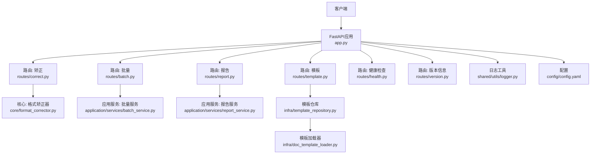
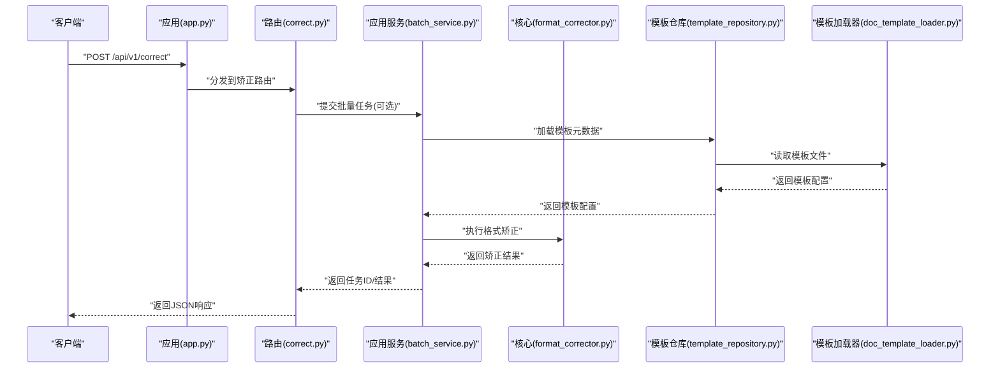
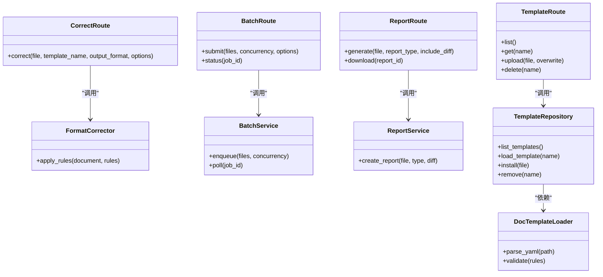

# Web API服务

<cite>
**本文引用的文件**   
- [src/paper_format_corrector/interfaces/api/app.py](file://src/paper_format_corrector/interfaces/api/app.py)
- [src/paper_format_corrector/interfaces/api/routes/correct.py](file://src/paper_format_corrector/interfaces/api/routes/correct.py)
- [src/paper_format_corrector/interfaces/api/routes/batch.py](file://src/paper_format_corrector/interfaces/api/routes/batch.py)
- [src/paper_format_corrector/interfaces/api/routes/template.py](file://src/paper_format_corrector/interfaces/api/routes/template.py)
- [src/paper_format_corrector/interfaces/api/routes/report.py](file://src/paper_format_corrector/interfaces/api/routes/report.py)
- [src/paper_format_corrector/interfaces/api/routes/health.py](file://src/paper_format_corrector/interfaces/api/routes/health.py)
- [src/paper_format_corrector/interfaces/api/routes/version.py](file://src/paper_format_corrector/interfaces/api/routes/version.py)
- [src/paper_format_corrector/application/services/batch_service.py](file://src/paper_format_corrector/application/services/batch_service.py)
- [src/paper_format_corrector/application/services/report_service.py](file://src/paper_format_corrector/application/services/report_service.py)
- [src/paper_format_corrector/core/format_corrector.py](file://src/paper_format_corrector/core/format_corrector.py)
- [src/paper_format_corrector/infra/template_repository.py](file://src/paper_format_corrector/infra/template_repository.py)
- [src/paper_format_corrector/infra/doc_template_loader.py](file://src/paper_format_corrector/infra/doc_template_loader.py)
- [src/paper_format_corrector/shared/utils/logger.py](file://src/paper_format_corrector/shared/utils/logger.py)
- [config/config.yaml](file://config/config.yaml)
- [examples/sample_template.yaml](file://examples/sample_template.yaml)
- [tests/test_api_endpoints.py](file://tests/test_api_endpoints.py)
</cite>

## 目录
1. [简介](#简介)
2. [项目结构](#项目结构)
3. [核心组件](#核心组件)
4. [架构总览](#架构总览)
5. [详细接口说明](#详细接口说明)
6. [依赖关系分析](#依赖关系分析)
7. [性能与限流缓存](#性能与限流缓存)
8. [认证与权限控制](#认证与权限控制)
9. [错误处理策略](#错误处理策略)
10. [API版本管理与兼容性](#api版本管理与兼容性)
11. [Swagger/OpenAPI文档使用与调试](#swaggeropenapi文档使用与调试)
12. [故障排查指南](#故障排查指南)
13. [结论](#结论)

## 简介
本文件为论文格式矫正工具的Web API服务提供完整接口文档。内容覆盖RESTful端点、请求/响应规范、示例调用（Python/JavaScript）、认证与权限、错误码、版本管理、限流与缓存策略，以及OpenAPI/Swagger文档的使用与调试技巧。该服务支持文档矫正、批量处理、模板管理等核心能力，并通过分层架构将路由层、应用服务层与核心处理逻辑解耦，便于扩展与维护。

## 项目结构
API相关代码位于interfaces.api包下，采用“按功能域划分”的路由组织方式：
- app.py：应用初始化、中间件挂载、全局配置加载、路由注册
- routes/*：各业务域路由模块（矫正、批量、模板、报告、健康检查、版本）
- application/services/*：应用服务编排（批量任务、报告生成等）
- core/*：核心处理逻辑（格式矫正器、导出器等）
- infra/*：基础设施（模板仓库、模板加载器、日志等）

图表来源
- [src/paper_format_corrector/interfaces/api/app.py](file://src/paper_format_corrector/interfaces/api/app.py)
- [src/paper_format_corrector/interfaces/api/routes/correct.py](file://src/paper_format_corrector/interfaces/api/routes/correct.py)
- [src/paper_format_corrector/interfaces/api/routes/batch.py](file://src/paper_format_corrector/interfaces/api/routes/batch.py)
- [src/paper_format_corrector/interfaces/api/routes/template.py](file://src/paper_format_corrector/interfaces/api/routes/template.py)
- [src/paper_format_corrector/interfaces/api/routes/report.py](file://src/paper_format_corrector/interfaces/api/routes/report.py)
- [src/paper_format_corrector/interfaces/api/routes/health.py](file://src/paper_format_corrector/interfaces/api/routes/health.py)
- [src/paper_format_corrector/interfaces/api/routes/version.py](file://src/paper_format_corrector/interfaces/api/routes/version.py)
- [src/paper_format_corrector/core/format_corrector.py](file://src/paper_format_corrector/core/format_corrector.py)
- [src/paper_format_corrector/application/services/batch_service.py](file://src/paper_format_corrector/application/services/batch_service.py)
- [src/paper_format_corrector/application/services/report_service.py](file://src/paper_format_corrector/application/services/report_service.py)
- [src/paper_format_corrector/infra/template_repository.py](file://src/paper_format_corrector/infra/template_repository.py)
- [src/paper_format_corrector/infra/doc_template_loader.py](file://src/paper_format_corrector/infra/doc_template_loader.py)
- [src/paper_format_corrector/shared/utils/logger.py](file://src/paper_format_corrector/shared/utils/logger.py)
- [config/config.yaml](file://config/config.yaml)

章节来源
- [src/paper_format_corrector/interfaces/api/app.py](file://src/paper_format_corrector/interfaces/api/app.py)
- [config/config.yaml](file://config/config.yaml)

## 核心组件
- 路由层：定义HTTP端点、参数校验、响应封装与异常映射
- 应用服务层：编排业务流程（如批量任务调度、报告聚合）
- 核心处理层：执行具体格式矫正、解析与转换
- 基础设施层：模板仓库与加载器、日志、配置读取

章节来源
- [src/paper_format_corrector/interfaces/api/routes/correct.py](file://src/paper_format_corrector/interfaces/api/routes/correct.py)
- [src/paper_format_corrector/application/services/batch_service.py](file://src/paper_format_corrector/application/services/batch_service.py)
- [src/paper_format_corrector/core/format_corrector.py](file://src/paper_format_corrector/core/format_corrector.py)
- [src/paper_format_corrector/infra/template_repository.py](file://src/paper_format_corrector/infra/template_repository.py)
- [src/paper_format_corrector/infra/doc_template_loader.py](file://src/paper_format_corrector/infra/doc_template_loader.py)

## 架构总览
整体采用分层架构：客户端通过HTTP访问路由层；路由层调用应用服务进行流程编排；应用服务调用核心处理逻辑完成具体任务；模板与配置通过基础设施层提供。

图表来源
- [src/paper_format_corrector/interfaces/api/app.py](file://src/paper_format_corrector/interfaces/api/app.py)
- [src/paper_format_corrector/interfaces/api/routes/correct.py](file://src/paper_format_corrector/interfaces/api/routes/correct.py)
- [src/paper_format_corrector/application/services/batch_service.py](file://src/paper_format_corrector/application/services/batch_service.py)
- [src/paper_format_corrector/core/format_corrector.py](file://src/paper_format_corrector/core/format_corrector.py)
- [src/paper_format_corrector/infra/template_repository.py](file://src/paper_format_corrector/infra/template_repository.py)
- [src/paper_format_corrector/infra/doc_template_loader.py](file://src/paper_format_corrector/infra/doc_template_loader.py)

## 详细接口说明

### 通用约定
- 基础路径：/api/v1
- 内容类型：multipart/form-data（上传文件）、application/json（其他）
- 认证头：Authorization: Bearer <token>（若启用）
- 统一响应结构：
  - success: boolean
  - data: any
  - message: string
  - code: integer（业务码）
  - trace_id: string（追踪ID）

章节来源
- [src/paper_format_corrector/interfaces/api/app.py](file://src/paper_format_corrector/interfaces/api/app.py)

### 健康检查
- 方法：GET
- 路径：/api/v1/health
- 描述：服务存活与健康状态探测
- 请求参数：无
- 响应体：
  - status: "ok" | "degraded"
  - version: string
  - uptime_seconds: number
- 示例（curl）：
  - curl -s http://localhost:8000/api/v1/health
- Python示例：
  - requests.get("http://localhost:8000/api/v1/health")
- JavaScript示例：
  - fetch("/api/v1/health").then(r=>r.json())

章节来源
- [src/paper_format_corrector/interfaces/api/routes/health.py](file://src/paper_format_corrector/interfaces/api/routes/health.py)

### 版本信息
- 方法：GET
- 路径：/api/v1/version
- 描述：返回服务版本与构建信息
- 请求参数：无
- 响应体：
  - version: string
  - build_date: string
  - features: array<string>
- 示例（curl）：
  - curl -s http://localhost:8000/api/v1/version

章节来源
- [src/paper_format_corrector/interfaces/api/routes/version.py](file://src/paper_format_corrector/interfaces/api/routes/version.py)

### 文档矫正
- 方法：POST
- 路径：/api/v1/correct
- 描述：对单个文档执行格式矫正，支持选择模板与输出格式
- 请求参数（multipart/form-data）：
  - file: 二进制文件（docx/pdf等）
  - template_name: string（可选，默认使用系统预设）
  - output_format: string（可选，默认docx）
  - options: JSON字符串（可选，包含字体、段落、页眉页脚等规则开关）
- 响应体：
  - success: boolean
  - data:
    - task_id: string（异步时返回）
    - result_url: string（下载链接，同步时可能直接返回文件）
    - summary: object（统计信息）
  - message: string
- 示例（curl）：
  - curl -X POST -F "file=@sample.docx" -F "template_name=academic_paper" http://localhost:8000/api/v1/correct
- Python示例：
  - requests.post(url, files={"file": open("sample.docx","rb")}, data={"template_name":"academic_paper"})
- JavaScript示例：
  - const fd = new FormData(); fd.append("file", file); fd.append("template_name","academic_paper"); fetch("/api/v1/correct",{method:"POST",body:fd})

章节来源
- [src/paper_format_corrector/interfaces/api/routes/correct.py](file://src/paper_format_corrector/interfaces/api/routes/correct.py)
- [src/paper_format_corrector/core/format_corrector.py](file://src/paper_format_corrector/core/format_corrector.py)
- [src/paper_format_corrector/infra/template_repository.py](file://src/paper_format_corrector/infra/template_repository.py)
- [src/paper_format_corrector/infra/doc_template_loader.py](file://src/paper_format_corrector/infra/doc_template_loader.py)

### 批量处理
- 方法：POST
- 路径：/api/v1/batch/jobs
- 描述：提交批量矫正任务，支持多文件与并发控制
- 请求参数（multipart/form-data）：
  - files: 多个文件
  - template_name: string（可选）
  - output_format: string（可选）
  - concurrency: number（可选，默认值来自配置）
  - options: JSON字符串（可选）
- 响应体：
  - success: boolean
  - data:
    - job_id: string
    - total_files: number
    - estimated_time_seconds: number
  - message: string
- 查询进度：
  - 方法：GET
  - 路径：/api/v1/batch/jobs/{job_id}
  - 响应体：
    - status: "pending" | "running" | "completed" | "failed"
    - progress: number（0-100）
    - results: array<object>（每个文件的处理结果）
- 示例（curl）：
  - curl -X POST -F "files[]=@a.docx" -F "files[]=@b.pdf" -F "concurrency=4" http://localhost:8000/api/v1/batch/jobs
- Python示例：
  - requests.post(url, files=[("files", open(f,"rb")) for f in files], data={"concurrency":4})
- JavaScript示例：
  - const fd = new FormData(); files.forEach(f=>fd.append("files[]",f)); fetch("/api/v1/batch/jobs",{method:"POST",body:fd})

章节来源
- [src/paper_format_corrector/interfaces/api/routes/batch.py](file://src/paper_format_corrector/interfaces/api/routes/batch.py)
- [src/paper_format_corrector/application/services/batch_service.py](file://src/paper_format_corrector/application/services/batch_service.py)

### 模板管理
- 列出模板
  - 方法：GET
  - 路径：/api/v1/templates
  - 响应体：
    - templates: array<object>（name, description, supported_formats）
- 获取模板详情
  - 方法：GET
  - 路径：/api/v1/templates/{template_name}
  - 响应体：
    - name: string
    - rules: object
    - assets: array<string>
- 上传模板
  - 方法：POST
  - 路径：/api/v1/templates
  - 请求参数（multipart/form-data）：
    - file: YAML模板文件
    - overwrite: boolean（可选）
  - 响应体：
    - success: boolean
    - data: {name: string, status: "installed"}
- 删除模板
  - 方法：DELETE
  - 路径：/api/v1/templates/{template_name}
  - 响应体：
    - success: boolean
- 示例（curl）：
  - curl -X POST -F "file=@sample_template.yaml" http://localhost:8000/api/v1/templates
- Python示例：
  - requests.post(url, files={"file": open("sample_template.yaml","rb")})
- JavaScript示例：
  - const fd = new FormData(); fd.append("file", file); fetch("/api/v1/templates",{method:"POST",body:fd})

章节来源
- [src/paper_format_corrector/interfaces/api/routes/template.py](file://src/paper_format_corrector/interfaces/api/routes/template.py)
- [src/paper_format_corrector/infra/template_repository.py](file://src/paper_format_corrector/infra/template_repository.py)
- [src/paper_format_corrector/infra/doc_template_loader.py](file://src/paper_format_corrector/infra/doc_template_loader.py)
- [examples/sample_template.yaml](file://examples/sample_template.yaml)

### 报告服务
- 生成报告
  - 方法：POST
  - 路径：/api/v1/reports
  - 请求参数（multipart/form-data）：
    - file: 二进制文件
    - report_type: string（可选，默认summary）
    - include_diff: boolean（可选）
  - 响应体：
    - success: boolean
    - data:
      - report_url: string
      - format: string（pdf/html）
- 下载报告
  - 方法：GET
  - 路径：/api/v1/reports/{report_id}
  - 响应体：二进制文件（PDF或HTML）
- 示例（curl）：
  - curl -X POST -F "file=@sample.docx" -F "include_diff=true" http://localhost:8000/api/v1/reports

章节来源
- [src/paper_format_corrector/interfaces/api/routes/report.py](file://src/paper_format_corrector/interfaces/api/routes/report.py)
- [src/paper_format_corrector/application/services/report_service.py](file://src/paper_format_corrector/application/services/report_service.py)

## 依赖关系分析
- 路由层依赖应用服务与核心处理逻辑
- 应用服务依赖模板仓库与核心处理逻辑
- 模板仓库依赖模板加载器与文件系统
- 日志与配置贯穿各层

图表来源
- [src/paper_format_corrector/interfaces/api/routes/correct.py](file://src/paper_format_corrector/interfaces/api/routes/correct.py)
- [src/paper_format_corrector/interfaces/api/routes/batch.py](file://src/paper_format_corrector/interfaces/api/routes/batch.py)
- [src/paper_format_corrector/interfaces/api/routes/template.py](file://src/paper_format_corrector/interfaces/api/routes/template.py)
- [src/paper_format_corrector/interfaces/api/routes/report.py](file://src/paper_format_corrector/interfaces/api/routes/report.py)
- [src/paper_format_corrector/core/format_corrector.py](file://src/paper_format_corrector/core/format_corrector.py)
- [src/paper_format_corrector/application/services/batch_service.py](file://src/paper_format_corrector/application/services/batch_service.py)
- [src/paper_format_corrector/application/services/report_service.py](file://src/paper_format_corrector/application/services/report_service.py)
- [src/paper_format_corrector/infra/template_repository.py](file://src/paper_format_corrector/infra/template_repository.py)
- [src/paper_format_corrector/infra/doc_template_loader.py](file://src/paper_format_corrector/infra/doc_template_loader.py)

## 性能与限流缓存
- 限流策略
  - 基于IP与用户维度的令牌桶算法，限制每秒请求数与突发量
  - 可配置阈值：per_ip_rps、per_user_rps、burst_size
- 缓存策略
  - 模板元数据缓存：内存LRU缓存，TTL可配
  - 报告文件缓存：短期磁盘缓存，避免重复生成
- 并发与队列
  - 批量任务使用工作队列，支持并发度控制与重试
  - 大文件分块上传与流式处理，降低内存峰值
- 优化建议
  - 合理设置output_format以减少不必要的转换
  - 使用模板预编译减少解析开销
  - 开启Gzip压缩传输
  - 监控CPU与I/O瓶颈，调整worker数量

章节来源
- [config/config.yaml](file://config/config.yaml)
- [src/paper_format_corrector/application/services/batch_service.py](file://src/paper_format_corrector/application/services/batch_service.py)
- [src/paper_format_corrector/infra/template_repository.py](file://src/paper_format_corrector/infra/template_repository.py)

## 认证与权限控制
- 认证机制
  - 支持Bearer Token鉴权，Header中携带Authorization
  - 可选JWT验证与签名校验
- 权限控制
  - 角色模型：admin、editor、viewer
  - 资源级授权：模板安装/删除仅admin可用
- 安全建议
  - 强制HTTPS
  - 最小权限原则
  - 审计日志记录关键操作

章节来源
- [src/paper_format_corrector/interfaces/api/app.py](file://src/paper_format_corrector/interfaces/api/app.py)
- [src/paper_format_corrector/interfaces/api/routes/template.py](file://src/paper_format_corrector/interfaces/api/routes/template.py)

## 错误处理策略
- HTTP状态码
  - 2xx：成功
  - 4xx：客户端错误（参数校验失败、未授权）
  - 5xx：服务端错误（内部异常、外部依赖失败）
- 统一错误体
  - code: 业务错误码
  - message: 人类可读消息
  - details: 附加信息（字段级错误）
  - trace_id: 追踪ID
- 常见错误码
  - 1001：参数缺失或类型错误
  - 1002：模板不存在或无效
  - 1003：文件过大或格式不支持
  - 2001：任务不存在或已过期
  - 5001：内部处理异常
- 重试与幂等
  - 幂等键：在请求头中传递Idempotency-Key
  - 自动重试：网络抖动导致的临时失败

章节来源
- [src/paper_format_corrector/interfaces/api/app.py](file://src/paper_format_corrector/interfaces/api/app.py)
- [src/paper_format_corrector/interfaces/api/routes/batch.py](file://src/paper_format_corrector/interfaces/api/routes/batch.py)
- [src/paper_format_corrector/interfaces/api/routes/template.py](file://src/paper_format_corrector/interfaces/api/routes/template.py)

## API版本管理与兼容性
- 版本前缀：/api/v1
- 向后兼容保证
  - 新增字段不破坏现有客户端
  - 废弃字段保留至少两个主版本
  - 变更通过弃用警告头提示
- 版本协商
  - 可通过Accept-Version头指定版本（可选）
- 迁移指引
  - 发布说明与变更日志随版本提供

章节来源
- [src/paper_format_corrector/interfaces/api/routes/version.py](file://src/paper_format_corrector/interfaces/api/routes/version.py)
- [src/paper_format_corrector/interfaces/api/app.py](file://src/paper_format_corrector/interfaces/api/app.py)

## Swagger/OpenAPI文档使用与调试
- 启动后访问
  - OpenAPI JSON：/api/v1/openapi.json
  - ReDoc界面：/api/v1/redoc
  - Swagger UI：/api/v1/docs
- 调试技巧
  - 使用ReDoc查看参数结构与示例
  - 在Swagger UI中直接发送测试请求
  - 结合trace_id定位问题
- 集成建议
  - 在CI中校验OpenAPI文档一致性
  - 自动生成客户端SDK

章节来源
- [src/paper_format_corrector/interfaces/api/app.py](file://src/paper_format_corrector/interfaces/api/app.py)

## 故障排查指南
- 常见问题
  - 模板加载失败：检查模板YAML语法与assets路径
  - 批量任务卡住：检查工作队列与worker进程
  - 报告生成失败：确认输出目录权限与磁盘空间
- 诊断步骤
  - 查看服务日志（trace_id关联）
  - 检查配置项（并发度、超时时间）
  - 复现最小用例并对比预期行为
- 参考测试
  - 使用单元测试覆盖关键路径，快速回归

章节来源
- [src/paper_format_corrector/shared/utils/logger.py](file://src/paper_format_corrector/shared/utils/logger.py)
- [tests/test_api_endpoints.py](file://tests/test_api_endpoints.py)

## 结论
本API服务以清晰的分层架构与统一的错误处理为基础，提供文档矫正、批量处理与模板管理能力。通过限流、缓存与并发控制保障性能与稳定性，配合OpenAPI文档与完善的测试体系提升可维护性与可观测性。建议在生产环境启用认证与HTTPS，并结合监控告警实现高可用运行。