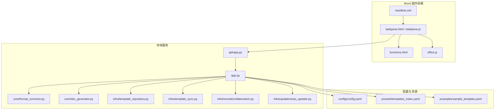
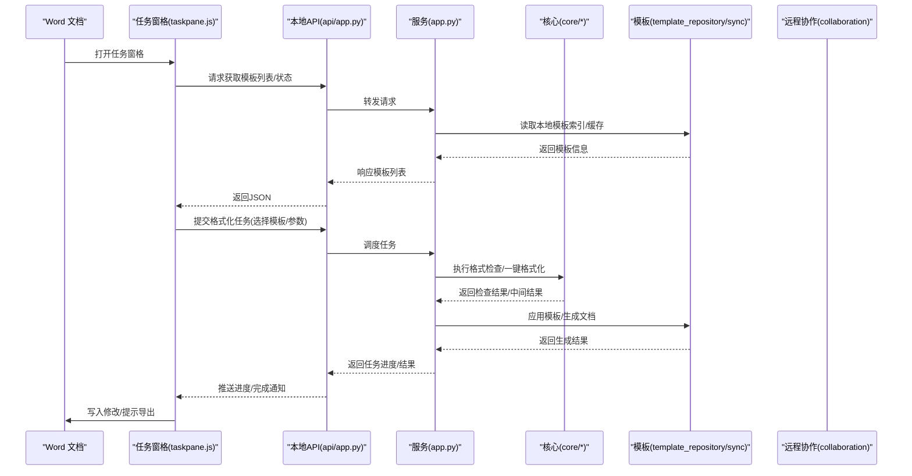
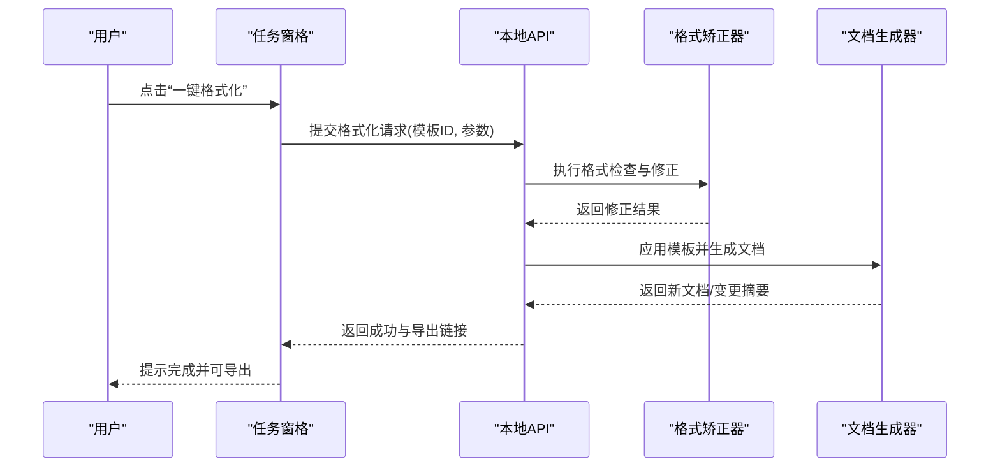
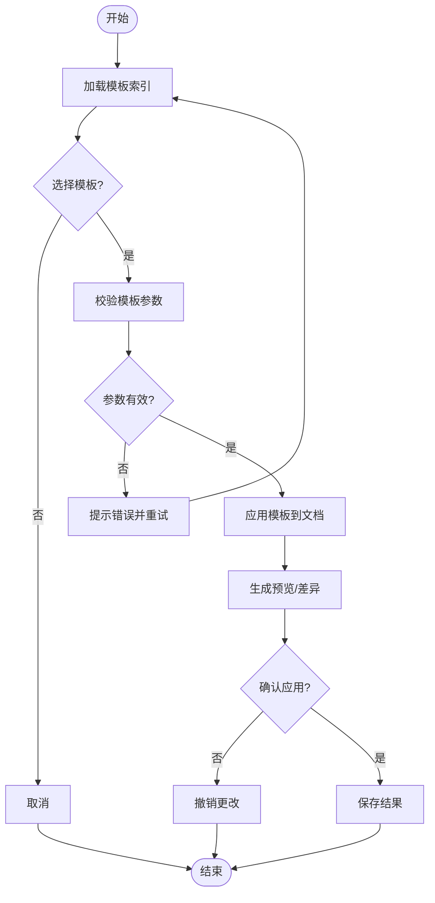
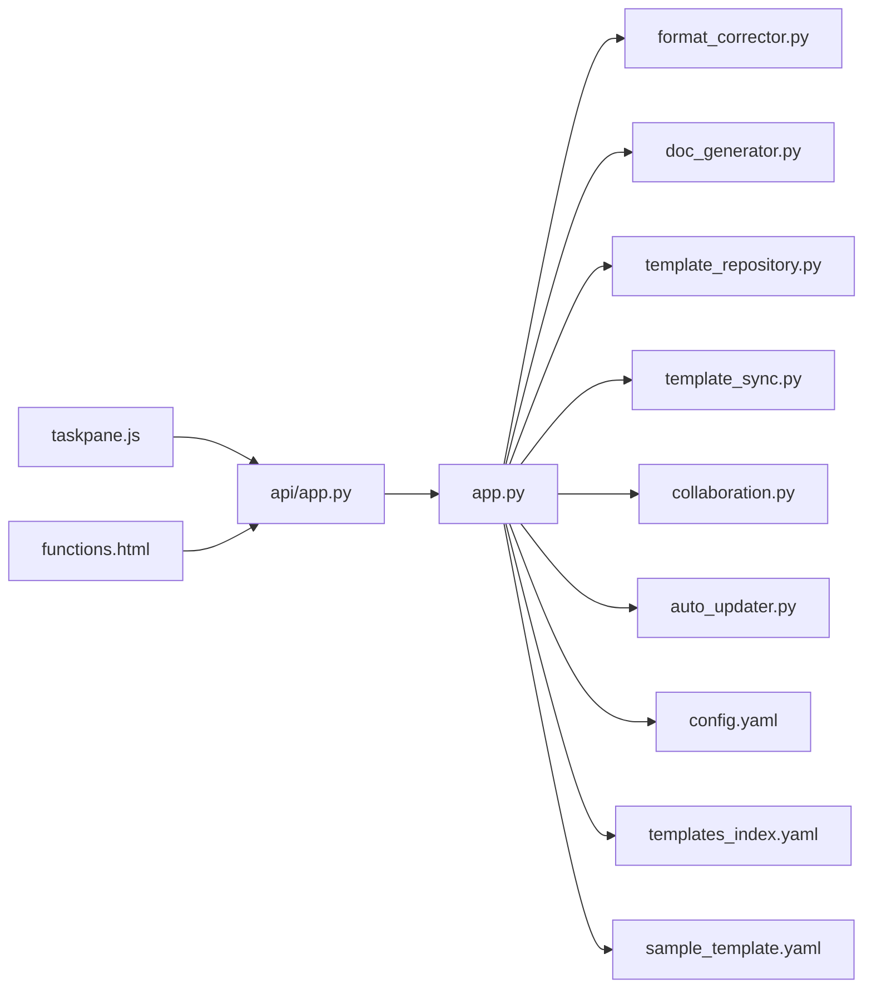

# Word插件

<cite>
**本文引用的文件**   
- [interfaces/word_addin/manifest.xml](file://interfaces/word_addin/manifest.xml)
- [interfaces/word_addin/src/taskpane.html](file://interfaces/word_addin/src/taskpane.html)
- [interfaces/word_addin/src/taskpane.js](file://interfaces/word_addin/src/taskpane.js)
- [interfaces/word_addin/src/functions.html](file://interfaces/word_addin/src/functions.html)
- [interfaces/word_addin/src/office.js](file://interfaces/word_addin/src/office.js)
- [src/paper_format_corrector/app.py](file://src/paper_format_corrector/app.py)
- [src/paper_format_corrector/api/app.py](file://src/paper_format_corrector/api/app.py)
- [src/paper_format_corrector/core/format_corrector.py](file://src/paper_format_corrector/core/format_corrector.py)
- [src/paper_format_corrector/core/doc_generator.py](file://src/paper_format_corrector/core/doc_generator.py)
- [src/paper_format_corrector/infra/template_repository.py](file://src/paper_format_corrector/infra/template_repository.py)
- [src/paper_format_corrector/infra/template_sync.py](file://src/paper_format_corrector/infra/template_sync.py)
- [src/paper_format_corrector/infra/remote/collaboration.py](file://src/paper_format_corrector/infra/remote/collaboration.py)
- [src/paper_format_corrector/infra/updater/auto_updater.py](file://src/paper_format_corrector/infra/updater/auto_updater.py)
- [config/config.yaml](file://config/config.yaml)
- [presets/templates_index.yaml](file://presets/templates_index.yaml)
- [examples/sample_template.yaml](file://examples/sample_template.yaml)
- [README.md](file://README.md)
</cite>

## 目录
1. [简介](#简介)
2. [项目结构](#项目结构)
3. [核心组件](#核心组件)
4. [架构总览](#架构总览)
5. [详细组件分析](#详细组件分析)
6. [依赖关系分析](#依赖关系分析)
7. [性能考虑](#性能考虑)
8. [故障排查指南](#故障排查指南)
9. [结论](#结论)
10. [附录](#附录)

## 简介
本Word插件为Microsoft Office Word提供文档格式检查、一键格式化、模板应用与云端协作等能力。插件通过Office JS API在任务窗格中呈现交互界面，调用本地服务执行格式处理与模板渲染，并支持远程模板同步与协作编辑。本文档面向最终用户与扩展开发者，涵盖安装配置、功能使用、任务窗格操作、云端集成、开发指南、常见问题与性能优化建议。

## 项目结构
仓库采用前后端分离的插件架构：前端为基于Office JS的任务窗格与函数页面，后端为Python服务，负责格式矫正、模板解析与导出、远程同步与协作等。

图表来源
- [interfaces/word_addin/manifest.xml](file://interfaces/word_addin/manifest.xml)
- [interfaces/word_addin/src/taskpane.html](file://interfaces/word_addin/src/taskpane.html)
- [interfaces/word_addin/src/taskpane.js](file://interfaces/word_addin/src/taskpane.js)
- [interfaces/word_addin/src/functions.html](file://interfaces/word_addin/src/functions.html)
- [interfaces/word_addin/src/office.js](file://interfaces/word_addin/src/office.js)
- [src/paper_format_corrector/app.py](file://src/paper_format_corrector/app.py)
- [src/paper_format_corrector/api/app.py](file://src/paper_format_corrector/api/app.py)
- [src/paper_format_corrector/core/format_corrector.py](file://src/paper_format_corrector/core/format_corrector.py)
- [src/paper_format_corrector/core/doc_generator.py](file://src/paper_format_corrector/core/doc_generator.py)
- [src/paper_format_corrector/infra/template_repository.py](file://src/paper_format_corrector/infra/template_repository.py)
- [src/paper_format_corrector/infra/template_sync.py](file://src/paper_format_corrector/infra/template_sync.py)
- [src/paper_format_corrector/infra/remote/collaboration.py](file://src/paper_format_corrector/infra/remote/collaboration.py)
- [src/paper_format_corrector/infra/updater/auto_updater.py](file://src/paper_format_corrector/infra/updater/auto_updater.py)
- [config/config.yaml](file://config/config.yaml)
- [presets/templates_index.yaml](file://presets/templates_index.yaml)
- [examples/sample_template.yaml](file://examples/sample_template.yaml)

章节来源
- [README.md](file://README.md)

## 核心组件
- 插件清单与入口
  - manifest.xml：定义插件元数据、任务窗格与函数页面的URL、权限范围等。
  - taskpane.html/js：任务窗格UI与交互逻辑，负责参数配置、进度展示与结果导出。
  - functions.html：后台函数页，用于执行耗时任务（如批量格式化）。
  - office.js：Office JS运行时加载与初始化。
- 本地服务
  - app.py：主进程，启动HTTP服务、注册路由、协调各模块。
  - api/app.py：API层，暴露REST接口供任务窗格调用。
  - core/format_corrector.py：格式检查与一键格式化核心逻辑。
  - core/doc_generator.py：模板渲染与文档生成。
  - infra/template_repository.py：模板索引与本地缓存管理。
  - infra/template_sync.py：远程模板同步。
  - infra/remote/collaboration.py：协作编辑相关能力。
  - infra/updater/auto_updater.py：自动更新检查与下载。
- 配置与模板
  - config/config.yaml：全局配置（端口、日志、路径等）。
  - presets/templates_index.yaml：内置模板索引。
  - examples/sample_template.yaml：示例模板结构。

章节来源
- [interfaces/word_addin/manifest.xml](file://interfaces/word_addin/manifest.xml)
- [interfaces/word_addin/src/taskpane.html](file://interfaces/word_addin/src/taskpane.html)
- [interfaces/word_addin/src/taskpane.js](file://interfaces/word_addin/src/taskpane.js)
- [interfaces/word_addin/src/functions.html](file://interfaces/word_addin/src/functions.html)
- [interfaces/word_addin/src/office.js](file://interfaces/word_addin/src/office.js)
- [src/paper_format_corrector/app.py](file://src/paper_format_corrector/app.py)
- [src/paper_format_corrector/api/app.py](file://src/paper_format_corrector/api/app.py)
- [src/paper_format_corrector/core/format_corrector.py](file://src/paper_format_corrector/core/format_corrector.py)
- [src/paper_format_corrector/core/doc_generator.py](file://src/paper_format_corrector/core/doc_generator.py)
- [src/paper_format_corrector/infra/template_repository.py](file://src/paper_format_corrector/infra/template_repository.py)
- [src/paper_format_corrector/infra/template_sync.py](file://src/paper_format_corrector/infra/template_sync.py)
- [src/paper_format_corrector/infra/remote/collaboration.py](file://src/paper_format_corrector/infra/remote/collaboration.py)
- [src/paper_format_corrector/infra/updater/auto_updater.py](file://src/paper_format_corrector/infra/updater/auto_updater.py)
- [config/config.yaml](file://config/config.yaml)
- [presets/templates_index.yaml](file://presets/templates_index.yaml)
- [examples/sample_template.yaml](file://examples/sample_template.yaml)

## 架构总览
插件采用“前端任务窗格 + 本地服务”的架构。任务窗格通过Office JS与浏览器环境通信，调用本地API执行格式检查、模板应用与导出；本地服务负责业务编排、模板管理与远程同步。

图表来源
- [interfaces/word_addin/src/taskpane.js](file://interfaces/word_addin/src/taskpane.js)
- [src/paper_format_corrector/api/app.py](file://src/paper_format_corrector/api/app.py)
- [src/paper_format_corrector/app.py](file://src/paper_format_corrector/app.py)
- [src/paper_format_corrector/core/format_corrector.py](file://src/paper_format_corrector/core/format_corrector.py)
- [src/paper_format_corrector/core/doc_generator.py](file://src/paper_format_corrector/core/doc_generator.py)
- [src/paper_format_corrector/infra/template_repository.py](file://src/paper_format_corrector/infra/template_repository.py)
- [src/paper_format_corrector/infra/template_sync.py](file://src/paper_format_corrector/infra/template_sync.py)
- [src/paper_format_corrector/infra/remote/collaboration.py](file://src/paper_format_corrector/infra/remote/collaboration.py)

## 详细组件分析

### 安装与配置
- 信任中心设置
  - 启用受信任位置或允许加载第三方插件。
  - 将插件清单所在目录加入受信任位置，或在企业环境中由管理员部署。
- 插件部署
  - 将manifest.xml及前端资源放置于可访问的Web服务器或本地静态目录。
  - 在Word中选择“从我的组织的应用商店添加插件”或“从文件添加自定义加载项”，指向manifest.xml。
- 本地服务启动
  - 确保config.yaml中的端口未被占用。
  - 启动主服务后，任务窗格将通过API与服务通信。

章节来源
- [interfaces/word_addin/manifest.xml](file://interfaces/word_addin/manifest.xml)
- [config/config.yaml](file://config/config.yaml)

### 功能特性
- 实时格式检查
  - 在任务窗格中触发检查，服务调用格式矫正核心，返回问题列表与建议。
- 一键格式化
  - 选择目标模板与规则集，服务执行批量格式化并回写文档。
- 模板应用
  - 从本地模板库或远程同步的模板中选择，预览并应用到当前文档。
- 结果导出
  - 支持导出报告、差异对比或生成新文档副本。

章节来源
- [src/paper_format_corrector/core/format_corrector.py](file://src/paper_format_corrector/core/format_corrector.py)
- [src/paper_format_corrector/core/doc_generator.py](file://src/paper_format_corrector/core/doc_generator.py)
- [interfaces/word_addin/src/taskpane.js](file://interfaces/word_addin/src/taskpane.js)

### 任务窗格使用方法
- 参数配置
  - 在任务窗格中选择模板、规则级别、输出选项等。
- 进度查看
  - 任务执行期间，任务窗格显示进度条与阶段提示。
- 结果导出
  - 完成后提供导出按钮，支持保存报告或生成新文档。

章节来源
- [interfaces/word_addin/src/taskpane.html](file://interfaces/word_addin/src/taskpane.html)
- [interfaces/word_addin/src/taskpane.js](file://interfaces/word_addin/src/taskpane.js)
- [interfaces/word_addin/src/functions.html](file://interfaces/word_addin/src/functions.html)

### 云端服务集成
- 远程模板同步
  - 通过模板同步模块拉取/推送模板至远程仓库，保持团队一致。
- 协作编辑
  - 支持多人协作场景下的冲突检测与合并策略。

章节来源
- [src/paper_format_corrector/infra/template_sync.py](file://src/paper_format_corrector/infra/template_sync.py)
- [src/paper_format_corrector/infra/remote/collaboration.py](file://src/paper_format_corrector/infra/remote/collaboration.py)

### 插件开发指南
- JavaScript API参考
  - 使用Office JS API读写文档内容、插入段落、表格、图片等。
  - 通过任务上下文与消息通道与本地服务通信。
- 扩展开发示例
  - 在functions.html中实现后台任务，避免阻塞UI线程。
  - 在taskpane.js中封装API调用，统一错误处理与重试机制。

章节来源
- [interfaces/word_addin/src/office.js](file://interfaces/word_addin/src/office.js)
- [interfaces/word_addin/src/functions.html](file://interfaces/word_addin/src/functions.html)
- [interfaces/word_addin/src/taskpane.js](file://interfaces/word_addin/src/taskpane.js)

### 关键流程时序图（格式化）

图表来源
- [interfaces/word_addin/src/taskpane.js](file://interfaces/word_addin/src/taskpane.js)
- [src/paper_format_corrector/api/app.py](file://src/paper_format_corrector/api/app.py)
- [src/paper_format_corrector/core/format_corrector.py](file://src/paper_format_corrector/core/format_corrector.py)
- [src/paper_format_corrector/core/doc_generator.py](file://src/paper_format_corrector/core/doc_generator.py)

### 复杂逻辑流程图（模板应用）

图表来源
- [src/paper_format_corrector/infra/template_repository.py](file://src/paper_format_corrector/infra/template_repository.py)
- [src/paper_format_corrector/core/doc_generator.py](file://src/paper_format_corrector/core/doc_generator.py)
- [interfaces/word_addin/src/taskpane.js](file://interfaces/word_addin/src/taskpane.js)

## 依赖关系分析
- 前端依赖
  - Office JS运行时，任务窗格与函数页面通过HTTP与本地服务通信。
- 后端依赖
  - 格式矫正与文档生成模块，模板仓库与同步模块，协作与更新模块。
- 外部依赖
  - 配置文件与模板索引，示例模板。

图表来源
- [interfaces/word_addin/src/taskpane.js](file://interfaces/word_addin/src/taskpane.js)
- [interfaces/word_addin/src/functions.html](file://interfaces/word_addin/src/functions.html)
- [src/paper_format_corrector/api/app.py](file://src/paper_format_corrector/api/app.py)
- [src/paper_format_corrector/app.py](file://src/paper_format_corrector/app.py)
- [src/paper_format_corrector/core/format_corrector.py](file://src/paper_format_corrector/core/format_corrector.py)
- [src/paper_format_corrector/core/doc_generator.py](file://src/paper_format_corrector/core/doc_generator.py)
- [src/paper_format_corrector/infra/template_repository.py](file://src/paper_format_corrector/infra/template_repository.py)
- [src/paper_format_corrector/infra/template_sync.py](file://src/paper_format_corrector/infra/template_sync.py)
- [src/paper_format_corrector/infra/remote/collaboration.py](file://src/paper_format_corrector/infra/remote/collaboration.py)
- [src/paper_format_corrector/infra/updater/auto_updater.py](file://src/paper_format_corrector/infra/updater/auto_updater.py)
- [config/config.yaml](file://config/config.yaml)
- [presets/templates_index.yaml](file://presets/templates_index.yaml)
- [examples/sample_template.yaml](file://examples/sample_template.yaml)

## 性能考虑
- 前端
  - 使用函数页面执行耗时任务，避免阻塞UI。
  - 对长任务进行分片与进度上报，提升用户体验。
- 后端
  - 模板索引与缓存减少重复IO。
  - 批量处理时采用队列与并发控制，避免内存峰值。
  - 大文档处理时按需加载与增量更新。
- 网络
  - 远程同步采用增量与断点续传，降低带宽消耗。
  - 超时与重试策略保证稳定性。

[本节为通用指导，不直接分析具体文件]

## 故障排查指南
- 插件无法加载
  - 检查manifest.xml路径与受信任位置设置。
  - 确认本地服务已启动且端口可用。
- 任务无响应
  - 查看任务窗格控制台与本地服务日志。
  - 检查API连通性与跨域配置。
- 模板应用失败
  - 验证模板参数与索引一致性。
  - 使用示例模板进行回归测试。
- 远程同步异常
  - 检查网络与认证配置。
  - 查看同步日志与冲突解决策略。

章节来源
- [interfaces/word_addin/manifest.xml](file://interfaces/word_addin/manifest.xml)
- [interfaces/word_addin/src/taskpane.js](file://interfaces/word_addin/src/taskpane.js)
- [src/paper_format_corrector/api/app.py](file://src/paper_format_corrector/api/app.py)
- [src/paper_format_corrector/infra/template_repository.py](file://src/paper_format_corrector/infra/template_repository.py)
- [src/paper_format_corrector/infra/template_sync.py](file://src/paper_format_corrector/infra/template_sync.py)
- [examples/sample_template.yaml](file://examples/sample_template.yaml)

## 结论
本Word插件通过任务窗格与本地服务的协同，实现了高效的格式检查、一键格式化与模板应用，并支持远程模板同步与协作编辑。对于扩展开发者，提供了清晰的API与示例，便于二次开发与定制。建议在生产环境完善日志、监控与错误恢复机制，以提升稳定性与可维护性。

[本节为总结，不直接分析具体文件]

## 附录
- 快速上手
  - 部署manifest与前端资源，启动本地服务，在Word中添加自定义加载项。
- 常用配置
  - 调整config.yaml中的端口、日志级别与路径。
- 模板开发
  - 参考示例模板结构与索引定义，编写自定义模板。

章节来源
- [config/config.yaml](file://config/config.yaml)
- [examples/sample_template.yaml](file://examples/sample_template.yaml)
- [presets/templates_index.yaml](file://presets/templates_index.yaml)