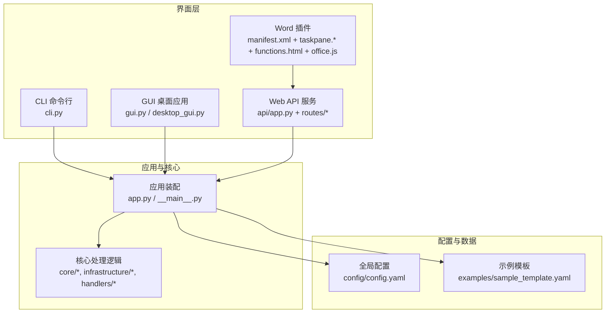
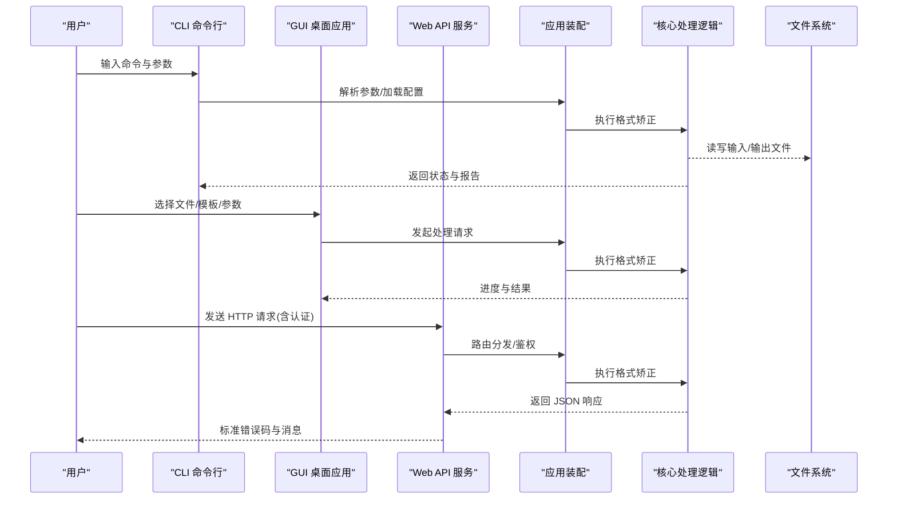
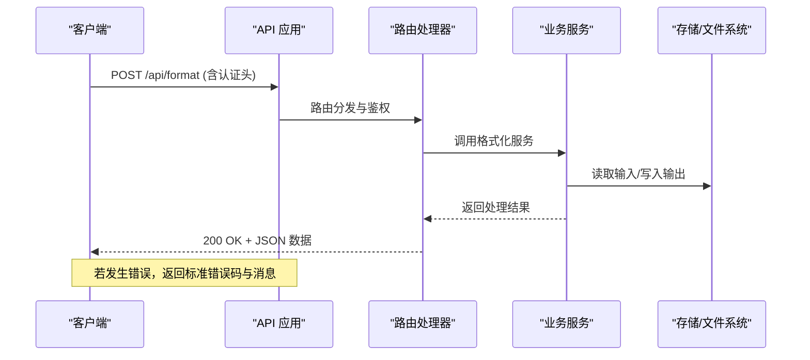
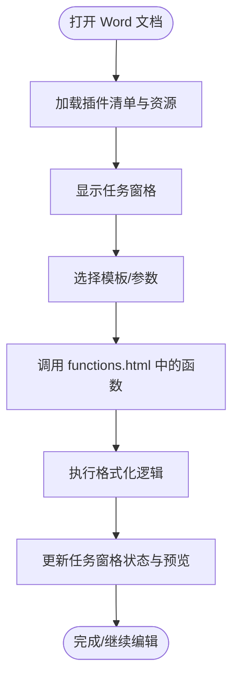
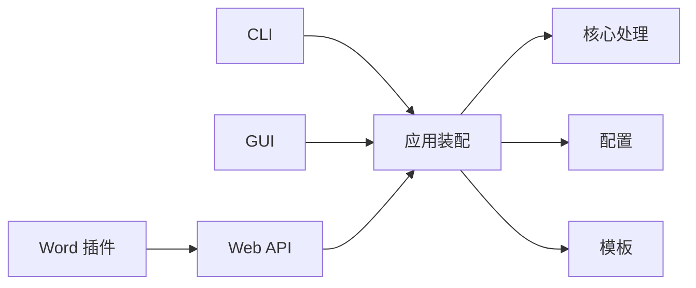

# 用户界面

<cite>
**本文引用的文件**   
- [src/paper_format_corrector/cli.py](file://src/paper_format_corrector/cli.py)
- [src/paper_format_corrector/gui.py](file://src/paper_format_corrector/gui.py)
- [src/paper_format_corrector/desktop_gui.py](file://src/paper_format_corrector/desktop_gui.py)
- [src/paper_format_corrector/app.py](file://src/paper_format_corrector/app.py)
- [src/paper_format_corrector/__main__.py](file://src/paper_format_corrector/__main__.py)
- [src/paper_format_corrector/api/app.py](file://src/paper_format_corrector/api/app.py)
- [src/paper_format_corrector/interfaces/api/routes/](file://src/paper_format_corrector/interfaces/api/routes/)
- [interfaces/word_addin/manifest.xml](file://interfaces/word_addin/manifest.xml)
- [interfaces/word_addin/src/taskpane.html](file://interfaces/word_addin/src/taskpane.html)
- [interfaces/word_addin/src/taskpane.js](file://interfaces/word_addin/src/taskpane.js)
- [interfaces/word_addin/src/functions.html](file://interfaces/word_addin/src/functions.html)
- [interfaces/word_addin/src/office.js](file://interfaces/word_addin/src/office.js)
- [config/config.yaml](file://config/config.yaml)
- [examples/sample_template.yaml](file://examples/sample_template.yaml)
- [README.md](file://README.md)
</cite>

## 目录
1. [简介](#简介)
2. [项目结构](#项目结构)
3. [核心组件](#核心组件)
4. [架构总览](#架构总览)
5. [详细组件分析](#详细组件分析)
6. [依赖关系分析](#依赖关系分析)
7. [性能考虑](#性能考虑)
8. [故障排除指南](#故障排除指南)
9. [结论](#结论)
10. [附录](#附录)

## 简介
本文件为用户界面模块的使用文档，覆盖以下四类交互入口：
- CLI 命令行工具：完整命令集、参数选项、输入输出格式与批处理脚本编写建议。
- GUI 图形界面：文件导入、格式选择、参数配置与结果查看的端到端流程。
- Web API 服务：RESTful 接口调用方式、认证机制与错误处理。
- Word 插件：安装与使用、Office 集成、菜单操作与实时格式化能力。

同时提供最佳实践、性能优化建议、实际交互示例与常见问题排查方法，帮助不同技术背景的用户高效完成论文格式矫正任务。

## 项目结构
用户界面相关代码主要分布在如下位置：
- CLI 入口与命令解析：src/paper_format_corrector/cli.py
- GUI 桌面应用：src/paper_format_corrector/gui.py、src/paper_format_corrector/desktop_gui.py
- Web API 服务：src/paper_format_corrector/api/app.py 及 routes 子目录
- Word 插件清单与前端资源：interfaces/word_addin/*
- 全局配置与示例模板：config/config.yaml、examples/sample_template.yaml
- 程序启动入口：src/paper_format_corrector/__main__.py、src/paper_format_corrector/app.py

图表来源
- [src/paper_format_corrector/cli.py](file://src/paper_format_corrector/cli.py)
- [src/paper_format_corrector/gui.py](file://src/paper_format_corrector/gui.py)
- [src/paper_format_corrector/desktop_gui.py](file://src/paper_format_corrector/desktop_gui.py)
- [src/paper_format_corrector/api/app.py](file://src/paper_format_corrector/api/app.py)
- [interfaces/word_addin/manifest.xml](file://interfaces/word_addin/manifest.xml)
- [config/config.yaml](file://config/config.yaml)
- [examples/sample_template.yaml](file://examples/sample_template.yaml)

章节来源
- [src/paper_format_corrector/cli.py](file://src/paper_format_corrector/cli.py)
- [src/paper_format_corrector/gui.py](file://src/paper_format_corrector/gui.py)
- [src/paper_format_corrector/desktop_gui.py](file://src/paper_format_corrector/desktop_gui.py)
- [src/paper_format_corrector/api/app.py](file://src/paper_format_corrector/api/app.py)
- [interfaces/word_addin/manifest.xml](file://interfaces/word_addin/manifest.xml)
- [config/config.yaml](file://config/config.yaml)
- [examples/sample_template.yaml](file://examples/sample_template.yaml)

## 核心组件
- CLI 命令行工具
  - 负责解析命令行参数、加载配置与模板、执行格式矫正并输出结果或报告。
  - 支持批量处理、日志级别控制、输出路径与覆盖策略等常用选项。
- GUI 图形界面
  - 提供可视化工作区：文件导入、模板选择、参数调节、进度反馈与结果预览。
  - 适合非技术用户快速上手与交互式调试。
- Web API 服务
  - 暴露 RESTful 接口，供外部系统或自动化流程调用。
  - 包含认证、限流、错误码与返回体规范。
- Word 插件
  - 通过 Office 插件清单注册功能面板与函数，实现文档内一键格式化与实时预览。

章节来源
- [src/paper_format_corrector/cli.py](file://src/paper_format_corrector/cli.py)
- [src/paper_format_corrector/gui.py](file://src/paper_format_corrector/gui.py)
- [src/paper_format_corrector/desktop_gui.py](file://src/paper_format_corrector/desktop_gui.py)
- [src/paper_format_corrector/api/app.py](file://src/paper_format_corrector/api/app.py)
- [interfaces/word_addin/manifest.xml](file://interfaces/word_addin/manifest.xml)

## 架构总览
下图展示从界面到核心处理的典型调用链路与数据流向。

图表来源
- [src/paper_format_corrector/cli.py](file://src/paper_format_corrector/cli.py)
- [src/paper_format_corrector/gui.py](file://src/paper_format_corrector/gui.py)
- [src/paper_format_corrector/desktop_gui.py](file://src/paper_format_corrector/desktop_gui.py)
- [src/paper_format_corrector/api/app.py](file://src/paper_format_corrector/api/app.py)
- [src/paper_format_corrector/app.py](file://src/paper_format_corrector/app.py)

## 详细组件分析

### CLI 命令行工具
- 启动方式
  - 通过包入口或命令行直接运行，进入命令解析与参数校验流程。
- 常见命令与参数（概念性说明）
  - 输入/输出：指定输入文档路径、输出路径、是否覆盖原文件。
  - 模板与预设：选择内置模板或自定义模板文件；可指定模板索引或名称。
  - 处理选项：启用/禁用特定规则、调整字体/段落/表格等样式参数。
  - 日志与调试：设置日志级别、导出中间报告、开启详细模式。
  - 批处理：支持目录扫描、通配符匹配、并发度控制。
- 输入输出格式
  - 输入：支持主流文档格式（如 .docx），具体以核心转换器为准。
  - 输出：生成格式化后的文档与可选的质量/差异报告（JSON/文本）。
- 批处理脚本编写建议
  - 将常用参数固化到脚本中，结合环境变量注入敏感信息（如密钥）。
  - 使用幂等设计：输出到独立目录，避免覆盖原始文件。
  - 对大批量任务进行分片与重试，记录失败清单以便后续人工复核。
- 最佳实践
  - 先小批量验证模板与参数，再全量执行。
  - 利用日志与报告定位问题，必要时开启详细模式。
  - 在 CI/CD 中使用固定版本与模板哈希，确保可重复性。

章节来源
- [src/paper_format_corrector/cli.py](file://src/paper_format_corrector/cli.py)
- [config/config.yaml](file://config/config.yaml)
- [examples/sample_template.yaml](file://examples/sample_template.yaml)

### GUI 图形界面
- 功能概览
  - 文件导入：拖拽或选择本地文件，自动识别类型。
  - 模板选择：下拉列表展示可用模板，支持搜索与预览。
  - 参数配置：可视化调整关键样式参数，支持保存为个人偏好。
  - 结果查看：对比视图、变更高亮、质量评分与报告下载。
- 操作流程
  - 打开应用 → 导入文档 → 选择模板 → 调整参数 → 开始处理 → 查看结果与报告。
- 注意事项
  - 大文档处理时建议关闭实时预览以提升性能。
  - 网络受限环境下优先使用本地模板与缓存。
- 最佳实践
  - 将常用模板与参数保存为“工作空间”，减少重复配置。
  - 分批处理大型文档，避免一次性加载过多内容导致卡顿。

章节来源
- [src/paper_format_corrector/gui.py](file://src/paper_format_corrector/gui.py)
- [src/paper_format_corrector/desktop_gui.py](file://src/paper_format_corrector/desktop_gui.py)

### Web API 服务
- 服务启动与访问
  - 通过应用装配启动服务，监听默认端口，提供健康检查与文档页面。
- 认证机制
  - 支持基于令牌或会话的认证，建议在网关层统一鉴权与限流。
- 接口约定
  - 使用 RESTful 风格，统一请求头、状态码与错误体结构。
  - 返回体包含数据、分页信息与错误详情（如适用）。
- 错误处理
  - 明确区分客户端错误与服务端错误，提供可读的错误码与提示。
  - 对超时、资源不足、权限不足等场景给出标准化响应。
- 安全与合规
  - 限制上传文件大小与类型，校验路径安全性，防止越权访问。
  - 对敏感信息进行脱敏与最小化暴露。

图表来源
- [src/paper_format_corrector/api/app.py](file://src/paper_format_corrector/api/app.py)
- [src/paper_format_corrector/interfaces/api/routes/](file://src/paper_format_corrector/interfaces/api/routes/)

章节来源
- [src/paper_format_corrector/api/app.py](file://src/paper_format_corrector/api/app.py)
- [src/paper_format_corrector/interfaces/api/routes/](file://src/paper_format_corrector/interfaces/api/routes/)

### Word 插件
- 安装与启用
  - 通过 Office 插件清单 manifest.xml 注册任务窗格与函数。
  - 在受信任位置部署清单，或在开发模式下加载自定义插件。
- 菜单与操作
  - 在 Word 功能区添加按钮，点击后打开任务窗格。
  - 在任务窗格中选择模板与参数，触发格式化。
- 实时格式化
  - 通过 functions.html 与 office.js 桥接，实现文档内即时预览与回写。
- 最佳实践
  - 首次加载时预取模板元数据，减少后续交互延迟。
  - 对大文档采用增量更新与懒加载策略。
  - 在离线场景下提供降级方案（仅本地模板与基础功能）。

图表来源
- [interfaces/word_addin/manifest.xml](file://interfaces/word_addin/manifest.xml)
- [interfaces/word_addin/src/taskpane.html](file://interfaces/word_addin/src/taskpane.html)
- [interfaces/word_addin/src/taskpane.js](file://interfaces/word_addin/src/taskpane.js)
- [interfaces/word_addin/src/functions.html](file://interfaces/word_addin/src/functions.html)
- [interfaces/word_addin/src/office.js](file://interfaces/word_addin/src/office.js)

章节来源
- [interfaces/word_addin/manifest.xml](file://interfaces/word_addin/manifest.xml)
- [interfaces/word_addin/src/taskpane.html](file://interfaces/word_addin/src/taskpane.html)
- [interfaces/word_addin/src/taskpane.js](file://interfaces/word_addin/src/taskpane.js)
- [interfaces/word_addin/src/functions.html](file://interfaces/word_addin/src/functions.html)
- [interfaces/word_addin/src/office.js](file://interfaces/word_addin/src/office.js)

## 依赖关系分析
- 界面层耦合
  - CLI/GUI/Web 均依赖应用装配层进行初始化与配置加载，降低界面与核心逻辑的直接耦合。
- 配置与模板
  - 全局配置与示例模板作为共享资源，被各界面与核心处理共同消费。
- 外部集成
  - Word 插件通过 Office 运行时与后端服务通信，需关注跨域与安全策略。

图表来源
- [src/paper_format_corrector/cli.py](file://src/paper_format_corrector/cli.py)
- [src/paper_format_corrector/gui.py](file://src/paper_format_corrector/gui.py)
- [src/paper_format_corrector/desktop_gui.py](file://src/paper_format_corrector/desktop_gui.py)
- [src/paper_format_corrector/api/app.py](file://src/paper_format_corrector/api/app.py)
- [src/paper_format_corrector/app.py](file://src/paper_format_corrector/app.py)
- [config/config.yaml](file://config/config.yaml)
- [examples/sample_template.yaml](file://examples/sample_template.yaml)
- [interfaces/word_addin/manifest.xml](file://interfaces/word_addin/manifest.xml)

章节来源
- [src/paper_format_corrector/app.py](file://src/paper_format_corrector/app.py)
- [src/paper_format_corrector/__main__.py](file://src/paper_format_corrector/__main__.py)
- [config/config.yaml](file://config/config.yaml)
- [examples/sample_template.yaml](file://examples/sample_template.yaml)

## 性能考虑
- CLI
  - 合理设置并发度与内存阈值，避免一次性加载超大文档。
  - 使用增量输出与断点续跑，提升批处理稳定性。
- GUI
  - 关闭不必要的实时预览与高亮渲染，提高交互流畅度。
  - 对长文档采用分页加载与虚拟滚动。
- Web API
  - 引入请求限流与队列机制，保护后端资源。
  - 对热点模板与样式进行缓存，减少重复计算。
- Word 插件
  - 预加载常用模板元数据，按需拉取详细内容。
  - 使用后台线程执行耗时操作，避免阻塞 UI。

[本节为通用指导，不直接分析具体文件]

## 故障排除指南
- 常见问题
  - 模板未找到或加载失败：检查模板路径、命名与权限；确认配置文件指向正确。
  - 认证失败：核对令牌有效期与作用域；检查网关转发与跨域策略。
  - 大文档处理超时：拆分文档、降低并发、增加超时与重试策略。
  - Word 插件无法加载：确认清单位于受信任位置；在开发模式下重新注册。
- 诊断步骤
  - 开启详细日志，捕获异常堆栈与上下文信息。
  - 使用最小复现用例隔离问题（单页文档、基础模板）。
  - 对比不同环境（本地/CI/生产）的差异，定位配置与环境变量问题。
- 恢复建议
  - 保留原始输入与中间产物，便于回溯与比对。
  - 对失败任务建立重试队列与告警通知。

章节来源
- [config/config.yaml](file://config/config.yaml)
- [README.md](file://README.md)

## 结论
本用户界面模块提供了 CLI、GUI、Web API 与 Word 插件四种交互方式，覆盖从个人桌面到企业级自动化的多样化需求。通过合理的配置管理、清晰的接口契约与完善的错误处理，用户可在不同场景下高效完成论文格式矫正任务。建议在生产环境中结合监控与审计，持续优化性能与稳定性。

[本节为总结性内容，不直接分析具体文件]

## 附录
- 快速参考
  - CLI 常用参数：输入/输出路径、模板选择、日志级别、批处理开关。
  - GUI 快捷操作：拖拽导入、模板搜索、参数保存与工作区切换。
  - Web API 调用要点：认证头、状态码、错误体结构与重试策略。
  - Word 插件：清单部署、任务窗格操作、函数调用与实时预览。
- 示例与模板
  - 参考示例模板与配置项，快速搭建个性化工作流。

章节来源
- [examples/sample_template.yaml](file://examples/sample_template.yaml)
- [config/config.yaml](file://config/config.yaml)
- [README.md](file://README.md)