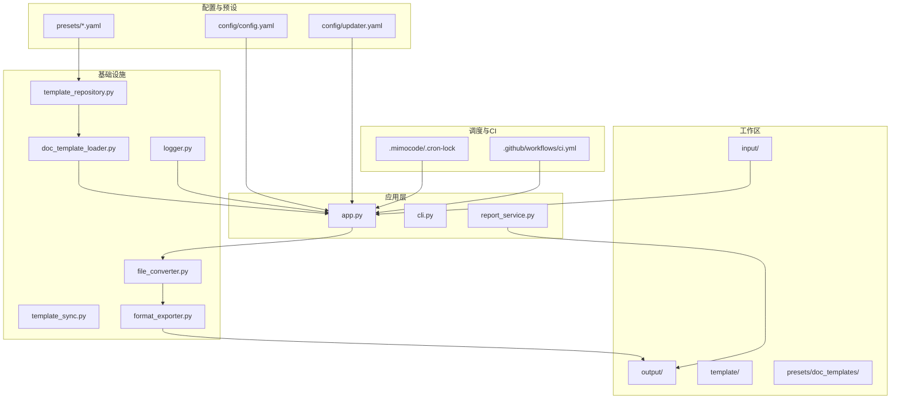
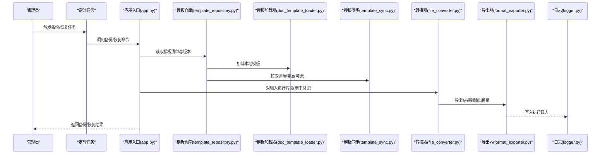
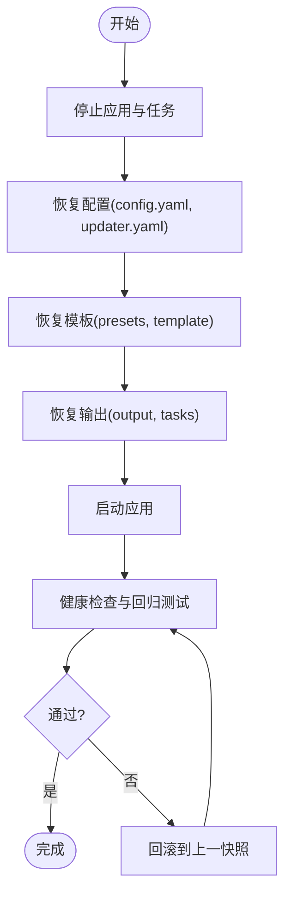
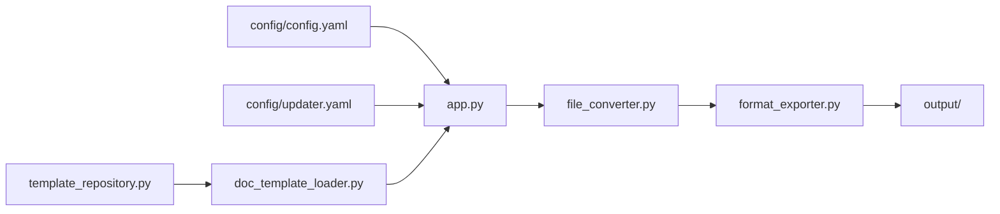

# 备份与恢复

<cite>
**本文引用的文件**   
- [README.md](file://README.md)
- [config/config.yaml](file://config/config.yaml)
- [config/updater.yaml](file://config/updater.yaml)
- [src/paper_format_corrector/app.py](file://src/paper_format_corrector/app.py)
- [src/paper_format_corrector/cli.py](file://src/paper_format_corrector/cli.py)
- [src/paper_format_corrector/infra/template_repository.py](file://src/paper_format_corrector/infra/template_repository.py)
- [src/paper_format_corrector/infra/doc_template_loader.py](file://src/paper_format_corrector/infra/doc_template_loader.py)
- [src/paper_format_corrector/infra/template_sync.py](file://src/paper_format_corrector/infra/template_sync.py)
- [src/paper_format_corrector/application/services/report_service.py](file://src/paper_format_corrector/application/services/report_service.py)
- [src/paper_format_corrector/core/format_corrector.py](file://src/paper_format_corrector/core/format_corrector.py)
- [src/paper_format_corrector/infrastructure/converters/file_converter.py](file://src/paper_format_corrector/infrastructure/converters/file_converter.py)
- [src/paper_format_corrector/infrastructure/exporters/format_exporter.py](file://src/paper_format_corrector/infrastructure/exporters/format_exporter.py)
- [src/paper_format_corrector/shared/utils/logger.py](file://src/paper_format_corrector/shared/utils/logger.py)
- [.mimocode/.cron-lock](file://.mimocode/.cron-lock)
- [.github/workflows/ci.yml](file://.github/workflows/ci.yml)
</cite>

## 目录
1. [简介](#简介)
2. [项目结构](#项目结构)
3. [核心组件](#核心组件)
4. [架构总览](#架构总览)
5. [详细组件分析](#详细组件分析)
6. [依赖关系分析](#依赖关系分析)
7. [性能考虑](#性能考虑)
8. [故障排查指南](#故障排查指南)
9. [结论](#结论)
10. [附录](#附录)

## 简介
本指南面向“论文格式矫正工具”的数据备份与灾难恢复，覆盖需要备份的数据类型、自动备份策略（定时任务、增量与全量）、数据恢复流程与验证方法、灾难恢复计划（不同故障场景）、备份加密与安全存储、完整性检查与定期演练建议。文档同时结合仓库中的配置与基础设施模块，给出可落地的操作建议与流程图示。

## 项目结构
从仓库结构可见，系统涉及用户配置、模板库、生成输出、日志与任务队列等关键目录与模块：
- 配置与预设：config、presets
- 输入与输出：input、output
- 模板与文档：template、presets/doc_templates
- 应用入口与CLI：src/paper_format_corrector/app.py、cli.py
- 模板与远程同步：infra/template_repository.py、infra/template_sync.py、infra/doc_template_loader.py
- 转换与导出：infrastructure/converters/file_converter.py、infrastructure/exporters/format_exporter.py
- 报告服务：application/services/report_service.py
- 日志：shared/utils/logger.py
- 定时任务锁：.mimocode/.cron-lock
- CI流水线：.github/workflows/ci.yml

图表来源
- [config/config.yaml](file://config/config.yaml)
- [config/updater.yaml](file://config/updater.yaml)
- [src/paper_format_corrector/app.py](file://src/paper_format_corrector/app.py)
- [src/paper_format_corrector/infra/template_repository.py](file://src/paper_format_corrector/infra/template_repository.py)
- [src/paper_format_corrector/infra/doc_template_loader.py](file://src/paper_format_corrector/infra/doc_template_loader.py)
- [src/paper_format_corrector/infra/template_sync.py](file://src/paper_format_corrector/infra/template_sync.py)
- [src/paper_format_corrector/infrastructure/converters/file_converter.py](file://src/paper_format_corrector/infrastructure/converters/file_converter.py)
- [src/paper_format_corrector/infrastructure/exporters/format_exporter.py](file://src/paper_format_corrector/infrastructure/exporters/format_exporter.py)
- [src/paper_format_corrector/application/services/report_service.py](file://src/paper_format_corrector/application/services/report_service.py)
- [src/paper_format_corrector/shared/utils/logger.py](file://src/paper_format_corrector/shared/utils/logger.py)
- [.mimocode/.cron-lock](file://.mimocode/.cron-lock)
- [.github/workflows/ci.yml](file://.github/workflows/ci.yml)

章节来源
- [README.md](file://README.md)
- [config/config.yaml](file://config/config.yaml)
- [config/updater.yaml](file://config/updater.yaml)
- [src/paper_format_corrector/app.py](file://src/paper_format_corrector/app.py)
- [src/paper_format_corrector/cli.py](file://src/paper_format_corrector/cli.py)
- [src/paper_format_corrector/infra/template_repository.py](file://src/paper_format_corrector/infra/template_repository.py)
- [src/paper_format_corrector/infra/doc_template_loader.py](file://src/paper_format_corrector/infra/doc_template_loader.py)
- [src/paper_format_corrector/infra/template_sync.py](file://src/paper_format_corrector/infra/template_sync.py)
- [src/paper_format_corrector/application/services/report_service.py](file://src/paper_format_corrector/application/services/report_service.py)
- [src/paper_format_corrector/core/format_corrector.py](file://src/paper_format_corrector/core/format_corrector.py)
- [src/paper_format_corrector/infrastructure/converters/file_converter.py](file://src/paper_format_corrector/infrastructure/converters/file_converter.py)
- [src/paper_format_corrector/infrastructure/exporters/format_exporter.py](file://src/paper_format_corrector/infrastructure/exporters/format_exporter.py)
- [src/paper_format_corrector/shared/utils/logger.py](file://src/paper_format_corrector/shared/utils/logger.py)
- [.mimocode/.cron-lock](file://.mimocode/.cron-lock)
- [.github/workflows/ci.yml](file://.github/workflows/ci.yml)

## 核心组件
- 配置管理：通过配置文件集中管理路径、行为开关与更新策略，便于在备份时定位关键元数据。
- 模板仓库与加载：负责本地与远端模板的获取、校验与加载，是备份与恢复的重点对象。
- 文档处理管线：输入解析、格式矫正、转换与导出，产出最终文档与报告。
- 日志与任务：记录运行状态与错误，配合定时任务实现自动化备份与恢复演练。

章节来源
- [config/config.yaml](file://config/config.yaml)
- [config/updater.yaml](file://config/updater.yaml)
- [src/paper_format_corrector/infra/template_repository.py](file://src/paper_format_corrector/infra/template_repository.py)
- [src/paper_format_corrector/infra/doc_template_loader.py](file://src/paper_format_corrector/infra/doc_template_loader.py)
- [src/paper_format_corrector/infra/template_sync.py](file://src/paper_format_corrector/infra/template_sync.py)
- [src/paper_format_corrector/application/services/report_service.py](file://src/paper_format_corrector/application/services/report_service.py)
- [src/paper_format_corrector/core/format_corrector.py](file://src/paper_format_corrector/core/format_corrector.py)
- [src/paper_format_corrector/infrastructure/converters/file_converter.py](file://src/paper_format_corrector/infrastructure/converters/file_converter.py)
- [src/paper_format_corrector/infrastructure/exporters/format_exporter.py](file://src/paper_format_corrector/infrastructure/exporters/format_exporter.py)
- [src/paper_format_corrector/shared/utils/logger.py](file://src/paper_format_corrector/shared/utils/logger.py)

## 架构总览
下图展示备份与恢复相关的关键路径：配置驱动、模板仓库、文档处理与输出、日志与调度。

图表来源
- [src/paper_format_corrector/app.py](file://src/paper_format_corrector/app.py)
- [src/paper_format_corrector/infra/template_repository.py](file://src/paper_format_corrector/infra/template_repository.py)
- [src/paper_format_corrector/infra/doc_template_loader.py](file://src/paper_format_corrector/infra/doc_template_loader.py)
- [src/paper_format_corrector/infra/template_sync.py](file://src/paper_format_corrector/infra/template_sync.py)
- [src/paper_format_corrector/infrastructure/converters/file_converter.py](file://src/paper_format_corrector/infrastructure/converters/file_converter.py)
- [src/paper_format_corrector/infrastructure/exporters/format_exporter.py](file://src/paper_format_corrector/infrastructure/exporters/format_exporter.py)
- [src/paper_format_corrector/shared/utils/logger.py](file://src/paper_format_corrector/shared/utils/logger.py)

## 详细组件分析

### 需要备份的数据类型
- 用户配置
  - 位置：config/config.yaml、config/updater.yaml
  - 内容：路径、行为开关、更新策略等
- 模板文件
  - 位置：presets/*.yaml、presets/doc_templates/*、template/*
  - 内容：样式规则、模板定义、文档模板包
- 生成的文档与报告
  - 位置：output/*、tasks/*（任务工件）
  - 内容：格式化后的文档、质量报告、中间产物
- 数据库信息
  - 说明：当前仓库未发现持久化数据库文件；若后续引入数据库，需按实际存储位置纳入备份范围
- 其他
  - 位置：logs（由日志模块输出）、.mimocode/.cron-lock（任务锁）
  - 内容：运行日志、任务锁状态

章节来源
- [config/config.yaml](file://config/config.yaml)
- [config/updater.yaml](file://config/updater.yaml)
- [src/paper_format_corrector/infra/template_repository.py](file://src/paper_format_corrector/infra/template_repository.py)
- [src/paper_format_corrector/infra/doc_template_loader.py](file://src/paper_format_corrector/infra/doc_template_loader.py)
- [src/paper_format_corrector/application/services/report_service.py](file://src/paper_format_corrector/application/services/report_service.py)
- [src/paper_format_corrector/shared/utils/logger.py](file://src/paper_format_corrector/shared/utils/logger.py)
- [.mimocode/.cron-lock](file://.mimocode/.cron-lock)

### 自动备份策略配置
- 定时任务
  - 使用 .mimocode/.cron-lock 作为任务锁标识，结合系统级调度器（如 cron/systemd timer）或内部任务编排触发备份脚本
  - 建议：每日增量、每周全量；保留策略按RPO/RTO要求设定
- 增量备份
  - 基于时间戳与变更检测，仅备份自上次备份以来发生变化的配置、模板与输出
- 全量备份
  - 定期打包完整的工作区与配置，确保快速恢复能力
- 备份目标
  - 本地磁盘、NAS、对象存储（S3/OSS/COS），并启用传输加密与静态加密

章节来源
- [.mimocode/.cron-lock](file://.mimocode/.cron-lock)
- [src/paper_format_corrector/shared/utils/logger.py](file://src/paper_format_corrector/shared/utils/logger.py)

### 数据恢复流程与验证
- 恢复步骤
  - 停止应用与任务
  - 回滚配置与模板至指定快照
  - 恢复输出与任务工件（如需）
  - 启动应用并执行健康检查
- 验证方法
  - 使用最小样本集运行一次端到端转换与导出，比对输出一致性
  - 校验模板加载与远端同步是否可用
  - 检查日志无异常告警

[此图为概念性流程，不直接映射具体源码文件]

### 灾难恢复计划（DRP）
- 场景一：单节点磁盘损坏
  - 动作：从异地备份恢复配置、模板与输出；优先恢复模板与配置，再恢复输出
- 场景二：模板污染或误删
  - 动作：从最近可信快照恢复模板目录；重新执行模板校验与导入
- 场景三：远端模板不可用
  - 动作：切换为离线模式，使用本地缓存模板；修复网络或远端后再次同步
- 场景四：应用升级失败
  - 动作：回滚到上一稳定版本；恢复对应版本的配置与模板快照

[本节为通用实践，不直接分析具体文件]

### 备份数据的加密与安全存储
- 传输安全：使用HTTPS/SFTP/SCP等协议
- 静态加密：对备份介质启用磁盘加密或对象存储服务端加密
- 密钥管理：将密钥与备份分离存放，采用KMS或硬件令牌
- 访问控制：最小权限原则，审计日志开启

[本节为通用实践，不直接分析具体文件]

### 备份完整性检查与定期演练
- 完整性检查
  - 计算并归档校验和（如SHA-256），定期复算比对
  - 抽样解压/还原并执行最小用例验证
- 定期演练
  - 每月进行一次恢复演练，记录RTO/RPO达成情况
  - 演练后复盘并优化流程

[本节为通用实践，不直接分析具体文件]

## 依赖关系分析
- 配置依赖：应用入口与模板加载均依赖配置文件，确保备份包含最新配置
- 模板依赖：模板仓库与加载器共同决定模板可用性，恢复时需保证两者一致
- 输出依赖：转换与导出模块产生输出，恢复后可通过最小用例验证链路

图表来源
- [config/config.yaml](file://config/config.yaml)
- [config/updater.yaml](file://config/updater.yaml)
- [src/paper_format_corrector/app.py](file://src/paper_format_corrector/app.py)
- [src/paper_format_corrector/infra/template_repository.py](file://src/paper_format_corrector/infra/template_repository.py)
- [src/paper_format_corrector/infra/doc_template_loader.py](file://src/paper_format_corrector/infra/doc_template_loader.py)
- [src/paper_format_corrector/infrastructure/converters/file_converter.py](file://src/paper_format_corrector/infrastructure/converters/file_converter.py)
- [src/paper_format_corrector/infrastructure/exporters/format_exporter.py](file://src/paper_format_corrector/infrastructure/exporters/format_exporter.py)

章节来源
- [src/paper_format_corrector/app.py](file://src/paper_format_corrector/app.py)
- [src/paper_format_corrector/infra/template_repository.py](file://src/paper_format_corrector/infra/template_repository.py)
- [src/paper_format_corrector/infra/doc_template_loader.py](file://src/paper_format_corrector/infra/doc_template_loader.py)
- [src/paper_format_corrector/infrastructure/converters/file_converter.py](file://src/paper_format_corrector/infrastructure/converters/file_converter.py)
- [src/paper_format_corrector/infrastructure/exporters/format_exporter.py](file://src/paper_format_corrector/infrastructure/exporters/format_exporter.py)

## 性能考虑
- 增量备份优先：减少I/O与网络开销，缩短备份窗口
- 并行压缩与上传：利用多核与带宽，提升吞吐
- 去重与分层：对重复模板与输出进行去重，降低存储成本
- 预热与缓存：常用模板预加载，避免恢复时的冷启动延迟

[本节为通用实践，不直接分析具体文件]

## 故障排查指南
- 常见问题
  - 模板加载失败：检查模板路径、权限与完整性
  - 远端同步失败：检查网络、认证与配额
  - 导出失败：检查输出目录权限与磁盘空间
- 定位手段
  - 查看日志：shared/utils/logger.py 输出的运行日志
  - 校验和比对：确认备份文件未被篡改
  - 最小用例回归：隔离问题范围

章节来源
- [src/paper_format_corrector/shared/utils/logger.py](file://src/paper_format_corrector/shared/utils/logger.py)
- [src/paper_format_corrector/infra/template_repository.py](file://src/paper_format_corrector/infra/template_repository.py)
- [src/paper_format_corrector/infra/template_sync.py](file://src/paper_format_corrector/infra/template_sync.py)
- [src/paper_format_corrector/infrastructure/exporters/format_exporter.py](file://src/paper_format_corrector/infrastructure/exporters/format_exporter.py)

## 结论
通过明确备份范围、制定自动化策略、完善恢复流程与演练机制，并结合加密与完整性校验，可显著提升系统的韧性与业务连续性。建议在现有配置与基础设施基础上，逐步落地上述方案，并持续度量RTO/RPO指标以优化流程。

## 附录
- 参考文件
  - 配置与更新：config/config.yaml、config/updater.yaml
  - 模板与同步：infra/template_repository.py、infra/template_sync.py、infra/doc_template_loader.py
  - 转换与导出：infrastructure/converters/file_converter.py、infrastructure/exporters/format_exporter.py
  - 应用入口与CLI：src/paper_format_corrector/app.py、src/paper_format_corrector/cli.py
  - 日志：shared/utils/logger.py
  - 任务锁：.mimocode/.cron-lock
  - CI：.github/workflows/ci.yml

章节来源
- [config/config.yaml](file://config/config.yaml)
- [config/updater.yaml](file://config/updater.yaml)
- [src/paper_format_corrector/infra/template_repository.py](file://src/paper_format_corrector/infra/template_repository.py)
- [src/paper_format_corrector/infra/template_sync.py](file://src/paper_format_corrector/infra/template_sync.py)
- [src/paper_format_corrector/infra/doc_template_loader.py](file://src/paper_format_corrector/infra/doc_template_loader.py)
- [src/paper_format_corrector/infrastructure/converters/file_converter.py](file://src/paper_format_corrector/infrastructure/converters/file_converter.py)
- [src/paper_format_corrector/infrastructure/exporters/format_exporter.py](file://src/paper_format_corrector/infrastructure/exporters/format_exporter.py)
- [src/paper_format_corrector/app.py](file://src/paper_format_corrector/app.py)
- [src/paper_format_corrector/cli.py](file://src/paper_format_corrector/cli.py)
- [src/paper_format_corrector/shared/utils/logger.py](file://src/paper_format_corrector/shared/utils/logger.py)
- [.mimocode/.cron-lock](file://.mimocode/.cron-lock)
- [.github/workflows/ci.yml](file://.github/workflows/ci.yml)