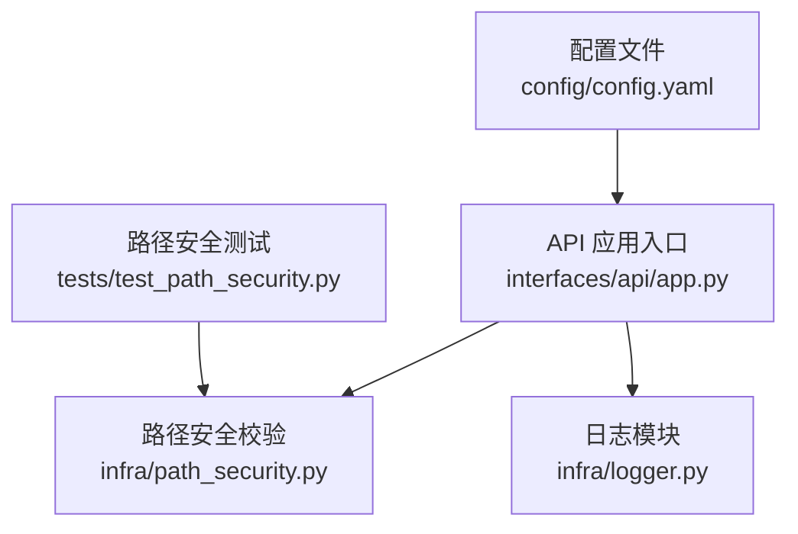
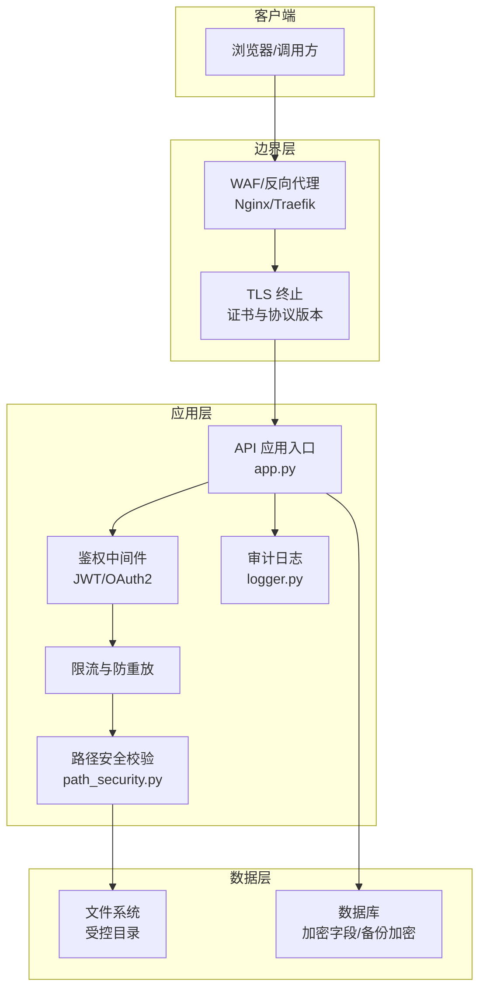
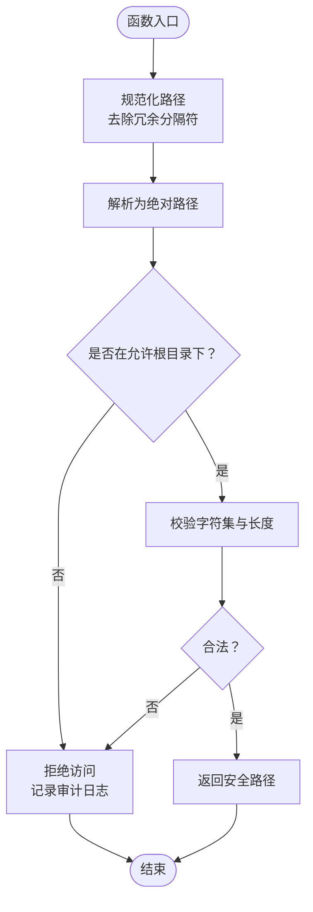
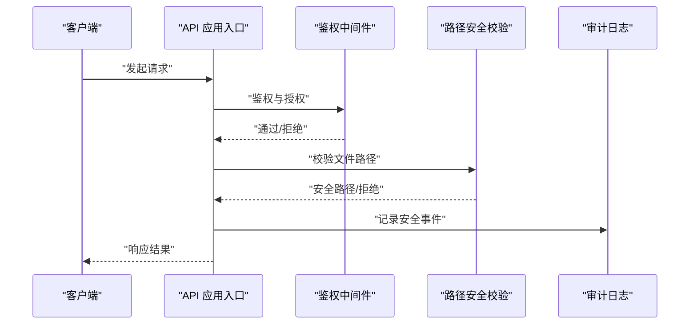
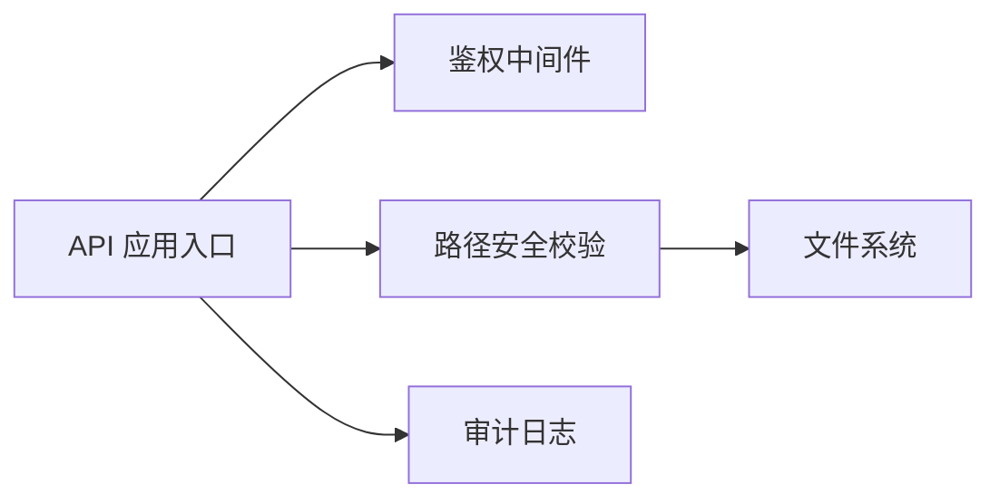

# 安全加固

<cite>
**本文引用的文件**   
- [src/paper_format_corrector/infra/path_security.py](file://src/paper_format_corrector/infra/path_security.py)
- [src/paper_format_corrector/interfaces/api/app.py](file://src/paper_format_corrector/interfaces/api/app.py)
- [src/paper_format_corrector/infra/logger.py](file://src/paper_format_corrector/infra/logger.py)
- [config/config.yaml](file://config/config.yaml)
- [tests/test_path_security.py](file://tests/test_path_security.py)
</cite>

## 目录
1. [简介](#简介)
2. [项目结构](#项目结构)
3. [核心组件](#核心组件)
4. [架构总览](#架构总览)
5. [详细组件分析](#详细组件分析)
6. [依赖分析](#依赖分析)
7. [性能考虑](#性能考虑)
8. [故障排查指南](#故障排查指南)
9. [结论](#结论)
10. [附录](#附录)

## 简介
本指南面向部署与运维人员，提供针对“论文格式矫正工具”的安全加固配置与实践建议。内容覆盖访问控制与身份认证、数据加密（传输与存储）、网络安全（防火墙、SSL/HTTPS）、漏洞防护（输入校验、SQL注入、XSS）、安全审计与合规检查、以及安全事件响应与威胁检测。由于当前仓库未内置完整的鉴权与网络服务实现，本文在给出通用最佳实践的同时，结合现有代码中的路径安全与日志能力，提供可落地的落地方案与集成点。

## 项目结构
与安全相关的现有代码主要集中在以下位置：
- 路径安全校验：用于限制文件路径访问范围，防止越权读取或写入
- API 应用入口：作为后续接入鉴权中间件、限流、审计的扩展点
- 日志模块：用于记录安全相关事件（登录、授权失败、异常等）
- 配置文件：集中管理敏感参数与开关项
- 测试用例：验证路径安全策略是否生效

**图表来源**
- [src/paper_format_corrector/interfaces/api/app.py](file://src/paper_format_corrector/interfaces/api/app.py)
- [src/paper_format_corrector/infra/path_security.py](file://src/paper_format_corrector/infra/path_security.py)
- [src/paper_format_corrector/infra/logger.py](file://src/paper_format_corrector/infra/logger.py)
- [config/config.yaml](file://config/config.yaml)
- [tests/test_path_security.py](file://tests/test_path_security.py)

**章节来源**
- [src/paper_format_corrector/interfaces/api/app.py](file://src/paper_format_corrector/interfaces/api/app.py)
- [src/paper_format_corrector/infra/path_security.py](file://src/paper_format_corrector/infra/path_security.py)
- [src/paper_format_corrector/infra/logger.py](file://src/paper_format_corrector/infra/logger.py)
- [config/config.yaml](file://config/config.yaml)
- [tests/test_path_security.py](file://tests/test_path_security.py)

## 核心组件
- 路径安全校验
  - 作用：对文件路径进行白名单与规范化处理，避免路径穿越与越权访问
  - 关键点：统一根目录、拒绝相对路径逃逸、严格类型与长度校验、最小权限原则
- API 应用入口
  - 作用：承载路由与中间件挂载点，便于接入鉴权、限流、审计、CORS 等安全能力
- 日志模块
  - 作用：输出结构化安全日志（如认证失败、权限不足、非法路径访问），支持告警与审计
- 配置文件
  - 作用：集中存放密钥、证书路径、白名单、开关项等敏感配置，配合环境变量与密钥管理服务

**章节来源**
- [src/paper_format_corrector/infra/path_security.py](file://src/paper_format_corrector/infra/path_security.py)
- [src/paper_format_corrector/interfaces/api/app.py](file://src/paper_format_corrector/interfaces/api/app.py)
- [src/paper_format_corrector/infra/logger.py](file://src/paper_format_corrector/infra/logger.py)
- [config/config.yaml](file://config/config.yaml)

## 架构总览
下图展示了一个典型的安全加固后的系统边界与关键组件交互。该图为概念性架构图，用于指导部署与集成，不直接映射到具体源码文件。

[此图为概念性架构图，无需图表来源]

## 详细组件分析

### 路径安全校验组件
- 设计目标
  - 防止路径穿越与越权访问
  - 确保所有文件操作均在受控目录内执行
- 关键流程
  - 接收原始路径
  - 规范化并解析为绝对路径
  - 校验是否在允许根目录下
  - 拒绝包含非法字符或超出长度的路径
  - 返回安全路径或拒绝访问
- 复杂度与性能
  - 时间复杂度：O(n)，n 为路径长度
  - 空间复杂度：O(1)，仅使用常量额外空间
- 错误处理
  - 非法路径立即拒绝，记录审计日志
  - 对异常路径片段进行隔离，避免二次解析风险
- 优化建议
  - 缓存允许的根目录集合
  - 批量路径预检时合并重复前缀判断

**图表来源**
- [src/paper_format_corrector/infra/path_security.py](file://src/paper_format_corrector/infra/path_security.py)

**章节来源**
- [src/paper_format_corrector/infra/path_security.py](file://src/paper_format_corrector/infra/path_security.py)
- [tests/test_path_security.py](file://tests/test_path_security.py)

### API 应用入口与安全中间件集成点
- 集成建议
  - 在应用启动阶段加载鉴权中间件（如 JWT 校验、OAuth2 回调）
  - 启用请求体大小限制、超时与重试上限
  - 开启 CORS 白名单与严格方法限制
  - 将路径安全校验封装为装饰器或中间件，对所有涉及文件操作的接口强制启用
- 审计与日志
  - 在鉴权失败、权限不足、非法路径访问等场景输出结构化日志
  - 关联请求 ID、用户标识、资源路径、结果码，便于追踪与取证

**图表来源**
- [src/paper_format_corrector/interfaces/api/app.py](file://src/paper_format_corrector/interfaces/api/app.py)
- [src/paper_format_corrector/infra/path_security.py](file://src/paper_format_corrector/infra/path_security.py)
- [src/paper_format_corrector/infra/logger.py](file://src/paper_format_corrector/infra/logger.py)

**章节来源**
- [src/paper_format_corrector/interfaces/api/app.py](file://src/paper_format_corrector/interfaces/api/app.py)
- [src/paper_format_corrector/infra/logger.py](file://src/paper_format_corrector/infra/logger.py)

## 依赖分析
- 组件耦合
  - API 应用入口依赖鉴权与路径安全模块
  - 路径安全模块独立性强，适合复用为通用库
  - 日志模块被多处调用，需保证线程安全与异步友好
- 外部依赖
  - 建议使用反向代理（Nginx/Traefik）做 TLS 终止与基础防护
  - 数据库与对象存储应启用传输加密与静态加密
- 潜在循环依赖
  - 避免在路径安全模块中引入业务逻辑，保持单向依赖

**图表来源**
- [src/paper_format_corrector/interfaces/api/app.py](file://src/paper_format_corrector/interfaces/api/app.py)
- [src/paper_format_corrector/infra/path_security.py](file://src/paper_format_corrector/infra/path_security.py)
- [src/paper_format_corrector/infra/logger.py](file://src/paper_format_corrector/infra/logger.py)

**章节来源**
- [src/paper_format_corrector/interfaces/api/app.py](file://src/paper_format_corrector/interfaces/api/app.py)
- [src/paper_format_corrector/infra/path_security.py](file://src/paper_format_corrector/infra/path_security.py)
- [src/paper_format_corrector/infra/logger.py](file://src/paper_format_corrector/infra/logger.py)

## 性能考虑
- 路径安全校验开销低，但应避免在热路径中进行复杂正则匹配；优先使用字符串前缀与规范化比较
- 鉴权中间件建议采用无状态令牌（如 JWT）以减少会话存储压力
- 日志写入采用异步队列与批处理，降低 I/O 阻塞
- 反向代理层启用连接复用与 HTTP/2，减少握手开销

[本节为通用指导，无需章节来源]

## 故障排查指南
- 常见问题
  - 路径穿越拦截误报：检查规范化逻辑与根目录配置
  - 鉴权失败频繁：核对令牌签名、过期时间与算法
  - 日志缺失：确认日志级别与输出目标，检查权限与磁盘空间
- 定位步骤
  - 查看审计日志中的错误码与上下文信息
  - 复现请求并附加调试标记（如请求 ID）
  - 逐步禁用中间件以隔离问题域
- 恢复措施
  - 修正配置后重启服务
  - 清理临时文件与锁文件
  - 回滚最近变更并观察指标

**章节来源**
- [src/paper_format_corrector/infra/logger.py](file://src/paper_format_corrector/infra/logger.py)
- [tests/test_path_security.py](file://tests/test_path_security.py)

## 结论
通过对路径安全的强化、在 API 入口集成鉴权与审计、并在反向代理层完成 TLS 终止与基础防护，可在现有代码基础上构建一套完整的安全加固体系。建议持续完善输入校验、速率限制、敏感数据加密与合规审计，形成闭环的安全运营机制。

[本节为总结性内容，无需章节来源]

## 附录

### 访问控制与身份认证配置要点
- 用户权限管理
  - 基于角色的访问控制（RBAC）：角色-权限-资源的分层模型
  - 最小权限原则：默认拒绝，按需授予
  - 会话与会话固定防护：绑定设备指纹、IP 白名单、短生命周期令牌
- API 访问控制
  - 网关级鉴权：统一入口校验令牌与签名
  - 细粒度授权：按资源与方法维度控制
  - 审计：记录鉴权决策与结果

[本节为通用指导，无需章节来源]

### 数据加密措施
- 传输加密
  - 强制 HTTPS，禁用旧版 TLS 与弱密码套件
  - 启用 HSTS、OCSP Stapling、证书固定（可选）
- 存储加密
  - 数据库字段级加密（敏感字段）
  - 对象存储与服务端加密（SSE-KMS/SSE-S3）
  - 备份与归档加密，密钥轮换与分离存储

[本节为通用指导，无需章节来源]

### 网络安全配置
- 防火墙规则
  - 仅开放必要端口（如 443/8443）
  - 源 IP 白名单与地域限制
- SSL 证书与 HTTPS
  - 使用权威 CA 签发的证书
  - 定期自动续期与监控到期时间
  - 配置强密码套件与协议版本

[本节为通用指导，无需章节来源]

### 安全漏洞防护措施
- 输入验证
  - 服务端白名单校验与严格类型约束
  - 长度、格式、枚举值校验
- SQL 注入防护
  - 使用参数化查询与 ORM
  - 禁止拼接 SQL 语句
- XSS 防护
  - 输出编码与 CSP 策略
  - 富文本白名单过滤与沙箱渲染

[本节为通用指导，无需章节来源]

### 安全审计与合规性检查
- 审计日志
  - 记录认证、授权、数据访问、配置变更
  - 结构化字段：时间戳、用户、资源、动作、结果、来源
- 合规检查
  - 自动化扫描：依赖漏洞、配置基线、镜像扫描
  - 定期渗透测试与红蓝对抗演练

[本节为通用指导，无需章节来源]

### 安全事件响应与威胁检测
- 威胁检测
  - 行为基线与异常阈值（登录失败、高频访问、异常路径）
  - SIEM 聚合与告警规则
- 事件响应
  - 预案与分级响应流程
  - 证据保全与复盘改进

[本节为通用指导，无需章节来源]