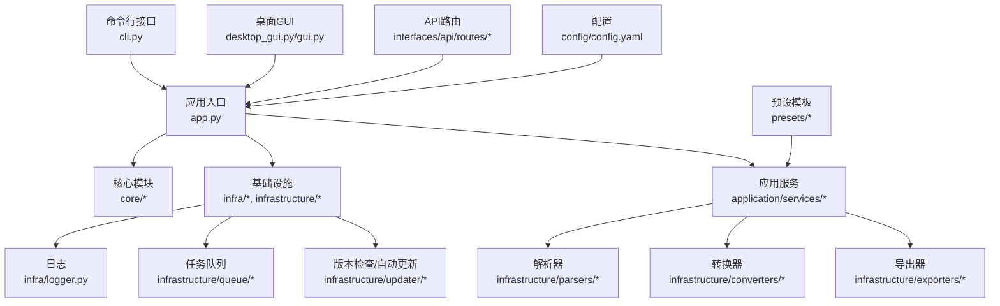
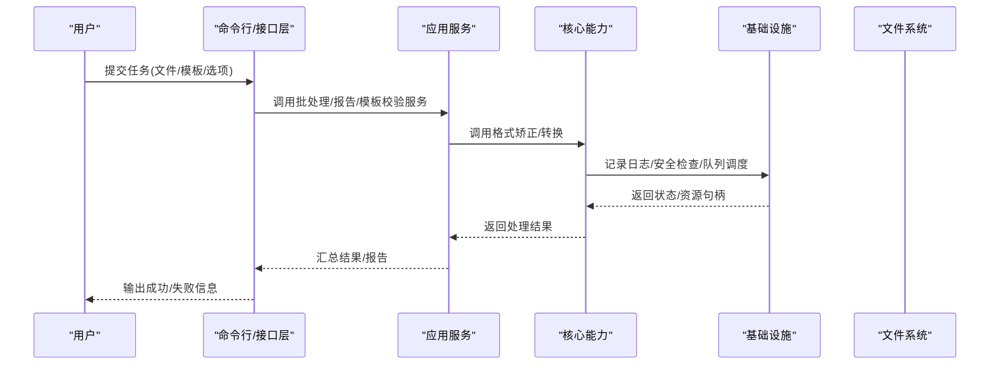
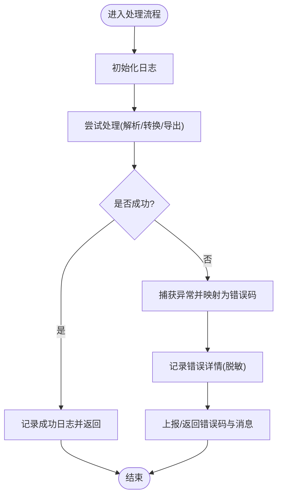
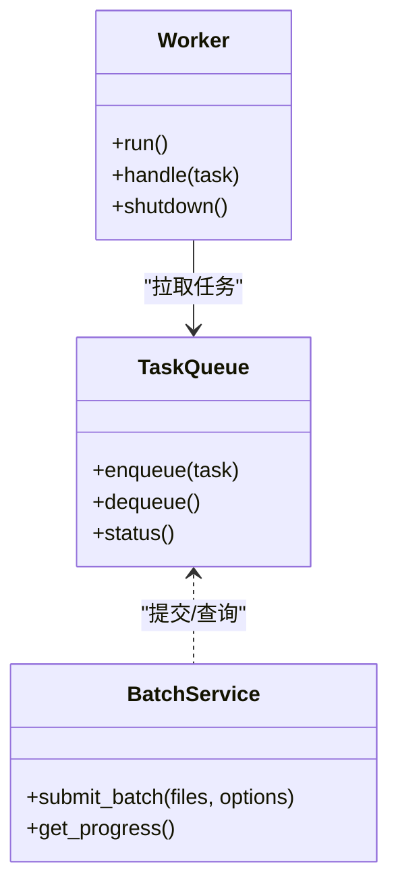
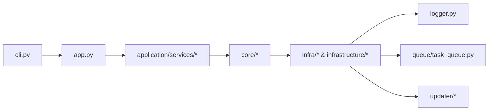

# 故障排查与FAQ

<cite>
**本文引用的文件**   
- [README.md](file://README.md)
- [src/paper_format_corrector/__main__.py](file://src/paper_format_corrector/__main__.py)
- [src/paper_format_corrector/app.py](file://src/paper_format_corrector/app.py)
- [src/paper_format_corrector/cli.py](file://src/paper_format_corrector/cli.py)
- [src/paper_format_corrector/infra/logger.py](file://src/paper_format_corrector/infra/logger.py)
- [src/paper_format_corrector/infra/path_security.py](file://src/paper_format_corrector/infra/path_security.py)
- [src/paper_format_corrector/core/format_corrector.py](file://src/paper_format_corrector/core/format_corrector.py)
- [src/paper_format_corrector/core/file_converter.py](file://src/paper_format_corrector/core/file_converter.py)
- [src/paper_format_corrector/application/services/batch_service.py](file://src/paper_format_corrector/application/services/batch_service.py)
- [src/paper_format_corrector/application/services/report_service.py](file://src/paper_format_corrector/application/services/report_service.py)
- [src/paper_format_corrector/application/services/template_validation_service.py](file://src/paper_format_corrector/application/services/template_validation_service.py)
- [src/paper_format_corrector/infrastructure/parsers/document_analyzer.py](file://src/paper_format_corrector/infrastructure/parsers/document_analyzer.py)
- [src/paper_format_corrector/infrastructure/converters/file_converter.py](file://src/paper_format_corrector/infrastructure/converters/file_converter.py)
- [src/paper_format_corrector/infrastructure/exporters/format_exporter.py](file://src/paper_format_corrector/infrastructure/exporters/format_exporter.py)
- [src/paper_format_corrector/infrastructure/queue/task_queue.py](file://src/paper_format_corrector/infrastructure/queue/task_queue.py)
- [src/paper_format_corrector/infrastructure/updater/version_checker.py](file://src/paper_format_corrector/infrastructure/updater/version_checker.py)
- [src/paper_format_corrector/infrastructure/updater/auto_updater.py](file://src/paper_format_corrector/infrastructure/updater/auto_updater.py)
- [src/paper_format_corrector/interfaces/api/routes/correct_routes.py](file://src/paper_format_corrector/interfaces/api/routes/correct_routes.py)
- [src/paper_format_corrector/interfaces/api/routes/template_routes.py](file://src/paper_format_corrector/interfaces/api/routes/template_routes.py)
- [src/paper_format_corrector/shared/utils/error_codes.py](file://src/paper_format_corrector/shared/utils/error_codes.py)
- [config/config.yaml](file://config/config.yaml)
- [examples/sample_template.yaml](file://examples/sample_template.yaml)
- [tests/test_cli_integration.py](file://tests/test_cli_integration.py)
- [tests/test_task_queue.py](file://tests/test_task_queue.py)
</cite>

## 目录
1. [简介](#简介)
2. [项目结构](#项目结构)
3. [核心组件](#核心组件)
4. [架构总览](#架构总览)
5. [详细组件分析](#详细组件分析)
6. [依赖关系分析](#依赖关系分析)
7. [性能注意事项](#性能注意事项)
8. [故障排查指南](#故障排查指南)
9. [常见问题解答](#常见问题解答)
10. [结论](#结论)
11. [附录](#附录)

## 简介
本文件面向最终用户与运维人员，提供系统性的问题诊断方法、常见错误快速修复、日志分析与错误码解读、性能瓶颈定位、调试工具与技巧、反馈与升级路径、社区支持渠道以及性能调优建议。目标是帮助用户在遇到安装、运行、模板配置、批量处理、API调用、插件扩展等问题时，能快速定位并解决。

## 项目结构
本项目采用分层与模块化组织方式：
- 入口与界面：命令行、桌面GUI、Web API
- 应用服务：批处理、报告生成、模板校验等
- 核心能力：格式矫正、文档解析、转换与导出
- 基础设施：日志、路径安全、队列、更新器、外部工具适配
- 配置与预设：全局配置、模板索引与示例模板
- 测试：集成与单元测试覆盖关键流程

图表来源
- [src/paper_format_corrector/cli.py](file://src/paper_format_corrector/cli.py)
- [src/paper_format_corrector/app.py](file://src/paper_format_corrector/app.py)
- [src/paper_format_corrector/core/format_corrector.py](file://src/paper_format_corrector/core/format_corrector.py)
- [src/paper_format_corrector/infra/logger.py](file://src/paper_format_corrector/infra/logger.py)
- [src/paper_format_corrector/infrastructure/queue/task_queue.py](file://src/paper_format_corrector/infrastructure/queue/task_queue.py)
- [src/paper_format_corrector/infrastructure/updater/version_checker.py](file://src/paper_format_corrector/infrastructure/updater/version_checker.py)
- [config/config.yaml](file://config/config.yaml)

章节来源
- [README.md](file://README.md)
- [src/paper_format_corrector/__main__.py](file://src/paper_format_corrector/__main__.py)
- [src/paper_format_corrector/app.py](file://src/paper_format_corrector/app.py)
- [src/paper_format_corrector/cli.py](file://src/paper_format_corrector/cli.py)
- [config/config.yaml](file://config/config.yaml)

## 核心组件
- 命令行与入口
  - 负责参数解析、启动引导、基础日志初始化与异常兜底输出。
- 应用服务
  - 批处理服务：管理多文件任务编排、进度与结果聚合。
  - 报告服务：生成格式化质量报告与差异对比。
  - 模板校验服务：验证模板结构与字段合法性。
- 核心能力
  - 格式矫正器：基于规则与模板对文档进行结构化修正。
  - 文件转换器：在不同格式间进行读写与中间表示转换。
- 基础设施
  - 日志：统一日志级别、输出目标与轮转策略。
  - 路径安全：校验输入路径、防止越权访问。
  - 任务队列：异步任务调度与并发控制。
  - 更新器：版本检查与自动更新流程。
- 解析与转换
  - 文档分析器：抽取章节、表格、图片、引用等元素。
  - 转换器/导出器：实现docx/pdf/latex等格式的读写与导出。

章节来源
- [src/paper_format_corrector/application/services/batch_service.py](file://src/paper_format_corrector/application/services/batch_service.py)
- [src/paper_format_corrector/application/services/report_service.py](file://src/paper_format_corrector/application/services/report_service.py)
- [src/paper_format_corrector/application/services/template_validation_service.py](file://src/paper_format_corrector/application/services/template_validation_service.py)
- [src/paper_format_corrector/core/format_corrector.py](file://src/paper_format_corrector/core/format_corrector.py)
- [src/paper_format_corrector/core/file_converter.py](file://src/paper_format_corrector/core/file_converter.py)
- [src/paper_format_corrector/infra/logger.py](file://src/paper_format_corrector/infra/logger.py)
- [src/paper_format_corrector/infra/path_security.py](file://src/paper_format_corrector/infra/path_security.py)
- [src/paper_format_corrector/infrastructure/parsers/document_analyzer.py](file://src/paper_format_corrector/infrastructure/parsers/document_analyzer.py)
- [src/paper_format_corrector/infrastructure/converters/file_converter.py](file://src/paper_format_corrector/infrastructure/converters/file_converter.py)
- [src/paper_format_corrector/infrastructure/exporters/format_exporter.py](file://src/paper_format_corrector/infrastructure/exporters/format_exporter.py)

## 架构总览
整体采用“接口层 -> 应用服务 -> 核心能力 -> 基础设施”的分层架构。接口层暴露CLI、GUI与API；应用服务编排业务流；核心能力执行具体格式处理；基础设施提供通用支撑（日志、队列、更新、安全）。

图表来源
- [src/paper_format_corrector/cli.py](file://src/paper_format_corrector/cli.py)
- [src/paper_format_corrector/application/services/batch_service.py](file://src/paper_format_corrector/application/services/batch_service.py)
- [src/paper_format_corrector/core/format_corrector.py](file://src/paper_format_corrector/core/format_corrector.py)
- [src/paper_format_corrector/infra/logger.py](file://src/paper_format_corrector/infra/logger.py)
- [src/paper_format_corrector/infra/path_security.py](file://src/paper_format_corrector/infra/path_security.py)

## 详细组件分析

### 日志与错误上报
- 日志配置
  - 通过统一日志模块设置级别、输出目标与轮转策略，便于集中收集与分析。
- 错误分类
  - 使用错误码体系区分IO错误、模板错误、解析错误、转换错误、网络错误等，便于前端展示与自动化处理。
- 最佳实践
  - 在关键路径埋点记录上下文（文件路径、模板名、任务ID），避免敏感信息泄露。

图表来源
- [src/paper_format_corrector/infra/logger.py](file://src/paper_format_corrector/infra/logger.py)
- [src/paper_format_corrector/shared/utils/error_codes.py](file://src/paper_format_corrector/shared/utils/error_codes.py)

章节来源
- [src/paper_format_corrector/infra/logger.py](file://src/paper_format_corrector/infra/logger.py)
- [src/paper_format_corrector/shared/utils/error_codes.py](file://src/paper_format_corrector/shared/utils/error_codes.py)

### 路径安全与输入校验
- 作用
  - 校验输入文件路径的合法性与安全性，防止越权访问与非法字符注入。
- 典型问题
  - 相对路径解析异常、符号链接绕过、权限不足导致无法读取。
- 修复建议
  - 使用绝对路径或规范化路径；确保运行用户对目标路径有读/写权限；避免包含危险字符。

章节来源
- [src/paper_format_corrector/infra/path_security.py](file://src/paper_format_corrector/infra/path_security.py)

### 任务队列与并发
- 作用
  - 将耗时任务入队，按策略调度执行，避免阻塞主线程。
- 常见问题
  - 队列堆积、Worker进程崩溃、任务重复消费。
- 诊断要点
  - 检查队列持久化目录、Worker日志、任务重试与死信队列。

图表来源
- [src/paper_format_corrector/infrastructure/queue/task_queue.py](file://src/paper_format_corrector/infrastructure/queue/task_queue.py)
- [src/paper_format_corrector/application/services/batch_service.py](file://src/paper_format_corrector/application/services/batch_service.py)

章节来源
- [src/paper_format_corrector/infrastructure/queue/task_queue.py](file://src/paper_format_corrector/infrastructure/queue/task_queue.py)
- [src/paper_format_corrector/application/services/batch_service.py](file://src/paper_format_corrector/application/services/batch_service.py)
- [tests/test_task_queue.py](file://tests/test_task_queue.py)

### 模板校验与导入
- 作用
  - 校验模板结构、必填字段与约束条件，保障后续处理稳定。
- 常见问题
  - 模板缺失字段、类型不匹配、引用不存在。
- 修复建议
  - 参考示例模板补齐字段；使用模板校验服务预检；保持模板版本与程序兼容。

章节来源
- [src/paper_format_corrector/application/services/template_validation_service.py](file://src/paper_format_corrector/application/services/template_validation_service.py)
- [examples/sample_template.yaml](file://examples/sample_template.yaml)

### 文档解析与转换
- 解析器
  - 抽取章节、段落、表格、图片、引用等元素，构建中间表示。
- 转换器/导出器
  - 将中间表示写入docx/pdf/latex等目标格式。
- 常见问题
  - 复杂表格嵌套、图片尺寸异常、样式丢失。
- 优化建议
  - 预处理文档简化结构；限制图片大小；启用增量导出。

章节来源
- [src/paper_format_corrector/infrastructure/parsers/document_analyzer.py](file://src/paper_format_corrector/infrastructure/parsers/document_analyzer.py)
- [src/paper_format_corrector/infrastructure/converters/file_converter.py](file://src/paper_format_corrector/infrastructure/converters/file_converter.py)
- [src/paper_format_corrector/infrastructure/exporters/format_exporter.py](file://src/paper_format_corrector/infrastructure/exporters/format_exporter.py)

### API路由与错误响应
- 作用
  - 暴露矫正、模板管理等REST接口，统一错误码与响应体。
- 常见问题
  - 请求参数缺失、模板未加载、超时。
- 修复建议
  - 校验请求体；预热模板缓存；调整超时与重试策略。

章节来源
- [src/paper_format_corrector/interfaces/api/routes/correct_routes.py](file://src/paper_format_corrector/interfaces/api/routes/correct_routes.py)
- [src/paper_format_corrector/interfaces/api/routes/template_routes.py](file://src/paper_format_corrector/interfaces/api/routes/template_routes.py)

### 版本检查与自动更新
- 作用
  - 检查新版本并提示或自动更新。
- 常见问题
  - 网络不可达、签名校验失败、权限不足。
- 修复建议
  - 配置代理与证书；以管理员权限运行；手动下载更新包。

章节来源
- [src/paper_format_corrector/infrastructure/updater/version_checker.py](file://src/paper_format_corrector/infrastructure/updater/version_checker.py)
- [src/paper_format_corrector/infrastructure/updater/auto_updater.py](file://src/paper_format_corrector/infrastructure/updater/auto_updater.py)

## 依赖关系分析
- 组件耦合
  - 应用服务依赖核心能力与基础设施；接口层仅依赖应用服务与基础设施。
- 外部依赖
  - 文档处理库、网络请求库、序列化库等。
- 潜在循环依赖
  - 注意基础设施不应反向依赖应用服务；通过接口抽象解耦。

图表来源
- [src/paper_format_corrector/cli.py](file://src/paper_format_corrector/cli.py)
- [src/paper_format_corrector/app.py](file://src/paper_format_corrector/app.py)
- [src/paper_format_corrector/infra/logger.py](file://src/paper_format_corrector/infra/logger.py)
- [src/paper_format_corrector/infrastructure/queue/task_queue.py](file://src/paper_format_corrector/infrastructure/queue/task_queue.py)
- [src/paper_format_corrector/infrastructure/updater/version_checker.py](file://src/paper_format_corrector/infrastructure/updater/version_checker.py)

章节来源
- [src/paper_format_corrector/app.py](file://src/paper_format_corrector/app.py)
- [src/paper_format_corrector/cli.py](file://src/paper_format_corrector/cli.py)

## 性能注意事项
- I/O密集
  - 批量处理时启用并行队列；合理设置Worker数量；避免频繁小文件I/O。
- CPU密集
  - 解析与转换阶段尽量复用对象；减少不必要的深拷贝。
- 内存占用
  - 大文档分块处理；及时释放临时文件与缓存。
- 网络
  - 更新与远程模板拉取增加重试与超时控制；启用连接池。

[本节为通用指导，无需特定文件来源]

## 故障排查指南

### 一、日志分析
- 查看日志位置与级别
  - 确认日志输出目录与当前级别（DEBUG/INFO/WARNING/ERROR）。
- 关键字检索
  - 搜索“错误码”、“异常堆栈”、“任务ID”、“模板名称”、“文件路径”。
- 关联上下文
  - 结合请求ID/任务ID串联一次处理的完整链路。

章节来源
- [src/paper_format_corrector/infra/logger.py](file://src/paper_format_corrector/infra/logger.py)

### 二、错误代码解读
- 分类
  - IO错误、模板错误、解析错误、转换错误、网络错误、权限错误等。
- 定位
  - 根据错误码前缀快速定位子系统；结合日志上下文确定根因。
- 处置
  - 针对每类错误给出快速修复步骤与预防措施。

章节来源
- [src/paper_format_corrector/shared/utils/error_codes.py](file://src/paper_format_corrector/shared/utils/error_codes.py)

### 三、性能瓶颈定位
- 指标采集
  - 记录各阶段耗时（解析、转换、导出）、队列等待时间、Worker利用率。
- 热点识别
  - 关注CPU峰值与内存尖峰；定位大对象与长事务。
- 优化手段
  - 调整并发度、启用缓存、减少序列化开销、合并小任务。

章节来源
- [src/paper_format_corrector/infrastructure/queue/task_queue.py](file://src/paper_format_corrector/infrastructure/queue/task_queue.py)
- [src/paper_format_corrector/application/services/batch_service.py](file://src/paper_format_corrector/application/services/batch_service.py)

### 四、常见问题快速修复
- 无法读取输入文件
  - 检查路径是否存在、权限是否足够、路径是否被安全策略拦截。
- 模板加载失败
  - 校验模板字段完整性与类型；使用模板校验服务预检。
- 转换后样式丢失
  - 检查目标格式支持特性；必要时回退到docx中间格式。
- 批量任务卡住
  - 检查队列持久化目录、Worker进程存活、磁盘空间。
- API超时
  - 增大超时阈值；拆分任务；启用异步处理。

章节来源
- [src/paper_format_corrector/infra/path_security.py](file://src/paper_format_corrector/infra/path_security.py)
- [src/paper_format_corrector/application/services/template_validation_service.py](file://src/paper_format_corrector/application/services/template_validation_service.py)
- [src/paper_format_corrector/infrastructure/converters/file_converter.py](file://src/paper_format_corrector/infrastructure/converters/file_converter.py)
- [src/paper_format_corrector/infrastructure/queue/task_queue.py](file://src/paper_format_corrector/infrastructure/queue/task_queue.py)
- [src/paper_format_corrector/interfaces/api/routes/correct_routes.py](file://src/paper_format_corrector/interfaces/api/routes/correct_routes.py)

### 五、调试工具与技巧
- 命令行调试
  - 使用最小复现用例；开启详细日志；逐步关闭功能定位问题。
- 单元测试辅助
  - 参考现有测试用例构造输入数据与断言。
- 隔离环境
  - 使用虚拟环境固定依赖版本；避免系统库冲突。

章节来源
- [tests/test_cli_integration.py](file://tests/test_cli_integration.py)
- [tests/test_task_queue.py](file://tests/test_task_queue.py)

### 六、问题反馈与升级路径
- 反馈渠道
  - 提交Issue时附上：版本号、操作系统、日志片段、错误码、复现步骤。
- 升级路径
  - 先检查版本更新；若仍存在问题，升级到最新稳定版再复现。
- 回滚策略
  - 保留上一版本可执行与配置，出现问题快速回滚。

章节来源
- [src/paper_format_corrector/infrastructure/updater/version_checker.py](file://src/paper_format_corrector/infrastructure/updater/version_checker.py)
- [src/paper_format_corrector/infrastructure/updater/auto_updater.py](file://src/paper_format_corrector/infrastructure/updater/auto_updater.py)

### 七、社区支持与帮助
- 获取帮助
  - 查阅文档与示例模板；在社区论坛提问并提供必要上下文。
- 贡献指南
  - 遵循贡献规范，提交PR附带测试与变更说明。

章节来源
- [README.md](file://README.md)

## 常见问题解答

- Q1：为什么我的文档无法被正确解析？
  - A：检查文档结构是否符合预期；查看解析日志中的警告；必要时简化文档结构或使用docx中间格式。
  - 相关来源
    - [src/paper_format_corrector/infrastructure/parsers/document_analyzer.py](file://src/paper_format_corrector/infrastructure/parsers/document_analyzer.py)

- Q2：批量任务完成后没有输出报告？
  - A：确认报告服务已启用且输出目录可写；检查任务完成状态与错误码。
  - 相关来源
    - [src/paper_format_corrector/application/services/report_service.py](file://src/paper_format_corrector/application/services/report_service.py)

- Q3：API返回4xx/5xx错误如何定位？
  - A：根据错误码定位子系统；查看对应路由日志；检查请求参数与模板状态。
  - 相关来源
    - [src/paper_format_corrector/interfaces/api/routes/correct_routes.py](file://src/paper_format_corrector/interfaces/api/routes/correct_routes.py)
    - [src/paper_format_corrector/shared/utils/error_codes.py](file://src/paper_format_corrector/shared/utils/error_codes.py)

- Q4：自动更新失败怎么办？
  - A：检查网络连接与代理设置；确认签名校验证书；必要时手动下载安装包。
  - 相关来源
    - [src/paper_format_corrector/infrastructure/updater/version_checker.py](file://src/paper_format_corrector/infrastructure/updater/version_checker.py)
    - [src/paper_format_corrector/infrastructure/updater/auto_updater.py](file://src/paper_format_corrector/infrastructure/updater/auto_updater.py)

- Q5：如何处理超大文档？
  - A：启用分块处理；降低并发度；增加内存与磁盘空间；优先使用docx中间格式。
  - 相关来源
    - [src/paper_format_corrector/infrastructure/converters/file_converter.py](file://src/paper_format_corrector/infrastructure/converters/file_converter.py)
    - [src/paper_format_corrector/infrastructure/exporters/format_exporter.py](file://src/paper_format_corrector/infrastructure/exporters/format_exporter.py)

## 结论
通过统一的日志与错误码体系、清晰的分层架构与完善的测试覆盖，本工具提供了稳定的文档格式处理能力。配合本文的故障排查方法与性能优化建议，用户可以高效定位并解决问题，获得更佳的体验。

## 附录

### A. 配置项速查
- 全局配置
  - 日志级别、输出路径、队列参数、超时与重试策略等。
- 模板配置
  - 必填字段、样式映射、导出选项等。

章节来源
- [config/config.yaml](file://config/config.yaml)
- [examples/sample_template.yaml](file://examples/sample_template.yaml)

### B. 入口与启动
- 命令行入口
  - 通过__main__与cli模块启动，支持常用子命令与参数。
- 应用入口
  - app.py负责初始化依赖、加载配置、注册路由与服务。

章节来源
- [src/paper_format_corrector/__main__.py](file://src/paper_format_corrector/__main__.py)
- [src/paper_format_corrector/app.py](file://src/paper_format_corrector/app.py)
- [src/paper_format_corrector/cli.py](file://src/paper_format_corrector/cli.py)