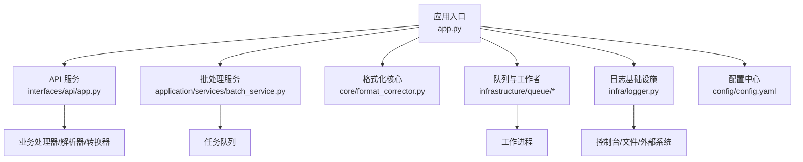
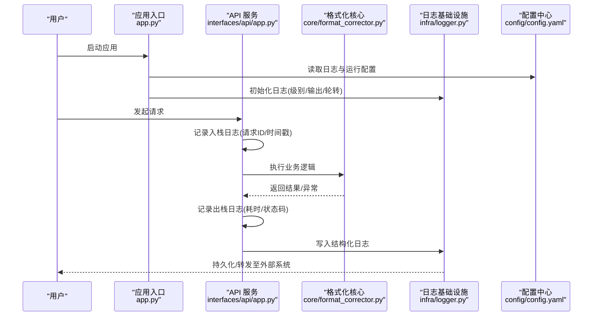
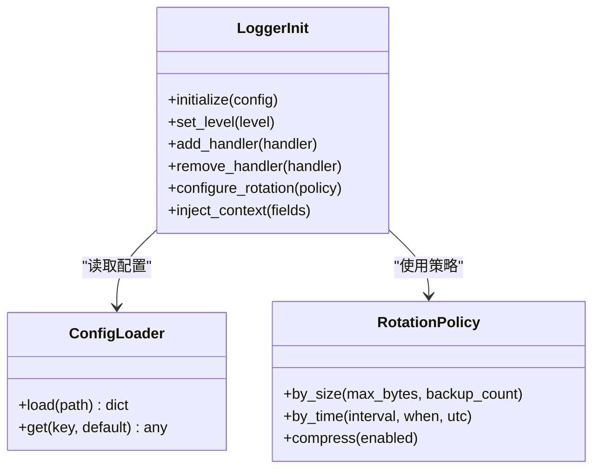
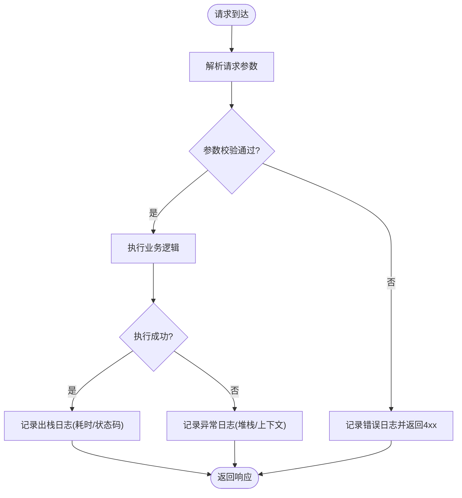
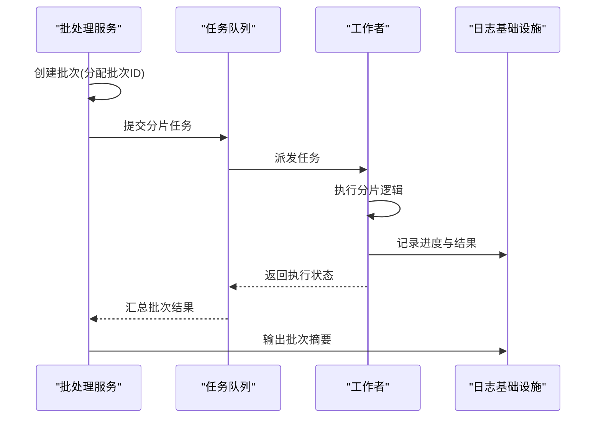
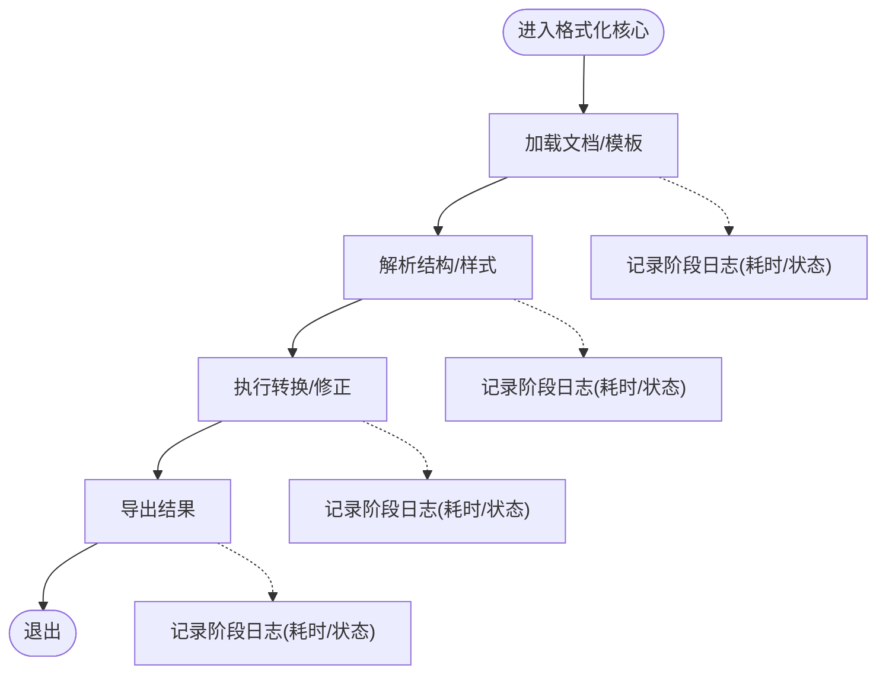
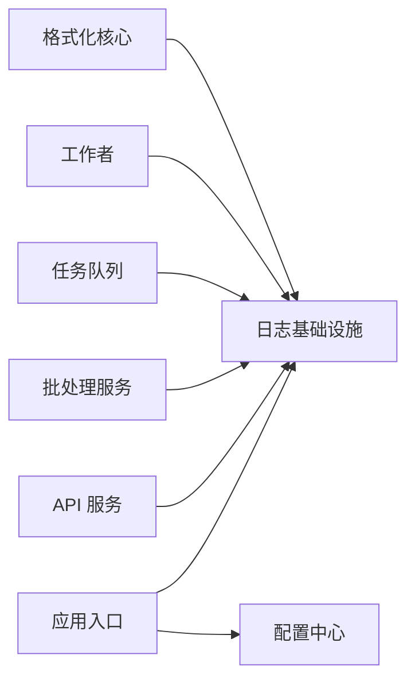

# 监控与日志

<cite>
**本文引用的文件**   
- [src/paper_format_corrector/infra/logger.py](file://src/paper_format_corrector/infra/logger.py)
- [config/config.yaml](file://config/config.yaml)
- [src/paper_format_corrector/app.py](file://src/paper_format_corrector/app.py)
- [src/paper_format_corrector/interfaces/api/app.py](file://src/paper_format_corrector/interfaces/api/app.py)
- [src/paper_format_corrector/application/services/batch_service.py](file://src/paper_format_corrector/application/services/batch_service.py)
- [src/paper_format_corrector/core/format_corrector.py](file://src/paper_format_corrector/core/format_corrector.py)
- [src/paper_format_corrector/infrastructure/queue/task_queue.py](file://src/paper_format_corrector/infrastructure/queue/task_queue.py)
- [src/paper_format_corrector/infrastructure/queue/worker.py](file://src/paper_format_corrector/infrastructure/queue/worker.py)
- [pyproject.toml](file://pyproject.toml)
- [requirements.txt](file://requirements.txt)
</cite>

## 目录
1. [简介](#简介)
2. [项目结构](#项目结构)
3. [核心组件](#核心组件)
4. [架构总览](#架构总览)
5. [详细组件分析](#详细组件分析)
6. [依赖分析](#依赖分析)
7. [性能考虑](#性能考虑)
8. [故障排查指南](#故障排查指南)
9. [结论](#结论)
10. [附录](#附录)

## 简介
本指南聚焦于“论文格式矫正工具”的监控与日志管理，覆盖以下主题：
- 应用日志配置与管理：日志级别、输出目标、轮转与存储策略
- 性能监控指标：处理速度、内存使用、资源消耗的定义与采集方法
- 错误追踪与异常处理：统一异常捕获、上下文信息记录与可观测性增强
- 第三方监控集成：Prometheus、Grafana 等工具的接入方案
- 告警规则与通知机制：阈值告警、渠道通知与降噪策略
- 日志分析与问题诊断：最佳实践与常见问题的定位思路

## 项目结构
本项目采用分层与模块化组织方式。与监控和日志相关的关键位置包括：
- 基础设施层：统一的日志初始化与配置（logger）
- 应用入口：应用启动时加载配置并初始化日志
- API 服务：HTTP 请求链路中的日志埋点与异常上报
- 批处理与服务：任务执行过程中的关键步骤日志
- 队列与工作者：异步任务的调度、执行与失败重试日志
- 配置文件：集中化的日志与运行时参数

图表来源
- [src/paper_format_corrector/app.py](file://src/paper_format_corrector/app.py)
- [src/paper_format_corrector/interfaces/api/app.py](file://src/paper_format_corrector/interfaces/api/app.py)
- [src/paper_format_corrector/application/services/batch_service.py](file://src/paper_format_corrector/application/services/batch_service.py)
- [src/paper_format_corrector/core/format_corrector.py](file://src/paper_format_corrector/core/format_corrector.py)
- [src/paper_format_corrector/infra/logger.py](file://src/paper_format_corrector/infra/logger.py)
- [config/config.yaml](file://config/config.yaml)

章节来源
- [src/paper_format_corrector/app.py](file://src/paper_format_corrector/app.py)
- [src/paper_format_corrector/interfaces/api/app.py](file://src/paper_format_corrector/interfaces/api/app.py)
- [src/paper_format_corrector/application/services/batch_service.py](file://src/paper_format_corrector/application/services/batch_service.py)
- [src/paper_format_corrector/core/format_corrector.py](file://src/paper_format_corrector/core/format_corrector.py)
- [src/paper_format_corrector/infra/logger.py](file://src/paper_format_corrector/infra/logger.py)
- [config/config.yaml](file://config/config.yaml)

## 核心组件
- 日志基础设施模块：提供统一的日志初始化、级别控制、输出目标（控制台/文件）、结构化字段注入与可选的外部日志发送能力。建议通过配置驱动，支持动态调整级别与输出路径。
- 应用入口：在启动阶段读取配置并调用日志基础设施完成初始化；为后续各模块提供一致的日志上下文。
- API 服务：在路由层或中间件层对请求进行入栈/出栈日志记录，包含请求标识、耗时、状态码与异常摘要。
- 批处理服务：对批量任务进行分片、进度与结果汇总的日志记录，便于追踪长耗时流程。
- 队列与工作者：记录任务入队、派发、执行、重试与失败原因，结合唯一任务 ID 实现端到端追踪。
- 配置中心：集中定义日志级别、输出目标、轮转策略、采样率等参数，支持不同环境差异化配置。

章节来源
- [src/paper_format_corrector/infra/logger.py](file://src/paper_format_corrector/infra/logger.py)
- [src/paper_format_corrector/app.py](file://src/paper_format_corrector/app.py)
- [src/paper_format_corrector/interfaces/api/app.py](file://src/paper_format_corrector/interfaces/api/app.py)
- [src/paper_format_corrector/application/services/batch_service.py](file://src/paper_format_corrector/application/services/batch_service.py)
- [src/paper_format_corrector/infrastructure/queue/task_queue.py](file://src/paper_format_corrector/infrastructure/queue/task_queue.py)
- [src/paper_format_corrector/infrastructure/queue/worker.py](file://src/paper_format_corrector/infrastructure/queue/worker.py)
- [config/config.yaml](file://config/config.yaml)

## 架构总览
下图展示从应用启动到请求处理的完整链路，以及日志在各层的落点与流向。

图表来源
- [src/paper_format_corrector/app.py](file://src/paper_format_corrector/app.py)
- [src/paper_format_corrector/interfaces/api/app.py](file://src/paper_format_corrector/interfaces/api/app.py)
- [src/paper_format_corrector/core/format_corrector.py](file://src/paper_format_corrector/core/format_corrector.py)
- [src/paper_format_corrector/infra/logger.py](file://src/paper_format_corrector/infra/logger.py)
- [config/config.yaml](file://config/config.yaml)

## 详细组件分析

### 日志基础设施组件
- 职责
  - 统一初始化：根据配置设置日志级别、输出目标（控制台/文件）、格式模板与附加字段（如实例ID、环境）。
  - 轮转与存储：按大小或时间切分日志文件，保留周期与压缩策略由配置决定。
  - 结构化输出：为每条日志注入标准化字段，便于检索与分析。
  - 扩展点：预留外部日志发送接口，用于对接集中式日志平台。
- 设计要点
  - 配置驱动：所有行为通过配置文件控制，避免硬编码。
  - 线程安全：在高并发场景下保证日志写入的稳定性。
  - 降级策略：当外部系统不可用时自动回退到本地文件。

图表来源
- [src/paper_format_corrector/infra/logger.py](file://src/paper_format_corrector/infra/logger.py)
- [config/config.yaml](file://config/config.yaml)

章节来源
- [src/paper_format_corrector/infra/logger.py](file://src/paper_format_corrector/infra/logger.py)
- [config/config.yaml](file://config/config.yaml)

### API 服务组件
- 职责
  - 请求级日志：记录入栈/出栈日志，包含请求ID、路径、方法、客户端IP、耗时与状态码。
  - 异常处理：捕获未处理异常，记录堆栈与上下文，返回友好响应。
  - 指标埋点：暴露必要的 HTTP 指标（QPS、延迟分布、错误率），供监控系统抓取。
- 设计要点
  - 中间件模式：将日志与指标埋点作为通用中间件，减少重复代码。
  - 上下文传播：跨层传递请求ID，便于链路追踪。
  - 安全过滤：避免敏感信息进入日志。

图表来源
- [src/paper_format_corrector/interfaces/api/app.py](file://src/paper_format_corrector/interfaces/api/app.py)
- [src/paper_format_corrector/infra/logger.py](file://src/paper_format_corrector/infra/logger.py)

章节来源
- [src/paper_format_corrector/interfaces/api/app.py](file://src/paper_format_corrector/interfaces/api/app.py)
- [src/paper_format_corrector/infra/logger.py](file://src/paper_format_corrector/infra/logger.py)

### 批处理服务组件
- 职责
  - 任务分片与进度：记录每个分片的开始/结束时间与结果统计。
  - 失败重试与补偿：记录重试次数、失败原因与最终状态。
  - 聚合报告：生成批处理摘要日志，便于快速定位问题范围。
- 设计要点
  - 幂等性：确保重试不会导致数据不一致。
  - 可观测性：为每个批次分配唯一ID，贯穿全链路。

图表来源
- [src/paper_format_corrector/application/services/batch_service.py](file://src/paper_format_corrector/application/services/batch_service.py)
- [src/paper_format_corrector/infrastructure/queue/task_queue.py](file://src/paper_format_corrector/infrastructure/queue/task_queue.py)
- [src/paper_format_corrector/infrastructure/queue/worker.py](file://src/paper_format_corrector/infrastructure/queue/worker.py)
- [src/paper_format_corrector/infra/logger.py](file://src/paper_format_corrector/infra/logger.py)

章节来源
- [src/paper_format_corrector/application/services/batch_service.py](file://src/paper_format_corrector/application/services/batch_service.py)
- [src/paper_format_corrector/infrastructure/queue/task_queue.py](file://src/paper_format_corrector/infrastructure/queue/task_queue.py)
- [src/paper_format_corrector/infrastructure/queue/worker.py](file://src/paper_format_corrector/infrastructure/queue/worker.py)
- [src/paper_format_corrector/infra/logger.py](file://src/paper_format_corrector/infra/logger.py)

### 格式化核心组件
- 职责
  - 文档解析与转换：记录关键步骤的开始/结束时间，便于计算处理速度。
  - 异常边界：捕获解析/转换异常，记录输入源信息与错误类型。
  - 资源使用：在关键节点记录内存占用与CPU使用概况（可通过系统库获取）。
- 设计要点
  - 细粒度埋点：在主要算法阶段插入日志，形成时间线。
  - 上下文携带：将文档ID、模板版本等元数据注入日志。

图表来源
- [src/paper_format_corrector/core/format_corrector.py](file://src/paper_format_corrector/core/format_corrector.py)
- [src/paper_format_corrector/infra/logger.py](file://src/paper_format_corrector/infra/logger.py)

章节来源
- [src/paper_format_corrector/core/format_corrector.py](file://src/paper_format_corrector/core/format_corrector.py)
- [src/paper_format_corrector/infra/logger.py](file://src/paper_format_corrector/infra/logger.py)

## 依赖分析
- 内部依赖
  - 应用入口依赖日志基础设施与配置中心完成启动期初始化。
  - API 服务依赖日志基础设施进行请求级日志与异常处理。
  - 批处理服务与队列/工作者协作，共同产出任务级日志。
  - 格式化核心在关键步骤记录日志，支撑性能分析。
- 外部依赖
  - 日志轮转与输出可能依赖标准库或第三方库（例如按大小/时间轮转）。
  - 指标采集与外部日志发送需引入相应 SDK（如 Prometheus client、结构化日志发送器）。

图表来源
- [src/paper_format_corrector/app.py](file://src/paper_format_corrector/app.py)
- [src/paper_format_corrector/interfaces/api/app.py](file://src/paper_format_corrector/interfaces/api/app.py)
- [src/paper_format_corrector/application/services/batch_service.py](file://src/paper_format_corrector/application/services/batch_service.py)
- [src/paper_format_corrector/infrastructure/queue/task_queue.py](file://src/paper_format_corrector/infrastructure/queue/task_queue.py)
- [src/paper_format_corrector/infrastructure/queue/worker.py](file://src/paper_format_corrector/infrastructure/queue/worker.py)
- [src/paper_format_corrector/core/format_corrector.py](file://src/paper_format_corrector/core/format_corrector.py)
- [src/paper_format_corrector/infra/logger.py](file://src/paper_format_corrector/infra/logger.py)
- [config/config.yaml](file://config/config.yaml)

章节来源
- [src/paper_format_corrector/app.py](file://src/paper_format_corrector/app.py)
- [src/paper_format_corrector/interfaces/api/app.py](file://src/paper_format_corrector/interfaces/api/app.py)
- [src/paper_format_corrector/application/services/batch_service.py](file://src/paper_format_corrector/application/services/batch_service.py)
- [src/paper_format_corrector/infrastructure/queue/task_queue.py](file://src/paper_format_corrector/infrastructure/queue/task_queue.py)
- [src/paper_format_corrector/infrastructure/queue/worker.py](file://src/paper_format_corrector/infrastructure/queue/worker.py)
- [src/paper_format_corrector/core/format_corrector.py](file://src/paper_format_corrector/core/format_corrector.py)
- [src/paper_format_corrector/infra/logger.py](file://src/paper_format_corrector/infra/logger.py)
- [config/config.yaml](file://config/config.yaml)

## 性能考虑
- 日志级别策略
  - 开发环境：DEBUG/INFO，便于调试与观察。
  - 测试环境：INFO/WARN，关注关键路径与异常。
  - 生产环境：WARN/ERROR，降低IO开销，必要时开启采样。
- 输出目标与轮转
  - 控制台：仅用于本地调试。
  - 文件：按大小或时间轮转，保留固定天数，启用压缩以节省空间。
  - 外部系统：仅在关键事件或高优先级日志上启用，避免阻塞主流程。
- 指标采集
  - 处理速度：记录关键阶段的起止时间，计算耗时分布（P50/P95/P99）。
  - 内存使用：定期采集进程内存峰值与平均占用，识别泄漏趋势。
  - 资源消耗：监控CPU使用率、I/O等待与网络带宽，关联业务负载。
- 采样与降噪
  - 高频日志采样：对非关键路径日志按比例采样，降低存储压力。
  - 去重与合并：相同错误在短时间内合并计数，避免告警风暴。
- 异步与缓冲
  - 日志写入采用异步队列与批量刷盘，减少同步IO影响。
  - 背压保护：当日志积压超过阈值时降级为丢弃低优先级日志。

[本节为通用指导，不直接分析具体文件]

## 故障排查指南
- 常见问题定位
  - 日志缺失或不完整：检查日志初始化是否成功、输出路径权限、轮转策略是否生效。
  - 日志量过大：调整级别与采样率，确认是否存在循环日志或高频无意义日志。
  - 性能下降：核对关键阶段耗时日志，定位瓶颈；检查指标是否被正确采集。
  - 异常未上报：确认异常处理中间件是否生效，堆栈信息是否完整。
- 排查步骤
  - 收集上下文：请求ID、批次ID、任务ID、时间窗口与错误类型。
  - 查看链路日志：从API入栈到核心处理再到工作者执行的完整时间线。
  - 对比指标：QPS、延迟分布、错误率与资源使用是否出现异常波动。
  - 复现与验证：在受控环境中复现问题，逐步缩小范围。
- 改进建议
  - 增加结构化字段：统一关键字段（trace_id、span_id、env、instance）。
  - 完善告警规则：针对错误率、延迟、资源使用设定合理阈值。
  - 建立知识库：沉淀常见问题与解决方案，提升排障效率。

章节来源
- [src/paper_format_corrector/infra/logger.py](file://src/paper_format_corrector/infra/logger.py)
- [src/paper_format_corrector/interfaces/api/app.py](file://src/paper_format_corrector/interfaces/api/app.py)
- [src/paper_format_corrector/application/services/batch_service.py](file://src/paper_format_corrector/application/services/batch_service.py)
- [src/paper_format_corrector/infrastructure/queue/task_queue.py](file://src/paper_format_corrector/infrastructure/queue/task_queue.py)
- [src/paper_format_corrector/infrastructure/queue/worker.py](file://src/paper_format_corrector/infrastructure/queue/worker.py)
- [src/paper_format_corrector/core/format_corrector.py](file://src/paper_format_corrector/core/format_corrector.py)
- [config/config.yaml](file://config/config.yaml)

## 结论
通过统一的日志基础设施与配置驱动的策略，结合API层、批处理与队列工作者的链路日志，以及关键阶段的性能埋点，可实现完整的可观测性体系。在生产环境中，应严格管控日志级别与输出目标，配合指标采集与告警规则，保障系统的稳定与高效。同时，持续优化日志质量与排障流程，有助于快速定位与解决问题。

[本节为总结性内容，不直接分析具体文件]

## 附录

### 日志配置清单
- 日志级别：开发/测试/生产环境的推荐级别
- 输出目标：控制台/文件/外部系统的开关与优先级
- 轮转策略：按大小/时间的切分条件、备份数量与压缩选项
- 结构化字段：trace_id、span_id、env、instance、service、version
- 采样策略：高频日志的采样比例与降噪规则

章节来源
- [config/config.yaml](file://config/config.yaml)
- [src/paper_format_corrector/infra/logger.py](file://src/paper_format_corrector/infra/logger.py)

### 指标定义与采集建议
- 处理速度：关键阶段耗时（P50/P95/P99）、整体请求延迟
- 内存使用：RSS、Heap、GC次数与耗时
- 资源消耗：CPU使用率、磁盘I/O、网络带宽
- 业务指标：任务成功率、重试率、队列积压长度

章节来源
- [src/paper_format_corrector/interfaces/api/app.py](file://src/paper_format_corrector/interfaces/api/app.py)
- [src/paper_format_corrector/application/services/batch_service.py](file://src/paper_format_corrector/application/services/batch_service.py)
- [src/paper_format_corrector/infrastructure/queue/task_queue.py](file://src/paper_format_corrector/infrastructure/queue/task_queue.py)
- [src/paper_format_corrector/infrastructure/queue/worker.py](file://src/paper_format_corrector/infrastructure/queue/worker.py)

### 第三方监控集成要点
- Prometheus
  - 暴露指标端点：HTTP 接口提供 metrics 文本格式
  - 指标命名规范：前缀、维度与单位一致
  - 拉取频率：合理设置 scrape_interval，避免过载
- Grafana
  - 数据源配置：连接 Prometheus
  - 仪表盘构建：按服务/模块/阶段划分视图
  - 告警规则：基于指标阈值触发通知
- 外部日志系统
  - 传输协议：HTTP/TCP/UDP 的选择与可靠性
  - 批量发送：提高吞吐与降低延迟
  - 降级策略：外部不可用时的本地缓存与回退

章节来源
- [pyproject.toml](file://pyproject.toml)
- [requirements.txt](file://requirements.txt)
- [src/paper_format_corrector/infra/logger.py](file://src/paper_format_corrector/infra/logger.py)