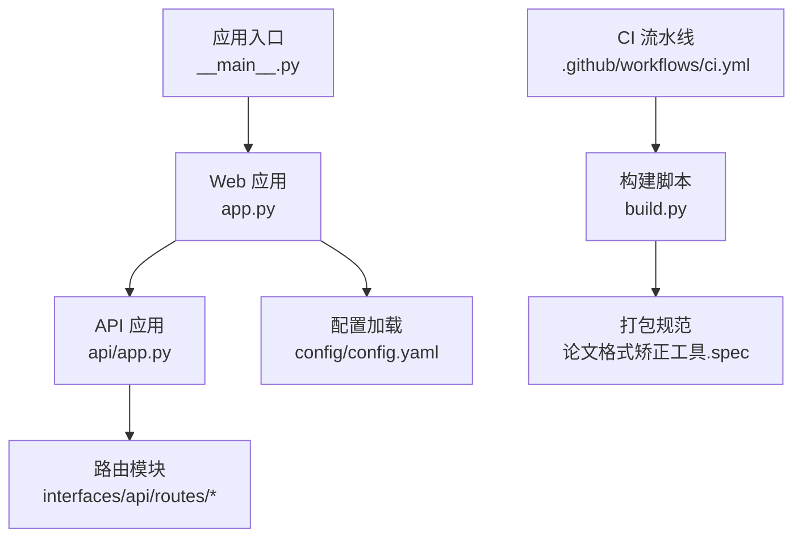
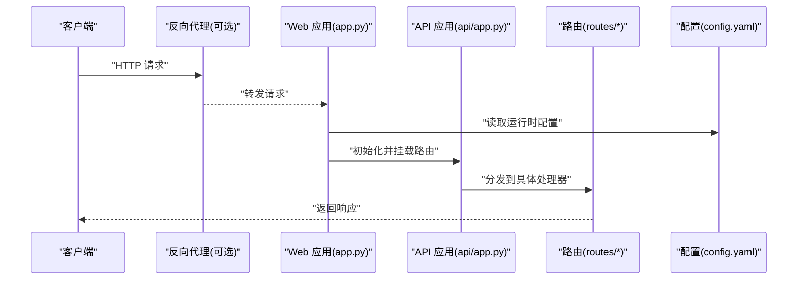
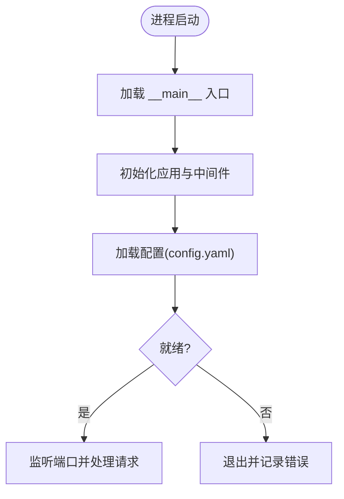
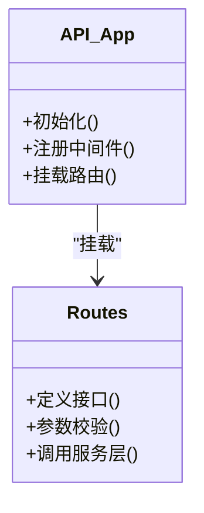
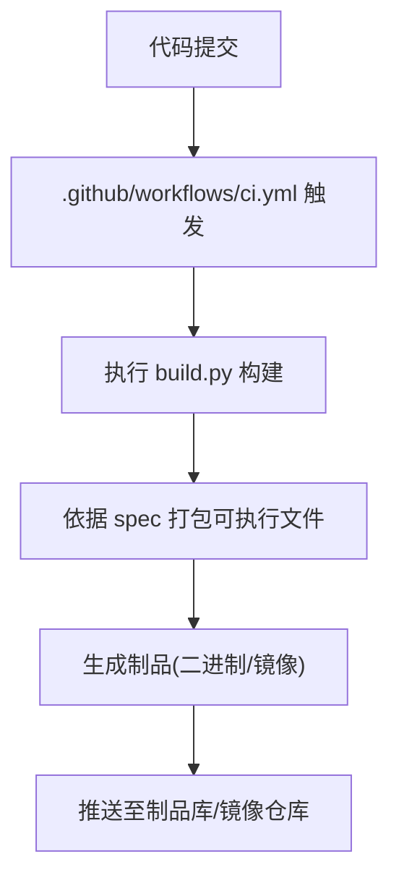
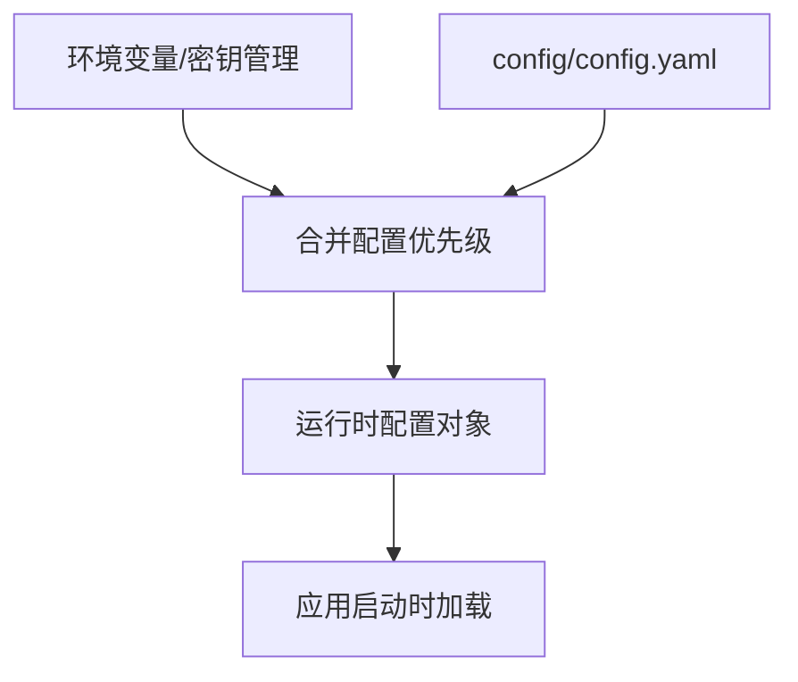

# 部署与运维

<cite>
**本文引用的文件**   
- [README.md](file://README.md)
- [pyproject.toml](file://pyproject.toml)
- [requirements.txt](file://requirements.txt)
- [build.py](file://build.py)
- [run.py](file://run.py)
- [src/paper_format_corrector/__main__.py](file://src/paper_format_corrector/__main__.py)
- [src/paper_format_corrector/app.py](file://src/paper_format_corrector/app.py)
- [src/paper_format_corrector/api/app.py](file://src/paper_format_corrector/api/app.py)
- [src/paper_format_corrector/interfaces/api/routes/](file://src/paper_format_corrector/interfaces/api/routes/)
- [config/config.yaml](file://config/config.yaml)
- [config/updater.yaml](file://config/updater.yaml)
- [.github/workflows/ci.yml](file://.github/workflows/ci.yml)
- [论文格式矫正工具.spec](file://论文格式矫正工具.spec)
</cite>

## 目录
1. [简介](#简介)
2. [项目结构](#项目结构)
3. [核心组件](#核心组件)
4. [架构总览](#架构总览)
5. [详细组件分析](#详细组件分析)
6. [依赖分析](#依赖分析)
7. [性能考虑](#性能考虑)
8. [故障排查指南](#故障排查指南)
9. [结论](#结论)
10. [附录](#附录)

## 简介
本指南面向生产环境的部署与运维，覆盖以下主题：
- 容器化（Docker）部署、云平台部署与本地服务器部署方案
- 构建流程与打包配置（可执行文件生成、依赖管理、版本控制）
- 监控与日志收集（应用指标、错误追踪、性能监控）
- 备份与恢复策略（数据持久化、灾难恢复计划）
- 安全加固（访问控制、数据加密、网络安全）
- 运维自动化脚本与故障排查
- 扩容与负载均衡建议

## 项目结构
仓库采用分层与模块化组织方式，关键目录与职责如下：
- src/paper_format_corrector：核心业务与应用入口
  - app.py：Web 服务启动与中间件装配
  - api/app.py：API 层应用初始化与路由注册
  - interfaces/api/routes/*：HTTP 接口定义
  - __main__.py：命令行入口
- config：运行时配置（YAML）
- .github/workflows/ci.yml：CI 流水线
- build.py：构建脚本
- requirements.txt / pyproject.toml：依赖与元数据
- 论文格式矫正工具.spec：PyInstaller 打包规范

图示来源
- [src/paper_format_corrector/__main__.py](file://src/paper_format_corrector/__main__.py)
- [src/paper_format_corrector/app.py](file://src/paper_format_corrector/app.py)
- [src/paper_format_corrector/api/app.py](file://src/paper_format_corrector/api/app.py)
- [src/paper_format_corrector/interfaces/api/routes/](file://src/paper_format_corrector/interfaces/api/routes/)
- [config/config.yaml](file://config/config.yaml)
- [build.py](file://build.py)
- [论文格式矫正工具.spec](file://论文格式矫正工具.spec)
- [.github/workflows/ci.yml](file://.github/workflows/ci.yml)

章节来源
- [README.md](file://README.md)
- [pyproject.toml](file://pyproject.toml)
- [requirements.txt](file://requirements.txt)
- [build.py](file://build.py)
- [run.py](file://run.py)
- [src/paper_format_corrector/__main__.py](file://src/paper_format_corrector/__main__.py)
- [src/paper_format_corrector/app.py](file://src/paper_format_corrector/app.py)
- [src/paper_format_corrector/api/app.py](file://src/paper_format_corrector/api/app.py)
- [src/paper_format_corrector/interfaces/api/routes/](file://src/paper_format_corrector/interfaces/api/routes/)
- [config/config.yaml](file://config/config.yaml)
- [config/updater.yaml](file://config/updater.yaml)
- [.github/workflows/ci.yml](file://.github/workflows/ci.yml)
- [论文格式矫正工具.spec](file://论文格式矫正工具.spec)

## 核心组件
- Web 服务与 API
  - 应用启动与中间件装配位于应用主入口与 API 应用初始化处。
  - HTTP 路由集中在 routes 目录下，便于按功能域拆分与维护。
- 配置管理
  - 使用 YAML 配置文件集中管理运行参数，支持多环境差异化配置。
- 构建与打包
  - 提供 Python 构建脚本与 PyInstaller 规范，用于生成独立可执行文件。
- CI/CD
  - GitHub Actions 流水线负责自动化测试与制品构建。

章节来源
- [src/paper_format_corrector/app.py](file://src/paper_format_corrector/app.py)
- [src/paper_format_corrector/api/app.py](file://src/paper_format_corrector/api/app.py)
- [src/paper_format_corrector/interfaces/api/routes/](file://src/paper_format_corrector/interfaces/api/routes/)
- [config/config.yaml](file://config/config.yaml)
- [build.py](file://build.py)
- [论文格式矫正工具.spec](file://论文格式矫正工具.spec)
- [.github/workflows/ci.yml](file://.github/workflows/ci.yml)

## 架构总览
下图展示从外部请求到内部处理的核心路径，以及配置与构建产物之间的关系。

图示来源
- [src/paper_format_corrector/app.py](file://src/paper_format_corrector/app.py)
- [src/paper_format_corrector/api/app.py](file://src/paper_format_corrector/api/app.py)
- [src/paper_format_corrector/interfaces/api/routes/](file://src/paper_format_corrector/interfaces/api/routes/)
- [config/config.yaml](file://config/config.yaml)

## 详细组件分析

### 应用入口与进程模型
- 命令行入口通过标准库入口点机制启动应用，适合以单进程或多进程方式运行。
- 建议在容器或系统服务中由进程管理器统一拉起，配合健康检查端点实现自愈。

图示来源
- [src/paper_format_corrector/__main__.py](file://src/paper_format_corrector/__main__.py)
- [src/paper_format_corrector/app.py](file://src/paper_format_corrector/app.py)
- [config/config.yaml](file://config/config.yaml)

章节来源
- [src/paper_format_corrector/__main__.py](file://src/paper_format_corrector/__main__.py)
- [src/paper_format_corrector/app.py](file://src/paper_format_corrector/app.py)

### API 层与路由
- API 应用负责挂载路由、注册中间件与异常处理。
- 路由按功能划分在 routes 目录，便于扩展与权限控制。

图示来源
- [src/paper_format_corrector/api/app.py](file://src/paper_format_corrector/api/app.py)
- [src/paper_format_corrector/interfaces/api/routes/](file://src/paper_format_corrector/interfaces/api/routes/)

章节来源
- [src/paper_format_corrector/api/app.py](file://src/paper_format_corrector/api/app.py)
- [src/paper_format_corrector/interfaces/api/routes/](file://src/paper_format_corrector/interfaces/api/routes/)

### 构建与打包
- 构建脚本与 PyInstaller 规范共同决定最终制品形态。
- 建议将构建产物作为不可变镜像层或发布包进行分发。

图示来源
- [.github/workflows/ci.yml](file://.github/workflows/ci.yml)
- [build.py](file://build.py)
- [论文格式矫正工具.spec](file://论文格式矫正工具.spec)

章节来源
- [build.py](file://build.py)
- [论文格式矫正工具.spec](file://论文格式矫正工具.spec)
- [.github/workflows/ci.yml](file://.github/workflows/ci.yml)

### 配置管理
- 使用 YAML 集中管理配置项，支持不同环境覆盖。
- 建议将敏感信息通过环境变量注入，避免硬编码。

图示来源
- [config/config.yaml](file://config/config.yaml)
- [config/updater.yaml](file://config/updater.yaml)

章节来源
- [config/config.yaml](file://config/config.yaml)
- [config/updater.yaml](file://config/updater.yaml)

## 依赖分析
- 运行时依赖
  - requirements.txt 列出运行期所需第三方包。
  - pyproject.toml 包含项目元数据与可能的构建依赖。
- 构建期依赖
  - 构建脚本与 CI 会安装构建相关依赖以生成制品。

图示来源
- [pyproject.toml](file://pyproject.toml)
- [requirements.txt](file://requirements.txt)

章节来源
- [pyproject.toml](file://pyproject.toml)
- [requirements.txt](file://requirements.txt)

## 性能考虑
- 进程与线程
  - 根据 CPU 密集型任务比例选择多进程或多线程模型；IO 密集建议使用异步或队列。
- 资源限制
  - 为容器设置合理的 CPU/内存上限，避免抖动与 OOM。
- 缓存与批处理
  - 对模板解析、样式提取等耗时操作引入缓存与批处理。
- 连接池与超时
  - 对外部依赖（如字体、远程模板）建立连接池与合理超时。

[本节为通用指导，不直接分析具体文件]

## 故障排查指南
- 快速定位
  - 查看应用日志与错误堆栈，确认启动失败原因与依赖缺失。
  - 验证配置项是否生效，尤其是端口、路径与密钥。
- 常见场景
  - 端口占用：检查宿主端口映射与防火墙规则。
  - 权限问题：确保读写目录权限正确。
  - 依赖缺失：核对镜像或虚拟环境中依赖版本一致性。
- 辅助命令
  - 使用 run.py 进行本地快速验证与调试。

章节来源
- [run.py](file://run.py)

## 结论
通过容器化与 CI/CD 的标准化构建，结合统一的配置管理与完善的监控告警，可实现稳定、可观测、可扩展的生产部署。建议在生产环境引入反向代理、进程管理器与日志聚合平台，形成闭环的运维体系。

[本节为总结性内容，不直接分析具体文件]

## 附录

### 部署方案

#### Docker 容器化部署
- 基础镜像
  - 选择轻量且稳定的 Python 基础镜像，锁定版本。
- 构建阶段
  - 在构建阶段安装依赖并执行构建脚本，生成可执行文件或最小化镜像。
- 运行阶段
  - 仅拷贝必要文件，暴露应用端口，设置健康检查与资源限制。
- 配置注入
  - 通过环境变量或挂载只读配置文件，避免修改镜像。
- 示例步骤（概念性）
  - 编写 Dockerfile，分阶段构建，复制制品，设置 CMD/HEALTHCHECK。
  - 使用 docker-compose 编排多实例与数据卷。

[本节为通用指导，不直接分析具体文件]

#### 云平台部署
- Kubernetes
  - 使用 Deployment 管理副本数，Service 暴露端口，Ingress 做七层路由。
  - 使用 ConfigMap/Secret 管理配置与密钥，Volume 挂载数据卷。
  - 使用 HorizontalPodAutoscaler 基于 CPU/内存或自定义指标自动扩缩容。
- Serverless/托管容器
  - 将镜像推送到云厂商镜像仓库，创建托管服务并配置域名与证书。

[本节为通用指导，不直接分析具体文件]

#### 本地服务器部署
- 使用 systemd 或 supervisor 管理进程，配置开机自启与重启策略。
- 使用 Nginx 作为反向代理，启用 HTTPS 与压缩。
- 使用 logrotate 轮转日志，避免磁盘占满。

[本节为通用指导，不直接分析具体文件]

### 构建流程与打包配置
- 依赖管理
  - 使用 requirements.txt 固定运行期依赖，pyproject.toml 维护项目元数据。
- 构建脚本
  - 通过 build.py 执行构建逻辑，输出可执行文件或归档包。
- 打包规范
  - 使用 PyInstaller 的 spec 文件定义打包行为，包括隐藏导入、资源文件与排除项。
- 版本控制
  - 在 CI 中根据 Git 标签或分支生成版本号，写入制品元数据。

章节来源
- [requirements.txt](file://requirements.txt)
- [pyproject.toml](file://pyproject.toml)
- [build.py](file://build.py)
- [论文格式矫正工具.spec](file://论文格式矫正工具.spec)
- [.github/workflows/ci.yml](file://.github/workflows/ci.yml)

### 监控与日志收集
- 应用指标
  - 暴露健康检查端点与基本指标（QPS、延迟、错误率），供 Prometheus 抓取。
- 日志收集
  - 结构化输出 JSON 日志，使用 filebeat/fluent-bit 采集并转发至 ELK/Loki。
- 错误追踪
  - 集成错误上报 SDK，关联请求 ID 与用户上下文。
- 性能监控
  - 使用 APM 工具（如 OpenTelemetry）埋点关键链路，识别瓶颈。

[本节为通用指导，不直接分析具体文件]

### 备份与恢复策略
- 数据持久化
  - 将上传文件、模板与结果输出目录挂载为持久卷，定期快照。
- 备份策略
  - 全量+增量备份，保留周期与异地存储。
- 灾难恢复
  - 制定 RTO/RPO 目标，演练恢复流程，验证数据一致性。

[本节为通用指导，不直接分析具体文件]

### 安全加固措施
- 访问控制
  - 使用网关鉴权、RBAC 与最小权限原则。
- 数据加密
  - 传输层启用 TLS，静态数据加密（磁盘或数据库）。
- 网络安全
  - 仅开放必要端口，使用 VPC/安全组隔离，启用 WAF。
- 供应链安全
  - 扫描依赖漏洞，签名与校验制品。

[本节为通用指导，不直接分析具体文件]

### 运维自动化脚本
- 一键部署
  - 封装 docker-compose/kubectl 命令，实现蓝绿或滚动发布。
- 巡检与健康检查
  - 定时拉取健康端点，异常时告警并自动重试。
- 清理与回收
  - 定期清理临时文件、旧镜像与过期日志。

[本节为通用指导，不直接分析具体文件]

### 扩容与负载均衡
- 水平扩容
  - 无状态服务多副本部署，基于 CPU/内存或自定义指标自动扩缩容。
- 负载均衡
  - 使用 Ingress/SLB 分发流量，开启会话保持（如需）。
- 灰度发布
  - 基于权重或头部的灰度策略，逐步放量。

[本节为通用指导，不直接分析具体文件]