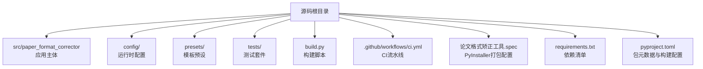
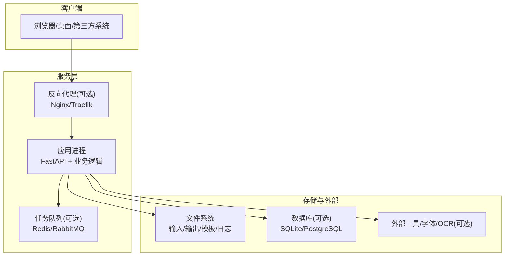
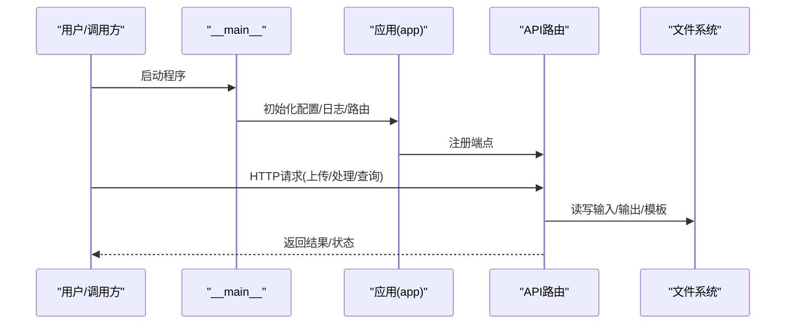
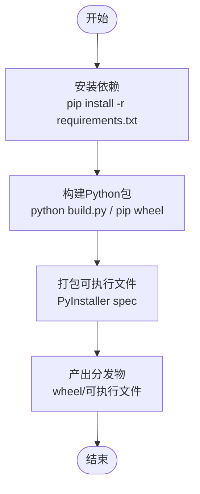
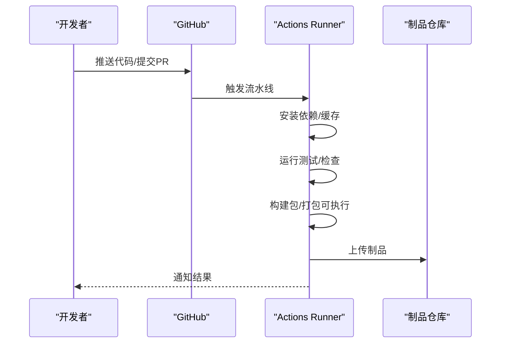
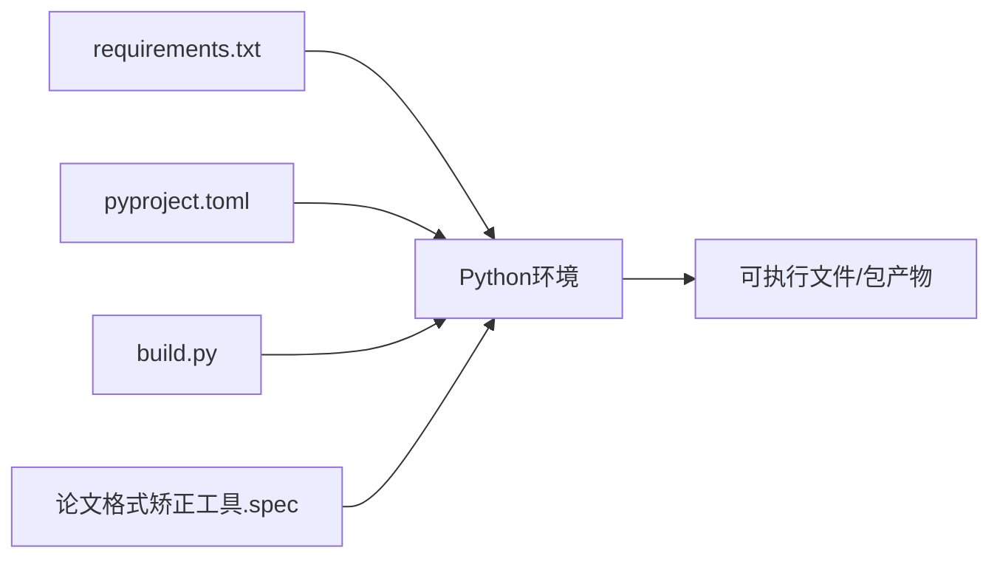

# 部署方案

<cite>
**本文引用的文件**   
- [README.md](file://README.md)
- [pyproject.toml](file://pyproject.toml)
- [requirements.txt](file://requirements.txt)
- [build.py](file://build.py)
- [run.py](file://run.py)
- [src/paper_format_corrector/__main__.py](file://src/paper_format_corrector/__main__.py)
- [src/paper_format_corrector/app.py](file://src/paper_format_corrector/app.py)
- [src/paper_format_corrector/cli.py](file://src/paper_format_corrector/cli.py)
- [src/paper_format_corrector/api/app.py](file://src/paper_format_corrector/api/app.py)
- [config/config.yaml](file://config/config.yaml)
- [config/updater.yaml](file://config/updater.yaml)
- [.github/workflows/ci.yml](file://.github/workflows/ci.yml)
- [论文格式矫正工具.spec](file://论文格式矫正工具.spec)
</cite>

## 目录
1. [简介](#简介)
2. [项目结构](#项目结构)
3. [核心组件](#核心组件)
4. [架构总览](#架构总览)
5. [详细组件分析](#详细组件分析)
6. [依赖分析](#依赖分析)
7. [性能考虑](#性能考虑)
8. [故障排查指南](#故障排查指南)
9. [结论](#结论)
10. [附录](#附录)

## 简介
本部署方案面向“论文格式矫正工具”的多环境交付，覆盖本地服务器、Docker容器化与云平台三种部署方式。文档包含系统要求、环境配置、构建流程（Python包构建、可执行文件打包、依赖管理）、CI/CD流水线示例、环境变量与网络配置说明，以及不同环境的部署模板与配置文件路径指引。

## 项目结构
仓库采用分层与模块化组织：
- 应用入口与CLI：提供命令行与Web服务两种运行模式
- API层：基于FastAPI的HTTP接口
- 业务与基础设施：解析、转换、导出、队列、插件、模板管理等
- 配置与预设：YAML配置与学术模板预设
- 构建与发布：PyPI包构建、PyInstaller打包、GitHub Actions CI

图表来源
- [pyproject.toml](file://pyproject.toml)
- [requirements.txt](file://requirements.txt)
- [build.py](file://build.py)
- [论文格式矫正工具.spec](file://论文格式矫正工具.spec)
- [.github/workflows/ci.yml](file://.github/workflows/ci.yml)

章节来源
- [README.md](file://README.md)
- [pyproject.toml](file://pyproject.toml)
- [requirements.txt](file://requirements.txt)

## 核心组件
- 应用启动器：支持以模块或命令形式启动，内部初始化配置、日志与路由
- CLI：提供批量处理、模板校验、导入等子命令
- Web API：基于FastAPI暴露REST接口，用于上传文档、触发格式化、查询任务状态等
- 配置加载：从YAML与环境变量合并加载，支持多环境切换
- 构建与打包：通过pyproject构建分发包；使用PyInstaller生成跨平台可执行文件

章节来源
- [src/paper_format_corrector/__main__.py](file://src/paper_format_corrector/__main__.py)
- [src/paper_format_corrector/app.py](file://src/paper_format_corrector/app.py)
- [src/paper_format_corrector/cli.py](file://src/paper_format_corrector/cli.py)
- [src/paper_format_corrector/api/app.py](file://src/paper_format_corrector/api/app.py)
- [config/config.yaml](file://config/config.yaml)
- [config/updater.yaml](file://config/updater.yaml)

## 架构总览
下图展示本地/容器/云平台的通用运行边界与交互关系。

[此图为概念性架构图，不直接映射具体源文件]

## 详细组件分析

### 应用启动与运行模式
- 模块入口：通过标准库入口点加载应用并启动服务
- CLI模式：提供批处理、模板校验、导入等能力
- Web模式：启动HTTP服务，注册路由与中间件

图表来源
- [src/paper_format_corrector/__main__.py](file://src/paper_format_corrector/__main__.py)
- [src/paper_format_corrector/app.py](file://src/paper_format_corrector/app.py)
- [src/paper_format_corrector/api/app.py](file://src/paper_format_corrector/api/app.py)

章节来源
- [src/paper_format_corrector/__main__.py](file://src/paper_format_corrector/__main__.py)
- [src/paper_format_corrector/app.py](file://src/paper_format_corrector/app.py)
- [src/paper_format_corrector/cli.py](file://src/paper_format_corrector/cli.py)
- [src/paper_format_corrector/api/app.py](file://src/paper_format_corrector/api/app.py)

### 配置与环境变量
- 配置来源优先级：默认值 < YAML配置 < 环境变量 < 运行时参数
- 关键配置项建议：
  - 服务端口、监听地址、CORS白名单
  - 输入/输出目录、模板目录、日志级别与路径
  - 外部工具路径、字体目录、临时目录
  - 更新检查开关与远程仓库地址
- 配置文件位置：
  - 主配置：[config/config.yaml](file://config/config.yaml)
  - 更新器配置：[config/updater.yaml](file://config/updater.yaml)

章节来源
- [config/config.yaml](file://config/config.yaml)
- [config/updater.yaml](file://config/updater.yaml)

### 构建与打包
- Python包构建：使用pyproject定义元数据与依赖，生成sdist/wheel
- 可执行文件打包：使用PyInstaller将应用与依赖打包为单文件或目录
- 依赖管理：requirements.txt用于锁定版本，便于镜像与CI复现

图表来源
- [build.py](file://build.py)
- [requirements.txt](file://requirements.txt)
- [pyproject.toml](file://pyproject.toml)
- [论文格式矫正工具.spec](file://论文格式矫正工具.spec)

章节来源
- [build.py](file://build.py)
- [requirements.txt](file://requirements.txt)
- [pyproject.toml](file://pyproject.toml)
- [论文格式矫正工具.spec](file://论文格式矫正工具.spec)

### Docker容器化部署
- 基础镜像：选择官方Python镜像，固定版本与操作系统发行版
- 工作目录：在镜像中创建独立工作目录，复制代码与依赖
- 依赖安装：先复制requirements.txt并安装，再复制源码，提升缓存命中率
- 运行命令：以非root用户运行，绑定端口，挂载数据卷
- 健康检查：提供HTTP健康检查端点或轻量探针
- 环境变量：通过docker run -e或compose env_file注入
- 数据持久化：挂载输入/输出/模板/日志目录

参考步骤要点
- 编写Dockerfile（构建阶段与运行阶段分离）
- 编写docker-compose.yml（服务、网络、卷、环境变量）
- 构建镜像并运行容器
- 验证端口访问与健康检查

[本节为通用指导，未直接引用具体源文件]

### 云平台部署
- 容器编排：Kubernetes Deployment/Service/ConfigMap/Secret/PV
- 无服务器：Cloud Run/Functions（需适配为短生命周期进程）
- 托管平台：Heroku/AWS ECS/GCP Cloud Run等
- 配置管理：使用ConfigMap/Secret注入环境变量与敏感信息
- 存储：使用对象存储或持久卷挂载输入/输出目录
- 安全：最小权限、只读根文件系统、非root用户、网络策略

[本节为通用指导，未直接引用具体源文件]

### CI/CD流水线
- 触发条件：push/PR/tag
- 步骤：
  - 设置Python环境与缓存依赖
  - 静态检查与单元测试
  - 构建Python包与可执行文件
  - 推送制品到包仓库或发布页
- 产物：wheel/sdist、可执行文件、镜像标签
- 安全：密钥与令牌通过Secrets管理

图表来源
- [.github/workflows/ci.yml](file://.github/workflows/ci.yml)

章节来源
- [.github/workflows/ci.yml](file://.github/workflows/ci.yml)

## 依赖分析
- 运行时依赖：由requirements.txt声明，建议在镜像与CI中固定版本
- 包元数据：pyproject.toml定义包名、版本、入口点与构建后端
- 构建依赖：build.py与spec文件驱动构建与打包流程

图表来源
- [requirements.txt](file://requirements.txt)
- [pyproject.toml](file://pyproject.toml)
- [build.py](file://build.py)
- [论文格式矫正工具.spec](file://论文格式矫正工具.spec)

章节来源
- [requirements.txt](file://requirements.txt)
- [pyproject.toml](file://pyproject.toml)
- [build.py](file://build.py)
- [论文格式矫正工具.spec](file://论文格式矫正工具.spec)

## 性能考虑
- 并发与线程：根据CPU核数调整Gunicorn/Uvicorn工作进程数
- 内存与I/O：大文档处理时启用分块与临时目录隔离
- 缓存：对模板与规则进行内存缓存，减少重复解析
- 队列：异步任务使用消息队列与后台Worker解耦
- 资源限制：容器与平台侧设置CPU/内存上限与优雅停机

[本节为通用指导，未直接引用具体源文件]

## 故障排查指南
- 启动失败：检查端口占用、监听地址、环境变量与配置文件路径
- 权限问题：确认运行用户对输入/输出/模板/日志目录有读写权限
- 依赖缺失：核对requirements版本与系统级依赖（如字体、外部工具）
- 网络问题：确认反向代理转发、CORS与域名解析
- 日志定位：查看应用日志与系统日志，结合请求ID追踪链路

章节来源
- [config/config.yaml](file://config/config.yaml)
- [config/updater.yaml](file://config/updater.yaml)

## 结论
本方案提供了本地、容器与云端的完整部署路径，涵盖构建、打包、依赖管理与CI/CD自动化。通过统一的环境变量与配置模型，可在多环境中快速切换与扩展。建议在生产环境采用容器编排与制品仓库，配合监控与告警实现稳定交付。

## 附录

### 系统要求
- 操作系统：Linux/Windows/macOS
- Python版本：见requirements与pyproject约束
- 磁盘空间：至少预留构建与产物目录空间
- 内存/CPU：根据文档规模与并发需求评估

章节来源
- [requirements.txt](file://requirements.txt)
- [pyproject.toml](file://pyproject.toml)

### 环境变量与端口配置
- 服务端口：通过环境变量覆盖默认端口
- 监听地址：支持0.0.0.0或特定网卡
- 目录映射：输入/输出/模板/日志路径
- 外部工具：字体目录、OCR或LaTeX路径
- 更新检查：开关与远程仓库地址

章节来源
- [config/config.yaml](file://config/config.yaml)
- [config/updater.yaml](file://config/updater.yaml)

### 不同环境部署模板与配置文件
- 开发环境：本地直接运行或容器调试
- 测试环境：CI自动构建与测试，生成制品
- 预生产环境：镜像签名与灰度发布
- 生产环境：高可用编排与监控告警

章节来源
- [.github/workflows/ci.yml](file://.github/workflows/ci.yml)
- [config/config.yaml](file://config/config.yaml)

### 构建与发布清单
- 构建产物：wheel/sdist、可执行文件、镜像标签
- 发布渠道：PyPI、私有包仓库、制品仓库
- 版本策略：语义化版本与变更日志

章节来源
- [build.py](file://build.py)
- [pyproject.toml](file://pyproject.toml)
- [论文格式矫正工具.spec](file://论文格式矫正工具.spec)