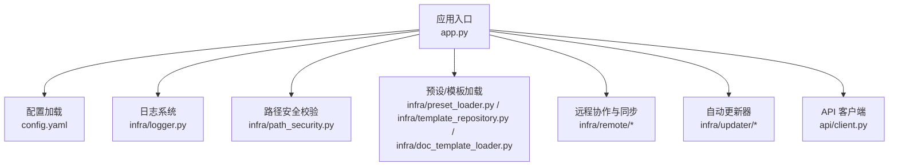
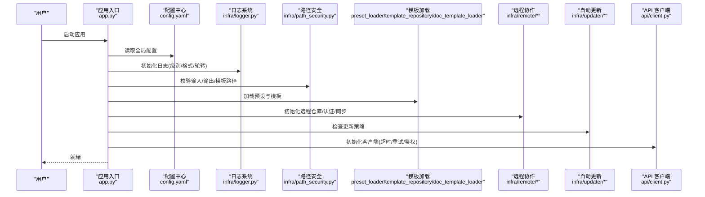
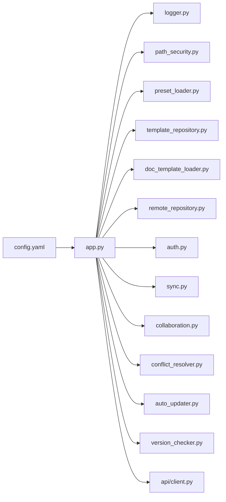

# 全局配置详解

<cite>
**本文引用的文件**   
- [config.yaml](file://config/config.yaml)
- [updater.yaml](file://config/updater.yaml)
- [app.py](file://src/paper_format_corrector/app.py)
- [logger.py](file://src/paper_format_corrector/infra/logger.py)
- [path_security.py](file://src/paper_format_corrector/infra/path_security.py)
- [preset_loader.py](file://src/paper_format_corrector/infra/preset_loader.py)
- [template_repository.py](file://src/paper_format_corrector/infra/template_repository.py)
- [doc_template_loader.py](file://src/paper_format_corrector/infra/doc_template_loader.py)
- [auto_updater.py](file://src/paper_format_corrector/infra/updater/auto_updater.py)
- [version_checker.py](file://src/paper_format_corrector/infra/updater/version_checker.py)
- [api_client.py](file://src/paper_format_corrector/api/client.py)
- [remote_repository.py](file://src/paper_format_corrector/infra/remote/remote_repository.py)
- [auth.py](file://src/paper_format_corrector/infra/remote/auth.py)
- [sync.py](file://src/paper_format_corrector/infra/remote/sync.py)
- [collaboration.py](file://src/paper_format_corrector/infra/remote/collaboration.py)
- [conflict_resolver.py](file://src/paper_format_corrector/infra/remote/conflict_resolver.py)
- [remote_models.py](file://src/paper_format_corrector/infra/remote/remote_models.py)
</cite>

## 目录
1. [简介](#简介)
2. [项目结构](#项目结构)
3. [核心组件](#核心组件)
4. [架构总览](#架构总览)
5. [详细组件分析](#详细组件分析)
6. [依赖关系分析](#依赖关系分析)
7. [性能考虑](#性能考虑)
8. [故障排查指南](#故障排查指南)
9. [结论](#结论)
10. [附录](#附录)

## 简介
本文件面向使用与运维人员，系统化说明全局配置文件 config.yaml 中各项配置的含义、默认值、使用方法与最佳实践。内容覆盖路径配置（输入输出目录、模板目录、日志目录等）、性能参数（并发数、内存限制、超时设置）、日志配置（级别、格式、轮转）与安全选项（权限控制、访问限制），并给出示例值与配置项之间的依赖与约束说明。

## 项目结构
本项目采用分层与模块化组织方式：
- 配置层：config/config.yaml 为全局配置入口；config/updater.yaml 用于更新器相关配置。
- 应用层：src/paper_format_corrector/app.py 负责启动与装配。
- 基础设施层：infra/* 提供日志、路径安全、模板加载、远程协作与更新器等能力。
- API 层：src/paper_format_corrector/api/* 提供客户端与接口封装。

图表来源
- [app.py](file://src/paper_format_corrector/app.py)
- [config.yaml](file://config/config.yaml)
- [logger.py](file://src/paper_format_corrector/infra/logger.py)
- [path_security.py](file://src/paper_format_corrector/infra/path_security.py)
- [preset_loader.py](file://src/paper_format_corrector/infra/preset_loader.py)
- [template_repository.py](file://src/paper_format_corrector/infra/template_repository.py)
- [doc_template_loader.py](file://src/paper_format_corrector/infra/doc_template_loader.py)
- [remote_repository.py](file://src/paper_format_corrector/infra/remote/remote_repository.py)
- [auto_updater.py](file://src/paper_format_corrector/infra/updater/auto_updater.py)
- [api_client.py](file://src/paper_format_corrector/api/client.py)

章节来源
- [config.yaml](file://config/config.yaml)
- [app.py](file://src/paper_format_corrector/app.py)

## 核心组件
- 配置中心：config.yaml 作为单一事实源，被应用启动时集中读取与校验。
- 日志子系统：基于 infra/logger.py 实现，支持级别、格式与轮转策略。
- 路径安全：基于 infra/path_security.py 对输入输出与模板路径进行白名单与相对路径校验。
- 模板与预设：通过 preset_loader、template_repository、doc_template_loader 协同加载本地与远端模板。
- 远程协作：remote 模块提供认证、仓库访问、同步与冲突解决。
- 自动更新：updater 模块负责版本检查与更新流程。
- API 客户端：api/client.py 提供对外服务调用封装。

章节来源
- [logger.py](file://src/paper_format_corrector/infra/logger.py)
- [path_security.py](file://src/paper_format_corrector/infra/path_security.py)
- [preset_loader.py](file://src/paper_format_corrector/infra/preset_loader.py)
- [template_repository.py](file://src/paper_format_corrector/infra/template_repository.py)
- [doc_template_loader.py](file://src/paper_format_corrector/infra/doc_template_loader.py)
- [remote_repository.py](file://src/paper_format_corrector/infra/remote/remote_repository.py)
- [auto_updater.py](file://src/paper_format_corrector/infra/updater/auto_updater.py)
- [api_client.py](file://src/paper_format_corrector/api/client.py)

## 架构总览
下图展示配置在系统中的关键流向与依赖关系。

图表来源
- [app.py](file://src/paper_format_corrector/app.py)
- [config.yaml](file://config/config.yaml)
- [logger.py](file://src/paper_format_corrector/infra/logger.py)
- [path_security.py](file://src/paper_format_corrector/infra/path_security.py)
- [preset_loader.py](file://src/paper_format_corrector/infra/preset_loader.py)
- [template_repository.py](file://src/paper_format_corrector/infra/template_repository.py)
- [doc_template_loader.py](file://src/paper_format_corrector/infra/doc_template_loader.py)
- [remote_repository.py](file://src/paper_format_corrector/infra/remote/remote_repository.py)
- [auto_updater.py](file://src/paper_format_corrector/infra/updater/auto_updater.py)
- [api_client.py](file://src/paper_format_corrector/api/client.py)

## 详细组件分析

### 路径配置
- 输入目录
  - 含义：待处理文档的根目录或扫描路径。
  - 默认值：由应用根据运行环境推断或回退到默认目录。
  - 用法：批量任务将递归扫描该目录下的受支持文件类型。
  - 示例值："/data/incoming" 或 "./input"
  - 最佳实践：使用绝对路径避免工作目录切换导致的路径歧义；确保进程对该目录有读权限。
- 输出目录
  - 含义：格式化后的结果输出根目录。
  - 默认值：若未显式配置，可能按“原文件名+后缀”写入同目录或固定 output 目录。
  - 用法：可结合任务队列生成子目录以隔离不同批次。
  - 示例值："/data/output" 或 "./output"
  - 最佳实践：开启磁盘空间监控；避免与输入目录相同，防止覆盖风险。
- 模板目录
  - 含义：本地模板与预设存放位置，供模板加载器检索。
  - 默认值：内置模板优先，其次为 presets 目录，最后为自定义模板目录。
  - 用法：可通过配置指定多个模板源并按优先级合并。
  - 示例值：["./presets", "/opt/templates"]
  - 最佳实践：将机构级模板放入独立目录并通过配置挂载，便于统一治理。
- 日志目录
  - 含义：日志文件落盘路径。
  - 默认值：程序运行目录下 logs 子目录。
  - 用法：建议配合轮转策略使用，避免单文件过大。
  - 示例值："/var/log/paper-format-corrector"
  - 最佳实践：为容器化部署使用卷挂载；定期归档历史日志。
- 临时目录
  - 含义：中间产物与解压缓存目录。
  - 默认值：系统临时目录。
  - 用法：大文档处理时占用较高，需保证足够空间。
  - 示例值："/tmp/pfc-work"
  - 最佳实践：设置合理的清理策略，避免磁盘爆满。

章节来源
- [path_security.py](file://src/paper_format_corrector/infra/path_security.py)
- [preset_loader.py](file://src/paper_format_corrector/infra/preset_loader.py)
- [template_repository.py](file://src/paper_format_corrector/infra/template_repository.py)
- [doc_template_loader.py](file://src/paper_format_corrector/infra/doc_template_loader.py)

### 性能参数
- 并发数
  - 含义：批处理时的最大并行任务数。
  - 默认值：根据 CPU 核数与环境自动估算。
  - 用法：I/O 密集场景可适当提高；CPU 密集场景需谨慎调优。
  - 示例值：4、8、16
  - 最佳实践：结合队列长度与资源上限压测确定；避免超过系统线程池上限。
- 内存限制
  - 含义：单任务或进程可用内存阈值。
  - 默认值：不限制或由运行时环境决定。
  - 用法：当处理超大文档时建议显式设置，防止 OOM。
  - 示例值："2GiB"、"4096MB"
  - 最佳实践：与并发数联动评估，确保总内存占用不超过宿主机容量。
- 超时设置
  - 含义：单次任务处理超时与网络请求超时。
  - 默认值：合理的安全默认值。
  - 用法：长文档转换与远程拉取模板时需适当放宽。
  - 示例值：300s、60s
  - 最佳实践：区分“任务超时”和“网络超时”，分别配置更清晰。

章节来源
- [app.py](file://src/paper_format_corrector/app.py)

### 日志配置
- 日志级别
  - 含义：控制台与文件输出的最低记录级别。
  - 默认值：INFO。
  - 用法：调试阶段设为 DEBUG，生产建议 INFO 或 WARN。
  - 示例值：DEBUG、INFO、WARNING、ERROR
  - 最佳实践：按环境分离级别，避免在生产环境输出过多细节。
- 输出格式
  - 含义：日志行包含时间戳、级别、模块名、消息等字段。
  - 默认值：结构化文本格式。
  - 用法：对接日志采集系统时可启用 JSON 格式。
  - 示例值：text、json
  - 最佳实践：JSON 格式便于解析与告警；文本格式便于人工阅读。
- 文件轮转
  - 含义：按大小或时间切分日志文件，保留数量上限。
  - 默认值：按天轮转，保留最近 7 天。
  - 用法：高吞吐场景建议按大小轮转，减少单文件大小。
  - 示例值：size=100MB, keep=14
  - 最佳实践：结合外部日志收集工具做长期归档与索引。

章节来源
- [logger.py](file://src/paper_format_corrector/infra/logger.py)

### 安全选项
- 路径白名单
  - 含义：仅允许访问配置的受信任目录，防止越权读写。
  - 默认值：仅允许当前工作目录及明确配置的目录。
  - 用法：严格限定输入/输出/模板目录，禁止任意路径拼接。
  - 示例值：["/data/input", "/data/output", "/opt/templates"]
  - 最佳实践：最小权限原则，按需开放；禁用相对路径逃逸。
- 访问限制
  - 含义：对敏感操作（如删除、覆盖）增加二次确认或审计。
  - 默认值：关闭或保守模式。
  - 用法：在 CI/CD 或自动化流水线中谨慎开启破坏性操作。
  - 示例值：true/false
  - 最佳实践：结合审计日志与告警机制。
- 远程访问控制
  - 含义：模板仓库与协作服务的鉴权与加密传输。
  - 默认值：未启用或基于环境变量注入凭据。
  - 用法：通过配置或密钥管理服务注入 Token/证书。
  - 示例值：TLS 启用、Token 有效期管理
  - 最佳实践：最小权限令牌、定期轮换、失败快速熔断。

章节来源
- [path_security.py](file://src/paper_format_corrector/infra/path_security.py)
- [remote_repository.py](file://src/paper_format_corrector/infra/remote/remote_repository.py)
- [auth.py](file://src/paper_format_corrector/infra/remote/auth.py)

### 模板与预设
- 预设加载
  - 含义：从 presets 目录加载预置模板元数据与样式规则。
  - 默认值：内置预设优先。
  - 用法：可按机构/学科维度维护多套预设。
  - 示例值：academic_paper.yaml、chinese_thesis.yaml
  - 最佳实践：为每个预设提供 README 与变更日志。
- 模板仓库
  - 含义：本地与远端模板的统一视图与版本管理。
  - 默认值：本地优先，远端可选。
  - 用法：支持增量同步与冲突解决。
  - 示例值：git 仓库地址、分支策略
  - 最佳实践：CI 校验模板正确性后再发布。
- 文档模板加载
  - 含义：将模板转换为运行时可用的文档结构。
  - 默认值：按需懒加载。
  - 用法：首次访问时预热，提升后续性能。
  - 示例值：缓存开关、TTL
  - 最佳实践：大模板启用缓存，避免重复解析。

章节来源
- [preset_loader.py](file://src/paper_format_corrector/infra/preset_loader.py)
- [template_repository.py](file://src/paper_format_corrector/infra/template_repository.py)
- [doc_template_loader.py](file://src/paper_format_corrector/infra/doc_template_loader.py)

### 远程协作与同步
- 仓库访问
  - 含义：连接远端模板仓库，执行拉取/推送。
  - 默认值：未启用。
  - 用法：配置仓库 URL、分支与认证信息。
  - 示例值：HTTPS/Git SSH、Token
  - 最佳实践：只读账户用于拉取，写权限严格管控。
- 认证
  - 含义：登录与令牌刷新。
  - 默认值：无。
  - 用法：支持多种认证方式（Token、证书）。
  - 示例值：token、cert_path
  - 最佳实践：令牌短期有效，失败重试指数退避。
- 同步与冲突
  - 含义：多节点间模板一致性同步与冲突解决。
  - 默认值：关闭或手动触发。
  - 用法：定时任务驱动，冲突策略可选择“最新修改优先”或“人工介入”。
  - 示例值：cron 表达式、冲突策略
  - 最佳实践：变更前备份，变更后验证。

章节来源
- [remote_repository.py](file://src/paper_format_corrector/infra/remote/remote_repository.py)
- [auth.py](file://src/paper_format_corrector/infra/remote/auth.py)
- [sync.py](file://src/paper_format_corrector/infra/remote/sync.py)
- [collaboration.py](file://src/paper_format_corrector/infra/remote/collaboration.py)
- [conflict_resolver.py](file://src/paper_format_corrector/infra/remote/conflict_resolver.py)
- [remote_models.py](file://src/paper_format_corrector/infra/remote/remote_models.py)

### 自动更新器
- 版本检查
  - 含义：定期检查新版本并发布通知。
  - 默认值：关闭或每日一次。
  - 用法：配置检查间隔与渠道。
  - 示例值：interval=24h、channel=email/webhook
  - 最佳实践：灰度发布，先小范围验证再全量升级。
- 更新策略
  - 含义：是否允许自动下载与安装。
  - 默认值：仅提示不自动安装。
  - 用法：在受控环境中可开启自动安装。
  - 示例值：auto_install=false
  - 最佳实践：记录更新日志与回滚方案。

章节来源
- [auto_updater.py](file://src/paper_format_corrector/infra/updater/auto_updater.py)
- [version_checker.py](file://src/paper_format_corrector/infra/updater/version_checker.py)
- [updater.yaml](file://config/updater.yaml)

### API 客户端
- 基础配置
  - 含义：服务端地址、协议与端口。
  - 默认值：本地开发地址。
  - 用法：生产环境指向网关或负载均衡。
  - 示例值：https://api.example.com
  - 最佳实践：使用域名而非 IP，便于迁移。
- 超时与重试
  - 含义：请求超时与失败重试次数。
  - 默认值：保守默认值。
  - 用法：根据后端 SLA 调整。
  - 示例值：timeout=30s、retries=3
  - 最佳实践：幂等接口可重试，非幂等需加防重标识。
- 鉴权
  - 含义：请求头携带 Token 或签名。
  - 默认值：未启用。
  - 用法：与远端认证一致。
  - 示例值：Authorization: Bearer <token>
  - 最佳实践：令牌短生命周期，失败快速熔断。

章节来源
- [api_client.py](file://src/paper_format_corrector/api/client.py)

## 依赖关系分析
- 配置项间的依赖
  - 路径白名单必须包含输入/输出/模板目录，否则启动即报错。
  - 日志目录需具备写权限，且与输出目录分离以避免污染业务数据。
  - 并发数与内存限制需联合评估，避免总内存超限。
  - 远程仓库与认证互相关联，未配置认证则无法访问私有仓库。
  - 自动更新器与 API 客户端的网络可达性与超时相互影响。
- 模块耦合
  - app.py 作为装配中心，依赖 logger、path_security、preset_loader、template_repository、remote、updater、api client。
  - remote 模块内部 auth、repository、sync、collaboration、conflict_resolver 职责清晰，低耦合。

图表来源
- [app.py](file://src/paper_format_corrector/app.py)
- [config.yaml](file://config/config.yaml)
- [logger.py](file://src/paper_format_corrector/infra/logger.py)
- [path_security.py](file://src/paper_format_corrector/infra/path_security.py)
- [preset_loader.py](file://src/paper_format_corrector/infra/preset_loader.py)
- [template_repository.py](file://src/paper_format_corrector/infra/template_repository.py)
- [doc_template_loader.py](file://src/paper_format_corrector/infra/doc_template_loader.py)
- [remote_repository.py](file://src/paper_format_corrector/infra/remote/remote_repository.py)
- [auth.py](file://src/paper_format_corrector/infra/remote/auth.py)
- [sync.py](file://src/paper_format_corrector/infra/remote/sync.py)
- [collaboration.py](file://src/paper_format_corrector/infra/remote/collaboration.py)
- [conflict_resolver.py](file://src/paper_format_corrector/infra/remote/conflict_resolver.py)
- [auto_updater.py](file://src/paper_format_corrector/infra/updater/auto_updater.py)
- [version_checker.py](file://src/paper_format_corrector/infra/updater/version_checker.py)
- [api_client.py](file://src/paper_format_corrector/api/client.py)

## 性能考虑
- 并发与内存
  - 在高 I/O 场景（大量文档转换）下，适度提升并发可提升吞吐，但需监控内存峰值。
  - 建议通过压测曲线确定最优并发点，避免上下文切换开销过大。
- 日志与磁盘
  - 高频日志会显著增加磁盘 IO，生产环境建议 INFO 级别与 JSON 格式，并启用轮转。
- 模板缓存
  - 大模板首次加载耗时较长，建议开启缓存并设置合理 TTL，降低冷启动延迟。
- 网络与超时
  - 远程模板拉取与协作同步应设置合理的超时与重试，避免阻塞主流程。

## 故障排查指南
- 路径错误
  - 现象：启动时报路径不存在或权限不足。
  - 排查：检查路径白名单与实际目录映射；确认进程用户权限。
  - 参考：[path_security.py](file://src/paper_format_corrector/infra/path_security.py)
- 日志缺失
  - 现象：未生成日志文件或日志为空。
  - 排查：确认日志目录存在且可写；检查日志级别与输出目标。
  - 参考：[logger.py](file://src/paper_format_corrector/infra/logger.py)
- 模板加载失败
  - 现象：找不到预设或模板解析异常。
  - 排查：核对模板目录顺序与文件命名；查看模板校验日志。
  - 参考：[preset_loader.py](file://src/paper_format_corrector/infra/preset_loader.py)、[template_repository.py](file://src/paper_format_corrector/infra/template_repository.py)、[doc_template_loader.py](file://src/paper_format_corrector/infra/doc_template_loader.py)
- 远程同步失败
  - 现象：拉取模板失败或冲突频繁。
  - 排查：检查认证与网络连通性；查看冲突策略与重试日志。
  - 参考：[remote_repository.py](file://src/paper_format_corrector/infra/remote/remote_repository.py)、[auth.py](file://src/paper_format_corrector/infra/remote/auth.py)、[sync.py](file://src/paper_format_corrector/infra/remote/sync.py)、[conflict_resolver.py](file://src/paper_format_corrector/infra/remote/conflict_resolver.py)
- 更新器异常
  - 现象：版本检查失败或更新中断。
  - 排查：检查更新策略与网络；查看更新日志与回滚状态。
  - 参考：[auto_updater.py](file://src/paper_format_corrector/infra/updater/auto_updater.py)、[version_checker.py](file://src/paper_format_corrector/infra/updater/version_checker.py)

章节来源
- [path_security.py](file://src/paper_format_corrector/infra/path_security.py)
- [logger.py](file://src/paper_format_corrector/infra/logger.py)
- [preset_loader.py](file://src/paper_format_corrector/infra/preset_loader.py)
- [template_repository.py](file://src/paper_format_corrector/infra/template_repository.py)
- [doc_template_loader.py](file://src/paper_format_corrector/infra/doc_template_loader.py)
- [remote_repository.py](file://src/paper_format_corrector/infra/remote/remote_repository.py)
- [auth.py](file://src/paper_format_corrector/infra/remote/auth.py)
- [sync.py](file://src/paper_format_corrector/infra/remote/sync.py)
- [conflict_resolver.py](file://src/paper_format_corrector/infra/remote/conflict_resolver.py)
- [auto_updater.py](file://src/paper_format_corrector/infra/updater/auto_updater.py)
- [version_checker.py](file://src/paper_format_corrector/infra/updater/version_checker.py)

## 结论
通过对 config.yaml 及其相关模块的系统梳理，明确了路径、性能、日志与安全四大类配置的职责边界与最佳实践。建议在部署前完成路径白名单与权限校验、依据负载设定并发与内存上限、按环境选择日志级别与轮转策略，并对远程协作与更新器进行最小权限与灰度发布治理。

## 附录
- 配置项清单与示例（节选）
  - 路径
    - input_dir: "/data/input"
    - output_dir: "/data/output"
    - template_dirs: ["./presets", "/opt/templates"]
    - log_dir: "/var/log/paper-format-corrector"
    - tmp_dir: "/tmp/pfc-work"
  - 性能
    - concurrency: 8
    - memory_limit: "4GiB"
    - task_timeout: 300
    - network_timeout: 60
  - 日志
    - log_level: "INFO"
    - log_format: "json"
    - log_rotation: "size=100MB,keep=14"
  - 安全
    - path_whitelist: ["/data/input","/data/output","/opt/templates"]
    - strict_mode: true
    - remote_auth_token: "<token>"
    - tls_enabled: true
  - 远程协作
    - repo_url: "https://repo.example.com/templates"
    - branch: "main"
    - sync_interval: "24h"
    - conflict_strategy: "latest_wins"
  - 自动更新
    - check_interval: "24h"
    - auto_install: false
    - channel: "email"
  - API 客户端
    - base_url: "https://api.example.com"
    - timeout: 30
    - retries: 3
    - auth_header: "Authorization: Bearer <token>"