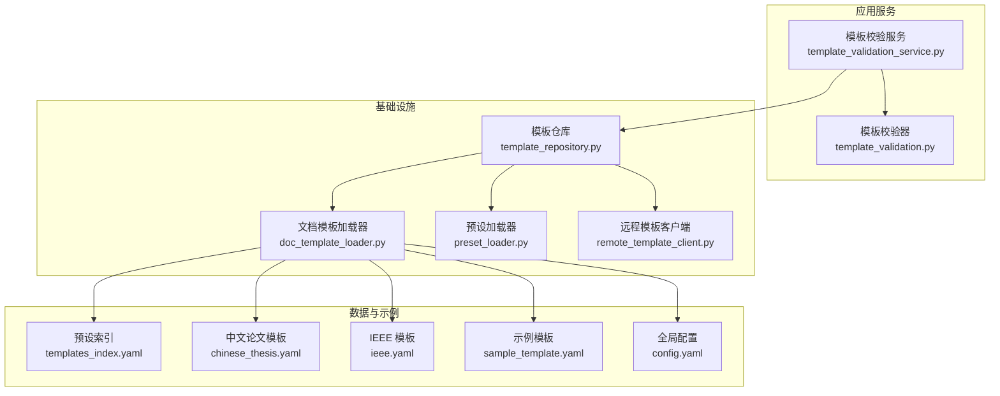
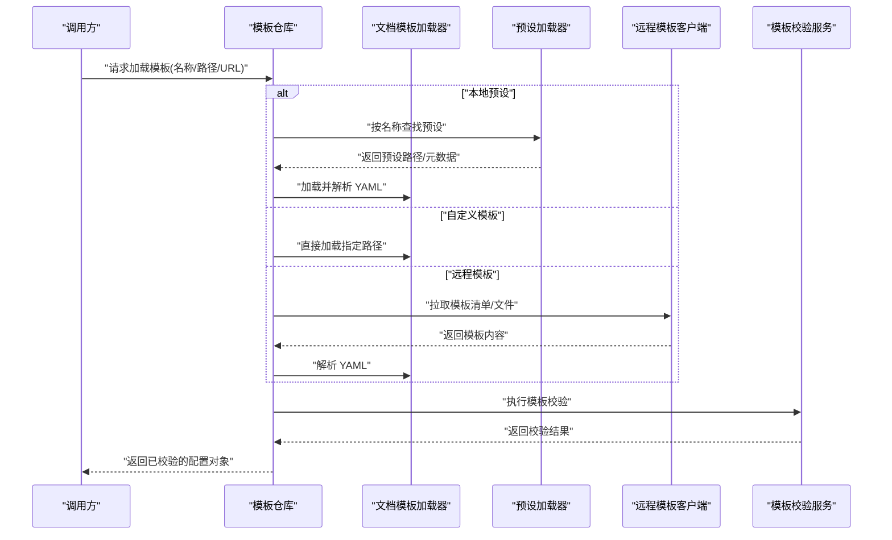
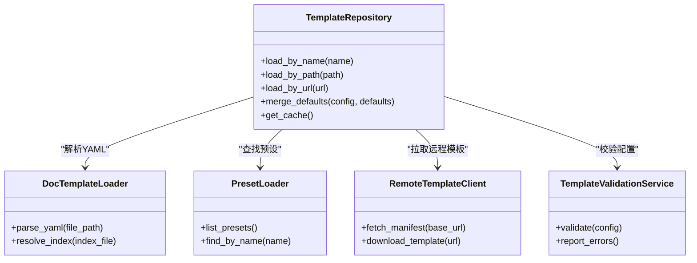
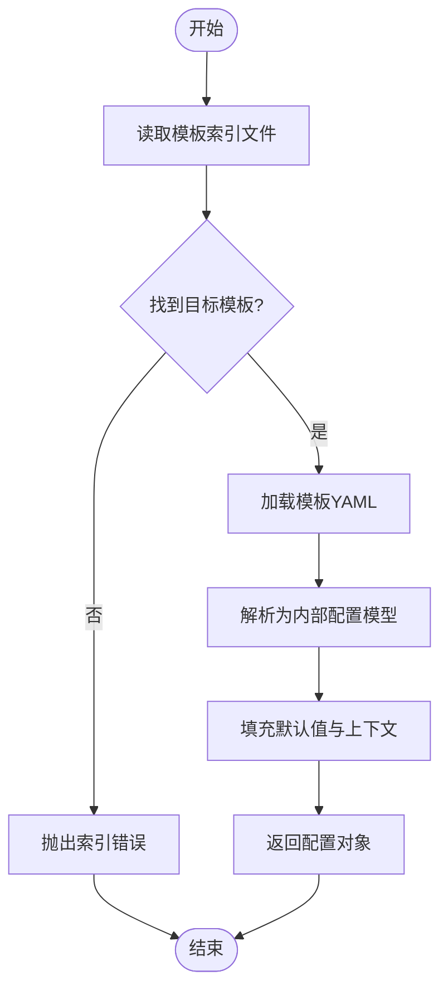
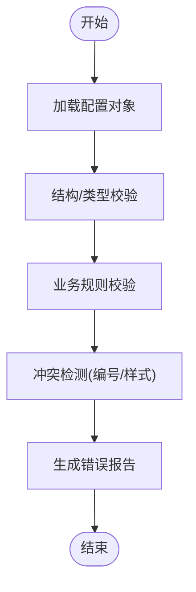
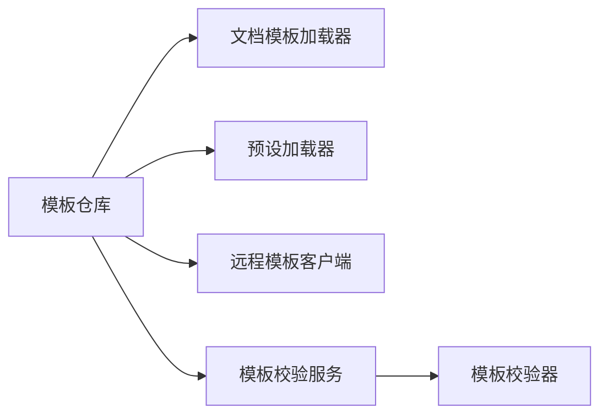

# 模板配置管理

<cite>
**本文引用的文件**   
- [README.md](file://README.md)
- [pyproject.toml](file://pyproject.toml)
- [src/paper_format_corrector/infra/template_repository.py](file://src/paper_format_corrector/infra/template_repository.py)
- [src/paper_format_corrector/infra/doc_template_loader.py](file://src/paper_format_corrector/infra/doc_template_loader.py)
- [src/paper_format_corrector/infra/preset_loader.py](file://src/paper_format_corrector/infra/preset_loader.py)
- [src/paper_format_corrector/infra/remote_template_client.py](file://src/paper_format_corrector/infra/remote_template_client.py)
- [src/paper_format_corrector/application/services/template_validation_service.py](file://src/paper_format_corrector/application/services/template_validation_service.py)
- [src/paper_format_corrector/application/services/template_validation.py](file://src/paper_format_corrector/application/services/template_validation.py)
- [examples/sample_template.yaml](file://examples/sample_template.yaml)
- [presets/templates_index.yaml](file://presets/templates_index.yaml)
- [presets/chinese_thesis.yaml](file://presets/chinese_thesis.yaml)
- [presets/ieee.yaml](file://presets/ieee.yaml)
- [config/config.yaml](file://config/config.yaml)
- [tests/test_template_repository.py](file://tests/test_template_repository.py)
- [tests/test_template_validation_and_import.py](file://tests/test_template_validation_and_import.py)
</cite>

## 目录
1. [简介](#简介)
2. [项目结构](#项目结构)
3. [核心组件](#核心组件)
4. [架构总览](#架构总览)
5. [详细组件分析](#详细组件分析)
6. [依赖关系分析](#依赖关系分析)
7. [性能考虑](#性能考虑)
8. [故障排查指南](#故障排查指南)
9. [结论](#结论)
10. [附录](#附录)

## 简介
本文件面向模板配置管理与使用，覆盖以下主题：
- 模板配置文件结构与语法（章节定义、样式规则、引用格式、图表编号等）
- 模板加载机制与优先级（内置模板、自定义模板、远程模板）
- 模板验证规则与错误处理
- 模板开发指南与调试技巧
- 常用配置示例与最佳实践

## 项目结构
与模板配置相关的代码与资源主要分布在如下位置：
- 应用服务层：模板校验服务与校验器
- 基础设施层：模板仓库、文档模板加载器、预设加载器、远程模板客户端
- 示例与预设：示例模板 YAML、预设索引与各机构/会议模板
- 测试：模板仓库与校验相关用例

**图示来源** 
- [src/paper_format_corrector/application/services/template_validation_service.py](file://src/paper_format_corrector/application/services/template_validation_service.py)
- [src/paper_format_corrector/application/services/template_validation.py](file://src/paper_format_corrector/application/services/template_validation.py)
- [src/paper_format_corrector/infra/template_repository.py](file://src/paper_format_corrector/infra/template_repository.py)
- [src/paper_format_corrector/infra/doc_template_loader.py](file://src/paper_format_corrector/infra/doc_template_loader.py)
- [src/paper_format_corrector/infra/preset_loader.py](file://src/paper_format_corrector/infra/preset_loader.py)
- [src/paper_format_corrector/infra/remote_template_client.py](file://src/paper_format_corrector/infra/remote_template_client.py)
- [presets/templates_index.yaml](file://presets/templates_index.yaml)
- [presets/chinese_thesis.yaml](file://presets/chinese_thesis.yaml)
- [presets/ieee.yaml](file://presets/ieee.yaml)
- [examples/sample_template.yaml](file://examples/sample_template.yaml)
- [config/config.yaml](file://config/config.yaml)

**章节来源**
- [README.md](file://README.md)
- [pyproject.toml](file://pyproject.toml)

## 核心组件
- 模板仓库（TemplateRepository）
  - 职责：统一暴露模板的查询、解析、缓存与合并能力；协调本地与远程模板源。
  - 关键行为：按名称或路径定位模板、解析 YAML、合并默认值、返回可执行配置对象。
- 文档模板加载器（DocTemplateLoader）
  - 职责：从文件系统/包内资源加载模板 YAML，并转换为内部配置模型。
  - 关键行为：读取 templates_index.yaml、解析各模板元数据、按需加载具体模板文件。
- 预设加载器（PresetLoader）
  - 职责：加载 presets 下的机构/会议模板集合，提供“按类别/标签”检索能力。
- 远程模板客户端（RemoteTemplateClient）
  - 职责：通过 HTTP/HTTPS 获取远程模板清单与模板文件，支持鉴权与重试。
- 模板校验服务（TemplateValidationService）与校验器（TemplateValidation）
  - 职责：对模板 YAML 进行结构校验、字段类型检查、必填项验证、业务规则检查。
  - 输出：校验结果（成功/失败）、错误列表、修复建议。

**章节来源**
- [src/paper_format_corrector/infra/template_repository.py](file://src/paper_format_corrector/infra/template_repository.py)
- [src/paper_format_corrector/infra/doc_template_loader.py](file://src/paper_format_corrector/infra/doc_template_loader.py)
- [src/paper_format_corrector/infra/preset_loader.py](file://src/paper_format_corrector/infra/preset_loader.py)
- [src/paper_format_corrector/infra/remote_template_client.py](file://src/paper_format_corrector/infra/remote_template_client.py)
- [src/paper_format_corrector/application/services/template_validation_service.py](file://src/paper_format_corrector/application/services/template_validation_service.py)
- [src/paper_format_corrector/application/services/template_validation.py](file://src/paper_format_corrector/application/services/template_validation.py)

## 架构总览
模板配置管理的整体流程如下：
- 用户或上层模块请求加载模板（按名称/路径/URL）。
- 模板仓库根据策略选择加载源（本地预设、自定义模板、远程模板）。
- 文档模板加载器解析 YAML 为内部配置模型。
- 模板校验服务对配置进行完整性与一致性校验。
- 最终返回可用模板配置供后续格式化/生成流程使用。

**图示来源** 
- [src/paper_format_corrector/infra/template_repository.py](file://src/paper_format_corrector/infra/template_repository.py)
- [src/paper_format_corrector/infra/doc_template_loader.py](file://src/paper_format_corrector/infra/doc_template_loader.py)
- [src/paper_format_corrector/infra/preset_loader.py](file://src/paper_format_corrector/infra/preset_loader.py)
- [src/paper_format_corrector/infra/remote_template_client.py](file://src/paper_format_corrector/infra/remote_template_client.py)
- [src/paper_format_corrector/application/services/template_validation_service.py](file://src/paper_format_corrector/application/services/template_validation_service.py)

## 详细组件分析

### 模板仓库（TemplateRepository）
- 设计要点
  - 抽象化多源模板访问：本地预设、自定义模板、远程模板。
  - 提供统一的加载接口与缓存策略，避免重复 I/O。
  - 将“模板定位”和“模板解析”解耦，便于扩展新来源。
- 关键方法（概念性描述）
  - 按名称加载：在预设索引中匹配，再解析对应 YAML。
  - 按路径加载：直接读取指定 YAML 并解析。
  - 按 URL 加载：通过远程客户端下载后解析。
  - 合并与默认值：将用户配置与模板默认值合并，确保必要字段存在。
- 错误处理
  - 找不到模板时返回明确错误信息。
  - 网络异常、权限不足、超时等异常被捕获并包装为领域错误。

**图示来源** 
- [src/paper_format_corrector/infra/template_repository.py](file://src/paper_format_corrector/infra/template_repository.py)
- [src/paper_format_corrector/infra/doc_template_loader.py](file://src/paper_format_corrector/infra/doc_template_loader.py)
- [src/paper_format_corrector/infra/preset_loader.py](file://src/paper_format_corrector/infra/preset_loader.py)
- [src/paper_format_corrector/infra/remote_template_client.py](file://src/paper_format_corrector/infra/remote_template_client.py)
- [src/paper_format_corrector/application/services/template_validation_service.py](file://src/paper_format_corrector/application/services/template_validation_service.py)

**章节来源**
- [src/paper_format_corrector/infra/template_repository.py](file://src/paper_format_corrector/infra/template_repository.py)
- [tests/test_template_repository.py](file://tests/test_template_repository.py)

### 文档模板加载器（DocTemplateLoader）
- 功能说明
  - 负责从 templates_index.yaml 解析模板清单，并按需加载具体模板 YAML。
  - 将 YAML 映射为内部配置模型，包含章节、样式、引用、图表编号等字段。
- 解析流程
  - 读取索引文件，构建模板名到文件路径的映射。
  - 根据目标模板名解析对应 YAML。
  - 填充默认值与上下文变量（如语言、单位、页眉页脚等）。
- 错误处理
  - 索引缺失或损坏时抛出可读错误。
  - 字段类型不匹配时给出具体行号与字段提示。

**图示来源** 
- [src/paper_format_corrector/infra/doc_template_loader.py](file://src/paper_format_corrector/infra/doc_template_loader.py)
- [presets/templates_index.yaml](file://presets/templates_index.yaml)

**章节来源**
- [src/paper_format_corrector/infra/doc_template_loader.py](file://src/paper_format_corrector/infra/doc_template_loader.py)
- [presets/templates_index.yaml](file://presets/templates_index.yaml)

### 预设加载器（PresetLoader）
- 功能说明
  - 扫描 presets 目录，聚合所有模板元数据，提供按名称/标签/分类检索。
  - 维护模板版本、适用场景、作者信息等元数据。
- 典型用法
  - 列出所有可用预设。
  - 根据名称快速定位预设文件路径。
  - 结合模板仓库完成加载与解析。

**章节来源**
- [src/paper_format_corrector/infra/preset_loader.py](file://src/paper_format_corrector/infra/preset_loader.py)
- [presets/chinese_thesis.yaml](file://presets/chinese_thesis.yaml)
- [presets/ieee.yaml](file://presets/ieee.yaml)

### 远程模板客户端（RemoteTemplateClient）
- 功能说明
  - 通过 HTTP/HTTPS 获取远程模板清单与模板文件。
  - 支持鉴权头、代理、重试与超时控制。
- 安全与健壮性
  - 校验响应状态码与内容类型。
  - 限制最大文件大小，防止资源耗尽。
  - 记录详细日志以便排障。

**章节来源**
- [src/paper_format_corrector/infra/remote_template_client.py](file://src/paper_format_corrector/infra/remote_template_client.py)

### 模板校验服务与校验器（TemplateValidationService / TemplateValidation）
- 功能说明
  - 对模板配置进行结构化校验（必填字段、类型、取值范围）。
  - 业务规则校验（如章节层级合法性、引用格式一致性、图表编号冲突检测）。
  - 输出结构化错误报告，便于前端展示或自动修复。
- 校验流程（概念图）

**图示来源** 
- [src/paper_format_corrector/application/services/template_validation_service.py](file://src/paper_format_corrector/application/services/template_validation_service.py)
- [src/paper_format_corrector/application/services/template_validation.py](file://src/paper_format_corrector/application/services/template_validation.py)

**章节来源**
- [src/paper_format_corrector/application/services/template_validation_service.py](file://src/paper_format_corrector/application/services/template_validation_service.py)
- [src/paper_format_corrector/application/services/template_validation.py](file://src/paper_format_corrector/application/services/template_validation.py)
- [tests/test_template_validation_and_import.py](file://tests/test_template_validation_and_import.py)

## 依赖关系分析
- 组件耦合
  - 模板仓库作为入口，依赖加载器、预设加载器与远程客户端，保持低耦合。
  - 校验服务独立于加载过程，可在任意阶段插入校验。
- 外部依赖
  - YAML 解析库（用于解析模板与索引）。
  - HTTP 客户端（用于远程模板拉取）。
  - 日志与异常体系（用于错误上报与诊断）。

**图示来源** 
- [src/paper_format_corrector/infra/template_repository.py](file://src/paper_format_corrector/infra/template_repository.py)
- [src/paper_format_corrector/infra/doc_template_loader.py](file://src/paper_format_corrector/infra/doc_template_loader.py)
- [src/paper_format_corrector/infra/preset_loader.py](file://src/paper_format_corrector/infra/preset_loader.py)
- [src/paper_format_corrector/infra/remote_template_client.py](file://src/paper_format_corrector/infra/remote_template_client.py)
- [src/paper_format_corrector/application/services/template_validation_service.py](file://src/paper_format_corrector/application/services/template_validation_service.py)
- [src/paper_format_corrector/application/services/template_validation.py](file://src/paper_format_corrector/application/services/template_validation.py)

**章节来源**
- [src/paper_format_corrector/infra/template_repository.py](file://src/paper_format_corrector/infra/template_repository.py)

## 性能考虑
- 缓存策略
  - 对模板解析结果与远程拉取内容进行缓存，减少重复 I/O。
  - 基于模板指纹（文件名+修改时间+哈希）失效策略。
- 并发与异步
  - 批量加载模板时可并行拉取远程模板，但需限制并发度以避免资源争用。
- 内存占用
  - 大模板文件流式解析，避免一次性加载过多内容。
- 网络优化
  - 启用连接复用、合理设置超时与重试退避。

[本节为通用指导，无需特定文件来源]

## 故障排查指南
- 常见问题
  - 模板未找到：检查模板名称是否在预设索引中，或路径是否正确。
  - YAML 解析失败：确认缩进与键名拼写，遵循模板 schema。
  - 远程模板拉取失败：检查网络连通性、鉴权配置与服务器可达性。
  - 校验报错：根据错误报告逐条修正字段类型、必填项与业务规则。
- 定位步骤
  - 开启详细日志，查看加载链路中的每一步输入输出。
  - 使用最小化模板复现问题，逐步增加字段定位根因。
  - 对比官方示例模板与预设模板的差异。

**章节来源**
- [tests/test_template_repository.py](file://tests/test_template_repository.py)
- [tests/test_template_validation_and_import.py](file://tests/test_template_validation_and_import.py)

## 结论
模板配置管理通过“仓库—加载—校验”的分层设计，实现了多源模板的统一接入与严格校验。借助预设索引与远程模板能力，系统具备良好的可扩展性与可维护性。遵循本文的开发指南与最佳实践，可高效创建与维护高质量模板。

[本节为总结性内容，无需特定文件来源]

## 附录

### 模板配置文件结构与语法（概览）
- 章节定义
  - 支持多级标题、自动编号、交叉引用标记。
- 样式规则
  - 字体、字号、段落间距、对齐方式、页边距等。
- 引用格式
  - 支持多种引文风格（如 GB/T 7714、APA、IEEE 等），可切换与组合。
- 图表编号
  - 图表前缀、编号序列、跨节连续编号、题注格式。
- 其他
  - 页眉页脚、封面、目录、参考文献、附录等。

[本节为概念性说明，无需特定文件来源]

### 模板加载机制与优先级规则
- 优先级顺序（从高到低）
  - 自定义模板（显式路径）
  - 预设模板（按名称匹配）
  - 远程模板（按 URL 拉取）
- 合并策略
  - 用户配置覆盖模板默认值。
  - 同名字段采用深合并，保留未覆盖部分。

**章节来源**
- [src/paper_format_corrector/infra/template_repository.py](file://src/paper_format_corrector/infra/template_repository.py)
- [src/paper_format_corrector/infra/doc_template_loader.py](file://src/paper_format_corrector/infra/doc_template_loader.py)
- [src/paper_format_corrector/infra/preset_loader.py](file://src/paper_format_corrector/infra/preset_loader.py)
- [src/paper_format_corrector/infra/remote_template_client.py](file://src/paper_format_corrector/infra/remote_template_client.py)

### 模板验证规则与错误处理
- 结构校验
  - 必填字段、数据类型、枚举值范围。
- 业务规则
  - 章节层级合法、编号无冲突、引用格式一致。
- 错误报告
  - 结构化错误列表，包含字段路径、期望类型与实际类型、修复建议。

**章节来源**
- [src/paper_format_corrector/application/services/template_validation_service.py](file://src/paper_format_corrector/application/services/template_validation_service.py)
- [src/paper_format_corrector/application/services/template_validation.py](file://src/paper_format_corrector/application/services/template_validation.py)

### 模板开发指南与调试技巧
- 开发步骤
  - 参考示例模板，复制并修改关键字段。
  - 使用模板校验服务进行预检，修复错误后再集成。
- 调试技巧
  - 打印中间配置对象，核对字段是否生效。
  - 使用最小化用例隔离问题。
  - 关注日志中的加载链路与网络请求细节。

**章节来源**
- [examples/sample_template.yaml](file://examples/sample_template.yaml)
- [tests/test_template_validation_and_import.py](file://tests/test_template_validation_and_import.py)

### 常用模板配置示例与最佳实践
- 示例模板
  - 参见示例模板文件，了解基本结构与常用字段。
- 预设模板
  - 中文论文模板、IEEE 模板等可作为起点。
- 最佳实践
  - 保持模板小而专一，拆分通用片段。
  - 使用索引统一管理模板元数据。
  - 对远程模板进行签名校验与版本锁定。

**章节来源**
- [examples/sample_template.yaml](file://examples/sample_template.yaml)
- [presets/chinese_thesis.yaml](file://presets/chinese_thesis.yaml)
- [presets/ieee.yaml](file://presets/ieee.yaml)
- [presets/templates_index.yaml](file://presets/templates_index.yaml)

### 全局配置与环境变量
- 全局配置
  - 可通过全局配置文件调整模板仓库行为（如缓存开关、远程超时等）。
- 环境变量
  - 支持通过环境变量注入鉴权令牌、代理地址等敏感信息。

**章节来源**
- [config/config.yaml](file://config/config.yaml)