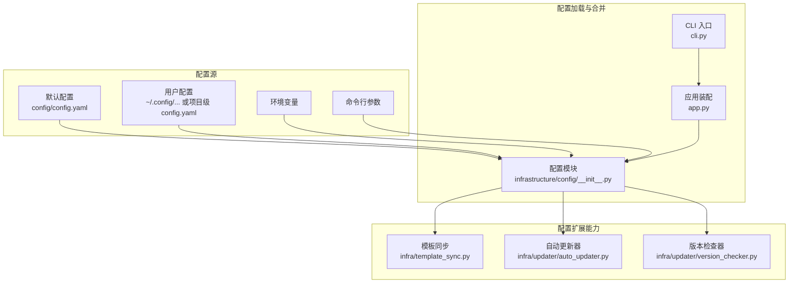
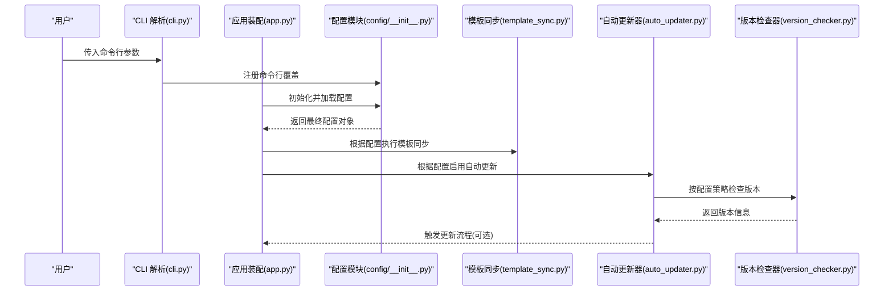
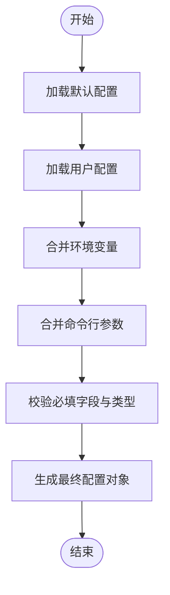
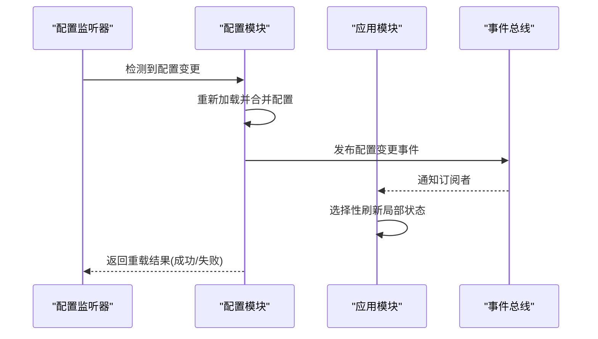
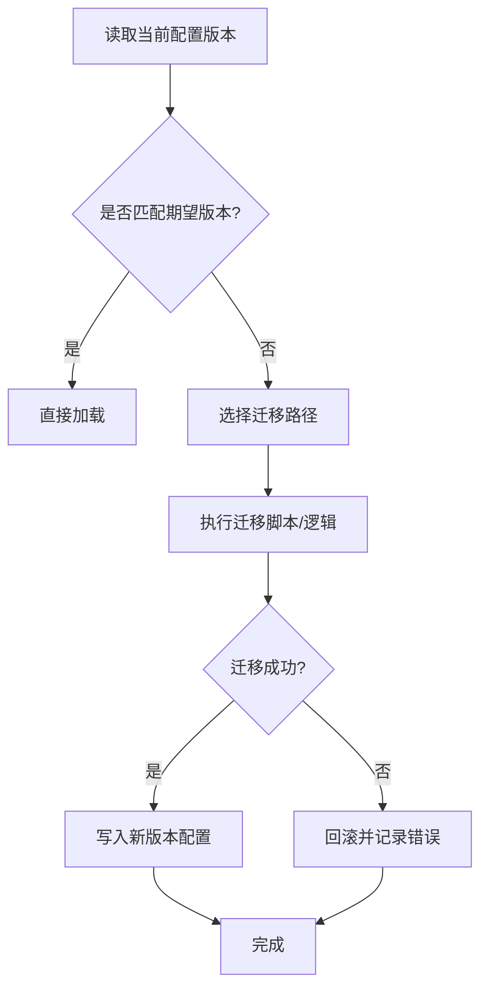
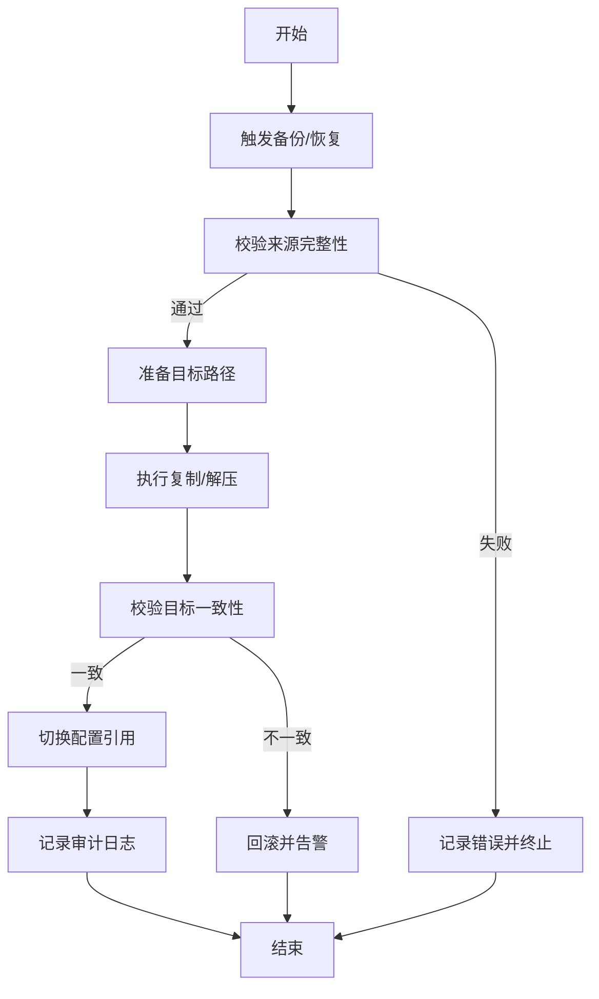
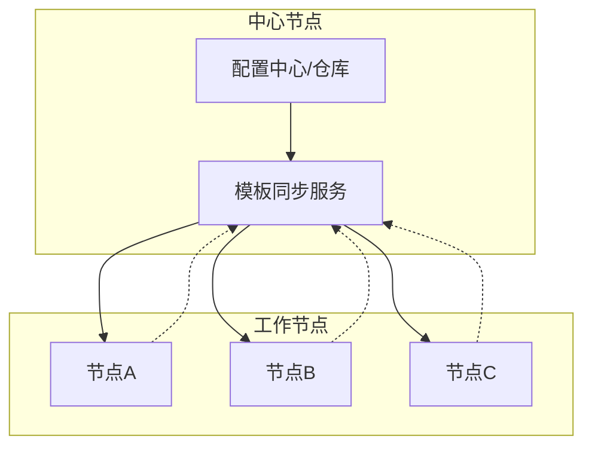
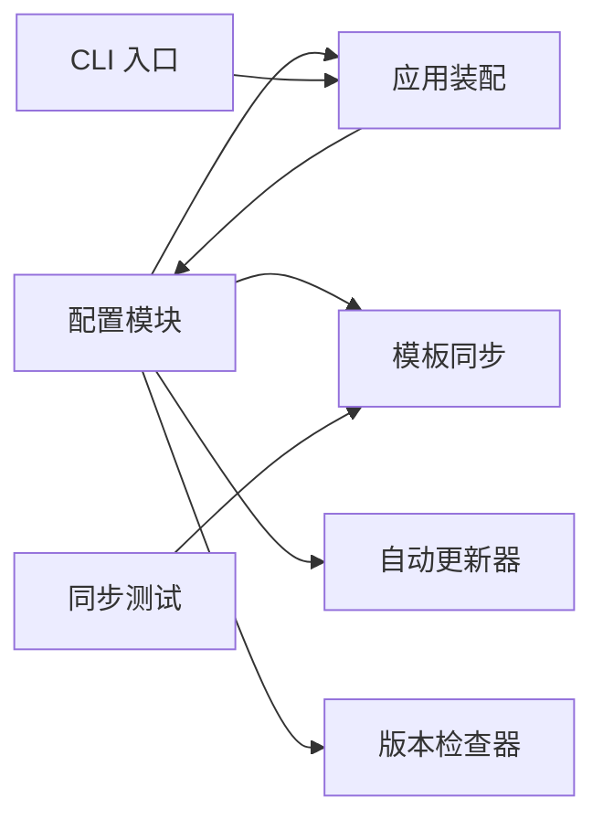

# 配置生命周期管理

<cite>
**本文引用的文件**   
- [src/paper_format_corrector/infrastructure/config/__init__.py](file://src/paper_format_corrector/infrastructure/config/__init__.py)
- [config/config.yaml](file://config/config.yaml)
- [config/updater.yaml](file://config/updater.yaml)
- [src/paper_format_corrector/cli.py](file://src/paper_format_corrector/cli.py)
- [src/paper_format_corrector/app.py](file://src/paper_format_corrector/app.py)
- [src/paper_format_corrector/infra/template_sync.py](file://src/paper_format_corrector/infra/template_sync.py)
- [src/paper_format_corrector/infra/updater/auto_updater.py](file://src/paper_format_corrector/infra/updater/auto_updater.py)
- [src/paper_format_corrector/infra/updater/version_checker.py](file://src/paper_format_corrector/infra/updater/version_checker.py)
- [tests/test_template_sync.py](file://tests/test_template_sync.py)
</cite>

## 目录
1. [简介](#简介)
2. [项目结构](#项目结构)
3. [核心组件](#核心组件)
4. [架构总览](#架构总览)
5. [详细组件分析](#详细组件分析)
6. [依赖关系分析](#依赖关系分析)
7. [性能考虑](#性能考虑)
8. [故障排查指南](#故障排查指南)
9. [结论](#结论)
10. [附录](#附录)

## 简介
本文件围绕“配置生命周期管理”展开，聚焦以下目标：
- 配置的加载顺序与优先级规则（默认配置、用户配置、环境变量、命令行参数）
- 配置热重载的实现原理与使用方法
- 配置版本管理与迁移工具的使用指南
- 配置备份与恢复的最佳实践
- 配置同步与分布式环境下的配置管理方案

为便于读者理解，文档在提供高层概览的同时，也给出与源码映射的架构图与流程图，帮助定位实现细节。

## 项目结构
与配置生命周期相关的关键位置如下：
- 配置定义与合并入口：基础设施层配置模块
- 运行时配置来源：CLI 参数解析、应用启动装配
- 配置更新与版本：自动更新器与版本检查器
- 模板与配置同步：模板同步服务
- 配置文件样例：项目根目录下的 YAML 配置

图表来源
- [src/paper_format_corrector/infrastructure/config/__init__.py](file://src/paper_format_corrector/infrastructure/config/__init__.py)
- [config/config.yaml](file://config/config.yaml)
- [src/paper_format_corrector/cli.py](file://src/paper_format_corrector/cli.py)
- [src/paper_format_corrector/app.py](file://src/paper_format_corrector/app.py)
- [src/paper_format_corrector/infra/template_sync.py](file://src/paper_format_corrector/infra/template_sync.py)
- [src/paper_format_corrector/infra/updater/auto_updater.py](file://src/paper_format_corrector/infra/updater/auto_updater.py)
- [src/paper_format_corrector/infra/updater/version_checker.py](file://src/paper_format_corrector/infra/updater/version_checker.py)

章节来源
- [src/paper_format_corrector/infrastructure/config/__init__.py](file://src/paper_format_corrector/infrastructure/config/__init__.py)
- [config/config.yaml](file://config/config.yaml)
- [src/paper_format_corrector/cli.py](file://src/paper_format_corrector/cli.py)
- [src/paper_format_corrector/app.py](file://src/paper_format_corrector/app.py)
- [src/paper_format_corrector/infra/template_sync.py](file://src/paper_format_corrector/infra/template_sync.py)
- [src/paper_format_corrector/infra/updater/auto_updater.py](file://src/paper_format_corrector/infra/updater/auto_updater.py)
- [src/paper_format_corrector/infra/updater/version_checker.py](file://src/paper_format_corrector/infra/updater/version_checker.py)

## 核心组件
- 配置模块（infrastructure/config）：负责读取默认配置、用户配置、环境变量与命令行参数，并按优先级合并为最终配置对象；提供获取与查询接口。
- CLI 入口（cli.py）：解析命令行参数，将显式参数注入到配置合并流程中。
- 应用装配（app.py）：在进程启动时初始化配置，并暴露给业务模块使用。
- 模板同步（infra/template_sync.py）：基于配置项进行远程模板拉取与本地缓存更新，体现配置对运行时行为的驱动。
- 自动更新器与版本检查器（infra/updater/*）：依据配置控制更新策略、频率与渠道，体现配置对系统升级行为的影响。

章节来源
- [src/paper_format_corrector/infrastructure/config/__init__.py](file://src/paper_format_corrector/infrastructure/config/__init__.py)
- [src/paper_format_corrector/cli.py](file://src/paper_format_corrector/cli.py)
- [src/paper_format_corrector/app.py](file://src/paper_format_corrector/app.py)
- [src/paper_format_corrector/infra/template_sync.py](file://src/paper_format_corrector/infra/template_sync.py)
- [src/paper_format_corrector/infra/updater/auto_updater.py](file://src/paper_format_corrector/infra/updater/auto_updater.py)
- [src/paper_format_corrector/infra/updater/version_checker.py](file://src/paper_format_corrector/infra/updater/version_checker.py)

## 架构总览
下图展示了配置从多源汇聚到最终生效对象的完整路径，以及关键扩展点如何消费配置。

图表来源
- [src/paper_format_corrector/cli.py](file://src/paper_format_corrector/cli.py)
- [src/paper_format_corrector/app.py](file://src/paper_format_corrector/app.py)
- [src/paper_format_corrector/infrastructure/config/__init__.py](file://src/paper_format_corrector/infrastructure/config/__init__.py)
- [src/paper_format_corrector/infra/template_sync.py](file://src/paper_format_corrector/infra/template_sync.py)
- [src/paper_format_corrector/infra/updater/auto_updater.py](file://src/paper_format_corrector/infra/updater/auto_updater.py)
- [src/paper_format_corrector/infra/updater/version_checker.py](file://src/paper_format_corrector/infra/updater/version_checker.py)

## 详细组件分析

### 配置加载顺序与优先级规则
- 默认配置：来自内置或项目级默认 YAML（如 config/config.yaml），作为基础值。
- 用户配置：来自用户目录或项目级用户自定义 YAML，用于覆盖默认值。
- 环境变量：以约定前缀或键名映射的方式注入，覆盖用户配置。
- 命令行参数：最高优先级，仅影响本次运行。

建议的合并顺序（低到高）：
1) 默认配置 → 2) 用户配置 → 3) 环境变量 → 4) 命令行参数

图表来源
- [src/paper_format_corrector/infrastructure/config/__init__.py](file://src/paper_format_corrector/infrastructure/config/__init__.py)
- [config/config.yaml](file://config/config.yaml)
- [src/paper_format_corrector/cli.py](file://src/paper_format_corrector/cli.py)

章节来源
- [src/paper_format_corrector/infrastructure/config/__init__.py](file://src/paper_format_corrector/infrastructure/config/__init__.py)
- [config/config.yaml](file://config/config.yaml)
- [src/paper_format_corrector/cli.py](file://src/paper_format_corrector/cli.py)

### 配置热重载机制
- 设计要点：
  - 监听配置变更事件（文件或外部信号）。
  - 增量合并新配置，保留高优先级源的覆盖语义。
  - 原子替换全局配置引用，避免并发读写不一致。
  - 对关键配置变更进行回滚保护与告警。
- 使用方式：
  - 通过配置模块提供的重载接口触发重新加载。
  - 结合守护进程或调度任务周期性检测变更。
  - 在业务侧订阅配置变更事件，按需刷新局部状态。

图表来源
- [src/paper_format_corrector/infrastructure/config/__init__.py](file://src/paper_format_corrector/infrastructure/config/__init__.py)

章节来源
- [src/paper_format_corrector/infrastructure/config/__init__.py](file://src/paper_format_corrector/infrastructure/config/__init__.py)

### 配置版本管理与迁移工具
- 版本标识：
  - 在配置对象或元数据中包含 schema 版本，用于兼容性与迁移判断。
- 迁移策略：
  - 向后兼容：新版本能读取旧版配置，必要时进行隐式转换。
  - 向前兼容：旧版本拒绝未知字段或降级处理。
  - 显式迁移：提供迁移脚本或 CLI 子命令，逐步升级配置结构。
- 工具集成：
  - 与自动更新器协作，在升级包中附带配置迁移步骤。
  - 版本检查器可提示是否需要手动迁移。

图表来源
- [src/paper_format_corrector/infra/updater/auto_updater.py](file://src/paper_format_corrector/infra/updater/auto_updater.py)
- [src/paper_format_corrector/infra/updater/version_checker.py](file://src/paper_format_corrector/infra/updater/version_checker.py)
- [config/updater.yaml](file://config/updater.yaml)

章节来源
- [src/paper_format_corrector/infra/updater/auto_updater.py](file://src/paper_format_corrector/infra/updater/auto_updater.py)
- [src/paper_format_corrector/infra/updater/version_checker.py](file://src/paper_format_corrector/infra/updater/version_checker.py)
- [config/updater.yaml](file://config/updater.yaml)

### 配置备份与恢复最佳实践
- 备份时机：
  - 每次重大变更前自动快照。
  - 定时备份（例如每日一次）。
- 存储策略：
  - 本地磁盘归档，保留最近 N 个版本。
  - 远端对象存储加密保存，支持版本化。
- 恢复流程：
  - 校验备份完整性与签名。
  - 灰度恢复到临时目录，验证后切换。
  - 失败自动回滚至上一可用版本。
- 审计与追踪：
  - 记录每次备份/恢复的操作人、时间、差异摘要。

[本节为通用实践说明，不直接分析具体文件]

### 配置同步与分布式环境下的配置管理
- 同步范围：
  - 模板与样式等共享资源，由模板同步服务统一分发。
  - 节点本地私有配置保持独立，避免冲突。
- 一致性模型：
  - 最终一致性：允许短暂不一致，通过重试与幂等保证收敛。
  - 冲突解决：以时间戳或版本号为准，必要时人工介入。
- 安全与权限：
  - 传输加密与鉴权。
  - 最小权限原则，区分只读与写权限。
- 观测性：
  - 指标上报：同步延迟、失败率、差异量。
  - 日志与告警：异常快速发现与定位。

图表来源
- [src/paper_format_corrector/infra/template_sync.py](file://src/paper_format_corrector/infra/template_sync.py)
- [tests/test_template_sync.py](file://tests/test_template_sync.py)

章节来源
- [src/paper_format_corrector/infra/template_sync.py](file://src/paper_format_corrector/infra/template_sync.py)
- [tests/test_template_sync.py](file://tests/test_template_sync.py)

## 依赖关系分析
- 配置模块被应用装配与 CLI 共同消费，形成“集中配置、多处使用”的耦合模式。
- 模板同步与更新器依赖配置中的网络、路径与策略项，属于弱耦合的外部能力。
- 测试用例对同步行为进行断言，确保配置驱动的同步流程稳定。

图表来源
- [src/paper_format_corrector/infrastructure/config/__init__.py](file://src/paper_format_corrector/infrastructure/config/__init__.py)
- [src/paper_format_corrector/cli.py](file://src/paper_format_corrector/cli.py)
- [src/paper_format_corrector/app.py](file://src/paper_format_corrector/app.py)
- [src/paper_format_corrector/infra/template_sync.py](file://src/paper_format_corrector/infra/template_sync.py)
- [src/paper_format_corrector/infra/updater/auto_updater.py](file://src/paper_format_corrector/infra/updater/auto_updater.py)
- [src/paper_format_corrector/infra/updater/version_checker.py](file://src/paper_format_corrector/infra/updater/version_checker.py)
- [tests/test_template_sync.py](file://tests/test_template_sync.py)

章节来源
- [src/paper_format_corrector/infrastructure/config/__init__.py](file://src/paper_format_corrector/infrastructure/config/__init__.py)
- [src/paper_format_corrector/cli.py](file://src/paper_format_corrector/cli.py)
- [src/paper_format_corrector/app.py](file://src/paper_format_corrector/app.py)
- [src/paper_format_corrector/infra/template_sync.py](file://src/paper_format_corrector/infra/template_sync.py)
- [src/paper_format_corrector/infra/updater/auto_updater.py](file://src/paper_format_corrector/infra/updater/auto_updater.py)
- [src/paper_format_corrector/infra/updater/version_checker.py](file://src/paper_format_corrector/infra/updater/version_checker.py)
- [tests/test_template_sync.py](file://tests/test_template_sync.py)

## 性能考虑
- 配置加载：
  - 避免重复 IO，采用内存缓存与懒加载。
  - 大配置分块读取，减少峰值内存占用。
- 热重载：
  - 增量合并而非全量重建，降低 CPU 开销。
  - 使用原子指针交换，避免锁竞争。
- 同步与更新：
  - 并行拉取与去重，提升吞吐。
  - 失败重试与退避，降低抖动。

[本节为通用指导，不直接分析具体文件]

## 故障排查指南
- 常见问题定位：
  - 配置未生效：确认优先级顺序与环境变量命名是否正确。
  - 热重载失败：检查文件权限、格式校验与回滚策略。
  - 同步异常：核对网络连通、鉴权信息与远端可达性。
  - 更新失败：查看版本检查器返回码与自动更新器日志。
- 诊断手段：
  - 打印最终配置快照，对比预期覆盖结果。
  - 开启调试日志，关注合并阶段与事件流。
  - 使用测试用例复现问题，缩小回归范围。

章节来源
- [src/paper_format_corrector/infra/template_sync.py](file://src/paper_format_corrector/infra/template_sync.py)
- [src/paper_format_corrector/infra/updater/auto_updater.py](file://src/paper_format_corrector/infra/updater/auto_updater.py)
- [src/paper_format_corrector/infra/updater/version_checker.py](file://src/paper_format_corrector/infra/updater/version_checker.py)
- [tests/test_template_sync.py](file://tests/test_template_sync.py)

## 结论
通过统一的配置加载与合并机制，配合热重载、版本迁移、备份恢复与同步能力，系统在灵活性与稳定性之间取得平衡。建议在生产环境中严格遵循优先级规范、完善监控与审计，并在分布式场景下采用最终一致性与幂等策略，确保配置在全局范围内可靠演进。

[本节为总结性内容，不直接分析具体文件]

## 附录
- 配置文件参考：
  - 默认配置示例：[config/config.yaml](file://config/config.yaml)
  - 更新器配置示例：[config/updater.yaml](file://config/updater.yaml)
- 关键入口与实现：
  - 配置模块：[src/paper_format_corrector/infrastructure/config/__init__.py](file://src/paper_format_corrector/infrastructure/config/__init__.py)
  - CLI 入口：[src/paper_format_corrector/cli.py](file://src/paper_format_corrector/cli.py)
  - 应用装配：[src/paper_format_corrector/app.py](file://src/paper_format_corrector/app.py)
  - 模板同步：[src/paper_format_corrector/infra/template_sync.py](file://src/paper_format_corrector/infra/template_sync.py)
  - 自动更新器：[src/paper_format_corrector/infra/updater/auto_updater.py](file://src/paper_format_corrector/infra/updater/auto_updater.py)
  - 版本检查器：[src/paper_format_corrector/infra/updater/version_checker.py](file://src/paper_format_corrector/infra/updater/version_checker.py)
  - 同步测试：[tests/test_template_sync.py](file://tests/test_template_sync.py)