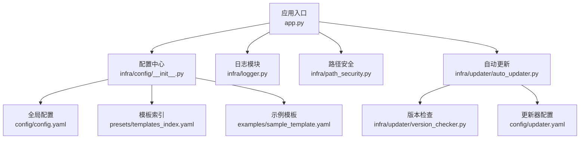
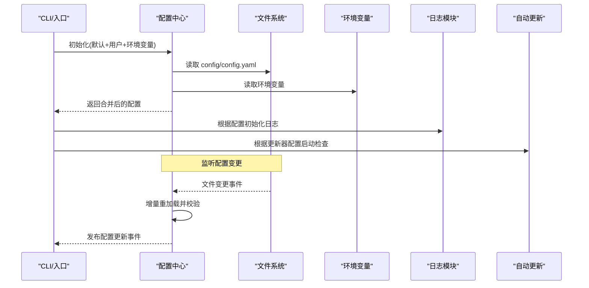

# 配置管理

<cite>
**本文引用的文件**   
- [config/config.yaml](file://config/config.yaml)
- [config/updater.yaml](file://config/updater.yaml)
- [src/paper_format_corrector/infra/config/__init__.py](file://src/paper_format_corrector/infra/config/__init__.py)
- [src/paper_format_corrector/infra/logger.py](file://src/paper_format_corrector/infra/logger.py)
- [src/paper_format_corrector/infra/path_security.py](file://src/paper_format_corrector/infra/path_security.py)
- [src/paper_format_corrector/app.py](file://src/paper_format_corrector/app.py)
- [src/paper_format_corrector/cli.py](file://src/paper_format_corrector/cli.py)
- [src/paper_format_corrector/infra/updater/auto_updater.py](file://src/paper_format_corrector/infra/updater/auto_updater.py)
- [src/paper_format_corrector/infra/updater/version_checker.py](file://src/paper_format_corrector/infra/updater/version_checker.py)
- [examples/sample_template.yaml](file://examples/sample_template.yaml)
- [presets/templates_index.yaml](file://presets/templates_index.yaml)
</cite>

## 目录
1. [简介](#简介)
2. [项目结构](#项目结构)
3. [核心组件](#核心组件)
4. [架构总览](#架构总览)
5. [详细组件分析](#详细组件分析)
6. [依赖关系分析](#依赖关系分析)
7. [性能考虑](#性能考虑)
8. [故障排查指南](#故障排查指南)
9. [结论](#结论)
10. [附录](#附录)

## 简介
本文件面向“论文格式矫正工具”的配置管理系统，系统性说明全局配置文件结构、层次与优先级、验证与错误处理、热重载与动态更新机制、最佳实践与安全建议，以及迁移与版本管理策略。文档同时提供常见配置场景与示例参考路径，帮助读者快速上手并安全高效地管理配置。

## 项目结构
配置相关资源主要分布在以下位置：
- 全局配置与更新器配置：config/config.yaml、config/updater.yaml
- 配置加载与解析：src/paper_format_corrector/infra/config/__init__.py
- 日志配置：src/paper_format_corrector/infra/logger.py
- 路径安全校验：src/paper_format_corrector/infra/path_security.py
- 应用启动与CLI入口：src/paper_format_corrector/app.py、src/paper_format_corrector/cli.py
- 自动更新与版本检查：src/paper_format_corrector/infra/updater/auto_updater.py、src/paper_format_corrector/infra/updater/version_checker.py
- 模板索引与示例：presets/templates_index.yaml、examples/sample_template.yaml

图表来源
- [src/paper_format_corrector/app.py](file://src/paper_format_corrector/app.py)
- [src/paper_format_corrector/infra/config/__init__.py](file://src/paper_format_corrector/infra/config/__init__.py)
- [src/paper_format_corrector/infra/logger.py](file://src/paper_format_corrector/infra/logger.py)
- [src/paper_format_corrector/infra/path_security.py](file://src/paper_format_corrector/infra/path_security.py)
- [src/paper_format_corrector/infra/updater/auto_updater.py](file://src/paper_format_corrector/infra/updater/auto_updater.py)
- [src/paper_format_corrector/infra/updater/version_checker.py](file://src/paper_format_corrector/infra/updater/version_checker.py)
- [config/config.yaml](file://config/config.yaml)
- [config/updater.yaml](file://config/updater.yaml)
- [presets/templates_index.yaml](file://presets/templates_index.yaml)
- [examples/sample_template.yaml](file://examples/sample_template.yaml)

章节来源
- [src/paper_format_corrector/app.py](file://src/paper_format_corrector/app.py)
- [src/paper_format_corrector/infra/config/__init__.py](file://src/paper_format_corrector/infra/config/__init__.py)
- [config/config.yaml](file://config/config.yaml)
- [config/updater.yaml](file://config/updater.yaml)
- [presets/templates_index.yaml](file://presets/templates_index.yaml)
- [examples/sample_template.yaml](file://examples/sample_template.yaml)

## 核心组件
- 配置中心（infra/config）：负责读取、合并、缓存与访问配置；提供默认值、用户覆盖与环境变量注入；支持配置变更监听与热重载。
- 日志子系统（infra/logger）：基于配置初始化日志级别、输出目标与轮转策略。
- 路径安全（infra/path_security）：对输入路径进行白名单与相对化校验，防止越权访问。
- 自动更新（infra/updater）：依据更新器配置执行版本检查与下载流程。
- CLI与应用入口：在启动阶段加载配置、初始化日志与插件，并将配置注入到各服务。

章节来源
- [src/paper_format_corrector/infra/config/__init__.py](file://src/paper_format_corrector/infra/config/__init__.py)
- [src/paper_format_corrector/infra/logger.py](file://src/paper_format_corrector/infra/logger.py)
- [src/paper_format_corrector/infra/path_security.py](file://src/paper_format_corrector/infra/path_security.py)
- [src/paper_format_corrector/infra/updater/auto_updater.py](file://src/paper_format_corrector/infra/updater/auto_updater.py)
- [src/paper_format_corrector/infra/updater/version_checker.py](file://src/paper_format_corrector/infra/updater/version_checker.py)
- [src/paper_format_corrector/app.py](file://src/paper_format_corrector/app.py)
- [src/paper_format_corrector/cli.py](file://src/paper_format_corrector/cli.py)

## 架构总览
配置系统采用“分层合并 + 事件驱动热重载”的架构：
- 默认配置：内置于代码或随包分发，作为最低优先级基线。
- 用户配置：位于 config/config.yaml，可覆盖默认项。
- 环境变量：以约定前缀注入，覆盖用户配置。
- 运行时参数：CLI 参数可在进程内覆盖部分配置。
- 热重载：通过文件系统监听或定时扫描触发重新加载，发布配置变更事件，订阅者按需刷新。

图表来源
- [src/paper_format_corrector/infra/config/__init__.py](file://src/paper_format_corrector/infra/config/__init__.py)
- [src/paper_format_corrector/infra/logger.py](file://src/paper_format_corrector/infra/logger.py)
- [src/paper_format_corrector/infra/updater/auto_updater.py](file://src/paper_format_corrector/infra/updater/auto_updater.py)
- [config/config.yaml](file://config/config.yaml)

## 详细组件分析

### 全局配置文件结构与字段说明
- 路径设置
  - 输入/输出目录：用于指定待处理文件与生成结果存放位置。
  - 模板与预设目录：指向 presets 与自定义模板集合。
  - 缓存与临时目录：提升性能与稳定性。
- 性能参数
  - 并发度：控制批处理与解析任务的并行度。
  - 内存阈值：限制单任务最大内存占用，避免 OOM。
  - 超时与重试：网络请求与外部工具调用的超时与重试策略。
- 日志配置
  - 级别：DEBUG/INFO/WARNING/ERROR。
  - 输出：控制台、文件、滚动文件。
  - 轮转：按大小或时间切分，保留份数。
- 安全选项
  - 路径白名单：仅允许访问受信任目录。
  - 沙箱模式：禁用危险操作（如执行外部命令）。
  - 敏感信息：密钥与令牌从环境变量注入，不写入配置文件。
- 更新器配置（config/updater.yaml）
  - 源地址、渠道、签名校验开关、自动安装策略等。

章节来源
- [config/config.yaml](file://config/config.yaml)
- [config/updater.yaml](file://config/updater.yaml)

### 配置层次与优先级规则
- 优先级从高到低：
  1) 运行时参数（CLI）
  2) 环境变量（带约定前缀）
  3) 用户配置（config/config.yaml）
  4) 默认配置（内置）
- 合并策略：
  - 字典型配置按键递归合并。
  - 列表型配置由高层级完全覆盖低层级。
  - 布尔与数值类型直接覆盖。
- 生效范围：
  - 全局配置影响所有子模块。
  - 特定功能可通过命名空间隔离（例如 logger.*、updater.*）。

章节来源
- [src/paper_format_corrector/infra/config/__init__.py](file://src/paper_format_corrector/infra/config/__init__.py)

### 配置验证与错误处理
- 必填字段校验：缺失关键路径或权限不足时立即报错。
- 类型与范围校验：并发度、超时、文件大小等数值需落在合理区间。
- 路径合法性校验：使用路径安全模块进行白名单与相对化检查。
- 错误分类：
  - 致命错误：阻止启动（如无法创建输出目录）。
  - 警告：降级运行（如日志文件不可写，回退至控制台）。
- 恢复策略：
  - 回退到上一版有效配置。
  - 启用最小可用配置集继续运行。

章节来源
- [src/paper_format_corrector/infra/config/__init__.py](file://src/paper_format_corrector/infra/config/__init__.py)
- [src/paper_format_corrector/infra/path_security.py](file://src/paper_format_corrector/infra/path_security.py)

### 配置热重载与动态更新
- 触发方式：
  - 文件系统监听（推荐）：监控 config/config.yaml 变更。
  - 定时扫描：周期性检测文件修改时间。
- 重载流程：
  - 增量读取变更片段。
  - 局部合并与校验。
  - 原子替换配置快照。
  - 发布事件通知订阅者刷新。
- 受影响模块：
  - 日志：动态调整级别与输出。
  - 更新器：切换渠道或开关。
  - 路径与模板：新增/移除模板索引。

图表来源
- [src/paper_format_corrector/infra/config/__init__.py](file://src/paper_format_corrector/infra/config/__init__.py)

### 自动更新与版本检查
- 版本检查：根据 updater 配置向远程源查询最新版本。
- 下载与校验：支持签名校验与完整性检查。
- 安装策略：静默安装或提示用户确认。
- 失败处理：记录日志、回退到当前版本、延迟重试。

章节来源
- [src/paper_format_corrector/infra/updater/auto_updater.py](file://src/paper_format_corrector/infra/updater/auto_updater.py)
- [src/paper_format_corrector/infra/updater/version_checker.py](file://src/paper_format_corrector/infra/updater/version_checker.py)
- [config/updater.yaml](file://config/updater.yaml)

### 日志配置详解
- 级别控制：不同环境使用不同级别（开发 DEBUG，生产 INFO）。
- 输出目标：控制台便于调试，文件便于审计。
- 轮转策略：按大小或时间切分，保留历史日志。
- 敏感信息脱敏：禁止打印密钥与令牌。

章节来源
- [src/paper_format_corrector/infra/logger.py](file://src/paper_format_corrector/infra/logger.py)

### 路径安全与输入校验
- 白名单目录：仅允许访问受信任路径。
- 相对化与规范化：消除 .. 与符号链接风险。
- 权限检查：确保读写权限满足需求。

章节来源
- [src/paper_format_corrector/infra/path_security.py](file://src/paper_format_corrector/infra/path_security.py)

### 模板与预设配置
- 模板索引：templates_index.yaml 维护可用模板清单与元数据。
- 示例模板：examples/sample_template.yaml 提供基础模板结构参考。
- 预置模板：presets 下包含多种学术与机构模板。

章节来源
- [presets/templates_index.yaml](file://presets/templates_index.yaml)
- [examples/sample_template.yaml](file://examples/sample_template.yaml)

## 依赖关系分析
- 配置中心依赖：
  - 文件系统：读取 YAML 配置。
  - 环境变量：注入运行时差异。
  - 路径安全：校验路径合法性。
  - 日志：记录配置加载与变更事件。
- 自动更新依赖：
  - 网络请求：获取版本信息与下载包。
  - 校验工具：校验签名与完整性。
  - 配置中心：读取更新器配置。

图表来源
- [src/paper_format_corrector/infra/config/__init__.py](file://src/paper_format_corrector/infra/config/__init__.py)
- [src/paper_format_corrector/infra/path_security.py](file://src/paper_format_corrector/infra/path_security.py)
- [src/paper_format_corrector/infra/logger.py](file://src/paper_format_corrector/infra/logger.py)
- [src/paper_format_corrector/infra/updater/auto_updater.py](file://src/paper_format_corrector/infra/updater/auto_updater.py)

## 性能考虑
- 并发度与队列：根据 CPU 与 IO 特性调整并发度，避免上下文切换开销过大。
- 缓存策略：对模板与样式解析结果进行缓存，减少重复计算。
- 内存上限：为大型文档处理设置内存阈值，必要时分块处理。
- 日志开销：生产环境降低日志级别与频率，避免磁盘 IO 瓶颈。

[本节为通用指导，无需具体文件引用]

## 故障排查指南
- 常见问题
  - 配置语法错误：检查 YAML 缩进与键名拼写。
  - 路径无效：确认白名单目录存在且具备读写权限。
  - 日志无法写入：检查日志目录权限与磁盘空间。
  - 更新失败：核对网络连通性与签名校验配置。
- 定位方法
  - 开启 DEBUG 日志，查看配置加载与合并过程。
  - 使用最小可用配置复现问题。
  - 对比变更前后配置差异，逐步缩小范围。
- 恢复步骤
  - 回滚到上一版有效配置快照。
  - 关闭热重载，重启服务以稳定运行。
  - 若自动更新失败，手动下载并安装新版本。

章节来源
- [src/paper_format_corrector/infra/config/__init__.py](file://src/paper_format_corrector/infra/config/__init__.py)
- [src/paper_format_corrector/infra/logger.py](file://src/paper_format_corrector/infra/logger.py)
- [src/paper_format_corrector/infra/updater/auto_updater.py](file://src/paper_format_corrector/infra/updater/auto_updater.py)

## 结论
本配置管理系统通过分层合并、严格校验与热重载机制，提供了灵活、安全、可运维的配置能力。结合路径安全与日志体系，能够在多环境与大规模场景中保持稳定与可观测性。遵循本文的最佳实践与迁移建议，可有效降低配置风险并提升交付效率。

[本节为总结性内容，无需具体文件引用]

## 附录

### 常见配置场景与示例
- 本地开发
  - 提高日志级别，启用控制台输出。
  - 增大并发度以提升本地测试速度。
  - 关闭自动更新以减少干扰。
- 生产部署
  - 限制并发与内存阈值，启用日志轮转。
  - 启用路径白名单与沙箱模式。
  - 将密钥与令牌通过环境变量注入。
- 批量处理
  - 配置输入/输出目录与队列大小。
  - 启用任务重试与超时保护。
- 模板管理
  - 在模板索引中注册新模板。
  - 使用示例模板作为起点进行定制。

章节来源
- [config/config.yaml](file://config/config.yaml)
- [config/updater.yaml](file://config/updater.yaml)
- [presets/templates_index.yaml](file://presets/templates_index.yaml)
- [examples/sample_template.yaml](file://examples/sample_template.yaml)

### 配置迁移与版本管理
- 向后兼容
  - 新增字段需提供默认值。
  - 废弃字段保留一段时间并给出告警。
- 迁移脚本
  - 提供一键迁移工具，将旧格式转换为新格式。
  - 迁移后执行校验，确保一致性。
- 版本标记
  - 在配置头部声明 schema 版本。
  - 升级时检查版本并提示必要变更。
- 回滚策略
  - 保存最近 N 个有效配置快照。
  - 支持一键回滚到指定版本。

章节来源
- [src/paper_format_corrector/infra/config/__init__.py](file://src/paper_format_corrector/infra/config/__init__.py)

### 安全性建议
- 最小权限原则：仅授予必要的目录访问权限。
- 敏感信息外置：使用环境变量或密钥管理服务。
- 输入净化：对所有路径与文件名进行规范化与白名单校验。
- 审计与追踪：记录配置变更与关键操作日志。

章节来源
- [src/paper_format_corrector/infra/path_security.py](file://src/paper_format_corrector/infra/path_security.py)
- [src/paper_format_corrector/infra/logger.py](file://src/paper_format_corrector/infra/logger.py)