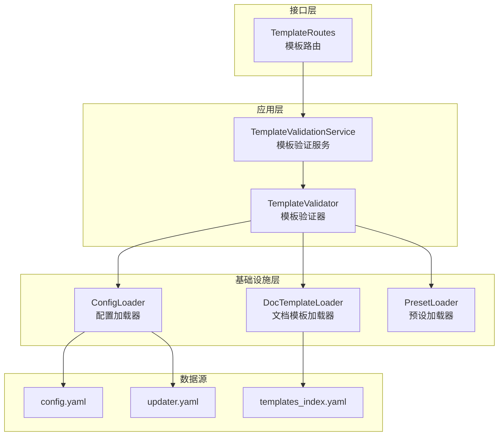
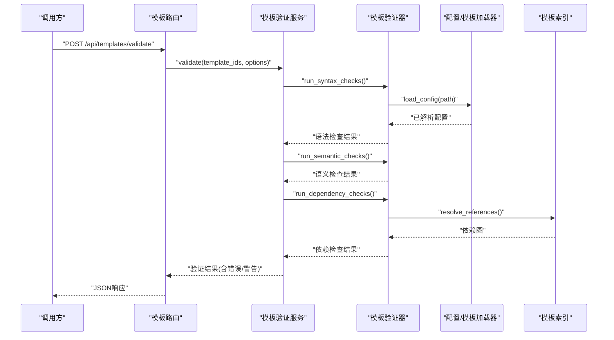
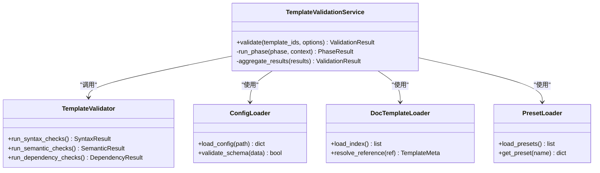
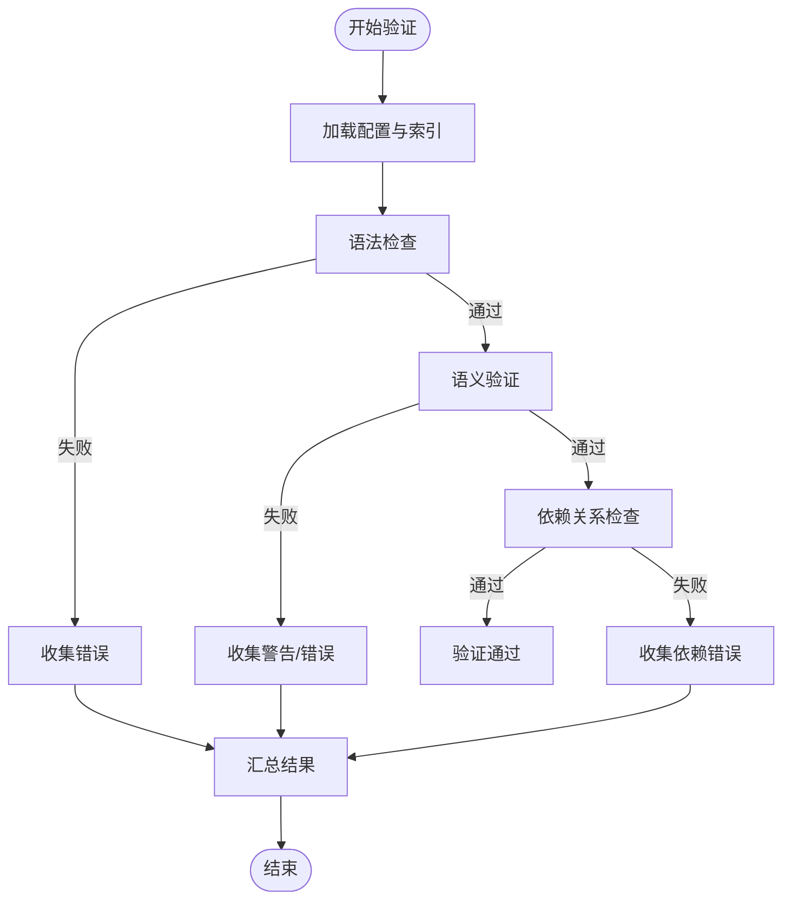
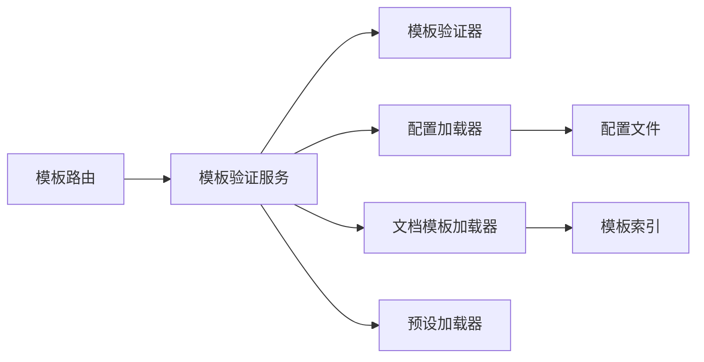

# 配置验证与错误处理

<cite>
**本文引用的文件**   
- [src/paper_format_corrector/application/services/template_validation.py](file://src/paper_format_corrector/application/services/template_validation.py)
- [src/paper_format_corrector/application/services/template_validation_service.py](file://src/paper_format_corrector/application/services/template_validation_service.py)
- [src/paper_format_corrector/infrastructure/config/config_loader.py](file://src/paper_format_corrector/infrastructure/config/config_loader.py)
- [src/paper_format_corrector/infra/doc_template_loader.py](file://src/paper_format_corrector/infra/doc_template_loader.py)
- [src/paper_format_corrector/infra/preset_loader.py](file://src/paper_format_corrector/infra/preset_loader.py)
- [src/paper_format_corrector/interfaces/api/routes/template_routes.py](file://src/paper_format_corrector/interfaces/api/routes/template_routes.py)
- [config/config.yaml](file://config/config.yaml)
- [config/updater.yaml](file://config/updater.yaml)
- [presets/templates_index.yaml](file://presets/templates_index.yaml)
- [tests/test_template_validation_and_import.py](file://tests/test_template_validation_and_import.py)
</cite>

## 目录
1. [简介](#简介)
2. [项目结构](#项目结构)
3. [核心组件](#核心组件)
4. [架构总览](#架构总览)
5. [详细组件分析](#详细组件分析)
6. [依赖关系分析](#依赖关系分析)
7. [性能考虑](#性能考虑)
8. [故障排查指南](#故障排查指南)
9. [结论](#结论)
10. [附录](#附录)

## 简介
本文件面向“论文格式矫正工具”的配置验证系统，系统性阐述配置校验的规则与流程，覆盖语法检查、语义验证、依赖关系检查等关键环节；详细说明常见配置错误的类型、错误消息含义与修复建议；提供配置验证API的使用方法与集成示例；并给出测试工具与调试技巧，以及常见问题诊断与修复指南。

## 项目结构
配置验证相关代码主要分布在应用层服务、基础设施加载器、接口路由与测试用例中：
- 应用层服务负责编排验证流程、聚合错误信息、对外暴露验证能力
- 基础设施层负责读取与解析配置文件（YAML）、模板索引、预设模板等
- API路由将验证能力暴露为HTTP接口，供外部系统集成
- 测试用例覆盖关键路径与边界场景

图表来源
- [src/paper_format_corrector/application/services/template_validation_service.py](file://src/paper_format_corrector/application/services/template_validation_service.py)
- [src/paper_format_corrector/application/services/template_validation.py](file://src/paper_format_corrector/application/services/template_validation.py)
- [src/paper_format_corrector/infrastructure/config/config_loader.py](file://src/paper_format_corrector/infrastructure/config/config_loader.py)
- [src/paper_format_corrector/infra/doc_template_loader.py](file://src/paper_format_corrector/infra/doc_template_loader.py)
- [src/paper_format_corrector/infra/preset_loader.py](file://src/paper_format_corrector/infra/preset_loader.py)
- [src/paper_format_corrector/interfaces/api/routes/template_routes.py](file://src/paper_format_corrector/interfaces/api/routes/template_routes.py)
- [config/config.yaml](file://config/config.yaml)
- [config/updater.yaml](file://config/updater.yaml)
- [presets/templates_index.yaml](file://presets/templates_index.yaml)

章节来源
- [src/paper_format_corrector/application/services/template_validation_service.py](file://src/paper_format_corrector/application/services/template_validation_service.py)
- [src/paper_format_corrector/application/services/template_validation.py](file://src/paper_format_corrector/application/services/template_validation.py)
- [src/paper_format_corrector/infrastructure/config/config_loader.py](file://src/paper_format_corrector/infrastructure/config/config_loader.py)
- [src/paper_format_corrector/infra/doc_template_loader.py](file://src/paper_format_corrector/infra/doc_template_loader.py)
- [src/paper_format_corrector/infra/preset_loader.py](file://src/paper_format_corrector/infra/preset_loader.py)
- [src/paper_format_corrector/interfaces/api/routes/template_routes.py](file://src/paper_format_corrector/interfaces/api/routes/template_routes.py)
- [config/config.yaml](file://config/config.yaml)
- [config/updater.yaml](file://config/updater.yaml)
- [presets/templates_index.yaml](file://presets/templates_index.yaml)

## 核心组件
- 模板验证服务：作为入口协调多个验证阶段，汇总错误与警告，返回统一结果对象
- 模板验证器：实现具体规则集，包括语法、语义、依赖关系检查
- 配置加载器：负责读取与解析YAML配置，进行基础语法校验与默认值填充
- 文档模板加载器：加载模板索引与模板元数据，用于依赖解析与引用检查
- 预设加载器：加载预设模板集合，确保模板存在性与一致性
- 模板路由：将验证能力以REST接口形式暴露，支持批量与增量验证

章节来源
- [src/paper_format_corrector/application/services/template_validation_service.py](file://src/paper_format_corrector/application/services/template_validation_service.py)
- [src/paper_format_corrector/application/services/template_validation.py](file://src/paper_format_corrector/application/services/template_validation.py)
- [src/paper_format_corrector/infrastructure/config/config_loader.py](file://src/paper_format_corrector/infrastructure/config/config_loader.py)
- [src/paper_format_corrector/infra/doc_template_loader.py](file://src/paper_format_corrector/infra/doc_template_loader.py)
- [src/paper_format_corrector/infra/preset_loader.py](file://src/paper_format_corrector/infra/preset_loader.py)
- [src/paper_format_corrector/interfaces/api/routes/template_routes.py](file://src/paper_format_corrector/interfaces/api/routes/template_routes.py)

## 架构总览
配置验证的整体流程如下：
- 输入：用户提供的模板配置或模板ID列表
- 阶段一：语法检查（YAML语法、必填字段、类型约束）
- 阶段二：语义验证（字段取值范围、业务规则、互斥/依赖关系）
- 阶段三：依赖关系检查（模板间引用、资源路径、外部依赖可用性）
- 输出：验证结果（通过/失败），包含错误与警告明细、定位信息与修复建议

图表来源
- [src/paper_format_corrector/interfaces/api/routes/template_routes.py](file://src/paper_format_corrector/interfaces/api/routes/template_routes.py)
- [src/paper_format_corrector/application/services/template_validation_service.py](file://src/paper_format_corrector/application/services/template_validation_service.py)
- [src/paper_format_corrector/application/services/template_validation.py](file://src/paper_format_corrector/application/services/template_validation.py)
- [src/paper_format_corrector/infrastructure/config/config_loader.py](file://src/paper_format_corrector/infrastructure/config/config_loader.py)
- [src/paper_format_corrector/infra/doc_template_loader.py](file://src/paper_format_corrector/infra/doc_template_loader.py)

## 详细组件分析

### 模板验证服务（TemplateValidationService）
职责与流程
- 编排验证阶段：语法、语义、依赖
- 收集错误与警告，生成结构化结果
- 提供批量验证与增量验证能力
- 与路由层对接，返回标准化响应

关键方法
- validate：主入口，按阶段执行验证并汇总结果
- run_phase：执行单个阶段的验证逻辑
- aggregate_results：合并各阶段结果，去重与排序

图表来源
- [src/paper_format_corrector/application/services/template_validation_service.py](file://src/paper_format_corrector/application/services/template_validation_service.py)
- [src/paper_format_corrector/application/services/template_validation.py](file://src/paper_format_corrector/application/services/template_validation.py)
- [src/paper_format_corrector/infrastructure/config/config_loader.py](file://src/paper_format_corrector/infrastructure/config/config_loader.py)
- [src/paper_format_corrector/infra/doc_template_loader.py](file://src/paper_format_corrector/infra/doc_template_loader.py)
- [src/paper_format_corrector/infra/preset_loader.py](file://src/paper_format_corrector/infra/preset_loader.py)

章节来源
- [src/paper_format_corrector/application/services/template_validation_service.py](file://src/paper_format_corrector/application/services/template_validation_service.py)
- [src/paper_format_corrector/application/services/template_validation.py](file://src/paper_format_corrector/application/services/template_validation.py)

### 模板验证器（TemplateValidator）
验证规则分类
- 语法检查
  - YAML语法正确性
  - 必填字段存在性
  - 字段类型与格式约束（如数值范围、枚举值）
- 语义验证
  - 业务规则（如标题层级、编号规则、样式命名规范）
  - 互斥与依赖关系（如某些字段仅在特定模式下启用）
- 依赖关系检查
  - 模板间引用完整性（父模板、子模板、共享片段）
  - 资源路径有效性（图片、字体、样式文件）
  - 外部依赖可用性（插件、转换器、导出器）

错误分类与消息结构
- 错误级别：致命（阻断）、严重（需修复）、警告（可忽略）
- 错误位置：文件路径、行号、键路径
- 修复建议：针对常见错误的自动修复提示

图表来源
- [src/paper_format_corrector/application/services/template_validation.py](file://src/paper_format_corrector/application/services/template_validation.py)

章节来源
- [src/paper_format_corrector/application/services/template_validation.py](file://src/paper_format_corrector/application/services/template_validation.py)

### 配置加载器（ConfigLoader）
功能要点
- 读取YAML配置文件并进行基础语法校验
- 提供默认值填充与类型转换
- 对敏感路径与安全策略进行校验

典型配置项
- 全局设置（输出目录、日志级别、并发数）
- 更新器设置（版本检查、镜像源）
- 模板索引路径与缓存策略

章节来源
- [src/paper_format_corrector/infrastructure/config/config_loader.py](file://src/paper_format_corrector/infrastructure/config/config_loader.py)
- [config/config.yaml](file://config/config.yaml)
- [config/updater.yaml](file://config/updater.yaml)

### 文档模板加载器（DocTemplateLoader）
功能要点
- 加载模板索引（templates_index.yaml）
- 解析模板元数据与依赖关系
- 提供引用解析与冲突检测

章节来源
- [src/paper_format_corrector/infra/doc_template_loader.py](file://src/paper_format_corrector/infra/doc_template_loader.py)
- [presets/templates_index.yaml](file://presets/templates_index.yaml)

### 预设加载器（PresetLoader）
功能要点
- 加载预设模板集合
- 校验预设模板的完整性与一致性
- 提供预设模板的快速选择与替换

章节来源
- [src/paper_format_corrector/infra/preset_loader.py](file://src/paper_format_corrector/infra/preset_loader.py)

### 模板路由（TemplateRoutes）
接口概览
- POST /api/templates/validate：提交模板ID列表与选项，返回验证结果
- GET /api/templates/index：获取模板索引与可用模板清单
- POST /api/templates/import：导入模板并触发验证

请求与响应
- 请求体包含模板ID数组、验证选项（是否严格模式、是否跳过依赖检查等）
- 响应体包含状态码、错误与警告列表、定位信息与修复建议

章节来源
- [src/paper_format_corrector/interfaces/api/routes/template_routes.py](file://src/paper_format_corrector/interfaces/api/routes/template_routes.py)

## 依赖关系分析
组件耦合与内聚
- 模板验证服务高内聚地编排验证流程，低耦合地依赖加载器与验证器
- 配置加载器与模板加载器解耦，分别关注配置与模板元数据
- 路由层仅依赖服务层，保持接口稳定

潜在循环依赖
- 当前设计避免循环依赖，服务层不直接依赖路由层
- 加载器之间通过接口抽象减少硬编码耦合

外部依赖与集成点
- YAML解析库（PyYAML）
- 文件系统访问（路径安全校验）
- HTTP框架（FastAPI/Flask，视实际实现）

图表来源
- [src/paper_format_corrector/interfaces/api/routes/template_routes.py](file://src/paper_format_corrector/interfaces/api/routes/template_routes.py)
- [src/paper_format_corrector/application/services/template_validation_service.py](file://src/paper_format_corrector/application/services/template_validation_service.py)
- [src/paper_format_corrector/application/services/template_validation.py](file://src/paper_format_corrector/application/services/template_validation.py)
- [src/paper_format_corrector/infrastructure/config/config_loader.py](file://src/paper_format_corrector/infrastructure/config/config_loader.py)
- [src/paper_format_corrector/infra/doc_template_loader.py](file://src/paper_format_corrector/infra/doc_template_loader.py)
- [src/paper_format_corrector/infra/preset_loader.py](file://src/paper_format_corrector/infra/preset_loader.py)

章节来源
- [src/paper_format_corrector/interfaces/api/routes/template_routes.py](file://src/paper_format_corrector/interfaces/api/routes/template_routes.py)
- [src/paper_format_corrector/application/services/template_validation_service.py](file://src/paper_format_corrector/application/services/template_validation_service.py)
- [src/paper_format_corrector/application/services/template_validation.py](file://src/paper_format_corrector/application/services/template_validation.py)
- [src/paper_format_corrector/infrastructure/config/config_loader.py](file://src/paper_format_corrector/infrastructure/config/config_loader.py)
- [src/paper_format_corrector/infra/doc_template_loader.py](file://src/paper_format_corrector/infra/doc_template_loader.py)
- [src/paper_format_corrector/infra/preset_loader.py](file://src/paper_format_corrector/infra/preset_loader.py)

## 性能考虑
- 批量验证时采用并行化策略，限制并发度以避免I/O瓶颈
- 模板索引与预设缓存，减少重复解析开销
- 懒加载依赖图，按需解析引用，降低内存占用
- 对大型配置进行分块校验，提升响应时间

[本节为通用指导，无需源码引用]

## 故障排查指南
常见错误类型与修复建议
- 语法错误
  - 现象：YAML解析失败、缩进错误、非法字符
  - 修复：使用标准YAML编辑器校验，修正缩进与引号
- 缺失必填字段
  - 现象：缺少模板名称、版本、作者等关键字段
  - 修复：根据错误消息中的键路径补全字段
- 类型不匹配
  - 现象：数值字段传入字符串、枚举值不在允许范围
  - 修复：修正数据类型与取值范围
- 语义冲突
  - 现象：互斥字段同时启用、依赖条件未满足
  - 修复：调整字段组合以满足业务规则
- 依赖缺失
  - 现象：引用的模板不存在、资源路径无效
  - 修复：确认模板ID与资源路径，必要时更新索引

调试技巧
- 开启详细日志，记录每个验证阶段的中间结果
- 使用最小复现案例隔离问题
- 逐步禁用非关键验证阶段，定位根因
- 借助测试用例对比预期与实际输出

章节来源
- [tests/test_template_validation_and_import.py](file://tests/test_template_validation_and_import.py)

## 结论
配置验证系统通过分层设计与模块化组织，实现了从语法到语义再到依赖关系的完整校验闭环。配合清晰的错误消息与修复建议，开发者与用户可以快速定位并解决问题。API层的暴露使得验证能力易于集成到自动化流水线与协作平台中。

[本节为总结，无需源码引用]

## 附录
- 配置样例与最佳实践
  - 参考config.yaml与updater.yaml的结构与注释
  - 遵循模板索引的命名与版本约定
- API使用示例
  - 提交模板ID列表进行批量验证
  - 在CI/CD中集成验证步骤，阻断不合格构建
- 测试工具
  - 使用单元测试与集成测试覆盖关键路径
  - 构造边界用例（空配置、超大配置、循环引用）

[本节为补充说明，无需源码引用]