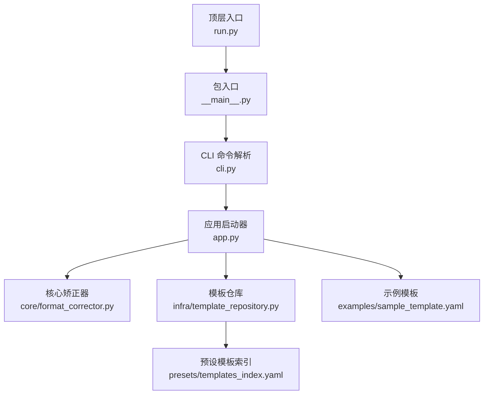
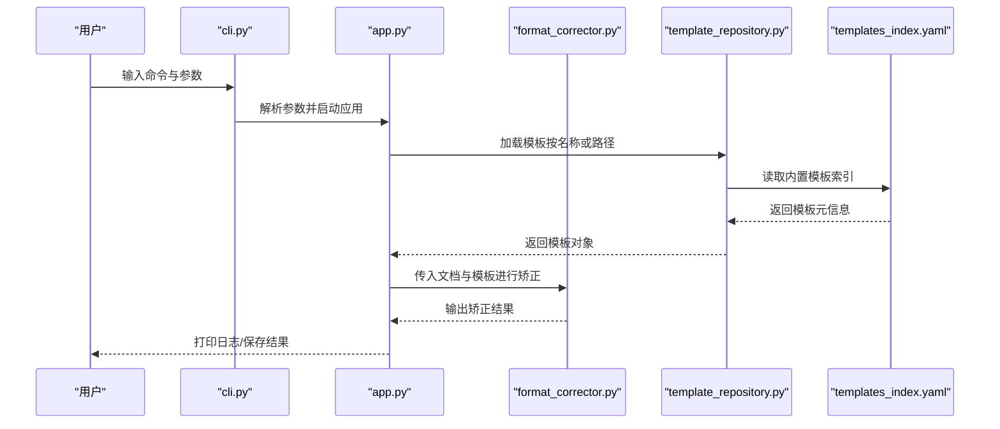
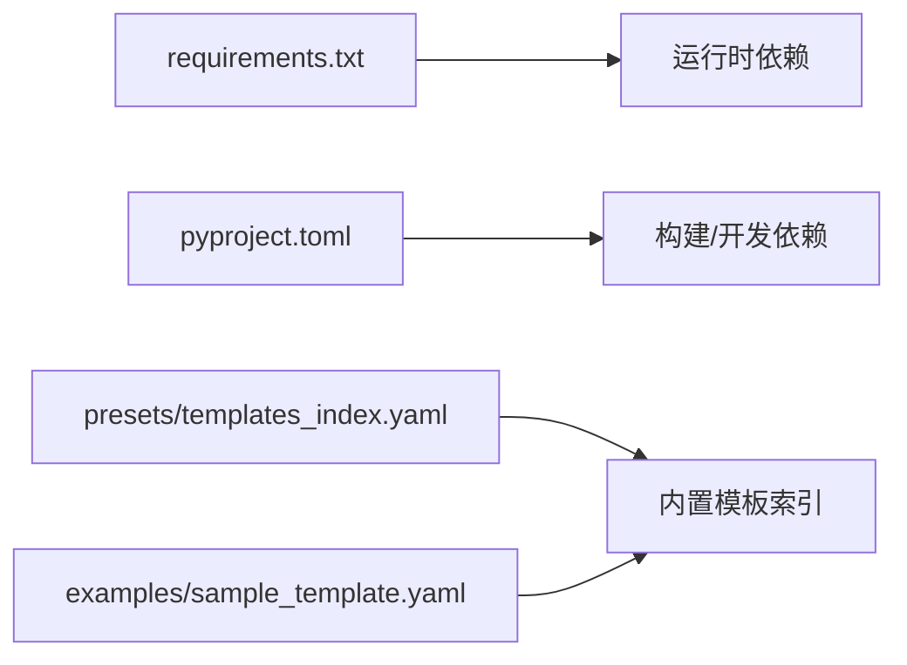

# 快速开始

<cite>
**本文引用的文件**   
- [README.md](file://README.md)
- [pyproject.toml](file://pyproject.toml)
- [requirements.txt](file://requirements.txt)
- [run.py](file://run.py)
- [src/paper_format_corrector/__main__.py](file://src/paper_format_corrector/__main__.py)
- [src/paper_format_corrector/cli.py](file://src/paper_format_corrector/cli.py)
- [src/paper_format_corrector/app.py](file://src/paper_format_corrector/app.py)
- [src/paper_format_corrector/core/format_corrector.py](file://src/paper_format_corrector/core/format_corrector.py)
- [src/paper_format_corrector/infra/template_repository.py](file://src/paper_format_corrector/infra/template_repository.py)
- [presets/templates_index.yaml](file://presets/templates_index.yaml)
- [examples/sample_template.yaml](file://examples/sample_template.yaml)
- [tests/test_cli_integration.py](file://tests/test_cli_integration.py)
- [tests/test_basic.py](file://tests/test_basic.py)
</cite>

## 目录
1. [简介](#简介)
2. [项目结构](#项目结构)
3. [核心组件](#核心组件)
4. [架构总览](#架构总览)
5. [详细组件分析](#详细组件分析)
6. [依赖分析](#依赖分析)
7. [性能考虑](#性能考虑)
8. [故障排查指南](#故障排查指南)
9. [结论](#结论)
10. [附录](#附录)

## 简介
本指南面向首次使用者，帮助你在30分钟内完成环境准备、安装与运行第一个论文格式矫正任务。你将学到：
- Python版本要求与环境配置
- 多种安装方式（pip、源码、Docker）
- 基础使用示例（单次矫正到批量处理）
- 常用命令行参数与选项
- 首个自定义模板创建教程
- 常见问题与验证方法
- 获取帮助的渠道与支持资源

## 项目结构
仓库采用分层组织：入口与CLI位于顶层与接口层，核心逻辑在core与应用服务在application/infrastructure中，预设模板与示例在presets与examples中，测试用例在tests中。

图表来源
- [run.py:1-200](file://run.py#L1-L200)
- [src/paper_format_corrector/__main__.py:1-200](file://src/paper_format_corrector/__main__.py#L1-L200)
- [src/paper_format_corrector/cli.py:1-200](file://src/paper_format_corrector/cli.py#L1-L200)
- [src/paper_format_corrector/app.py:1-200](file://src/paper_format_corrector/app.py#L1-L200)
- [src/paper_format_corrector/core/format_corrector.py:1-200](file://src/paper_format_corrector/core/format_corrector.py#L1-L200)
- [src/paper_format_corrector/infra/template_repository.py:1-200](file://src/paper_format_corrector/infra/template_repository.py#L1-L200)
- [presets/templates_index.yaml:1-200](file://presets/templates_index.yaml#L1-L200)
- [examples/sample_template.yaml:1-200](file://examples/sample_template.yaml#L1-L200)

章节来源
- [README.md:1-200](file://README.md#L1-L200)
- [pyproject.toml:1-200](file://pyproject.toml#L1-L200)
- [requirements.txt:1-200](file://requirements.txt#L1-L200)
- [run.py:1-200](file://run.py#L1-L200)
- [src/paper_format_corrector/__main__.py:1-200](file://src/paper_format_corrector/__main__.py#L1-L200)
- [src/paper_format_corrector/cli.py:1-200](file://src/paper_format_corrector/cli.py#L1-L200)
- [src/paper_format_corrector/app.py:1-200](file://src/paper_format_corrector/app.py#L1-L200)
- [src/paper_format_corrector/core/format_corrector.py:1-200](file://src/paper_format_corrector/core/format_corrector.py#L1-L200)
- [src/paper_format_corrector/infra/template_repository.py:1-200](file://src/paper_format_corrector/infra/template_repository.py#L1-L200)
- [presets/templates_index.yaml:1-200](file://presets/templates_index.yaml#L1-L200)
- [examples/sample_template.yaml:1-200](file://examples/sample_template.yaml#L1-L200)

## 核心组件
- 入口与CLI
  - run.py：提供便捷脚本入口，便于直接执行。
  - __main__.py：支持以模块方式运行（python -m paper_format_corrector）。
  - cli.py：定义命令行参数、子命令与流程编排。
- 应用层
  - app.py：负责初始化上下文、加载配置与模板、调度核心矫正流程。
- 核心逻辑
  - core/format_corrector.py：实现文档解析、规则匹配与格式修正的核心算法。
- 模板系统
  - infra/template_repository.py：管理模板的加载、校验与缓存。
  - presets/templates_index.yaml：内置模板索引，用于快速选择学校或期刊模板。
  - examples/sample_template.yaml：示例模板，供用户参考与扩展。

章节来源
- [run.py:1-200](file://run.py#L1-L200)
- [src/paper_format_corrector/__main__.py:1-200](file://src/paper_format_corrector/__main__.py#L1-L200)
- [src/paper_format_corrector/cli.py:1-200](file://src/paper_format_corrector/cli.py#L1-L200)
- [src/paper_format_corrector/app.py:1-200](file://src/paper_format_corrector/app.py#L1-L200)
- [src/paper_format_corrector/core/format_corrector.py:1-200](file://src/paper_format_corrector/core/format_corrector.py#L1-L200)
- [src/paper_format_corrector/infra/template_repository.py:1-200](file://src/paper_format_corrector/infra/template_repository.py#L1-L200)
- [presets/templates_index.yaml:1-200](file://presets/templates_index.yaml#L1-L200)
- [examples/sample_template.yaml:1-200](file://examples/sample_template.yaml#L1-L200)

## 架构总览
下图展示了从命令行到核心矫正器的调用链路与数据流向。

图表来源
- [src/paper_format_corrector/cli.py:1-200](file://src/paper_format_corrector/cli.py#L1-L200)
- [src/paper_format_corrector/app.py:1-200](file://src/paper_format_corrector/app.py#L1-L200)
- [src/paper_format_corrector/core/format_corrector.py:1-200](file://src/paper_format_corrector/core/format_corrector.py#L1-L200)
- [src/paper_format_corrector/infra/template_repository.py:1-200](file://src/paper_format_corrector/infra/template_repository.py#L1-L200)
- [presets/templates_index.yaml:1-200](file://presets/templates_index.yaml#L1-L200)

## 详细组件分析

### 环境与依赖准备
- Python版本要求
  - 请查看项目配置文件中的Python版本约束与依赖声明。
- 依赖清单
  - requirements.txt列出运行时依赖；pyproject.toml包含构建与开发依赖。
- 虚拟环境建议
  - 推荐使用venv或conda创建隔离环境，避免系统库冲突。

章节来源
- [pyproject.toml:1-200](file://pyproject.toml#L1-L200)
- [requirements.txt:1-200](file://requirements.txt#L1-L200)

### 安装方式

#### pip安装
- 步骤
  - 创建并激活虚拟环境
  - 通过pip安装项目（若发布为包则直接安装；否则可安装本地路径）
  - 验证安装成功（见“验证安装”小节）
- 注意
  - 如遇编译错误，检查是否满足Python版本与系统工具链要求。

章节来源
- [pyproject.toml:1-200](file://pyproject.toml#L1-L200)
- [requirements.txt:1-200](file://requirements.txt#L1-L200)

#### 源码安装
- 步骤
  - 克隆仓库
  - 进入项目根目录
  - 安装依赖（参考requirements.txt）
  - 使用run.py或python -m方式运行
- 适用场景
  - 需要修改源码或参与贡献时推荐此方式。

章节来源
- [run.py:1-200](file://run.py#L1-L200)
- [src/paper_format_corrector/__main__.py:1-200](file://src/paper_format_corrector/__main__.py#L1-L200)
- [requirements.txt:1-200](file://requirements.txt#L1-L200)

#### Docker部署
- 说明
  - 若仓库提供Docker镜像或Dockerfile，可通过docker命令拉取并运行容器化版本。
- 基本用法
  - 将本地input/output目录挂载至容器，指定模板与输入文档路径后执行。
- 注意
  - 确保宿主机路径权限正确，避免写入失败。

章节来源
- [README.md:1-200](file://README.md#L1-L200)

### 基础使用示例

#### 单次文档矫正
- 典型流程
  - 准备输入文档与模板（可使用内置模板或自定义模板）
  - 执行CLI命令，指定输入与输出路径
  - 查看生成的矫正结果与日志
- 关键要点
  - 模板名称可从内置索引中选择，或直接指向模板文件路径。

章节来源
- [src/paper_format_corrector/cli.py:1-200](file://src/paper_format_corrector/cli.py#L1-L200)
- [presets/templates_index.yaml:1-200](file://presets/templates_index.yaml#L1-L200)

#### 批量处理
- 思路
  - 遍历输入目录下的文档，逐个调用矫正流程
  - 可结合任务队列或服务端API进行并发处理
- 注意事项
  - 控制并发度，避免IO瓶颈
  - 记录每个文件的处理状态与错误信息

章节来源
- [src/paper_format_corrector/app.py:1-200](file://src/paper_format_corrector/app.py#L1-L200)
- [src/paper_format_corrector/core/format_corrector.py:1-200](file://src/paper_format_corrector/core/format_corrector.py#L1-L200)

### 常用命令行参数与选项
- 输入/输出
  - 指定输入文档路径、输出目录或文件名
- 模板选择
  - 通过模板名称或模板文件路径选择样式
- 日志与调试
  - 设置日志级别、是否覆盖输出、是否生成报告等
- 其他
  - 并行度、超时、重试策略等高级选项

章节来源
- [src/paper_format_corrector/cli.py:1-200](file://src/paper_format_corrector/cli.py#L1-L200)

### 第一个自定义模板创建教程
- 步骤
  - 复制示例模板作为起点
  - 根据目标机构或期刊规范调整字体、段落、标题、页眉页脚等属性
  - 使用内置模板索引或自定义路径加载新模板
  - 用少量样本文档验证效果
- 参考
  - 示例模板结构与字段含义请参考示例文件与文档说明。

章节来源
- [examples/sample_template.yaml:1-200](file://examples/sample_template.yaml#L1-L200)
- [presets/templates_index.yaml:1-200](file://presets/templates_index.yaml#L1-L200)

### 验证安装成功的测试用例
- 单元测试
  - 运行基础测试套件，确认核心功能可用
- CLI集成测试
  - 通过CLI执行一次简单矫正任务，验证端到端流程
- 建议
  - 首次安装后立即运行测试，确保环境正确

章节来源
- [tests/test_basic.py:1-200](file://tests/test_basic.py#L1-L200)
- [tests/test_cli_integration.py:1-200](file://tests/test_cli_integration.py#L1-L200)

## 依赖分析
- 运行时依赖
  - 由requirements.txt声明，包括文档处理、模板解析、日志等库
- 构建与开发依赖
  - pyproject.toml中包含测试、代码质量与打包相关依赖
- 外部资源
  - 内置模板索引与示例模板位于presets与examples目录

图表来源
- [requirements.txt:1-200](file://requirements.txt#L1-L200)
- [pyproject.toml:1-200](file://pyproject.toml#L1-L200)
- [presets/templates_index.yaml:1-200](file://presets/templates_index.yaml#L1-L200)
- [examples/sample_template.yaml:1-200](file://examples/sample_template.yaml#L1-L200)

章节来源
- [requirements.txt:1-200](file://requirements.txt#L1-L200)
- [pyproject.toml:1-200](file://pyproject.toml#L1-L200)
- [presets/templates_index.yaml:1-200](file://presets/templates_index.yaml#L1-L200)
- [examples/sample_template.yaml:1-200](file://examples/sample_template.yaml#L1-L200)

## 性能考虑
- 模板加载缓存：模板仓库应缓存已加载模板，减少重复I/O
- 文档解析优化：对大文档分块处理，避免一次性加载过多内存
- 并发控制：批量处理时合理设置并发度，平衡吞吐与稳定性
- I/O优化：输出目录预创建、批量写入与异步落盘

[本节为通用指导，不直接分析具体文件]

## 故障排查指南
- 常见错误
  - Python版本不兼容：检查pyproject.toml中的版本约束
  - 依赖缺失或版本冲突：重新安装requirements.txt或锁定版本
  - 模板路径错误：确认模板文件或索引名称正确
  - 权限问题：确保输出目录可写
- 定位问题
  - 提高日志级别，查看详细堆栈
  - 使用最小复现样本验证
- 恢复措施
  - 清理缓存与临时文件
  - 回退到已知可用的模板版本

章节来源
- [src/paper_format_corrector/cli.py:1-200](file://src/paper_format_corrector/cli.py#L1-L200)
- [src/paper_format_corrector/app.py:1-200](file://src/paper_format_corrector/app.py#L1-L200)
- [src/paper_format_corrector/infra/template_repository.py:1-200](file://src/paper_format_corrector/infra/template_repository.py#L1-L200)

## 结论
通过以上步骤，你可以在30分钟内完成环境准备、安装与运行第一个格式矫正任务。建议从内置模板入手，逐步过渡到自定义模板，并结合批量处理提升效率。遇到问题时优先检查依赖、模板路径与日志信息。

[本节为总结性内容，不直接分析具体文件]

## 附录

### 30分钟上手路线图
- 第1-5分钟：阅读简介与项目结构
- 第6-15分钟：准备环境并完成安装（任选一种方式）
- 第16-25分钟：运行单次矫正任务，查看结果
- 第26-30分钟：尝试批量处理与自定义模板

[本节为概念性指导，不直接分析具体文件]

### 获取帮助与支持
- 查阅README与文档
- 提交Issue或参与讨论
- 参考测试用例了解用法与边界情况

章节来源
- [README.md:1-200](file://README.md#L1-L200)
- [tests/test_cli_integration.py:1-200](file://tests/test_cli_integration.py#L1-L200)