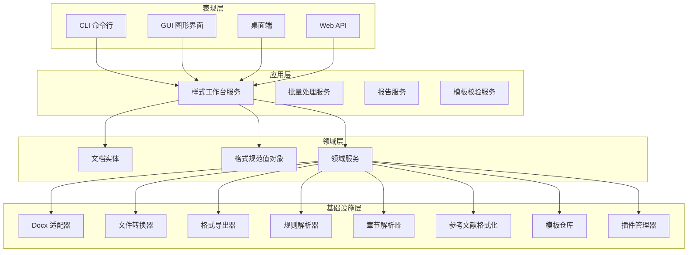
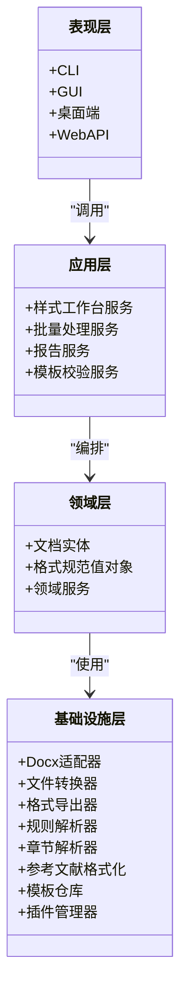
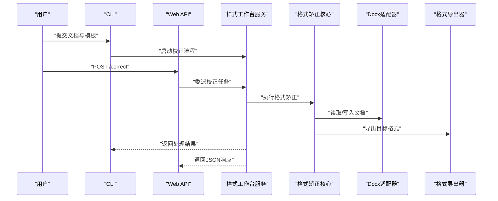
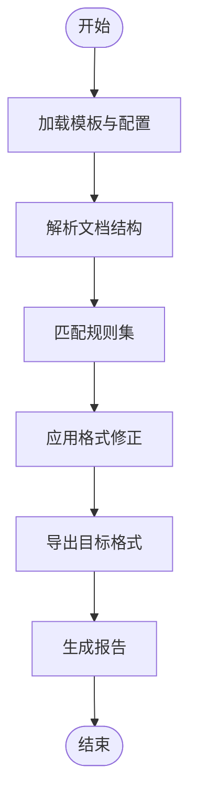
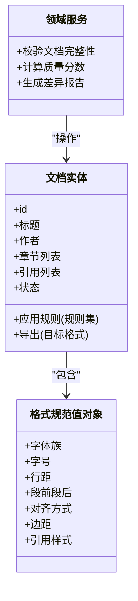
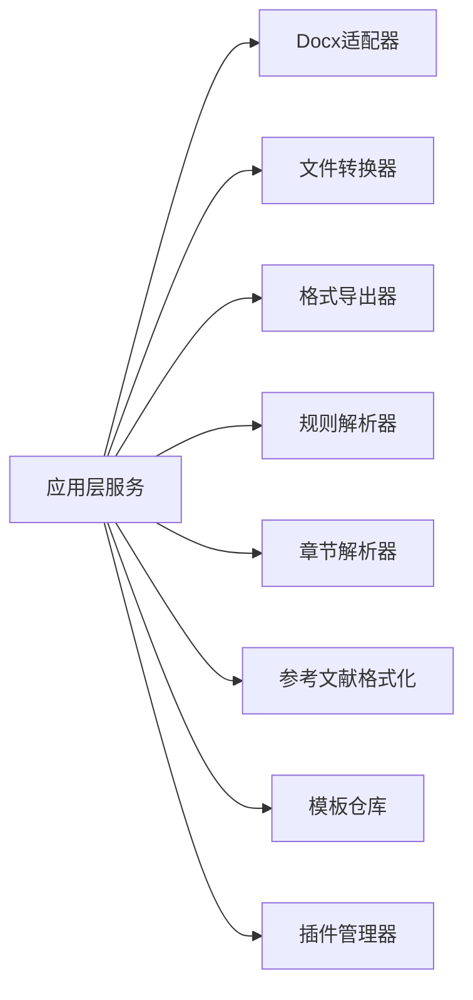
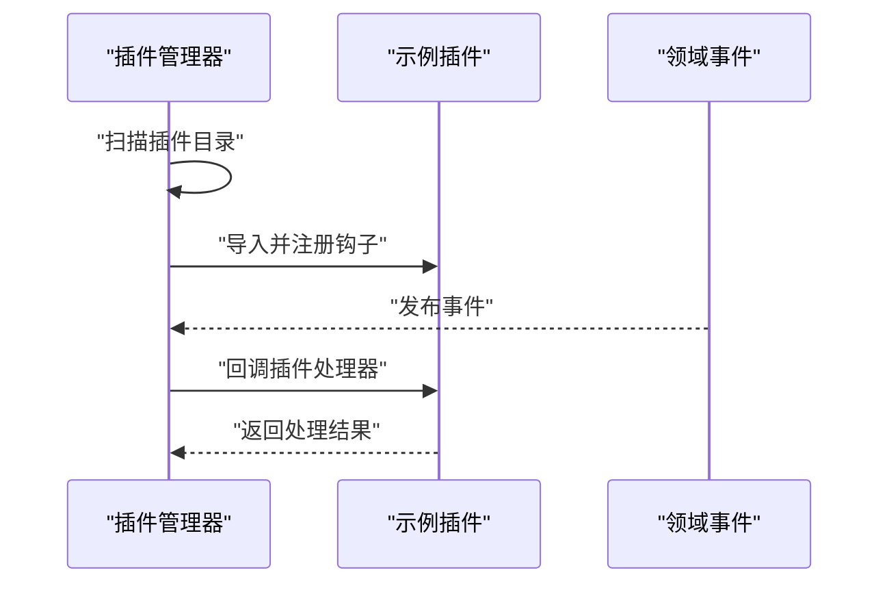
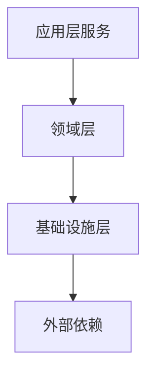

# 架构概览

<cite>
**本文引用的文件**   
- [src/paper_format_corrector/app.py](file://src/paper_format_corrector/app.py)
- [src/paper_format_corrector/cli.py](file://src/paper_format_corrector/cli.py)
- [src/paper_format_corrector/gui.py](file://src/paper_format_corrector/gui.py)
- [src/paper_format_corrector/desktop_gui.py](file://src/paper_format_corrector/desktop_gui.py)
- [src/paper_format_corrector/api/app.py](file://src/paper_format_corrector/api/app.py)
- [src/paper_format_corrector/interfaces/api/routes/__init__.py](file://src/paper_format_corrector/interfaces/api/routes/__init__.py)
- [src/paper_format_corrector/application/services/style_workbench.py](file://src/paper_format_corrector/application/services/style_workbench.py)
- [src/paper_format_corrector/application/services/batch_service.py](file://src/paper_format_corrector/application/services/batch_service.py)
- [src/paper_format_corrector/application/services/report_service.py](file://src/paper_format_corrector/application/services/report_service.py)
- [src/paper_format_corrector/application/services/template_validation_service.py](file://src/paper_format_corrector/application/services/template_validation_service.py)
- [src/paper_format_corrector/core/format_corrector.py](file://src/paper_format_corrector/core/format_corrector.py)
- [src/paper_format_corrector/core/doc_generator.py](file://src/paper_format_corrector/core/doc_generator.py)
- [src/paper_format_corrector/domain/entities/document.py](file://src/paper_format_corrector/domain/entities/document.py)
- [src/paper_format_corrector/domain/value_objects/format_spec.py](file://src/paper_format_corrector/domain/value_objects/format_spec.py)
- [src/paper_format_corrector/infrastructure/adapters/docx_adapter.py](file://src/paper_format_corrector/infrastructure/adapters/docx_adapter.py)
- [src/paper_format_corrector/infrastructure/converters/file_converter.py](file://src/paper_format_corrector/infrastructure/converters/file_converter.py)
- [src/paper_format_corrector/infrastructure/exporters/format_exporter.py](file://src/paper_format_corrector/infrastructure/exporters/format_exporter.py)
- [src/paper_format_corrector/infrastructure/parsers/rule_parser.py](file://src/paper_format_corrector/infrastructure/parsers/rule_parser.py)
- [src/paper_format_corrector/infrastructure/parsers/section_parser.py](file://src/paper_format_corrector/infrastructure/parsers/section_parser.py)
- [src/paper_format_corrector/infrastructure/parsers/reference_formatter.py](file://src/paper_format_corrector/infrastructure/parsers/reference_formatter.py)
- [src/paper_format_corrector/infrastructure/template_repository.py](file://src/paper_format_corrector/infrastructure/template_repository.py)
- [src/paper_format_corrector/infra/plugin_manager.py](file://src/paper_format_corrector/infra/plugin_manager.py)
- [plugins/example_word_count_plugin.py](file://plugins/example_word_count_plugin.py)
- [config/config.yaml](file://config/config.yaml)
- [presets/templates_index.yaml](file://presets/templates_index.yaml)
</cite>

## 目录
1. [简介](#简介)
2. [项目结构](#项目结构)
3. [核心组件](#核心组件)
4. [架构总览](#架构总览)
5. [详细组件分析](#详细组件分析)
6. [依赖关系分析](#依赖关系分析)
7. [性能考量](#性能考量)
8. [故障排查指南](#故障排查指南)
9. [结论](#结论)
10. [附录](#附录)

## 简介
本文件为“论文格式矫正工具”的架构概览，面向开发者与架构师，系统性阐述分层架构、领域驱动设计（DDD）实践、关键设计模式、组件交互与数据流、可扩展性与插件机制，以及技术栈与架构决策。目标是帮助读者快速理解系统全貌并指导后续扩展与维护。

## 项目结构
项目采用清晰的分层与模块化组织：
- 表现层（Interfaces）：CLI、GUI、桌面端、Web API 等用户入口
- 应用层（Application）：编排业务流程的服务（如样式工作台、批量处理、报告生成、模板校验）
- 领域层（Domain）：实体、值对象、领域服务，承载核心业务不变式
- 基础设施层（Infrastructure/Infra）：外部依赖集成（文档解析、转换、导出、模板仓库、插件管理、远程协作、更新器等）

图表来源
- [src/paper_format_corrector/app.py](file://src/paper_format_corrector/app.py)
- [src/paper_format_corrector/cli.py](file://src/paper_format_corrector/cli.py)
- [src/paper_format_corrector/gui.py](file://src/paper_format_corrector/gui.py)
- [src/paper_format_corrector/desktop_gui.py](file://src/paper_format_corrector/desktop_gui.py)
- [src/paper_format_corrector/api/app.py](file://src/paper_format_corrector/api/app.py)
- [src/paper_format_corrector/application/services/style_workbench.py](file://src/paper_format_corrector/application/services/style_workbench.py)
- [src/paper_format_corrector/core/format_corrector.py](file://src/paper_format_corrector/core/format_corrector.py)
- [src/paper_format_corrector/infrastructure/adapters/docx_adapter.py](file://src/paper_format_corrector/infrastructure/adapters/docx_adapter.py)
- [src/paper_format_corrector/infrastructure/converters/file_converter.py](file://src/paper_format_corrector/infrastructure/converters/file_converter.py)
- [src/paper_format_corrector/infrastructure/exporters/format_exporter.py](file://src/paper_format_corrector/infrastructure/exporters/format_exporter.py)
- [src/paper_format_corrector/infrastructure/parsers/rule_parser.py](file://src/paper_format_corrector/infrastructure/parsers/rule_parser.py)
- [src/paper_format_corrector/infrastructure/parsers/section_parser.py](file://src/paper_format_corrector/infrastructure/parsers/section_parser.py)
- [src/paper_format_corrector/infrastructure/parsers/reference_formatter.py](file://src/paper_format_corrector/infrastructure/parsers/reference_formatter.py)
- [src/paper_format_corrector/infrastructure/template_repository.py](file://src/paper_format_corrector/infrastructure/template_repository.py)
- [src/paper_format_corrector/infra/plugin_manager.py](file://src/paper_format_corrector/infra/plugin_manager.py)

章节来源
- [src/paper_format_corrector/app.py](file://src/paper_format_corrector/app.py)
- [src/paper_format_corrector/cli.py](file://src/paper_format_corrector/cli.py)
- [src/paper_format_corrector/gui.py](file://src/paper_format_corrector/gui.py)
- [src/paper_format_corrector/desktop_gui.py](file://src/paper_format_corrector/desktop_gui.py)
- [src/paper_format_corrector/api/app.py](file://src/paper_format_corrector/api/app.py)

## 核心组件
- 表现层入口
  - CLI：提供命令行参数解析与任务调度
  - GUI/桌面端：基于图形界面的交互式操作
  - Web API：RESTful 接口暴露校正能力
- 应用层服务
  - 样式工作台：编排文档解析、规则匹配、格式修正、导出流程
  - 批量处理：队列化执行多文档任务
  - 报告服务：生成质量评估与差异报告
  - 模板校验：验证模板配置与兼容性
- 领域层
  - 文档实体：表示待处理的论文文档及其状态
  - 格式规范值对象：不可变的格式约束集合
  - 领域服务：封装跨实体的业务规则
- 基础设施层
  - 文档适配器：对 docx/pdf 等格式的读写适配
  - 转换器/导出器：格式互转与目标输出
  - 解析器：规则、章节、参考文献等结构化解析
  - 模板仓库：本地/远端模板加载与缓存
  - 插件管理器：动态发现与生命周期管理

章节来源
- [src/paper_format_corrector/application/services/style_workbench.py](file://src/paper_format_corrector/application/services/style_workbench.py)
- [src/paper_format_corrector/application/services/batch_service.py](file://src/paper_format_corrector/application/services/batch_service.py)
- [src/paper_format_corrector/application/services/report_service.py](file://src/paper_format_corrector/application/services/report_service.py)
- [src/paper_format_corrector/application/services/template_validation_service.py](file://src/paper_format_corrector/application/services/template_validation_service.py)
- [src/paper_format_corrector/core/format_corrector.py](file://src/paper_format_corrector/core/format_corrector.py)
- [src/paper_format_corrector/core/doc_generator.py](file://src/paper_format_corrector/core/doc_generator.py)
- [src/paper_format_corrector/domain/entities/document.py](file://src/paper_format_corrector/domain/entities/document.py)
- [src/paper_format_corrector/domain/value_objects/format_spec.py](file://src/paper_format_corrector/domain/value_objects/format_spec.py)
- [src/paper_format_corrector/infrastructure/adapters/docx_adapter.py](file://src/paper_format_corrector/infrastructure/adapters/docx_adapter.py)
- [src/paper_format_corrector/infrastructure/converters/file_converter.py](file://src/paper_format_corrector/infrastructure/converters/file_converter.py)
- [src/paper_format_corrector/infrastructure/exporters/format_exporter.py](file://src/paper_format_corrector/infrastructure/exporters/format_exporter.py)
- [src/paper_format_corrector/infrastructure/parsers/rule_parser.py](file://src/paper_format_corrector/infrastructure/parsers/rule_parser.py)
- [src/paper_format_corrector/infrastructure/parsers/section_parser.py](file://src/paper_format_corrector/infrastructure/parsers/section_parser.py)
- [src/paper_format_corrector/infrastructure/parsers/reference_formatter.py](file://src/paper_format_corrector/infrastructure/parsers/reference_formatter.py)
- [src/paper_format_corrector/infrastructure/template_repository.py](file://src/paper_format_corrector/infrastructure/template_repository.py)
- [src/paper_format_corrector/infra/plugin_manager.py](file://src/paper_format_corrector/infra/plugin_manager.py)

## 架构总览
系统遵循分层架构与 DDD 原则，通过清晰的边界与契约降低耦合度，提升可测试性与可维护性。

图表来源
- [src/paper_format_corrector/app.py](file://src/paper_format_corrector/app.py)
- [src/paper_format_corrector/application/services/style_workbench.py](file://src/paper_format_corrector/application/services/style_workbench.py)
- [src/paper_format_corrector/domain/entities/document.py](file://src/paper_format_corrector/domain/entities/document.py)
- [src/paper_format_corrector/infrastructure/adapters/docx_adapter.py](file://src/paper_format_corrector/infrastructure/adapters/docx_adapter.py)

## 详细组件分析

### 表现层（CLI/GUI/Web API）
- CLI：负责参数解析、命令路由、进度反馈与错误上报
- GUI/桌面端：提供可视化工作区、预览与一键校正
- Web API：定义 REST 路由，接收请求、委派至应用层服务并返回结果

图表来源
- [src/paper_format_corrector/cli.py](file://src/paper_format_corrector/cli.py)
- [src/paper_format_corrector/gui.py](file://src/paper_format_corrector/gui.py)
- [src/paper_format_corrector/desktop_gui.py](file://src/paper_format_corrector/desktop_gui.py)
- [src/paper_format_corrector/api/app.py](file://src/paper_format_corrector/api/app.py)
- [src/paper_format_corrector/application/services/style_workbench.py](file://src/paper_format_corrector/application/services/style_workbench.py)
- [src/paper_format_corrector/core/format_corrector.py](file://src/paper_format_corrector/core/format_corrector.py)
- [src/paper_format_corrector/infrastructure/adapters/docx_adapter.py](file://src/paper_format_corrector/infrastructure/adapters/docx_adapter.py)
- [src/paper_format_corrector/infrastructure/exporters/format_exporter.py](file://src/paper_format_corrector/infrastructure/exporters/format_exporter.py)

章节来源
- [src/paper_format_corrector/cli.py](file://src/paper_format_corrector/cli.py)
- [src/paper_format_corrector/gui.py](file://src/paper_format_corrector/gui.py)
- [src/paper_format_corrector/desktop_gui.py](file://src/paper_format_corrector/desktop_gui.py)
- [src/paper_format_corrector/api/app.py](file://src/paper_format_corrector/api/app.py)
- [src/paper_format_corrector/interfaces/api/routes/__init__.py](file://src/paper_format_corrector/interfaces/api/routes/__init__.py)

### 应用层（业务服务）
- 样式工作台：串联解析、规则匹配、修正、导出；协调领域实体与基础设施
- 批量处理：任务入队、并发控制、失败重试与汇总报告
- 报告服务：生成差异对比、质量评分与建议
- 模板校验：校验模板语法、字段完整性与兼容策略

图表来源
- [src/paper_format_corrector/application/services/style_workbench.py](file://src/paper_format_corrector/application/services/style_workbench.py)
- [src/paper_format_corrector/application/services/batch_service.py](file://src/paper_format_corrector/application/services/batch_service.py)
- [src/paper_format_corrector/application/services/report_service.py](file://src/paper_format_corrector/application/services/report_service.py)
- [src/paper_format_corrector/application/services/template_validation_service.py](file://src/paper_format_corrector/application/services/template_validation_service.py)

章节来源
- [src/paper_format_corrector/application/services/style_workbench.py](file://src/paper_format_corrector/application/services/style_workbench.py)
- [src/paper_format_corrector/application/services/batch_service.py](file://src/paper_format_corrector/application/services/batch_service.py)
- [src/paper_format_corrector/application/services/report_service.py](file://src/paper_format_corrector/application/services/report_service.py)
- [src/paper_format_corrector/application/services/template_validation_service.py](file://src/paper_format_corrector/application/services/template_validation_service.py)

### 领域层（DDD：实体、值对象、聚合根）
- 文档实体：承载文档元信息、内容片段、状态与变更历史
- 格式规范值对象：不可变格式约束（字体、段落、页眉页脚、引用等）
- 聚合根：以文档为核心聚合，保证一致性边界与事务语义

图表来源
- [src/paper_format_corrector/domain/entities/document.py](file://src/paper_format_corrector/domain/entities/document.py)
- [src/paper_format_corrector/domain/value_objects/format_spec.py](file://src/paper_format_corrector/domain/value_objects/format_spec.py)

章节来源
- [src/paper_format_corrector/domain/entities/document.py](file://src/paper_format_corrector/domain/entities/document.py)
- [src/paper_format_corrector/domain/value_objects/format_spec.py](file://src/paper_format_corrector/domain/value_objects/format_spec.py)

### 基础设施层（外部依赖集成）
- Docx 适配器：抽象文档读写细节，屏蔽底层库差异
- 文件转换器：在 docx/pdf/latex 等格式间转换
- 格式导出器：按目标格式进行渲染与输出
- 解析器：规则解析、章节识别、参考文献格式化
- 模板仓库：模板索引、版本管理与缓存
- 插件管理器：插件发现、注册、生命周期与事件分发

图表来源
- [src/paper_format_corrector/infrastructure/adapters/docx_adapter.py](file://src/paper_format_corrector/infrastructure/adapters/docx_adapter.py)
- [src/paper_format_corrector/infrastructure/converters/file_converter.py](file://src/paper_format_corrector/infrastructure/converters/file_converter.py)
- [src/paper_format_corrector/infrastructure/exporters/format_exporter.py](file://src/paper_format_corrector/infrastructure/exporters/format_exporter.py)
- [src/paper_format_corrector/infrastructure/parsers/rule_parser.py](file://src/paper_format_corrector/infrastructure/parsers/rule_parser.py)
- [src/paper_format_corrector/infrastructure/parsers/section_parser.py](file://src/paper_format_corrector/infrastructure/parsers/section_parser.py)
- [src/paper_format_corrector/infrastructure/parsers/reference_formatter.py](file://src/paper_format_corrector/infrastructure/parsers/reference_formatter.py)
- [src/paper_format_corrector/infrastructure/template_repository.py](file://src/paper_format_corrector/infrastructure/template_repository.py)
- [src/paper_format_corrector/infra/plugin_manager.py](file://src/paper_format_corrector/infra/plugin_manager.py)

章节来源
- [src/paper_format_corrector/infrastructure/adapters/docx_adapter.py](file://src/paper_format_corrector/infrastructure/adapters/docx_adapter.py)
- [src/paper_format_corrector/infrastructure/converters/file_converter.py](file://src/paper_format_corrector/infrastructure/converters/file_converter.py)
- [src/paper_format_corrector/infrastructure/exporters/format_exporter.py](file://src/paper_format_corrector/infrastructure/exporters/format_exporter.py)
- [src/paper_format_corrector/infrastructure/parsers/rule_parser.py](file://src/paper_format_corrector/infrastructure/parsers/rule_parser.py)
- [src/paper_format_corrector/infrastructure/parsers/section_parser.py](file://src/paper_format_corrector/infrastructure/parsers/section_parser.py)
- [src/paper_format_corrector/infrastructure/parsers/reference_formatter.py](file://src/paper_format_corrector/infrastructure/parsers/reference_formatter.py)
- [src/paper_format_corrector/infrastructure/template_repository.py](file://src/paper_format_corrector/infrastructure/template_repository.py)
- [src/paper_format_corrector/infra/plugin_manager.py](file://src/paper_format_corrector/infra/plugin_manager.py)

### 设计模式应用
- 策略模式：不同导出器/转换器/解析器作为策略实现，便于替换与扩展
- 工厂模式：根据模板或配置创建对应的解析器/转换器实例
- 观察者模式：插件管理器监听领域事件（如文档解析完成、规则命中），触发插件回调
- 适配器模式：Docx 适配器屏蔽底层库差异，统一对外接口
- 模板方法：样式工作台编排固定流程，子类/策略定制具体步骤

章节来源
- [src/paper_format_corrector/infrastructure/exporters/format_exporter.py](file://src/paper_format_corrector/infrastructure/exporters/format_exporter.py)
- [src/paper_format_corrector/infrastructure/converters/file_converter.py](file://src/paper_format_corrector/infrastructure/converters/file_converter.py)
- [src/paper_format_corrector/infrastructure/parsers/rule_parser.py](file://src/paper_format_corrector/infrastructure/parsers/rule_parser.py)
- [src/paper_format_corrector/infrastructure/adapters/docx_adapter.py](file://src/paper_format_corrector/infrastructure/adapters/docx_adapter.py)
- [src/paper_format_corrector/infra/plugin_manager.py](file://src/paper_format_corrector/infra/plugin_manager.py)

### 可扩展性与插件机制
- 插件发现：扫描指定目录，加载符合约定的模块
- 插件注册：向插件管理器注册钩子（解析前后、导出前后、报告生成等）
- 事件分发：领域事件发布，订阅者按需处理
- 示例插件：字数统计插件演示如何接入

图表来源
- [src/paper_format_corrector/infra/plugin_manager.py](file://src/paper_format_corrector/infra/plugin_manager.py)
- [plugins/example_word_count_plugin.py](file://plugins/example_word_count_plugin.py)

章节来源
- [src/paper_format_corrector/infra/plugin_manager.py](file://src/paper_format_corrector/infra/plugin_manager.py)
- [plugins/example_word_count_plugin.py](file://plugins/example_word_count_plugin.py)

### 技术栈与架构决策
- Python 生态：docx 读写、PDF/LaTeX 导出、HTTP 框架、异步任务队列
- 分层与 DDD：明确边界，降低耦合，提升可测试性与演进能力
- 插件化：通过策略与观察者模式支持功能扩展与第三方集成
- 模板驱动：集中化管理模板与规则，支持多机构/会议标准

[本节为通用讨论，不直接分析具体文件]

## 依赖关系分析
- 组件内聚与耦合
  - 应用层仅依赖领域层接口，避免直接访问基础设施
  - 领域层不感知外部实现，通过适配器与解析器间接依赖
- 外部依赖
  - 文档库（docx/pdf）、HTTP 服务、文件系统、模板仓库
- 潜在循环依赖
  - 通过接口隔离与事件解耦避免循环引用

图表来源
- [src/paper_format_corrector/application/services/style_workbench.py](file://src/paper_format_corrector/application/services/style_workbench.py)
- [src/paper_format_corrector/domain/entities/document.py](file://src/paper_format_corrector/domain/entities/document.py)
- [src/paper_format_corrector/infrastructure/adapters/docx_adapter.py](file://src/paper_format_corrector/infrastructure/adapters/docx_adapter.py)

章节来源
- [src/paper_format_corrector/application/services/style_workbench.py](file://src/paper_format_corrector/application/services/style_workbench.py)
- [src/paper_format_corrector/domain/entities/document.py](file://src/paper_format_corrector/domain/entities/document.py)
- [src/paper_format_corrector/infrastructure/adapters/docx_adapter.py](file://src/paper_format_corrector/infrastructure/adapters/docx_adapter.py)

## 性能考量
- 解析与转换阶段尽量惰性加载与分块处理，减少内存峰值
- 批量任务采用队列与并发控制，避免资源争用
- 模板与规则缓存，减少重复 IO 与解析开销
- 导出阶段按需渲染，避免不必要的重排与重绘

[本节为通用指导，不直接分析具体文件]

## 故障排查指南
- 常见问题定位
  - 模板加载失败：检查模板索引与路径安全策略
  - 解析异常：查看规则与章节解析日志，确认输入文档结构
  - 导出失败：核对目标格式支持与导出器配置
- 诊断建议
  - 启用详细日志与差异报告
  - 使用最小复现用例与隔离测试
  - 逐步禁用插件定位冲突点

章节来源
- [src/paper_format_corrector/infrastructure/template_repository.py](file://src/paper_format_corrector/infrastructure/template_repository.py)
- [src/paper_format_corrector/infrastructure/parsers/rule_parser.py](file://src/paper_format_corrector/infrastructure/parsers/rule_parser.py)
- [src/paper_format_corrector/infrastructure/exporters/format_exporter.py](file://src/paper_format_corrector/infrastructure/exporters/format_exporter.py)

## 结论
本架构通过分层与 DDD 明确职责边界，结合策略、工厂、观察者与适配器模式，构建了高内聚、低耦合、易扩展的系统。插件机制与模板驱动进一步增强了灵活性与可维护性，适合持续演进与多场景落地。

[本节为总结性内容，不直接分析具体文件]

## 附录
- 配置与模板
  - 全局配置：config.yaml
  - 模板索引：presets/templates_index.yaml

章节来源
- [config/config.yaml](file://config/config.yaml)
- [presets/templates_index.yaml](file://presets/templates_index.yaml)